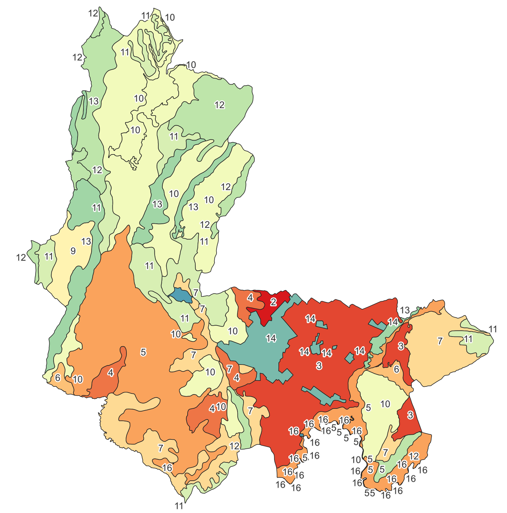

# Curso taller de Sistemas de Información Geográfica aplicados a Ordenamiento Territorial (OT) - SIGE  
Keywords: `gis` `urban-planning` `digital-elevation-model` `hazard-detection` `soil-mapping` `population-dynamics` `arcgis-pro` `qgis` `rural-development` `urban-development` 

_Bienvenido al Curso taller de Sistemas de Información Geográfica aplicados a Ordenamiento Territorial (OT) - SIGE. A través de talleres orientados a la solución de un caso de estudio general y con el apoyo técnico de instructores y monitores (dependiendo del número de inscritos), los participantes desarrollarán un proyecto de clase que les permitirá crear el prototipo de un sistema de información geográfica para la gestión del ordenamiento territorial._

**"Los procesos de toma de decisión orientados a la gestión del ordenamiento territorial requieren conocimientos y habilidades en el uso y manejo de sistemas de información geográfica. En este curso, el participante aprenderá a recopilar, integrar, relacionar y analizar información espacial y alfanumérica de una forma ágil y asertiva".**

Los sistemas de información geográfica (SIG o GIS en inglés) se han convertido en herramientas indispensables para el análisis y respaldo en la toma de decisiones para la solución de problemas complejos, debido a que el uso de la información se realiza de forma espacial y dinámica, lo cual hace posible representar de forma esquemática, muy próxima a la realidad, el ambiente natural y el entorno construido. Los SIG permiten interactuar eficientemente con información no espacial; de ahí la importancia de su aplicación en la gestión del ordenamiento territorial.

> En concordancia con la Ley 388 de 1997, los municipios deben realizar un proceso de carácter técnico, participativo y jurídico, y de sus decretos reglamentarios, para actualizar, modificar o ajustar los contenidos y normas de sus planes de ordenamiento territorial, de tal forma que aseguren la construcción efectiva del modelo de ocupación territorial adoptado por el municipio en dichos planes. Para estructurar dicho proceso se debe crear de forma colaborativa un sistema de información geográfica municipal que coadyuve a optimizar el manejo de la información de los diferentes sectores y respalde la toma de decisiones en el ámbito intramunicipal, intermunicipal y departamental. _Tomado de: Cartilla de lineamientos para el uso de información geográfica en el desarrollo del componente rural de los planes de ordenamiento territorial (POT). Evamaría Uribe Tobón, directora general del Instituto Geográfico Agustín Codazzi_.

El uso de las tecnologías de la información (TI) y en específico las relacionadas con los sistemas de información geográfica (SIG), se han convertido en herramientas esenciales para ordenar y gestionar el territorio. Su implementación a nivel municipal enfrenta diferentes retos, pero también ofrece diferentes oportunidades, desde la revisión de los planes de ordenamiento territorial (POT) utilizando información precisa y adecuada a nivel local y regional, hasta su seguimiento y evaluación para la toma informada de decisiones.

**Al finalizar este curso taller, el asistente dispondrá de un modelo geográfico general (creado a lo largo del curso), podrá continuar implementando nuevos componentes a la base de datos construida y podrá fortalecer las gestiones relacionadas con el ordenamiento territorial de su municipio o del caso de estudio asignado.**

## Objetivos

Para el cumplimiento de los objetivos del curso, en el primer módulo se abordarán los conceptos básicos generales para el estudio, implementación y seguimiento de planes de ordenamiento usando herramientas SIG, como son los de topografía, geografía y georreferenciación, además del estudio general poblacional del caso de estudio que se desarrollará durante el curso. En el segundo módulo se evaluará la conformación geopolítica territorial municipal, se analizará el cubrimiento de la red vial municipal, se revisará el modelo de ordenamiento territorial y se verificarán las propiedades geométricas de los mapas base. El módulo 3 inicia con la reconstrucción de los polígonos definidos en las tablas geocodificadas del acuerdo o decreto municipal, la generación de corredores viales a partir de los perfiles definidos evaluando construcciones afectadas y análisis de la cobertura de las redes de estaciones hidroclimatológicas. Para la integración de las capas recopiladas, en el módulo 4 se creará una base de datos espacial para luego, a través de la definición de dominios, estudiar las destinaciones económicas catastrales y su relación con las áreas de actividad definidas en el POT, complementando con el análisis de índices de ocupación y construcción. Un aspecto importante al evaluar las zonas de amenaza y riesgo es el conocimiento detallado de la geografía local y regional a través de la descarga, procesamiento y análisis de modelos digitales de elevación, mapas geológicos y de suelos, contenidos que se abordarán en el módulo 5. El módulo 6 comprende el análisis de imágenes satelitales multiespectrales para la identificación y clasificación de coberturas vegetales, localización de cuerpos de agua y delimitación de zonas urbanas para evaluar su correspondencia con las áreas de actividad definidas en el POT. Después se realizá un análisis hidroclimatológico multitemporal a partir de datos satelitales en formato científico. En el módulo 7 se completará el alcance del curso realizando mapas de estudio de amenazas naturales, modelación de redes de transporte para analizar la localización de equipamientos y el procesamiento fotogramétrico y Lidar para identificación de volumetrías y nuevas construcciones.

### Principal

Ofrecer a los participantes el conocimiento general y detallado de los SIG orientados a la gestión del ordenamiento territorial, mediante el uso y manejo de herramientas computacionales comerciales y públicas cómo Esri ArcGIS® y QGIS.

### Específicos

* Diseñar, crear y editar un sistema de información geográfico en bases de datos espaciales, a partir de procesos de digitalización directa o desde medios digitales obtenidos de fuentes de información pública.
* Obtener habilidades en el manejo de representación gráfica de elementos geográficos desde visores, así como el diseño de plantillas para generación de mapas temáticos cartográficos digitales e impresos.
* Buscar, seleccionar y filtrar entidades espaciales y atributos de forma fácil y precisa. El participante además podrá ejecutar procesos de cálculo y difusión de atributos a partir de expresiones sencillas en SQL, Visual Basic, Python y Arcade.
* Obtener conocimientos para el análisis de información geográfica por medio de búsquedas simples y complejas, proximidad, sobreimposición y unión de datos espaciales con bases de datos externas.
* Descargar, procesar y analizar modelos de terreno e imágenes ráster a partir de sensores remotos e información satelital.
* Analizar y resolver redes de tránsito con Network Analyst de ArcGIS, para la evaluación de la localización de los equipamientos urbanos y rurales.
* Realizar el procesamiento fotogramétrico de imágenes y levantamientos Lidar, para la obtención de modelos digitales de elevación a partir de información capturada con drones.

## Metodología

El curso se desarrolla a través de talleres prácticos que requieren de lecturas previas de conceptos generales. Dependiendo de tipo de estudiante (Educación continuada o estudiante regular en programas de pregrado o posgrado), el estudiante presenta pruebas de conocimiento y\o habilidad y desarrolla el proyecto de clase a partir de casos de estudios particulares.

| Actividad                                | Descripción                                                                                                                                                                                                                                                                                                                                                                                                                                                                                                                  | Educación continuada | Pregrado Posgrado | 
|:-----------------------------------------|:-----------------------------------------------------------------------------------------------------------------------------------------------------------------------------------------------------------------------------------------------------------------------------------------------------------------------------------------------------------------------------------------------------------------------------------------------------------------------------------------------------------------------------|:-----------------------:|:--------------------:|
| Lecturas de conceptos generales          | Antes del inicio de cada sesión, el estudiante realiza las lecturas asignadas relacionadas con los conceptos generales del curso y las guías de desarrollo de cada taller. Al inicio de cada clase se realiza una revisión general de los conceptos a abordar en cada taller.                                                                                                                                                                                                                                                |            ✓            |          ✓           |
| Quiz de conocimiento y/o habilidad       | Evaluación individual de conceptos y habilidades aprendidas. El desarrollo de estas pruebas le permite al estudiante conocer en qué temas requiere realizar reforzamiento de los conceptos y habilidades aprendidas                                                                                                                                                                                                                                                                                                          |        Opcional         |          ✓           |
| Taller práctico                          | En cada módulo se desarrolla un taller práctico individual a partir de un caso de estudio general.                                                                                                                                                                                                                                                                                                                                                                                                                           |        Opcional         |       Opcional       |
| Proyecto final                           | A partir de los conocimientos y habilidades obtenidas en cada taller, los grupos de estudiantes desarrollan el avance del proyecto final, cuyos casos de estudio son definidos al inicio del curso. La conformación de grupos podrá ser realizada por funcionarios de un mismo municipio y/o con estudiantes regulares del Programa de Ingeniería Civil e Ingeniería Ambiental de la Universidad Escuela Colombiana de Ingeniería (solo si han inscrito la asignatura SIGE en el horario del curso de Educación Continuada). |        Opcional         |          ✓           |
| Consejería académica individual o grupal | Previo a cada clase, el estudiante preparara los contenidos asignados para cada sesión, durante el horario regular de clase se realiza la explicación general de cada taller y fuera del horario de clase y a través de un chat directo por Microsoft Teams, los estudiantes pueden solicitar consejerías académicas y/o soporte de las herramientas computacionales a utilizar, para así completar los talleres y el proyecto final. (Aplica solo para estudiantes inscritos bajo modalidad de certificación.)              |        Opcional         |       Opcional       |

> En la tabla, las columnas de la derecha indican si el estudiante debe o no presentar o realizar las actividades. Estudiantes de Educación Continuada requieren de al menos la asistencia a clase y realizar las lecturas de conceptos generales, las demás actividades son opcionales, sin embargo, se recomienda desarrollar las actividades del proyecto para al finar del curso disponer de un sistema básico de información geográfica aplicado. Estudiantes de Pregrado y Posgrado deben desarrollar obligatoriamente las entregas de proyecto y quices de conocimiento y habilidad y opcionalmente pueden desarrollar las actividades desarrolladas en clase correspondientes al caso de estudio general.

## Dirigido a

Los contenidos presentados en este curso están dirigidos a funcionarios públicos, estudiantes y profesionales de diferentes disciplinas que requieran aprender y/o fortalecer sus conocimientos en el uso de sistemas de información geográfica, tales como:

* Estudiantes de pregrado y posgrado en ingeniería o arquitectura.
* Ingenieros, arquitectos y especialistas.
* Técnicos y tecnólogos en ingeniería civil, arquitectura y profesiones afines.
* Funcionarios públicos y/o gestores territoriales en carrera administrativa, consultores, contratistas y asesores municipales

Requisitos académicos: 

* Conocimientos básicos en computación y ofimática.
* Conocimientos básicos de geografía. 
* Conocimientos básicos de estadística.

> Para tomar este curso, no requiere de conocimientos específicos o certificaciones previas en el uso de herramientas computacionales SIG, tales como ArcGIS Pro o QGIS.

## Software requerido y estructura de directorios

Para el desarrollo del curso, son requeridas las siguientes herramientas:

* [:toolbox:Herramienta](https://www.office.com/): Microsoft Office 365.
* [:toolbox:Herramienta](https://www.esri.com/en-us/arcgis/products/arcgis-pro/overview): ESRI ArcGIS Pro 3.3.1 o superior.
* [:toolbox:Herramienta](https://qgis.org/): QGIS 3.38 o superior.
* [:toolbox:Herramienta](https://notepad-plus-plus.org/): Notepad++.
* [:toolbox:Herramienta](https://www.itc.nl/ilwis/download/): ILWIS 3.3.
* [:open_file_folder:Estructura de directorios](file/Readme.md)

## Caso de estudio general y grupos de proyecto

El curso y sus diferentes talleres prácticos, se ejemplifican a través de un caso de estudio general correspondiente al **"Análisis topográfico, geográfico, catastral, climatológico, vial y de ordenamiento territorial del Municipio de Zipaquirá Cundinamarca"**. Luego, a partir de los conocimientos y habilidades obtenidas, cada estudiante o grupo de estudiantes, desarrollan las mismas actividades a través de un proyecto de clase el cual es definido para casos de estudios particulares.

[:busts_in_silhouette:Consulte aquí](file/temp/ProjectGroup.md) el código de grupo, integrantes y alcance de los casos de estudio particulares.

 Áreas homogéneas de tierra - Municipio de Zipaquirá (norte hacia arriba) Tomado de: <a href="https://www.colombiaenmapas.gov.co">https://www.colombiaenmapas.gov.co</a>  

## :globe_with_meridians:Módulo I – Introducción y nivelación de conceptos generales de SIG y OT (3 horas)

En este módulo se abordan conceptos básicos de topografía, conceptos básicos de fotogrametría y fotointerpretación, uso y manejo de mapas topográficos y temáticos (cartografía), georreferenciación y sistemas de proyección de coordenadas y se estudia el componente normativo relacionado con ordenamiento territorial. En cuanto a su aplicabilidad, realizaremos la definición de casos de estudio, el estudio del ordenamiento territorial local a partir de Acuerdos o Decretos y cartografía digital, y evaluaremos los censos poblacionales para realizar proyecciones de población.

| Actividad                                                                                                                     | Alcance                                                                                                                                                                                                                                                                                                                                                                                                                                                                                                                                                                                                                                                                                                                                | 
|:------------------------------------------------------------------------------------------------------------------------------|:---------------------------------------------------------------------------------------------------------------------------------------------------------------------------------------------------------------------------------------------------------------------------------------------------------------------------------------------------------------------------------------------------------------------------------------------------------------------------------------------------------------------------------------------------------------------------------------------------------------------------------------------------------------------------------------------------------------------------------------|
| [Auto-presentación individual ](https://forms.office.com/r/NhgAUZkPFP)                                                        | El diligenciamiento completo de la auto-presentación nos permite conocer su perfil académico y profesional, saber con qué recursos informáticos cuenta para preparar y desarrollar las pruebas técnicas asignadas y avances de proyecto, conocer sus conocimientos generales en el uso de herramientas computacionales, lenguajes de programación, métodos de estudio y habilidades.                                                                                                                                                                                                                                                                                                                                                   | 
| [Conformación de grupos, caso de estudio propio y creación de repositorio de proyecto](https://forms.office.com/r/kQMcvm3awd) | Al inicio del curso se conforman los grupos de trabajo, se define su caso de estudio y se crea y reporta el repositorio (GitHUB, OneDrive, Google Drive...) para el almacenamiento de los avances en el desarrollo del proyecto de clase. Tenga en cuenta que el repositorio es creado por uno de los integrantes del grupo y se reporta una única vez al inicio del curso, se debe mantener activo hasta que el proyecto final sea completamente revisado y calificado.                                                                                                                                                                                                                                                               | 
| [Conceptos básicos de topografía, fotogrametría y fotointerpretación](activity/TopoBasic/Readme.md)                           | ¿Qué es la Topografía? Ramas principales de la topografía. Estudio de la topografía.                                                                                                                                                                                                                                                                                                                                                                                                                                                                                                                                                                                                                                                   | 
| [Conceptos básicos de SIG](activity/GISBasic/Readme.md)                                                                       | Historia de los SIG como ciencia. Ciencias y tecnologías relacionadas. ¿Qué es un SIG? Ventajas y desafíos de los SIG. Aplicación y utilidad. Calidad de los datos. Funciones de un SIG. Tipos de datos - codificación. Formatos para almacenamiento geográfico. Tipos de herramientas SIG.                                                                                                                                                                                                                                                                                                                                                                                                                                            | 
| [Georreferenciación](activity/CRS/Readme.md)                                                                                  | Consideraciones generales a tener en cuenta para la georreferenciación de elementos geográficos en el desarrollo de proyectos dentro del límite territorial de Colombia: ¿Qué es la georrefenciación y qué es un sistema de proyección de coordenadas? Sistemas de referencia y proyección cartográfica en Colombia. Sistema geodésico mundial WGS84 – EPSG 4326.                                                                                                                                                                                                                                                                                                                                                                      | 
| [Reseña histórica y geográfica municipal del caso de estudio](activity/StudyCaseHistory/Readme.md)                            | Historía del municipio. Localización geográfica. Principales actividades económicas. Topografía general de la zona. Mapas de referencia                                                                                                                                                                                                                                                                                                                                                                                                                                                                                                                                                                                                |
| [Estudio poblacional: censos y proyecciones ](activity/Population/Readme.md)                                                  | Histórico de censos poblacionales DANE (general, por vereda, por centro urbano principal y por centros poblados). Histórico de población beneficiaria SISBEN. Histórico de otros censos municipales. Histórico de potencial electoral. Proyección de población: a partir de los datos poblacionales recopilados determine la población futura del municipio. Realice análisis de regresión y correlación a través de tendencia exponencial, lineal, logarítmica, polinómica y potencial.                                                                                                                                                                                                                                               | 
| [Conceptos generales de Ordenamiento Territorial - OT](activity/POTBasic/Readme.md)                                           | Marco general y normativa. Etapas (Diagnóstico, Formulación, Implementación, Evaluación y Seguimiento). Gestión del riesgo. Participación. Fuentes de financiación. Roles de la arquitectura, ingeniería civil y ambiental en la elaboración de los POT.                                                                                                                                                                                                                                                                                                                                                                                                                                                                               |
| [Ordenamiento Territorial de la zona de estudio](activity/POTStudyZone/Readme.md)                                             | En esta actividad revisaremos la denominación (POT, PBOT, EOT) aplicable de ordenamiento territorial del municipio del caso de estudio en función de la población del último registro censal y evaluaremos los diferentes alcances establecidos en la Ley 388 de 1997 para los componentes general, urbano y rural, y su adopción a nivel municipal.                                                                                                                                                                                                                                                                                                                                                                                   | 
| [Revisión de cartografía impresa digitalmente](activity/POTCartography/Readme.md)                                             | A partir de la cartografía citada en el documento del Plan de Ordenamiento, realice una revisión general que incluya los siguientes elementos: Etapa, Suelo o componente al que aplica, Nombre del mapa, código del mapa, disponible para descarga y consulta, fuente base cartográfica, fuente temática, sistema de proyección de coordenadas CRS, Escala de Impresión (1:n), Barra de escala (Sí/No), Separación horizontal grilla en metros, Separación vertical grilla en metros, Orientación norte, Elementos en legenda temática, Tamaño de página en milímetros. Incluya una columna de observaciones e indique si el mapa representa correctamente la temática presentada y si los rótulos y elementos del mapa son legibles.  |
| [Quiz 1 - Conocimiento y habilidad](https://forms.office.com/r/mG5dT29LHB) :medal_sports:                                     | Presentación individual, se evalúan: conceptos básicos, sistemas de proyección, a partir de mapas digitales en formato Adobe Acrobat, identificar elementos cartográficos y topográficos como simbología, escala, sistema de proyección, norte, área de elementos por proporcionalidad de cuadrantes a partir de grilla, a partir de archivos de proyección identificar parámetros geográficos.                                                                                                                                                                                                                                                                                                                                        |
| [Avance P1 - Proyecto final](activity/SIGE_P1.pdf) :medal_sports:                                                             | Presentación en grupo: primer avance incluyendo las actividades desarrolladas en el Módulo 1 del curso. Al final de cada actividad se indican los elementos que deben ser incluídos en el avance de proyecto.                                                                                                                                                                                                                                                                                                                                                                                                                                                                                                                          |

## :globe_with_meridians:Módulo II – Conceptos básicos aplicados de SIG en OT (3 horas)

En este módulo se abordan conceptos de ciencias y tecnologías relacionadas con los SIG, sus ventajas y desafíos, y su aplicación y utilidad. En cuanto a su aplicabilidad, estudiaremos los mapas veredales para la disolución y obtención de los límites territoriales, analizaremos el cubrimiento de la red vial municipal, realizaremos un análisis geográfico del modelo de ocupación territorial - MOT y la digitalización y cálculo de propiedades geométricas y geográficas.

| Actividad                                                                                                                                                              | Alcance                                                                                                                                                                                                                                                                                                                                                                                                                                                                                                                                                                                                                           |
|:-----------------------------------------------------------------------------------------------------------------------------------------------------------------------|:----------------------------------------------------------------------------------------------------------------------------------------------------------------------------------------------------------------------------------------------------------------------------------------------------------------------------------------------------------------------------------------------------------------------------------------------------------------------------------------------------------------------------------------------------------------------------------------------------------------------------------|
| [Inventario de información geo-espacial recopilada del POT y diccionario de datos](activity/POTLayer/Readme.md)                                                        | Tabla resumen de información geo-espacial anexa al POT o recopilada, indicando: dataset o grupo, nombre de capa, descripción (evalúe la espacialidad de la capa y sus atributos para identificar que contiene y representa), geometría (punto, línea o polígono en 2D, 3D), cantidad de entidades encontradas, límite o extensión espacial (norte, sur, este y oeste en metros), sistema de proyección. ¿Qué es y para que sirve un diccionario de datos? Creación de diccionario de datos.                                                                                                                                       |
| [Análisis veredal y límite territorial](activity/CountyLimit/Readme.md)                                                                                                | 1. Límite veredal: mapa base POT base nacional IGAC, mapa veredal utilizado en la formulación, mapa de veredas DANE, recálculo de áreas y perímetros. Identificación y explicación de diferencias encontradas.  2. Límite territorial: a partir de los límites veredales, disuelva los polígonos, elimine los nodos que delimitan el área urbana interna y cree el límite territorial del municipio, a partir de la capa de predios rurales, disuelva los polígonos, elimine los nodos que delimitan el área urbana interna y cree el límite territorial del municipio. Identifique y explique las diferencias encontradas. |
| [Representación geográfica de población, densidad poblacional, espacio público efectivo (EPE) y demanda de servicios públicos](activity/PopulationGIS/Readme.md) :new: | A partir de la delimitación de límites geopolíticos internos y utilizando los datos de población proyectada, crear una representación visual dinámica de su crecimiento y la demanda de espacio público efectivo y servicios públicos domiciliarios.                                                                                                                                                                                                                                                                                                                                                                              |
| [Creación de plantillas para impresión digital y mapas de localización departamental y nacional](activity/Layout/Readme.md)                                            | Creación de plantillas con inclusión de elementos dinámicos para impresión digital: norte, escala, grilla, convenciones, CRS y otros elementos. Impresión digital de mapas por vereda con representación de clasificación del suelo y categorías de uso del Modelo de Ocupación del Territorio - MOT.                                                                                                                                                                                                                                                                                                                             |
| [Análisis geográfico del Modelo de Ocupación Territorial - MOT](activity/LandUseAnalysis/Readme.md)                                                                    | A partir de la capa MOT contenida en el anexo de formulación del POT, realice un análisis estadístico de áreas por clasificación del suelo (urbano, expansión urbana, rural) y categorías definidas en el Modelo de Ocupación Territorial - MOT con porcentaje de distribución respecto al total del área municipal.                                                                                                                                                                                                                                                                                                              |
| [Identificación de predios en plusvalía por cambio de clasificación o categoría de suelo](activity/AddedValue/Readme.md) :new:                                         | A partir de la combinación de predios con el mapa del Modelo de Ocupación Territorial - MOT, se realiza la identificación de predios rurales con cambio de categoría a expansión urbana, suburbano o urbano y/o por modificación de la zonificación de usos del suelo.                                                                                                                                                                                                                                                                                                                                                            |
| [Análisis estadístico de la red vial](activity/RoadSummary/Readme.md)                                                                                                  | A partir de las capas orden vial y red vial urbana, contenidas en los anexos de formulación del POT, realice un análisis estadístico de longitud de vías por orden vial y longitud de vías urbanas por tipo.                                                                                                                                                                                                                                                                                                                                                                                                                      |
| [Digitalización de vectores: drenajes, vías y predios](activity/Digitizing/Readme.md)                                                                                  | Conceptos de escala. Tomado como referencia los vectores de la red hidrográfica, la red vial y la base predial y utilizando como mapa base la imágen satelital mundial de ESRI o Google, realice la digitalización de un tramo de drenaje de al menos 1 kilómetro y luego digitalice las vías y predios próximos y/o que están ubicados lateralmente.                                                                                                                                                                                                                                                                             |
| [Quiz 2 - Conocimiento y habilidad](https://forms.office.com/r/2eKmUWVZng) :medal_sports:                                                                              | Presentación individual, se evalúan: conceptos básicos aplicados de sistemas de información geográfica.                                                                                                                                                                                                                                                                                                                                                                                                                                                                                                                           |
| [Avance P2 - Proyecto final](activity/SIGE_P2.pdf) :medal_sports:                                                                                                     | Presentación en grupo: segundo avance incluyendo las actividades desarrolladas en el Módulo 2 del curso. Al final de cada actividad se indican los elementos que deben ser incluídos en el avance de proyecto.                                                                                                                                                                                                                                                                                                                                                                                                                    |

## :globe_with_meridians:Módulo III – Herramientas de análisis espacial aplicadas a OT (3 horas)

En este módulo se abordan conceptos de tablas geo-codificadas y los Geo-procesos más comúnmente utilizados para análisis espacial. En cuanto a su aplicabilidad, realizaremos la reconstrucción de los límites geográficos de áreas urbanas, zonas de expansión, centros poblados y áreas especiales definidas en tablas geo-codificadas del OT, también su comparación con los vectores de la cartografía oficial del OT. Complementariamente, realizaremos la generación de corredores viales a partir de perfiles definidos en el OT con identificación de construcciones afectadas y para finalizar, un análisis de coberturas de redes de estaciones hidro-climatológicas por subzonas hidrográficas y equipamientos por proximidad a corredores viales.

| Actividad                                                                                          | Alcance                                                                                                                                                                                                                                                                                                                                                                                                                                                                                                                                        | 
|:---------------------------------------------------------------------------------------------------|:-----------------------------------------------------------------------------------------------------------------------------------------------------------------------------------------------------------------------------------------------------------------------------------------------------------------------------------------------------------------------------------------------------------------------------------------------------------------------------------------------------------------------------------------------|
| [Tablas geo-codificadas del POT](activity/GeoTable/Readme.md)                                      | A partir de las tablas geo-codificadas contenidas en el Acuerdo o Decreto que reglamenta el POT, cree una tabla integrada con diferentes atributos y secuencias, que permitan generar los nodos y polígonos de la zona urbana, zona de expansión urbana, centros poblados, áreas institucionales, recreativas, culturales, de servicios, distritos especiales, zonas de vivienda y otra áreas de interés especial. Utilizando imágenes satelitales y los polígonos de la cartografía del POT, evalué la espacialidad de los polígonos creados. | 
| [Corredores viales urbanos y construcciones afectadas](activity/RoadBuffer/Readme.md)              | A partir de la capa de vías urbanas, sus jerarquías, y siguiendo las especificaciones de perfiles viales establecidas en el POT, cree las áreas aferentes o corredores viales. A partir de los buffers de vía generados y las construcciones disponibles en la cartografía del POT, realice una intersección e identifique las construcciones afectadas. Cree un reporte indicando el área total de la construcción, el área afectada, % de afectación y el corredor víal de la afectación.                                                    | 
| [Estudio de localización de equipamientos y puntos de interes - POI](activity/POI/Readme.md) :new: | Utilizando la capa vial y la localización de los diferentes equipamientos, realice un análisis de proximidad para identificar la vía más próxima y cree un buffer de proximidad por categoría.                                                                                                                                                                                                                                                                                                                                                 | 
| [Análisis de sub-zonas hidrográficas](activity/SZH/Readme.md)                                      | A partir de la capa de zonificación hidrográfica de Colombia del IDEAM, seleccione y obtenga a partir del límite municipal, las subzonas hidrográficas con cubrimiento en la zona de estudio, exporte las sub-zonas identificadas, evalúe si las zub-zonas obtenidas permiten definir las subcuencas de los ríos principales identificados en el POT del municipio y genere un polígono envolvente.                                                                                                                                            | 
| [Estudio de redes hidro-climatológicas](activity/CNEStation/Readme.md)                             | A partir de las tablas del Catálogo Nacional de Estaciones del IDEAM y otras entidades, cree un catálogo integrado de estaciones. A partir del límite de las zub-zonas hidrográfica, seleccione las estaciones con cubrimiento y al rededor de la zona de estudio, cree las siguientes capas y análisis: envolvente de límite municipal, aferencia de envolvente, marcado de estaciones, áreas aferentes, distancia entre estaciones y su densidad.                                                                                          | 

## :globe_with_meridians:Módulo IV – Bases de datos espaciales GDB para gestión del OT (3 horas)

En este módulo se abordan conceptos de diagramas Entidad-Relación, creación y edición de bases de datos, conjuntos de entidades, clases de entidad, tablas y dominios. En cuanto a su aplicabilidad, realizaremos la integración de los conjuntos de datos recopilados en una única GDB, estudiaremos los índices de ocupación y construcción y el análisis de destinaciones catastrales y su relación con las actividades de uso definidas en el OT.

| Actividad                                                        | Alcance                                                                                                                                                                                                                                                                                                                                                                                                                                                                                                                                                                                                                                                                                                                                                                                                                                                                                                                                                                                                                                                                                                                                                                           | 
|:-----------------------------------------------------------------|:----------------------------------------------------------------------------------------------------------------------------------------------------------------------------------------------------------------------------------------------------------------------------------------------------------------------------------------------------------------------------------------------------------------------------------------------------------------------------------------------------------------------------------------------------------------------------------------------------------------------------------------------------------------------------------------------------------------------------------------------------------------------------------------------------------------------------------------------------------------------------------------------------------------------------------------------------------------------------------------------------------------------------------------------------------------------------------------------------------------------------------------------------------------------------------|
| Creación de base de datos geográfica del proyecto - GDB          | Cree una base de datos geográfica (file geodatabase) con grupos de capas o Datasets, e importe y reproyecte las capas y clases de entidad recopiladas y creadas en actividades anteriores.                                                                                                                                                                                                                                                                                                                                                                                                                                                                                                                                                                                                                                                                                                                                                                                                                                                                                                                                                                                        | 
| Análisis de destinaciones económicas IGAC (creación de dominios) | A partir de los predios urbanos y rurales importados en la GDB, realice una unión de capas para obtener una base de datos integrada de predios. A partir de un resumen estadístico, indique el número de predios de cada vereda y del área urbana,  calcule  el total del área predial de cada grupo. A partir de un Join entre la capa geográfica de predios y utilizando solo la información disponible en números de orden iguales a 1 de la tabla catastro, cree un resumen estadístico indicando el número de predios por destinación económica principal. En la base de datos, cree un nuevo dominio con el nombre `destino_econ` normalizando como campo de texto los código disponibles en el artículo 86 de la Resolución 70 de 2011 Instituto Geográfico Agustín Codazzi. Asocie el dominio creado con el campo de atributos `destino_econ` de la capa de predios. Cree un mapa de disolución que represente las destinaciones económicas principales de todo el municipio y compare las destinaciónes economicas catastrales con el mapa MOT correspondiente al modelo de ocupación territorial establecido en el POT, explique las diferencias entre estos dos mapas. | 
| Índices de ocupación y construcción                              | Utilizando las tablas del registro 1 de catastro, calcule el índice de ocupación y el índice de construcción municipal en cada vereda y en el área urbana. Una los resultados obtenidos con la capa de veredas DANE y cree un mapa que simbolice o represente los valores obtenidos.                                                                                                                                                                                                                                                                                                                                                                                                                                                                                                                                                                                                                                                                                                                                                                                                                                                                                              | 
| Mapa geológico de Colombia                                       | Descargue el Mapa Geológico de Colombia del [SGC](https://www2.sgc.gov.co/MGC/Paginas/mgc_1_5M2023.aspx) y recorte las líneas de falla y unidades cronoestratigráficas hasta el límite municipal del mapa MOT del POT. Describa y explique las fallas y unidades presentes en la zona de estudio. Utilizando la herramienta de geoprocesamiento Intersect, combine el modelo de ocupación territorial MOT con la capa de unidades cronoestratigráficas. A través de un resumen estadístico, obtenga por cada categoría del MOT, las unidades cronoestratigráficas presentes y sus áreas en km². En la tabla de consolidación de áreas, incluya un campo de texto con el nombre `Analisis`, analice y explique las incompatibilidades entre la categoría del POT y el tipo de geología encontrada.                                                                                                                                                                                                                                                                                                                                                                                 | 
| Mapa de suelos, usos potenciales y conflictos de uso de Colombia | Descargue el Mapa de Suelos, usos potenciales y conflictos de uso de Colombia del IGAC y recorte hasta el límite municipal del mapa MOT del POT. Describa y explique los tipos de suelos presentes en la zona de estudio. Utilizando la herramienta de geoprocesamiento Intersect, combine el modelo de ocupación territorial MOT con las capas de suelos. A través de un resumen estadístico, obtenga por cada categoría del MOT, los tipos de suelos presentes, usos potenciales, conflictos de uso y sus áreas en km². En la tabla de consolidación de áreas, incluya un campo de texto con el nombre `Analisis`, analice y explique las incompatibilidades entre la categoría del POT y el tipo de suelo.                                                                                                                                                                                                                                                                                                                                                                                                                                                                     | 

## :globe_with_meridians:Módulo V – Modelos de elevación digital - DEM (6 horas)

En este módulo se abordan conceptos relacionados con la definición, funciones y aplicaciones de los de los DEM así como sus métodos de creación. En cuanto a su aplicabilidad, realizaremos la creación de DEM's a partir de curvas de nivel, la descarga, procesamiento y validación de DEM satelitales, los análisis zonales a partir de divisiones geopolíticas municipales, la generación de perfiles y su visualización 3D, y crearemos el mapa de pendientes para el análisis de incompatibilidad con áreas de actividad definidas en el OT.

| Actividad                                                            | Alcance                                                                                                                                                                                                                                                                                                                                                                                                                                                                                                                                                                                                                                                                                                                                                                                                                                                                                                       | 
|:---------------------------------------------------------------------|:--------------------------------------------------------------------------------------------------------------------------------------------------------------------------------------------------------------------------------------------------------------------------------------------------------------------------------------------------------------------------------------------------------------------------------------------------------------------------------------------------------------------------------------------------------------------------------------------------------------------------------------------------------------------------------------------------------------------------------------------------------------------------------------------------------------------------------------------------------------------------------------------------------------|
| Modelo digital de elevación a partir de curvas de nivel              | A partir de la capa de curvas de nivel utilizada en el diagnóstico y formulación del POT, genere las siguientes clases de entidad y modelos DEM: curvas de nivel suavizadas 2D, curvas de nivel suavizadas 3D, modelo de terreno triangulado en formato TIN con conversión a ráster. Genere estadísticos de elevación por vereda, centro poblado y zona urbana (obtenga: cota mínina, media, máxima, rango y desviación estándar). En una escena local, cree una visualización 3D que incluya la superficie de terreno generada, las curvas de nivel suavizadas y los límites veredales.                                                                                                                                                                                                                                                                                                                      | 
| Modelo digital de elevación a partir de sensores remotos satelitales | Descargue y procese los siguientes modelos de terreno con cubrimiento hasta el límite de la envolvente de las Subzonas Hidrográficas SZH de proyecto (utilice la envolvente creada para definir la zona de selección de las imagenes satelitales de terreno): ASTER GDEM v3, SRTM, ALOS PALSAR y Copernicus. Cree una red de muestreo regular con nodos cada 1 km utilizando el límite municipal generado previamente a partir del MOT y obtenga en cada punto las elevaciones a partir de estos 4 modelos y el modelo creado a partir de las curvas de nivel del POT, compare y analice con matrices de dispersión múltiple las diferencias encontradas. A partir del DEM Copernicus, genere curvas de nivel categorizadas principales cada 50 metros y secundarias cada 10 metros, compare y analice las diferencias con respecto a las curvas del POT.                                                     | 
| Mapa de pendientes de terreno                                        | A partir del modelo de terreno ESA Copernicus, crear: mapa de relleno de sumideros FIL, mapa de pendientes en tasa porcentual, mapa de pendientes reclasificadas en 9 clases utilizando las especificaciones definidas en el dominio `Dom_PenSuelo` del modelo nacional para presentación de licencias ambientales del [ANLA](https://www.anla.gov.co/). Para cada zona geopolítica municipal y para cada polígono de categoría de suelo disponible en el MOT, calcule la pendiente mínima, media y máxima e identifique incompatibilidades (por ejemplo, zonas con pendientes altas definidas para desarrollos urbanos, de centros poblados, implantación de equipamientos).                                                                                                                                                                                                                                 | 
| Delimitación de zonas de páramo a partir de DEM :new:                | Según el artículo 4 de la Ley 1930 de 2018 o Ley de paramos, el Ministerio de Ambiente y Desarrollo Sostenible debe realizar la delimitación de los páramos con base en el área de referencia generada por el Instituto de Investigación de Recursos Biológicos Alexander von Humboldt a escala 1:25.000. En este ejercicio, realizaremos la delimitación a partir de una cota específica utilizando el modelo digital de elevación ESA Copernicus y evaluaremos su correspondencia con el mapa de Complejos de páramos de Colombia del IvAH.                                                                                                                                                                                                                                                                                                                                                                 | 
| Mapa de pisos térmicos :new:                                         | A partir del modelo digital de elevación ESA Copernicus, crear los mapas de pisos térmicos con clasificación convencional (cortes cada 1000 m.s.n.m) y clasificación Francisco José de Caldas (año 1802, intervalos: 800, 1800, 2800, 3700 y 4700 m.s.n.m). A partir del límite obtenido del mapa MOT, determine las áreas por cada piso térmico.                                                                                                                                                                                                                                                                                                                                                                                                                                                                                                                                                             | 
| Perfiles de muestreo en red hidrográfica y vías principales          | A partir de las capas de hidrografía y vías, seleccione y/o complete un drenaje principal que como mínimo tenga 10 km de longitud, y un tramo de vía principal con cobertura municipal, integre y cree una capa de líneas de muestreo. Extraiga todos los nodos disponibles en las polilíneas, calcule la distancia que existen entre cada pareja de puntos y abscise los nodos de 0 hasta la longitud total del tramo analizado. Para cada, extraiga las elevaciones del modelo de terreno ESA Copernicus y grafique los perfiles del río y de la vía. Calcule la pendiente ponderada de la vía y del tramo de drenaje a partir de las subpendientes de cada pareja de puntos y compare con la pendiente media zonal obtenida a partir del mapa de pendientes creado en la actividad anterior. A partir de los nodos y sus elevaciones, cree y visualice en una escena local, los perfiles en 3 dimensiones. | 
| Delimitación de cuencas hidrográficas locales                        | A partir del modelo digital de elevación ESA Copernicus, cree el mapa de relleno de sumideros FIL. Reacondicione el modelo de terreno FIL como RAWDEM, utilizando la red hidrográfica del POT (completar drenajes y abrir bucles). A partir del RAWDEM, cree el mapa de direcciones de flujo FDR. Con la grilla FDR, cree el mapa de acumulación de flujo FAC. Con la grilla FAC, defina los drenajes con áreas de aportación de 1 km² creando un mapa binarizado. Cree una capa de puntos y a partir de la red de drenaje y del modelo digital de elevación, identifique al menos 3 puntos de control para delimitación de cuencas principales. A partir de los 3 puntos de control y utilizando el mapa FDR, delimite las 3 cuencas hidrográficas, convierta a vectores y analice las áreas obtenidas.                                                                                                      | 
| Estudio geográfico de embalses                                       | A partir del modelo de terreno ESA Copernicus, identifique dentro de la zona de estudio, un área hidrográfica que permita crear un embalse, presente los siguientes elementos y análisis: punto de localización de pantalla de presa, linea de corona para una presa de al menos 5 metros de altura, curva de nivel de cierre y polígono de superficie o extensión máxima de lámina de agua, cálculo de curvas de elevación almacenamiento y elevación área.                                                                                                                                                                                                                                                                                                                                                                                                                                                  |

## :globe_with_meridians:Módulo VI – Sensores remotos y procesamiento digital de imágenes (9 horas)

En este módulo se abordan conceptos relacionados con las definición, aplicación y clasificación de los sensores remotos, tipos de composiciones espectrales utilizados para identificación de algunos tipos básicos de coberturas (agua, suelo, vegetación) y las plataformas utilizadas para su descarga y procesamiento. En cuanto a su aplicabilidad, realizaremos la descarga de imágenes satelitales con generación de mosaicos, el análisis de composición para identificación de zonas urbanas y cuerpos de agua, análisis multiespectral para identificación de coberturas vegetales a partir de índices y su relación con las zonas de protección establecidas en el OT y análisis hidro-climatológico a partir de datos satelitales en formato científico.

| Actividad                                                                | Alcance                                                                                                                                                                                                                                                                                                                                                                                                                                                                                                                                                                                                                                                                                                                                                                                                                                                                                                                                                                                                                                                                                                                                                                                                                                                                                                                                                                                                                                      | 
|:-------------------------------------------------------------------------|:---------------------------------------------------------------------------------------------------------------------------------------------------------------------------------------------------------------------------------------------------------------------------------------------------------------------------------------------------------------------------------------------------------------------------------------------------------------------------------------------------------------------------------------------------------------------------------------------------------------------------------------------------------------------------------------------------------------------------------------------------------------------------------------------------------------------------------------------------------------------------------------------------------------------------------------------------------------------------------------------------------------------------------------------------------------------------------------------------------------------------------------------------------------------------------------------------------------------------------------------------------------------------------------------------------------------------------------------------------------------------------------------------------------------------------------------|
| Descarga de imágenes ráster satelitales y composición de bandas          | Utilizando una envolvente generada a partir de los polígonos del Modelo de Ocupación Territorial - MOT, descargue, componga y reproyecte al CRS 9733, imágenes y bandas satelitales de Landsat 7 y Lansat 9. Composiciones Landsat 7 B3B2B1 y Landsat 9 B4B3B2 para imágenes en falso color. Composiciones Landsat 7 B4B3B2 y Landsat 9 B5B4B3 para identificación de cuerpos de agua y vegetación. Análisis descriptivo de las diferencias encontradas entre los grupos de composiciones realizadas.                                                                                                                                                                                                                                                                                                                                                                                                                                                                                                                                                                                                                                                                                                                                                                                                                                                                                                                                        | 
| Clasificación no supervisada ISO Cluster                                 | A partir de las composiciones L7B4B3B2NS24 y L9B5B4B3NS24, realizar clasificación no supervisada en 24 clases sobre toda la extensión de la imagen, recorte haste el límite de la disolución del MOT. Calcule y compare las áreas por clase en km² hasta el límite municipal. Considerar que en el mapa de clasificación no supervisada a partir de datos Landsat 7, los cuerpos de agua principales han sido marcados con la clase 2 y en Landsat 9 se encuentran en la clase 1. Explique las diferencias principales encontradas y las diferencias de clasificación en la zona urbana.                                                                                                                                                                                                                                                                                                                                                                                                                                                                                                                                                                                                                                                                                                                                                                                                                                                     | 
| Binarización por algebra de mapas para identificación de cuerpos de agua | Binarizar por algebra de mapas las grilla de clasificación no supervisada para identificar únicamente las celdas de la clase 0 ó 1 correspondiente mayoritariamente a cuerpos de agua (incluídas nubes y zonas con alta humedad), convertir a polígonos y estimar el área total de los cuerpos de agua principales (incluídas plantas de tratamiento de aguas residuales - PTAR). Suavice los contornos de los cuerpos de agua obtenidos utilizando un radio de suavizado específico y aproximación polinómica.                                                                                                                                                                                                                                                                                                                                                                                                                                                                                                                                                                                                                                                                                                                                                                                                                                                                                                                              | 
| Composiciones para identificar y delimitar áreas urbanas                 | Utilizando los conceptos aprendidos en este módulo, realice una composición de bandas que permita obtener o marcar las celdas correspondientes a las zonas urbanas. Cree mapas binarizados, convierta a polígonos, realice suavizado perimetral y compare el tamaño del área urbana entre dos instantes de tiempo. Este análisis puede ser realizado a través del cálculo de índices.                                                                                                                                                                                                                                                                                                                                                                                                                                                                                                                                                                                                                                                                                                                                                                                                                                                                                                                                                                                                                                                        | 
| Índices de vegetación: NDVI, SAVI, MSAVI, TSAVI, NBR                     | Utilizando las imagenes satelitales obtenidas en este módulo, crear con algebra de mapas o con Imagery / Indices, mapas de diferencias normalizadas de vegetación [NDVI](https://pro.arcgis.com/es/pro-app/latest/help/analysis/raster-functions/ndvi-function.htm). Recortar hasta el límite municipal obtenido con la envolvente del MOT, reclasificar las vegetaciones en 4 clases (definidas manualmente con cortes en 0.1, 0.23, 0.35 y 1 o hasta el valor máximo). A partir del número de celdas obtenidas en cada clase, calcule áreas y realice un análisis comparativo entre los datos obtenidos entre dos instantes de tiempo, explique las diferencias encontradas. Compare los mapas de vegetación obtenidos con el mapa de usos potenciales del suelo del IGAC evaluado en el módulo 4, explique si existe alguna correspondencia en sus límites internos. Cree mapas para índices complementarios. Uso y aplicabilidad de mapas de índices en estudios de ordenamiento territorial.                                                                                                                                                                                                                                                                                                                                                                                                                                            | 
| Análisis hidro-climatológico ERA5 Land Monthly                           | Desde la plataforma [Copernicus](https://www.copernicus.eu/en) del [ECMWF](https://www.ecmwf.int/) y para el límite envolvente de la subzona hidrográfica de la zona de estudio: descargue las variables: d2m, t2m, e, ro, u10, v10, sp, tp, ssr para el rango de años 1950 a 2024. Cargue y visualice todas las variables en un mapa. Convierta y exporte las variables d2m y t2m correspondientes a temperatura de punto de rocio y temperatura a 2m sobre la superficie terreste, de grados Kelvin a grados centígrados. Para el límite completo de la subzona hidrográfica SZH que cubre el área de estudio y para cada variable, obtenga estadísticos zonales mes a mes y genere gráficos detallados y agregados mensuales y anuales. Utilizando los valores estadísticos mensuales de precipitación (tp) y evaporación total (e), realice el balance hidrológico mes a mes para obtener valores de escorrentía y compare con los valores obtenidos en la variable escorrentía (ro), cree una matriz de dispersión explique las diferencias. A partir de promedios y desviaciones decadales, calcule para cada variable el valor de z-score e identifique datos atípicos, grafique explique los resultados obtenidos (elegir 3 variables a analizar). A partir de los gráficos obtenidos, analice y determine si existen tendencias de crecimiento o decrecimiento en estos datos y si están asociados a fenómenos de cambio climático. | 

## :globe_with_meridians:Módulo VII – Análisis de amenazas naturales, modelación de redes vehiculares y fotogrametría con drones (6 horas)

En este módulo realizaremos diferentes análisis complementarios utilizando herramientas especializadas de análisis orientadas a identificaciones de amenazas, modelación de redes y fotogrametría.

### Análisis de amenazas naturales con ILWIS y ArcGIS Pro

| Actividad                                                       | Alcance                                                                                                                                                                                                                                                                                                                                                                                                                                                                                                                                                                                                                                      | 
|:----------------------------------------------------------------|:---------------------------------------------------------------------------------------------------------------------------------------------------------------------------------------------------------------------------------------------------------------------------------------------------------------------------------------------------------------------------------------------------------------------------------------------------------------------------------------------------------------------------------------------------------------------------------------------------------------------------------------------|
| ILWIS - Descarga y visualización de mapas base                  | Descargue e instale [ILWIS 3.3](https://www.itc.nl/ilwis/download/), el paquete de actualización a la versión 3.31, y el paquete de datos y guía disponible en Exercises and data, correspondiente al caso de estudio 1. Hazard, vulnerability and risk analysis. Siguiendo las instrucciones de la guía de desarrollo del caso de estudio, visualice cada uno de los mapas disponibles y describa su contenido, consulte cada una de las tablas de dominio. Utilizando la opción Pixel Info, disponible en en panel lateral Operation-Tree, visualice para todos los mapas, los valores representados en 3 localizaciones diferentes.       | 
| ILWIS - Creación de mapas de pesos                              | Para los mapas Seismic, Volcanic, Landslid, Tsunami y Beach, cree tablas con los valores de los pesos que serán asignados a cada clase o valor. Utilice los valores de referencia indicados en el numeral 1.2 de la guía de desarrollo y asocie cada mapa con su tabla correspondiente. Utilizando la herramienta Operation-Tree/Raster Operations/Attribute Map of Raster Map, cree y visualice los mapas de pesos. Nombre los mapas usando el nombre original y agregando el prefijo W. Para los mapas Inundat, River, Topograp y utilizando las siguientes expresiones desde la línea de comandos, cree y visualice los mapas de pesos.   | 
| ILWIS - Creación y clasificación del mapa combinado de amenazas | Desde el Command Line, ejecute la expresión `Hazard=Wseismic+Wvolcani+Wlandslid+Wtsunami+Wbeach+Wriver+Winundat+Wtopogra` y obtenga el mapa de amenazas. Visualice el histograma generado y la tabla de estadisticos para las 32 diferentes conbinaciones obtenidas. Explique los resultados obtenidos. Cree una tabla de dominio con el nombre Hazclas, de tipo Class y Group que incluya clases para clasificación de amenazas. Utilizando la herramienta Operation-Tree / Image Processing / Slicin, cree y visualice el mapa de clasificación para las 6 clases definidas. Nombrar como Hazclas y representar con los colores indicados. | 
| ArcGIS Pro - Análisis de amenazas                               | A partir de los conceptos aprendidos en este curso y de la investigación de geo-procesos complementarios, desarrollaremos un procedimiento que permite obtener el mapa de amenazas de Colombia, incluye: flujograma de procesos indicando el nombre de los geoprocesos a utilizar, ejecución paso a paso de los geoprocesos indicados con visualización de mapas y tablas de atributos. Utilizando el mapa de amenazas obtenido y mediante un recorte hasta la zona límite del Modelo de Ocupación Territorial - MOT de la zona de estudio, determinar el riesgo ponderado en función de las áreas de cada clase.                            |  

### Análisis de redes viales

| Actividad                                                                                     | Alcance                                                                                                                                                                                                                                                                                                                                                                                                                                                                                                                                                                                                                                                                                                                                                                                                                                                                                                                                                                                                                                     |
|:----------------------------------------------------------------------------------------------|:--------------------------------------------------------------------------------------------------------------------------------------------------------------------------------------------------------------------------------------------------------------------------------------------------------------------------------------------------------------------------------------------------------------------------------------------------------------------------------------------------------------------------------------------------------------------------------------------------------------------------------------------------------------------------------------------------------------------------------------------------------------------------------------------------------------------------------------------------------------------------------------------------------------------------------------------------------------------------------------------------------------------------------------------|
| Integración de red vial urbana y rural                                                        | Cree un mapa nuevo, asigne el CRS 9377 y realice la conexión a la carpeta del proyecto SIGE. Dentro de la carpeta GDB cree una File Geodatabase y un dataset para la integración de la red vial. Importe al dataset las vías urbanas y rurales,  homologue a los atributos para modelación de redes viales. Realice una unión de las vías urbanas y rurales y elimine tramos superpuestos y conecte los tramos discontínuos. Seleccione todas las vías y ejecute la función Planarize que le permitira obtener tramos independientes entre intersecciones (recalcule longitudes y tiempos de viaje en cada tramo).                                                                                                                                                                                                                                                                                                                                                                                                                          | 
| Equipamientos educativos, centros de atención de emergencias, paraderos de transporte público | Importe a la GDB, la capa de establecimiento educativos obtenido de la cartografía del POT. Importe a la GDB, las capas de equipamientos y elimine los elementos que no hacen parte de atención a emergencias.                                                                                                                                                                                                                                                                                                                                                                                                                                                                                                                                                                                                                                                                                                                                                                                                                              | 
| Creación y configuración del network dataset                                                  | En el dataset contenido en la GDB, crear el dataset para modelación de redes viales a partir de los ejes viales homologados. Acceda a las propiedades de la red y realize las configuraciones de conectividad, costos, sentidos viales, giros en U y vías con restricción vehicular.                                                                                                                                                                                                                                                                                                                                                                                                                                                                                                                                                                                                                                                                                                                                                        | 
| Estudio de rutas de transporte escolar                                                        | Cargue al mapa el Network Dataset, explore y verifique la conectividad de la red en al menos 3 localizaciones diferentes. Realice un análisis de ruta única óptima que permita recorrer las instituciones educativas y determine el tiempo y distancia total recorrida. Defina como tolerancia de búsqueda 1000 metros e indique cuales instituciones no han sido cubiertas. Active las restricciones y modos de transporte establecidas sin permitir giros en U. Para las instituciones cubiertas determine la distancia hasta la red. Muestre el detalle de las instrucciones de recorrido. Realice un análisis de ruta óptima por categoría de institución educativa que permita recorrer las instituciones educativas y determine los tiempos y distancias totales recorridas por cada ruta. Resuelva el recorrido de la red simulando un accidente en una localización específica, compare los tiempos y distancias con los obtenidos anteriormente. Resuelva el recorrido de la red simulando cierre completo en el centro histórico. | 
| Estudio de rutas de transporte público :new:                                                  | A partir de los conceptos y habilidades obtenidas en el estudio de rutas de transporte escolar, diseñe y modelo 1 ruta de transporte público en los paraderos establecidos.                                                                                                                                                                                                                                                                                                                                                                                                                                                                                                                                                                                                                                                                                                                                                                                                                                                                 | 
| Estudio de áreas de servicio para atención de emergencias                                     | Realice un análisis de áreas de servicio por anillos alejandose del centro de atención para impedancias de 1, 3, 5 minutos. Defina como tolerancia de búsqueda 500 metros, active las restricciones y permita giros en U. Indique el total de las áreas cubiertas en hectáreas y que zonas no han sido cubiertas. Realice el mismo análisis simulando un accidente en una coordenada específica, compare las áreas de cobertura con las obtenidas anteriormente.                                                                                                                                                                                                                                                                                                                                                                                                                                                                                                                                                                            | 
| Estudio centro de atención más cercano para atención de incidentes                            | En 3 localizaciones específicas, se han producido incidentes que requieren atención de emergencias, resuelva la red indicando cual es el centro de atención más cercano y cuales pueden ser atendidos en menos de 5 minutos. Indique los tiempos y distancias recorridas desde el centro de atención hasta el lugar del incidente.                                                                                                                                                                                                                                                                                                                                                                                                                                                                                                                                                                                                                                                                                                          | 
| Matriz de costos Origen a Destino                                                             | Cree un análisis de matriz de costos OD, establezca como origen los centros de atención de emergencia y como destino las instituciones educativas. Defina 1000 metros como radio de búsqueda, active las restricciones definidas anteriormente y resuelva para impedancias menores o iguales a 5 minutos para máximo 5 destinaciones por centro de emergencia. Indique cuales instituciones pueden ser atendidas y cree un gráfico de análisis de los resultados obtenidos.                                                                                                                                                                                                                                                                                                                                                                                                                                                                                                                                                                 | 

### Fotogrametría usando drones

| Actividad                                                | Alcance                                                                                                                                                                                                                                                                                                                                                                                                                                                                                                                                                                                                                                                                                                                                                                                                                                                                                                                                                                                                                                 |
|:---------------------------------------------------------|:----------------------------------------------------------------------------------------------------------------------------------------------------------------------------------------------------------------------------------------------------------------------------------------------------------------------------------------------------------------------------------------------------------------------------------------------------------------------------------------------------------------------------------------------------------------------------------------------------------------------------------------------------------------------------------------------------------------------------------------------------------------------------------------------------------------------------------------------------------------------------------------------------------------------------------------------------------------------------------------------------------------------------------------|
| Fotogrametría usando drones                              | En esta actividad procesaremos imágenes capturas desde un vuelo con Dron, crearemos un mosaico orto-corregido y generaremos modelos digitales de superficie y terreno a partir de procesamiento de puntos Lidar.                                                                                                                                                                                                                                                                                                                                                                                                                                                                                                                                                                                                                                                                                                                                                                                                                        |

> Los tiempos de dedicación indicados en cada módulo, corresponden a horas mínimas que el estudiante debe dedicar al desarrollo del caso de estudio con el cual se ejemplificó este curso y no incluye las horas complementarias para el desarrollo del proyecto. Estudiantes bajo el esquema de certificación y caso de estudio asignado requerirán de al menos 96 horas de trabajo de acuerdo a su experticia en el manejo de las herramientas computacionales utilizadas. Tenga en cuenta que el proyecto es desarrollado en grupos, por lo que los tiempos de dedicación pueden ser distribuidos entre sus integrantes. 

##

_:beginner: Ayuda / Colabora: a través de la pestaña _[Discussions](https://github.com/rcfdtools/R.SIGE/discussions)_ localizada en la parte superior de esta ventana, podrás encontrar y participar en los [_anuncios o noticias_](https://github.com/rcfdtools/R.SIGE/discussions/categories/announcements) publicados, enviarnos tus [_ideas_](https://github.com/rcfdtools/R.SIGE/discussions/categories/ideas) para actividades complementarias, participar en preguntas, respuestas y consultas específicas [_Q&A_](https://github.com/rcfdtools/R.SIGE/discussions/categories/q-a) y realizar [_publicaciones o consultas generales_](https://github.com/rcfdtools/R.SIGE/discussions/categories/general) públicas._

_R.SIGE es de uso libre para fines académicos, conoce nuestra licencia, cláusulas, condiciones de uso y como referenciar los contenidos publicados en este repositorio, dando [clic aquí](LICENSE.md)._

_Clonación: para compatibilidad completa de las rutas utilizadas en los scripts y herramientas de R.SIGE, en Microsoft Windows clonar y/o descomprimir en _D:\R.SIGE_. Enlace para clonación https://github.com/rcfdtools/R.SIGE.git._

_¡Encontraste útil este repositorio!, apoya su difusión marcando este repositorio con una ⭐ o síguenos dando clic en el botón Follow de [rcfdtools](https://github.com/rcfdtools) en GitHub._

| [:sun_with_face: Iniciar curso](activity/TopoBasic/Readme.md) | [:infinity: Otros cursos y herramientas](https://github.com/rcfdtools) | [:beginner: Ayuda / Colabora](https://github.com/rcfdtools/R.SIGE/discussions/1) | [:notebook: Referencias](file/ref/Readme.md) | [:label: Abreviaturas y definiciones](Definitios.md) |
|---------------------------------------------------------------|------------------------------------------------------------------------|----------------------------------------------------------------------------------|----------------------------------------------|------------------------------------------------------|
