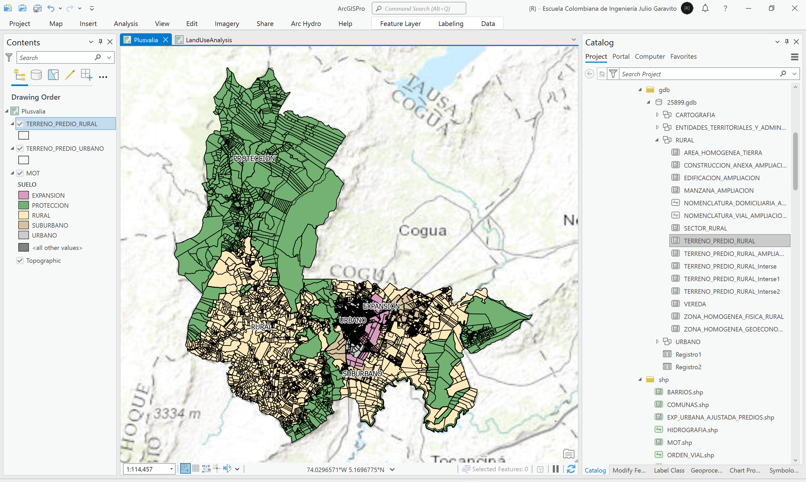
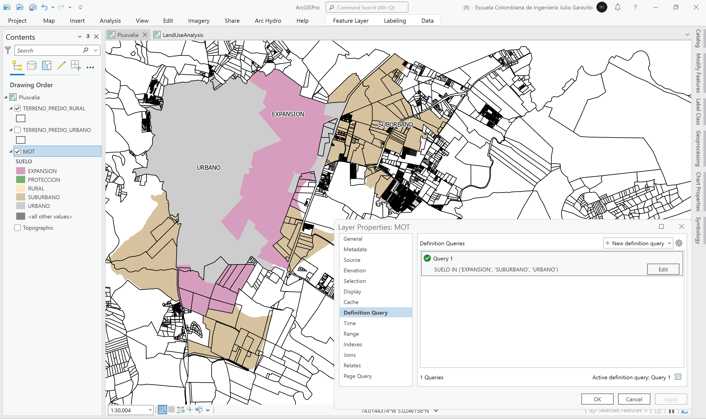
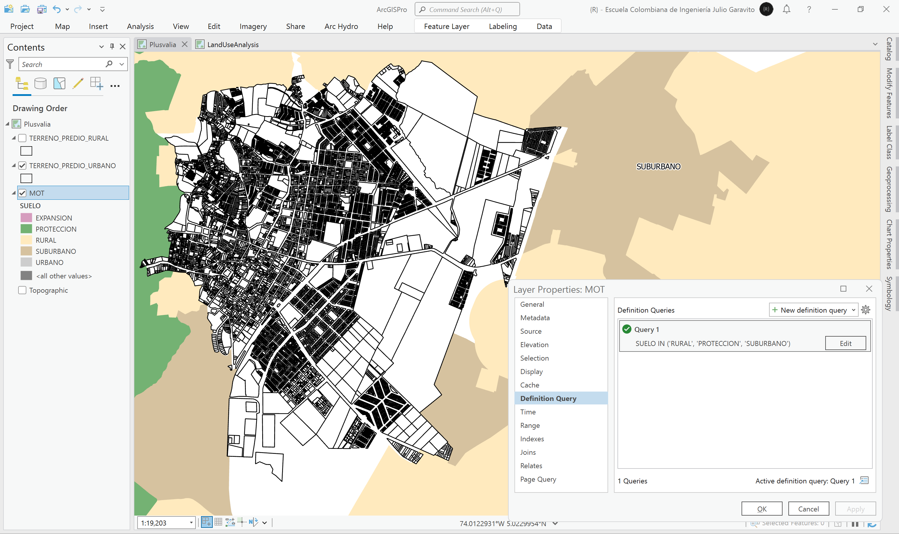
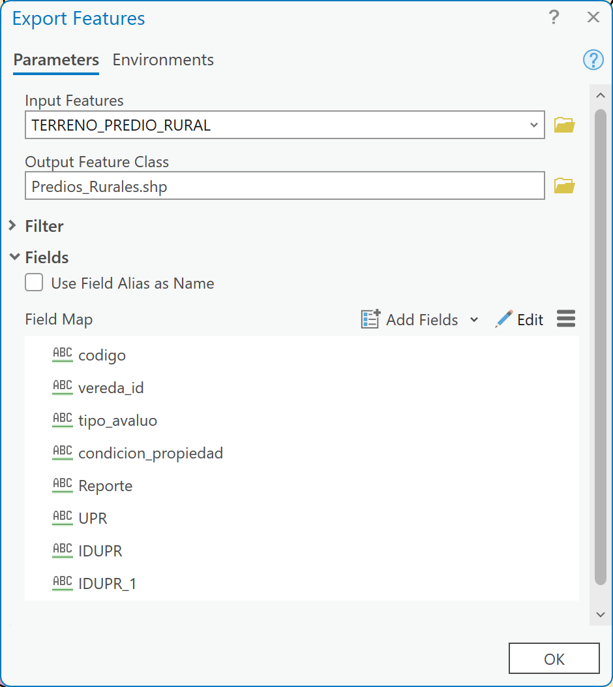
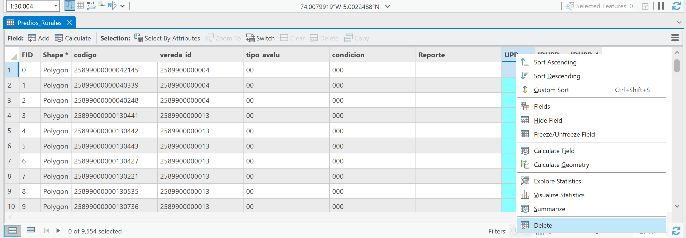
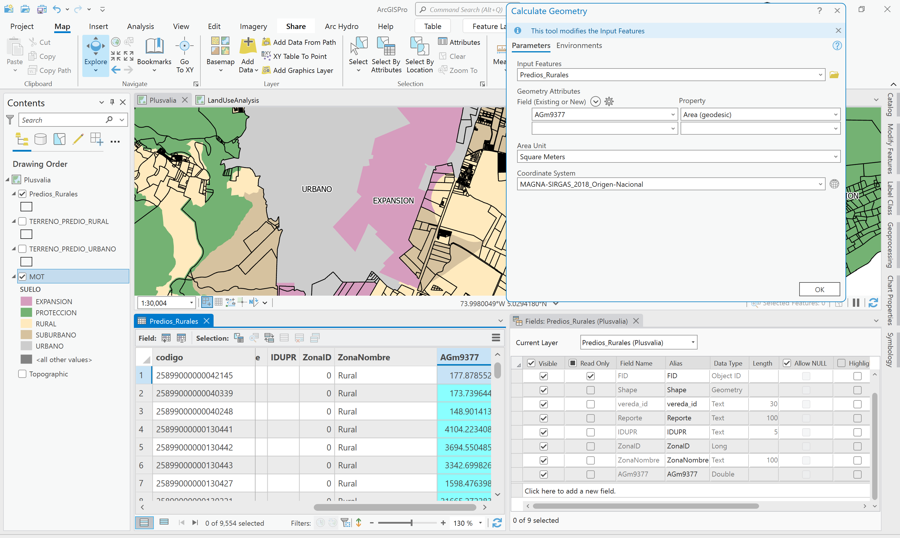
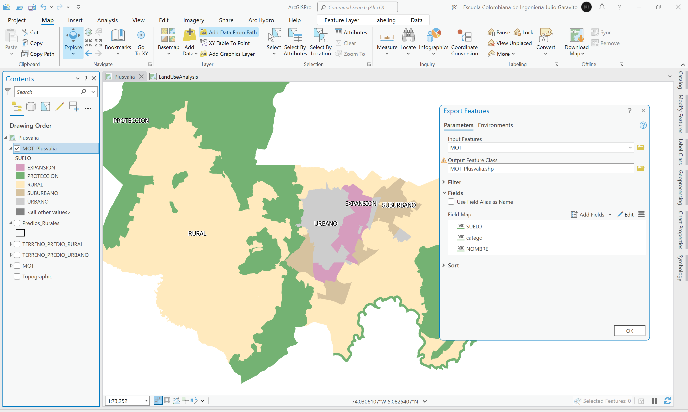
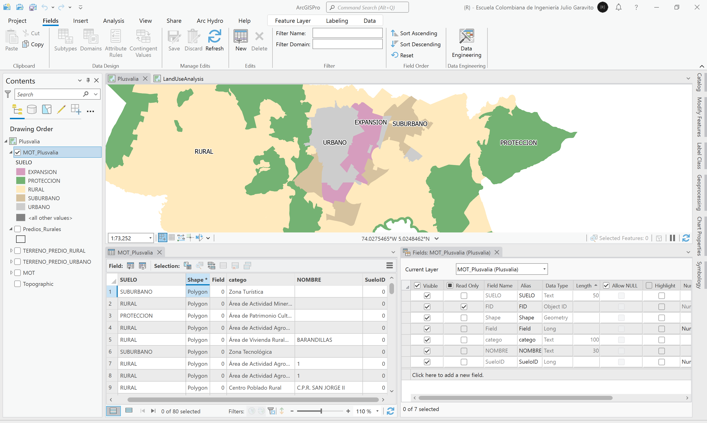
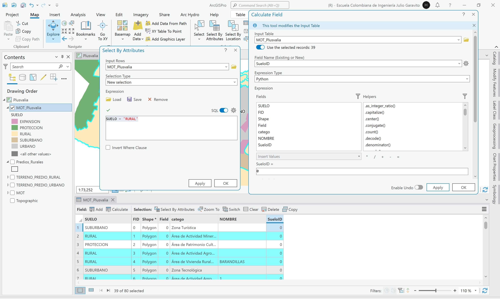
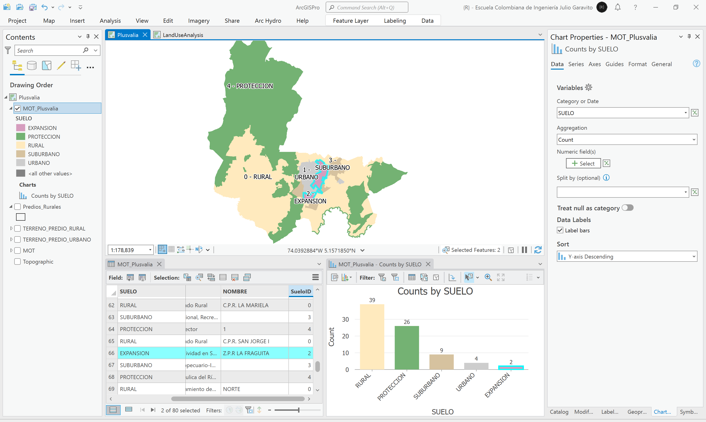

# Identificación de predios en plusvalía por cambio de clasificación o categoría de suelo
Keywords: `land-added-value` `land-appreciation` `land-betterment`

A partir de la combinación de predios con el mapa del Modelo de Ocupación Territorial - MOT, se realiza la identificación de predios rurales con cambio de categoría a expansión urbana, suburbano o urbano y/o por modificación de la zonificación de usos del suelo.

 Tomado de: <a href="Public Domain, https://commons.wikimedia.org/w/index.php?curid=479365">https://commons.wikimedia.org</a>  

En esta actividad, utilizaremos como referencia la zonificación urbana y rural definida en los registros catastrales de predios del IGAC, utilizados en el diagnóstico del estudio del Plan de Ordenamiento Territorial de la zona de estudio, e identificaremos a partir del cruce con el mapa del Modelo de Ocupación Territorial, los predios objeto de plusvalía por el efecto del primer hecho generador, correspondiente a la incorporación de suelo rural a suelo de expansión urbana o la consideración de parte del suelo rural como suburbano.

> :blue_heart:Para la evaluación del efecto plusvalía en su caso de estudio, se recomienda obtener la cartografía (predios, mapas de zonificación y bases de datos) de la primera adopción del plan de ordenamiento territorial y la siguiente correspondiente a la revisión y ajustes del POT; utilizando estos dos insumos, podrá identificar los predios objeto de plusvalía.

## Objetivos

* 

## Requerimientos

* [:notebook:Lectura](https://www.minvivienda.gov.co/sites/default/files/documentos/guia-para-la-participacion-en-plusvalia.pdf): Guía para la implementación de la participación de plusvalía. Ministerio de Vivienda, Ciudad y Territorio.
* [:mortar_board:Actividad](../POTLayer/Readme.md): Inventario de información geo-espacial recopilada del POT y diccionario de datos.
* [:toolbox:Herramienta](https://www.microsoft.com/es/microsoft-365/excel?market=bz): Microsoft Excel 365.
* [:toolbox:Herramienta](https://www.esri.com/en-us/arcgis/products/arcgis-pro/overview): ESRI ArcGIS Pro 3.3.1 o superior.
* [:toolbox:Herramienta](https://qgis.org/): QGIS 3.38 o superior.
* [:open_file_folder:PoblacionDANE.xlsx](Plusvalia.xlsx): libro con hechos generadores y homologación de clasificación y categorías del suelo.

## 1. Conceptos generales de plusvalía

Según el Capítulo IX y el Artículo 73 de la Ley 388 de 1997 de Colombia y de conformidad con lo dispuesto por el artículo 82 de la Constitución Política, las acciones urbanísticas que regulan la utilización del suelo y del espacio aéreo urbano incrementando su aprovechamiento, generan beneficios que dan derecho a las entidades públicas a participar en las plusvalías resultantes de dichas acciones. Esta participación se destinará a la defensa y fomento del interés común a través de acciones y operaciones encaminadas a distribuir y sufragar equitativamente los costos del desarrollo urbano, así como al mejoramiento del espacio público y, en general, de la calidad urbanística del territorio municipal o distrital. Los concejos municipales y distritales establecerán mediante acuerdos de carácter general, las normas para la aplicación de la participación en la plusvalía en sus respectivos territorios.

Hechos generadores (adaptado para el desarrollo de esta actividad)

| PlusvID | Hecho                                                                                                                                                        | Aplicabilidad                                                                                                                                                                                                                                                                                                                                                                                                                                                                                                                                                                                      |
|---------|--------------------------------------------------------------------------------------------------------------------------------------------------------------|----------------------------------------------------------------------------------------------------------------------------------------------------------------------------------------------------------------------------------------------------------------------------------------------------------------------------------------------------------------------------------------------------------------------------------------------------------------------------------------------------------------------------------------------------------------------------------------------------|
| 1       | Incorporación de suelo rural a suelo de expansión urbana o la consideración de parte del suelo rural como suburbano.                                         | Cambio de clasificación de uso                                                                                                                                                                                                                                                                                                                                                                                                                                                                                                                                                                     |
| 2       | Establecimiento o modificación del régimen o la zonificación de las subcategorías de usos del suelo, cuando se autorice el cambio de uso a uno más rentable. | Modificación de la zonificación de las categorías o subcategorías de uso.                                                                                                                                                                                                                                                                                                                                                                                                                                                                                                                          |
| 3       | Autorización de un mayor aprovechamiento del suelo en edificación, bien sea elevando el índice de ocupación o el índice de construcción, o ambos a la vez.   | Mayor edificabilidad, identificable en las fichas urbanísticas, entre la adopción inicial y la revisión y/o ajuste del POT.                                                                                                                                                                                                                                                                                                                                                                                                                                                                        |
| 4       | Participación por ejecución de obras públicas.                                                                                                               | Aunque no es un hecho generador directo, se puede evaluar el efecto plusvalía cuando se ejecuten obras públicas previstas en el plan de ordenamiento territorial o en los planes parciales o en los instrumentos que los desarrollen, y no se haya utilizado para su financiación la contribución de valorización, las correspondientes autoridades distritales, municipales o  metropolitanas ejecutoras, podrán determinar el mayor valor adquirido por los predios en razón de tales obras, y liquidar la participación que corresponde al respectivo municipio, distrito o área metropolitana. |

> El número total de metros cuadrados que se considerará como objeto de la participación en la plusvalía será, para el caso de cada inmueble, igual al área total del mismo destinada al nuevo uso o mejor aprovechamiento, descontada la superficie correspondiente a las cesiones urbanísticas obligatorias para espacio público de la ciudad, así como el área de eventuales afectaciones sobre el inmueble en razón del plan vial u otras obras públicas, las cuales deben estar contempladas en el plan de ordenamiento o en los instrumentos que lo desarrollen.
>
> :bulb:En este ejercicio, evaluaremos el hecho generador 1 correspondiente a la incorporación de suelo rural a suelo de expansión urbana o la consideración de parte del suelo rural como suburbano.  

## 2. Procedimiento general

1. Abra el proyecto de ArcGIS Pro, creado previamente y desde el menú _Insert_ cree un nuevo mapa _New Map_, renombre como _Plusvalia_ y establezca el CRS 9377. Agregue al mapa la capa del Modelo de Ocupación Territorial - MOT (_MOT.shp_), la capa de predios rurales (TERRENO_PREDIO_RURAL) y predios urbanos (TERRENO_PREDIO_URBANO) disponibles en la información recopilada del POT en la ruta `\R.SIGE\file\data\POT\Anexo_Acuerdo_012_2013\`, ajuste la simbología del MOT a valores únicos representando el campo de atributos `SUELO` y rotule usando el mismo campo. Establezca simbología única en los predios, utilizando solo su contorno. 

Ajuste los colores del mapa utilizando los siguientes valores hexadecimales, correspondientes al mapa oficial CG-01 de Clasificación general del territorio anexo al POT y elimine el color del contorno para obtener una mejor visualización de las zonas.

| Categoría        | HEX color |
|------------------|-----------|
| Urbano           | #CDCDCD   |
| Expansión urbana | #D69DBE   |
| Suburbano        | #D6C29F   |
| Protección       | #74B273   |
| Rural            | #FFEABE   |

> :bulb:Como los colores ya fueron definidos en el mapa de la actividad anterior, puede copiar y pegar la capa que incluirá colores y rótulos.

2. Utilizando el _Query Builder_ de la capa MOT, filtre las clasificaciones de uso correspondientes a _Expansión, Urbano y Suburbano_. Evalúe visualmente, qué predios de la zona rural se encuentran sobre los polígonos filtrados. Como puede observar, existen gran cantidad de predios que total o parcialmente se encuentran sobre estas zonas definidas en el POT.  

Query: `SUELO IN ('EXPANSION', 'SUBURBANO', 'URBANO')`

3. Ahora identifique visualmente, qué predios catastralmente urbanos, se encuentran ahora definidos como rurales (rural, protección, suburbano). Podrá observar que ningún predio ha sido incluído dentro de estas clasificaciones.

Para continuar, desactive el filtro realizado en la capa MOT.

4. Para la identificación de cuáles predios son objeto de plusvalía e identificar su hecho generador, crearemos primero una copia de la capa de predios rurales y modificaremos su tabla, incluyendo algunos atributos adicionales. De clic derecho en la capa de predios rurales, cree una copia de la capa utilizando la opción _Data / Export Features_, guarde en la ruta `\file\shp\` como _Predios_Rurales.shp_, excluya de la exportación todos los campos actuales relacionados con áreas y perímetros, y defina en _Environments_ el CRS 9377. Agregue la capa al mapa.

Abra la tabla de atributos e identifique que campos están vacíos o con valores idénticos repetidos (tipo_avalu, condicion_, UPR, IDUPR_1) y elimínelos dando clic derecho sobre la cabecera de columna y seleccionando la opción _Delete_. 

Agregue los siguientes campos de atributos:

| Campo      | Descripción                                                                                                           |    Tipo     | Propiedad ArcGIS Pro | 
|------------|-----------------------------------------------------------------------------------------------------------------------|:-----------:|----------------------| 
| ZonaID     | 0 - Rural, 1 - Urbano, 2 a 99 - Otros núcleos y corregimientos. Artículo 159, Resolución 0070 de 2011, IGAC Colombia. |    Long     | N/A                  |
| ZonaNombre | Rural - 0, Urbano - 1, Otros núcleos y corregimientos -2 a 99. Artículo 159, Resolución 0070 de 2011, IGAC Colombia.  | Text (100)  | N/A                  |
| AGm9377    | Área geodésica en hectáreas a partir de CRS 9377.                                                                     |   Double    | Area (geodesic)      |

> Para este ejercicio se ha definido el campo `ZonaID` tipo entero largo. Catastralmente, este campo se define de tipo texto con longitud de 2 caracteres alfanuméricos.

Para todos los elementos y utilizando el _Field Calculator_ o calculadora de campo, establezca `ZonaID = 0` y `ZonaNombre="Rural"`. Utilizando el calculador de geometría o _Geometry Calculator_, calcule el área geodésica en m² de cada predio utilizando el CRS 9377. 

5. Para continuar con la identificación de los hechos generadores, cree también una copia completa de la capa *MOT* (desactive los filtros previamente realizados utilizando el _Definition Query_) y guarde en la ruta `\file\shp\` como _MOT_Plusvalia.shp_, excluya de la exportación todos los campos actuales relacionados con áreas y perímetros, y defina en _Environments_ el CRS 9377. Agregue la capa al mapa.

> Para el desarrollo de esta actividad, no es necesario disolver los polígonos del MOT debido a que en los hechos generadores, debemos incluir el detalle de las categorías aplicables y el nombre de las zonas.

Agregue el siguiente campo de atributos:

| Campo         | Descripción                                                                 | Tipo       | Propiedad ArcGIS Pro | 
|---------------|-----------------------------------------------------------------------------|------------|----------------------| 
| SueloID       | 0 - Rural, 1 - Urbano, 2 - Expansión urbana, 3 - Suburbano, 4 - Protección. | Long       | N/A                  |

> No es necesario agregar el campo `Suelo` debido a que ya estaba incluído en la capa MOT y tampoco es necesario agregar campos para el cálculo del área de cada polígono debido a que los valores de las áreas correspondientes a las sub-actividades asociadas a cada predio, serán calculadas luego de su intersección espacial.
> 
> Como observa en la codificación establecida para `SueloID`, hemos asignado el código 0 a suelo rural y 1 a suelo urbano, lo anterior con el fín de que exista correspondencia primaria con el campo `ZonaID` de la base predial.

Debido a que la capa _MOT_Plusvalia.shp_ contiene 80 entidades, de las cuales múltiples están asociadas a un mismo _Suelo_, es necesario realizar la codificación del campo _SueloID_ a través del uso de selecciones por atributos. Cierre el editor de tabla, y en el menú superior, de clic en el botón _Selection / Select By Attributes_, seleccione primero los registros correspondientes a `SUELO = 'RURAL'`, podrá observar que se han seleccionado 39 elementos. Utilizando el calculador de campo, asigne a _SueloID_ el valor 0, correspondiente a _Rural_ en la codificación establecida para este campo.

> De forma predeterminada, se ha establecido 0 en el campo _SueloID_ que según la codificación establecida para la clasificación del suelo, corresponde a _Rural_, sin embargo, se recomienda seleccionar y volver a asignar los valores codificados.

Repita el procedimiento anterior, asignando los códigos establecidos en SueloID para las demás clasificaciones del suelo, e incluya en el rótulo el código asignado. Cree una gráfica que permita identificar el número de elementos por cada clase de suelo.

Rótulo Arcade: `$feature.SueloID + " - " + $feature.SUELO`

> Tenga en cuenta que el conteo mostrado en la gráfica no corresponde al número de predios asociados a cada clasificación del suelo, sino al número de categorías contenidas en cada clasificación.

6. Para la identificación de predios objeto de plusvalía, es necesario evaluar las combinaciones de los códigos _ZonaID_ de la base predial y SueloID de la capa del Modelo de Ocupación Territorial - MOT, que definen los hechos generadores.

| ZonaID - Zona                                              | SueloID - Suelo       | PlusvID - Hecho generador                         |
|:-----------------------------------------------------------|:----------------------|:--------------------------------------------------|
| 0 - Predio Rural                                           | 0 - Rural Rural       | 0 - No genera plusvalía                           |
| 0 - Predio Rural                                           | 1 - Urbano            | 1 - Plusvalía por cambio de clasificación de uso  |
| 0 - Predio Rural                                           | 2 - Expansión urbana  | 1 - Plusvalía por cambio de clasificación de uso  |
| 0 - Predio Rural                                           | 3 - Rural Suburbano   | 1 - Plusvalía por cambio de clasificación de uso  |
| 0 - Predio Rural                                           | 4 - Rural Protección  | 0 - No genera plusvalía                           |
| 1 - Predio Urbano                                          | 0 - Rural Rural       | 0 - No genera plusvalía                           |
| 1 - Predio Urbano                                          | 1 - Urbano            | 0 - No genera plusvalía                           |
| 1 - Predio Urbano                                          | 2 - Expansión urbana  | 0 - No genera plusvalía                           |
| 1 - Predio Urbano                                          | 3 - Rural Suburbano   | 0 - No genera plusvalía                           |
| 1 - Predio Urbano                                          | 4 - Rural Protección  | 0 - No genera plusvalía                           |
| 2 a 99 - Predio en otros núcleos catalogados como rurales  | Ver Nota 1            | Ver Nota 1                                        |
| 2 a 99 - Predio en otros núcleos catalogados como urbanos  | Ver Nota 2            | Ver Nota 2                                        |

> **Nota 1**: aplican las mismas combinaciones aplicadas a la zona 0 - Predio Rural.
> 
> **Nota 2**: aplican las mismas combinaciones aplicadas a la zona 1 - Predio Urbano.  
> 
> Recuerde que un hecho generador indirecto para el cobro de plusvalía se da por la ejecución de obras públicas desarrolladas con recursos diferentes de contribuciones por valorización, y que es posible que en cualquier clasificación del suelo pueda ser aplicable. En este ejercicio, solo se evalúan los hechos generadores directos.

7. 

## 3. Análisis usando software libre - QGIS

Para el desarrollo de las actividades desarrolladas en esta clase, se pueden utilizar en QGIS las siguientes herramientas o geo-procesos:

| Proceso                                                                                                         | Procedimiento                                                                                                                                                                                                                                   |
|:----------------------------------------------------------------------------------------------------------------|:------------------------------------------------------------------------------------------------------------------------------------------------------------------------------------------------------------------------------------------------|
| Simbología                                                                                                      | Modificable desde las propiedades de la capa en la pestaña _Symbology_.                                                                                                                                                                         |
| Rotulado                                                                                                        | Modificable desde las propiedades de la capa en la pestaña _Labels_.                                                                                                                                                                            |

Ejemplo rótulo en QGIS: `'A(ha): ' ||  round("AGha", 2) || '\n' || 'P (m): ' ||  round("PGm", 2) `

## Elementos requeridos en diccionario de datos

Agregue a la tabla resúmen generada en la actividad [Inventario de información geo-espacial recopilada del POT y diccionario de datos](../POTLayer/Readme.md), las capas generadas en esta actividad que se encuentran listadas a continuación:

| Nombre                           | Descripción                                                                                                                  | Geometría   | Registros | 
|----------------------------------|------------------------------------------------------------------------------------------------------------------------------|-------------|-----------| 
|                                  |                                                                                                                              | Polígono 2D | 14        | 
|                                  |                                                                                                                              | Polígono 2D | 14        | 
|                                  |                                                                                                                              | Polígono 2D | 14        | 

> :bulb:Para funcionarios que se encuentran ensamblando el SIG de su municipio, se recomienda incluir y documentar estas capas en el Diccionario de Datos.

## Actividades de proyecto :triangular_ruler:

En la siguiente tabla se listan las actividades que deben ser desarrolladas y documentadas por cada grupo de proyecto en un único archivo de Adobe Acrobat .pdf. El documento debe incluir portada (indicando el caso de estudio, número de avance, nombre del módulo, fecha de presentación, nombres completos de los integrantes), numeración de páginas, tabla de contenido, lista de tablas, lista de ilustraciones, introducción, objetivo general, capítulos por cada ítem solicitado, conclusiones y referencias bibliográficas.

| Actividad     | Alcance                                                                                                                                                                                                                                                                                                                                                                                                                                             |
|:--------------|:----------------------------------------------------------------------------------------------------------------------------------------------------------------------------------------------------------------------------------------------------------------------------------------------------------------------------------------------------------------------------------------------------------------------------------------------------|
| Avance **P2** | Esta actividad no requiere del desarrollo de elementos en el avance del proyecto final, los contenidos son evaluados en el quiz de conocimiento y habilidad.                                                                                                                                                                                                                                                                                        | 
| Avance **P2** | :compass:Mapa digital impreso _P1-1: xxxx_ (Incluir xxxxx. Embebidos dentro del informe final como una imágen y referenciados como anexo.                                                                                                                                                                                                                                                                                                        | 
| Avance **P2** | En una tabla y al final del informe de avance de esta entrega, indique el detalle de las sub-actividades realizadas por cada integrante de su grupo. Para actividades que no requieren del desarrollo de elementos de avance, indicar si realizo la lectura de la guía de clase y las lecturas indicadas al inicio en los requerimientos. Utilice las siguientes columnas: Nombre del integrante, Actividades realizadas, Tiempo dedicado en horas. | 

> No es necesario presentar un documento de avance independiente, todos los avances de proyecto de este módulo se integran en un único documento.
> 
> En el informe único, incluya un numeral para esta actividad y sub-numerales para el desarrollo de las diferentes sub-actividades, siguiendo en el mismo orden de desarrollo presentado en esta actividad.

## Referencias

* [Ley 388 de 1998, Colombia.](http://www.secretariasenado.gov.co/senado/basedoc/ley_0388_1997.html)

## Control de versiones

| Versión    | Descripción                                                | Autor                                      | Horas |
|------------|:-----------------------------------------------------------|--------------------------------------------|:-----:|
| 2024.02.24 | Versión inicial con alcance de la actividad                | [rcfdtools](https://github.com/rcfdtools)  |   4   |
| 2024.06.27 | Investigación y documentación para caso de estudio general | [rcfdtools](https://github.com/rcfdtools)  |   8   |

_R.SIGE es de uso libre para fines académicos, conoce nuestra licencia, cláusulas, condiciones de uso y como referenciar los contenidos publicados en este repositorio, dando [clic aquí](LICENSE.md)._

_¡Encontraste útil este repositorio!, apoya su difusión marcando este repositorio con una ⭐ o síguenos dando clic en el botón Follow de [rcfdtools](https://github.com/rcfdtools) en GitHub._

| [:arrow_backward: Anterior](../xxxx) | [:house: Inicio](../../README.md) | [:beginner: Ayuda / Colabora](https://github.com/rcfdtools/R.SIGE/discussions/99999) | [Siguiente :arrow_forward:]() |
|---------------------|-------------------|---------------------------------------------------------------------------|---------------|

[^1]: 