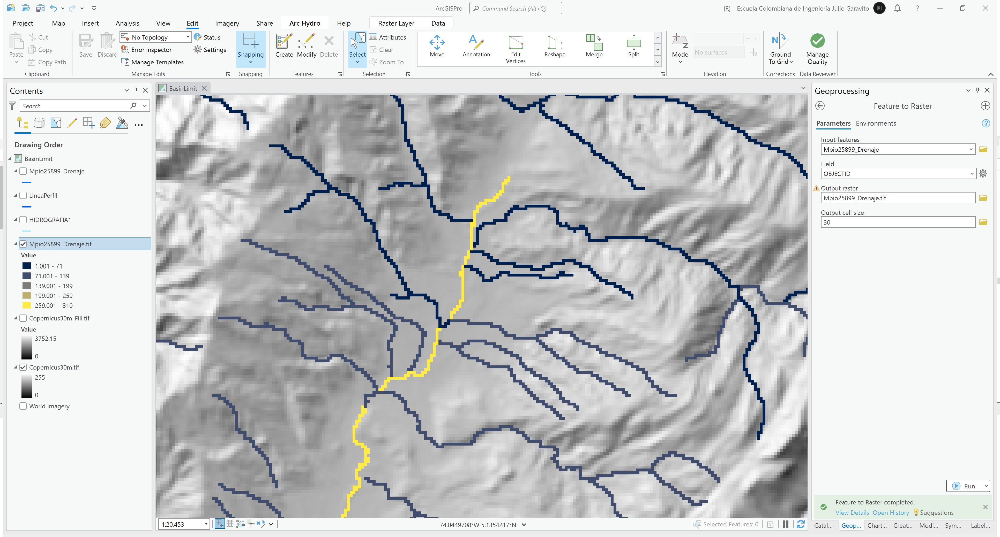
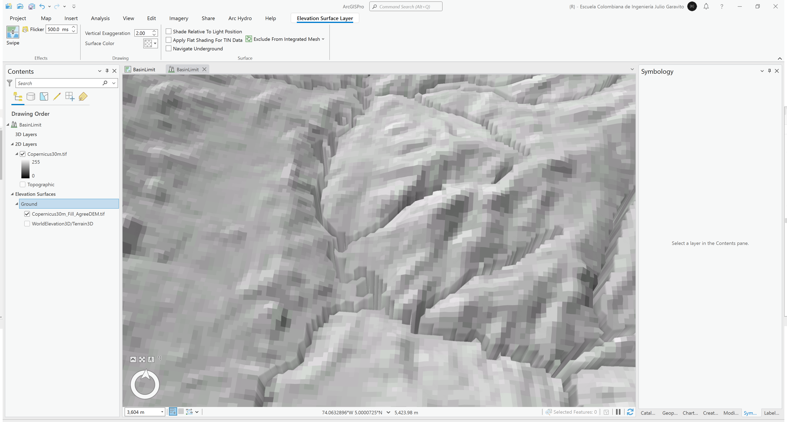

# Delimitación de cuencas hidrográficas locales
Keywords: `basin` `basin-limit`

A partir del modelo digital de elevación ESA Copernicus, cree el mapa de relleno de sumideros FIL. Reacondicione el modelo de terreno FIL como RawDEM, utilizando la red hidrográfica del POT (completar drenajes y abrir bucles). A partir del RawDEM, cree el mapa de direcciones de flujo FDR. Con la grilla FDR, cree el mapa de acumulación de flujo FAC. Con la grilla FAC, defina los drenajes con áreas de aportación de 1 km² creando un mapa binarizado. Cree una capa de puntos y a partir de la red de drenaje y del modelo digital de elevación, identifique al menos 3 puntos de control para delimitación de cuencas principales. A partir de los 3 puntos de control y utilizando el mapa FDR, delimite las 3 cuencas hidrográficas, convierta a vectores y analice las áreas obtenidas.

## Objetivos

* Generar el mapa de direcciones y acumulaciones de flujo.
* Delimitar cuencas hidrográficas a partir de puntos de estudio 

## Requerimientos

* [:mortar_board:Actividad](../TopoBasic/Readme.md): Conceptos básicos de topografía, fotogrametría y fotointerpretación.
* [:mortar_board:Actividad](../POTLayer/Readme.md): Inventario de información geo-espacial recopilada del POT y diccionario de datos.
* [:mortar_board:Actividad](../DEMSatellite/Readme.md): Modelo digital de elevación - DEM a partir de sensores remotos satelitales.
* [:toolbox:Herramienta](https://www.esri.com/en-us/arcgis/products/arcgis-pro/overview): ESRI ArcGIS Pro 3.3.1 o superior.
* [:toolbox:Herramienta](https://qgis.org/): QGIS 3.38 o superior.
* [:toolbox:Herramienta](https://www.hec.usace.army.mil/software/hec-hms/): HEC-HMS 4.12 o superior.

## 1. Procedimiento general en ArcGIS Pro

1. Abra el proyecto de ArcGIS Pro, creado previamente y desde el menú _Insert_ cree un nuevo mapa _New Map_, renombre como _BasinLimit_ y establezca el CRS 9377. Agregue al mapa el modelo digital de elevación Copernicus desde `\file\dem\Copernicus\Copernicus30m.tif`, la red de drenaje utilizada en la formulación del POT disponible en `\file\gdb\SIGE.gdb\POT2013Formulacion\HIDROGRAFIA1` y el eje del tramo ajustado del Río Frío evaluado en la actividad anterior que se encuentra en [\file\gdb\SIGE.gdb\SIGE\LineaPerfil]().  

2. Modifique y complete la red de drenaje incluyendo el tramo principal del Río Frío y elimine zonas con bucles. Para ello cree una copia de la capa _HIDROGRAFIA1_ guarde como `\file\gdb\SIGE.gdb\SIGE\Mpio25899_Drenaje` y utilice el editor de ArcGIS Pro. Digitalice al menos 1 kilómetro adicional aguas abajo del Río Frío.

3. Utilizando la herramienta de geo-procesamiento _Conversion Tools / Feature to Raster_, convierta la red de drenaje en una grilla ráster con resolución de 30 metros. Nombre como `\file\grid\Mpio25899_Drenaje.tif`.

4. Utilizando la herramienta de geo-procesamiento _Arc Hydro Tools Pro / DEM Reconditioning_, incruste en el modelo digital de elevación con relleno de sumideros la red de drenaje convertida a raster, guarde como `\file\dem\Copernicus\Copernicus30m_Fill_AgreeDEM.tif` 

5. En una escena local, verifique en una representación 3D el modelo de terreno ajustado.

6. Utilizando la herramienta de geo-procesamiento _Spatial Analyst Tools / Flow Direction_, obtenga las direcciones de flujo en formato D8, guarde como `\file\dem\Copernicus\Copernicus30m_FDR.tif` 

## 2. Análisis usando software libre - QGIS

Para el desarrollo de las actividades desarrolladas en esta clase, se pueden utilizar en QGIS las siguientes herramientas o geo-procesos:

| Proceso            | Procedimiento                                                           |
|:-------------------|:------------------------------------------------------------------------|
| Simbología         | Modificable desde las propiedades de la capa en la pestaña _Symbology_. |
| Rotulado           | Modificable desde las propiedades de la capa en la pestaña _Labels_.    |

Ejemplo rótulo en QGIS: `'A(ha): ' ||  round("AGha", 2) || '\n' || 'P (m): ' ||  round("PGm", 2) `

[:notebook:QGIS training manual](https://docs.qgis.org/3.34/en/docs/training_manual/)  
[:notebook:Herramientas comúnmente utilizadas en QGIS](../QGIS.md)

## Elementos requeridos en diccionario de datos

Agregue a la tabla resúmen generada en la actividad [Inventario de información geo-espacial recopilada del POT y diccionario de datos](../POTLayer/Readme.md), las capas generadas en esta actividad que se encuentran listadas a continuación:

| Nombre                           | Descripción                                                                                                                  | Geometría   | Registros | 
|----------------------------------|------------------------------------------------------------------------------------------------------------------------------|-------------|-----------| 
|                                  |                                                                                                                              | Polígono 2D | 14        | 
|                                  |                                                                                                                              | Polígono 2D | 14        | 
|                                  |                                                                                                                              | Polígono 2D | 14        | 

> :bulb:Para funcionarios que se encuentran ensamblando el SIG de su municipio, se recomienda incluir y documentar estas capas en el Diccionario de Datos.

## Actividades de proyecto :triangular_ruler:

En la siguiente tabla se listan las actividades que deben ser desarrolladas y documentadas por cada grupo de proyecto en un único archivo de Adobe Acrobat .pdf. El documento debe incluir portada (indicando el caso de estudio, número de avance, nombre del módulo, fecha de presentación, nombres completos de los integrantes), numeración de páginas, tabla de contenido, lista de tablas, lista de ilustraciones, introducción, objetivo general, capítulos por cada ítem solicitado, conclusiones y referencias bibliográficas.

| Actividad     | Alcance                                                                                                                                                                                                                                                                                                                                                                                                                                             |
|:--------------|:----------------------------------------------------------------------------------------------------------------------------------------------------------------------------------------------------------------------------------------------------------------------------------------------------------------------------------------------------------------------------------------------------------------------------------------------------|
| Avance **P5** | Esta actividad no requiere del desarrollo de elementos en el avance del proyecto final, los contenidos son evaluados en el quiz de conocimiento y habilidad.                                                                                                                                                                                                                                                                                        | 
| Avance **P5** | :compass:Mapa digital impreso _P3-1: xxxx_ Incluir xxxxx. Embebido dentro del informe final como una imágen y referenciados como anexo.                                                                                                                                                                                                                                                                                                          | 
| Avance **P5** | En una tabla y al final del informe de avance de esta entrega, indique el detalle de las sub-actividades realizadas por cada integrante de su grupo. Para actividades que no requieren del desarrollo de elementos de avance, indicar si realizo la lectura de la guía de clase y las lecturas indicadas al inicio en los requerimientos. Utilice las siguientes columnas: Nombre del integrante, Actividades realizadas, Tiempo dedicado en horas. | 

> No es necesario presentar un documento de avance independiente, todos los avances de proyecto de este módulo se integran en un único documento.
> 
> En el informe único, incluya un numeral para esta actividad y sub-numerales para el desarrollo de las diferentes sub-actividades, siguiendo en el mismo orden de desarrollo presentado en esta actividad.

## Referencias

* 

## Control de versiones

| Versión    | Descripción                                                | Autor                                      | Horas |
|------------|:-----------------------------------------------------------|--------------------------------------------|:-----:|
| 2024.02.24 | Versión inicial con alcance de la actividad                | [rcfdtools](https://github.com/rcfdtools)  |   4   |
| 2024.06.27 | Investigación y documentación para caso de estudio general | [rcfdtools](https://github.com/rcfdtools)  |   8   |

_R.SIGE es de uso libre para fines académicos, conoce nuestra licencia, cláusulas, condiciones de uso y como referenciar los contenidos publicados en este repositorio, dando [clic aquí](LICENSE.md)._

_¡Encontraste útil este repositorio!, apoya su difusión marcando este repositorio con una ⭐ o síguenos dando clic en el botón Follow de [rcfdtools](https://github.com/rcfdtools) en GitHub._

| [:arrow_backward: Anterior](../DEMProfile/Readme.md) | [:house: Inicio](../../README.md) | [:beginner: Ayuda / Colabora](https://github.com/rcfdtools/R.SIGE/discussions/99999) | [Siguiente :arrow_forward:]() |
|----------------------------------------------|-------------------|---------------------------------------------------------------------------|---------------|

[^1]: 