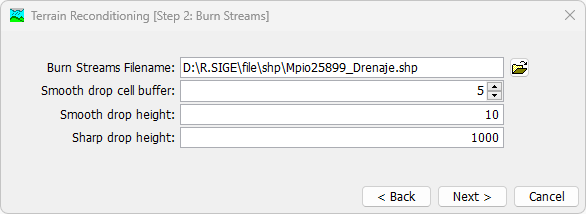
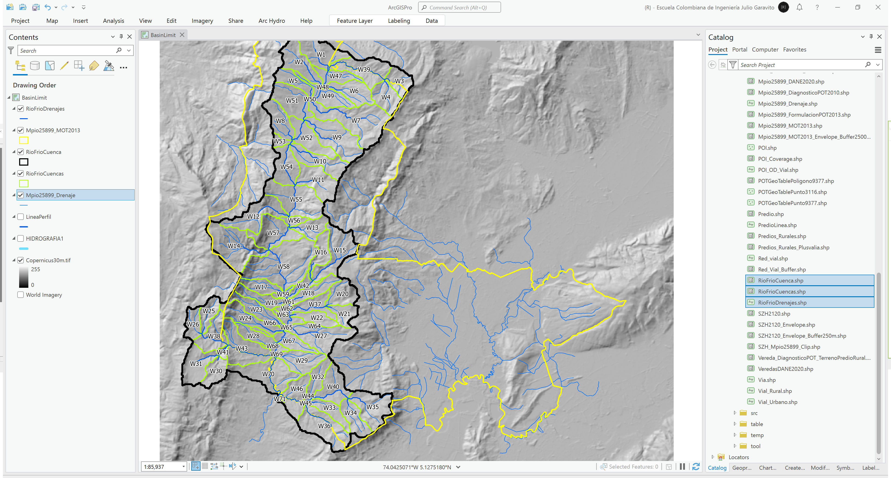

# 5.7. Delimitación de cuencas hidrográficas locales
Keywords: `basin` `basin-limit` `hec-hms` `dem-reconditioning` `fill` `fdr`  

A partir del modelo digital de elevación ESA Copernicus, cree el mapa de relleno de sumideros FIL. Reacondicione el modelo de terreno FIL como RawDEM, utilizando la red hidrográfica del POT (completar drenajes y abrir bucles). A partir del RawDEM, cree el mapa de direcciones de flujo FDR. Con la grilla FDR, cree el mapa de acumulación de flujo FAC. Con la grilla FAC, defina los drenajes con áreas de aportación de 1 km² creando un mapa binarizado. Cree una capa de puntos y a partir de la red de drenaje y del modelo digital de elevación, identifique al menos 3 puntos de control para delimitación de cuencas principales. A partir de los 3 puntos de control y utilizando el mapa FDR, delimite las 3 cuencas hidrográficas, convierta a vectores y analice las áreas obtenidas.

## Objetivos

* Generar el mapa de direcciones y acumulaciones de flujo.
* Delimitar cuencas hidrográficas a partir de puntos de estudio.
* Evaluar la extensión de las cuencas con respecto al límite municipal.

## Requerimientos

* [:mortar_board:Actividad](../TopoBasic/Readme.md): Conceptos básicos de topografía, fotogrametría y fotointerpretación.
* [:mortar_board:Actividad](../POTLayer/Readme.md): Inventario de información geo-espacial recopilada del POT y diccionario de datos.
* [:mortar_board:Actividad](../DEMSatellite/Readme.md): Modelo digital de elevación - DEM a partir de sensores remotos satelitales.
* [:toolbox:Herramienta](https://www.esri.com/en-us/arcgis/products/arcgis-pro/overview): ESRI ArcGIS Pro 3.3.1 o superior.
* [:toolbox:Herramienta](https://qgis.org/): QGIS 3.38 o superior.
* [:toolbox:Herramienta](https://www.hec.usace.army.mil/software/hec-hms/): HEC-HMS 4.12 o superior.

## 1. Edición de red de drenaje en ArcGIS Pro

1. Abra el proyecto de ArcGIS Pro, creado previamente y desde el menú _Insert_ cree un nuevo mapa _New Map_, renombre como _BasinLimit_ y establezca el CRS 9377. Agregue al mapa el modelo digital de elevación Copernicus desde `\file\dem\Copernicus\Copernicus30m.tif`, el límite del modelo de ocupación territorial `\file\gdb\SIGE\Mpio25899_MOT2013`, la red de drenaje utilizada en la formulación del POT disponible en `\file\gdb\SIGE.gdb\POT2013Formulacion\HIDROGRAFIA1` y el eje del tramo ajustado del Río Frío evaluado en la actividad anterior que se encuentra en `\file\gdb\SIGE.gdb\SIGE\LineaPerfil`.  

2. Modifique y complete la red de drenaje incluyendo el tramo principal del Río Frío y elimine zonas con bucles. Para ello cree una copia de la capa _HIDROGRAFIA1_ guarde como `\file\gdb\SIGE.gdb\SIGE\Mpio25899_Drenaje` y utilice el editor de ArcGIS Pro. Digitalice al menos 1 kilómetro adicional aguas abajo del Río Frío.

Ejemplo ajuste de bucles  

Ajuste y extensión zona baja Río Frío  

## 2. Delimitación de cuencas en HEC-HMS

1. En HEC-HMS, cree un proyecto nuevo en blanco definiendo _Metric_ en el sistema de unidades por defecto, guardar como _HECHMS_ en la carpeta D:\R.SIGE\.

Automáticamente, obtendrá una carpeta con la estructura de directorios y archivos requeridos por este modelo, que para la versión 4.12 contendrá:

Dentro de la carpeta de proyecto cree un nuevo folder con el nombre _projectionfile_ y copie dentro cualquier archivo de proyección de los archivos de forma shapefile generados en la carpeta `\file\shp` que cotenga los parámetros del CRS 9377 , por ejemplo, el archivo `.prj` de la capa _Predio.shp_. 

2. En el menú _Components – Create Component – Basin Model_, cree 1 modelo de cuenca y nómbrelo como _RioFrio_.

> Evite utilizar caracteres especiales diferentes a los utilizados en el idioma inglés, tales como eñes y tildes.

3. En la tabla de contenido localizada a la izquierda, seleccione _HECHMS – Basin Models – RioFrio_, luego en el menú _GIS – Coordinate System_ seleccione el sistema de proyección de coordenadas _9377.prj_ localizado en el directorio _D:\R.SIGE\file\HECHMS\projectionfile_. 

4. En el menú _Components – Create Component – Terrain Data_, cree el terreno a partir del modelo digital de elevación - DEM Copernicus almacenado en la ruta `\file\dem\Copernicus\Copernicus30m.tif`, seleccionando unidades verticales en metros, nombrar como _TerrainCopernicus.

Automáticamente, el modelo de terreno será copiado en la carpeta `\file\HECHMS\terrain`.

5. En la tabla de contenido, seleccione _HECHMS – Basin Models – RioFrio_ y en la parte inferior asocie el terreno creado al modelo de cuencas.

6. En la tabla de contenido, seleccione _HECHMS – Basin Models – RioFrio_ y en el menú _GIS_, seleccione la opción _Terrain Reconditioning_. El primer paso (Step 1) permite crear paredes perimetrales de confinamiento utilizando el borde de una cuenca previamente digitalizada, dar clic en _Next >_. 

> Para el caso de estudio no ejecutaremos la generación de paredes perimetrales a partir de la zona de estudio correspondiente a la zona hidrográfica del Río Bogotá debido a que el análisis lo realizaremos en cuencas internas que descargan a este cauce principal. 

El segundo paso (Step 2) permite modificar el terreno incrustando los drenajes, para ello es necesario exportar desde ArcGIS Pro la red de drenaje `\file\gdb\SIGE.gdb\SIGE\Mpio25899_Drenaje` a un archivo de formas shapefile utilizando el CRS 9377 y en la ruta `\file\shp\Mpio25899_Drenaje.shp`.

Seleccione la red de drenaje `\file\shp\Mpio25899_Drenaje.shp`, defina el número de celdas aferentes o _Smooth drop cell buffer_ (p. ej. 5), la profundidad de suavizado lateral o _Smooth drop height_ (p. ej. 10) y la profundidad de incrustación en el cauce o _Sharp drop height_ (p. ej. 1000 para garantizar que en el relleno de sumideros se mantenga la localización de las celdas correspondientes a los drenajes marcados), de clic en _Next >_. 

Luego de terminada la ejecución podrá observar que ahora el DEM contiene la localización de los drenajes en el terreno.

7. En la tabla de contenido, seleccione _HECHMS – Basin Models – RioFrio_ y en el menú _GIS_, seleccione la opción `Preprocess Sinks` que identificará y rellenara los sumideros o zonas bajas donde el flujo puede confinarse y no drenar.

> Este proceso es especialmente importante debido a que garantiza que todas las celdas del DEM drenen hacia un punto más bajo.

Podrá observar que al desplazarse por el mapa se visualizan momentáneamente los mapas previamente generados, para visualizar únicamente el último mapa creado, de clic derecho sobre el mapa, seleccione la opción _Map Layers_ y deje activo solo los mapas Sink.

8. En la tabla de contenido, seleccione _HECHMS – Basin Models – RioFrio_ y en el menú _GIS_, seleccione la opción `Preprocess Drainage` que le permitirá conocer en detalle como drena el flujo sobre el modelo de terreno.

Dando clic derecho en el mapa, desactive el mapa _Flow Acumulation_ y visualice el mapa _Flow Direction_.

9. En la tabla de contenido, seleccione _HECHMS – Basin Models – RioFrio_ y en el menú _GIS_, seleccione la opción `Identify Stream` que le permitirá definir el área de aportación a partir de la cual obtendrá o generará las cuencas del modelo. Visualice el resultado utilizando como fondo el modelo de terreno.

10. Utilizando la herramienta _Break Point Creation Tool_ cree un punto de extracción o sifón de cuenca en la parte baja del Río Frío.

11. En la tabla de contenido, seleccione _HECHMS – Basin Models – RioFrio_ y en el menú _GIS_, seleccione la opción `Delineate Elements` que le permitirá extraer las cuencas y drenajes hasta el punto de estudio definido. Utilice los prefijos W, R, J.

12. En la tabla de contenido, seleccione _HECHMS – Basin Models – RioFrio_ y en el menú _GIS_, seleccione la opción `Export Layers` que le permitirá exportar uno a uno los elementos generados. Exporte las subcuencas y los drenajes obtenidos en la carpeta `\file\shp\' como _RioFrioCuencas_ y _RioFrioDrenajes_.

## 3. Visualización de cuencas y grillas en ArcGIS Pro

1. En el proyecto de ArcGIS Pro, cargue desde la carpeta `\file\shp\` las capas `RioFrioCuencas.shp` y `RioFrioDrenajes.shp` generadas en HEC-HMS.

2. Para obtener el límite externo de la cuenca, ejecute la herramienta de geo-procesamiento _Data Management Tools / Dissolve_, nombre como `\file\shp\RioFrioCuenca.shp`.

3. Compare con el límite municipal, podrá observar que gran parte del área territorial municipal corresponde a esta cuenca, especialmente en la zona de montaña.

4. Cargue y visualice los diferentes mapas ráster generados en HEC-HMS.

Modelo digital de terreno ajustado con drenajes  

Relleno y localización de sumideros  

Acumulación de flujo  

Dirección de flujo  

## 4. Análisis usando software libre - QGIS

Para el desarrollo de las actividades desarrolladas en esta clase, se pueden utilizar en QGIS las siguientes herramientas o geo-procesos:

| Proceso                                                                     | Procedimiento                                                                                                                                                                                                                        |
|:----------------------------------------------------------------------------|:-------------------------------------------------------------------------------------------------------------------------------------------------------------------------------------------------------------------------------------|
| Simbología                                                                  | Modificable desde las propiedades de la capa en la pestaña _Symbology_.                                                                                                                                                              |
| Rotulado                                                                    | Modificable desde las propiedades de la capa en la pestaña _Labels_.                                                                                                                                                                 |
| Disolución (Dissolve)                                                       | Se ejecuta desde el _Processing Toolbox / Vector Geometry / [Dissolve](https://docs.qgis.org/3.34/en/docs/user_manual/processing_algs/qgis/vectorgeometry.html#dissolve)_ o desde el menú _Vector / Geoprocessing Tools / Dissolve_. |
| Reacondicionamiento de terreno, relleno de sumideros y direcciones de flujo | Pueden ser realizados con las herramientas embebidas de GRASS, sin embargo es recomendable realizar la restitución de cuencas usando HEC-HMS.                                                                                        |

Ejemplo rótulo en QGIS: `'A(ha): ' ||  round("AGha", 2) || '\n' || 'P (m): ' ||  round("PGm", 2) `

[:notebook:QGIS training manual](https://docs.qgis.org/3.34/en/docs/training_manual/)  
[:notebook:Herramientas comúnmente utilizadas en QGIS](../QGIS.md)

## Elementos requeridos en diccionario de datos

Agregue a la tabla resúmen generada en la actividad [Inventario de información geo-espacial recopilada del POT y diccionario de datos](../POTLayer/Readme.md), las capas generadas en esta actividad que se encuentran listadas a continuación:

| Nombre                | Descripción                                                                                | Geometría     | Registros | 
|-----------------------|--------------------------------------------------------------------------------------------|---------------|-----------| 
| Mpio25899_Drenaje     | Red de drenaje ajustada para restitución hidrológica a partir de drenajes formulación POT. | Poli-línea 2D | 296       | 
| RioFrioCuencas.shp    | Subcuencas Río Frío generadas en HEC-HMS.                                                  | Polígono 2D   | 71        | 
| RioFrioCuenca.shp     | Cuenca Río Frío disuelta a partir de subcuencas.                                           | Polígono 2D   | 1         | 
| RioFrioDrenajes.shp   | Drenaje por subcuenca en Río Frío.                                                         | Polígono 2D   | 71        | 

> :bulb:Para funcionarios que se encuentran ensamblando el SIG de su municipio, se recomienda incluir y documentar estas capas en el Diccionario de Datos.

## Actividades de proyecto :triangular_ruler:

En la siguiente tabla se listan las actividades que deben ser desarrolladas y documentadas por cada grupo de proyecto en un único archivo de Adobe Acrobat .pdf. El documento debe incluir portada (indicando el caso de estudio, número de avance, nombre del módulo, fecha de presentación, nombres completos de los integrantes), numeración de páginas, tabla de contenido, lista de tablas, lista de ilustraciones, introducción, objetivo general, capítulos por cada ítem solicitado, conclusiones y referencias bibliográficas.

| Actividad     | Alcance                                                                                                                                                                                                                                                                                                                                                                                                                                             |
|:--------------|:----------------------------------------------------------------------------------------------------------------------------------------------------------------------------------------------------------------------------------------------------------------------------------------------------------------------------------------------------------------------------------------------------------------------------------------------------|
| Avance **P5** | Siguiendo el procedimiento presentado en esta actividad, realizar la delimitación de subcuencas en 3 puntos de estudio o sifones para 3 cuencas hidrográficas dentro de su zona de estudio.                                                                                                                                                                                                                                                         | 
| Avance **P5** | :compass:Mapa digital impreso _P5-15: Cuencas, subcuencas, drenajes y puntos de control._ Incluir rótulos descriptivos con áreas y nombres de cuencas y drenajes. Embebido dentro del informe final como una imágen y referenciados como anexo.                                                                                                                                                                                                  | 
| Avance **P5** | En una tabla y al final del informe de avance de esta entrega, indique el detalle de las sub-actividades realizadas por cada integrante de su grupo. Para actividades que no requieren del desarrollo de elementos de avance, indicar si realizo la lectura de la guía de clase y las lecturas indicadas al inicio en los requerimientos. Utilice las siguientes columnas: Nombre del integrante, Actividades realizadas, Tiempo dedicado en horas. | 

> No es necesario presentar un documento de avance independiente, todos los avances de proyecto de este módulo se integran en un único documento.
> 
> En el informe único, incluya un numeral para esta actividad y sub-numerales para el desarrollo de las diferentes sub-actividades, siguiendo en el mismo orden de desarrollo presentado en esta actividad.

## Referencias

* [HEC-HMS Technical Reference Manual](https://www.hec.usace.army.mil/confluence/hmsdocs/hmstrm)
* [HEC-HMS User's Manual](https://www.hec.usace.army.mil/confluence/hmsdocs/hmsum/latest)

## Control de versiones

| Versión    | Descripción                                                       | Autor                                      | Horas |
|------------|:------------------------------------------------------------------|--------------------------------------------|:-----:|
| 2024.03.30 | Versión inicial con alcance de la actividad                       | [rcfdtools](https://github.com/rcfdtools)  |   4   |
| 2024.09.10 | Inicio investigación y documentación para caso de estudio general | [rcfdtools](https://github.com/rcfdtools)  |   4   |
| 2024.09.11 | Avance investigación y documentación para caso de estudio general | [rcfdtools](https://github.com/rcfdtools)  |   4   |

_R.SIGE es de uso libre para fines académicos, conoce nuestra licencia, cláusulas, condiciones de uso y como referenciar los contenidos publicados en este repositorio, dando [clic aquí](LICENSE.md)._

_¡Encontraste útil este repositorio!, apoya su difusión marcando este repositorio con una ⭐ o síguenos dando clic en el botón Follow de [rcfdtools](https://github.com/rcfdtools) en GitHub._

| [◄ Anterior](../DEMProfile/Readme.md) | [:house: Inicio](../../README.md) | [:beginner: Ayuda / Colabora](https://github.com/rcfdtools/R.SIGE/discussions/34)  | [Siguiente ►](../Reservoir/Readme.md) |
|------------------------------------------------------|-----------------------------------|------------------------------------------------------------------------------------|-----------------------------------------------------|

[^1]: 