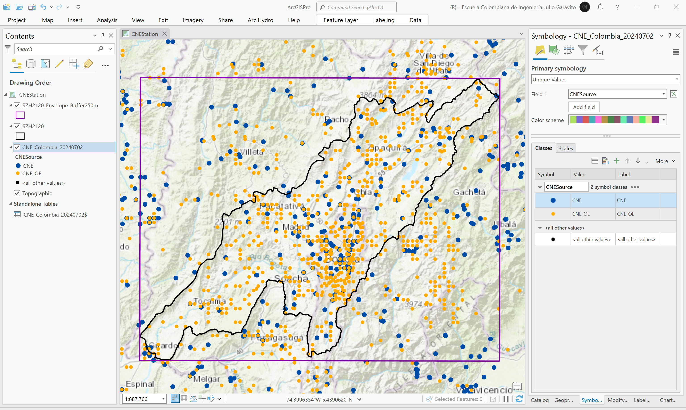
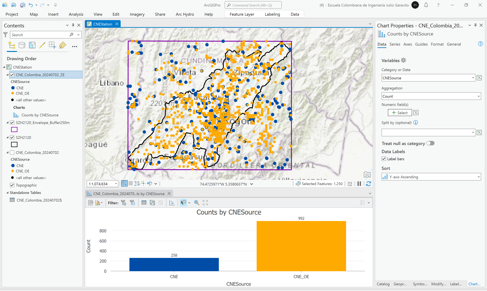

# Estudio de redes hidro-climatológicas
Keywords: `ideam` `weather-station` `display-xy-Data` `buffer` `merge` `bar-graph` `select-by-location` `statistics`

A partir de las tablas del Catálogo Nacional de Estaciones del IDEAM y otras entidades, cree un catálogo integrado de estaciones. A partir del límite de las zub-zonas hidrográfica, seleccione las estaciones con cubrimiento y al rededor de la zona de estudio, cree las siguientes capas y análisis: envolvente de límite municipal, aferencia de envolvente, marcado de estaciones, áreas aferentes, distancia entre estaciones y su cobertura.

<div align="center"></div>


## Objetivos

* Descargar el catálogo nacional de estaciones - CNE del IDEAM y de otras entidades de Colombia.
* Conocer las categorías de las estaciones hidro-climatológicas y qué tipo de observaciones realizan.
* Conocer los estados, tecnologías y niveles de aprobación de los datos en estaciones.
* Identificar los atributos contenidos en el catálogo de objetos del CNE.
* A partir de un polígono envolvente, seleccionar, exportar e integrar las estaciones del IDEAM y de otras entidades en un único catálogo.
* Analizar la cobertura espacial sobre la zona de estudio las estaciones obtenidas.
* Calcular la longitud hipotética de las series a partir de la fecha de instalación y suspensión de las estaciones utilizando Python Script.
* Calcular la longitud hipotética de las series dentro de una ventana de tiempo establecida a partir de las estaciones utilizando Python Script.
* Identificar, representar, graficar y analizar las longitudes hipotéticas de series para estaciones que contienen datos de precipitación, temperatura del aire cerca del suelo, evaporación potencial, nivel de lámina y caudal en ríos.


## Requerimientos

* [:mortar_board:Actividad](../SZH/Readme.md): Análisis de sub-zonas hidrográficas. Polígono que delimita la subzona hidrográfica del caso de estudio y polígono envolvente con aferencia. 
* [:mortar_board:Actividad](../POTLayer/Readme.md): Inventario de información geo-espacial recopilada del POT y diccionario de datos.
* [:toolbox:Herramienta](https://www.esri.com/en-us/arcgis/products/arcgis-pro/overview): ESRI ArcGIS Pro 3.3.1 o superior.
* [:toolbox:Herramienta](https://qgis.org/): QGIS 3.38 o superior.


## 1. Conceptos generales

### 1.1. Conceptos y atributos que componen el catálogo nacional de estaciones y especificaciones

El [Instituto de Hidrología, Meteorología y Estudios Ambientales - IDEAM](http://www.ideam.gov.co/) de Colombia, adscrito al [Ministerio de Medio Ambiente - Minambiente](https://www.minambiente.gov.co/), es la entidad nacional encargada registrar y mantener la información hidrometeorológica del país, incluida la localización y clasificación de la red de estaciones que hace parte del [Catálogo Nacional de Estaciones - CNE](http://dhime.ideam.gov.co/). A través del portal [DHIME](http://dhime.ideam.gov.co/atencionciudadano/) del IDEAM desde la pestaña _Recursos_, personas naturales o jurídicas, pueden obtener no solamente los catálogos, sino también las capas geográficas y los registros discretos registrados en cada estación.

Tomados directamente del catálogo de objetos del archivo [CNE_IDEAM.xls](http://dhime.ideam.gov.co/) v20240702 y tipos devueltos por Python / Pandas.

| Atributo             | Tipo        | Descripción                                                                                                                                                                                                                                    |
|:---------------------|:------------|:-----------------------------------------------------------------------------------------------------------------------------------------------------------------------------------------------------------------------------------------------|
| OBJECTID             | int64       | Identificador de objeto espacial proveniente de la GDB IDEAM.                                                                                                                                                                                  |
| CODIGO               | int64       | Código de la estación.                                                                                                                                                                                                                         |
| nombre               | object      | Nombre de la estación. Incluye el código de la estación entre corchetes.                                                                                                                                                                       |
| CATEGORIA            | object      | Categoría de la estación: Pluviométrica, Limnimétrica, Limnigráfica, Climática Ordinaria, Climática Principal, Pluviográfica, Meteorológica Especial, Agrometeorológica, Sinóptica Principal, Radio Sonda, Mareográfica, Sinóptica Secundaria. |
| TECNOLOGIA           | object      | Tecnología para captura, registro y transmisión: Convencional, Automática con Telemetría, Automática sin Telemetría.                                                                                                                           |
| ESTADO               | object      | Estado de funcionamiento: Activa, Suspendida, En Mantenimiento.                                                                                                                                                                                |
| FECHA_INSTALACION    | datetime64  | Fecha de instalación. FECHA_INST en archivos Shapefile.                                                                                                                                                                                        |
| altitud              | int64       | Altitud o cota sobre el nivel del mar en metros.                                                                                                                                                                                               |
| latitud              | float64     | Latitud en grados decimales.                                                                                                                                                                                                                   |
| longitud             | float64     | Longitud en grados decimales.                                                                                                                                                                                                                  |
| DEPARTAMENTO         | object      | Departamento o zonificación política. Equivalente a estados en otros países. DEPARTAMEN en archivos Shapefile.                                                                                                                                 |
| MUNICIPIO            | object      | Municipio o subzonificación política. Equivalente a condado en otros países.                                                                                                                                                                   |
| AREA_OPERATIVA       | object      | Área operativa que administra la estación. AREA_OPERA en archivos Shapefile.                                                                                                                                                                   |
| AREA_HIDROGRAFICA    | object      | Área hidrográfica a la cual pertenece. AREA_HIDRO en archivos Shapefile.                                                                                                                                                                       |
| ZONA_HIDROGRAFICA    | object      | Zona hidrográfica a la cual pertenece. ZONA_HIDRO en archivos Shapefile.                                                                                                                                                                       |
| observacion          | object      | Observaciones generales. observacio en archivos Shapefile.                                                                                                                                                                                     |
| CORRIENTE            | object      | Corriente, cauce o río próximo o sobre la cuál está localizada la estación.                                                                                                                                                                    |
| FECHA_SUSPENSION     | datetime64  | Fecha de suspensión. FECHA_SUSP en archivos Shapefile.                                                                                                                                                                                         |
| SUBZONA_HIDROGRAFICA | object      | Subzona hidrográfica a la cual pertenece.SUBZONA_HI en archivos Shapefile.                                                                                                                                                                     |
| ENTIDAD              | object      | Entidad encargada.                                                                                                                                                                                                                             |
| subred               | object      | Subred a la cual pertenece.                                                                                                                                                                                                                    |

> Los atributos presentados en la tabla, su tipo de escritura y notación han sido tomados del archivo original y no se encuentran normalizados a 11 caracteres para garantizar la compatibilidad con el formato .dbf. Se puede observar que los datos volcados en el archivo CNE_IDEAM.xls han sido generados utilizando la herramienta _Table to Table_ de ArcGIS desde una Geodatabase que permite la definición de atributos con más de 11 caracteres. 
> 
> Los atributos del catálogo nacional de estaciones y de otras entidades son equivalentes. Catálogos exportados a archivos de formas Shapefile utilizan máximo 10 caracteres en la definición de atributos.


### 1.2. Categorías de las estaciones

Definiciones generales del catálogo nacional de estaciones tomado de [Anexo 2 - Definiciones CNE](http://www.ideam.gov.co/documents/10182/557765/Definiciones+CNE.pdf) del IDEAM.

| Categoría                        | Abrv. | Descripción                                                                                                                                                                                                                                                                                                                                                                                                                                                                                                         |
|:---------------------------------|:-----:|---------------------------------------------------------------------------------------------------------------------------------------------------------------------------------------------------------------------------------------------------------------------------------------------------------------------------------------------------------------------------------------------------------------------------------------------------------------------------------------------------------------------|
| Estación Agrometeorológica       |  AM   | En esta estación se realizan observaciones meteorológicas y otras observaciones que ayudan a determinar las relaciones entre el clima, por una parte y la vida de las plantas y los animales por la otra. Incluye el mismo programa de observaciones de la estación climatológica principal, más registros de temperatura a varias profundidades (hasta un metro) y en la capa cercana al suelo (0, 10 y 20 cm sobre el suelo).                                                                                     |
| Estación Climatológica Ordinaria |  CO   | Es aquella en la cual se hacen observaciones de precipitación, temperatura del aire, temperaturas máxima y mínima a 2 metros y humedad primordialmente. Poseen muy poco instrumental registrador. Algunas llevan instrumentos adicionales tales como tanque de evaporación, heliógrafo y anemómetro.                                                                                                                                                                                                                |
| Estación Climatológica Principal |  CP   | Es aquella en la cual se hacen observaciones de precipitación, temperatura del aire, temperaturas máxima y mínima a 2 metros, humedad, viento, radiación, brillo solar, evaporación, temperaturas extremas del tanque de evaporación, cantidad de nubes y fenómenos especiales. Gran parte de estos parámetros se obtienen de instrumentos registradores.                                                                                                                                                           |
| Estación Limnigráfica            |  LG   | Estación donde se mide el nivel de una corriente hídrica mediante un aparato registrador de nivel y que grafica una curva llamada limnigrama.                                                                                                                                                                                                                                                                                                                                                                       |
| Estación Limnimétrica            |  LM   | Estación donde se mide el nivel de una corriente hídrica mediante un aparato (mira dividida en centímetros) que mide altura del agua, sin registrarla. Una persona toma el dato y lo registra en una libreta.                                                                                                                                                                                                                                                                                                       |
| Estación Mareográfica            |  MG   | Estaciones para observación del estado del mar. Mide nivel, temperatura y salinidad de las aguas marinas.                                                                                                                                                                                                                                                                                                                                                                                                           |
| Estación Meteorológica especial  |  ME   | Estación instalada para realizar seguimiento a un fenómeno o un fin específico, por ejemplo, las heladas.                                                                                                                                                                                                                                                                                                                                                                                                           |
| Estación Pluviográfica           |  PG   | Es aquella que registra en forma mecánica y continua la precipitación, en una gráfica que permite conocer la cantidad, duración, intensidad y periodo en que ha ocurrido la lluvia. Actualmente se utilizan los pluviógrafos de registro diario.                                                                                                                                                                                                                                                                    |
| Estación Pluviométrica           |  PM   | Es una estación meteorológica dotada de un pluviómetro o recipiente que permite medir la cantidad de lluvia caída entre dos observaciones consecutivas.                                                                                                                                                                                                                                                                                                                                                             |
| Estación Radio Sonda             |  RS   | La estación de radiosonda tiene por finalidad la medición directa de parámetros atmosféricos tales como temperatura del aire, presión atmosférica, humedad relativa y dirección y velocidad del viento en las capas altas de la atmósfera (tropósfera y baja estratósfera), mediante el rastreo, por medios electrónicos, de la trayectoria de un globo meteorológico que asciende libremente y que lleva un dispositivo con los sensores que miden y transmiten la señal con los datos.                            |
| Estación Sinóptica Principal     |  SP   | En este tipo de estación se efectúan observaciones de los principales elementos meteorológicos en horas convenidas internacionalmente. Los datos se toman horariamente y corresponden a nubosidad, dirección y velocidad de los vientos, presión atmosférica, temperatura del aire, tipo y altura de las nubes, visibilidad, fenómenos especiales, características de humedad, precipitación, temperaturas extremas, capas significativas de nubes, recorrido del viento y secuencia de los fenómenos atmosféricos. |
| Estación Sinóptica Secundaria    |  SS   | Al igual que en la estación anterior, las observaciones se realizan a horas convenidas internacionalmente y los datos corresponden comúnmente a visibilidad, fenómenos especiales, tiempo atmosférico, nubosidad, estado del suelo, precipitación, temperatura del aire, humedad del aire, presión y viento.                                                                                                                                                                                                        |
> Las abreviaturas contenidas en la columna Abrv., han sido definidas por [rcfdtools](https://github.com/rcfdtools) con el propósito de simplificar las cabeceras incluidas en la tabla de observaciones por tipo de estación.


### 1.3. Observaciones según la categoría de la estación :new:

En la siguiente tabla preliminar desarrollada por [rcfdtools](https://github.com/rcfdtools), se presentan los tipos de observaciones que pueden ser realizadas por las estaciones dependiendo de su categoría.

| Observación / Categoría                        | AM  | CO  | CP  | LG  | LM  | MG  | ME  | PG  | PM  | RS  | SP  | SS  |
|:-----------------------------------------------|-----|-----|-----|-----|-----|-----|-----|-----|-----|-----|-----|-----|
| Precipitación                                  | ✓   | ✓   | ✓   |     |     |     |     | ✓   | ✓   |     | ✓   | ✓   |
| Temperatura del aire cerca al suelo            | ✓   | ✓   | ✓   |     |     |     |     |     |     |     | ✓   | ✓   |
| Temperatura máxima del aire a 2 metros         | ✓   | ✓   | ✓   |     |     |     |     |     |     |     |     |     |
| Temperatura mínima del aire a 2 metros         | ✓   | ✓   | ✓   |     |     |     |     |     |     |     |     |     |
| Temperatura del aire en capa alta de atmósfera |     |     |     |     |     |     |     |     |     | ✓   |     |     |
| Temperatura extrema del tanque de evaporación  | ✓   |     | ✓   |     |     |     |     |     |     |     |     |     |
| Temperatura del suelo a varias profundidades   | ✓   |     |     |     |     |     |     |     |     |     |     |     |
| Temperatura del agua                           |     |     |     |     |     | ✓   |     |     |     |     |     |     |
| Temperaturas extremas                          |     |     |     |     |     |     |     |     |     |     | ✓   |     |
| Evaporación                                    | ✓   | ✓   | ✓   |     |     |     |     |     |     |     |     |     |
| Brillo solar                                   | ✓   |     | ✓   |     |     |     |     |     |     |     |     |     |
| Radiación solar                                | ✓   |     | ✓   |     |     |     |     |     |     |     |     |     |
| Humedad del aire cerca al suelo                | ✓   | ✓   | ✓   |     |     |     |     |     |     |     | ✓   | ✓   |
| Humedad relativa en capa alta de atmósfera     |     |     |     |     |     |     |     |     |     | ✓   |     |     |
| Humedad - Características                      |     |     |     |     |     |     |     |     |     |     | ✓   |     |
| Viento - Dirección                             | ✓   |     | ✓   |     |     |     |     |     |     |     | ✓   | ✓   |
| Viento - Velocidad                             | ✓   |     | ✓   |     |     |     |     |     |     |     | ✓   | ✓   |
| Viento - Recorrido                             | ✓   |     | ✓   |     |     |     |     |     |     |     | ✓   | ✓   |
| Viento - Dirección en capa alta de atmósfera   |     |     |     |     |     |     |     |     |     | ✓   |     |     |
| Viento - Velocidad en capa alta de atmósfera   |     |     |     |     |     |     |     |     |     | ✓   |     |     |
| Presión en capa alta de atmósfera              |     |     |     |     |     |     |     |     |     | ✓   |     |     |
| Presión atmosférica cercana al suelo           |     |     |     |     |     |     |     |     |     |     | ✓   | ✓   |
| Nubosidad - Octas                              | ✓   |     | ✓   |     |     |     |     |     |     |     | ✓   | ✓   |
| Nubosidad - Tipo                               |     |     |     |     |     |     |     |     |     |     | ✓   |     |
| Nubosidad - Altura de nubes                    |     |     |     |     |     |     |     |     |     |     | ✓   |     |
| Nubosidad - Capas significativas               |     |     |     |     |     |     |     |     |     |     | ✓   |     |
| Visibilidad                                    |     |     |     |     |     |     |     |     |     |     | ✓   | ✓   |
| Nivel lámina agua                              |     |     |     | ✓   | ✓   | ✓   |     |     |     |     |     |     |
| Heladas                                        |     |     |     |     |     |     | ✓   |     |     |     |     |     |
| Secuencia fenómenos atmosféricos               |     |     |     |     |     |     |     |     |     |     | ✓   | ✓   |
| Tiempo atmosférico                             |     |     |     |     |     |     |     |     |     |     |     | ✓   |
| Estado del suelo                               |     |     |     |     |     |     |     |     |     |     |     | ✓   |
| Salinidad agua marina                          |     |     |     |     |     | ✓   |     |     |     |     |     |     |
| Fenómenos especiales                           | ✓   |     | ✓   |     |     |     | ✓   |     |     |     | ✓   | ✓   |
| Tanque evaporación (no siempre)                |     | ✓   | ✓   |     |     |     |     |     |     |     |     |     |
| Heliógrafo (no siempre)                        |     | ✓   |     |     |     |     |     |     |     |     |     |     |
| Anenómetro (no siempre)                        |     | ✓   |     |     |     |     |     |     |     |     |     |     |


### 1.4. Estado de la estación

| Estado           | Descripción                                                                                                                                                                                 |
|:-----------------|:--------------------------------------------------------------------------------------------------------------------------------------------------------------------------------------------|
| Activa           | Estación que se encuentra en operación y registra datos automáticos o tomados por un observador.                                                                                            |
| En mantenimiento | Estación que se encuentra en operación pero que temporalmente no registra datos automáticos o tomados por un observador por problemas en los equipos o como consecuencia de un siniestro.   |
| Suspendida       | Estación que se encuentra fuera de servicio de manera definitiva y no registra datos automáticos o tomados por un observador. Solo se puede consultar datos históricos en estas estaciones. |


### 1.5. Tecnología de la estación

| Tecnología                | Descripción                                                                                                                                                                                                                                                                                                                                 |
|:--------------------------|:--------------------------------------------------------------------------------------------------------------------------------------------------------------------------------------------------------------------------------------------------------------------------------------------------------------------------------------------|
| Convencional              | Estación donde la toma del dato la efectúa un observador y la registra en una libreta para luego enviarla a los técnicos para que se capture y procesen estos datos.                                                                                                                                                                        |
| Automática con telemetría | Estación que obtiene los datos de manera automática mediante sensores de diferente tipo y que tiene la capacidad de enviarlos de manera automática al centro de recepción por diferentes medios de transmisión (satelital, radiofrecuencia, GPRS, etc.)                                                                                     |
| Automática sin telemetría | Estación que obtiene los datos de manera automática mediante sensores de diferente tipo y que tiene la capacidad de almacenarlos en un dispositivo dentro de la misma estación. No puede enviar los datos de manera automática. Los datos debes ser obtenidos por una persona que se conecta al sitio donde la estación almacena los datos. |

> De acuerdo a la nota del Anexo 2 del IDEAM: se debe tener en cuenta que la red es de tipo dinámico; es decir, a través de su operación se han instalado y suspendido estaciones a lo largo del territorio nacional, conservando en todo caso los datos históricos registrados. Esto significa que la sumatoria de las estaciones del Catálogo corresponde al número total de estaciones que han hecho parte de la red a través de su historia de operación y registro de información.


## 2. Creación de catálogo nacional integrado

1. Ingresar al portal _http://dhime.ideam.gov.co/atencionciudadano/_, aceptar los términos y condiciones para descargar información del Banco de Datos del IDEAM, dar clic en la pestaña de recursos y descargar el Catálogo nacional de estaciones en formato Microsoft Excel, el Catálogo nacional de otras entidades y el Glosario de variables. Opcionalmente, el catálogo puede ser descargado desde el portal del IDEAM desde [Solicitud de Información](http://www.ideam.gov.co/solicitud-de-informacion). Guarde los archivos de Microsoft Excel _CNE_IDEAM.xls y CNE_OE.xls en el directorio _\file\data\IDEAM\_.

<div align="center"></div>
<div align="center"></div>

> Para identificar versión de los archivos descargados, al final del nombre puede incluir en formato aaaammdd, la fecha correspondiente a la descarga. Para este ejemplo, utilizaremos 20240702. 

2. Desde Microsoft Excel, abra los archivos _CNE_IDEAM_20240702.xls y CNE_OE_20240702.xls, revise las cabeceras de estos archivos. Asegúrese de que en los archivos, la secuencia de las columnas y los nombres sean idénticos. Podrá observar que los nombres son idénticos, que en la tabla de las estaciones del catálogo nacional del IDEAM existe una columna adicional denominada _subred_ y que se han registrado 4503 y 4604 estaciones.

<div align="center"></div>

3. Cree un nuevo archivo de Excel y guárdelo como _\file\table\CNE_Colombia_20240702.xlsx_, renombre la hoja como _CNE_Colombia_20240702_, agregue una columna al inicio con el nombre _CNESource_, copie en la misma hoja los registros de las dos tablas de atributos y normalice los nombres de las cabeceras a 10 caracteres. La tabla final deberá contener 9107 registros.

Utilice los siguientes nombres: `CNESource`, `Codigo`, `Nombre`, `Categoria`, `Tecnologia`, `Estado`, `FechaInst`, `Altitud`, `LatDD`, `LongDD`, `Depto`, `Municipio`, `AreaOperat`, `COD_AH`, `COD_ZH`, `Observ`, `Corriente`, `FechaSusp`, `COD_SZH`, `Entidad`, `Subred`.

> Tenga en cuenta que en la unión de las dos tablas, debe incluir la cabecera una única vez y que en la columna `CNESource` debe ingresar _CNE_ o _CNE_OE_ dependiendo de la fuente de catálogo utilizada.
> 
> La normalización a 10 caracteres es requerida para que en la creación de la capa geográfica, no se pierdan caracteres en los nombres de los atributos.
> 
> Para la correcta interpretación de cuando fueron instaladas y/o suspendidas las estaciones, asegúrese de establecer formato fecha en las columnas `FechaInst` y `FechaSusp`.
> 
> La columna de identificador de objeto espacial `OBJECTID`, puede ser eliminada debido a que corresponde al consecutivo utilizado en cada una de las tablas orígen.

<div align="center"></div>

4. Realice las siguientes verificaciones en la tabla integrada:

* La columna `Codigo`, debe ser establecida en formato de texto.
* En los campos `FechaInst`, `FechaSusp`, `Altitud`, `LatDD`, `LongDD`, no deben existir comas, las separaciones decimales deberán ser establecidas en puntos, tanto en la tabla como en la configuración regional del panel de control de su sistema operativo. 
* Los campos `LatDD` y `LongDD` deben contener siempre valores. 

5. Abra el proyecto de ArcGIS Pro, creado previamente y desde el menú _Insert_ cree un nuevo mapa _New Map_, renombre como _CNEStation_ y establezca el CRS 9377. Agregue y abra en el mapa la tabla integrada creada en Excel`, verifique que contenga 9107 registros.

<div align="center"></div>

6. En la tabla de contenido, de clic derecho en la tabla _CNE_Colombia_20240702$_, seleccione la opción _Create Point From Table / XY Table To Point_ y cree la capa geográfica de estaciones. Asegúrese de seleccionar las columnas correctas de localización geográfica, y en Environments establezca el CRS 9377, guarde la capa como `\file\data\shp\CNE_Colombia_20240702.shp`.

<div align="center"></div>
<div align="center"></div>

7. Abra la tabla de atributos de la capa geográfica creada y asegúrese de que existen 9107 estaciones.

<div align="center"></div>


## 3. Extracción y estudio general de estaciones en la zona de estudio

1. Desde la carpeta _\file\data\shp_, agregue al mapa las capas _SZH2120.shp_ y _SZH2120_Envelope_Buffer250m.shp_, creadas en la actividad [Análisis de sub-zonas hidrográficas](../SZH/Readme.md). Simbolice estas zonas solo por su contorno y simbolice las estaciones por valores únicos a partir del campo `CNESource`, podrá observar que mayoritariamente las estaciones dentro del polígono envolvente corresponden a estaciones de otras entidades y que su localización geográfica no es precisa.

> Para la correcta localización geográfica de las estaciones, los catálogos deben contener al menos 6 posiciones decimales en los campos geocodificacos `LatDD` y `LongDD` para tener precisión al menos métrica. Muchos de los valores consignados en la tabla del catálogo correspondiente a otras estaciones, tienen pocos decimales y en la ilustración se puede observar que se encuentran alineadas horizontal o verticalmente a una grilla imaginaria regular.

<div align="center"></div>

2. Desde el menú _Map / Selection / Select By Location_, seleccione todas aquellas estaciones del catálogo integrado estaciones que se intersecan con el polígono envolvente de la zona de estudio, podrá observar en la tabla de atributos que se han seleccionado 1250 estaciones.

<div align="center"></div>

8. Exporte las estaciones seleccionadas a una nueva capa y guarde como `\file\data\shp\CNE_Colombia_20240702_ZE.shp`; en la exportación defina el CRS 9377. 

<div align="center"></div>

9. A partir de la capa de extracción generada, cree gráficos de análisis evaluando las diferentes variables categóricas contenidas en la tabla de atributos.

<div align="center">Conteo de estaciones por fuente<br></div><br>

<div align="center">Conteo de estaciones por categoría<br></div><br>

<div align="center">Conteo de estaciones por categoría y por fuente<br></div><br>

<div align="center">Conteo de estaciones por tecnología y por fuente<br></div><br>

<div align="center">Conteo de estaciones por entidad<br></div><br>


## 4. Estudio de longitud hipotética de series

Una vez obtenida la red de estaciones integrada sobre la zona de estudio, es necesario estudiar la longitud hipotética de las series a partir de las fechas de instalación y suspensión registradas en el catálogo. 

> Este procedimiento es importante debido a que para la descarga de las series de datos registradas en las estaciones, es necesario primero conocer la homogeneidad en las longitudes hipotéticas de los registros que deberían tener las estaciones a partir de su fecha de puesta en operación y recolección de datos. Por ejemplo, si la mayoría de las estaciones tienen un registro continuo y actual de al menos 15 o 20 años y en las estaciones de la zona de estudio existen estaciones recientes o antiguas suspendidas con registros cortos (p. ej. 5 años), se podrían descartar estas estaciones del análisis, siempre y cuando no correspondan a estaciones en la zona de frontera geográfica de la zona en estudio.

1. En la capa `\file\data\shp\CNE_Colombia_20240702_ZE.shp`, cree los siguientes campos de atributos:

<div align="center">

| Campo    | Tipo   | Descripción                                                                                 |
|:---------|:-------|---------------------------------------------------------------------------------------------|
| LYearS   | Double | Campo para longitud hipotética de serie a partir de las fechas de instalación y suspensión. |
| LYearSTW | Double | Campo para longitud hipotética de serie a partir de una ventana de tiempo definida.         |

</div>

En la tabla de atributos dar clic en el botón _Field: Add_ y desde el modo de edición agregar los campos indicados, luego desde el Menú superior _Fields_, dar clic en _Save_. 

<div align="center"></div>

2. El cálculo del campo `LYearS` puede ser realizado dando clic en la cabecera del campo y seleccionando la opción _Calculate Field_ utilizando la instrucción Python 3 `(!FechaInst!-!FechaSusp!)/365`, sin embargo, no podrá ser aplicada a estaciones que se encuentran suspendidas debido a que el campo fecha de suspensión contendrá valores nulos, por lo que Python devolverá un error y no realizará el cálculo solicitado. Igual sucede con el campo fecha de instalación cuando este se encuentra nulo, la operación de cálculo no podrá ser completada.

<div align="center"></div>

> Para el correcto análisis de los campos fecha de instalación y fecha de suspensión, también es necesario establecer en la configuración regional definida desde el _Panel de Control / Region_, el formato de fechas cortas como d/MM/yyyy.

<div align="center"></div>

3. Para realizar correctamente este cálculo, es necesario considerar la fecha final de los registros de las estaciones que se encuentran en operación, para este ejemplo, la fecha de corte corresponde al último día del año inmediatamente anterior 31/12/2023 y considerando que para análisis climatológicos, únicamente se utilizan datos de años cronológica o hidrológicamente completos. La longitud de series en años usando Python a través de Calculate Field para el campo `LYearS` y para el campo `LYearSTW`, puede ser realizada a través de Code Block utilizando las siguientes instrucciones:

Pre-Logic Script Code para Python 3 sobre ArcGIS Pro: 
```
from datetime import datetime
date_format = '%d/%m/%Y'
tw_start_date = datetime.strptime('01/01/1980', date_format)# Time-window start. Use '' for set 01/01/1900
tw_end_date = datetime.strptime('31/12/2023', date_format) # Time-window end. Use '' for use the current date and prevent over-time wrong suspension dates
if not tw_start_date: tw_start_date = datetime.strptime('01/01/1900', date_format)
if not tw_end_date: tw_end_date = str(datetime.today().date())
def len_years_serie(installation_date, suspension_date):
    if installation_date:
        if installation_date <= tw_start_date:
            tw_installation_date = tw_start_date
        else:
            tw_installation_date = installation_date
        if suspension_date:
            if suspension_date >= tw_end_date:
                tw_suspension_date = tw_end_date
            else:
                tw_suspension_date = suspension_date
            diff_date = suspension_date - installation_date
            tw_diff_date = tw_suspension_date - tw_installation_date
        else:
            diff_date = tw_end_date - installation_date
            tw_diff_date = tw_end_date - tw_installation_date
        diff_date = float(diff_date.days)/365
        tw_diff_date = float(tw_diff_date.days)/365
        if diff_date < 0: diff_date = 0
        if tw_diff_date < 0: tw_diff_date = 0
    else:
        diff_date = 0
        tw_diff_date = 0
    return diff_date, tw_diff_date # First value is complete length. Second value is time window length
```

LYearS:
```
len_years_serie(!FechaInst!, !FechaSusp!)[0]
```

LYearSTW:
```
len_years_serie(!FechaInst!, !FechaSusp!)[1]
```

> En el script, la posición 0 devuelve el valor calculado para `LYearS` y 1 el valor calculado para `LYearSTW`.

4. Para realizar el cálculo de longitudes hipotéticas totales y utilizando el calculador de campo sobre `LYearS`, ingrese el script y realice el cálculo a partir de los campos `FechaInst` y `FechaSusp`.

<div align="center"></div>

5. Para realizar el cálculo de longitudes hipotéticas de series a partir de una ventana de tiempo definida, p. ej. del 01/01/1980 al 31/12/2023 correspondiente a 44.027397 años, y utilizando el calculador de campo sobre `LYearSTW`, ingrese el script y realice el cálculo a partir de los campos `FechaInst` y `FechaSusp`.

<div align="center"></div>

5. De clic derecho en la cabecera del campo `LYearS` y seleccione la opción _Statistics_, obtendrá un resumen estadístico y una gráfica con las longitudes hipotéticas en años para cada estación. Como puede observar, la media de las longitudes es de 31.54 años con una alta desviación estándar correspondiente a 23.61 años y múltiples estaciones tienen longitudes cortas de menos de 10 años, correspondientes a estaciones jóvenes.

<div align="center"></div>

Utilizando la tecla <kbd>Ctrl</kbd>+<kbd>clic</kbd>, seleccione las barras correspondientes a los valores de la media y superiores, obtendrá que 707 estaciones contienen longitudes hipotéticas iguales o superiores a 24.76 años dentro y alrededor del límite municipal.    

<div align="center"></div>

En cuanto a las longitudes en la ventana de tiempo establecida, la media de las longitudes es de 24.47 años con una desviación estándar correspondiente a 17.68 años. Con respecto al umbral mínimo de 15 años para considerar la estación con longitud de captura suficientemente larga, al seleccionar las estaciones a partir del corte 14.58 años, podrá observar que se obtienen 827 estaciones. 

<div align="center"></div>


## 5. Análisis de cobertura espacial en estaciones

1. Utilizando la herramienta de geo-procesamiento _Analysis Tools / Create Thiessen Polygons_, cree polígonos de aferencia al rededor de cada estación. Nombre la capa como `\file\data\shp\CNE_Colombia_20240702_ZE_Thiessen.shp` y simbolice solo por contorno.

> Tenga en cuenta que para localizaciones donde se encuentran dos estacionas sobre un mismo punto (una convencional y una automática), se creará un único polígono. 

<div align="center"></div>

2. En la capa de polígonos de Thiessen, cree un campo numérico doble con el nombre `AGkm2` y calcula el área geodésica. Como puede observar, en la tabla de atributos únicamente aparecen 989 polígonos y en la capa original existían 1250 estaciones, lo que indica que en 261 localizaciones existen estaciones en la misma posición o muy próximas.

<div align="center"></div>

Para el campo `AGkm2`, genere una estadística visual y analice el área promedio de cobertura por estación; podrá observar que corresponde a 20.61 km² con una desviación estándar de 31.38 km².

<div align="center"></div>

3. Para calcular la distancia promedio entre estaciones, en el panel de geo-procesamiento y a partir de la capa de estaciones de la zona de estudio, ejecute la herramienta _3D Analyst Tools / Create TIN_, guarde la superficie triangulada como `\file\dem\CNE_Colombia_20240702_ZE_TIN`. Podrá observar que se generó una superficie triangulada 3D a partir de los valores de elevación de las estaciones.

<div align="center"></div>

4. Utilizando la herramienta de geo-procesamiento _3D Analyst Tools / TIN Edge_, obtenga las líneas 3D de la red triangulada del modelo digital de elevación TIN, guarde la capa como `\file\shp\CNE_Colombia_20240702_ZE_TIN_Edge.shp`

<div align="center"></div>

5. Abra la tabla de atributos y agregue dos campos numéricos dobles con los nombres `LP2Dkm` y `LP3Dkm`, con el calculador de campo, calcule la distancia planar 2D y 3D de las líneas generadas.

<div align="center"></div>

6. Seleccione por localización todas aquellas líneas cuya distancia sea menor o igual 35 km, podrá observar que en el contorno perimetral, existen algunas líneas conectoras de más de 35 km.

<div align="center"></div>

7. Genere estadísticas visuales de los dos campos creados, podrá observar que para las líneas seleccionadas, la distancia promedio 2D entre estaciones es  4.38 km y la distancia promedio 3D es 4.44 km.  

<div align="center"></div>
<div align="center"></div>


## 5. Análisis usando software libre - QGIS

Para el desarrollo de las actividades desarrolladas en esta clase, se pueden utilizar en QGIS las siguientes herramientas o geo-procesos:

| Proceso                                         | Procedimiento                                                                                                                                                                                                       |
|:------------------------------------------------|:--------------------------------------------------------------------------------------------------------------------------------------------------------------------------------------------------------------------|
| Simbología                                      | Modificable desde las propiedades de la capa en la pestaña _Symbology_.                                                                                                                                             |
| Rotulado                                        | Modificable desde las propiedades de la capa en la pestaña _Labels_.                                                                                                                                                |
| Cálculos geométricos o de campo                 | Directamente desde la tabla de atributos mediante el botón _Open Field Calculator_ o <kbd>Ctr</kbd>+<kbd>I</kbd>. La geometría de cálculo `$area` permite obtener el valor elipsoidal y `area` el valor proyectado. |
| Polígono envolvente (envelope o bounding boxes) | Herramienta disponible en el _Processing Toolbox / Vector Geometry / [Bounding boxes](https://docs.qgis.org/3.34/en/docs/user_manual/processing_algs/qgis/vectorgeometry.html#bounding-boxes)_.                     |
| Recorte de capas vectoriales (clip)             | Herramienta disponible en el _Processing Toolbox / Vector Overlay / [Clip](https://docs.qgis.org/3.34/en/docs/user_manual/processing_algs/qgis/vectoroverlay.html#clip)_.                                           |

Ejemplo rótulo en QGIS: `'A(ha): ' ||  round("AGha", 2) || '\n' || 'P (m): ' ||  round("PGm", 2) `

[:notebook:QGIS training manual](https://docs.qgis.org/3.34/en/docs/training_manual/)


## Elementos requeridos en diccionario de datos

Agregue a la tabla resúmen generada en la actividad [Inventario de información geo-espacial recopilada del POT y diccionario de datos](../POTLayer/Readme.md), las capas generadas en esta actividad que se encuentran listadas a continuación:

| Nombre                           | Descripción                                                                                                                  | Geometría   | Registros | 
|----------------------------------|------------------------------------------------------------------------------------------------------------------------------|-------------|-----------| 
|                                  |                                                                                                                              | Polígono 2D | 14        | 
|                                  |                                                                                                                              | Polígono 2D | 14        | 
|                                  |                                                                                                                              | Polígono 2D | 14        | 

> :bulb:Para funcionarios que se encuentran ensamblando el SIG de su municipio, se recomienda incluir y documentar estas capas en el Diccionario de Datos.


## Actividades de proyecto :triangular_ruler:

En la siguiente tabla se listan las actividades que deben ser desarrolladas y documentadas por cada grupo de proyecto en un único archivo de Adobe Acrobat .pdf. El documento debe incluir portada (indicando el caso de estudio, número de avance, nombre del módulo, fecha de presentación, nombres completos de los integrantes), numeración de páginas, tabla de contenido, lista de tablas, lista de ilustraciones, introducción, objetivo general, capítulos por cada ítem solicitado, conclusiones y referencias bibliográficas.

| Actividad     | Alcance                                                                                                                                                                                                                                                                                                                                                                                                                                             |
|:--------------|:----------------------------------------------------------------------------------------------------------------------------------------------------------------------------------------------------------------------------------------------------------------------------------------------------------------------------------------------------------------------------------------------------------------------------------------------------|
| Avance **P3** | Esta actividad no requiere del desarrollo de elementos en el avance del proyecto final, los contenidos son evaluados en el quiz de conocimiento y habilidad.                                                                                                                                                                                                                                                                                        | 
| Avance **P3** | :compass:Mapa digital impreso _P3-1: xxxx_<br>Incluir xxxxx. Embebido dentro del informe final como una imágen y referenciados como anexo.                                                                                                                                                                                                                                                                                                          | 
| Avance **P3** | En una tabla y al final del informe de avance de esta entrega, indique el detalle de las sub-actividades realizadas por cada integrante de su grupo. Para actividades que no requieren del desarrollo de elementos de avance, indicar si realizo la lectura de la guía de clase y las lecturas indicadas al inicio en los requerimientos. Utilice las siguientes columnas: Nombre del integrante, Actividades realizadas, Tiempo dedicado en horas. | 

> No es necesario presentar un documento de avance independiente, todos los avances de proyecto de este módulo se integran en un único documento.
> 
> En el informe único, incluya un numeral para esta actividad y sub-numerales para el desarrollo de las diferentes sub-actividades, siguiendo en el mismo orden de desarrollo presentado en esta actividad.


## Referencias

* http://dhime.ideam.gov.co/atencionciudadano/
* http://www.ideam.gov.co/solicitud-de-informacion
* [ArcGIS Pro tarda mucho tiempo en abrir mi proyecto](https://github.com/rcfdtools/R.LTWB/discussions/13):lady_beetle:


## Control de versiones

| Versión    | Descripción                                                             | Autor                                      | Horas |
|------------|:------------------------------------------------------------------------|--------------------------------------------|:-----:|
| 2024.03.18 | Versión inicial con alcance de la actividad.                            | [rcfdtools](https://github.com/rcfdtools)  |   4   |
| 2024.07.23 | Investigación, documentación y desarrollo para caso de estudio general. | [rcfdtools](https://github.com/rcfdtools)  |   6   |
| 2024.07.24 | Investigación, documentación y desarrollo para caso de estudio general. | [rcfdtools](https://github.com/rcfdtools)  |   4   |


_R.SIGE es de uso libre para fines académicos, conoce nuestra licencia, cláusulas, condiciones de uso y como referenciar los contenidos publicados en este repositorio, dando [clic aquí](LICENSE.md)._

_¡Encontraste útil este repositorio!, apoya su difusión marcando este repositorio con una ⭐ o síguenos dando clic en el botón Follow de [rcfdtools](https://github.com/rcfdtools) en GitHub._

| [:arrow_backward: Anterior](../POI/Readme.md) | [:house: Inicio](../../README.md) | [:beginner: Ayuda / Colabora](https://github.com/rcfdtools/R.SIGE/discussions/21) | [Siguiente :arrow_forward:](../CNEStation/Readme.md) |
|-----------------------------------------------|-----------------------------------|-----------------------------------------------------------------------------------|------------------------------------------------------|

[^1]: http://dhime.ideam.gov.co/atencionciudadano/
[^2]: https://pro.arcgis.com/en/pro-app/latest/help/data/excel/prepare-to-work-with-excel-in-arcgis-pro.htm
