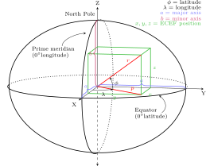
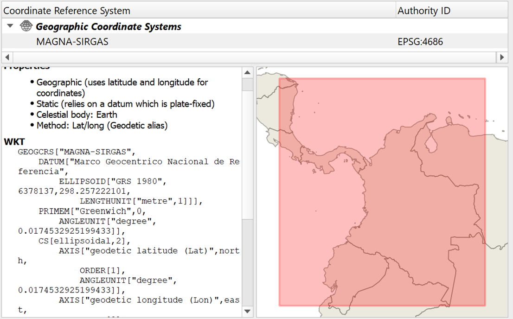

# Georreferenciación
Keywords: `CRS` `SRS` `EPSG-4326` `WGS84`

La georreferenciación es el uso de coordenadas de mapa para asignar una ubicación espacial a entidades cartográficas. Todos los elementos de una capa de mapa tienen una ubicación geográfica y una extensión específicas que permiten situarlos en la superficie de la Tierra o cerca de ella. La capacidad de localizar de manera precisa las entidades geográficas es fundamental tanto en la representación cartográfica como en SIG. Tomado de [ArcGIS Resources](https://resources.arcgis.com/es/help/getting-started/articles/026n0000000s000000.htm).

 Diagram of Earth Centered, Earth Fixed coordinates in relation to latitude and longitude. Tomado de: <a href="https://commons.wikimedia.org/wiki/File:ECEF.svg">https://commons.wikimedia.org</a>  

## Objetivos

* 

## Requerimientos

* Lectura - [Georreferenciación y sistemas de coordenadas](https://resources.arcgis.com/es/help/getting-started/articles/026n0000000s000000.htm)
* Lectura - [¿Qué son las proyecciones cartográficas?](https://resources.arcgis.com/es/help/main/10.1/index.html#//003r00000001000000)
* Lectura - [Forma de la tierra](https://es.wikipedia.org/wiki/Forma_de_la_Tierra)

## ¿Qué es la georrefenciación y qué es un sistema de proyección de coordenadas?[^1]

La forma teórica que convencionalmente se utiliza para definir la Tierra es el Geoide qué se define teóricamente a partir del nivel medio de los mares. Debido a su forma irregular y para la definición de una forma geométrica que pueda ser resuelta matemáticamente de forma simple se utilizan los conceptos de esfera y elipsoide

La georreferenciación es el proceso utilizado para determinar la posición de un objeto o un conjunto de datos mediante un sistema de coordenadas referidas a la superficie terrestre. Los sistemas de coordenadas son un conjunto de parámetros que permiten definir inequívocamente la posición de cualquier punto en un espacio geométrico respecto a un punto denominado origen.

 Relaciones geométricas entre la superficie topográfica de la Tierra, 
el geoide y el elipsoide, necesarias para una cartografía de precisión 
 Tomado de: <a href="http://www.albireotopografia.es/topografia-basica-iii-la-forma-de-la-tierra/">www.albireotopografia.es</a>  

## Sistemas de referencia y proyección cartográfica en Colombia

Las coordenadas determinadas para el desarrollo de proyectos que requieran datos espaciales deben estar ligadas al **Marco Geocéntrico Nacional de Referencias – MAGNA**, razón por lo cual es necesario regirse por las **“Técnicas de georreferenciación para levantamientos topográficos ligados a MAGNA”** expedidos por el Instituto Geográfico Agustín Codazzi – IGAC.

### Sistema de referencia horizontal datum MAGNA-SIRGAS, EPSG:4686

Mediante resolución No. 068 de 2005 se adoptó como único datum oficial de Colombia el Marco Geocéntrico Nacional de Referencia MAGNA (Según resolución MAGNA-SIRGAS), cuyos parámetros son:

| Parámetro                                                                                                                                          | Valor                                            |
|:---------------------------------------------------------------------------------------------------------------------------------------------------|:-------------------------------------------------|
| Código [EPSG](https://en.wikipedia.org/wiki/EPSG_Geodetic_Parameter_Dataset)                                                                       | 4686                                             |
| Primer meridiano                                                                                                                                   | Greenwich 0,000000000000000000 Grados decimales  |
| [Datum geodésico](https://es.wikipedia.org/wiki/Sistema_de_referencia_geod%C3%A9sico)                                                              | MAGNA_SIRGAS                                     |
| [Elipsoide](https://es.wikipedia.org/wiki/Elipsoide)                                                                                               | GRS 1980                                         |
| Semieje mayor (a), metros                                                                                                                          | 6378137                                          |
| Semieje menor (b), metros                                                                                                                          | 6356752.314                                      |
| Aplanamiento inverso o recíproco (1/f), f = (a - b) / a                                                                                            | 298.2572201                                      |
| [ITRF](https://en.wikipedia.org/wiki/International_Terrestrial_Reference_System_and_Frame) - International Terrestrial Reference System and Frame  | 1994, Época 1995.4                               |

> Los valores del semieje mayor y semieje menor corresponden a los parámetros del elipsoide.

 Visualización de sistema de proyección usando QGIS
 Tomado de: <a href="https://qgis.org/">https://qgis.org/</a>  

### Sistema de referencia vertical

Las alturas estarán referidas al nivel medio del mar definidas por el mareógrafo de Buenaventura.

[Red de Vértices Pasivos y de Control Vertical](https://redgeodesica.igac.gov.co/redes/redes_interna/red_pasiva_nivelacion.html): Es la red compuesta de vértices materializados en campo en monumentaciones tipo mojones, pilastras, incrustaciones y obeliscos. En el caso colombiano, los datos coordenados de la Red Geodésica GNSS Nacional Pasiva, se encuentran vinculados al IRTF 2014, época de referencia 2018.0 y elipsoide GRS-80.

### Proyección cartográfica por orígenes

La proyección cartográfica, que consiste en la representación de la superficie terrestre sobre un plano, mediante un sistema bidimensional de coordenadas rectangulares, que muestra la correspondencia biunívoca entre los puntos de la superficie terrestre (φ, λ) y sus equivalentes sobre un plano de proyección (N, E), se ha establecido para Colombia usando el sistema Gauss – Krüger, el cual consiste en una representación conforme del elipsoide sobre un plano; es decir, que el ángulo formado entre dos líneas sobre la superficie terrestre se mantiene al ser estas proyectadas sobre un plano. Los meridianos y paralelos se interceptan perpendicularmente, pero no son líneas rectas, sino curvas complejas, excepto el meridiano central (de tangencia) y el paralelo de referencia. La escala de representación permanece constante sobre el meridiano central; pero esta varía al alejarse de aquel, introduciendo deformaciones en función de la longitud (λ). Por tal razón, el desarrollo de la proyección se controla mediante husos, que en el caso de Colombia se extienden al lado y lado del meridiano central.

El sistema de proyección UTM (Universal Transverse Mercator) corresponde con el de Gauss – Krüger, solo que utiliza un factor de escala equivalente a m= 0,9996 para el meridiano central y husos de 6°.

En Colombia, el origen principal de coordenadas Gauss – Krüger se definió en la pilastra sur del observatorio Astronómico de Bogotá, asignándole los valores N= 1000000 m y E= 1000000 m. Los orígenes complementarios se han establecido a 3º y 6º de longitud al este y oeste de dicho punto. Este sistema se utiliza para la elaboración de cartografía a escalas menores que 1: 1.500.000, donde se proyecta la totalidad del territorio nacional. También se utiliza para cartografía a escalas entre 1: 10.000 y 1: 500.000 de las zonas pobladas comprendidas en la zona de 3º correspondiente.

Coordenadas MAGNA – SIRGAS de los orígenes Gauss – Krüger en Colombia

Latitud origen definida para todos los orígenes 

| Grados  | Minutos  | Segundos  | Grados decimales  |
|:--------|:---------|:----------|:------------------|
| 4       | 35       | 46.3215   | 4.59620041666667  |

Longitudes por cada orígen

| Origen                 | Grados  | Minutos  | Segundos  | Grados decimales  | EPSG |
|:-----------------------|:--------|:---------|:----------|:------------------|:-----|
| MAGNA_OrigenEsteEste   | 68      | 4        | 39.0285   | -68.0775079166666 | 3118 |
| MAGNA_OrigenEste       | 71      | 4        | 39.0285   | -71.0775079166666 | 3117 |
| MAGNA_OrigenBogota     | 74      | 4        | 39.0285   | -74.0775079166666 | 3116 |
| MAGNA_OrigenOeste      | 77      | 4        | 39.0285   | -77.0775079166666 | 3115 |
| MAGNA_OrigenOesteOeste | 80      | 4        | 39.0285   | -80.0775079166666 | 3114 |

## Referencias

* https://resources.arcgis.com/es/help/getting-started/articles/026n0000000s000000.htm
* http://www.albireotopografia.es/topografia-basica-iii-la-forma-de-la-tierra/topografia-geoide-y-elipsoide/

## Control de versiones

| Versión    | Descripción     | Autor                                      | Horas |
|------------|:----------------|--------------------------------------------|:-----:|
| 2024.06.25 | Versión inicial | [rcfdtools](https://github.com/rcfdtools)  |   8   |

_R.SIGE es de uso libre para fines académicos, conoce nuestra licencia, cláusulas, condiciones de uso y como referenciar los contenidos publicados en este repositorio, dando [clic aquí](LICENSE.md)._

_¡Encontraste útil este repositorio!, apoya su difusión marcando este repositorio con una ⭐ o síguenos dando clic en el botón Follow de [rcfdtools](https://github.com/rcfdtools) en GitHub._

| [:arrow_backward: Anterior](../xxxx) | [:house: Inicio](../../README.md) | [:beginner: Ayuda / Colabora](https://github.com/rcfdtools/R.SIGE/discussions/99999) | [Siguiente :arrow_forward:]() |
|---------------------|-------------------|---------------------------------------------------------------------------|---------------|

[^1]: https://geoportal.igac.gov.co