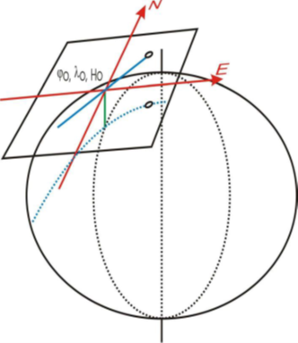

# 1.2. Georreferenciación
Keywords: `CRS` `SRS` `EPSG-4326` `WGS84`

La georreferenciación es el uso de coordenadas de mapa para asignar una ubicación espacial a entidades cartográficas. Todos los elementos de una capa de mapa tienen una ubicación geográfica y una extensión específicas que permiten situarlos en la superficie de la Tierra o cerca de ella. La capacidad de localizar de manera precisa las entidades geográficas es fundamental tanto en la representación cartográfica como en SIG. <sub>Tomado de [ArcGIS Resources](https://resources.arcgis.com/es/help/getting-started/articles/026n0000000s000000.htm).</sub>

<div align="center"><sub><br>Diagram of Earth Centered, Earth Fixed coordinates in relation to latitude and longitude.<br>Tomado de: <a href="https://commons.wikimedia.org/wiki/File:ECEF.svg">https://commons.wikimedia.org</a></sub><br><br></div>


## Objetivos

* Entender conceptos generales de georreferenciación.
* Estudiar los sistemas de proyección utilizados en Colombia.
* Entender como funciona el sistema geográfico mundial WGS84.


## Requerimientos

* [:notebook:Lectura](https://resources.arcgis.com/es/help/main/10.1/index.html#//003r00000001000000): ¿Qué son las proyecciones cartográficas?
* [:notebook:Lectura](https://es.wikipedia.org/wiki/Forma_de_la_Tierra): Forma de la tierra.


## 1. ¿Qué es la georrefenciación y qué es un sistema de proyección de coordenadas?[^1]

La forma que convencionalmente se utiliza para definir la Tierra es el Geoide, qué se define teóricamente a partir del nivel medio de los mares. Debido a su forma irregular y para la definición de una forma geométrica que pueda ser resuelta matemáticamente de forma simple, se utilizan los conceptos de esfera y elipsoide.

<div align="center"><sub><br>Relaciones geométricas entre la superficie topográfica de la Tierra, el geoide y el elipsoide, necesarias para una cartografía de precisión<br>Tomado de: <a href="http://www.albireotopografia.es/topografia-basica-iii-la-forma-de-la-tierra/">www.albireotopografia.es</a></sub><br><br></div>

La georreferenciación es el proceso utilizado para determinar la posición de un objeto o un conjunto de datos mediante un sistema de coordenadas referidas a la superficie terrestre. Los sistemas de coordenadas son un conjunto de parámetros que permiten definir inequívocamente la posición de cualquier punto en un espacio geométrico respecto a un punto denominado origen.

La correcta descripción de la ubicación y la forma de entidades requiere un marco para definir ubicaciones del mundo real. Un sistema de coordenadas geográficas se utiliza para asignar ubicaciones geográficas a los objetos. Un sistema de coordenadas de latitud-longitud global es uno de esos marcos. Otro marco es un sistema de coordenadas cartesianas o planas que surge a partir del marco global.

Los mapas representan ubicaciones en la superficie de la Tierra que utilizan cuadrículas, gratículas y marcas de graduación con etiquetas de diversas ubicaciones terrestres (tanto en medidas de latitud-longitud como en sistemas de coordenadas proyectadas -como metros de UTM-). Los elementos geográficos incluidos en diversas capas de un mapa se trazan en un orden específico (uno sobre otro) para la extensión del mapa determinada.

Los datasets o conjuntos de datos SIG, incluyen ubicaciones de coordenadas dentro de un sistema de coordenadas cartesianas o globales para registrar ubicaciones y formas geográficas. De este modo, es posible superponer capas de datos SIG sobre la superficie de la Tierra.


### 1.1. Latitud y longitud
<sub>Referencia: tomado de https://resources.arcgis.com</sub>

Un método para describir la posición de una ubicación geográfica en la superficie de la Tierra consiste en utilizar mediciones esféricas de latitud y longitud. Estas son mediciones de los ángulos (en grados) desde el centro de la Tierra hasta un punto en su superficie. Este tipo de sistema de referencia de coordenadas generalmente se denomina sistema de coordenadas geográficas.

<div align="center"><sub><br>Latitud y Longitud<br>Tomado de: <a href="https://resources.arcgis.com/es/help/getting-started/articles/026n0000000s000000.htm">https://resources.arcgis.com</a></sub><br><br></div>

La longitud mide ángulos en una dirección este-oeste. Las mediciones de longitud comúnmente se basan en el meridiano de Greenwich, que es una línea imaginaria que realiza un recorrido desde el Polo Norte, a través de Greenwich, Inglaterra, hasta el Polo Sur. Este ángulo es de longitud 0. El oeste del meridiano de Greenwich por lo general se registra como longitud negativa y el este, como longitud positiva. Por ejemplo, la ubicación de Los Angeles, California, tiene una latitud de aproximadamente +33 grados, 56 minutos y una longitud de -118 grados, 24 minutos.

<div align="center"><sub><br>Latitud y Longitud<br>Tomado de: <a href="https://resources.arcgis.com/es/help/getting-started/articles/026n0000000s000000.htm">https://resources.arcgis.com</a></sub><br><br></div>

Si bien la longitud y la latitud se pueden ubicar en posiciones exactas de la superficie de la Tierra, no proporcionan unidades de medición uniformes de longitud y distancia. Solo a lo largo del ecuador la distancia que representa un grado de longitud se aproxima a la distancia que representa un grado de latitud. Esto se debe a que el ecuador es la única línea paralela que es tan extensa como el meridiano. 

> Los círculos con el mismo radio que la Tierra esférica se denominan círculos grandes. El ecuador y todos los meridianos conforman círculos grandes.

Por encima y por debajo del ecuador, los círculos que definen las líneas paralelas de latitud se vuelven gradualmente más pequeños hasta que se convierten en un solo punto en los Polos Norte y Sur donde convergen los meridianos. Mientras los meridianos convergen hacia los polos, la distancia que representa un grado de longitud disminuye a cero. 

> En el esferoide de Clarke 1866, un grado de longitud en el ecuador equivale a 111,321 kilómetros, mientras que a una latitud de 60° solo equivale a 55,802 kilómetros. Ya que los grados de latitud y longitud no poseen una longitud estándar, no es posible medir distancias o áreas en forma precisa o visualizar datos fácilmente en un mapa plano o una pantalla de ordenador. Utilizar muchas aplicaciones (aunque no todas) de representación cartográfica y análisis SIG a menudo requiere un marco de coordenadas planas más estable, que suministran los sistemas de coordenadas proyectadas. De forma alternativa, algunos de los algoritmos utilizados para los operadores espaciales tienen en cuenta el comportamiento geométrico de los sistemas de coordenadas esféricas (geográficas).

### 1.2. Proyecciones de mapa a través de coordenadas cartesianas
<sub>Referencia: tomado de https://resources.arcgis.com</sub>

Un sistema de coordenadas proyectadas es cualquier sistema de coordenadas diseñado para una superficie llana, como un mapa impreso o una pantalla de ordenador.

Los sistemas de coordenadas cartesianas en 2D y 3D brindan el mecanismo para describir la ubicación y la forma geográfica de las entidades utilizando los valores x e y (en grillas ráster, las coordenadas se representan por posiciones en columnas y filas).

El sistema de coordenadas cartesianas utiliza dos ejes: uno horizontal (x), que representa el este y el oeste, y otro vertical (y), que representa el norte y el sur. El punto de intersección de los ejes se denomina el origen. Las ubicaciones de los objetos geográficos se definen en relación al origen, utilizando la notación (x,y), donde x se refiere a la distancia del eje horizontal, e y se refiere a la distancia del eje vertical. El origen se define como (0,0).

En la ilustración que se muestra a continuación, la notación (4,3) registra un punto que se encuentra cuatro unidades por encima en x y tres unidades por encima en y desde el origen.

<div align="center"><sub><br>Coordenadas cartesianas<br>Tomado de: <a href="https://resources.arcgis.com/es/help/getting-started/articles/026n0000000s000000.htm">https://resources.arcgis.com</a></sub><br><br></div>


### 1.3. Sistemas de coordenadas en 3D
<sub>Referencia: tomado de https://resources.arcgis.com</sub>

Cada vez más sistemas de coordenadas proyectadas utilizan un valor z para medir la elevación por encima o por debajo del nivel del mar.

En la ilustración que se muestra a continuación, la notación (2,3,4) registra un punto que está dos unidades por encima de x y tres unidades por encima de y desde el origen, y cuya elevación está cuatro unidades por encima de la superficie de la Tierra (4 metros por encima del nivel del mar).

<div align="center"><sub><br>Coordenadas 3D<br>Tomado de: <a href="https://resources.arcgis.com/es/help/getting-started/articles/026n0000000s000000.htm">https://resources.arcgis.com</a></sub><br><br></div>


### 1.4. Propiedades y distorsión en proyecciones del mapa  
<sub>Referencia: tomado de https://resources.arcgis.com</sub>

Debido a que la Tierra generalmente es considerada esférica, uno de los desafíos que deben afrontar los cartógrafos o profesionales de SIG es cómo representar al mundo real por medio de un sistema de coordenadas llanas o planas. Para poder comprender el dilema, piense cómo aplanaría una pelota de básquetbol; esto no se puede hacer sin distorsionar su forma o crear áreas de discontinuidad. El proceso de aplanamiento de la Tierra se denomina proyección, de ahí el término proyección de mapas.

Un sistema de coordenadas proyectadas se define sobre una superficie plana de dos dimensiones. Las coordenadas proyectadas se pueden definir en 2D (x,y) o 3D (x,y,z), donde las mediciones x,y representan la ubicación en la superficie de la Tierra y z representaría la altura por encima o por debajo del nivel del mar.

<div align="center"><sub><br>Familias de proyecciones<br>Tomado de: <a href="https://resources.arcgis.com/es/help/getting-started/articles/026n0000000s000000.htm">https://resources.arcgis.com</a></sub><br><br></div>

<div align="center"><sub><br>Distorsiones<br>Tomado de: <a href="https://resources.arcgis.com/es/help/getting-started/articles/026n0000000s000000.htm">https://resources.arcgis.com</a></sub><br><br></div>

A diferencia de un sistema de coordenadas geográficas, un sistema de coordenadas proyectadas posee longitudes, ángulos y áreas constantes en las dos dimensiones. Sin embargo, todas las proyecciones de mapa que representan la superficie de la Tierra como un mapa plano crean distorsiones en algún aspecto de la distancia, el área, la forma o la dirección.

Como usuarios SIG, debemos lidiar con estas limitaciones utilizando proyecciones de mapa que se adaptan al uso previsto, su ubicación geográfica específica y la extensión deseada. El software SIG también puede transformar la información entre sistemas de coordenadas distintos para admitir la integración de datasets guardados en sistemas de coordenadas que difieren y para respaldar diversos flujos de trabajo fundamentales.

Muchas proyecciones de mapas están diseñadas para fines específicos. Se podría usar una proyección de mapa para preservar la forma y otra para preservar el área (proyecciones conformes frente a proyecciones de áreas equivalentes).

Estas propiedades (la proyección de mapa, junto con esferoide y datum) se convierten en parámetros importantes en la definición del sistema de coordenadas para cada dataset SIG y cada mapa. Al registrar descripciones detalladas de estas propiedades para cada dataset SIG, los equipos pueden volver a proyectar y transformar las ubicaciones geográficas de los elementos de dataset aleatoriamente en cualquier sistema de coordenadas adecuado. Por lo tanto, es posible integrar y combinar información de múltiples capas SIG independientemente de sus sistemas de coordenadas. Esta es una función fundamental de los sistemas SIG. La ubicación precisa comprende la base de casi todas las operaciones SIG.


## 2. Sistemas de referencia y proyección cartográfica en Colombia

Las coordenadas determinadas para el desarrollo de proyectos que requieran datos espaciales deben estar ligadas al _Marco Geocéntrico Nacional de Referencias – MAGNA_, razón por lo cual es necesario regirse por las _“Técnicas de georreferenciación para levantamientos topográficos ligados a MAGNA”_ expedidos por el Instituto Geográfico Agustín Codazzi – IGAC.


### 2.1. Sistema de referencia horizontal datum MAGNA-SIRGAS, EPSG:4686

Mediante resolución No. 068 de 2005 se adoptó como único datum oficial de Colombia el Marco Geocéntrico Nacional de Referencia MAGNA (Según resolución MAGNA-SIRGAS), cuyos parámetros son:

<div align="center">

| Parámetro o constante                                                                                                                             | Valor                                            |
|:--------------------------------------------------------------------------------------------------------------------------------------------------|:-------------------------------------------------|
| Código [EPSG](https://en.wikipedia.org/wiki/EPSG_Geodetic_Parameter_Dataset)                                                                      | 4686                                             |
| Primer meridiano                                                                                                                                  | Greenwich 0,000000000000000000 Grados decimales  |
| [Datum geodésico](https://es.wikipedia.org/wiki/Sistema_de_referencia_geod%C3%A9sico)                                                             | MAGNA_SIRGAS                                     |
| [Elipsoide](https://es.wikipedia.org/wiki/Elipsoide)                                                                                              | GRS 1980                                         |
| Semieje mayor (a), metros                                                                                                                         | 6378137                                          |
| Semieje menor (b), metros                                                                                                                         | 6356752.314                                      |
| Aplanamiento inverso o recíproco (1/f), f = (a - b) / a                                                                                           | 298.2572201                                      |
| [ITRF](https://en.wikipedia.org/wiki/International_Terrestrial_Reference_System_and_Frame) - International Terrestrial Reference System and Frame | 1994, Época 1995.4                               |

</div>

> Los valores del semieje mayor y semieje menor corresponden a los parámetros del elipsoide.

<div align="center"><sub><br>Visualización de sistema de proyección usando QGIS <br>Tomado de: <a href="https://qgis.org/">https://qgis.org/</a></sub><br><br></div>


### 2.2. Sistema de referencia vertical

Las alturas estarán referidas al nivel medio del mar definidas por el mareógrafo de Buenaventura.

[Red de Vértices Pasivos y de Control Vertical](https://redgeodesica.igac.gov.co/redes/redes_interna/red_pasiva_nivelacion.html): Es la red compuesta de vértices materializados en campo en monumentaciones tipo mojones, pilastras, incrustaciones y obeliscos. En el caso colombiano, los datos coordenados de la Red Geodésica GNSS Nacional Pasiva, se encuentran vinculados al IRTF 2014, época de referencia 2018.0 y elipsoide GRS-80.


### 2.3. Proyección cartográfica por orígenes, EPSG: 3114 a 3118

La proyección cartográfica, que consiste en la representación de la superficie terrestre sobre un plano, mediante un sistema bidimensional de coordenadas rectangulares, que muestra la correspondencia biunívoca entre los puntos de la superficie terrestre (φ, λ) y sus equivalentes sobre un plano de proyección (N, E), se ha establecido para Colombia usando el sistema Gauss – Krüger, el cual consiste en una representación conforme del elipsoide sobre un plano; es decir, que el ángulo formado entre dos líneas sobre la superficie terrestre se mantiene al ser estas proyectadas sobre un plano. Los meridianos y paralelos se interceptan perpendicularmente, pero no son líneas rectas, sino curvas complejas, excepto el meridiano central (de tangencia) y el paralelo de referencia. La escala de representación permanece constante sobre el meridiano central; pero esta varía al alejarse de aquel, introduciendo deformaciones en función de la longitud (λ). Por tal razón, el desarrollo de la proyección se controla mediante husos, que en el caso de Colombia se extienden al lado y lado del meridiano central.

<div align="center"><sub><br>Sistema de proyección cartográfica Gauss-Krüger<br>Tomado de: <a href="https://www.researchgate.net/figure/Figura-20-Sistema-de-proyeccion-cartografica-Gauss-Kruger_fig9_277276925">https://www.researchgate.net</a></sub><br><br></div>

El sistema de proyección UTM (Universal Transverse Mercator) corresponde con el de Gauss – Krüger, solo que utiliza un factor de escala equivalente a m= 0,9996 para el meridiano central y husos de 6°.

En Colombia, el origen principal de coordenadas Gauss – Krüger se definió en la pilastra sur del observatorio Astronómico de Bogotá, asignándole los valores N= 1000000 m y E= 1000000 m. Los orígenes complementarios se han establecido a 3º y 6º de longitud al este y oeste de dicho punto. Este sistema se utiliza para la elaboración de cartografía a escalas menores que 1: 1.500.000, donde se proyecta la totalidad del territorio nacional. También se utiliza para cartografía a escalas entre 1: 10.000 y 1: 500.000 de las zonas pobladas comprendidas en la zona de 3º correspondiente.

<div align="center">

Coordenadas elipsoidales MAGNA – SIRGAS de los orígenes Gauss – Krüger en Colombia

Latitud origen definida para todos los orígenes (N)

|  Grados  |  Minutos  |  Segundos  | Grados decimales  |
|:--------:|:---------:|:----------:|:------------------|
|    4     |    35     |  46.3215   | 4.59620041666667  |

Longitudes por cada orígen (W)

| Origen                 | Grados  |  Minutos  |  Segundos  | Grados decimales  | EPSG  |
|:-----------------------|:-------:|:---------:|:----------:|:------------------|:-----:|
| MAGNA_OrigenEsteEste   |   -68   |     4     |  39.0285   | -68.0775079166666 | 3118  |
| MAGNA_OrigenEste       |   -71   |     4     |  39.0285   | -71.0775079166666 | 3117  |
| MAGNA_OrigenBogota     |   -74   |     4     |  39.0285   | -74.0775079166666 | 3116  |
| MAGNA_OrigenOeste      |   -77   |     4     |  39.0285   | -77.0775079166666 | 3115  |
| MAGNA_OrigenOesteOeste |   -80   |     4     |  39.0285   | -80.0775079166666 | 3114  |

Coordenadas Gauss – Krüger

|  Falso norte (m)  |  False este (m)   |
|:-----------------:|:-----------------:|
|      1000000      |      1000000      |

</div>

> Dado el requerimiento propio de la proyección Gauss – Krüger de introducir varios orígenes para la representación cartográfica del territorio colombiano, pueden presentarse puntos diferentes con valores de coordenadas idénticos, de allí debe prestarse especial atención al huso o zona en la que se encuentra el punto de interés, de modo que se eviten incongruencias al obtener coordenadas geográficas a partir de las planas (N, E).

<div align="center"><sub><br>Orígenes de la proyección Gauss-Krüger para Colombia <br>Tomado de: <a href="https://www.igac.gov.co/">https://www.igac.gov.co/</a></sub><br><br></div>

<div align="center">
Visualización de sistemas de proyección usando QGIS<br>


</div>


### 2.4. Proyección cartográfica origen nacional único Colombia, EPSG:9377 o ESRI: 103599[^2] 

El establecimiento de las condiciones técnicas mínimas que deben tener los productos básicos de cartografía oficial, serán los definidos de conformidad con lo dispuesto por la Resolución 471 del 14 de mayo de 2020 y la posterior Resolución 529 del 05 de junio de 2020, emitidas por el Instituto Geográfico Agustín Codazzi - IGAC, o la norma que la modifique y sustituya, para ello y para garantizar la homogeneidad y continuidad en la representación de los elementos del territorio, así como facilitar los trabajos relacionados con la gestión de coordenadas en el país. En tal sentido, los proyectos, obras o actividades, sujetos al licenciamiento ambiental, deben ajustar su información geográfica a los lineamientos establecidos en la referida normatividad, para la evaluación y seguimiento de los estudios ambientales y/o presentación de los Informes de Cumplimiento Ambiental.

El sistema de proyección cartográfico para Colombia, con un único origen, consiste en una proyección cartográfica [Transversa Mercator Secante](https://en.wikipedia.org/wiki/Transverse_Mercator_projection), cuyos parámetros están establecidos en el literal i Sistema de Referencia del artículo 4 de la resolución 471 de 2020, los cuales pueden configurarse en software especializado para procesamiento de información geográfica.

<div align="center"><sub><br> Proyección sobre una superficie cilíndrica con diferentes paralelos<br>Tomado de: <a href="https://commons.wikimedia.org/wiki/File:Comparison_of_cylindrical_projections.svg">https://commons.wikimedia.org</a></sub><br><br></div>

```
PROJCS["MAGNA_Colombia_Origen_Unico",GEOGCS["GCS_MAGNA",DATUM["D_MAGNA",SPHEROID["GRS_1980",6378137.0,298.257222101]],PRIMEM["Greenwich",0.0],UNIT["Degree",0.0174532925199433]],PROJECTION["Transverse_Mercator"],PARAMETER["False_Easting",5000000.0],PARAMETER["False_Northing",2000000.0],PARAMETER["Central_Meridian",-73.0],PARAMETER["Scale_Factor",0.9992],PARAMETER["Latitude_Of_Origin",4.0],UNIT["Meter",1.0]]
```

<div align="center">

Latitud y longitud origen en grados decimales

|  Latitud (dd)  |  Longitud (dd)  |
|:--------------:|:---------------:|
|       4        |       -73       |

Coordenadas

|  Falso norte (m)  |  False este (m)  |
|:-----------------:|:----------------:|
|      2000000      |     5000000      |

</div>

<div align="center">
Visualización del sistema de proyección usando QGIS<br>

</div>


### 2.5. Proyección cartesiana

El sistema de proyección cartesiana equivale a una representación conforme del elipsoide sobre un plano paralelo al tangente que rozaría al elipsoide en el punto origen (φ0, λ0). La proyección del meridiano que pasa por este punto representa el eje de coordenada Norte. No obstante, los puntos sobre el elipsoide y los equivalentes proyectados sobre el plano no tienen una relación geométrica, Esta es puramente matemática. La proyección cartesiana es utilizada para la elaboración de planos de ciudades (cartografía a escalas mayores que 1: 5000), de allí, existen tantos orígenes de coordenadas cartesianas como ciudades o municipios. El plano de proyección se define sobre la altitud media de la zona poblacional a representar.

Al igual que en el sistema de Gauss – Krüger, la proyección cartesiana puede presentarse para ambigüedades en la definición unívoca de coordenadas, por tal razón, Estas siempre van acompañadas del origen al que se refieren.

Los parámetros de coordenadas geográficas y planas asignadas para el origen del sistema son suministrados por el Instituto Geográfico Agustín Codazzi, para cada proyecto, mediante certificado de Origen Cartesiano.

<div align="center"><sub><br>Proyección cartesiana<br>Tomado de: <a href="https://www.igac.gov.co/">https://www.igac.gov.co/</a></sub><br><br></div>


### 2.6. Elipsoide GRS80 (Geodetic Reference System, 1980)

El elipsoide GRS80 fue definido y adoptado oficialmente por la Asociación Internacional de Geodesia (AIG: International Association of Geodesy) de la Unión Internacional de Geodesia y Geofísica (IUGG: International Union of Geodesy and Geophysics) en 1979. Este es el elipsoide asociado al ITRS (Sistema Internacional de Referencia Terreste), por tanto, a SIRGAS (Sistema de Referencia Geocéntrico para Las Américas) y a MAGNA. En la práctica equivale al elipsoide WGS84 (World Geodetic System, 1984). Sus constantes son: 

<div align="center"><sub><br>Proyección cartesiana<br>Tomado de: <a href="https://www.igac.gov.co/">https://www.igac.gov.co/</a></sub><br><br></div>


## 3. Sistema geodésico mundial WGS84 – EPSG: 4326 

El WGS84 es un sistema de coordenadas geográficas mundial que permite localizar cualquier punto de la Tierra (sin necesitar otro de referencia) por medio de tres unidades dadas. WGS84 son las siglas en inglés de World Geodetic System 84 que significa Sistema Geodésico Mundial 1984. 

> El Sistema Geodésico Mundial es un estándar para su uso en la cartografía, geodesia y navegación. Cuenta con un estándar de coordenadas de la Tierra, un estándar de referencia de la superficie esférica (el dato o elipsoide de referencia) para los datos de altitud primas, y una superficie equipotencial gravitacional (el geoide) que define el nivel del mar nominal. El origen de coordenadas de WGS84 está destinado a ser ubicado en el centro de la masa de la Tierra, se cree que el error es menos de 2 cm por lo que es en la que se basa el Sistema de Posicionamiento Global (GPS).

<div align="center">
Visualización del sistema de proyección usando QGIS<br>
<br>
</div><br>

El sistema de referencia WGS84 es un sistema global geocéntrico, definido por los parámetros:

Origen

* Centro de masa de la Tierra

Sistemas de ejes coordenados:

* Eje Z: dirección del polo de referencia del IERS - The International Earth Rotation Service
* Eje X: intersección del meridiano origen definido en 1984 por el BIH y el plano del Ecuador (incertidumbre de 0.005”).
* Eje Y: eje perpendicular a los dos anteriores y coincidentes en el origen.

Elipsoide WGS84: elipsoide de revolución definido por los parámetros:

* Semieje mayor (a) = 6378137 m
* Semieje menor (b) = 6356752.31424 m
* Achatamiento f: 1 / 298,257223563

Constante de Gravitación Terrestre
* GM = 3,986004418x1014 m³/s²

Velocidad angular

* ω = 7,292115x10-5 rad/s

Coeficiente de forma dinámica

* J2= -484,166 85 x 10-6

> El WGS84 utiliza el meridiano de referencia IERS definido por la Oficina Internacional de l'Heure. Se definió por la compilación de las observaciones de estrellas en diferentes países. La media de estos datos causó un desplazamiento de unos 100 metros al este lejos del Meridiano de Greenwich en Greenwich en el Reino Unido. 


## Actividades de proyecto :triangular_ruler:

En la siguiente tabla se listan las actividades que deben ser desarrolladas y documentadas por cada grupo de proyecto en un único archivo de Adobe Acrobat .pdf. El documento debe incluir portada (indicando el caso de estudio, número de avance, nombre del módulo, fecha de presentación, nombres completos de los integrantes), numeración de páginas, tabla de contenido, lista de tablas, lista de ilustraciones, introducción, objetivo general, capítulos por cada ítem solicitado, conclusiones y referencias bibliográficas.

| Actividad     | Alcance                                                                                                                                                                                                                                                                                                                                                                                                                                              |
|:--------------|:-----------------------------------------------------------------------------------------------------------------------------------------------------------------------------------------------------------------------------------------------------------------------------------------------------------------------------------------------------------------------------------------------------------------------------------------------------|
| Avance **P1** | Esta actividad no requiere del desarrollo de elementos en el avance del proyecto final, los contenidos son evaluados en el quiz de conocimiento y habilidad.                                                                                                                                                                                                                                                                                         |
| Avance **P1** | En una tabla y al final del informe de avance de esta entrega, indique el detalle de las sub-actividades realizadas por cada integrante de su grupo. Para actividades que no requieren del desarrollo de elementos de avance, indicar si realizo la lectura de la guía de clase y las lecturas indicadas al inicio en los requerimientos. Utilice las siguientes columnas: Nombre del integrante, Actividades realizadas, Tiempo dedicado en horas.  |


## Referencias

* https://origen.igac.gov.co/docs/ABC_Nueva_Proyeccion_Cartografica_Colombia.pdf
* https://resources.arcgis.com/es/help/getting-started/articles/026n0000000s000000.htm
* http://www.albireotopografia.es/topografia-basica-iii-la-forma-de-la-tierra/topografia-geoide-y-elipsoide/
* http://www.publicacions.ub.edu/liberweb/astronomia_esferica/material/version_pdf/Tomo%201/2.1%20Elipsoide%20terrestre.pdf
* Especificaciones técnicas cartografía básica. Anexo 2 – Tipos de coordenadas manejados en Colombia, Instituto Geográfico Agustín Codazzi – IGAC. Subdirección Geografía y Cartografía. 
* Especificaciones técnicas cartografía básica, Instituto Geográfico Agustín Codazzi – IGAC. Subdirección Geografía y Cartografía. 2016


## Control de versiones

| Versión    | Descripción                                | Autor                                      | Horas |
|------------|:-------------------------------------------|--------------------------------------------|:-----:|
| 2018.07.22 | Versión inicial contenida en el curso TSIG | [rcfdtools](https://github.com/rcfdtools)  |   8   |
| 2024.06.25 | Versión adaptada curso SIGE                | [rcfdtools](https://github.com/rcfdtools)  |   4   |


_R.SIGE es de uso libre para fines académicos, conoce nuestra licencia, cláusulas, condiciones de uso y como referenciar los contenidos publicados en este repositorio, dando [clic aquí](LICENSE.md)._

_¡Encontraste útil este repositorio!, apoya su difusión marcando este repositorio con una ⭐ o síguenos dando clic en el botón Follow de [rcfdtools](https://github.com/rcfdtools) en GitHub._

| [:arrow_backward: Anterior](../GISBasic/Readme.md) | [:house: Inicio](../../README.md) | [:beginner: Ayuda / Colabora](https://github.com/rcfdtools/R.SIGE/discussions/4)   | [Siguiente :arrow_forward:](../StudyCaseHistory/Readme.md) |
|----------------------------------------------------|-----------------------------------|------------------------------------------------------------------------------------|------------------------------------------------------------|

[^1]: https://geoportal.igac.gov.co y https://resources.arcgis.com/
[^2]: https://www.anla.gov.co/01_anla/entidad/subdirecciones-y-oficinas/instrumentos-permisos-y-tramites-ambientales/sistema-de-informacion-geografica