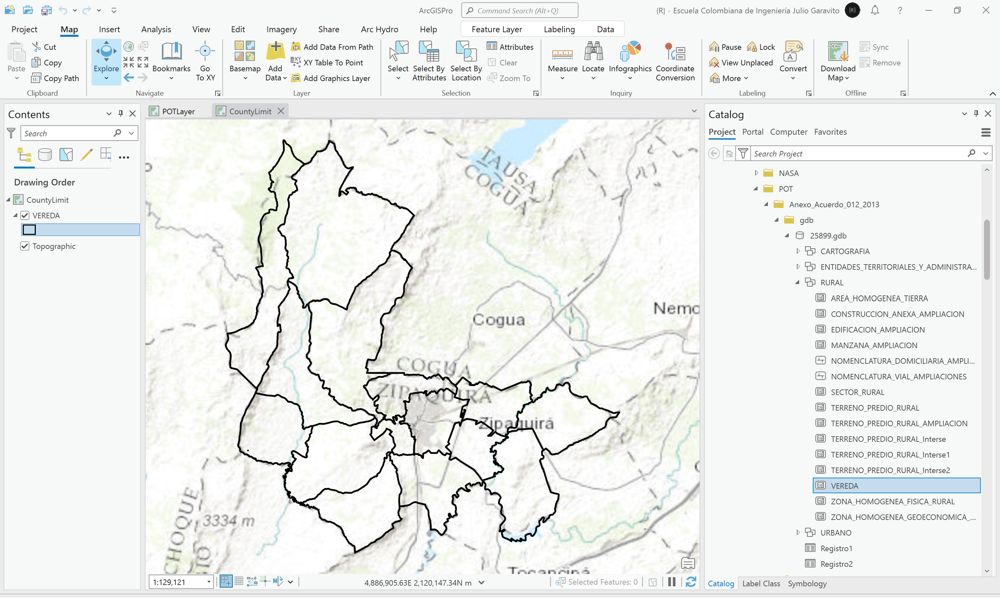

# Análisis veredal y límite territorial
Keywords: rural-limit geopolitical-limit rural-zone

En esta actividad evaluaremos los límites veredales y sus diferencias a partir del análisis de diferentes fuentes de información. Luego, crearemos el límite territorial municipal global que será utilizado para el recorte de la información geo-espacial obtenida en actividades posteriores.

 Tomado de: <a href="Public Domain, https://commons.wikimedia.org/w/index.php?curid=479365">https://commons.wikimedia.org</a>  

## Objetivos

* Evaluar los límites geopolíticos veredales e identificar sus diferencias.
* Crear el límite municipal global.

## Requerimientos

* [:mortar_board:Actividad](../POTLayer/Readme.md): Inventario de información geo-espacial recopilada del POT y diccionario de datos.
* [:toolbox:Herramienta](https://www.esri.com/en-us/arcgis/products/arcgis-pro/overview): ArcGIS Pro de ESRI
* [:toolbox:Herramienta](https://qgis.org/): QGIS

## 1. Procedimiento general en ArcGIS Pro

### 1.1. Mapa veredal diagnóstico POT año 2010

1. Abra el proyecto de ArcGIS Pro creado en la actividad anterior y desde el menú _Insert_ cree un nuevo mapa _New Map_ y renombre como _CountyLimit_. Podrá observar que ahora disponemos de dos mapas en el panel del catálogo. 

2. En la tabla de contenido o _Contents_, de clic derecho sobre el nombre del mapa _CountyLimit_, y seleccione la opción Propiedades o _Properties_. En la pestaña _Coordinate Systems_, busque, seleccione y asigne el sistema de proyección de coordenadas 9377, correspondiente al Orígen Único Nacional de Colombia.

3. Desde el Panel de Catálogo (_Catalog_) localizado a la derecha, cargue al mapa desde la ruta _\R.SIGE\file\data\POT\Anexo_Acuerdo_012_2013\gdb\25899.gdb\Rural\_, la clase de entidad denominada _VEREDA_. De clic en el ícono de simbología de la capa y establezca borde negro y sin relleno.

4. Seleccione en _Contents_ la capa _VEREDA_, en la parte superior podrá observar que se activan opciones específicas para esta capa, vaya al menú _Labeling_ y establezca el rotulado de la capa utilizando a partir del nombre de la vereda.

5. En el panel contents, seleccione la capa, abra la tabla de atributos u oprima <kbd>Ctrl<kbd>+<kbd>T<kbd> y con la opción _Add_ agregue los siguientes campos:

| Campo | Descripción                    | Tipo    |
|-------|--------------------------------|---------|
| APha  | Área planar en hectáreas       | Double  |
| AGha  | Área geográfica en hectáreas   | Double  |
| PPm   | Perímetro planar en metros     | Double  |
| PGm   | Perímetro geográfico en metros | Double  |

> Los valores planares corresponden a los calculados a partir de la proyección de la capa sobre un plano horizontal.
> Los valores geográficos corresponden a los calculados teniendo en cuenta la curvatura terrestre.

En la tabla podrá observar que esta capa se compone de 14 entidades o veredas.

> Como observa, el área urbana no esta incluída en los límites geográficos de la capa, sin embargo, podrá calcular su área restando

### 1.2. Mapa veredal a partir de predios diagnóstico POT año 2010

### 1.3. Mapa veredal formulación POT año 2013

### 1.4. Mapa veredal a partir de predios año 2020

### 1.5. Mapa veredal DANE 2022

https://www.colombiaenmapas.gov.co

### 

## Actividades de proyecto :triangular_ruler:

En la siguiente tabla se listan las actividades que deben ser desarrolladas y documentadas por cada grupo de proyecto en un único archivo de Adobe Acrobat .pdf. El documento debe incluir portada (indicando el caso de estudio, número de avance, nombre del módulo, fecha de presentación, nombres completos de los integrantes), numeración de páginas, tabla de contenido, lista de tablas, lista de ilustraciones, introducción, objetivo general, capítulos por cada ítem solicitado, conclusiones y referencias bibliográficas.

| Actividad     | Alcance                                                                                                                                                                                                                                                                                                                                                                                                                                             |
|:--------------|:----------------------------------------------------------------------------------------------------------------------------------------------------------------------------------------------------------------------------------------------------------------------------------------------------------------------------------------------------------------------------------------------------------------------------------------------------|
| Avance **P1** | Esta actividad no requiere del desarrollo de elementos en el avance del proyecto final, los contenidos son evaluados en el quiz de conocimiento y habilidad.                                                                                                                                                                                                                                                                                        | 
| Avance **P1** | En una tabla y al final del informe de avance de esta entrega, indique el detalle de las sub-actividades realizadas por cada integrante de su grupo. Para actividades que no requieren del desarrollo de elementos de avance, indicar si realizo la lectura de la guía de clase y las lecturas indicadas al inicio en los requerimientos. Utilice las siguientes columnas: Nombre del integrante, Actividades realizadas, Tiempo dedicado en horas. | 

> No es necesario presentar un documento de avance independiente, todos los avances de proyecto de este módulo se integran en un único documento.
> 
> En el informe único, incluya un numeral para esta actividad y sub-numerales para el desarrollo de las diferentes sub-actividades, siguiendo en el mismo orden de desarrollo presentado en esta actividad.

## Referencias

*  

## Control de versiones

| Versión    | Descripción                                                | Autor                                      | Horas |
|------------|:-----------------------------------------------------------|--------------------------------------------|:-----:|
| 2024.02.24 | Versión inicial con alcance de la actividad                | [rcfdtools](https://github.com/rcfdtools)  |   4   |
| 2024.06.27 | Investigación y documentación para caso de estudio general | [rcfdtools](https://github.com/rcfdtools)  |   8   |

_R.SIGE es de uso libre para fines académicos, conoce nuestra licencia, cláusulas, condiciones de uso y como referenciar los contenidos publicados en este repositorio, dando [clic aquí](LICENSE.md)._

_¡Encontraste útil este repositorio!, apoya su difusión marcando este repositorio con una ⭐ o síguenos dando clic en el botón Follow de [rcfdtools](https://github.com/rcfdtools) en GitHub._

| [:arrow_backward: Anterior](../POTLayer/Readme.md) | [:house: Inicio](../../README.md) | [:beginner: Ayuda / Colabora](https://github.com/rcfdtools/R.SIGE/discussions/99999) | [Siguiente :arrow_forward:]() |
|--------------------------------------------|-------------------|---------------------------------------------------------------------------|---------------|

[^1]: 