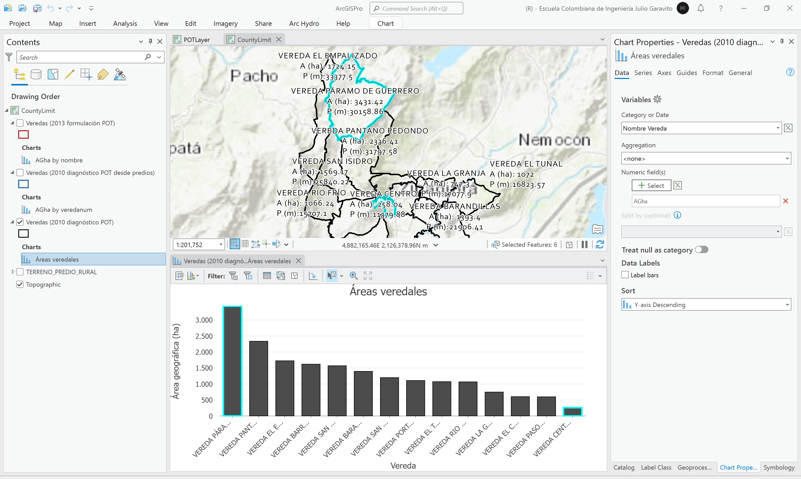
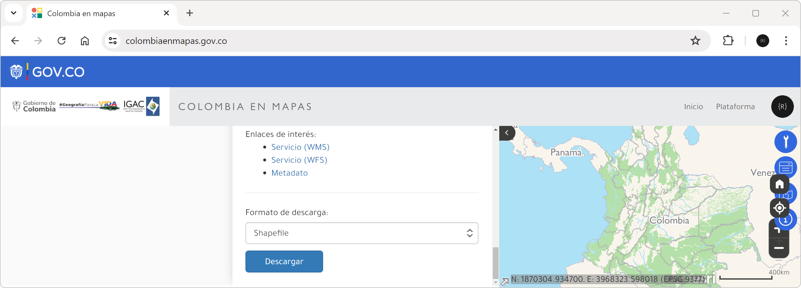

# Análisis veredal y límite territorial
Keywords: `rural-limit` `geopolitical-limit` `rural-zone` `dissolve` `geometry-calculator` `advanced-labeling`

En esta actividad evaluaremos los límites veredales y sus diferencias a partir del análisis de diferentes fuentes de información. Luego, crearemos el límite territorial municipal global que será utilizado para el recorte de la información geo-espacial obtenida en actividades posteriores.

 Tomado de: <a href="Public Domain, https://commons.wikimedia.org/w/index.php?curid=479365">https://commons.wikimedia.org</a>  

## Objetivos

* Evaluar los límites geopolíticos veredales e identificar y entender sus diferencias.
* Crear el límite municipal global.

## Requerimientos

* [:mortar_board:Actividad](../POTLayer/Readme.md): Inventario de información geo-espacial recopilada del POT y diccionario de datos.
* [:open_file_folder:VeredaLimite.xlsx](VeredaLimite.xlsx): libro para registro y análisis de áreas veredales
* [:toolbox:Herramienta](https://www.microsoft.com/es/microsoft-365/excel?market=bz): Microsoft Excel 365.
* [:toolbox:Herramienta](https://www.esri.com/en-us/arcgis/products/arcgis-pro/overview): ESRI ArcGIS Pro 3.3.1 o superior.
* [:toolbox:Herramienta](https://qgis.org/): QGIS 3.38 o superior.

## 1. Procedimiento general en ArcGIS Pro

### 1.1. Mapa veredal diagnóstico POT año 2010

1. Abra el proyecto de ArcGIS Pro creado en la actividad anterior y desde el menú _Insert_ cree un nuevo mapa _New Map_ y renombre como _CountyLimit_. Podrá observar que ahora disponemos de dos mapas en el panel del catálogo. 

2. En la tabla de contenido o _Contents_, de clic derecho sobre el nombre del mapa _CountyLimit_, y seleccione la opción Propiedades o _Properties_. En la pestaña _Coordinate Systems_, busque, seleccione y asigne el sistema de proyección de coordenadas 9377, correspondiente al Orígen Único Nacional de Colombia.

3. Desde el Panel de Catálogo (_Catalog_) localizado a la derecha, cargue al mapa desde la ruta _\R.SIGE\file\data\POT\Anexo_Acuerdo_012_2013\gdb\25899.gdb\Rural\_, la clase de entidad denominada _VEREDA_. De clic en el ícono de simbología de la capa y establezca borde negro y sin relleno.

4. Seleccione en _Contents_ la capa _VEREDA_, en la parte superior podrá observar que se activan opciones específicas para esta capa, vaya al menú _Labeling_ y establezca el rotulado de la capa utilizando a partir del nombre de la vereda.

5. En el panel _Contents_, seleccione la capa, abra la tabla de atributos u oprima <kbd>Ctrl</kbd>+<kbd>T</kbd> y con la opción _Add_ agregue los siguientes campos y guarde las modificaciones realizadas en la tabla cerrando la ventana de modificación o mediante la opción guardar o _Save_ que aparece en el menú superior:

| Campo | Descripción                   | Tipo    | Propiedad ArcGIS Pro        | 
|-------|-------------------------------|---------|-----------------------------| 
| APha  | Área planar en hectáreas      | Double  | Area                        |
| AGha  | Área geodésica en hectáreas   | Double  | Area (geodesic)             |
| PPm   | Perímetro planar en metros    | Double  | Perimeter length            |
| PGm   | Perímetro geodésico en metros | Double  | Perimeter length (geodesic) |

> Tenga en cuenta que al crear los campos no se calculan automáticamente estas propiedades geométricas.  
> Los valores planares corresponden a los calculados a partir de la proyección de la capa sobre un plano horizontal.  
> Los valores geodésicos corresponden a los calculados teniendo en cuenta la curvatura terrestre.

En la tabla podrá observar que esta capa se compone de 14 entidades o veredas.

6. En la tabla de atributos y dando clic sobre el campo `APha`, seleccione la opción _Calculate Geometry_ que le permitirá calcular las propiedades geométricas asociadas a las entidades.

Calcule las propiedades solicitadas indicando las unidades de cálculo y el sistema de proyección 9377, correspondiente a MAGNA Orígen Único Nacional de Colombia.

> En actividades anteriores evidenciamos que el sistema de proyección de coordenadas de las capas recopiladas del POT es el 3116, correspondiente a MAGNA Sirgas Orígen Bogotá.  
> Tenga en cuenta que el cálculo de las propiedades geométricas puede variar entre sistemas de coordenadas, por lo cual, los valores calculádos automáticamente (por estar contenida la capa dentro de una GDB) en esta capa en los campos Shape_Area y Shape_length (a partir del CRS 3116), son diferentes a los obtenidos con el sistema 9377.

Incluya un campo adicional tipo entero largo con el nombre `Nodos` y desde el editor de geometría, calcule el número de nodos que componen cada entidad, utilizando para ello la propiedad geométrica número de vértices (_Number of Vertices_).

> :bulb:Recuerde que luego de incluir o modificar campos de atributos en tablas o capas, estos deben ser documentados en el diccionario de datos.

7. Modifique el rótulo agregando el campo de área y perímetro geodésico, utilice una de las siguientes expresiones:

| Lenguaje | Sentencia                                                                                                                                       |
|----------|-------------------------------------------------------------------------------------------------------------------------------------------------|
| Arcade   | `$feature.nombre + textformatting.NewLine + "A (ha): " + Round($feature.AGha, 2) + textformatting.NewLine + "P (m):" + Round($feature.PGm, 2)`  |
| VBScript | `[nombre] & VbNewLine & "A (ha): " & Round([AGha],2) & VbNewLine & "P (m):" & Round([PGm], 2)`                                                  |
| Python   | `[nombre] + "\nA (ha): " + str(round(float([AGha]), 2)) + "\nP (m):" + str(round(float([PGm]), 2))`                                             |
| JScript  | `[nombre] + "\nA (ha): " + parseFloat([AGha]).toFixed(2) + "\nP (m):" + parseFloat([PGm]).toFixed(2)`                                           |

8. En el panel lateral *Contents*, de clic derecho en _VEREDA_ y seleccione la opción _Create Chart / Bar Chart_, cree una gráfica en orden descendente para los valores de área geográfica, podrá observar que la vereda Páramo de Guerrero es la de mayor extensión.

### 1.2. Mapa veredal a partir de predios diagnóstico POT año 2010

Para iniciar, en el panel lateral _Contents_, apague la capa VEREDA.

1. Desde la misma ruta anterior _\R.SIGE\file\data\POT\Anexo_Acuerdo_012_2013\gdb\25899.gdb\Rural\_, agregue la clase de entidad _TERRENO_PREDIO_RURAL_. Cambie la simbología a polígonos sin relleno.

2. Abra la tabla de atributos e identifique el campo que contiene el código de identificación de vereda y cambie la simbología de representación de símbolo simple a valores únicos utilizando este campo. Podrá observar que los polígonos de predios de una misma vereda tienen el mismo color.

3. En el menú superior, de clic en el grupo _Analysis_ y de clic en _Tools_. Podrá observar que a la derecha aparece el panel _Geoprocessing_. En el campo de búsqueda, ingrese la palabra _Dissolve_, obtendrá diferentes resultados.

4. En la ventana de resultados, seleccione la herramienta _Dissolve_ asociada al grupo _Data Management Tools_ e ingrese los parámetros definidos en la siguiente imagen. Nombre la capa como _Vereda_DiagnosticoPOT_TerrenoPredioRural.shp_

> Para la ruta de salida de todas las capas en formato shapefile a generar en este curso, utilizaremos la ruta _\R.SIGE\file\shp_.

> Como puede observar, se han creado 14 veredas, sin embargo, contienen regiones internas vacías debidas a los corredores viales que no se incluyen en las capas de predios catastrales como unidades prediales, por lo que será necesario editar la geometría de la capa y eliminar manualmente los nodos internos para crear una región contínua. Para este ejercicio, no eliminaremos estos nodos internos.

5. En la tabla de contenido, desplace el mapa _VEREDA_ y ubíquelo sobre el mapa de veredas creadas a partir de predios, podrá observar que existe correspondencia exterior en casi todas las zonas.

> Se recomienda recorrer todos los bordes perimetrales e identificar en que zonas existen diferencias importantes entre estas dos capas.

6. En la tabla de atributos, agregue los campos requeridos (APha, AGha, PPm, PGm, Nodos) y realice los cálculos geométricos utilizando el CRS 9377. 

Rotule la capa de veredas utilizando la expresión Arcade: `$feature.vereda_id + textformatting.NewLine + "A (ha): " + Round($feature.AGha, 2) + textformatting.NewLine + "P (m):" + Round($feature.PGm, 2)` 

> En la tabla de atributos podrá observar que a partir de la disolución hemos obtenido el conteo de predios en cada vereda, encontrando que la vereda Paso Ancho es la que tiene el mayor número de divisiones prediales con 2775 predios.

> Como observa en la imagen, los valores de área de las veredas calculadas previamente son diferentes a los obtenidos a partir de predios. Para conocer el área correspondiente a vías + corredores de cauces + espacios públicos sin predio catastral, puede restar los valores de estas dos áreas.

En la tabla podrá observar que esta capa también se compone de 14 entidades o veredas.

### 1.3. Mapa veredal formulación POT año 2013

Desde la ruta _\R.SIGE\file\data\POT\Anexo_Acuerdo_012_2013\shp\_, agregue la capa vectorial shapefile _VEREDA.shpL_, cambie la simbología, agregue y calcule los campos de atributos geométricos indicados al inicio de esta actividad, y realice la rotulación. Siga el mismo procedimiento realizado en el numeral 1.1 de esta actividad.

Rótulo Arcade: `$feature.nombre + textformatting.NewLine + "A (ha): " + Round($feature.AGha, 2) + textformatting.NewLine + "P (m):" + Round($feature.PGm, 2)`

> Para diferenciar las capas de veredas, utilice diferentes colores de borde y desde la tabla de contenido renombre las capas. Por ejemplo, la capa _VEREDA_ de la formulación puede ser renombrada como _Veredas (2013 formulación POT)_. 

### 1.4. Mapa veredal DANE 2022

1. Desde la plataforma de https://www.colombiaenmapas.gov.co/, descargue la capa de veredas en formato shapefile de Colombia creada por el DANE. Obtendrá un archivo comprimido, descomprima y guarde en la carpeta _\R.SIGE\file\data\DANE\_ de su repositorio de datos. 

> Para la descarga se requiere de inicio de sesión de usuario utilizando por ejemplo una cuenta activa de Google.

Veredas DANE: [Parte1](../../file/data/DANE/CRVeredas_2020.part1.rar), [Parte2](../../file/data/DANE/CRVeredas_2020.part2.rar)

2. Desde la ruta de descompresión, cargue la capa de veredas de Colombia al mapa, cambie la simbología de representación y abra la tabla de atributos.

> En la tabla de atributos podrá observar que existen diferentes campos asociados a los municipios de Colombia.

3. Desde la tabla de contenido, de clic derecho en la capa y seleccione la opción de propiedades, de clic en la pestaña de creación de consultas o _Definition Query_ y establezca un filtro para nombre de municipio igual a Zipaquirá.

Query filter: `NOMB_MPIO = 'ZIPAQUIRÁ'`

Podrá observar que se obtienen 14 resultados correspondientes a las veredas del municipio del caso de estudio.

4. Desde la tabla de contenido, de clic derecho en la capa y seleccione la opción _Data / Export Featues_ y exporte los resultados del filtro a una nueva capa, guarde dentro del directorio \R.SIGE\file\shp\ como _VeredasDANE2020.shp_.

5. Cambie la simbología, agregue y calcule los campos de atributos geométricos indicados al inicio de esta actividad, y realice la rotulación. Siga el mismo procedimiento realizado en el numeral 1.1 de esta actividad.

Rótulo Arcade: `$feature.nombre + textformatting.NewLine + "A (ha): " + Round($feature.AGha, 2) + textformatting.NewLine + "P (m):" + Round($feature.PGm, 2)`

> Si revisa con atención la tabla veredal, podrá observar que los códigos catastrales y los nombres de las veredas han sido modificados. En las versiones utilizadas para la elaboración del POT, las veredas iniciaban en el código catastral 02 y en esta versión en 01.

### 1.5. Análisis de diferencias veredales encontradas

Con respecto a las áreas veredales del diagnóstico 2010 vs. formulación 2013 del POT, se puede observar en las tablas de resultados que el área aumentó en las veredas: Portachuelo, El Tunal, La Granja, El Cedro y Paso Ancho. No existen áreas con disminución debido a que en la modificación se ajustó el límite catastral veredal con incorporaciónes sobre el área catastral.

Con respecto a las áreas veredales del diagnóstico 210 vs. DANE 2020, se puede observar en las tablas de resultados que el área aumentó y disminuyo, asjustándose los límites territoriales. También, los códigos catastrales han cambiado y se han renombrado algunas veredas.

> Registre el resumen de cálculo de propiedades geométricas por vereda en el libro [VeredaLimite.xlsx](VeredaLimite.xlsx). 

### 1.6. Obtención de límites territoriales

A partir de las capas de veredas evaluadas en los numerales anteriores y utilizando la capa del modelo de ordenamiento territorial - MOT disponible en la información recopilada del POT en la ruta _\R.SIGE\file\data\POT\Anexo_Acuerdo_012_2013\shp\MOT.shp_, cree los polígonos de delimitación del municipio. El proceso consiste en utilizar la herramienta Data _Management Tools / Dissolve_ utilizada anteriormente en esta actividad. 

1. Disuelva las capas veredales, guarde en la carpeta _\R.SIGE\file\shp\_ y nombre como:

| Capa veredal                                                                                     | Límite territorial disuelto      |
|--------------------------------------------------------------------------------------------------|----------------------------------|
| Veredas (2010 diagnóstico POT): \file\data\POT\Anexo_Acuerdo_012_2013\gdb\25899.gdb\RURAL\VEREDA | Mpio25899_DiagnosticoPOT2010.shp |
| Veredas (2013 formulación POT): \file\data\POT\Anexo_Acuerdo_012_2013\shp\VEREDA.shp             | Mpio25899_FormulacionPOT2013.shp |
| Veredas (DANE 2020): \file\shp\VeredasDANE2020.shp                                               | Mpio25899_DANE2020.shp           |
| Modelo de ordenamiento territorial 2013 - MOT: \file\data\POT\Anexo_Acuerdo_012_2013\shp\MOT.shp | Mpio25899_MOT2013.shp            |

Límite municipal a partir de veredas diagnóstico 2010 POT: Mpio25899_DiagnosticoPOT2010.shp      

Límite municipal a partir de veredas formulación 2013 POT: Mpio25899_FormulacionPOT2013.shp    

Límite municipal a partir de veredas DANE 2020: Mpio25899_DANE2020.shp  

Límite municipal a partir de modelo de ordenamiento territorial 2013 MOT: Mpio25899_MOT2013.shp

> Observará que a nivel interno aparece la región vacía correspondiente a los límites urbanos. A partir de diferencia entre el área del límite municipal y el límite veredal, podrá obtener el tamaño del área urbana.  
> En las ilustraciones, podrá observar que internamente existen otras subzonas o puntos correspondientes a errores de digitalización por falta de coalineación entre los bordes de las entidades a partir de las cuales se realizo la disolución.

2. En la tala de contenido, seleccione una de las capas de límites disueltos y desde el menú _Edit_, seleccione la herramienta _Modify / Edit Vertices_ que le permitirá modificar los vértices de las entidades. Al seleccionar una entidad y activar el modo de edición de vértices, los nodos perimetrales son activados y también el despliegue de la barra inferior de edición de nodos.

> La herramienta de edición de vértices solo se activará si primero selecciona una entidad con la herramienta _Select_.

Seleccione la herramienta de eliminación de nodos (puntero de edición con símbolo menos) y elimine los nodos internos. Tenga cuidado de eliminar nodos en la zona perimetral externa a conservar.

Para terminar la edición, en el panel superior del menú _Edit_, seleccione la opción de guardado o _Save_.

3. Agregue los campos para el cálculo de las propiedades geométricas y obtenga estos valores. Rotule las entidades.

Rótulo Arcade: `"A (ha): " + Round($feature.AGha, 2) + textformatting.NewLine + "P (m):" + Round($feature.PGm, 2)`

Como observa en las ilustraciones, existen algunas diferencias en los valores de área calculados y los límites son diferentes en algunas zonas.

| Límite territorial disuelto      | APha     | AGha     | PPm       | PGm       | Nodos | 
|----------------------------------|----------|----------|-----------|-----------|-------|
| Mpio25899_DiagnosticoPOT2010.shp | 19497.37 | 19522.38 | 107553.74 | 107623.00 | 25951 |
| Mpio25899_FormulacionPOT2013.shp | 19497.37 | 19522.38 | 107553.74 | 107623.00 | 25951 |
| Mpio25899_DANE2020.shp           | 19457.06 | 19482.02 | 107445.24 | 107514.37 | 13292 |
| Mpio25899_MOT2013.shp            | 19497.39 | 19522.39 | 107576.30 | 107645.57 | 22966 |

> Para los posteriores análisis realizados en este curso, utilizaremos como máscara de referencia, el polígono obtenido a partir de los límites del Modelo de Ordenamiento Territorial - MOT.

## 2. Análisis usando software libre - QGIS

Para el desarrollo de las actividades desarrolladas en esta clase, se pueden utilizar en QGIS las siguientes herramientas o geo-procesos:

| Proceso                                               | Procedimiento                                                                                                                                                                                                                                   |
|:------------------------------------------------------|:------------------------------------------------------------------------------------------------------------------------------------------------------------------------------------------------------------------------------------------------|
| Definición de CRS                                     | En la parte inferior derecha de QGIS se encuentra la opción _EPSG_ que permite cambiar el sistema de proyección del mapa.                                                                                                                       |
| Simbología                                            | Modificable desde las propiedades de la capa en la pestaña _Symbology_.                                                                                                                                                                         |
| Rotulado                                              | Modificable desde las propiedades de la capa en la pestaña _Labels_.                                                                                                                                                                            |
| Agregar campo                                         | Modificable desde las propiedades de la capa en la pestaña _Fields_ o desde la tabla de atributos.                                                                                                                                              |
| Cálculos geométricos o de campo                       | Directamente desde la tabla de atributos mediante el botón _Open Field Calculator_ o <kbd>Ctr</kbd>+<kbd>I</kbd>. La geometría de cálculo `$area` permite obtener el valor elipsoidal y `area` el valor proyectado.                             |
| Disolución                                            | Se ejecuta desde el _Processing Toolbox / Vector Geometry / Dissolve_ o desde el menú _Vector / Geoprocessing Tools / Dissolve_.                                                                                                                |
| Edición geométrica para eliminación de zonas internas | Activar modo de edición en la capa o _Toggle Editing_, luego en la barra de edición seleccionar la herramienta _Vertex Tool_, oprimir y mantener la tecla <kbd>Shift</kbd> y seleccionar los nodos a eliminar, oprimir tecla <kbd>Delete</kbd>. |

Ejemplo rótulo en QGIS: `'A(ha): ' ||  round("AGha", 2) || '\n' || 'P (m): ' ||  round("PGm", 2) `

## Elementos requeridos en diccionario de datos

Agregue a la tabla resúmen generada en la actividad [Inventario de información geo-espacial recopilada del POT y diccionario de datos](../POTLayer/Readme.md), las capas generadas en esta actividad que se encuentran listadas a continuación:

| Nombre                                       | Descripción                                                                                                                  | Geometría   | Registros | 
|----------------------------------------------|------------------------------------------------------------------------------------------------------------------------------|-------------|-----------| 
| Vereda_DiagnosticoPOT_TerrenoPredioRural.shp | Veredas generadas a partir de la capa de predios catastro 2010 (_TERRENO_PREDIO_RURAL_)                                      | Polígono 2D | 14        | 
| VeredasDANE2020.shp                          | Veredas DANE 2020 Municipio de Zipaquirá a partir de la capa de veredas de Colombia disponible en www.colombiaenmapas.gov.co | Polígono 2D | 14        | 
| Mpio25899_DiagnosticoPOT2010.shp             | Límite municipal obtenido a partir de la disolución del mapa veredal del diagnóstico 2010 del POT                            | Polígono 2D | 1         | 
| Mpio25899_FormulacionPOT2013.shp             | Límite municipal obtenido a partir de la disolución del mapa veredal de la formulación 2013 del POT                          | Polígono 2D | 1         | 
| Mpio25899_DANE2020.shp                       | Límite municipal obtenido a partir del mapa veredal DANE 2020                                                                | Polígono 2D | 1         | 
| Mpio25899_MOT2013.shp                        | Límite municipal obtenido a partir del mapa del Modelo de Ordenamiento Territorial 2013 - MOT                                | Polígono 2D | 1         | 

> :bulb:Para funcionarios que se encuentran ensamblando el SIG de su municipio, se recomienda incluir y documentar estas capas en el Diccionario de Datos.

## Actividades de proyecto :triangular_ruler:

En la siguiente tabla se listan las actividades que deben ser desarrolladas y documentadas por cada grupo de proyecto en un único archivo de Adobe Acrobat .pdf. El documento debe incluir portada (indicando el caso de estudio, número de avance, nombre del módulo, fecha de presentación, nombres completos de los integrantes), numeración de páginas, tabla de contenido, lista de tablas, lista de ilustraciones, introducción, objetivo general, capítulos por cada ítem solicitado, conclusiones y referencias bibliográficas.

| Actividad     | Alcance                                                                                                                                                                                                                                                                                                                                                                                                                                             |
|:--------------|:----------------------------------------------------------------------------------------------------------------------------------------------------------------------------------------------------------------------------------------------------------------------------------------------------------------------------------------------------------------------------------------------------------------------------------------------------|
| Avance **P1** | Para su caso de estudio, evalúe las capas de veredas utilizadas en el diagnóstico y la formulación.                                                                                                                                                                                                                                                                                                                                                 | 
| Avance **P1** | A partir de la base predial utilizada en el diagnóstico y la formulación, cree la capa de veredas.                                                                                                                                                                                                                                                                                                                                                  | 
| Avance **P1** | Utilizando la base de datos predial más reciente, cree la capa de veredas.                                                                                                                                                                                                                                                                                                                                                                          | 
| Avance **P1** | Descargue y extraiga las veredas a partir de la última versión DANE disponible.                                                                                                                                                                                                                                                                                                                                                                     | 
| Avance **P1** | Compare todos los límites veredales obtenidos e identifique y evalúe en que zonas se han realizado mutaciones de suelo rural a urbano. Cree un libro de Excel como el mostrado en esta actividad.                                                                                                                                                                                                                                                   | 
| Avance **P1** | Cree diferentes perímetros urbanos a partir de la capas veredales y utilizando el mapa del modelo de ordenamiento territorial vigente, analice y explique sus diferencias.                                                                                                                                                                                                                                                                          | 
| Avance **P1** | En una tabla y al final del informe de avance de esta entrega, indique el detalle de las sub-actividades realizadas por cada integrante de su grupo. Para actividades que no requieren del desarrollo de elementos de avance, indicar si realizo la lectura de la guía de clase y las lecturas indicadas al inicio en los requerimientos. Utilice las siguientes columnas: Nombre del integrante, Actividades realizadas, Tiempo dedicado en horas. | 

> No es necesario presentar un documento de avance independiente, todos los avances de proyecto de este módulo se integran en un único documento.
> 
> En el informe único, incluya un numeral para esta actividad y sub-numerales para el desarrollo de las diferentes sub-actividades, siguiendo en el mismo orden de desarrollo presentado en esta actividad.

## Referencias

* https://www.colombiaenmapas.gov.co/
* https://www.qgis.org/en/docs/index.html

## Control de versiones

| Versión     | Descripción                                                | Autor                                      | Horas |
|-------------|:-----------------------------------------------------------|--------------------------------------------|:-----:|
| 2024.03.0 8 | Versión inicial con alcance de la actividad                | [rcfdtools](https://github.com/rcfdtools)  |   4   |
| 2024.07.07  | Investigación y documentación para caso de estudio general | [rcfdtools](https://github.com/rcfdtools)  |   8   |
| 2024.07.08  | Investigación y documentación para caso de estudio general | [rcfdtools](https://github.com/rcfdtools)  |   8   |

_R.SIGE es de uso libre para fines académicos, conoce nuestra licencia, cláusulas, condiciones de uso y como referenciar los contenidos publicados en este repositorio, dando [clic aquí](LICENSE.md)._

_¡Encontraste útil este repositorio!, apoya su difusión marcando este repositorio con una ⭐ o síguenos dando clic en el botón Follow de [rcfdtools](https://github.com/rcfdtools) en GitHub._

| [:arrow_backward: Anterior](../POTLayer/Readme.md) | [:house: Inicio](../../README.md) | [:beginner: Ayuda / Colabora](https://github.com/rcfdtools/R.SIGE/discussions/99999) | [Siguiente :arrow_forward:]() |
|--------------------------------------------|-------------------|---------------------------------------------------------------------------|---------------|

[^1]: 