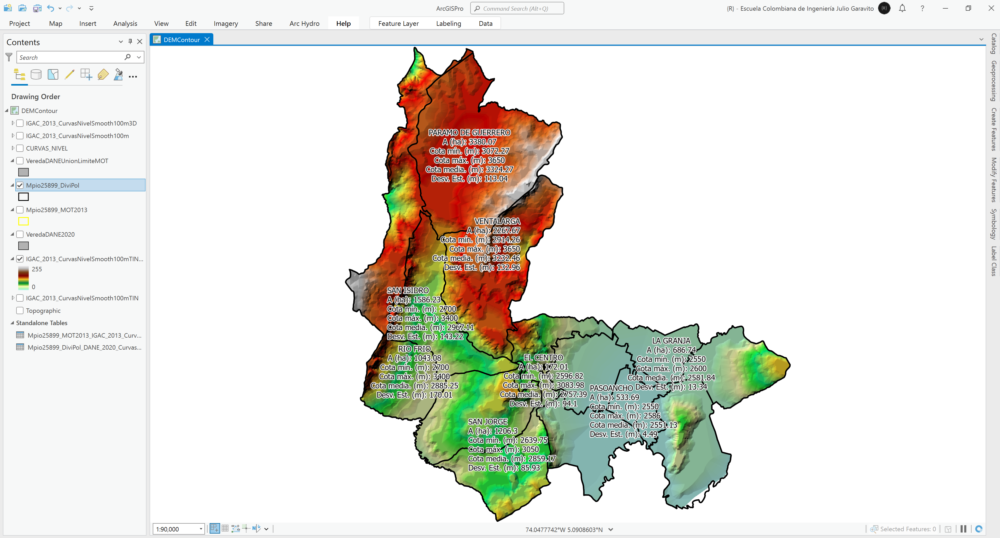
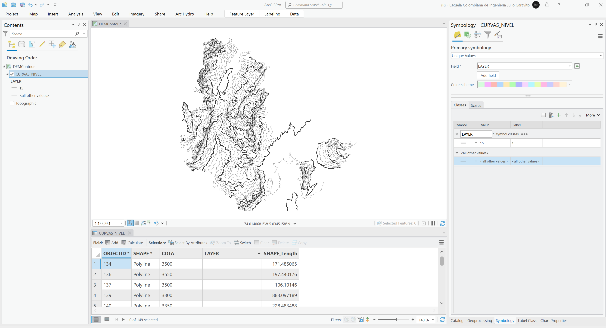
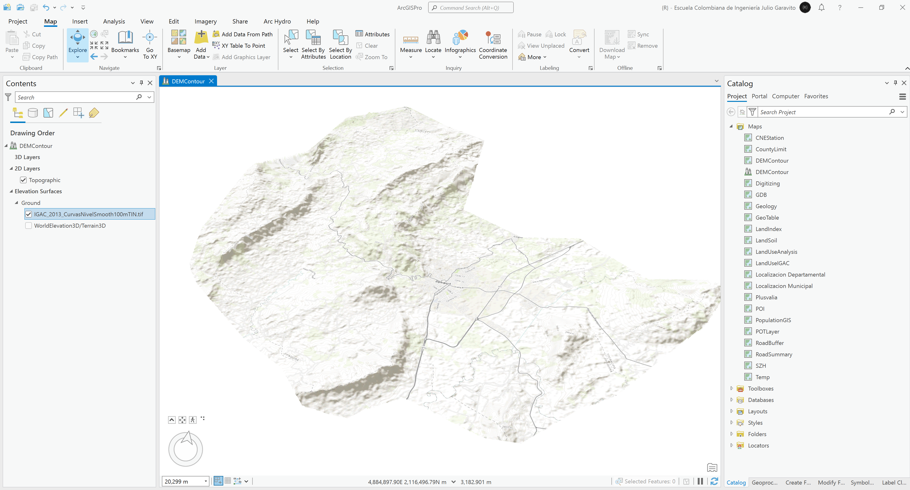

# :large_blue_circle:Módulo 5 – Modelos de elevación digital - DEM (6 horas)

En este módulo se abordan conceptos relacionados con la definición, funciones y aplicaciones de los de los DEM así como sus métodos de creación. En cuanto a su aplicabilidad, realizaremos la creación de DEM's a partir de curvas de nivel, la descarga, procesamiento y validación de DEM satelitales, los análisis zonales a partir de divisiones geopolíticas municipales, la generación de perfiles y su visualización 3D, y crearemos el mapa de pendientes para el análisis de incompatibilidad con áreas de actividad definidas en el OT.

# 5.1. Modelo digital de elevación - DEM a partir de curvas de nivel
Keywords: `dem` `contour` `smooth-line` `feature-to-3d-by-attribute` `tin` `tin-to-raster` `zonal-statistics-as-table`

A partir de la capa de curvas de nivel utilizada en el diagnóstico y formulación del POT, genere las siguientes clases de entidad y modelos DEM: curvas de nivel suavizadas 2D, curvas de nivel suavizadas 3D, modelo de terreno triangulado en formato TIN con conversión a ráster. Genere estadísticos de elevación por vereda, centro poblado y zona urbana (obtenga: cota mínina, media, máxima, rango y desviación estándar). En una escena local, cree una visualización 3D que incluya la superficie de terreno generada, las curvas de nivel suavizadas y los límites veredales.

## Objetivos

* Simbolizar curvas de nivel por categorías.
* Suavizar curvas de nivel y convertir a 3 dimensiones.
* Crear un modelo digital de elevación a partir de curvas de nivel.
* Analizar la topografía municipal a partir del modelo digital de elevación.

## Requerimientos

* [:mortar_board:Actividad](../TopoBasic/Readme.md): Conceptos básicos de topografía, fotogrametría y fotointerpretación.
* [:mortar_board:Actividad](../POTLayer/Readme.md): Inventario de información geo-espacial recopilada del POT y diccionario de datos.
* [:mortar_board:Actividad](../CountyLimit/Readme.md): Análisis veredal y límite territorial.
* [:toolbox:Herramienta](https://www.esri.com/en-us/arcgis/products/arcgis-pro/overview): ESRI ArcGIS Pro 3.3.1 o superior.
* [:toolbox:Herramienta](https://qgis.org/): QGIS 3.38 o superior.

## 0. Modelos digitales de elevación

 Imagen tomada de learn.arcgis.com 

## 1. Creación de modelo digital de elevación a partir de curvas

1. Abra el proyecto de ArcGIS Pro, creado previamente y desde el menú _Insert_ cree un nuevo mapa _New Map_, renombre como _DEMContour_ y establezca el CRS 9377. Agregue al mapa la capa de curvas de nivel disponible en la ruta `\file\gdb\SIGE.gdb\IGAC2013Cartografia\CURVAS_NIVEL` y ajuste la simbología a valores únicos representando el campo de atributos `LAYER` cuyos valores correspondientes a curvas de nivel principales se han identificado con el número 15 y curvas secundarias para elementos nulos o vacíos. Abra la tabla de atributos, podrá observar que la geometría corresponde solo a líneas en dos dimensiones o _Polyline_.

2. Manualmente, acérquese a escala 1:2000 sobre las curvas de nivel, podrá observar que en algunas zonas donde existen cambios de dirección fuertes, las curvas tienen terminaciones anguladas y no describen con suavidad el terreno.

3. Utilizando la herramienta de geo-procesamiento _Cartography Tools / Smooth Line_, suavice las curvas de nivel utilizando un radio de aproximación de 100 metros utilizando el algoritmo de aproximación polinómica PAEK y resolviendo los errores topológicos (como traslapo entre líneas suavizadas). Nombre la capa resultante como _\file\gdb\SIGE.gdb\SIGE\IGAC_2013_CurvasNivelSmooth100m_. Cambie la simbología de las curvas iniciales a valores únicos utilizando un color claro, podrá observar que la curvas suavizadas representan mejor la superficie del terreno.

4. En la tabla de atributos de las líneas suavizadas, cree un campo de atributos numérico doble con el nombre `Cotam` y asigne el valor almacenado en el campo de texto `COTA`. Luego, utilizando la herramienta de geo-procesamiento _3D Analysis Tools / Feature to 3D by Attribute_, convierta las curvas de nivel 2D a curvas en trés dimensiones, nombre la clase de entidad resultante como _\file\gdb\SIGE.gdb\SIGE\IGAC_2013_CurvasNivelSmooth100m3D_ y verifique la geometría en la tabla de atributos correspondiente a .

5. Utilizando la herramienta de geo-procesamiento _3D Analysis Tools / Create TIN_, cree una superficie 3D triangulada, nombre como _\file\dem\IGAC_2013_CurvasNivelSmooth100mTIN_, asigne el CRS 9377, utilice el campo _SHAPE.Z_ de las curvas suavizadas 3D, seleccione el tipo _Hard_Line_ y defina el campo de etiquetado a partir de `Cotam`.

El modelo TIN puede ser representado utilizando diferentes estilos. Por ejemplo, puede representar la superficie en 32 rangos de colores y visualizar las caras de los tríangulos que componen el modelo.

Al visualizar toda la superficie podrá observar que fuera del límite de las curvas de nivel, se han generado triángulos que no corresponden a terreno al terreno y que representan una extrapolación de la superficie.

6. Agregue al mapa la capa del límite territorial generada a partir del Modelo de Ocupación Territorial - MOT creada anteriormente en la actividad _[Análisis veredal y límite territorial](../CountyLimit/Readme.md)_ y disponible en la ruta `\file\gdb\SIGE.gdb\SIGE\Mpio25899_MOT2013` y simbolice solo por contorno. Utilizando la herramienta de geo-procesamiento _3D Analysis Tools / Delineate TIN Data Area_, delimite el contorno del modelo triangulado utilizando un valor de máximo lado de cara que permita rebordear y ajustar el modelo a las curvas utilizadas, por ejemplo 4000 metros.

> En la zona sur oriental del municipio, una pequeña fracción de superficie, no está cubierta por la superficie creada debido a que no existen curvas de nivel hasta su límite externo. 

7. Utilizando la herramienta de geo-procesamiento _3D Analysis Tools / TIN To Raster_, convierta la superficie triangulada a una imagen o grilla TIFF, defina el tipo de salida en valores numéricos con decimales o _Floating Point_, seleccione el método Lineal y establezca la resolución de salida en 5 metros. Nombre como _\file\dem\IGAC_2013_CurvasNivelSmooth100mTIN.tif_ y simbolice por relieve sombreado. 

## 2. Análisis topográfico municipal

1. Utilizando la herramienta de geo-procesamiento _Image Analysis Tools / Zonal Statistics as Table_, obtenga la tabla de valores estadísticos de elevación sobre todo el municipio, incluya los percentiles 15, 25, 75, 85 y guarde la tabla resultante como `\file\gdb\SIGE.gdb\Mpio25899_MOT2013_IGAC_2013_CurvasNivel_Stat`. Podrá observar en la tabla de resultados que la cota promedio municipal es 2955.52 m.s.n.m.

2. Desde las propiedades de la capa del límite municipal _Mpio25899_MOT2013_, realice un join con la tabla de resultados estadísticos y rotule incluyendo los valores obtenidos.

Rótulo Arcade: `"Municipio de Zipaquirá\nA (ha): " + Round($feature['Mpio25899_MOT2013.APha'], 2) + "\nCota mín. (m): " + Round($feature['Mpio25899_MOT2013_IGAC_2013_CurvasNivel_Stat.MIN'], 2) + "\nCota máx. (m): " + Round($feature['Mpio25899_MOT2013_IGAC_2013_CurvasNivel_Stat.MAX'], 2) + "\nCota media. (m): " + Round($feature['Mpio25899_MOT2013_IGAC_2013_CurvasNivel_Stat.MEAN'], 2) + "\nDesv. Est. (m): " + Round($feature['Mpio25899_MOT2013_IGAC_2013_CurvasNivel_Stat.STD'], 2)`

## 3. Análisis topográfico veredal catastral

1. Agregue al mapa y desde la ruta `\file\gdb\SIGE.gdb\SIGE\VeredaDANE2020`, la capa de límites veredales del DANE obtenida previamente, simbolice con relleno gris y rotule a partir del campo `NOMBRE_VER`. 

> Cómo observa, el límite municipal obtenido a partir del MOT no es exactamente igual al límite de veredas del DANE debido a que la información catastral utilizada en la formulación del POT correspondía al año 2010. También, la capa de veredas no contiene el límite del polígono catastral urbano. 

2. Para crear el polígono del área urbana, primero cree una copia de la capa de veredas dando clic derecho en la tabla de contenido o _Contents_ sobre la capa _VeredaDANE2020_ y seleccionando la opción _Data / Export Features_, guarde la copia como `\file\gdb\SIGE.gdb\SIGE\Mpio25899_DiviPol`.

3. Utilizando la herramienta de geo-procesamiento _Analysis Tools / Union_, combine los polígonos de las capas _Mpio25899_DiviPol_ y _Mpio25899_MOT2013_. Guarde la capa resultante en la carpeta temporal de la GDB como `\file\gdb\SIGE.gdb\Temp\VeredaDANEUnionLimiteMOT`. Podrá observar que la unión contiene el polígono del área catastral urbana, sin embargo, al ser seleccionado manualmente, los sub-polígonos del contorno provenientes de la capa del límite del MOT, también han sido incluídos en esta entidada.

4. Abra la tabla de atributos de la capa _VeredaDANEUnionLimiteMOT_ e invierta la selección para seleccionar todos los demás polígonos que no corresponden al límite urbano.

5. En la tabla de atributos, de clic en el botón _Delete_ que le permitirá eliminar las entidades seleccionadas excepto el polígono urbano. Como observa, perimetralmente existen múltiples elementos que no hacen parte del área urbana catastral y por el proceso de unión fueron asociados a esta entidad multiparte.

6. Utilizando la herramienta de edición _Divide / Explode_, separe todas las entidades multi-parte asociadas al polígono urbano obtenido. Al realizar la explotación obtendrá en la tabla de atributos múltiples polígonos independientes (467 para este ejemplo).

7. Para eliminar las fracciones que no hacen parte del área catastral urbana, en el menú _Edit_ guarde la edición realizada, luego seleccione el polígono principal, invierta la selección y elimine estos elementos. Al finalizar obtendrá un único polígono.

8. Para incorporar el polígono obtenido a la capa _Mpio25899_DiviPol_, seleccione el polígono urbano de la capa _VeredaDANEUnionLimiteMOT_ y en el menú _Map_ de clic en la opción _Copy_, luego en _Paste_, seleccione _Paste Special_, seleccione la capa destino _Mpio25899_DiviPol_ y de clic en _OK_.

En la tabla de atributos de la capa _Mpio25899_DiviPol_ podrá observar que ahora se encuentra el registro correspondiente al polígono urbano pero sin ningún tipo de atributo descriptivo. En el campo `NOMBRE_VER` asigne el nombre _URBANO_.

9. Utilizando la herramienta de geo-procesamiento _Image Analysis Tools / Zonal Statistics as Table_, obtenga la tabla de valores estadísticos de elevación para cada polícono contenido en la división política municipal DANE 2020, incluya los percentiles 15, 25, 75, 85 y guarde la tabla resultante como `\file\gdb\SIGE.gdb\Mpio25899_DiviPol_DANE_2020_CurvasNivel_Stat`. 

2. Desde las propiedades de la capa de división política municipal catastral _Mpio25899_DiviPol_, realice un join con la tabla de resultados estadísticos y rotule incluyendo los valores obtenidos. Ajuste la simbología removiendo el color del relleno.

> Es necesario calcular y asignar los valores del área planar y geodésica al polígono urbano incorporado.

Rótulo Arcade: `$feature['Mpio25899_DiviPol.NOMBRE_VER'] + "\n" + Round($feature['Mpio25899_DiviPol.APha'], 2) + "\nCota mín. (m): " + Round($feature['Mpio25899_DiviPol_DANE_2020_CurvasNivel_Stat.MIN'], 2) + "\nCota máx. (m): " + Round($feature['Mpio25899_DiviPol_DANE_2020_CurvasNivel_Stat.MAX'], 2) + "\nCota media. (m): " + Round($feature['Mpio25899_DiviPol_DANE_2020_CurvasNivel_Stat.MEAN'], 2) + "\nDesv. Est. (m): " + Round($feature['Mpio25899_DiviPol_DANE_2020_CurvasNivel_Stat.STD'], 2)`

## 4. Representación 3D

1. En el menú _Insert_ de clic en la opción _New Map_ y cree una nueva escena local, nombre la escena como DEMContour. En el Menú _Map_ y desde las opciones de _Layer / Elevation Source Layer_, agregue la grilla raster _\file\dem\IGAC_2013_CurvasNivelSmooth100mTIN.tif_. Como observa, la representación muestra el límite del modelo de terreno generado y el mapa topográfico de ESRI.

2. Desde el _Catalog Pane_, agregue al mapa las capas de división política, curvas de nivel 3D y la grilla del modelo de terreno. Simbolice la grilla de terreno utilizando sombreado de relieve en escala de grises, las curvas de nivel en color negro y los límites políticos en color rojo.

3. En la tabla de contenido o _Contents_, seleccione en _Elevation Surfaces_ el grupo _Ground_ y desde el menú superior _Elevation Surface Layer_, ajuste la exageración vertical a 5.00. De esta forma obtendrá una representación más visual de los elementos 3D contenidos en la escena.

> Debido a que las curvas de nivel contienen vectores 3D, se recomienda mover en la tabla de contenido esta capa del grupo _3D Layers_ a _2D Layers_, así podrá reproyectar las curvas sobre el terreno con exageración vertical.

## 5. Análisis usando software libre - QGIS

Para el desarrollo de las actividades desarrolladas en esta clase, se pueden utilizar en QGIS las siguientes herramientas o geo-procesos:

| Proceso                                                  | Procedimiento                                                                                                                                                    |
|:---------------------------------------------------------|:-----------------------------------------------------------------------------------------------------------------------------------------------------------------|
| Simbología                                               | Modificable desde las propiedades de la capa en la pestaña _Symbology_.                                                                                          |
| Rotulado                                                 | Modificable desde las propiedades de la capa en la pestaña _Labels_.                                                                                             |
| Suavizar líneas (Smooth)                                 | Herramienta disponible en el _Processing Toolbox / Vector Geometry / Smooth_.                                                                                    |
| Convertir entidades a 3D (Feature to 3D by Attribute)    | Herramienta disponible en el _Processing Toolbox / Vector Geometry / Set Z value_.                                                                               |
| Superficie triangulada TIN                               | Herramienta disponible en el _Processing Toolbox / Mesh / [TIN Mesh Creation](https://docs.qgis.org/testing/en/docs/user_manual/processing_algs/qgis/mesh.html). |
| Superficie triangulada TIN a grilla (TIN to Raster)      | Herramienta disponible en el _Processing Toolbox / Mesh / Export Mesh on Grid.                                                                                   |
| Estadística zonal como tabla (Zonal statistics as table) | Herramienta disponible en el _Processing Toolbox / Raster analysis / Zonal statistics.                                                                           |
| Visualización en escena 3D (Local 3D scene)              | Se realiza utilizando el complemento [QGIS2threejs](https://plugins.qgis.org/plugins/Qgis2threejs/).                                                             |

Ejemplo rótulo en QGIS: `'A(ha): ' ||  round("AGha", 2) || '\n' || 'P (m): ' ||  round("PGm", 2) `

[:notebook:QGIS training manual](https://docs.qgis.org/3.34/en/docs/training_manual/)  
[:notebook:Herramientas comúnmente utilizadas en QGIS](../QGIS.md)

## Elementos requeridos en diccionario de datos

Agregue a la tabla resúmen generada en la actividad [Inventario de información geo-espacial recopilada del POT y diccionario de datos](../POTLayer/Readme.md), las capas generadas en esta actividad que se encuentran listadas a continuación:

| Nombre                                        | Descripción                                                                                                                                                     | Geometría / Tipo | Registros | 
|-----------------------------------------------|-----------------------------------------------------------------------------------------------------------------------------------------------------------------|------------------|-----------| 
| IGAC_2013_CurvasNivelSmooth100m               | Curvas de nivel suavizadas 2D a partir de \file\gdb\SIGE.gdb\IGAC2013Cartografia\CURVAS_NIVEL.                                                                  | Polilinea 2D     | 149       | 
| IGAC_2013_CurvasNivelSmooth100m3D             | Conversión de curvas suavizadas a 3D a partir de IGAC_2013_CurvasNivelSmooth100m.                                                                               | Polígono 2D      | 149       | 
| IGAC_2013_CurvasNivelSmooth100mTIN            | Modelo de terreno triangulado TIN a partir de curvas suavizadas 3D IGAC_2013_CurvasNivelSmooth100m3D.                                                           | (TIN)            | N/A       | 
| IGAC_2013_CurvasNivelSmooth100mTIN.tif        | Modelo digital de elevación DEM a partir de TIN IGAC_2013_CurvasNivelSmooth100mTIN, resolución 5 metros.                                                        | (Ráster)         | N/A       | 
| Mpio25899_MOT2013_IGAC_2013_ CurvasNivel_Stat | Tabla de estadísticos zonales del límite municipal obtenido a partir del DEM IGAC_2013_CurvasNivelSmooth100mTIN.tif y el límite Mpio25899_MOT2013.              | (Tabla)          | 1         | 
| Mpio25899_DiviPol                             | División política catastral municipal DANE 2020 a partir de la capa de veredas VeredaDANE2020 con inclusión de límite urbano catastral.                         | Polígono 2D      | 15        | 
| Mpio25899_DiviPol_DANE_2020_ CurvasNivel_Stat | Tabla de estadísticos zonales de la división política municipal obtenido a partir del DEM IGAC_2013_CurvasNivelSmooth100mTIN.tif y el límite Mpio25899_DiviPol. | (Tabla)          | 15        | 

> :bulb:Para funcionarios que se encuentran ensamblando el SIG de su municipio, se recomienda incluir y documentar estas capas en el Diccionario de Datos.

## Actividades de proyecto :triangular_ruler:

En la siguiente tabla se listan las actividades que deben ser desarrolladas y documentadas por cada grupo de proyecto en un único archivo de Adobe Acrobat .pdf. El documento debe incluir portada (indicando el caso de estudio, número de avance, nombre del módulo, fecha de presentación, nombres completos de los integrantes), numeración de páginas, tabla de contenido, lista de tablas, lista de ilustraciones, introducción, objetivo general, capítulos por cada ítem solicitado, conclusiones y referencias bibliográficas.

| Actividad     | Alcance                                                                                                                                                                                                                                                                                                                                                                                                                                             |
|:--------------|:----------------------------------------------------------------------------------------------------------------------------------------------------------------------------------------------------------------------------------------------------------------------------------------------------------------------------------------------------------------------------------------------------------------------------------------------------|
| Avance **P5** | Para su caso de estudio, realice el análisis topográfico presentado en esta actividad, incluída la representación de escena local 3D.                                                                                                                                                                                                                                                                                                               | 
| Avance **P5** | :compass:Mapa digital impreso _P5-1: curvas de nivel categorizadas POT y suavizadas._ Incluir rótulos y simbología por categoría de curvas principales y secundarias. Embebido dentro del informe final como una imágen y referenciados como anexo.                                                                                                                                                                                              | 
| Avance **P5** | :compass:Mapa digital impreso _P5-2: modelo digital de elevación TIN vectorial._ Incluir representación de la red triangulada. Embebido dentro del informe final como una imágen y referenciados como anexo.                                                                                                                                                                                                                                     | 
| Avance **P5** | :compass:Mapa digital impreso _P5-3: estadísticos de elevación municipal y por vereda._ Mostrar grilla de terreno de fondo y rotular incluyendo nombres de zona, área, cota mínima, media, máxima y desviación estándar. Embebido dentro del informe final como una imágen y referenciados como anexo.                                                                                                                                          | 
| Avance **P5** | En una tabla y al final del informe de avance de esta entrega, indique el detalle de las sub-actividades realizadas por cada integrante de su grupo. Para actividades que no requieren del desarrollo de elementos de avance, indicar si realizo la lectura de la guía de clase y las lecturas indicadas al inicio en los requerimientos. Utilice las siguientes columnas: Nombre del integrante, Actividades realizadas, Tiempo dedicado en horas. | 

> No es necesario presentar un documento de avance independiente, todos los avances de proyecto de este módulo se integran en un único documento.
> 
> En el informe único, incluya un numeral para esta actividad y sub-numerales para el desarrollo de las diferentes sub-actividades, siguiendo en el mismo orden de desarrollo presentado en esta actividad.

## Referencias

* https://pro.arcgis.com/en/pro-app/latest/tool-reference/cartography/smooth-line.htm
* https://www.esri.com/arcgis-blog/products/arcgis-desktop/mapping/some-best-practices-for-working-with-dems/

## Control de versiones

| Versión    | Descripción                                                | Autor                                     | Horas |
|------------|:-----------------------------------------------------------|-------------------------------------------|:-----:|
| 2024.03.24 | Versión inicial con alcance de la actividad                | [rcfdtools](https://github.com/rcfdtools) |   4   |
| 2024.08.23 | Investigación y documentación para caso de estudio general | [rcfdtools](https://github.com/rcfdtools) |   8   |

_R.SIGE es de uso libre para fines académicos, conoce nuestra licencia, cláusulas, condiciones de uso y como referenciar los contenidos publicados en este repositorio, dando [clic aquí](LICENSE.md)._

_¡Encontraste útil este repositorio!, apoya su difusión marcando este repositorio con una ⭐ o síguenos dando clic en el botón Follow de [rcfdtools](https://github.com/rcfdtools) en GitHub._

| [:arrow_backward: Anterior](../LandSoil/Readme.md) | [:house: Inicio](../../README.md) | [:beginner: Ayuda / Colabora](https://github.com/rcfdtools/R.SIGE/discussions/28) | [Siguiente :arrow_forward:](../DEMSatellite/Readme.md) |
|----------------------------------------------------|-----------------------------------|-----------------------------------------------------------------------------------|--------------------------------------------------------|

[^1]: 