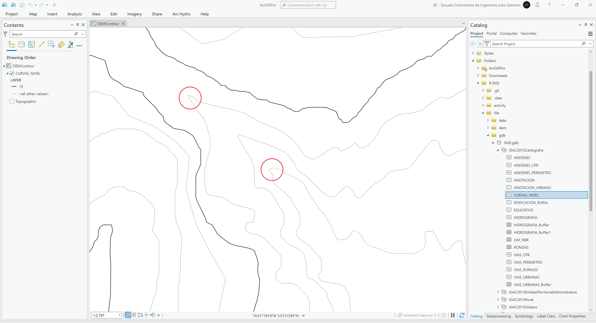

# Modelo digital de elevación a partir de curvas de nivel
Keywords: `DEM` `Contour`

A partir de la capa de curvas de nivel utilizada en el diagnóstico y formulación del POT, genere las siguientes clases de entidad y modelos DEM: curvas de nivel suavizadas 2D, curvas de nivel suavizadas 3D, modelo de terreno triangulado en formato TIN con conversión a ráster. Genere estadísticos de elevación por vereda, centro poblado y zona urbana (obtenga: cota mínina, media, máxima, rango y desviación estándar). En una escena local, cree una visualización 3D que incluya la superficie de terreno generada, las curvas de nivel suavizadas y los límites veredales.

## Objetivos

* Crear un modelo digital de elevación a partir de curvas de nivel.
* Evaluar la topografía veredal a partir del modelo digital de elevación.

## Requerimientos

* [:mortar_board:Actividad](../TopoBasic/Readme.md): Conceptos básicos de topografía, fotogrametría y fotointerpretación.
* [:mortar_board:Actividad](../POTLayer/Readme.md): Inventario de información geo-espacial recopilada del POT y diccionario de datos.
* [:mortar_board:Actividad](../CountyLimit/Readme.md): Análisis veredal y límite territorial.
* [:toolbox:Herramienta](https://www.esri.com/en-us/arcgis/products/arcgis-pro/overview): ESRI ArcGIS Pro 3.3.1 o superior.
* [:toolbox:Herramienta](https://qgis.org/): QGIS 3.38 o superior.

## 1. Creación de modelo digital de elevación a partir de curvas

1. Abra el proyecto de ArcGIS Pro, creado previamente y desde el menú _Insert_ cree un nuevo mapa _New Map_, renombre como _DEMContour_ y establezca el CRS 9377. Agregue al mapa la capa de curvas de nivel disponible en la ruta `\file\gdb\SIGE.gdb\IGAC2013Cartografia\CURVAS_NIVEL` y ajuste la simbología a valores únicos representando el campo de atributos `LAYER` cuyos valores correspondientes a curvas de nivel principales se han identificado con el número 15 y curvas secundarias para elementos nulos o vacíos. Abra la tabla de atributos, podrá observar que la geometría corresponde solo a líneas en dos dimensiones o _Polyline_.

2. Manualmente, acérquese a escala 1:2000 sobre las curvas de nivel, podrá observar que en algunas zonas donde existen cambios de dirección fuertes, las curvas tienen terminaciones anguladas y no describen con suavidad el terreno.

3. Utilizando la herramienta de geo-procesamiento _Cartography Tools / Smooth Line_, suavice las curvas de nivel utilizando un radio de aproximación de 100 metros utilizando el algoritmo de aproximación polinómica PAEK y resolviendo los errores topológicos (como traslapo entre líneas suavizadas). Nombre la capa resultante como _\file\gdb\SIGE.gdb\SIGE\IGAC_2013_CurvasNivelSmooth100m_. Cambie la simbología de las curvas iniciales a valores únicos utilizando un color claro, podrá observar que la curvas suavizadas representan mejor la superficie del terreno.

4. En la tabla de atributos de las líneas suavizadas, cree un campo de atributos numérico doble con el nombre `Cotam` y asigne el valor almacenado en el campo de texto `COTA`. Luego, utilizando la herramienta de geo-procesamiento _3D Analysis Tools / Feature to 3D by Attribute_, convierta las curvas de nivel 2D a curvas en trés dimensiones, nombre la clase de entidad resultante como _\file\gdb\SIGE.gdb\SIGE\IGAC_2013_CurvasNivelSmooth100m3D_ y verifique la geometría en la tabla de atributos correspondiente a .

5. Utilizando la herramienta de geo-procesamiento _3D Analysis Tools / Create TIN_, cree una superficie 3D triangulada, nombre como _\file\dem\IGAC_2013_CurvasNivelSmooth100mTIN_, asigne el CRS 9377, utilice el campo _SHAPE.Z_ de las curvas suavizadas 3D, seleccione el tipo _Hard_Line_ y defina el campo de etiquetado a partir de `Cotam`.

El modelo TIN puede ser representado utilizando diferentes estilos. Por ejemplo, puede representar la superficie en 32 rangos de colores y visualizar las caras de los tríangulos que componen el modelo.

Al visualizar toda la superficie podrá observar que fuera del límite de las curvas de nivel, se han generado triángulos que no corresponden a terreno al terreno y que representan una extrapolación de la superficie.

6. Agregue al mapa la capa del límite territorial generada a partir del Modelo de Ocupación Territorial - MOT creada anteriormente en la actividad _[Análisis veredal y límite territorial](../CountyLimit/Readme.md)_ y disponible en la ruta `\file\gdb\SIGE.gdb\SIGE\Mpio25899_MOT2013` y simbolice solo por contorno. Utilizando la herramienta de geo-procesamiento _3D Analysis Tools / Delineate TIN Data Area_, delimite el contorno del modelo triangulado utilizando un valor de máximo lado de cara que permita rebordear y ajustar el modelo a las curvas utilizadas, por ejemplo 4000 metros.

> En la zona sur oriental del municipio, una pequeña fracción de superficie, no está cubierta por la superficie creada debido a que no existen curvas de nivel hasta su límite externo. 

7. Utilizando la herramienta de geo-procesamiento _3D Analysis Tools / TIN To Raster_, convierta la superficie triangulada a una imagen o grilla TIFF, defina el tipo de salida en valores numéricos con decimales o _Floating Point_, seleccione el método Lineal y establezca la resolución de salida en 5 metros. Nombre como _\file\dem\IGAC_2013_CurvasNivelSmooth100mTIN.tif_ y simbolice por relieve sombreado. 

## 2. Análisis topográfico municipal

1. Utilizando la herramienta de geo-procesamiento _Image Analysis Tools / Zonal Statistics as Table_, obtenga la tabla de valores estadísticos de elevación sobre todo el municipio, incluya los percentiles 15, 25, 75, 85 y guarde la tabla resultante como `\file\gdb\SIGE.gdb\Mpio25899_MOT2013_IGAC_2013_CurvasNivel_Stat`. Podrá observar en la tabla de resultados que la cota promedio municipal es 2955.52 m.s.n.m.

2. Desde las propiedades de la capa del límite municipal _Mpio25899_MOT2013_, realice un join con la tabla de resultados estadísticos y rotule incluyendo los valores obtenidos.

Rótulo Arcade: `"Municipio de Zipaquirá\n A (ha): " + Round($feature['Mpio25899_MOT2013.APha'], 2) + "\nCota mín. (m): " + Round($feature['Mpio25899_MOT2013_IGAC_2013_CurvasNivel_Stat.MIN'], 2) + "\nCota máx. (m): " + Round($feature['Mpio25899_MOT2013_IGAC_2013_CurvasNivel_Stat.MAX'], 2) + "\nCota media. (m): " + Round($feature['Mpio25899_MOT2013_IGAC_2013_CurvasNivel_Stat.MEAN'], 2) + "\nDesv. Est. (m): " + Round($feature['Mpio25899_MOT2013_IGAC_2013_CurvasNivel_Stat.STD'], 2)`

## 3. Análisis topográfico veredal

## 4. Análisis usando software libre - QGIS

Para el desarrollo de las actividades desarrolladas en esta clase, se pueden utilizar en QGIS las siguientes herramientas o geo-procesos:

| Proceso            | Procedimiento                                                           |
|:-------------------|:------------------------------------------------------------------------|
| Simbología         | Modificable desde las propiedades de la capa en la pestaña _Symbology_. |
| Rotulado           | Modificable desde las propiedades de la capa en la pestaña _Labels_.    |

Ejemplo rótulo en QGIS: `'A(ha): ' ||  round("AGha", 2) || '\n' || 'P (m): ' ||  round("PGm", 2) `

[:notebook:QGIS training manual](https://docs.qgis.org/3.34/en/docs/training_manual/)  
[:notebook:Herramientas comúnmente utilizadas en QGIS](../QGIS.md)

## Elementos requeridos en diccionario de datos

Agregue a la tabla resúmen generada en la actividad [Inventario de información geo-espacial recopilada del POT y diccionario de datos](../POTLayer/Readme.md), las capas generadas en esta actividad que se encuentran listadas a continuación:

| Nombre                           | Descripción                                                                                                                  | Geometría   | Registros | 
|----------------------------------|------------------------------------------------------------------------------------------------------------------------------|-------------|-----------| 
|                                  |                                                                                                                              | Polígono 2D | 14        | 
|                                  |                                                                                                                              | Polígono 2D | 14        | 
|                                  |                                                                                                                              | Polígono 2D | 14        | 

> :bulb:Para funcionarios que se encuentran ensamblando el SIG de su municipio, se recomienda incluir y documentar estas capas en el Diccionario de Datos.

## Actividades de proyecto :triangular_ruler:

En la siguiente tabla se listan las actividades que deben ser desarrolladas y documentadas por cada grupo de proyecto en un único archivo de Adobe Acrobat .pdf. El documento debe incluir portada (indicando el caso de estudio, número de avance, nombre del módulo, fecha de presentación, nombres completos de los integrantes), numeración de páginas, tabla de contenido, lista de tablas, lista de ilustraciones, introducción, objetivo general, capítulos por cada ítem solicitado, conclusiones y referencias bibliográficas.

| Actividad     | Alcance                                                                                                                                                                                                                                                                                                                                                                                                                                             |
|:--------------|:----------------------------------------------------------------------------------------------------------------------------------------------------------------------------------------------------------------------------------------------------------------------------------------------------------------------------------------------------------------------------------------------------------------------------------------------------|
| Avance **P5** | Esta actividad no requiere del desarrollo de elementos en el avance del proyecto final, los contenidos son evaluados en el quiz de conocimiento y habilidad.                                                                                                                                                                                                                                                                                        | 
| Avance **P5** | :compass:Mapa digital impreso _P3-1: xxxx_ Incluir xxxxx. Embebido dentro del informe final como una imágen y referenciados como anexo.                                                                                                                                                                                                                                                                                                          | 
| Avance **P5** | En una tabla y al final del informe de avance de esta entrega, indique el detalle de las sub-actividades realizadas por cada integrante de su grupo. Para actividades que no requieren del desarrollo de elementos de avance, indicar si realizo la lectura de la guía de clase y las lecturas indicadas al inicio en los requerimientos. Utilice las siguientes columnas: Nombre del integrante, Actividades realizadas, Tiempo dedicado en horas. | 

> No es necesario presentar un documento de avance independiente, todos los avances de proyecto de este módulo se integran en un único documento.
> 
> En el informe único, incluya un numeral para esta actividad y sub-numerales para el desarrollo de las diferentes sub-actividades, siguiendo en el mismo orden de desarrollo presentado en esta actividad.

## Referencias

* 

## Control de versiones

| Versión     | Descripción                                                | Autor                                      | Horas |
|-------------|:-----------------------------------------------------------|--------------------------------------------|:-----:|
| 2024.03.24  | Versión inicial con alcance de la actividad                | [rcfdtools](https://github.com/rcfdtools)  |   4   |
| 2024.08.23 | Investigación y documentación para caso de estudio general | [rcfdtools](https://github.com/rcfdtools)  |   8   |

_R.SIGE es de uso libre para fines académicos, conoce nuestra licencia, cláusulas, condiciones de uso y como referenciar los contenidos publicados en este repositorio, dando [clic aquí](LICENSE.md)._

_¡Encontraste útil este repositorio!, apoya su difusión marcando este repositorio con una ⭐ o síguenos dando clic en el botón Follow de [rcfdtools](https://github.com/rcfdtools) en GitHub._

| [:arrow_backward: Anterior](../LandSoil/Readme.md) | [:house: Inicio](../../README.md) | [:beginner: Ayuda / Colabora](https://github.com/rcfdtools/R.SIGE/discussions/99999) | [Siguiente :arrow_forward:]() |
|--------------------------------------------|-------------------|---------------------------------------------------------------------------|---------------|

[^1]: 