# Perfiles de muestreo en red hidrográfica y vías principales
Keywords: `dem` `profile`

A partir de las capas de hidrografía y vías, seleccione y/o complete un drenaje principal que como mínimo tenga 10 km de longitud, y un tramo de vía principal con cobertura municipal, integre y cree una capa de líneas de muestreo. Extraiga todos los nodos disponibles en las polilíneas, calcule la distancia que existen entre cada pareja de puntos y abscise los nodos de 0 hasta la longitud total del tramo analizado. Para cada nodo, extraiga las elevaciones del modelo de terreno ESA Copernicus y grafique los perfiles del río y de la vía. Calcule la pendiente ponderada de la vía y del tramo de drenaje a partir de las subpendientes de cada pareja de puntos y compare con la pendiente media zonal obtenida a partir del mapa de pendientes creado en la actividad anterior. A partir de los nodos y sus elevaciones, cree y visualice en una escena local, los perfiles en 3 dimensiones.

<div align="center">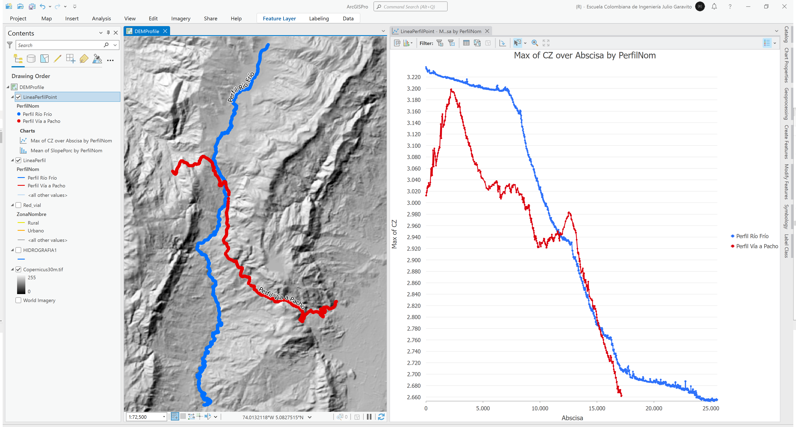</div>


## Objetivos

* Obtener perfiles a partir de líneas de muestreo.
* Representar perfiles en superficies 3D.


## Requerimientos

* [:mortar_board:Actividad](../TopoBasic/Readme.md): Conceptos básicos de topografía, fotogrametría y fotointerpretación.
* [:mortar_board:Actividad](../POTLayer/Readme.md): Inventario de información geo-espacial recopilada del POT y diccionario de datos.
* [:mortar_board:Actividad](../DEMSatellite/Readme.md): Modelo digital de elevación - DEM a partir de sensores remotos satelitales.
* [:mortar_board:Actividad](../RoadBuffer/Readme.md): Corredores viales urbanos y construcciones afectadas.
* [:toolbox:Herramienta](https://www.esri.com/en-us/arcgis/products/arcgis-pro/overview): ESRI ArcGIS Pro 3.3.1 o superior.
* [:toolbox:Herramienta](https://qgis.org/): QGIS 3.38 o superior.


## 1. Procedimiento general en ArcGIS Pro

1. Abra el proyecto de ArcGIS Pro, creado previamente y desde el menú _Insert_ cree un nuevo mapa _New Map_, renombre como _DEMProfile_ y establezca el CRS 9377. Agregue al mapa el modelo digital de elevación Copernicus desde la ruta _\file\dem\Copernicus\Copernicus30m.tif_ y simbolice por sombreado de terreno; agregue también la capa de hidrografía desde la ruta `\file\gdb\SIGE.gdb\POT2013Formulacion\HIDROGRAFIA1` y la red vial integrada que se encuentran en la ruta `\file\gdb\SIGE.gdb\SIGE\Red_vial` y ajuste la simbología a valores únicos representando el campo de atributos `ZonaNombre`.  

<div align="center">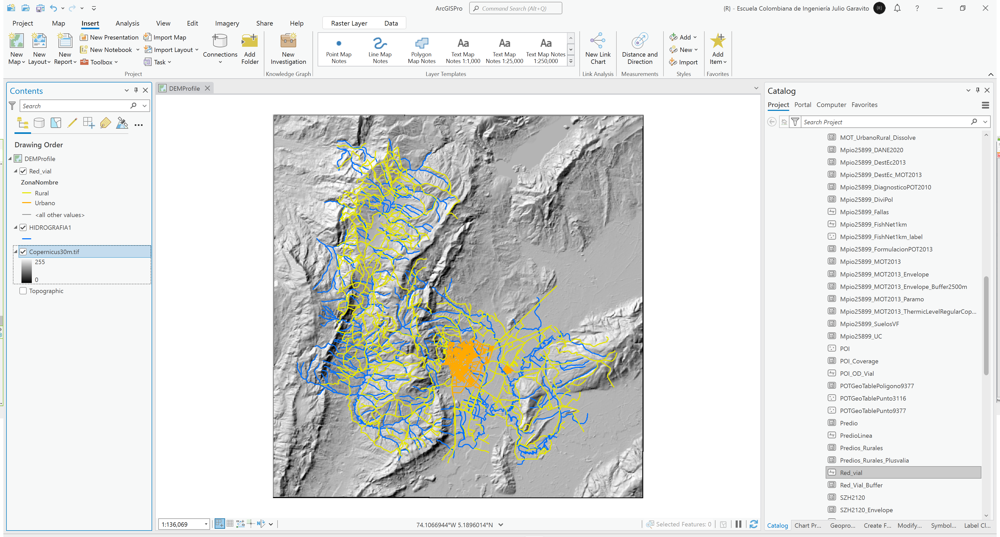</div>

2. Dentro del dataset _\file\gdb\SIGE.gdb\SIGE\_ cree una clase de entidad 2D con geometría de poli-línea y nombre como _LineaPerfil_.

<div align="center">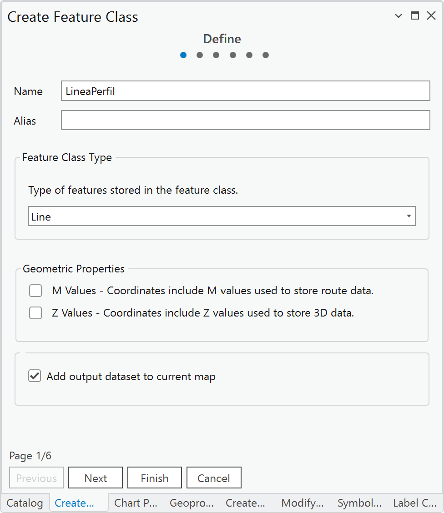</div>

3. A partir de la capa de _Hidrografia_, seleccione un drenaje principal que como mínimo tenga 10 km de longitud y copie estas líneas en la capa _LineaPerfil_.

De la capa de drenajes seleccionaremos para este ejemplo, los ejes correspondientes al Río Frío, podrá observar que no se encuentra completamente digitalizado todo el tramo en la zona norte y en la zona sur un tramo del río principal ha sido incorporado al eje principal del río principal.

<div align="center">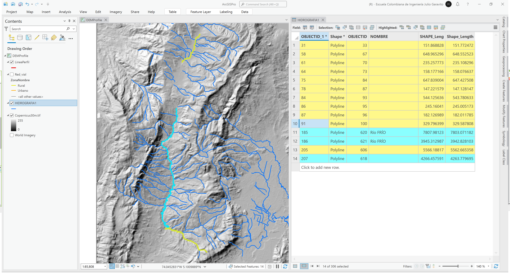</div>

Luego de seleccionar los tramos requeridos, utilice las opciones de copiar (Copy) y pegar (Paste Special) que se encuentran en el menu _Map_ o _Edit_.

4. Edite la capa de la línea de drenaje y utilizando las herramientas de edición, digitalice el tramo faltante, segmente y elimine el tramo sur que no hace parte del río principal e integre en una única línea. Simbolice y verifique la dirección vectorial de la línea utilizando simbología de flechas de inicio a fin.

> Para la digitalización del tramo faltante al norte, utilice la imagen satelital de ESRI y trace las líneas a escala 1:1000 o inferior.

<div align="center">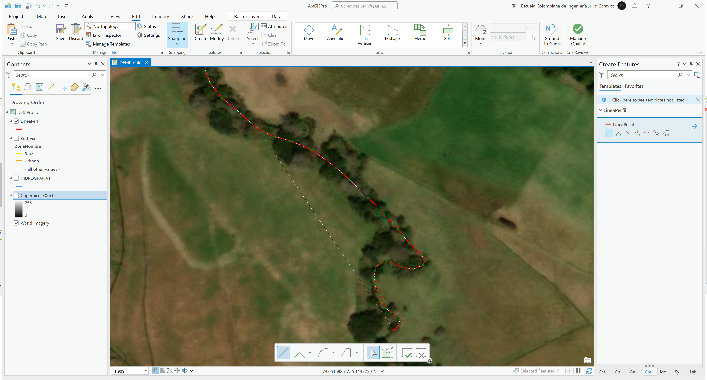</div>
<div align="center"></div>

En el evento de que el sentido vectorial de dibujo sea incorrecto, desde el editor selecciones la opción de edición de vértices o _Edit Vertices_ y dando clic sobre la línea, seleccione la opción _Reverse Direction_.

<div align="center">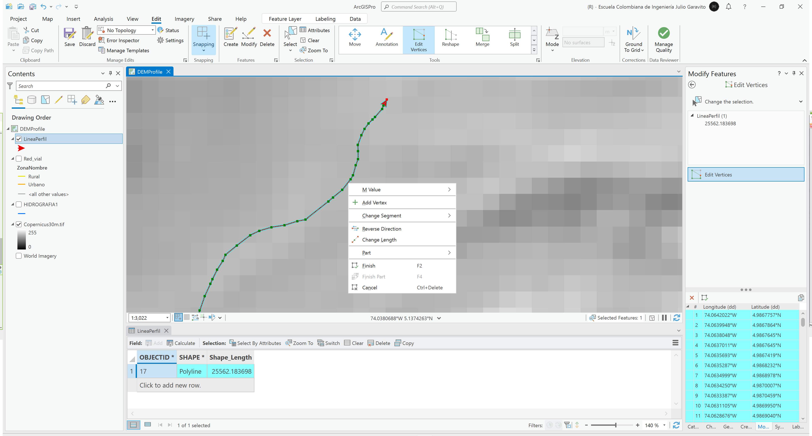</div>

5. A partir de la capa de la red vial filtre solo las vías de orden vial 2 y extraiga los tramos que conduce al municipio de Pacho - Cundinamarca, copie estas líneas en la capa _LineaPerfil_ y verifique que la línea sea contínua y que su sentido vectorial sea de la zona alta a la baja. 

<div align="center">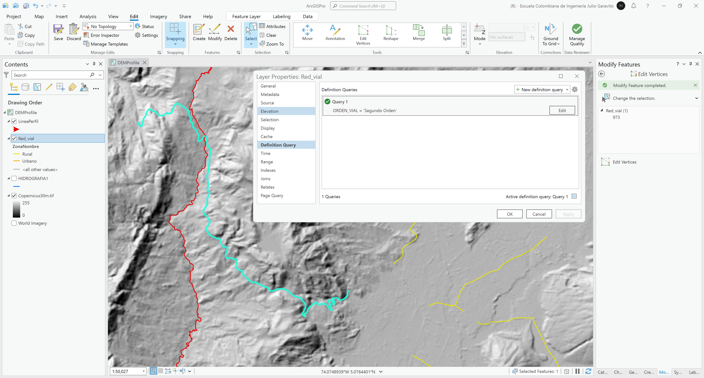</div>

6. En la tabla de atributos de la capa _LineaPerfil_, cree un campo de texto de 100 caracteres con el nombre `PerfilNom` y asigne los nombres _Perfil Río Frío_ y _Perfil Vía a Pacho_ a los dos ejes. Simbolice los ejes con colores diferentes a partir del nombre asignado.

<div align="center">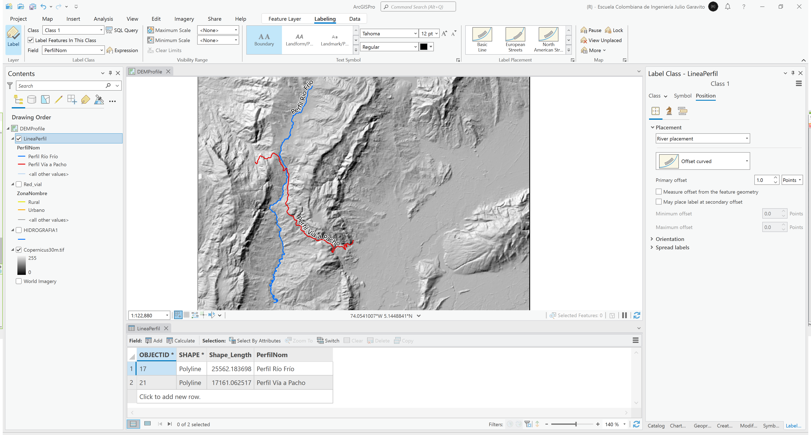</div>

7. Utilizando la herramienta de geo-procesamiento _Data Management Tools / Feature vertices to points_, extraiga todos los nodos disponibles en las poli-líneas de la capa _LineaPerfil_ y guarde como `\file\gdb\SIGE.gdb\SIGE\LineaPerfilPoint`. Simbolice los nodos utilizando los mismos colores de los ejes.

<div align="center">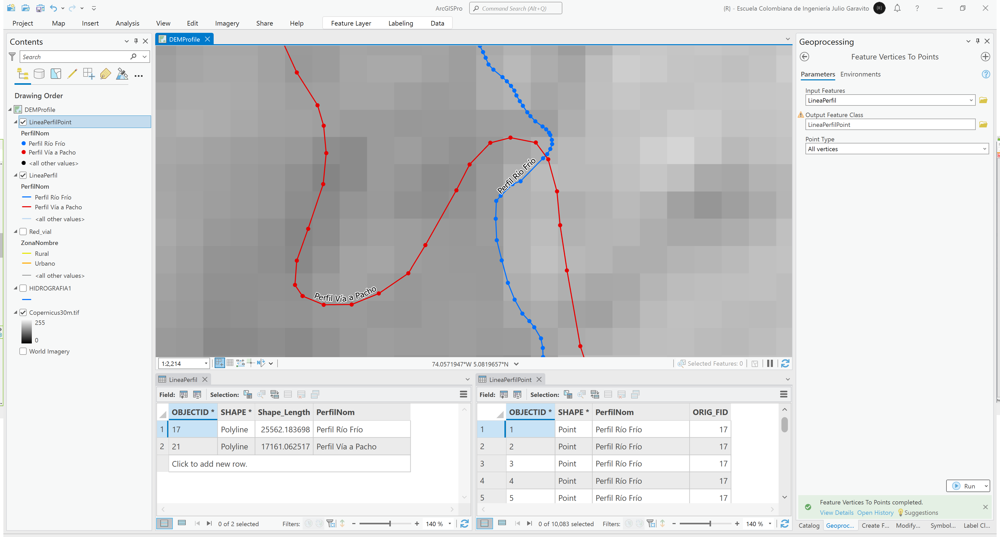</div>

8. Rotule los nodos a partir del identificador de objeto espacial _OBJECTID_, podría observar que el código 1 ha sido asignado al tramo de la línea de drenaje debido a que en su extensión espacial es la que se encuentra más al norte. Siga la secuencia de los nodos y verifique que los valores consecutivos sean correctos en el sentido del flujo desde la zona más alta a la más baja. 

<div align="center">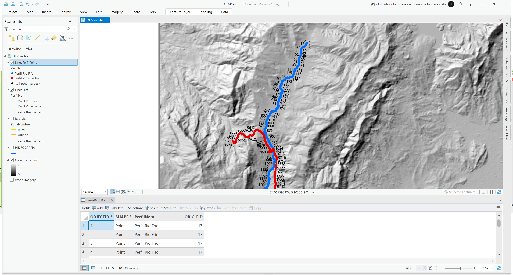</div>

9. Numere de 0 a n los nodos de cada línea, para ello cree un campo de atributos numérico entero largo con el nombre `Nodo`, seleccione por atributos los nodos correspondientes al eje del río y con el calculador de campo asigne al valor `!OBJECTID!-1`. Rotule a partir de este nuevo campo.

<div align="center">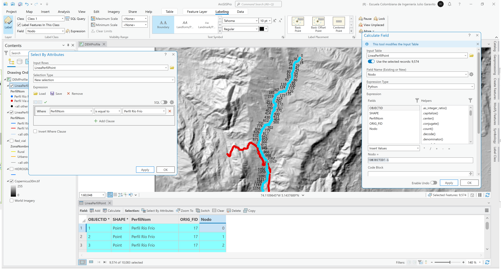</div>

Ahora, seleccione el eje correspondiente al tramo de vía y con el calculador de campo asigne el valor `!OBJECTID!-9575` donde 9575 corresponde al valor del primer nodo de este eje.

<div align="center">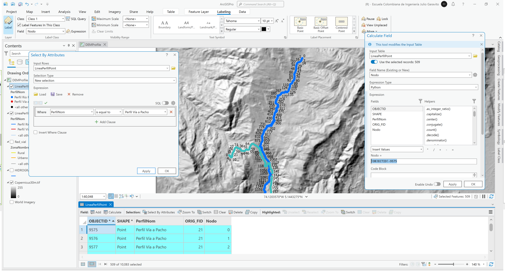</div>

10. Utilizando el calculador de geometría, obtenga las coordenadas de cada nodo.

<div align="center">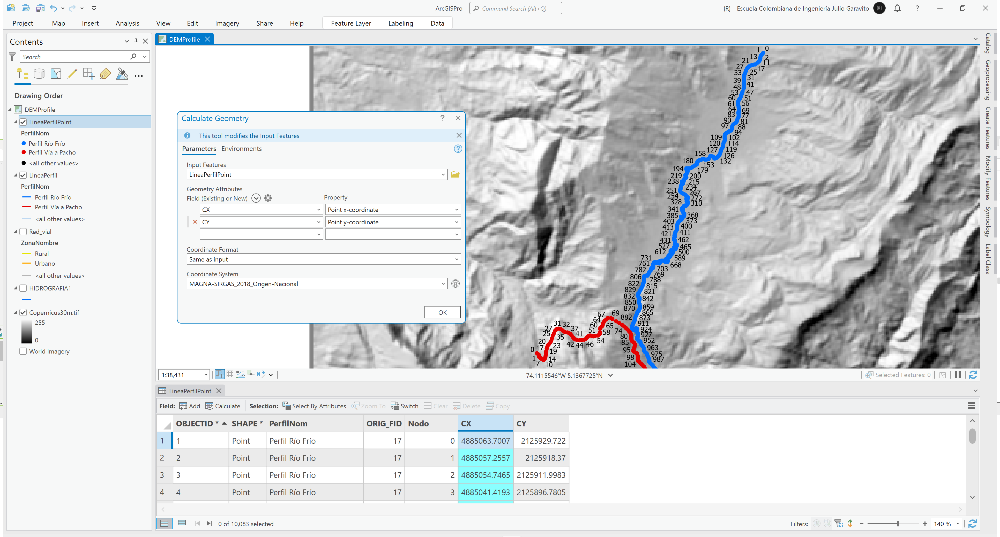</div>

11. Utilizando la herramienta de geo-procesamiento _Spatial Analyst Tools / Extract Multi Values to Points_, obtenga la elevación de cada nodo a partir del DEM Copernicus.

<div align="center">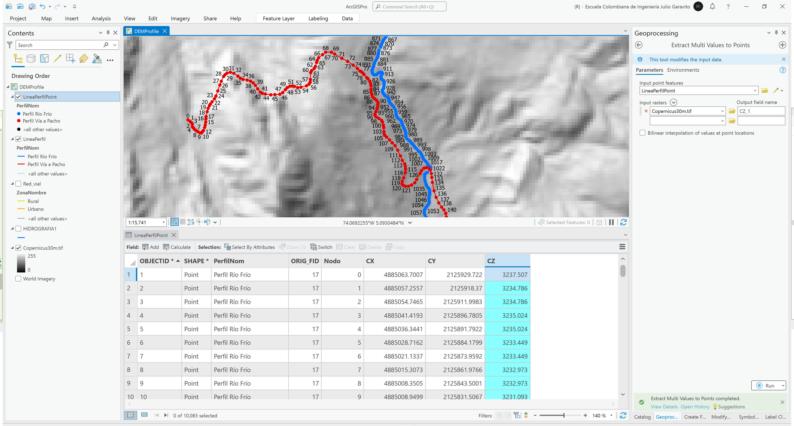</div>

12. Calcule la distancia entre cada pareja de puntos en su orden consecutivo, para ello cree un campo numérico doble con el nombre `DistNode` y cree una función en Python que realice el cálculo utilizando el Teorema de Pitágoras. Complemente el rótulo de nodo incluyendo la distancia.

Código Python:  
```
CXUp, CYUp = -9999, -9999
def distnode(CX, CY, Node):
  global CXUp, CYUp
  if CXUp == -9999 or Node == 0:
    CXUp, CYUp = CX, CY
  dist = ((CX - CXUp)**2 + (CY - CYUp)**2)**0.5
  CXUp, CYUp = CX, CY
  return dist
 ```
Llamado de función: `distnode(!CX!,!CY!,!Nodo!)`

<div align="center">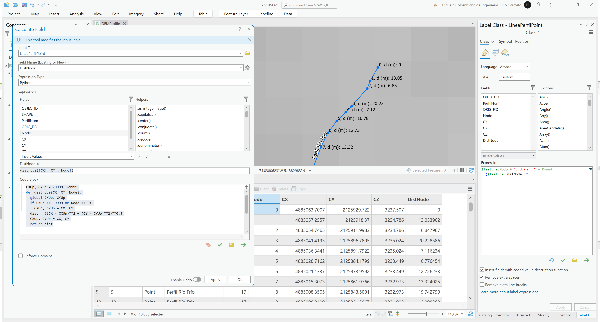</div>

Rótulo Arcade: `$feature.Nodo + " | d (m): " + Round($feature.DistNode, 2)`

13. Para el abscisado del perfil, cree un campo de atributos con el nombre _Abscisa_ y utilizando la siguiente función de Python, obtenga los valores requeridos.

Código Python:  
```
acum = 0
def abscisacum(distnode):
  global acum
  if distnode == 0:
    acum =0
  acum += distnode
  return acum
 ```
Llamado de función: `abscisacum(!DistNode!)`

<div align="center">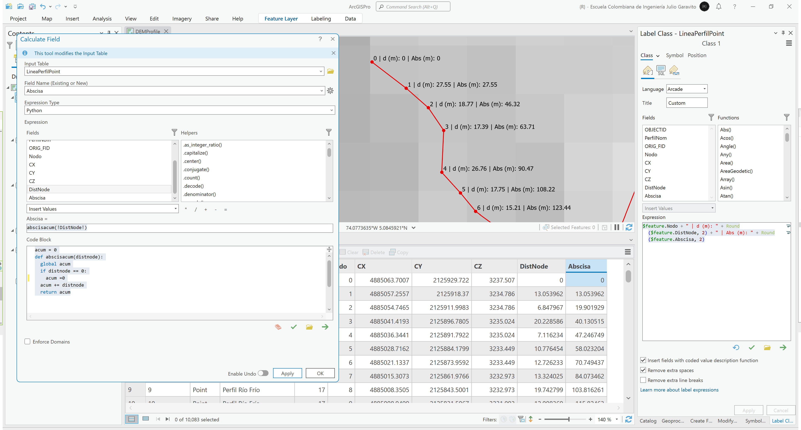</div>

Rótulo Arcade: `$feature.Nodo + " | d (m): " + Round($feature.DistNode, 2) + " | Abs (m): " + Round($feature.Abscisa, 2)`

14. 


## 2. Análisis usando software libre - QGIS

Para el desarrollo de las actividades desarrolladas en esta clase, se pueden utilizar en QGIS las siguientes herramientas o geo-procesos:

| Proceso            | Procedimiento                                                           |
|:-------------------|:------------------------------------------------------------------------|
| Simbología         | Modificable desde las propiedades de la capa en la pestaña _Symbology_. |
| Rotulado           | Modificable desde las propiedades de la capa en la pestaña _Labels_.    |

Ejemplo rótulo en QGIS: `'A(ha): ' ||  round("AGha", 2) || '\n' || 'P (m): ' ||  round("PGm", 2) `

[:notebook:QGIS training manual](https://docs.qgis.org/3.34/en/docs/training_manual/)  
[:notebook:Herramientas comúnmente utilizadas en QGIS](../QGIS.md)


## Elementos requeridos en diccionario de datos

Agregue a la tabla resúmen generada en la actividad [Inventario de información geo-espacial recopilada del POT y diccionario de datos](../POTLayer/Readme.md), las capas generadas en esta actividad que se encuentran listadas a continuación:

| Nombre                           | Descripción                                                                                                                  | Geometría   | Registros | 
|----------------------------------|------------------------------------------------------------------------------------------------------------------------------|-------------|-----------| 
|                                  |                                                                                                                              | Polígono 2D | 14        | 
|                                  |                                                                                                                              | Polígono 2D | 14        | 
|                                  |                                                                                                                              | Polígono 2D | 14        | 

> :bulb:Para funcionarios que se encuentran ensamblando el SIG de su municipio, se recomienda incluir y documentar estas capas en el Diccionario de Datos.


## Actividades de proyecto :triangular_ruler:

En la siguiente tabla se listan las actividades que deben ser desarrolladas y documentadas por cada grupo de proyecto en un único archivo de Adobe Acrobat .pdf. El documento debe incluir portada (indicando el caso de estudio, número de avance, nombre del módulo, fecha de presentación, nombres completos de los integrantes), numeración de páginas, tabla de contenido, lista de tablas, lista de ilustraciones, introducción, objetivo general, capítulos por cada ítem solicitado, conclusiones y referencias bibliográficas.

| Actividad     | Alcance                                                                                                                                                                                                                                                                                                                                                                                                                                             |
|:--------------|:----------------------------------------------------------------------------------------------------------------------------------------------------------------------------------------------------------------------------------------------------------------------------------------------------------------------------------------------------------------------------------------------------------------------------------------------------|
| Avance **P5** | Esta actividad no requiere del desarrollo de elementos en el avance del proyecto final, los contenidos son evaluados en el quiz de conocimiento y habilidad.                                                                                                                                                                                                                                                                                        | 
| Avance **P5** | :compass:Mapa digital impreso _P3-1: xxxx_<br>Incluir xxxxx. Embebido dentro del informe final como una imágen y referenciados como anexo.                                                                                                                                                                                                                                                                                                          | 
| Avance **P5** | En una tabla y al final del informe de avance de esta entrega, indique el detalle de las sub-actividades realizadas por cada integrante de su grupo. Para actividades que no requieren del desarrollo de elementos de avance, indicar si realizo la lectura de la guía de clase y las lecturas indicadas al inicio en los requerimientos. Utilice las siguientes columnas: Nombre del integrante, Actividades realizadas, Tiempo dedicado en horas. | 

> No es necesario presentar un documento de avance independiente, todos los avances de proyecto de este módulo se integran en un único documento.
> 
> En el informe único, incluya un numeral para esta actividad y sub-numerales para el desarrollo de las diferentes sub-actividades, siguiendo en el mismo orden de desarrollo presentado en esta actividad.


## Referencias

* 


## Control de versiones

| Versión    | Descripción                                                | Autor                                      | Horas |
|------------|:-----------------------------------------------------------|--------------------------------------------|:-----:|
| 2024.02.24 | Versión inicial con alcance de la actividad                | [rcfdtools](https://github.com/rcfdtools)  |   4   |
| 2024.06.27 | Investigación y documentación para caso de estudio general | [rcfdtools](https://github.com/rcfdtools)  |   8   |


_R.SIGE es de uso libre para fines académicos, conoce nuestra licencia, cláusulas, condiciones de uso y como referenciar los contenidos publicados en este repositorio, dando [clic aquí](LICENSE.md)._

_¡Encontraste útil este repositorio!, apoya su difusión marcando este repositorio con una ⭐ o síguenos dando clic en el botón Follow de [rcfdtools](https://github.com/rcfdtools) en GitHub._

| [:arrow_backward: Anterior](../xxxx) | [:house: Inicio](../../README.md) | [:beginner: Ayuda / Colabora](https://github.com/rcfdtools/R.SIGE/discussions/99999) | [Siguiente :arrow_forward:]() |
|---------------------|-------------------|---------------------------------------------------------------------------|---------------|

[^1]: 