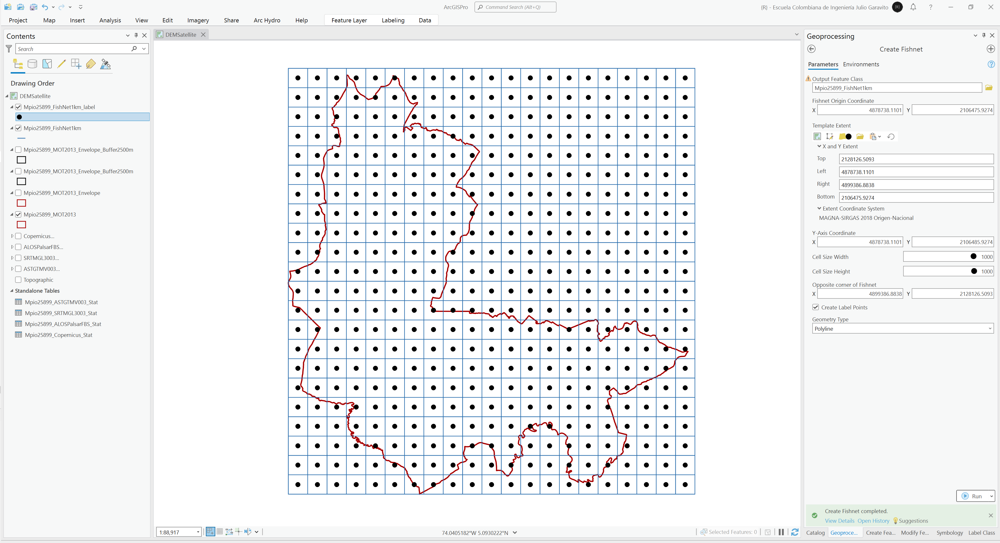
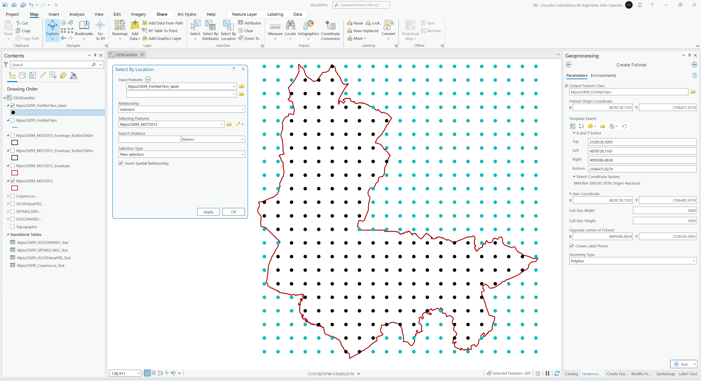

# Modelo digital de elevación - DEM a partir de sensores remotos satelitales
Keywords: `aster-gdem` `srtm` `alos-palsar` `copernicus` `feature-envelope` `extract-multivalues-to-points`

Descargue y procese los siguientes modelos de terreno con cubrimiento hasta el límite de la envolvente de las Subzonas Hidrográficas SZH de proyecto (utilice la envolvente creada para definir la zona de selección de las imágenes satelitales de terreno): ASTER GDEM v3, SRTM, ALOS PALSAR y ESA Copernicus. Cree una red de muestreo regular con nodos cada 1 km utilizando el límite municipal generado previamente a partir del MOT y obtenga en cada punto las elevaciones a partir de estos 4 modelos y el modelo generado a partir de las curvas de nivel del POT, compare y analice con matrices de dispersión múltiple las diferencias encontradas. A partir del DEM Copernicus, genere curvas de nivel categorizadas principales cada 50 metros y secundarias cada 10 metros, compare y analice las diferencias con respecto a las curvas del POT.

## Objetivos

* Descarga e integrar modelos digitales de elevación a partir de información de sensores remotos satelitales.
* Comparar y entender las diferencias entre las elevaciones obtenidas a partir de los modelos digitales de elevación Aster, SRTM, Alos Palsar y Copernicus.
* Crear curvas de nivel a partir de DEM satelitales.

## Requerimientos

* [:mortar_board:Actividad](../TopoBasic/Readme.md): Conceptos básicos de topografía, fotogrametría y fotointerpretación.
* [:mortar_board:Actividad](../SZH/Readme.md): Análisis de sub-zonas hidrográficas.
* [:toolbox:Herramienta](https://www.esri.com/en-us/arcgis/products/arcgis-pro/overview): ESRI ArcGIS Pro 3.3.1 o superior.
* [:toolbox:Herramienta](https://qgis.org/): QGIS 3.38 o superior.
* [:man_technologist:Usuario](https://urs.earthdata.nasa.gov/): Creación de cuenta de usuario NASA. [Más información](https://github.com/rcfdtools/R.LTWB/tree/main/Section02/UserCreation).
* [:man_technologist:Usuario](https://ers.cr.usgs.gov/): Creación de cuenta de usuario USGS.
* [:man_technologist:Usuario:](https://portal.opentopography.org/newUser): Creación de cuenta de usuario en Open Topography. 

## 1. Creación de máscara para obtención de modelos digitales de elevación - DEM 

1. Abra el proyecto de ArcGIS Pro, creado previamente y desde el menú _Insert_ cree un nuevo mapa _New Map_, renombre como _DEMSatellite_ y establezca el CRS 9377. Agregue al mapa la capa del límite territorial municipal generado a partir del Modelo de Ocupación Territorial - MOT disponible en la ruta `\file\gdb\SIGE.gdb\SIGE\Mpio25899_MOT2013` y ajuste la simbología a contorno rojo sin relleno.  

2. Utilizando la herramienta de geo-procesamiento _Data Management Tools / Feature Envelope To Polygon_, genere un polígono envolvente alrededor del límite municipal, nombre como `\file\gdb\SIGE.gdb\SIGE\Mpio25899_MOT2013_Envelope`.

3. Utilizando la herramienta de geo-procesamiento _Analysis Tools / Buffer_, cree un polígono aferente externo de 2500 metros alrededor de la envolvente obtenida. Nombre la capa resultante como `\file\gdb\SIGE.gdb\SIGE\Mpio25899_MOT2013_Envelope_Buffer2500m`.

> Este polígono aferente será utilizado para definir el límite de descarga de los modelos digitales de elevación y hemos utilizado 2500 metros para que el terreno obtenido cubra los drenajes próximos que fluyen hacia dentro del área municipal evaluada.

4. Desde la tabla de contenido y utilizando la herramienta _Export Features_, exporte la capa `Mpio25899_MOT2013_Envelope_Buffer2500m` en un archivo de formas shapefile dentro de la carpeta `\file\shp\`. Utilice el mismo nombre de la clase de entidad contenida en la GDB y en entornos o _Environments_ establezca el sistema 4326 correspondiente a GCS_WGS_1984.

5. En la carpeta `\file\shp\` comprima en un archivo _.zip_ los archivos `Mpio25899_MOT2013_Envelope_Buffer2500m.dbf`, `Mpio25899_MOT2013_Envelope_Buffer2500m.prj`, `Mpio25899_MOT2013_Envelope_Buffer2500m.shp` y `Mpio25899_MOT2013_Envelope_Buffer2500m.shx`.

## 2. Modelo digital de elevación NASA ASTER GDEM v3 (30 m)

Los sensores remotos japoneses Advanced Spaceborne Thermal Emission and Reflection Radiometer o ASTER, proveen imágenes de alta resolución del Planeta Tierra y las capturas están compuestas por 14 diferentes bandas del espectro electromagnético en el rango visible de la luz termal infrarroja. Las imágenes son capturadas en resoluciones entre 15 y 90 metros permitiendo crear mapas detallados de la temperatura y elevación de la tierra en celdas o píxeles con variaciones cada 1 metro.

A partir del segundo semestre de 2019, los modelos de terreno ASTER GDEM v2 han sido reemplazados por la versión 3 integrada de todo el mundo, como novedad, la versión 3 no presenta problemas de sobre-elevaciones debidas a nubes.

1. Utilizando su navegador de Internet, abra al portal https://search.earthdata.nasa.gov/, en la parte superior derecha ingrese con su cuenta de usuario y luego desde la parte superior izquierda, seleccione la opción de definición de límite de búsqueda a partir de un archivo o _File (KML, KMZ, ESRI, ...)_.

2. En la ventana de cargue de archivo, seleccione el archivo comprimido `\file\shp\Mpio25899_MOT2013_Envelope_Buffer2500m.zip` correspondiente a la envolvente de la zona de estudio.

> Debido a que la envolvente incluye múltiples nodos en las esquinas redondeadas del buffer generado, es posible que reciba un mensaje de advertencia indicando que la capa contiene demasiados nodos. 

3. En la casilla de búsqueda ingresar _**ASTER Global Digital Elevation Model V003**_. Podrá observar que para la zona de estudio, es necesario descargar 4 cuadrículas. En la parte inferior de la ventana de descarga, de clic en la opción _Donwload All_.

4. En la ventana de descarga, de clic en la opción _Download Data_ y siga los procedimientos complementarios desplegados por _EarthData_. El tamaño aproximado de los archivos es de 119.1 MB.

5. Desde la carpeta de Descargas de su sistema operativo, mueva los archivos descargados a la carpeta `\file\dem\` y renombre la carpeta como `ASTGTM_003`. Podrá observar que la descarga incluye 8 archivos, 4 corresponden al modelo digital de elevación (dem) y 4 a archivos de control numérico (num).

6. Cargue las 4 imágenes DEM (_dem.tif) descargadas al proyecto de ArcGIS Pro. Podrá observar que por la localización específica del municipio evaluado, fue necesario descargar estas 4 celdas.   

7. Utilizando la herramienta de geo-procesamiento _Data Management Tools / Mosaic to New Raster_, cree el mosaico a partir de las 4 imágenes independientes seleccionando Pixel Type en 32 bit signed, asigne el CRS 9377 y defina el número de bandas en 1. Nombre como `\file\dem\ASTGTM_003\ASTGTMV003MosaicArcGISPro.tif`. Podrá observar que el rango de elevaciones del mosaico se encuentra entre las cotas 86 y 4155 m.s.n.m.

8. Simbolice por relieve sombreado en escala de grises y acerque al límite municipal.

9. Utilizando la herramienta de geo-procesamiento _Image Analyst Tools / Zonal Statistics as Table_, obtenga los estadísticos de elevación del municipio en estudio. Guarde la tabla resultante como `\file\gdb\SIGE.gdb\Mpio25899_ASTGTMV003_Stat`. Podrá observar que el rango de elevaciones municipal es de 2528 a 3717 m.s.n.m.

## 3. Modelo digital de elevación SRTM (30 m)

Shuttle Radar Topography Mission (SRTM), dispone de mapas topográficos de alta resolución para uso público desde el año 2015 y pueden ser utilizados para la creación de los mapas de dirección y acumulación de flujo.

A partir del segundo semestre de 2019, el modelo de terreno SRTM v3, ya se encuentra disponible para descarga por el servidor EarthData de la NASA, buscar como "NASA Shuttle Radar Topography Mission Global 1 arc second V003".

1. En https://search.earthdata.nasa.gov/, ingrese como cadena de búsqueda **_NASA Shuttle Radar Topography Mission Global 1 arc second V003_**, luego desde la parte superior izquierda, seleccione la opción de definición de límite de búsqueda a partir de un archivo o _File (KML, KMZ, ESRI, ...)_ y cargue el archivo comprimido `\file\shp\Mpio25899_MOT2013_Envelope_Buffer2500m.zip` tal como se explicó en el procedimiento de descarga ASTER GDEM v3.

2. En la ventana de resultados de búsqueda podrá observar que al igual que el modelo ASTER, es necesario descargar 4 archivos. De clic en el botón _Download All_ para iniciar la descarga y siga las instrucciones mostradas en el navegador y mueva los archivos descargados a la carpeta `\file\dem\` y renombre la carpeta como `SRTMGL3_003`. Podrá observar que la descarga incluye 4 archivos comprimidos. De cada archivo comprimido, extraiga los archivos `.hgt`.

3. Cargue las 4 imágenes DEM descargadas al proyecto de ArcGIS Pro. 

4. Utilizando la herramienta de geo-procesamiento _Data Management Tools / Mosaic to New Raster_, cree el mosaico a partir de las 4 imágenes independientes seleccionando Pixel Type en 32 bit signed, asigne el CRS 9377 y defina el número de bandas en 1. Nombre como `\file\dem\ASTGTM_003\SRTMGL3003MosaicArcGISPro.tif`. Podrá observar que el rango de elevaciones del mosaico se encuentra entre las cotas 131 y 4149 m.s.n.m cuyos valores son diferentes a los obtenidos en el modelo digital de elevación ASTER.

5. Simbolice por relieve sombreado en escala de grises y acerque al límite municipal.

6. Utilizando la herramienta de geo-procesamiento _Image Analyst Tools / Zonal Statistics as Table_, obtenga los estadísticos de elevación del municipio en estudio. Guarde la tabla resultante como `\file\gdb\SIGE.gdb\Mpio25899_SRTMGL3003_Stat`. Podrá observar que el rango de elevaciones municipal es de 2546 a 3715 m.s.n.m.

## 4. Modelo digital de elevación ALOS Palsar (12.5 m)

ALOS Phased Array type L-band Synthetic Aperture Radar, es uno de los instrumentos de observación avanzada de la superficie terrestre, que permite entre otros, obtener un modelo digital de la tierra en alta resolución.

1. En https://search.earthdata.nasa.gov/, ingrese como cadena de búsqueda **_ALOS_PALSAR_RTC_HIGH_RES_**, luego desde la parte superior izquierda, seleccione la opción de definición de límite de búsqueda a partir de un archivo o _File (KML, KMZ, ESRI,...)_ y cargue el archivo comprimido `\file\shp\Mpio25899_MOT2013_Envelope_Buffer2500m.zip` tal como se explicó en el procedimiento de descarga ASTER GDEM v3.

2. En la ventana de resultados de búsqueda podrá observar que se despliegan 77 resultados correspondientes a las imágenes originales tomadas desde el satélite, en el panel lateral defina la fecha inicial en 2011-02-01 para obtener las imágenes más recientas, obtendrá 4 resultados. De clic en el botón _Download All_ para iniciar la descarga y siga las instrucciones mostradas en el navegador y mueva los archivos descargados a la carpeta `\file\dem\` y renombre la carpeta como `ALOSPalsarFBS`. Podrá observar que la descarga incluye 4 archivos comprimidos. De cada archivo comprimido, extraiga los archivos `.dem.tif`.

3. Cargue las 4 imágenes DEM descargadas al proyecto de ArcGIS Pro. 

4. Utilizando la herramienta de geo-procesamiento _Data Management Tools / Mosaic to New Raster_, cree el mosaico a partir de las 4 imágenes independientes seleccionando Pixel Type en 32 bit signed, asigne el CRS 9377, defina el número de bandas en 1 y el operador de mosaico en _**Mean**_. Nombre como `\file\dem\ASTGTM_003\ALOSPalsarFBSMosaicArcGISPro.tif`. Podrá observar que el rango de elevaciones del mosaico se encuentra entre las cotas 188 y 3878 m.s.n.m cuyos valores son diferentes a los obtenidos en el modelo digital de elevación ASTER y ALOS Palsar.

5. Simbolice por relieve sombreado en escala de grises y acerque al límite municipal.

6. Utilizando la herramienta de geo-procesamiento _Image Analyst Tools / Zonal Statistics as Table_, obtenga los estadísticos de elevación del municipio en estudio. Guarde la tabla resultante como `\file\gdb\SIGE.gdb\Mpio25899_ALOSPalsarFBS_Stat`. Podrá observar que el rango de elevaciones municipal es de 2557 a 3749 m.s.n.m.

## 5. Modelo digital de elevación ESA Copernicus (30 m)

The Copernicus DEM is a Digital Surface Model (DSM) which represents the surface of the Earth including buildings, infrastructure and vegetation. This DSM is derived from an edited DSM named WorldDEM, where flattening of water bodies and consistent flow of rivers has been included. In addition, editing of shore- and coastlines, special features such as airports, and implausible terrain structures has also been applied.

The WorldDEM product is based on the radar satellite data acquired during the TanDEM-X Mission, which is funded by a Public Private Partnership between the German State, represented by the German Aerospace Centre (DLR) and Airbus Defence and Space. OpenTopography is providing access to the global 30m (GLO-30) DSM through the public AWS S3 bucket established by Sinergise.

1. En ArcGIS Pro y dentro de la tabla de atributos de la capa `Mpio25899_MOT2013_Envelope_Buffer2500m`, cree 4 campos de atributos numéricos dobles con los nombres `LongLeft`, `LongRight`, `LatTop` y `LatBottom`. Sobre estos campos calcularemos los límites geodésicos de la envolvente que rodea la zona de estudio.

2. Utilizando el calculador de geometría de campo, calcule en los campos creados las localizaciones geográficas angulares de la envolvente. 

Para el caso de estudio, las coordenadas límite obtenidas en grados decimales son:

* Xmin: -74.11712645
* Ymin: 4.94043097
* Xmax: -73.88530317
* Ymax: 5.18122946

3. Ingrese al portal https://opentopography.org/ y en la pestaña _MyOpenTopo_ ingrese con su cuenta de usuario.

4. En _DATA_, seleccione la opción _FIND DATA MAP_ que le permitirá ingresar a las opciones de búsqueda de colecciones.

5. En el panel lateral derecho _Data Sources_ seleccione el dataset _COP 30m & 90m_.

6. En el panel lateral izquierdo, de clic en la opción _Zoom to location by placename or coordinates_, ingrese las coordenadas límite obtenidas de la envolvente y de clic en el botón _Update Map_.

7. En los resultados desplegados, de clic en el botón _Copernicus 30m_ y consulte la descripción general de este producto, podrá observar que para los límites definidos, el área a descargar será de 688 km².

8. Diríjase al final de la ventana de especificaciones, ingrese el detalle del uso que le dará a estos datos y de clic en el botón _Submit_. Una vez enviada la solicitud, el servidor procederá a extraer el modelo digital de elevación para la zona indicada y mostrará el resultado en la ventana de resultados. Para obtener el archivo, de clic en el enlace _rasters_COP30.tar.gz_, guarde el archivo en la ruta `\file\dem\Copernicus` y luego descomprímalo. El nombre genérico de este archivo es `output_hh.tif`. 

9. Cargue la imagen DEM descargada al proyecto de ArcGIS Pro, podrá observar que cubre toda la zona de estudio y no requiere de la generación de un mosaico. Al consultar los metadatos de la imagen, también observará que la referencia espacial es WGS 1984.

10. Desde la tabla de contenido, exporte y re-proyecte el modelo digital de elevación Copernicus a una grilla TIFF utilizando el CRS 9377, guarde como `\file\dem\Copernicus\Copernicus30m.tif`. El rango general de elevaciones obtenidas en este modelo está entre 1983.7 y 3752.15 m.s.n.m.

11. Simbolice por relieve sombreado en escala de grises y acerque al límite municipal.

12. Utilizando la herramienta de geo-procesamiento _Image Analyst Tools / Zonal Statistics as Table_, obtenga los estadísticos de elevación del municipio en estudio. Guarde la tabla resultante como `\file\gdb\SIGE.gdb\Mpio25899_Copernicus_Stat`. Podrá observar que el rango de elevaciones municipal es de 2548.64 a 3721.21 m.s.n.m.

## 6. Red de muestreo para comparación y análisis de elevaciones

A partir de las estadísticas zonales obtenidas de los modelos digitales de elevación, se pudo observar que los rangos de elevación son diferentes como se presenta en la siguiente tabla resúmen.

| Modelo digital                               |   Mín.    |    Med.    |   Máx.    |
|----------------------------------------------|:---------:|:----------:|:---------:|
| NASA ASTER GDEM v3 (30 m)                    |   2528    |  2960.42   |   3717    |
| Shuttle Radar Topography Mission SRTM (30 m) |   2546    |  2961.20   |   3715    |
| ALOS Palsar (12.5 m)                         |   2557    |  2982.38   |   3749    |
| Copernicus (30 m)                            |  2548.64  |  2961.87   |  3721.21  |

Para evaluar la correspondencia entre estos modelos digitales, crearemos una red de muestreo regular y una matriz de dispersión múltiple. 

1. Utilizando la herramienta de geo-procesamiento _Data Management Tools / Create FishNet_, cree una red regular con separación cada 1 kilómetro definiendo en _Template Extent_ el límite geográfico de la capa `Mpio25899_MOT2013`. Guarde como `\file\gdb\SIGE.gdb\SIGE\Mpio25899_FishNet1km`. Podrá observar que _FishNet_ genera una nube de nodos y una retícula.

2. En el menú _Map_, seleccione la herramienta _Select By Location_ para seleccionar todos los nodos de la red de muestreo que no se encuentran dentro del municipio, asegúrese de marcar la casilla _Invert Spatial Relationship_.

3. En el mení _Edit_, de clic en el botón _Delete_ para eliminar todos los nodos que no están dentro de la zona de estudio, luego para guardar la modificación sobre la capa, en el mismo menú _Edit_ seleccione la opción _Save_.

4. Cargue al mapa, el modelo digital de elevación _\file\dem\IGAC_2013_CurvasNivelSmooth100mTIN.tif_ generado en la actividad anterior a partir de las curvas de nivel del POT. Simbolice por sombreado de relieve.

5. Utilizando la herramienta de geo-procesamiento _Spatial Analyst Tools / Extract Multi Values to Points_, obtenga en cada punto de muestreo las elevaciones de los 5 modelos digitales de elevación, nombre las columnas de atributos como: `ASTGTMV003`, `SRTMGL3003`, `ALOSPalsar`, `Copernicus` y `POT2013`. Como puede observar, no son idéntica las elevaciones obtenidas en cada localización de la red, debido a las fechas de captura de los diferentes modelos y a la tecnología de los sensores empleados.

6. Simbolice por colores graduados y por quantiles en 5 clases los puntos de la red de muestreo `Mpio25899_FishNet1km_label` y desde la tabla de contenido cree una gráfica de matriz de dispersión múltiple o _Scatter Plot Matrix_.

> Podrá observar que para las diferentes combinaciones existe una alta correlación entre los valores obtenidos y que muy pocos puntos no se ajustan a la línea de tendencia diagonal, con lo que se puede indicar que los diferentes modelos representan correctamente la topografía de la zona de estudio, sin embargo, al revisar los detalles visuales de cada modelo de terreno, se puede observar que Copernicus describe mejor los corredores de los drenajes.

## 7. Generación de curvas de nivel clasificadas

1. Utilizando la herramienta de geo-procesamiento _3D Analyst Tools / Contour with Barriers_, cree curvas de nivel categorizadas principales cada 50 metros y secundarias cada 5 metros. Utilice como barrera de recorte el límite municipal contenido en la capa `Mpio25899_MOT2013`, guarde las curvas como `\file\gdb\SIGE.gdb\SIGE\CurvasNivel5mCopernicus`. Podra observar que se han generado curvas hasta el límite completo del DEM.

2. Utilizando la herramienta de selección por localización disponible en el menu _Map_, seleccione todas las curvas de nivel cuyo centroide no se encuentra dentro del límite municipal, asegúrese de marcar la casilla _Invert Spatial Relationship_.

3. Desde el menú _Edit / Delete_, elimine todas las curvas de nivel seleccionadas y guarde los cambios, podrá observar que una de las curvas de nivel no ha sido segmentada y que una fracción se encuentra fuera de la zona de estudio.

4. Utilizado las herramientas de edición _Edit / Split_ y el encajado por intersección, segmente la curva de nivel a partir del contorno del municipio y elimine el tramo de línea que externo.

5. A partir del campo de atributos _Type_ de la capa de curvas de nivel, simbolice por valores únicos utilizando color negro y bordes gruesos para el tipo 2 y gris y bordes delgados para el tipo 1, acérquese y verifique la calidad de los contornos obtenidos, podrá observar que las curvas no tienen una apariencia suavizada.

6. Utilizando la herramienta de geo-procesamiento _Cartography Tools / Smooth Line_, realice un suavizado con rado de aproximación de 100 metros y compare con las curvas inicialmente obtenidas. Nombre como `\file\gdb\SIGE.gdb\SIGE\CurvasNivel5mCopernicusSmooth100m`.

7. Compare las curvas suavizadas generadas con las curvas utilizadas en la formulación del POT contenidas en la capa `\file\gdb\SIGE.gdb\IGAC2013Cartografia\CURVAS_NIVEL`, podra observar que de forma general las curvas del POT describen el terreno de la zona de estudio pero no disponen de suficiente detalle para generar, por ejemplo, una superficie digital y un modelo de pendientes detallado.

## 8. Análisis usando software libre - QGIS

Para el desarrollo de las actividades desarrolladas en esta clase, se pueden utilizar en QGIS las siguientes herramientas o geo-procesos:

| Proceso                                                                                 | Procedimiento                                                                                                                                                                                                                           |
|:----------------------------------------------------------------------------------------|:----------------------------------------------------------------------------------------------------------------------------------------------------------------------------------------------------------------------------------------|
| Simbología                                                                              | Modificable desde las propiedades de la capa en la pestaña _Symbology_.                                                                                                                                                                 |
| Rotulado                                                                                | Modificable desde las propiedades de la capa en la pestaña _Labels_.                                                                                                                                                                    |
| Polígono envolvente (envelope o boundingbox)                                            | Herramienta disponible en el _Processing Toolbox / Vector Geometry / [Bounding boxes](https://docs.qgis.org/3.34/en/docs/user_manual/processing_algs/qgis/vectorgeometry.html#bounding-boxes)_.                                         |
| Area aferente (Buffer)                                                                  | Herramienta disponible en el _Processing Toolbox / Vector Geometry / Buffer_.                                                                                                                                                           |
| Mosaico de imágenes (Mosaic to New Raster)                                              | Herramienta disponible en el _Processing Toolbox / GRASS / i.image.mosaic.                                                                                                                                                              |
| Estadística zonal como tabla (Zonal statistics as table)                                | Herramienta disponible en el _Processing Toolbox / Raster analysis / Zonal statistics.                                                                                                                                                  |
| Red de muestreo (FishNet)                                                               | Herramienta disponible en el _Processing Toolbox / Vector creation / Create grid.                                                                                                                                                       |
| Extracción de multiples valores desde grillas a puntos (Extract Multi Values to Points) | Puede ser realizado manualmente para cada grilla en el _Processing Toolbox / Raster analysis / Zonal statistics o se puede instalar el Plugin o complemento [Point sampling tool](https://plugins.qgis.org/plugins/pointsamplingtool/). |
| Curvas de nivel (Contour)                                                               | Herramienta disponible en el _Processing Toolbox / GRASS / Raster / r.contour.                                                                                                                                                          |
| Suavizar líneas (Smooth)                                                                | Herramienta disponible en el _Processing Toolbox / Vector Geometry / Smooth_.                                                                                                                                                           |

Ejemplo rótulo en QGIS: `'A(ha): ' ||  round("AGha", 2) || '\n' || 'P (m): ' ||  round("PGm", 2) `

[:notebook:QGIS training manual](https://docs.qgis.org/3.34/en/docs/training_manual/)  
[:notebook:Herramientas comúnmente utilizadas en QGIS](../QGIS.md)

## Elementos requeridos en diccionario de datos

Agregue a la tabla resúmen generada en la actividad [Inventario de información geo-espacial recopilada del POT y diccionario de datos](../POTLayer/Readme.md), las capas generadas en esta actividad que se encuentran listadas a continuación:

| Nombre                           | Descripción                                                                                                                  | Geometría   | Registros | 
|----------------------------------|------------------------------------------------------------------------------------------------------------------------------|-------------|-----------| 
|                                  |                                                                                                                              | Polígono 2D | 14        | 
|                                  |                                                                                                                              | Polígono 2D | 14        | 
|                                  |                                                                                                                              | Polígono 2D | 14        | 

> :bulb:Para funcionarios que se encuentran ensamblando el SIG de su municipio, se recomienda incluir y documentar estas capas en el Diccionario de Datos.

## Actividades de proyecto :triangular_ruler:

En la siguiente tabla se listan las actividades que deben ser desarrolladas y documentadas por cada grupo de proyecto en un único archivo de Adobe Acrobat .pdf. El documento debe incluir portada (indicando el caso de estudio, número de avance, nombre del módulo, fecha de presentación, nombres completos de los integrantes), numeración de páginas, tabla de contenido, lista de tablas, lista de ilustraciones, introducción, objetivo general, capítulos por cada ítem solicitado, conclusiones y referencias bibliográficas.

| Actividad     | Alcance                                                                                                                                                                                                                                                                                                                                                                                                                                             |
|:--------------|:----------------------------------------------------------------------------------------------------------------------------------------------------------------------------------------------------------------------------------------------------------------------------------------------------------------------------------------------------------------------------------------------------------------------------------------------------|
| Avance **P5** | Esta actividad no requiere del desarrollo de elementos en el avance del proyecto final, los contenidos son evaluados en el quiz de conocimiento y habilidad.                                                                                                                                                                                                                                                                                        | 
| Avance **P5** | :compass:Mapa digital impreso _P3-1: xxxx_ Incluir xxxxx. Embebido dentro del informe final como una imágen y referenciados como anexo.                                                                                                                                                                                                                                                                                                          | 
| Avance **P5** | En una tabla y al final del informe de avance de esta entrega, indique el detalle de las sub-actividades realizadas por cada integrante de su grupo. Para actividades que no requieren del desarrollo de elementos de avance, indicar si realizo la lectura de la guía de clase y las lecturas indicadas al inicio en los requerimientos. Utilice las siguientes columnas: Nombre del integrante, Actividades realizadas, Tiempo dedicado en horas. | 

> No es necesario presentar un documento de avance independiente, todos los avances de proyecto de este módulo se integran en un único documento.
> 
> En el informe único, incluya un numeral para esta actividad y sub-numerales para el desarrollo de las diferentes sub-actividades, siguiendo en el mismo orden de desarrollo presentado en esta actividad.

## Referencias

* 

## Control de versiones

| Versión    | Descripción                                                | Autor                                      | Horas |
|------------|:-----------------------------------------------------------|--------------------------------------------|:-----:|
| 2024.02.24 | Versión inicial con alcance de la actividad                | [rcfdtools](https://github.com/rcfdtools)  |   4   |
| 2024.06.27 | Investigación y documentación para caso de estudio general | [rcfdtools](https://github.com/rcfdtools)  |   8   |

_R.SIGE es de uso libre para fines académicos, conoce nuestra licencia, cláusulas, condiciones de uso y como referenciar los contenidos publicados en este repositorio, dando [clic aquí](LICENSE.md)._

_¡Encontraste útil este repositorio!, apoya su difusión marcando este repositorio con una ⭐ o síguenos dando clic en el botón Follow de [rcfdtools](https://github.com/rcfdtools) en GitHub._

| [:arrow_backward: Anterior](../DEMContour/Readme.md) | [:house: Inicio](../../README.md) | [:beginner: Ayuda / Colabora](https://github.com/rcfdtools/R.SIGE/discussions/99999) | [Siguiente :arrow_forward:]() |
|----------------------------------------------|-------------------|---------------------------------------------------------------------------|---------------|

[^1]: 