# Mapa de pendientes de terreno
Keywords: `slope-grid` `dem` `fill-sinks` `reclassify` `slope-hazard`

A partir del modelo de terreno ESA Copernicus, crear: mapa de relleno de sumideros FIL, mapa de pendientes en tasa porcentual, mapa de pendientes reclasificadas en 9 clases utilizando las especificaciones definidas en el dominio `Dom_PenSuelo` del modelo nacional para presentación de licencias ambientales del [ANLA](https://www.anla.gov.co/). Para cada zona geopolítica municipal y para cada polígono de categoría de suelo disponible en el MOT, calcule la pendiente mínima, media y máxima e identifique incompatibilidades (por ejemplo, zonas con pendientes altas definidas para desarrollos urbanos, de centros poblados, implantación de equipamientos).

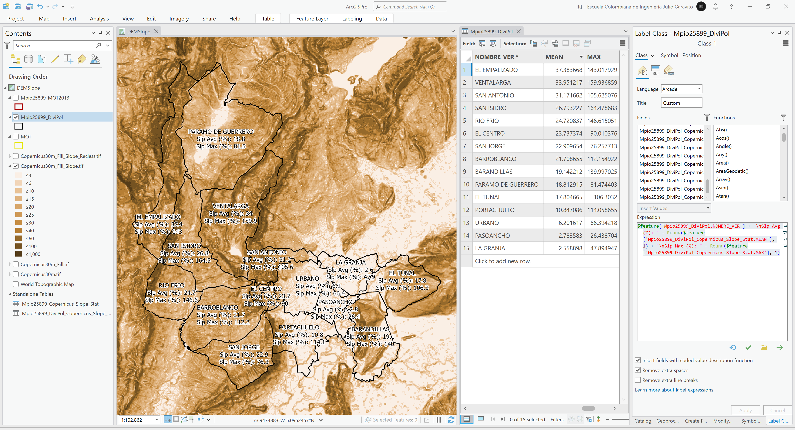

## Objetivos

* Rellenar sumideros en el modelo digital de elevación para ajuste de pendientes erradas.
* Crear y reclasificar el mapa de pendientes.
* Estimar la pendiente característica municipal, en cada zona geopolítica catastral municipal y para cada categoría del suelo en el MOT.
* Identificar incompatibilidades de pendientes altas en zonas con asentamientos humanos.

## Requerimientos

* [:mortar_board:Actividad](../TopoBasic/Readme.md): Conceptos básicos de topografía, fotogrametría y fotointerpretación.
* [:mortar_board:Actividad](../POTLayer/Readme.md): Inventario de información geo-espacial recopilada del POT y diccionario de datos.
* [:mortar_board:Actividad](../DEMContour/Readme.md): Modelo digital de elevación - DEM a partir de curvas de nivel.
* [:toolbox:Herramienta](https://www.esri.com/en-us/arcgis/products/arcgis-pro/overview): ESRI ArcGIS Pro 3.3.1 o superior.
* [:toolbox:Herramienta](https://qgis.org/): QGIS 3.38 o superior.

## 1. Creación de mapa de pendientes clasificadas

1. Abra el proyecto de ArcGIS Pro, creado previamente y desde el menú _Insert_ cree un nuevo mapa _New Map_, renombre como _DEMSlope_ y establezca el CRS 9377. Agregue al mapa el modelo digital de elevación Copernicus disponible en la ruta `\file\dem\Copernicus\Copernicus30m.tif` y las capas `Mpio25899_MOT2013`, `Mpio25899_DiviPol` y `MOT` desde la base de datos geográfica `\file\gdb\SIGE.gdb`, simbolice el DEM por sombreado de relieve o _Shaded Relief_ y ajuste la simbología de los polígonos utilizando diferentes colores de contorno y sin relleno.  

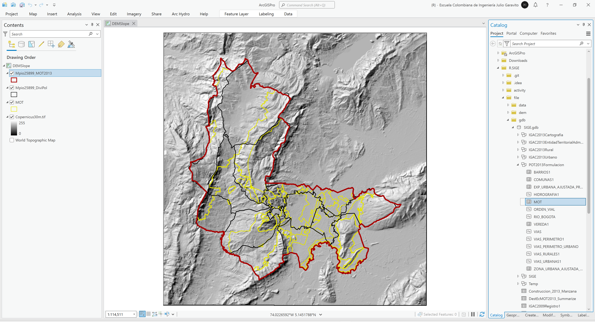

2. Utilizando la herramienta de geo-procesamiento _Spatial Analysis Tools / Fill_, rellene los sumideros del modelo digital de elevación Copernicus, guarde como `\file\dem\Copernicus\Copernicus30m_Fill.tif` y simbolice a partir por sombreado de relieve.

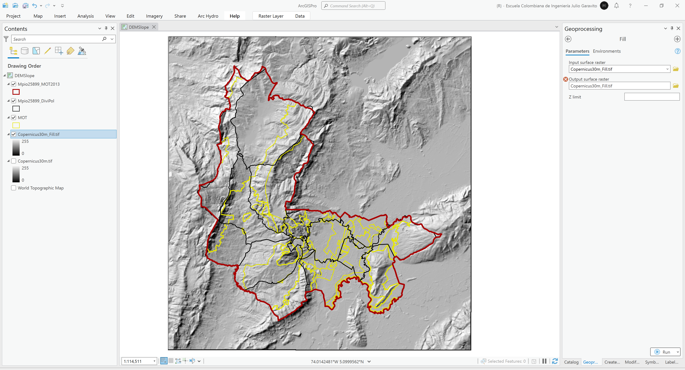

3. Utilizando la herramienta de geo-procesamiento _Spatial Analysis Tools / Slope_, cree en mapa de pendientes de terreno en tasa porcentual, guarde como `\file\dem\Copernicus\Copernicus30m_Fill_Slope.tif`. Podrá observar que automáticamente se crea una visualización clasificada con diferentes rangos que representan la pendiente.

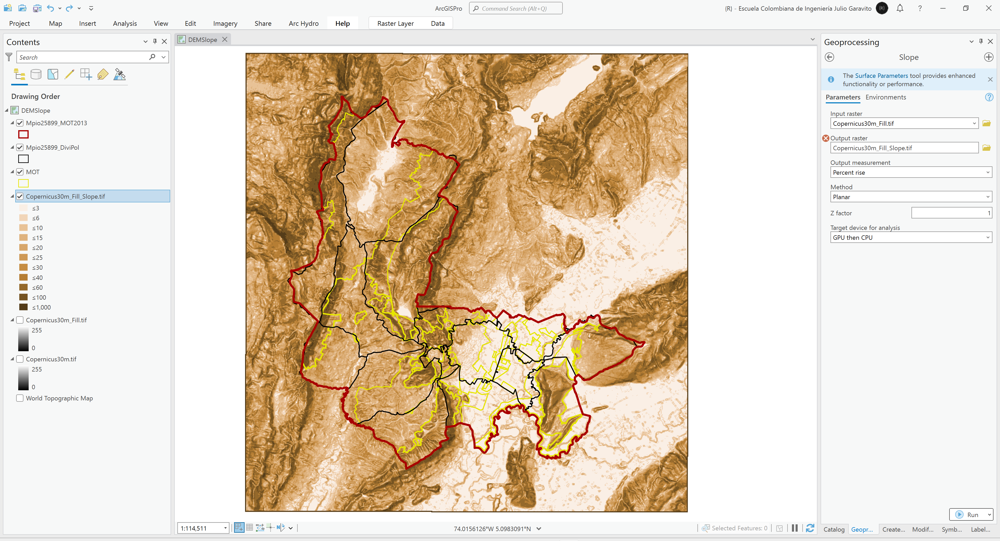

4. Utilizando la herramienta de geo-procesamiento _Spatial Analysis Tools / Reclassify_, reclasifique el mapa de pendientes en las siguientes 9 clases definidas en el dominio `Dom_PenSuelo` del diccionario de datos del ANLA utilizado para la presentación de estudios ambientales en Colombia, guarde como `\file\dem\Copernicus\Copernicus30m_Fill_Slope_Reclass.tif` y ajuste la simbología a valores únicos utilizando la paleta _Brown Light to Dark_.

| Código | Descripción                                      | Rango        |
|:------:|:-------------------------------------------------|:-------------|
|  6010  | A nivel                                          | 0-1% (a)     |
|  6020  | Ligeramente plana                                | 1-3% (a)     |
|  6030  | Ligeramente inclinada                            | 3-7% (b)     |
|  6040  | Moderadamente inclinada                          | 7-12% (c)    |
|  6050  | Fuertemente inclinada                            | 12-25% (d)   |
|  6060  | Ligeramente escarpada o ligeramente empinada     | 25-50% (e)   |
|  6070  | Moderadamente escarpada o moderadamente empinada | 50-75% (f)   |
|  6080  | Fuertemente escarpada o fuertemente empinada     | 75-100% (g)  |
|  6090  | Totalmente escarpada                             | >100% (g)    |

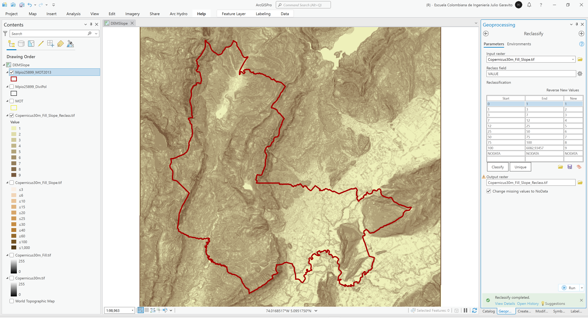

## 2. Análisis general de pendiente municipal

Utilizando la herramienta de geo-procesamiento _Image Analysis Tools / Zonal Statistics as Table_, obtenga para el límite municipal contenido en la capa `Mpio25899_MOT2013` y el mapa detallado de pendientes _Copernicus30m_Fill_Slope.tif_, los estadísticos de la zona de estudio, guarde como `\file\gdb\SIGE.gdb\Mpio25899_Copernicus_Slope_Stat`. Podrá observar que a nivel municipal, se han encontrado pendientes entre 0 y 189.22% con media general de 22.05% y desviación estándar de 18.99%, que de acuerdo con la clasificación del mapa de rangos de pendiente, corresponde a _6050 - Fuertemente inclinada, entre 12-25%_.

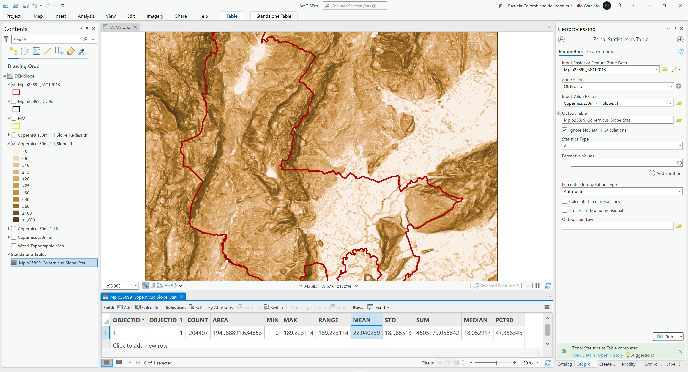

## 3. Análisis de pendiente por división geopolítica municipal catastral

1. Utilizando la herramienta de geo-procesamiento _Image Analysis Tools / Zonal Statistics as Table_, obtenga para la división geopolítica municipal catastral contenida en la capa `Mpio25899_DiviPol` y el mapa detallado de pendientes _Copernicus30m_Fill_Slope.tif_, los estadísticos de la zona de estudio, guarde como `\file\gdb\SIGE.gdb\Mpio25899_DiviPol_Copernicus_Slope_Stat`.

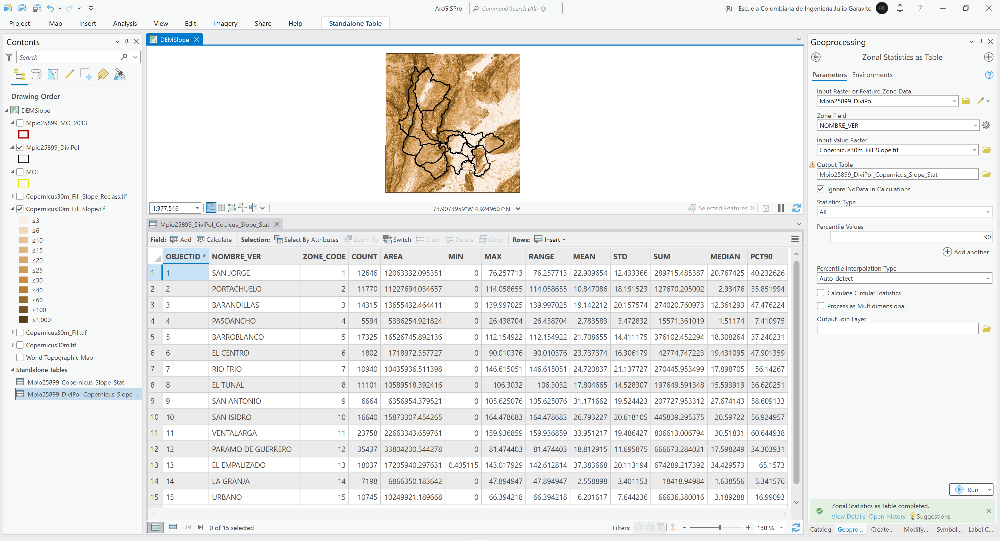

2. Realice unión de tablas integrando los resultados obtenidos a cada polígono de vereda y rotule incluyendo el valor medio y máximo obtenido. Podrá observar que la zona con mayor media de pendientes es _El Empalizado_ y que el valor máximo de pendiente se encuentra en la vereda _San Isidro_. 

> Recuerde que en la capa de división geopolítica catastral, hemos incluido previamente el límite urbano.

Rótulo Arcade: `$feature['Mpio25899_DiviPol.NOMBRE_VER'] + "\nSlp Avg (%): " + Round($feature['Mpio25899_DiviPol_Copernicus_Slope_Stat.MEAN'], 1) + "\nSlp Max (%): " + Round($feature['Mpio25899_DiviPol_Copernicus_Slope_Stat.MAX'], 1)`

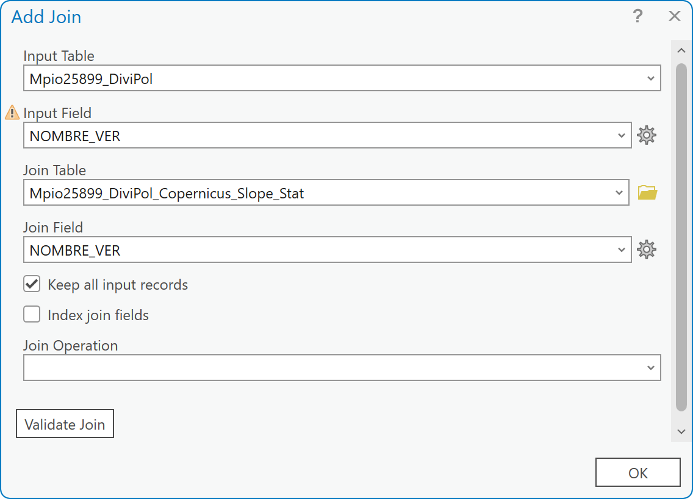

## 4. Análisis de pendiente por categoría de suelo e identificación de incompatibilidades

1. Utilizando la herramienta de geo-procesamiento _Image Analysis Tools / Zonal Statistics as Table_, obtenga para los límites definidos en el mapa del modelo de ocupación territorial - MOT contenidos en la capa `MOT` y el mapa detallado de pendientes _Copernicus30m_Fill_Slope.tif_, los estadísticos de la zona de estudio, guarde como `\file\gdb\SIGE.gdb\MOT_Copernicus_Slope_Stat`.

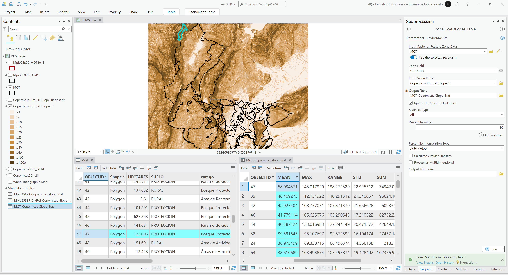

2. Realice unión de tablas integrando los resultados obtenidos a cada polígono del MOT y rotule incluyendo el valor medio obtenido. Podrá observar que la zona con mayor media de pendientes corresponde a _Protección_ en _Bosque Protector_. 

Rótulo Arcade: `$feature['MOT.SUELO'] + "\n" + $feature['MOT.catego'] + "\nSlp Avg (%): " + Round($feature['MOT_Copernicus_Slope_Stat.MEAN'], 1) `

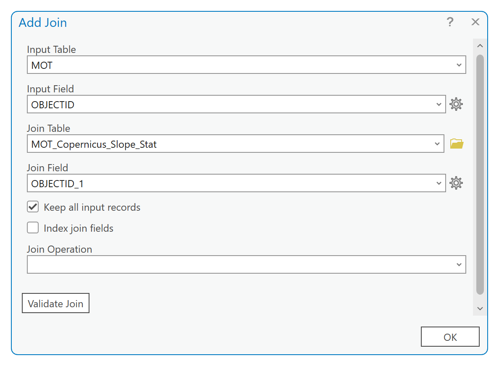

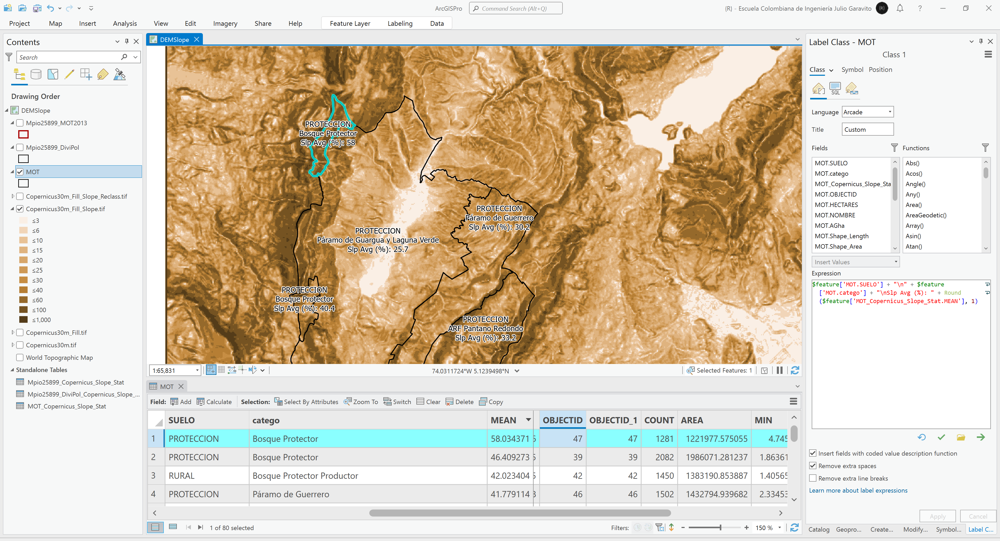

3. Para la evaluación de zonas pobladas o con asentamientos humanos en condición de amenaza por pendientes altas utilizaremos la siguiente combinación de categorías:

* Categorías MOT: Áreas de Actividad en Suelo Urbano, Áreas de Actividad en Suelo de Expansión Urbana, Área de Vivienda Rural Campestre y Centro Poblado Rural.
* Pendiente: mayor o igual al 25% correspondiente a Ligeramente escarpada o ligeramente empinada, Moderadamente escarpada o moderadamente empinada, Fuertemente escarpada o fuertemente empinada y Totalmente escarpada.

Desde las propiedades de la capa _MOT_ y a través de la definición de un filtro de consulta o _Definition Query_, filtre los elementos requeridos utilizando la siguiente expresión: `MOT.catego IN ('Área de Vivienda Rural Campestre', 'Áreas de Actividad en Suelo de Expansión Urbana', 'Áreas de Actividad en Suelo Urbano', 'Centro Poblado Rural') And MOT_Copernicus_Slope_Stat.MEAN >= 25`

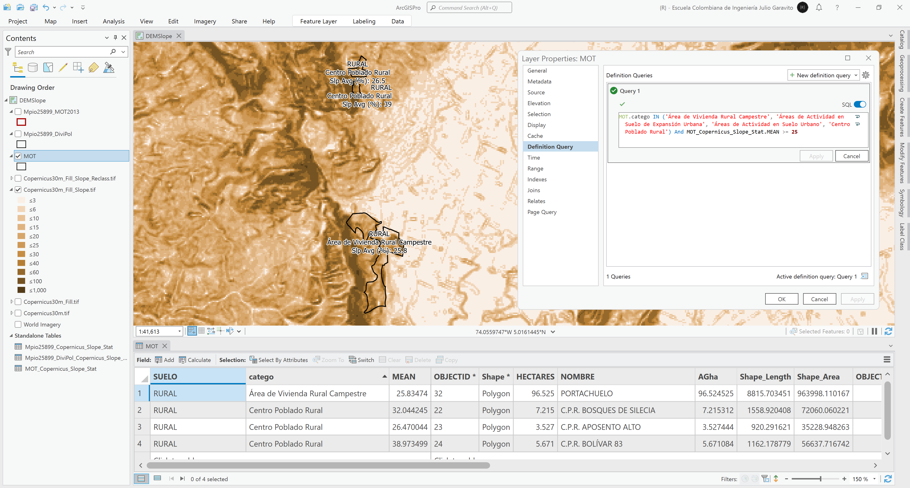

En la tabla de atributos podrá observar que los polígonos que cumplen con esta condición corresponden a:

| Suelo  | Categoría                        | Nombre                    |  Pendiente media (%)  |
|--------|----------------------------------|---------------------------|:---------------------:|
| Rural  | Área de Vivienda Rural Campestre | Portachuelo               |         25.83         |
| Rural  | Centro Poblado Rural             | C.P.R. Bosques de Silecia |         32.04         |
| Rural  | Centro Poblado Rural             | C.P.R. Aposento Alto      |         26.47         |
| Rural  | Centro Poblado Rural             | C.P.R. Bolívar 83         |         38.97         |

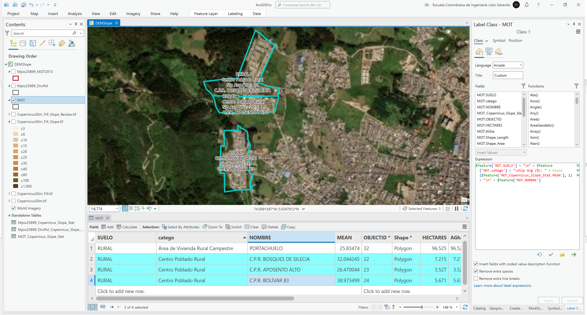

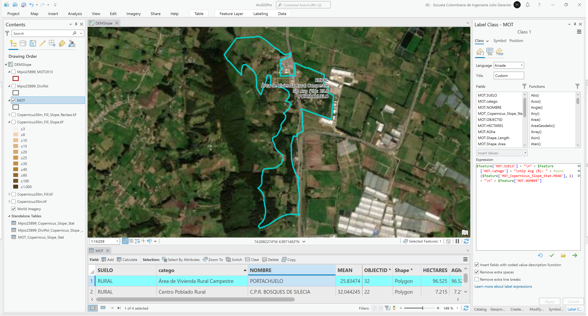

## 5. Análisis usando software libre - QGIS

Para el desarrollo de las actividades desarrolladas en esta clase, se pueden utilizar en QGIS las siguientes herramientas o geo-procesos:

| Proceso                                                  | Procedimiento                                                                                                                                    |
|:---------------------------------------------------------|:-------------------------------------------------------------------------------------------------------------------------------------------------|
| Simbología                                               | Modificable desde las propiedades de la capa en la pestaña _Symbology_.                                                                          |
| Rotulado                                                 | Modificable desde las propiedades de la capa en la pestaña _Labels_.                                                                             |
| Relleno de sumideros (Fill)                              | Herramienta disponible en el _Processing Toolbox / GRASS / Raster / r.fillnulls o en _Processing Toolbox / GDAL / Raster analysis / Fill NoData. |
| Pendiente de terreno en tasa porcentual (Slope)          | Herramienta disponible en el _Processing Toolbox / GDAL / Raster analysis / Slope.                                                               |
| Reclasificación de imágenes (Reclassify)                 | Herramienta disponible en el _Processing Toolbox /Raster analysis / Reclassify by table.                                                         |
| Estadística zonal como tabla (Zonal statistics as table) | Herramienta disponible en el _Processing Toolbox / Raster analysis / Zonal statistics.                                                           |
| Consultas o filtros de tabla (Definition Query)          | Se realizan desde las propiedades de la capa en la pestaña Source y la opción Query Builder.                                                     |

Ejemplo rótulo en QGIS: `'A(ha): ' ||  round("AGha", 2) || '\n' || 'P (m): ' ||  round("PGm", 2) `

[:notebook:QGIS training manual](https://docs.qgis.org/3.34/en/docs/training_manual/)  
[:notebook:Herramientas comúnmente utilizadas en QGIS](../QGIS.md)

## Elementos requeridos en diccionario de datos

Agregue a la tabla resúmen generada en la actividad [Inventario de información geo-espacial recopilada del POT y diccionario de datos](../POTLayer/Readme.md), las capas generadas en esta actividad que se encuentran listadas a continuación:

| Nombre                                  | Descripción                                                                                                                                                               | Geometría   | Registros | 
|-----------------------------------------|---------------------------------------------------------------------------------------------------------------------------------------------------------------------------|-------------|-----------| 
| Copernicus30m_Fill.tif                  | Grilla de terreno con relleno de sumideros a partir de DEM Copernicus (30 m).                                                                                             | (Grid)      | n/a       | 
| Copernicus30m_Fill_Slope.tif            | Grilla de pendientes de terreno en tasa porcentual a partir de DEM Copernicus con relleno de sumideros (30 m).                                                            | (Grid)      | n/a       | 
| Copernicus30m_Fill_Slope_Reclass.tif    | Grilla de reclasificación de pendientes de terreno en clases ANLA a partir de grilla de pendientes generadas a partir del DEM Copernicus con relleno de sumideros (30 m). | (Grid)      | n/a       | 
| Mpio25899_Copernicus_Slope_Stat         | Tabla de estadísticos zonales de pendiente sobre toda el área municipal Mpio25899_MOT2013.                                                                                | (Table)     | 1         | 
| Mpio25899_DiviPol_Copernicus_Slope_Stat | Tabla de estadísticos zonales de pendiente para cada división geopolítica catastral municipal en Mpio25899_DiviPol.                                                       | (Table)     | 15        | 
| MOT_Copernicus_Slope_Stat               | Tabla de estadísticos zonales para cada categoría de suelo definida en el MOT.                                                                                            | (Table)     | 80        | 

> :bulb:Para funcionarios que se encuentran ensamblando el SIG de su municipio, se recomienda incluir y documentar estas capas en el Diccionario de Datos.

## Actividades de proyecto :triangular_ruler:

En la siguiente tabla se listan las actividades que deben ser desarrolladas y documentadas por cada grupo de proyecto en un único archivo de Adobe Acrobat .pdf. El documento debe incluir portada (indicando el caso de estudio, número de avance, nombre del módulo, fecha de presentación, nombres completos de los integrantes), numeración de páginas, tabla de contenido, lista de tablas, lista de ilustraciones, introducción, objetivo general, capítulos por cada ítem solicitado, conclusiones y referencias bibliográficas.

| Actividad     | Alcance                                                                                                                                                                                                                                                                                                                                                                                                                                             |
|:--------------|:----------------------------------------------------------------------------------------------------------------------------------------------------------------------------------------------------------------------------------------------------------------------------------------------------------------------------------------------------------------------------------------------------------------------------------------------------|
| Avance **P5** | Siguiendo la secuencia presentada en esta actividad, realice el análisis de pendientes e identifique zonas con posibles incompatibilidades con el uso definido en el POT.                                                                                                                                                                                                                                                                           | 
| Avance **P5** | :compass:Mapa digital impreso _P5-7: Mapa de pendientes y estadístico municipal._ Incluir tabla de valores de estadística zonal. Embebido dentro del informe final como una imágen y referenciados como anexo.                                                                                                                                                                                                                                   | 
| Avance **P5** | :compass:Mapa digital impreso _P5-8: Mapa de reclasificación de pendientes._ Incluir rótulo de categorías ANLA. Embebido dentro del informe final como una imágen y referenciados como anexo.                                                                                                                                                                                                                                                    | 
| Avance **P5** | :compass:Mapa digital impreso _P5-9: Mapa de pendientes por división geopolítica catastral municipal._ Incluir rótulo y tabla de estadísticos zonales. Embebido dentro del informe final como una imágen y referenciados como anexo.                                                                                                                                                                                                             | 
| Avance **P5** | :compass:Mapa digital impreso _P5-10: Mapa de pendientes por categorías del MOT con identificación de polígonos incompatibles._ Incluir rótulo y tabla de estadísticos zonales. Embebido dentro del informe final como una imágen y referenciados como anexo.                                                                                                                                                                                    | 
| Avance **P5** | En una tabla y al final del informe de avance de esta entrega, indique el detalle de las sub-actividades realizadas por cada integrante de su grupo. Para actividades que no requieren del desarrollo de elementos de avance, indicar si realizo la lectura de la guía de clase y las lecturas indicadas al inicio en los requerimientos. Utilice las siguientes columnas: Nombre del integrante, Actividades realizadas, Tiempo dedicado en horas. | 

> No es necesario presentar un documento de avance independiente, todos los avances de proyecto de este módulo se integran en un único documento.
> 
> En el informe único, incluya un numeral para esta actividad y sub-numerales para el desarrollo de las diferentes sub-actividades, siguiendo en el mismo orden de desarrollo presentado en esta actividad.

## Referencias

* https://pro.arcgis.com/en/pro-app/latest/tool-reference/spatial-analyst/slope.htm
* https://pro.arcgis.com/en/pro-app/latest/tool-reference/spatial-analyst/fill.htm
* https://pro.arcgis.com/en/pro-app/latest/tool-reference/spatial-analyst/reclassify.htm

## Control de versiones

| Versión    | Descripción                                                | Autor                                      | Horas |
|------------|:-----------------------------------------------------------|--------------------------------------------|:-----:|
| 2024.03.27 | Versión inicial con alcance de la actividad                | [rcfdtools](https://github.com/rcfdtools)  |   4   |
| 2024.09.03 | Investigación y documentación para caso de estudio general | [rcfdtools](https://github.com/rcfdtools)  |   6   |
| 2024.09.04 | Investigación y documentación para caso de estudio general | [rcfdtools](https://github.com/rcfdtools)  |   4   |

_R.SIGE es de uso libre para fines académicos, conoce nuestra licencia, cláusulas, condiciones de uso y como referenciar los contenidos publicados en este repositorio, dando [clic aquí](LICENSE.md)._

_¡Encontraste útil este repositorio!, apoya su difusión marcando este repositorio con una ⭐ o síguenos dando clic en el botón Follow de [rcfdtools](https://github.com/rcfdtools) en GitHub._

| [:arrow_backward: Anterior](../DEMSatellite/Readme.md) | [:house: Inicio](../../README.md) | [:beginner: Ayuda / Colabora](https://github.com/rcfdtools/R.SIGE/discussions/30) | [Siguiente :arrow_forward:](../MoorLand/Readme.md) |
|--------------------------------------------------------|-----------------------------------|-----------------------------------------------------------------------------------|----------------------------------------------------|

[^1]: 