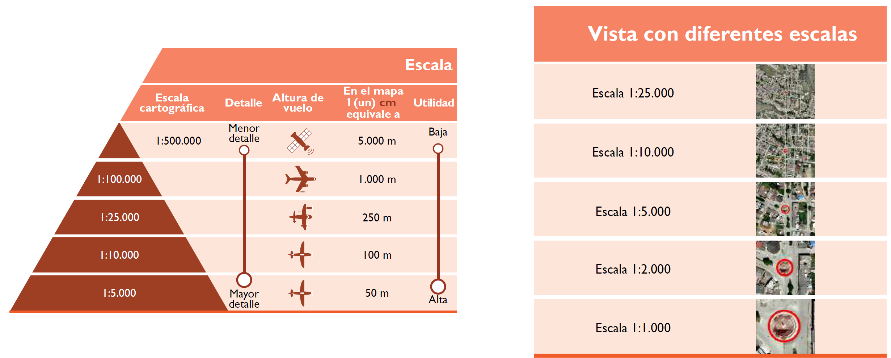
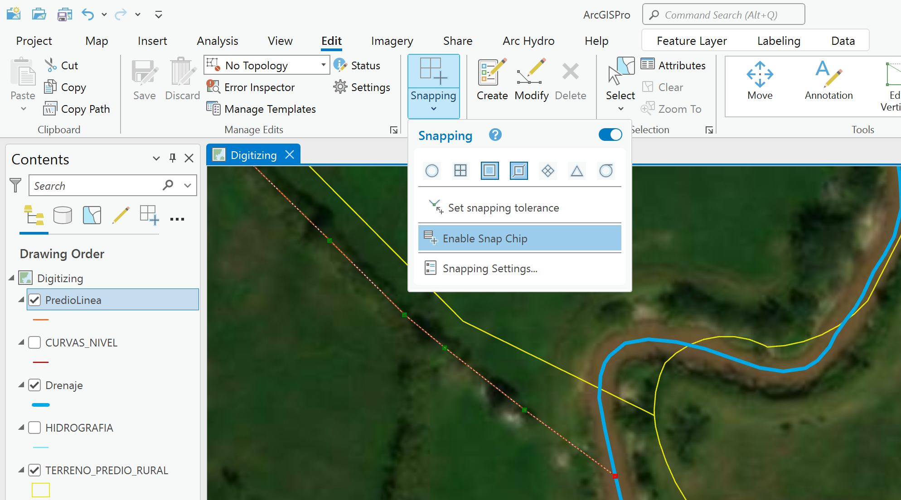
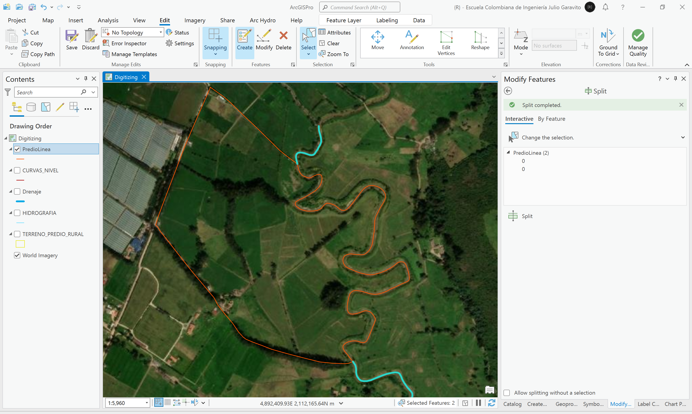
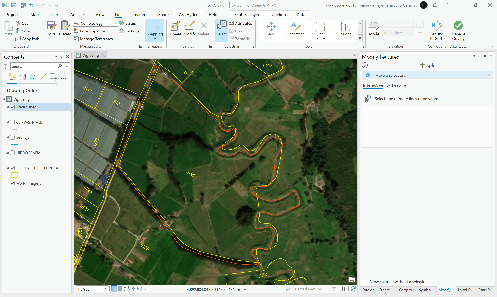

# Digitalización de vectores: drenajes, vías y predios
Keywords: `digitizing` `polyline` `polygon` `sinuosity` `euclidian-distance`

Conceptos de escala. Tomado como referencia los vectores de la red hidrográfica, la red vial y la base predial y utilizando como mapa base la imágen satelital mundial de ESRI o Google, realice la digitalización de un tramo de drenaje de al menos 1 kilómetro y luego digitalice las vías y predios próximos y/o que están ubicados lateralmente.

## Objetivos

* Entender los conceptos generales de escala en la digitalización de entidades y en la utilización de mapas base.
* Digitalizar entidades y calcular sus propiedades geométricas.
* Calcular propiedades geométricas derivadas, como la longitud euclidiana y el índice de sinuosidad.
* Analizar las diferencias entre la cartografía básica del IGAC y vectores digitalizados.

## Requerimientos

* [:notebook:Lectura](../../file/ref/cartilla_pot.pdf): Lineamientos para el uso de información geográfica en el desarrollo del componente rural de los Planes de Ordenamiento Territorial.
* [:mortar_board:Actividad](../TopoBasic/Readme.md): Conceptos básicos de topografía, fotogrametría y fotointerpretación.
* [:mortar_board:Actividad](../POTLayer/Readme.md): Inventario de información geo-espacial recopilada del POT y diccionario de datos.
* [:toolbox:Herramienta](https://www.esri.com/en-us/arcgis/products/arcgis-pro/overview): ESRI ArcGIS Pro 3.3.1 o superior.
* [:toolbox:Herramienta](https://qgis.org/): QGIS 3.38 o superior.

## 1. Conceptos generales de escala

Tomado o adaptado de: Lineamientos para el uso de información geográfica en el desarrollo del componente rural de los Planes de Ordenamiento Territorial, IGAC.[^1]

La escala (entendida como la relación existente entre la distancia en el terreno y su equivalente en el mapa) de la cartografía básica es un aspecto de gran relevancia a la hora de planear el ordenamiento del territorio, pues dependiendo de esta, es posible apreciar mayor o menor cantidad de elementos del paisaje. Así, a mayor escala, se aprecian más elementos y con mayor detalle, mientras que, a menor escala, la información será más general y con menor detalle.

La escala de la cartografía determina la forma y el tamaño en que se ven los elementos del paisaje. Un ejemplo claro de ello es la forma como se ven las construcciones. Cuando estas se representan en una escala general, se ven como puntos, y al aumentar la escala, las mismas aparecen como polígonos, siendo más grandes cuanto mayor es la escala.

 Tomado de: <a href="../../ref/cartilla_pot.pdf">Concepto de escala. IGAC, 2019</a>  

La cartografía básica de Colombia creada por el [Instituto Geográfico Agustín Codazzi - IGAC](https://www.igac.gov.co/), puede ser descargada desde www.colombiaenmapas.com a nivel general en escalas 1:500000 (Precisión planimétrica de 1000m y altimétrica de 100m), 1:100000 (Precisión planimétrica de 200m y altimétrica de 50m) y por planchas a escala 1:25000 (Precisión planimétrica de 50m y altimétrica de 25m). 

Es de aclarar que, en el ámbito municipal, para el ejercicio del ordenamiento territorial, tradicionalmente se ha privilegiado el uso de cartografía a escala 1:25.000 para el sector rural y 1:5.000 o 1:2.000 en el sector urbano. Sin embargo, el IGAC recomienda que para la formulación y/o procesos de revisión y ajuste de los POT, la escala de la cartografía se defina en función de los procesos y dinámicas de cada territorio. En este sentido, se propone que para el suelo rural se contemplen factores como el área municipal, la pendiente, el tamaño de los predios, la densidad de la red hidrográfica y de la infraestructura vial, entre otros.

En la siguiente tabla se relaciona la escala ideal de trabajo recomendada a escala rural de acuerdo con las características mencionadas.

| Escala    | Pendientes           | Densidad de la red hidrográfica | Densidad de la infra- estructura vial | Tamaño predios                    |
|-----------|----------------------|------------------------------------|------------------------------------------|-----------------------------------|
| 1:100.000 | Moderada: hasta 12%  | Baja: <3 km/km²                    | Baja: <3 km/km²                          | Latifundio: >200 Ha               |
| 1:25.000  | Montañosa: >12%      | Alta: >3 km/km²                    | Alta: >3 km/km²                          | Mediano a pequeño: De 10 a 200 Ha |
| 1:10.000  | Montañosa: >12%      | Alta: >3 km/km²                    | Alta: >3 km/km²                          | Minifundio: De 3 a 10 Ha          |
| 1:5.000   | Montañosa: >12%      | Alta: >3 km/km²                    | Alta: >3 km/km²                          | Microfundio: <3 Ha                |

Con base en la información de la tabla anterior, se recomienda que para el suelo rural de aquellos municipios localizados en las zonas montañosas, se utilice cartografía básica a escala 1:10.000 y para los ubicados sobre los valles interandinos y las costas Caribe y Pacífica, cartografía básica a escala 1:25.000. Por otro lado, para la mayoría de municipios del oriente del país, en donde existen características homogéneas de cobertura boscosa y territorios colectivos, se considera suficiente la cartografía a escala 1:100.000. 

Asimismo, teniendo en cuenta los factores mencionados en la anterior, se recomienda que para las áreas urbanas, de expansión urbana y centros poblados, se utilice información geográfica con escalas entre 1:1.000 y 1:5.000. Adicionalmente, para definir la escala, se deben tener en cuenta las dinámicas de urbanización y las relaciones del sistema de asentamientos, lo que permitirá un análisis detallado de la distribución de los procesos físicos, ambientales, y sociales que allí se presentan. Además, se debe contemplar la información catastral, de gran importancia y utilidad para el conocimiento de las estructuras y las dinámicas urbanas.

## 2. Digitalización de drenajes

1. Abra el proyecto de ArcGIS Pro, creado previamente y desde el menú _Insert_ cree un nuevo mapa _New Map_, renombre como _Digitizing_, establezca el CRS 9377. Agregue al mapa la capa de drenajes disponible en la ruta `\R.SIGE\file\data\POT\Anexo_Acuerdo_012_2013\ shp\HIDROGRAFIA.shp`, ajuste la simbología y rotule a partir del campo `NOMBRE`.  

2. Desde el menú _Map_, cambie el mapa base por _Imagery_ y acérquese al mapa a escala 1:5000 en la coordenada: 4892883.22E, 2111592.87N. Como puede observar, la digitalización existente del Río Neusa, no representa con precisión el eje del cauce.

> Para la localización de la coordenada indicada puede dar clic derecho sobre cualquier zona del mapa, y utilizar la opción _Go To XY_.

> Si bien, según la recomendación del IGAC es utilizar información a escala 1:5000 para zonas rurales con características similares a las mostradas en la imagen, para este ejercicio, realizaremos la digitalización a escala 1:1000 del tramo comprendido entre la descarga del Río Susagua al Río Neusa, hasta la descarga en el Río Bogotá.

3. Para la creación de la nueva capa de drenajes, en el _Catalog Pane_ localizado en la parte derecha de la ventana de ArcGIS Pro, de clic derecho sobre la carpeta `\R.SIGE\file\shp\` y seleccione la opción _New / New Shapefile_. Nombre la nueva capa como _Drenaje.shp_.

Para esta nueva capa, defina geometría tipo Poli-línea, sin propiedades de medición (M), sin valores 3D (Z) y establezca el CRS 9377. Agregue la capa al mapa.

Abra la tabla de atributos y cree los siguientes campos:

| Campo       | Descripción                                                                                                                                                                             |    Tipo    | Propiedad ArcGIS Pro  | 
|:------------|:----------------------------------------------------------------------------------------------------------------------------------------------------------------------------------------|:----------:|:-------------------------| 
| DrenajeID   | Código de identificación del drenaje.                                                                                                                                                   |    Long    | N/A                      |
| DrenajeNom  | Nombre del drenaje principal.                                                                                                                                                           | Text (100) | N/A                      |
| DrenajeSub  | Nombre del subtramo de drenaje.                                                                                                                                                         | Text (100) | N/A                      |
| CotaInicio  | Cota punto inicial en metros.                                                                                                                                                           |   Double   | N/A                      |
| CotaFin     | Cota punto final en metros.                                                                                                                                                             |   Double   | N/A                      |
| Pendiente   | Pendiente media del cauce, calculada a partir de la diferencia de cotas entre la longitud.                                                                                              |   Double   | N/A                      |
| IndSinuoso  | [Índice de sinuosidad](https://es.wikipedia.org/wiki/Sinuosidad_de_un_r%C3%ADo), calculada a partir de la longitud del rio entre la longitud euclidiana entre el punto inicial y final. |   Double   | N/A                      |
| LGm         | Longitud geodésica en metros                                                                                                                                                            |   Double   | Length (geodesic)        |

4. Para la digitalización, acérquese a escala 1:1000 y en el menú _Edit_ de clic en _Create_. Para la digitalización, puede desactivar la capa _HIDROGRAFIA_. En la parte derecha de su ventana, aparecerá el panel de creación de entidades, de clic en la capa _Drenaje_ y seleccione la primera opción, correspondiente a _Line_. Digitalice el eje del drenaje tomando como referencia el espejo de agua que en la imagen aparece en color cafe claro. Agregue tantos nodos como sea posible para representar correctamente las curvas del drenaje.

> Para desplazarse por el mapa, utilice clic sostenido en la rueda de su mouse.  
> Para deshacer el último punto ingresado, oprima <kbd>Ctrl</kbd> + <kbd>Z</kbd>. 

Para terminar la edición, de clic derecho y seleccione la opción _Finish_ u oprima la tecla <kbd>F2</kbd>. Podrá observar que ahora, en la tabla de atributos de la capa, aparece un nuevo registro. Ingrese el código del drenaje, nombre del cauce principal y nombre del tramo. Compare con el tramo utilizado en la formulación del POT, podrá observar que existen diferencias importantes.

> Se recomienda digitalizar los drenajes en el sentido del flujo.

5. Para estimar la cota inicial y final de este tramo, utilizaremos como referencia el mapa topográfico de ESRI que puede ser agregado al mapa desde el menú _Map / Basemap_ y las curvas de nivel utilizadas en el diagnóstico del POT disponibles en `\file\data\POT\Anexo_Acuerdo_012_2013\gdb\25899.gdb\CARTOGRAFIA\CURVAS_NIVEL`. Como observa en la imagen, la información topográfica no es lo suficientemente detallada para obtener valores precisos, adicionalmente, la información topográfica de estas fuentes, no representa el fondo de los ríos. Para este ejemplo, definiremos 2580 m.s.n.m. como cota de inicio y fin debido a que es un cauce que se encuentra en zona de llanura. Para el cálculo de pendiente, se utiliza la diferencia de cotas (Δy = inicio - fin) entre la longitud del tramo (Δx), debido a que Δy es cero, definiremos una pendiente de 0.001 m/m.

6. Para calcular el índice de sinuosidad, es necesario conocer la longitud del río y la longitud de la longitud euclidiana entre el punto inicial y final del río. En la tabla de atributos, agregue los siguientes campos complementarios.

| Campo    | Descripción                                                 |  Tipo   | Propiedad ArcGIS Pro  | 
|:---------|:------------------------------------------------------------|:-------:|:-------------------------| 
| CxInicio | Coordenada x o este del punto inicial del tramo de río.     | Double  | Line start x-coordinate  |
| CyInicio | Coordenada y o norte del punto inicial del tramo de río.    | Double  | Line start y-coordinate  |
| CxFin    | Coordenada x o este del punto de final del tramo de río.    | Double  | Line end x-coordinate    |
| CyFin    | Coordenada y o norte del punto de final del tramo de río.   | Double  | Line end y-coordinate    |
| LEuclm   | Longitud euclidiana en metros, usando teorema de pitágoras. | Double  | N/A                      |

7. Desde la tabla de atributos y utilizando el calculador de geometría, calcule las coordenadas y la longitud geodésica `LGm` del tramo digitalizado.

8. Utilizando el calculador de campo o _Calculate Field_ sobre `LEuclm`, calcule la longitud euclidiana utilizando la siguiente expresión en Python, correspondiente al Teorema de Pitágoras:

`LEuclm = ((!CxInicio!-!CxFin!)**2+(!CyInicio!-!CyFin!)**2)**0.5`

Podrá observar que la longitud euclidiana es menor que la longitud total del cauce.

9. Para el cálculo del índice de sinuosidad en el campo `IndSinuoso`, divida la longitud del río `LGm` entre la longitud euclidiana `LEuclm`. Para este ejemplo, el valor obtenido es 2.18.

`IndSinuoso =  !LGm!/!LEuclm!`

La interpretación usual del índice de sinuosidad (IS) puede ser establecida a partir de las siguientes clases:

| Clase | Rango           | Descripción                          |
|-------|-----------------|--------------------------------------|
| 1     | IS < 1.05       | Casi rectilíneo (Almost straight) |
| 2     | 1.05 ≤ IS <1.25 | Ligeramente sinuoso (Winding)     |
| 3     | 1.25 ≤ IS <1.50 | Altamente sinuoso (Twisty)        |
| 4     | 1.50 ≤ IS       | Meandriforme (Meandering)         |

De acuerdo al valor obtenido y a los rangos definidos, el tramo digitalizado del Río Neusa, corresponde a un cauce meandriforme.

## 3. Digitalización de predios

1. Agregue al mapa la capa de drenajes disponible en la ruta `\R.SIGE\file\data\POT\Anexo_Acuerdo_012_2013\gdb\25899.gdb\RURAL\TERRENO_PREDIO_RURAL`, ajuste la simbología dejando solo el contorno, filtre solo los predios de la vereda 2589900000004 y rotule utilizando solo los 4 últimos caracteres del campo _codigo_. Como observa, alrededor del tramo de drenaje digitalizado, existen algunos predios cuyo límite es el río, también este corresponde a un límite veredal y los predios no se adaptan a la verdadera forma del cauce. 

Rótulo Arcade: `Right($feature.codigo, 4)`

> Debido a que digitalizaremos los predios utilizando como referencia el límite definido por los drenajes, crearemos primero una capa de líneas de contorno de predio y luego las convertiremos a polígonos.

2. Cree una nueva capa shapefile en la ruta `\R.SIGE\file\shp\` con el nombre _PredioLinea.shp_, establezca geometría de poli-línea. 

> Debido a que esta capa es temporal y solo se utiliza para delimitar bordes de predios, no es necesaria la inclusión de atributos adicionales.

Para esta nueva capa, defina geometría tipo Poli-línea, sin propiedades de medición (M), sin valores 3D (Z) y establezca el CRS 9377. Agregue la capa al mapa.

3. Acérquese a escala 1:1000 en la coordenada 4892118.05E y 2111702.02N, que corresponde a una de las esquinas del predio 0195, desde el menu _Edit_ y utilizando la herramienta _Create_, digitalice el borde predio hasta llegar al río previamente digitalizado y tome como límite el costado de la vía correspondiente al predio.  

Para completar la digitalización del primer tramo hasta el río, active en _Edit_ las opciones de encajado por vértice y por lado. Para finalizar la edición oprima la tecla <kbd>F2</kbd>.

Ahora, vuelva a la esquina desde donde inicio la digitalización de este primer lado, repita el procedimiento por el lado contrario hasta el río, tome como referencia, la línea central de la vía terciaria que divide los predios 0195 y 0125, y la vegetación.

4. Apague la capa de predios rurales que utilizamos como referencia para la digitalización, seleccione la línea del eje del río digitalizado y en el menú _Edit_ seleccione _Copy_, luego en el mismo menú despliegue las opciones disponibles en _Paste / Paste Special_ y pegue el drenaje en la capa _PredioLinea_. No es necesario llevar los atributos. Una vez pegado, apague la capa _Drenaje_.

Podra observar que todo el tramo del río, está en la capa de predio y que es necesario recortar los extremos.

5. Para recortar los extremos del tramo reciclado del río que hemos utilizado como divisoria, desde el menú _Edit_, utilice la opción _Divide / Split_. Para que el fraccionamiento sea correcto, es necesario desactivar el _Snapping_ de lado y dejar únicamente el de vértice. Una vez segmentado, seleccione los extremos que no pertenecen al predio y elimínelos oprimiendo la tecla <kbd>Delete</kbd> o desde el menú _Edit / Delete_.

Como observa, ya tenemos completamente digitalizado uno de los predios que se encuentran en la zona de análisis y comparando con la capa oficial predial, son evidentes las diferencias entre estos dos vectores.

6. Ahora, necesitamos convertir el predio en un polígono, para ello, en el panel derecho de _Geoprocessing_, utilice la herramienta _Data Management Tools / Feature to Polygon_. Guarde la capa resultante como `\R.SIGE\file\shp\Predio.shp` definiendo en _Environments_ el CRS 9377. 

>  :lady_beetle:Sí la digitalización del contorno fue correcta y las poli-líneas se empalman, se generará correctamente el polígono, de lo contrario no se podrá realizar la conversión. En caso de que no haya sido generado el polígono, verifique los extremos de los tramos de poli-línea y asegúrese de que se empalman entre sí.

7. Abra la tabla de atributos y agregue los siguientes campos:

| Campo     | Descripción                                                                               |   Tipo   | Propiedad ArcGIS Pro     | 
|:----------|:------------------------------------------------------------------------------------------|:--------:|:----------------------------| 
| CodigoAnt | Código catastral de 17 dígitos y sin código de mejora o propiedad horizontal (3 dígitos). | text(17) | N/A                         |
| PGm       | Perímetro geodésico en metros.                                                            |  Double  | Perimeter length (geodesic) |
| AGm       | Área geodésica en m².                                                                     |  Double  | Area (geodesic)             |

> Tenga en cuenta que los códigos catastrales en Colombia cambiaron de 20 a 30 dígitos. (Resolución 070 de 2011 - IGAC Colombia. Estructura del código catastral).

Incluya el código predial y utilizado el calculador de geometría, obtenga el área y perímetro. Compare con los valores contenidos en la capa de la base predial del IGAC. Como observa, el área del predio digitalizado es de 440885.3 m² y la del predio de catastro es 432943.85 m², con una diferencia de +7941.45 m². 

> :pencil2:Para su caso de estudio, repita el procedimiento de digitalización de predios hasta obtener todos los predios que se encuentran al rededor del tramo de río digitalizado.

## 4. Digitalización de vías

El proceso de digitalización de ejes viales, se realiza a partir de las medianeras entre manzanas urbanas o entre predios. Catastralmente, los corredores viales no son considerados como una unidad predial.

1. Agregue al mapa la capa de vías rurales por orden disponible en la ruta `\R.SIGE\file\data\POT\Anexo_Acuerdo_012_2013\ shp\ORDEN_VIAL.shp`, ajuste la simbología y rotule a partir del campo _ORDEN_VIAL_. Acérquese a escala 1:1000 en la coordenada 4893271.14E y 2110830.90N. Como puede observar, la red vial no se encuentra correctamente digitalizada y está incompleta.

2. Cree una nueva capa shapefile en la ruta `\R.SIGE\file\shp\` con el nombre _Via.shp_, establezca geometría de poli-línea y CRS 9377. Al igual que en las capas anteriores, no incluya las propiedades M y Z.

Agregue los siguientes atributos:

| Campo     | Descripción                                |    Tipo    | Propiedad ArcGIS Pro | 
|:----------|:-------------------------------------------|:----------:|:------------------------| 
| ViaID     | Código de la vía.                          |    Long    | N/A                     |
| Nomenclat | Nomenclatura o nombre vial.                | Text (200) | N/A                     |
| Tipo      | Tipo de vía (sin pavimentar, pavimentada). | Text (100) | N/A                     |
| Estado    | Estado de la vía (texto descriptivo).      | Text (200) | N/A                     |
| OrdenVial | Orden o jerarquía vial.                    | Text (100) | N/A                     |
| Ancho     | Ancho promedio del tramo.                  |   Double   | N/A                     |
| LGm       | Longitud geodésica en m.                   |   Double   | Length (geodesic)       |

3. Realice a escala 1:1000, la digitalización del tramo de vía que atraviesa el río digitalizado hasta el extremo de la vía a la cual conecta. Utilice las mismas herramientas que utilizamos para la digitalización del tramo de río. Luego de la digitalización, podrá observar que existen diferencias entre el tramo de vía utilizado en la formulación del POT, y la vía digitalizada a escala 1:1000.

Para la medición del ancho promedio, utilice la herramienta _Map / Measure_.

> :pencil2:Para su caso de estudio, repita el procedimiento de digitalización de vías hasta obtener todos los alineamientos que bordean, que están entre los predios digitalizados o que cruzan el tramo de cauce en estudio.

## 5. Análisis usando software libre - QGIS

Para el desarrollo de las actividades desarrolladas en esta clase, se pueden utilizar en QGIS las siguientes herramientas o geo-procesos:

| Proceso                      | Procedimiento                                                                                                                                                                        |
|:-----------------------------|:-------------------------------------------------------------------------------------------------------------------------------------------------------------------------------------|
| Simbología                   | Modificable desde las propiedades de la capa en la pestaña _Symbology_.                                                                                                              |
| Rotulado                     | Modificable desde las propiedades de la capa en la pestaña _Labels_.                                                                                                                 |
| Agregar campo                | Modificable desde las propiedades de la capa en la pestaña _Fields_ o desde la tabla de atributos.                                                                                   |
| Crear una capa               | Desde el panel lateral _Browser_, seleccione una carpeta destino y dando clic derecho, seleccione _New / Shapefile_. Defina la geometría, CRS y atributos que contendrá la capa.     |
| Digitalización               | Activar modo de edición de capa o _Toggle Editing_, luego desde la barra _Digitizing Toolbar_ trace los vectores o dibuje los elementos requeridos a través del botón _Add Feature_. |
| Convertir líneas a polígonos | Herramienta disponible en _Processing Toolbox / Vector Geometry / Polygonize_.                                                                                                       |

Ejemplo rótulo en QGIS: `'A(ha): ' ||  round("AGha", 2) || '\n' || 'P (m): ' ||  round("PGm", 2) `

## Elementos requeridos en diccionario de datos

Agregue a la tabla resúmen generada en la actividad [Inventario de información geo-espacial recopilada del POT y diccionario de datos](../POTLayer/Readme.md), las capas generadas en esta actividad que se encuentran listadas a continuación:

| Nombre          | Descripción                                                                                    | Geometría     | Registros | 
|-----------------|------------------------------------------------------------------------------------------------|---------------|-----------| 
| Drenaje.shp     | Capa de drenajes digitalizados a escala 1:1000.                                                | Poli-línea 2D | 1         | 
| PredioLinea.shp | Capa de delimitación perimetral de predios digitalizados a escala 1:1000.                      | Poli-línea 2D | 3         | 
| Predio.shp      | Capa de predios digitalizados a escala 1:1000 y generados a partir de la capa PredioLinea.shp. | Polígono 2D   | 1         | 
| Via.shp         | Capa de vías digitalizados a escala 1:1000.                                                    | Poli-línea 2D | 1         | 

> :bulb:Para funcionarios que se encuentran ensamblando el SIG de su municipio, se recomienda incluir y documentar estas capas en el Diccionario de Datos.

## Actividades de proyecto :triangular_ruler:

En la siguiente tabla se listan las actividades que deben ser desarrolladas y documentadas por cada grupo de proyecto en un único archivo de Adobe Acrobat .pdf. El documento debe incluir portada (indicando el caso de estudio, número de avance, nombre del módulo, fecha de presentación, nombres completos de los integrantes), numeración de páginas, tabla de contenido, lista de tablas, lista de ilustraciones, introducción, objetivo general, capítulos por cada ítem solicitado, conclusiones y referencias bibliográficas.

| Actividad     | Alcance                                                                                                                                                                                                                                                                                                                                                                                                                                                                 |
|:--------------|:------------------------------------------------------------------------------------------------------------------------------------------------------------------------------------------------------------------------------------------------------------------------------------------------------------------------------------------------------------------------------------------------------------------------------------------------------------------------|
| Avance **P1** | Identifique un tramo de río en el cual existan diferencias visibles entre la imagen satelital y los vectores utilizados en el POT. Realice la digitalización a escala 1:1000 de al menos 1 kilómetro del tramo de río identificado, luego digitalice los predios que se encuentran al rededor o sobre el río, digitalice las vías internas, perimetrales y/o que cruzan el rio. Compare con los vectores utilizados en el POT y explique las diferencias encontradas.   | 
| Avance **P1** | Descargue de www.colombiaenmapas.gov.co/ y en formato de base de datos (Geodatabase o GDB), la cartografía general a escala 1:500000, 1:100000 y 1:25000, cargue los drenajes, vías y predios al mapa y compárelos con los utilizados en el diagnóstico y formulación del POT. Explique las diferencias encontradas.                                                                                                                                                    | 
| Avance **P1** | :compass:Mapa digital impreso _P2-8: Comparación vectores originales POT vs. digitalizados_ Incluir rótulos con detalle de áreas y longitudes. Embebido dentro del informe final como una imágen y referenciados como anexo.                                                                                                                                                                                                                                      | 
| Avance **P1** | :compass:Mapa digital impreso _P2-9: Comparación vectores originales POT vs. cartografía básica actual IGAC_ Incluir rótulos con detalle de áreas y longitudes. Embebido dentro del informe final como una imágen y referenciados como anexo.                                                                                                                                                                                                                     | 
| Avance **P1** | En una tabla y al final del informe de avance de esta entrega, indique el detalle de las sub-actividades realizadas por cada integrante de su grupo. Para actividades que no requieren del desarrollo de elementos de avance, indicar si realizo la lectura de la guía de clase y las lecturas indicadas al inicio en los requerimientos. Utilice las siguientes columnas: Nombre del integrante, Actividades realizadas, Tiempo dedicado en horas.                     | 

> No es necesario presentar un documento de avance independiente, todos los avances de proyecto de este módulo se integran en un único documento.
> 
> En el informe único, incluya un numeral para esta actividad y sub-numerales para el desarrollo de las diferentes sub-actividades, siguiendo en el mismo orden de desarrollo presentado en esta actividad.

## Referencias

* https://es.wikipedia.org/wiki/Sinuosidad_de_un_r%C3%ADo
* https://en.wikipedia.org/wiki/Sinuosity

## Control de versiones

| Versión     | Descripción                                                                                                      | Autor                                      | Horas |
|-------------|:-----------------------------------------------------------------------------------------------------------------|--------------------------------------------|:-----:|
| 2024.03.14  | Versión inicial con alcance de la actividad                                                                      | [rcfdtools](https://github.com/rcfdtools)  |   4   |
| 2024.07.16  | Investigación y documentación para caso de estudio general. Conceptos de escala, digitalización de tramo de río. | [rcfdtools](https://github.com/rcfdtools)  |   6   |
| 2024.07.17  | Digitalización de predio, vía y documentación complementaria.                                                    | [rcfdtools](https://github.com/rcfdtools)  |   4   |

_R.SIGE es de uso libre para fines académicos, conoce nuestra licencia, cláusulas, condiciones de uso y como referenciar los contenidos publicados en este repositorio, dando [clic aquí](LICENSE.md)._

_¡Encontraste útil este repositorio!, apoya su difusión marcando este repositorio con una ⭐ o síguenos dando clic en el botón Follow de [rcfdtools](https://github.com/rcfdtools) en GitHub._

| [:arrow_backward: Anterior](../RoadSummary/Readme.md) | [:house: Inicio](../../README.md) | [:beginner: Ayuda / Colabora](https://github.com/rcfdtools/R.SIGE/discussions/99999) | [Siguiente :arrow_forward:]() |
|-------------------------------------------------------|-----------------------------------|--------------------------------------------------------------------------------------|-------------------------------|

[^1]: Lineamientos para el uso de información geográfica en el desarrollo del componente rural de los Planes de Ordenamiento Territorial