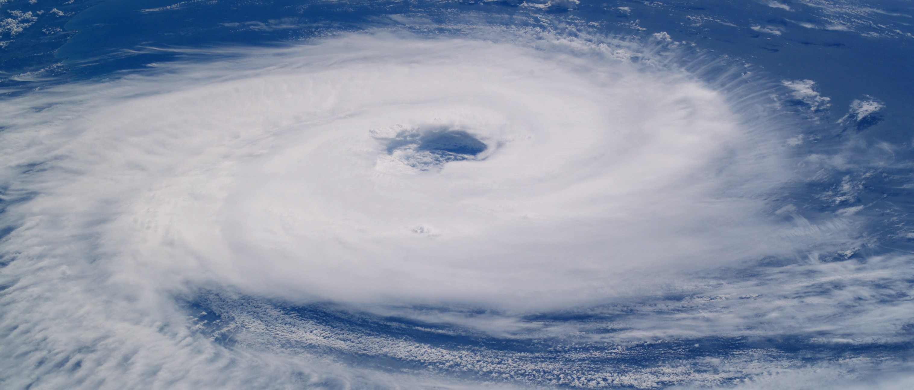
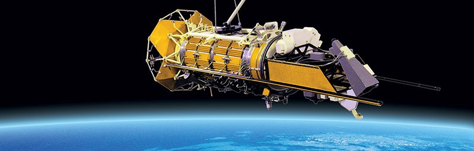
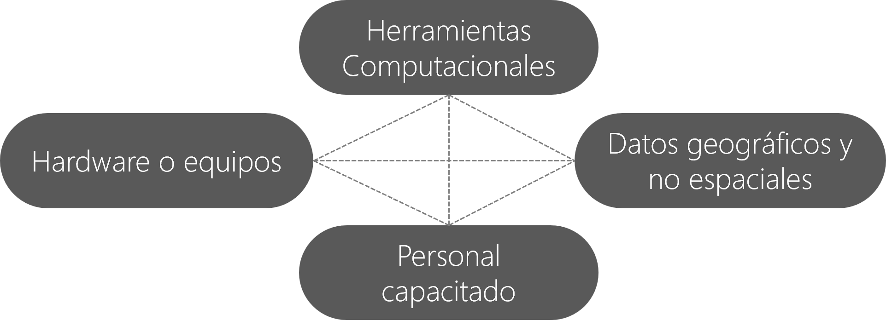
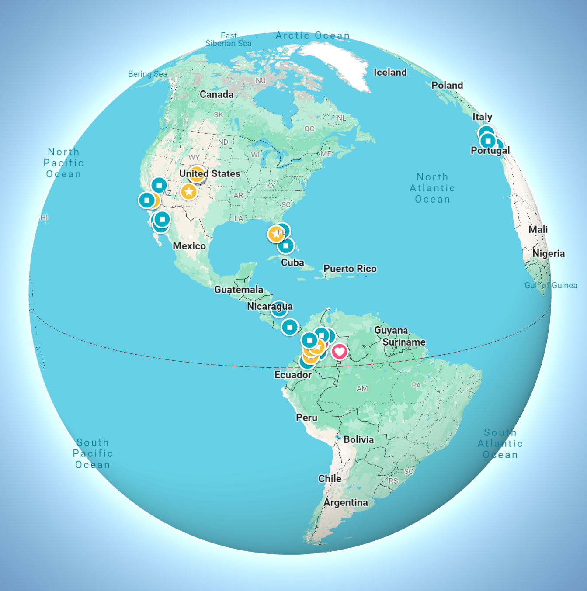
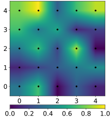

# Conceptos básicos de SIG 
Keywords: `GIS-Basics` `GIS-Utility`

Los Sistemas de Información Geográficos (SIG o GIS), son un conjunto de equipos, herramientas computacionales y personal capacitado para el manejo de datos geográficos. Hoy en día se han convertido en herramientas indispensables para el análisis y soporte de toma de decisiones en la solución de problemas complejos, debido a que el manejo de la información se realiza de forma espacial y dinámica, permitiendo representar de forma esquemática muy próxima a la realidad el ambiente natural y el entorno construido. Igualmente, los SIG permiten interactuar eficientemente con otro tipo de información no geográfica y su incorporación para diferentes aplicaciones.

 Tomado de: <a href="https://ecijg.maps.arcgis.com/apps/mapviewer/index.html?layers=ce76f13d1e9d46c5a229d00c37bbb8a3">https://ecijg.maps.arcgis.com</a>  

La gran diferencia que existe entre un aplicativo SIG y otros paquetes de software gráfico radica en que el aplicativo SIG es esencialmente una base de datos espacial, lo que otorga una cualidad incomparable en el desarrollo de análisis enfocados a resolver problemas reales que afectan el espacio geográfico estudiado.   

## Objetivos

* 

## Requerimientos

* [Conceptos básicos de topografía, fotogrametría y fotointerpretación](../TopoBasic/Readme.md)
* Lectura - [¿Qué son los SIG](https://www.esri.com/es-es/what-is-gis/overview)

## Historia de los SIG como ciencia[^1]

En las últimas cinco décadas, **_los SIG han pasado de ser un concepto a convertirse en una ciencia_**. La espectacular evolución de los SIG de una herramienta rudimentaria a una plataforma moderna y potente para comprender y planear nuestro mundo está marcada por varios hitos clave.

El campo de los sistemas de información geográfica (GIS) se inició en los años sesenta, cuando surgieron los ordenadores y los primeros conceptos de geografía cuantitativa y computacional. Los primeros trabajos de SIG incluían investigaciones importantes de la comunidad académica. Más tarde, el National Center for Geographic Information and Analysis de los Estados Unidos de América, dirigido por Michael Goodchild, formalizó la investigación sobre temas clave relacionados con la ciencia de información geográfica, como el análisis y la visualización espaciales. Este trabajo impulsó una revolución cuantitativa en el mundo de la ciencia geográfica y sentó las bases para los SIG. 

Línea de tiempo

|  Año  | Evento                                                                                                                                                               |
|:-----:|:---------------------------------------------------------------------------------------------------------------------------------------------------------------------|
| 1960  | Inicio de los SIG en investigación científica                                                                                                                        |
| 1963  | Primer SIG implementando el Sistema Canadiense de Información Geográfica utilizado para inventario forestal                                                          |
| 1965  | Laboratorio SIG Universidad de Harvard y creación del software [SYMAP](https://en.wikipedia.org/wiki/Harvard_Laboratory_for_Computer_Graphics_and_Spatial_Analysis)  |
| 1969  | Fundación de Environmental Systems Research Institute, Inc. ([Esri](https://www.esri.com/en-us/what-is-gis/history-of-gis))                                          |
| 1982  | SIG se Vuelve comercial y Esri crea [ARC/INFO](https://en.wikipedia.org/wiki/ArcInfo)                                                                                |
|  Hoy  | Utilizados en la vida diaria y como herramienta tecnológica se utilizan en múltiples campos de la ingeniería y arquitectura.                                         |

## Ciencias y tecnologías relacionadas[^2]

### Estudio de la tierra sólida

 Tomado de: <a href="https://commons.wikimedia.org/wiki/File:Gunung_Bromo.jpg">https://commons.wikimedia.org</a>  

| Ciencia                                                                 | Alcance                                                                                                                                                                                                                                                                                      |
|:------------------------------------------------------------------------|:---------------------------------------------------------------------------------------------------------------------------------------------------------------------------------------------------------------------------------------------------------------------------------------------|
| [Geodesía](https://es.wikipedia.org/wiki/Geodesia)                      | Estudia la forma de la Tierra.                                                                                                                                                                                                                                                               |
| [Geofísica](https://es.wikipedia.org/wiki/Geof%C3%ADsica)               | Estudio del planeta desde el punto de vista de la física. Se analizan y modelan los fenómenos geológicos, con el fin de lograr una descripción matemática y geométrica de los mismos. Incluye disciplinas como la geodinámica o la sismología.                                               |
| [Geología](https://es.wikipedia.org/wiki/Geolog%C3%ADa)                 | Estudia la dinámica interna y externa de la tierra, lo referente a las rocas y su estructura, los yacimientos minerales, la evolución del planeta, fenómenos como la tectónica de placas, las orogenias, terremotos, vulcanismo, avalanchas, inundaciones, etc.                              |
| [Geografía](https://es.wikipedia.org/wiki/Geograf%C3%ADa)               | Estudia la relación e interacción de la superficie terrestre con el hombre.                                                                                                                                                                                                                  |
| [Geoquímica](https://es.wikipedia.org/wiki/Geoqu%C3%ADmica)             | Estudia la abundancia absoluta y relativa, distribución y migración de los elementos que conforman la Tierra.                                                                                                                                                                                |
| [Paleontología](https://es.wikipedia.org/wiki/Paleontolog%C3%ADa)       | Estudia e interpreta el pasado de la vida sobre la Tierra a través de los fósiles. Describe la evolución de la vida en nuestro planeta. Los datos paleontológicos proporcionan información cronoestratigráfica, paleogeográfica, paleoclimatológica, eventos catastróficos del pasado, etc.  |
| [Ciencias del suelo](https://es.wikipedia.org/wiki/Ciencia_del_suelo)   | Estudia el suelo como recurso natural en la superficie de la Tierra incluyendo su formación (pedogénesis), su clasificación y cartografía, sus características, su composición química, su biología, su fertilidad y todo lo relacionado con el uso y a la gestión del suelo.                |

### Estudio de la atmósfera, los océanos y los seres vivos

 Tomado de: <a href="https://commons.wikimedia.org/wiki/File:Hurrican_Catarina_from_the_ISS_on_March_26_2004.jpg">https://commons.wikimedia.org</a>  

| Ciencia                                                                        | Alcance                                                                                                                                                                                                                                                                                                               |
|:-------------------------------------------------------------------------------|:----------------------------------------------------------------------------------------------------------------------------------------------------------------------------------------------------------------------------------------------------------------------------------------------------------------------|
| [Climatología](https://es.wikipedia.org/wiki/Climatolog%C3%ADa)                | Se ocupa del estudio de los fenómenos meteorológicos y sus variaciones a lo largo del tiempo cronológico.                                                                                                                                                                                                             |
| [Hidrología](https://es.wikipedia.org/wiki/Hidrolog%C3%ADa)                    | Estudia el agua, su ocurrencia, distribución, circulación, y propiedades físicas, químicas y mecánicas en los océanos, atmósfera y superficie terrestre. Esto incluye las precipitaciones, la escorrentía, la humedad del suelo, la evapotranspiración y el equilibrio de las masas glaciares.                        |
| [Meteorología](https://es.wikipedia.org/wiki/Meteorolog%C3%ADa)                | Estudia el estado del tiempo, el medio atmosférico, los fenómenos meteorológicos y las leyes que los rigen con apoyo de disciplinas auxiliares como la física de la atmósfera y la química de la atmósfera.                                                                                                           |
| [Oceanografía u oceanología](https://es.wikipedia.org/wiki/Oceanograf%C3%ADa)  | Estudia los mares, océanos y todo lo que se relaciona con ellos, es decir, la estructura, composición y dinámica de dichos cuerpos de agua, incluyendo desde los procesos físicos, como las corrientes y las mareas, hasta los geológicos, como la sedimentación o la expansión del fondo oceánico, o los biológicos  |
| [Biogeografía](https://es.wikipedia.org/wiki/Biogeograf%C3%ADa)                | Estudia la distribución de los seres vivos sobre la Tierra.                                                                                                                                                                                                                                                           |

### Tecnologías relacionadas

 Tomado de: <a href="https://commons.wikimedia.org/wiki/File:Ocean-O.jpg">https://commons.wikimedia.org</a>  

| Ciencia                                                                                                                        | Alcance                                                                                                                                                                                                                                                                                                                                                                                                                                                                         |
|:-------------------------------------------------------------------------------------------------------------------------------|:--------------------------------------------------------------------------------------------------------------------------------------------------------------------------------------------------------------------------------------------------------------------------------------------------------------------------------------------------------------------------------------------------------------------------------------------------------------------------------|
| [Teledetección](https://es.wikipedia.org/wiki/Teledetecci%C3%B3n)                                                              | La teledetección, o detección remota, es la adquisición de información a pequeña o gran escala de un objeto o fenómeno, ya sea usando instrumentos de grabación o instrumentos de escaneo en tiempo real inalámbricos o que no están en contacto directo con el objeto (como por ejemplo aviones, satélites, astronave, boyas o barcos). En la práctica, la teledetección consiste en recoger información a través de diferentes dispositivos de un objeto concreto o un área.  |
| [Sistemas de posicionamiento global - GNSS](https://es.wikipedia.org/wiki/Sistema_global_de_navegaci%C3%B3n_por_sat%C3%A9lite) | Un sistema global de navegación por satélite (Global Navigation Satellite System, GNSS) es una constelación de satélites que transmite rangos de señales utilizados para el posicionamiento y localización en cualquier parte del globo terrestre, ya sea en tierra, mar o aire. Estos permiten determinar las coordenadas geográficas y la altitud de un punto dado como resultado de la recepción de señales provenientes de constelaciones de satélites artificiales de la Tierra para fines de navegación, transporte, geodésicos, hidrográficos, agrícolas, y otras actividades afines.                                                                                                                                                                                                                                                                                                                                                                                                                                                                                |
| [Sistemas de información geográfica - GIS](https://es.wikipedia.org/wiki/Sistema_de_informaci%C3%B3n_geogr%C3%A1fica)          | Un sistema de información geográfica (SIG), también habitualmente citado como GIS por las siglas de su nombre en inglés Geographical Information System, es un conjunto de herramientas que integra y relaciona diversos componentes que permiten la organización, almacenamiento, manipulación, análisis y modelización de grandes cantidades de datos procedentes del mundo real que están vinculados a una referencia espacial, facilitando la incorporación de aspectos sociales-culturales, económicos y ambientales que conducen a la toma de decisiones de una manera más eficaz.                                                                                                                                                                                                                                                                                                                                                                                                                                                                                |

## ¿Qué es un SIG?

Un SIG (GIS, en su acrónimo inglés Geographic Information System) es un sistema especializado en la captura, manejo y análisis de información geográfica geoespacial. Para su óptima implementación y operación, se requiere de la integración de los siguientes 4 elementos:

 Diagrama por rcfdtools  

 Modelo general de datos geográficos basado en un inventario de datos por capas Tomado de: <a href="https://flr2019.weebly.com/uploads/1/2/2/9/122916722/lulcc_tay_nguyen_uni._vietnam.pdf">https://flr2019.weebly.com</a>  

### Diferencia entre geografía e información geográfica

| Geografía                                                                                                                                                                                                                                                                                                                                                                                                                           | Información geográfica                                                                                                                                                                                                                                                                                                                 |
|-------------------------------------------------------------------------------------------------------------------------------------------------------------------------------------------------------------------------------------------------------------------------------------------------------------------------------------------------------------------------------------------------------------------------------------|----------------------------------------------------------------------------------------------------------------------------------------------------------------------------------------------------------------------------------------------------------------------------------------------------------------------------------------|
| 
 Tomado de: <a href="https://commons.wikimedia.org/wiki/File:Nasa_blue_marble.jpg">https://commons.wikimedia.org</a>  
Elementos que componen el ambiente natural: topografía, hidrografía, geología, suelos. Elementos que componen el ambiente construido: ciudades, edificaciones, vías, equipamientos. | 
 Tomado de: <a href="https://www.google.com/maps">https://www.google.com/maps</a>  
Abstracción o representación de la realidad geográfica (paisaje). Reflejan la geografía de un instante particular en el tiempo. |

> :bulb: Imagine por un instante que la semana anterior realizó un estudio hidráulico a partir del levantamiento topo-batimétrico de un tramo de río que contiene un meandro y que realizó la representación de esta información en un SIG. Una semana después, una lluvia extrema ocasionó una avenida torrencial y una avalancha que desplazo y corto el meandro en la zona levantada. Como observa, la geografía ha cambiado y el SIG creado ya no representa la condición actual del tramo de río en estudio. Para actualizar el sistema de información deberá realizar nuevamente el levantamiento y crear una nueva versión. 

## Ventajas y desafíos de los SIG[^3]

La operación de los sistemas de información geográfica afrontan desafíos importantes que deben ser considerados antes de su implementación.

| Ventaja / Desafío | Elemento                                  | Alcance                                                                                                                                                                                                                                                                                                               |
|:------------------|:------------------------------------------|:----------------------------------------------------------------------------------------------------------------------------------------------------------------------------------------------------------------------------------------------------------------------------------------------------------------------|
| **Ventaja**       | Análisis espacial                         | Los SIG permiten realizar análisis espaciales avanzados, lo que facilita la identificación de patrones, relaciones y tendencias geográficas. Esto ayuda en la toma de decisiones basadas en la ubicación y proporciona información valiosa para la planificación y el diseño de políticas.                            |
|                   | Integración de datos                      | Los SIG permiten integrar datos geo-espaciales con otros tipos de datos, como datos demográficos, económicos o ambientales. Esto proporciona una visión holística y enriquecida de los fenómenos, lo que facilita el análisis multidimensional y la comprensión de las interrelaciones entre diferentes variables.    |
|                   | Visualización efectiva                    | Los SIG ofrecen herramientas de visualización que permiten representar de manera clara y comprensible los datos geoespaciales en forma de mapas, gráficos y otras formas visuales. Esto facilita la comunicación de la información y mejora la comprensión de los resultados por parte de los usuarios.               |
|                   | Toma de decisiones basada en la ubicación | Los SIG ayudan a tomar decisiones informadas al proporcionar información geoespacial precisa y actualizada. Esto es especialmente útil en áreas como la planificación urbana, la gestión de recursos naturales, la gestión de emergencias y el transporte, donde la ubicación desempeña un papel crucial.             |
|                   | Optimización de recursos                  | Los SIG permiten optimizar la asignación y el uso de recursos al proporcionar información sobre la ubicación y la distribución de los mismos. Esto ayuda a reducir costos, mejorar la eficiencia y maximizar el rendimiento en diferentes sectores, como logística, servicios públicos y gestión de infraestructuras. |
| **Desafío**       | Calidad de los datos                      | La calidad de los datos geo-espaciales puede ser un desafío, ya que depende de la precisión, actualización y consistencia de la información recopilada. Es fundamental contar con procesos adecuados de recolección, validación y mantenimiento de los datos para garantizar su calidad.                              |
|                   | Infraestructura tecnológica               | Los SIG requieren una infraestructura tecnológica robusta para almacenar, procesar y analizar grandes volúmenes de datos geoespaciales. Esto implica inversiones en hardware, software y capacidad de almacenamiento, así como una adecuada gestión de la infraestructura para garantizar un rendimiento óptimo.      |
|                   | Capacitación y conocimiento               | El uso efectivo de los SIG requiere de personal capacitado y con conocimientos especializados en el manejo de herramientas y técnicas geoespaciales. La capacitación continua y la actualización de conocimientos son fundamentales para aprovechar al máximo las capacidades de los SIG.                             |
|                   | Privacidad y seguridad                    | Los datos geo-espaciales pueden contener información sensible, como ubicaciones de personas o empresas. La privacidad y la seguridad de estos datos son importantes y deben abordarse mediante políticas adecuadas de protección de datos y medidas de seguridad informática.                                         |
|                   | Interoperabilidad y estándares            | La interoperabilidad entre diferentes sistemas y la adopción de estándares son desafíos en los SIG. La capacidad de compartir y utilizar datos geoespaciales entre diferentes plataformas y aplicaciones es crucial para una gestión eficiente y una toma de decisiones efectiva.                                     |

## Aplicación y utilidad

Los SIG son ampliamente utilizados en el desarrollo de:

* Gestión territorial (POT, PBOT, EOT)
* Investigación científica
* Gestión de recursos naturales
* Formación Catastral de inmuebles
* Mercadeo y logística
* Censos y Estratificación
* Estudios Ambientales
* Inventario de redes sanitarias y pluviales
* Cartografía y topología para modelación de redes

## Calidad de los datos[^4]

¿Qué conocemos como calidad?

Calidad es el “grado en el que un conjunto de características inherentes cumple con los requisitos”, entendiéndose por requisito “necesidad o expectativa establecida, generalmente implícita u obligatoria” (norma ISO 9000).

Todo dato espacial contiene algún tipo de error, en mayor o menor medida. Conocer las razones por las cuales aparecen estos errores es importante para poder evaluar correctamente la validez del trabajo que realizamos con los datos y los resultados que obtenemos a partir de ellos.

Es importante no solo contar con datos de calidad en los que estos errores sean mínimos, sino conocer el tipo de error que existe en nuestros datos y la magnitud de estos.

 Estándares desarrollados para la evaluación de la calidad en la información geográfica Tomado de: <a href="https://www.ideca.gov.co/sites/default/files/presentaciones/idecacursotallerestandarycalidad.pdf">https://www.ideca.gov.co</a>  

## Funciones de un SIG

### Entrada, captura y almacenamiento de datos

* Digitalización directa (desde foto aérea, plano escaneado e imagen satelital)
* Desde archivos digitales (Tablas, CAD y archivos vectoriales)
* Teledetección (LIDAR, IKONOS o satélite comercial de teledetección)

### Representación gráfica

* Visualización de datos geográficos (Visores y herramientas de edición)
* Impresión cartográfica
* Impresión digital
* Uso compartido (Local y web)
* Listados, informes, tablas de datos, indicadores, resúmenes

### Manejo de datos

* Transformación matemática de coordenadas: proyección, datum
* Transformación geométrica: rotación, reducción, escalado…
* Asignación de atributos
* Definición de topología y ajuste
* Importación y exportación

### Análisis

A partir de la información existente producir nueva información.

| Función                              | Alcance                                                                                                                                           | Ejemplo                                                                                                                                             |
|:-------------------------------------|:--------------------------------------------------------------------------------------------------------------------------------------------------|:----------------------------------------------------------------------------------------------------------------------------------------------------|
| Selección geográfica y por atributos | Búsquedas simples o complejas de forma geográfica o a través de las tablas de atributos.                                                          | Seleccionar todas las tuberías de la red troncal de alcantarillado en la subcuenca 1 cuyo material sea concreto.                                    |
| Proximidad                           | Determinar qué elementos están cerca a otros basados en una determinada distancia.                                                                | Localizar todas las edificaciones que se encuentran a menos de 100 metros del eje de un río o canal.                                                |
| Ruta óptima                          | Selección de rutas con la menor distancia o interferencias posibles. Pueden presentarse en medios tales como carreteras, drenajes, tuberías, etc. | Trazar una nueva vía, usando como variables la elevación, inclinación, y la dirección de la inclinación del terreno.                                |
| Sobreimposición                      | Uniones espaciales, intersecciones, transparencias, extracción, etc.                                                                              | Definir secciones transversales en canales y encontrar el punto de intersección con el eje para definir los tramos de modelación de la red pluvial. |

## Algunas funciones espaciales de geo-procesamiento de los SIG

 Preguntas que pueden ser respondidas por un SIG Elaborado por rcfdtools  

Geo-procesos para responder estas preguntas: 

| Ilustración                                                                                                                                                    | Función                                                                                                                                                                                                                                                | Alcance                                                                                                                                                                                                                                                                                                                                                                                                          |
|----------------------------------------------------------------------------------------------------------------------------------------------------------------|--------------------------------------------------------------------------------------------------------------------------------------------------------------------------------------------------------------------------------------------------------|------------------------------------------------------------------------------------------------------------------------------------------------------------------------------------------------------------------------------------------------------------------------------------------------------------------------------------------------------------------------------------------------------------------|
| 

                                                                    | [Zona de influencia](https://pro.arcgis.com/es/pro-app/latest/tool-reference/analysis/buffer.htm)                                                                                                                                                      | Crea polígonos de zona de influencia alrededor de entidades de entrada a una distancia especificada.                                                                                                                                                                                                                                                                                                             |
| 

                                                        | [Zona de influencia de múltiples anillos ](https://pro.arcgis.com/es/pro-app/latest/tool-reference/analysis/multiple-ring-buffer.htm)                                                                                                                  | Crea varias zonas de influencia a distancias especificadas alrededor de las entidades de entrada. Estas zonas de influencia pueden fusionarse y disolverse utilizando los valores de distancia de zona de influencia para crear zonas de influencia no superpuestas.                                                                                                                                             |
| 

                                                                      | [Recortar](https://pro.arcgis.com/es/pro-app/latest/tool-reference/analysis/clip.htm)                                                                                                                                                                  | Extrae entidades de entrada que se superponen a las entidades del clip. Utilice esta herramienta para recortar una parte de un dataset utilizando una o más de las entidades de otro dataset como molde. Resulta particularmente útil para crear un nuevo dataset, también conocido como área de estudio o área de interés (AOI), que contenga un subconjunto geográfico de las entidades de otro dataset mayor. |
| 

                                                                 | [Intersecar](https://pro.arcgis.com/es/pro-app/latest/tool-reference/analysis/intersect.htm)                                                                                                                                                           | Calcula una intersección geométrica de las entidades de entrada. Las entidades o partes de entidades que se superponen con todas las capas o clases de entidad se escriben en la clase de entidad de salida.                                                                                                                                                                                                     |
| 

                                                                     | [Unión](https://pro.arcgis.com/en/pro-app/latest/tool-reference/analysis/union.htm)                                                                                                                                                                    | Calcula una unión geométrica de las entidades de entrada. Todas las entidades y sus atributos se escribirán en la clase de entidad de salida.                                                                                                                                                                                                                                                                    |
| 

                                                                     | [Fusionar](https://pro.arcgis.com/es/pro-app/latest/tool-reference/data-management/merge.htm)                                                                                                                                                          | Combina varios datasets de entrada en un único dataset de salida nuevo. Esta herramienta puede combinar tablas o clases de entidad de punto, de línea o de polígono.                                                                                                                                                                                                                                             |
| 

                                                                  | [Disolver](https://pro.arcgis.com/es/pro-app/latest/tool-reference/data-management/dissolve.htm)                                                                                                                                                       | Agrega o disuelve entidades basadas en atributos especificados.                                                                                                                                                                                                                                                                                                                                                  |
| 

                                                                      | [Cercano](https://pro.arcgis.com/es/pro-app/latest/tool-reference/analysis/near.htm)                                                                                                                                                                   | Calcula la distancia y la información de proximidad adicional entre entidades de entrada y la entidad más cercana en otras clases de entidad o capa.                                                                                                                                                                                                                                                             |
| 

                                                                  | [Crear polígonos de Thiessen](https://pro.arcgis.com/es/pro-app/latest/tool-reference/analysis/create-thiessen-polygons.htm)                                                                                                                           | Crea polígonos de Thiessen a partir de entidades de puntos. Cada polígono de Thiessen contiene solo una entidad de entrada de un único punto. Cualquier ubicación dentro de un polígono de Thiessen está más cerca de su punto asociado que de cualquier otra entidad de entrada de puntos.                                                                                                                      |
| 

                                                               | [Interpolación](https://pro.arcgis.com/es/pro-app/latest/tool-reference/spatial-analyst/understanding-interpolation-analysis.htm) (IDW, SPline, Krigging, Vecino natural, Trend)                                                                       | La interpolación predice valores para las celdas de un ráster a partir de una cantidad limitada de puntos de datos de muestra. Puede utilizarse para prever valores desconocidos de cualquier dato de un punto geográfico, tales como: elevación, precipitaciones, concentraciones químicas y niveles de ruido.                                                                                                  |
| 
 Tomada de https://commons.wikimedia.org/
 | [Contornos](https://pro.arcgis.com/es/pro-app/latest/tool-reference/spatial-analyst/contour.htm)                                                                                                                                                       | Crea una clase de entidad de curvas de nivel a partir de una superficie de ráster.                                                                                                                                                                                                                                                                                                                               |
| 

                                                            | Estadísticas zonales [como grilla](https://pro.arcgis.com/es/pro-app/latest/tool-reference/spatial-analyst/zonal-statistics.htm) o [como tabla](https://pro.arcgis.com/es/pro-app/latest/tool-reference/spatial-analyst/zonal-statistics-as-table.htm) | Resume el valor de un ráster dentro de las zonas de otro dataset o como una tabla con estadísticos característicos.                                                                                                                                                                                                                                                                                              |

## Tipos de datos - codificación

La codificación de datos geográficos empleados en un SIG proviene de dos tipos de representaciones principales:

| Representación  | Descripción                                                                                                                                                                                                                                                                                                                                                                                                                                                          |
|:----------------|:---------------------------------------------------------------------------------------------------------------------------------------------------------------------------------------------------------------------------------------------------------------------------------------------------------------------------------------------------------------------------------------------------------------------------------------------------------------------|
| Vectorial       | 

 Utiliza elementos o entidades de tipo punto, línea o polígono para la representación geográfica. Este tipo de datos se denomina discreto debido a que cada uno de ellos es independiente del otro. Por ejemplo, un punto puede representar un pozo de inspección de alcantarillado, una línea un tramo de tubería o conducto, y un polígono el área de una subcuenca. |
| Ráster          | 

 Se basa en una unidad fundamental llamada celda o píxel, los cuales definen toda una capa de información. Este tipo de datos se denomina continuo debido a que los valores son agrupados en celdas. Un ejemplo son las imágenes satelitales a partir de las cuales se pueden interpretar el valor de elevación y  precipitación, temperatura, acidez en suelos, etc.. |

## Referencias

* https://volaya.github.io/libro-sig/chapters/Calidad_datos.html

## Control de versiones

| Versión    | Descripción     | Autor                                      | Horas |
|------------|:----------------|--------------------------------------------|:-----:|
| 2022.07.20 | Versión inicial | [rcfdtools](https://github.com/rcfdtools)  |   0   |

_R.SIGE es de uso libre para fines académicos, conoce nuestra licencia, cláusulas, condiciones de uso y como referenciar los contenidos publicados en este repositorio, dando [clic aquí](LICENSE.md)._

_¡Encontraste útil este repositorio!, apoya su difusión marcando este repositorio con una ⭐ o síguenos dando clic en el botón Follow de [rcfdtools](https://github.com/rcfdtools) en GitHub._

| [:arrow_backward: Anterior](../xxxx) | [:house: Inicio](../../README.md) | [:beginner: Ayuda / Colabora](https://github.com/rcfdtools/R.SIGE/discussions/99999) | [Siguiente :arrow_forward:]() |
|---------------------|-------------------|---------------------------------------------------------------------------|---------------|

[^1]: https://www.esri.com/es-es/what-is-gis/history-of-gis 
[^2]: https://es.wikipedia.org/wiki/Ciencias_de_la_Tierra
[^3]: https://blogs.upm.es/espacio-geotig/2023/06/22/ventajas-desafios/
[^4]: https://www.ideca.gov.co/sites/default/files/presentaciones/idecacursotallerestandarycalidad.pdf
[^5]: Ilustraciones y descripciones tomadas de https://pro.arcgis.com/