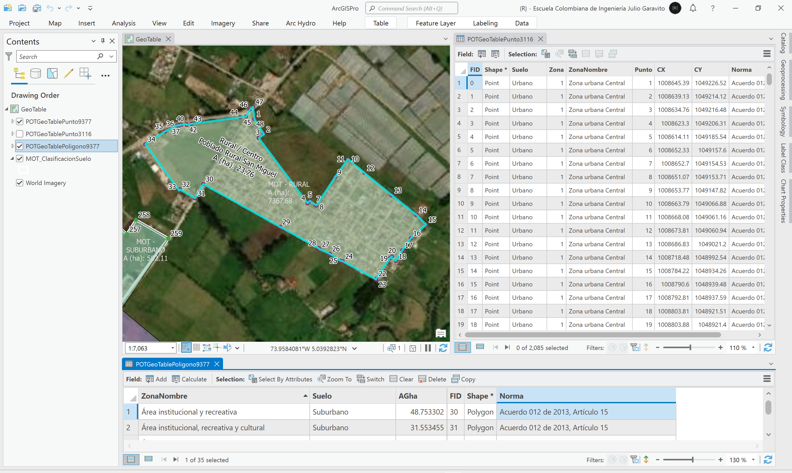
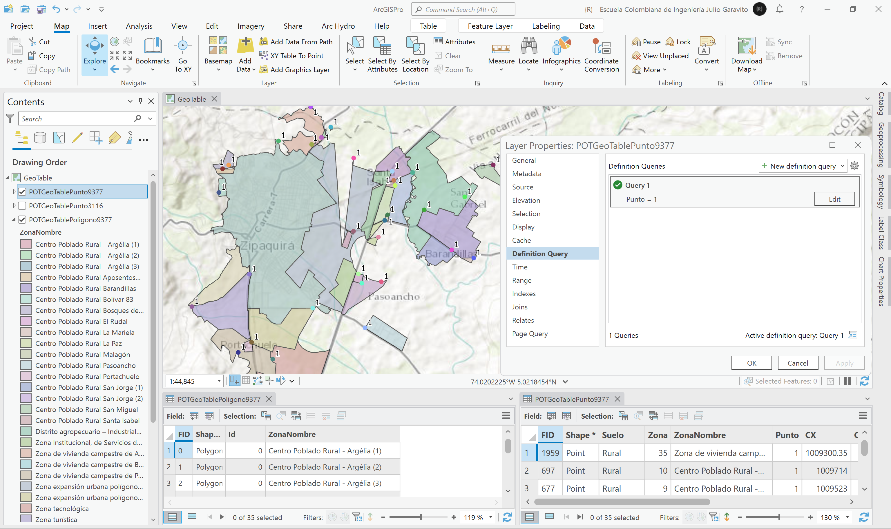
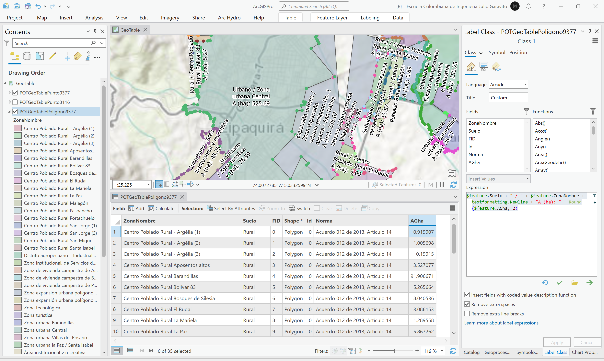

# Tablas geo-codificadas del POT
Keywords: `geo-table` `table-to-point` `point-to-line` `line-to-polygon` `coordinate-table`

A partir de las tablas geo-codificadas contenidas en el Acuerdo o Decreto que reglamenta el POT, cree una tabla integrada con diferentes atributos y secuencias, que permitan generar los nodos y polígonos de la zona urbana, zona de expansión urbana, centros poblados, áreas institucionales, recreativas, culturales, de servicios, distritos especiales, zonas de vivienda y otra áreas de interés especial. Utilizando imágenes satelitales y los polígonos de la cartografía del POT, evalué la espacialidad de los polígonos creados. 

## Objetivos

* Integrar las tablas geo-codificadas incluídas en el Acuerdo o Decreto de adopción del POT, que delimitan las clasificaciones del suelo.
* Crear una capa con los nodos perimetrales asociados a cada zona geo-codificada.
* Crear los polígonos perimetrales y validar su correspondencia con respecto a los polígonos presentados en la cartografía oficial del POT.
* Identificar errores de secuencia, nodos perimetrales faltantes, zonas intermedia vacías o no coalineadas. 

## Requerimientos

* [:mortar_board:Actividad](../POTStudyZone/Readme.md): Ordenamiento Territorial de la zona de estudio.
* [:mortar_board:Actividad](../POTLayer/Readme.md): Inventario de información geo-espacial recopilada del POT y diccionario de datos.
* [:toolbox:Herramienta](https://www.microsoft.com/es/microsoft-365/excel?market=bz): Microsoft Excel 365.
* [:toolbox:Herramienta](https://www.esri.com/en-us/arcgis/products/arcgis-pro/overview): ESRI ArcGIS Pro 3.3.1 o superior.
* [:toolbox:Herramienta](https://qgis.org/): QGIS 3.38 o superior.
* [:open_file_folder:POTGeoTable.xlsx](POTGeoTable.xlsx): libro con tablas geo-codificadas del POT.

## 1. Creación de tabla geo-codificada

> La geo-codificación, es el proceso de transformar una descripción de una ubicación (por ejemplo, un par de coordenadas, una dirección o un nombre de un lugar) en una ubicación de la superficie de la Tierra. Se puede geo-codificar introduciendo una descripción de una ubicación a la vez o proporcionando muchas de ellas al mismo tiempo en una tabla. Las ubicaciones que se obtienen se transforman en entidades geográficas con atributos, que se pueden utilizar para la representación cartográfica o él para análisis espacial. Con la geoc-odificación, puede buscar varios tipos de ubicaciones de manera rápida. Los tipos de ubicaciones que puede buscar incluyen: puntos de interés o nombres de un diccionario geográfico, como montañas, puentes y negocios; coordenadas basadas en latitud y longitud o en otros sistemas de referencia.[^1]

1. A partir de las tablas geo-codificadas contenidas en los Artículos 12, 13, 14, 15 y 134 del Acuerdo Municipal 012 de 2013, cree un libro de Microsoft Excel con el nombre [POTGeoTable.xlsx](POTGeoTable.xlsx) (guarde en la carpeta _\table_) que contenga una hoja con el nombre _POTGeoTable_ y que incluya las siguientes columnas de atributos:

| Columna    | Descripción                                                                           |
|------------|---------------------------------------------------------------------------------------|
| Suelo      | Clasificación de suelo: Urbano, Rural, Expansión urbana, Suburbano.                   |
| ZonaID     | Numero consecutivo por cada zona identificada.                                        |
| ZonaNombre | Nombre de la zona.                                                                    |
| Punto      | Número de punto, 1 a n por zona.                                                      |
| CX         | Coordenada X en metros. Para el caso de estudio corresponde a valores en el CRS 3116. |
| CY         | Coordenada Y en metros. Para el caso de estudio corresponde a valores en el CRS 3116. |
| Norma      | Artículo del Acuerdo o Decreto Municipal.                                             |

2. Desde el Acuerdo Municipal, registre los valores en el libro de Excel.

> Es recomendable convertir el documento de Adobe Acrobat a un formato editable, para de poder copiar correctamente los elementos multilínea contenidos en las tablas.

Por ejemplo, para el artículo 12 correspondiente a la delimitación del suelo urbano:

Repita el mismo procedimiento para los demás artículos que incluyen tablas geo-codificadas. Una vez terminado, obtendrá para este Acuerdo, los registros de localización para 35 zonas diferentes.

Tabla resumen en suelo urbano y número de nodos 
 

Tabla resumen en suelo de expansión urbana y número de nodos 
 

Tabla resumen en suelo suburbano y número de nodos 
 

Tabla resumen en suelo rural y número de nodos 
 

> Tenga en cuenta, que el suelo suburbano también hace parte de la zona rural.

## 2. Creación de nodos, polígonos y re-proyección

1. Abra el proyecto de ArcGIS Pro, creado previamente y desde el menú _Insert_ cree un nuevo mapa _New Map_, renombre como _GeoTable_ y establezca el CRS 9377. Desde el _Catalog Pane_, agregue al proyecto la hoja _POTGeoTable_ del libro de Excel y verifique que contenga todos los 2085 registros incorporados. 

2. En la tabla de contenido, de clic derecho en la tabla _POTGeoTable$_, seleccione la opción _Create Points From Table / XY Table To Point_

En la ventana de la herramienta _XY Table To Point_, defina como nombre de salida `\file\shp\POTGeoTablePunto3116.shp`, seleccione los campos de coordenadas CX y CY y defina como sistema de coordenadas el EPSG 3116 correspondiente a MAGNA_Colombia_Bogota.

> Las coordenadas definidas en el documento del Acuerdo del POT, fueron registradas utilizando el CRS 3116, debido a esto, la capa geográfica de nodos, primero debe ser creada utilizando este sistema y luego debe ser re-proyectada al sistema definido para el caso de estudio, correspondiente al EPSG 9377.

Una vez ejecutada esta herramienta, obtendrá una nube de puntos, simbolice por valores únicos a partir de `ZonaNombre` y rotule utilizando la secuencia contenida en el campo `Punto`.

3. Reproyecte la capa de puntos al CRS 9377, para ello, desde la tabla de contenido, cree una copia de la capa y en _Environmets_ establezca el CRS requerido. Nombre la capa como `\file\shp\POTGeoTablePunto9377.shp`

> :ladybeetle:Una vez terminado el proceso de generación de la capa de puntos, se recomienda retirar de la tabla de contenido, la hoja del libro de Excel. En algunas versiones de ArcGIS Pro, se bloquea la apertura del mapa de proyecto cuando se utilizan fuentes externas de datos contenidas en libros de Excel.

4. Desde la capa _POTGeoTablePunto9377_, cree una gráfica de barras por _ZonaNombre_ y mediante un conteo de elementos, verifique que todos los nodos hayan sido cargados.

5. Abra la tabla de atributos de la capa _POTGeoTablePunto9377_ y cree los siguientes campos de atributos:

| Campo     | Descripción                                            |   Tipo    | Propiedad ArcGIS Pro  | 
|:----------|:-------------------------------------------------------|:---------:|:-------------------------| 
| Latitude  | Latitud de localización del punto en grados decimales. |  Double   | N/A                      |
| Longitude | Latitud de localización del punto en grados decimales. |  Double   | N/A                      |

6. Utilizando el calculador de geometría de campo, calcule las coordenadas de localización en los dos campos creados, utilizando el CRS 9377 y definiendo el formato de salida en grados decimales.

7. Cree los polígonos de delimitación utilizando la herramienta de geoprocesamiento _Defense Tools / Coordinate Table to Polygon_, nombre la capa de salida como `\file\shp\POTGeoTablePoligono9377.shp`.

8. Simbolice los polígonos por valores únicos con contornos de color negro, establezca transparencia en 40% y rotule a partir del campo _ZonaNombre_. Verifique que en la tabla de atributos aparezcan 35 registros o polígonos. Podrá observar que entre algunas zonas existen zonas intermedias vacías o que no se coalinean correctamente.

> :idea:Luego de la creación de los polígonos, se recomienda verifique y ajuste manualmente con el Editor, los polígonos con zonas internas vacías o regiones y polígonos con secuencias erradas. Utilice los conceptos aprendidos en la actividad [Digitalización de vectores: drenajes, vías y predios](../Digitizing/Readme.md).

9. Revisando la tabla de atributos, podrá darse cuenta qué únicamente aparecen los nombre de las zonas, y que durante el proceso de generación de los polígonos, no fueron incorporados los atributos de la clase de suelo y la norma que reglamento la zona. 

En la tabla de atributos de la capa _POTGeoTablePunto9377_, filtre los registros con Punto = 1. Podrá observar que en cada zona solo aparece el primer nodo de la secuencia de construcción de cada polígono (35 nodos iniciales).

Luego del filtro, realice una unión entre la capa de polígonos y la capa de nodos. En la tabla de contenido, de clic derecho en la capa de polígonos y seleccione la opción _Joins and Relates / Add Join_, utilice como llave de unión el campo _ZonaNombre_.

Podrá observar que para los 35 registros de polígonos, se encuentra ahora la información relacionada con la clase de suelo, norma y demás propiedades contenidas en el nodo 1 de cada entidad.

En la tabla de atributos de la capa de polígonos, cree como tipo texto de 200 caracteres, los campos de atributos `Suelo` y `Norma`, y con el calculador de campo, lleve los valores de las columnas agregadas en la unión a los campos de la capa de polígonos.

Para terminar, desde las opciones de la capa de polígonos, remueva la unión o Join y desactive el filtro realizado a la capa de nodos. Verifique la tabla de atributos, encontrará que ahora todos los elementos tienen el descriptor de Suelo y Norma. Ajuste el rótulo incluyendo la clase de suelo.

Rótulo Arcade: `$feature.Suelo + " / " + $feature.ZonaNombre`

## 3. Verificación de límites

> Según lo establecido en la Ley 388 de 1997, cuando existan inconsistencias entre lo señalado en el acuerdo que adopta el plan de ordenamiento territorial y su cartografía oficial, prevalecerá lo establecido en el texto del acuerdo y corresponderá al alcalde municipal o distrital, o la entidad delegada para el efecto, corregir las inconsistencias cartográficas, siempre que no impliquen modificación al articulado del Plan de Ordenamiento Territorial. En el acto administrativo que realice lprecisión cartográfica se definirán, con fundamento en las disposiciones del Plan de Ordenamiento Territorial y sus reglamentaciones, las normas urbanísticas aplicables al área objeto de la precisión. Una vez expedido el acto administrativo, el mismo deberá ser registrado en todos los planos de la cartografía oficial del correspondiente plan y sus instrumentos reglamentarios y complementarios. Esta disposición también será aplicable para precisar la cartografía oficial cuando los estudios de detalle permitan determinar con mayor exactitud las condiciones jurídicas, físicas, geológicas y morfológicas de los terrenos.

Verificaciones a realizar:

* Utilizando la imágen satelital de ESRI, Google Maps y el POT, evalué la espacialidad de los polígonos creados.
* Revise y valide los límites y áreas de cada polígono, compare con la capa del Modelo de Ocupación Territorial - MOT. 
* Identifique zonas urbanizadas que no están dentro de los límites de los polígonos generados. (Actividad de proyecto).
* Consulte los Acuerdos Municipales posteriores al año 2013, e indique si han sido objeto de modificación o ajuste del POT. (Actividad de proyecto). 

1. En la tabla de atributos, agregue un nuevo campo numérico doble con el nombre `AGha` y calcule el área geodésica en hectáreas de los polígonos creados. Modifique el rótulo incluyendo el área calculada

Rótulo Arcade: `$feature.Suelo + " / " + $feature.ZonaNombre + textformatting.Newline + "A (ha): " + Round($feature.AGha, 2)`

2. Cambie el mapa de fondo o Basemap, por el de la imágen satelital mundial de ESRI y desactive los rótulos en la capa de nodos. Utilizando la herramienta de selección por atributos, seleccione todos los polígonos correspondientes a clasificación de suelo urbano. Agregue la capa `\file\shp\MOT_ClasificacionSuelo.shp` adaptada por clasificación del suelo en el ejercicio de Plusvalía y simbolice sin relleno y con bordes en color blanco.

Rótulo Arcade para MOT: `"MOT - " + $feature.SUELO  + textformatting.Newline + "A (ha): " + Round($feature.AGha9377, 2)`

> En el rótulo de la capa _MOT_ClasificacionSuelo_, los valores de área corresponden al total de toda la clase.

* Zona urbana Central: en general, se acopla correctamente a los límites perimetrales de los polígonos perimetrales y al límite definido en el MOT. 

* Zona urbana Barandillas: existen diferencias en el borde perimetral con respecto al límite del MOT.

* Zona urbana Villas del Rosario: errores en la secuencia de los puntos, faltan nodos de detalle en contorno.

* Zona urbana la Paz / Santa Isabel: zonas vacías colindantes con suelo de expansión urbana, faltan nodos de detalle en contorno.

3. Repita la revisión anterior para las demás clasificaciones de suelo: expansión urbana, suburbano y rural. Podrá observar que se presentan múltiples errores de coalineación, secuenciamiento y nodos de detalle perimetrales faltantes con respecto al MOT.

## 4. Análisis usando software libre - QGIS

Para el desarrollo de las actividades desarrolladas en esta clase, se pueden utilizar en QGIS las siguientes herramientas o geo-procesos:

| Proceso                         | Procedimiento                                                                                                                                                                                                       |
|:--------------------------------|:--------------------------------------------------------------------------------------------------------------------------------------------------------------------------------------------------------------------|
| Simbología                      | Modificable desde las propiedades de la capa en la pestaña _Symbology_.                                                                                                                                             |
| Rotulado                        | Modificable desde las propiedades de la capa en la pestaña _Labels_.                                                                                                                                                |
| Tabla a puntos                  | Herramienta disponible en el _Processing Toolbox / Vector Creation / Create points layer from table_.                                                                                                               |
| Convertir puntos a líneas       | Herramienta disponible en el _Processing Toolbox / Vector Creation / Points to path_.                                                                                                                               |
| Convertir líneas a polígonos    | Herramienta disponible en el _Processing Toolbox / Vector Geometry / Polygonize_.                                                                                                                                   |
| Cálculos geométricos o de campo | Directamente desde la tabla de atributos mediante el botón _Open Field Calculator_ o <kbd>Ctr</kbd>+<kbd>I</kbd>. La geometría de cálculo `$area` permite obtener el valor elipsoidal y `area` el valor proyectado. |

Ejemplo rótulo en QGIS: `'A(ha): ' ||  round("AGha", 2) || '\n' || 'P (m): ' ||  round("PGm", 2) `

[:notebook:QGIS training manual](https://docs.qgis.org/3.34/en/docs/training_manual/)

## Elementos requeridos en diccionario de datos

Agregue a la tabla resúmen generada en la actividad [Inventario de información geo-espacial recopilada del POT y diccionario de datos](../POTLayer/Readme.md), las capas generadas en esta actividad que se encuentran listadas a continuación:

| Nombre                        | Descripción                                                                                                                        | Geometría | Registros                               | 
|-------------------------------|------------------------------------------------------------------------------------------------------------------------------------|-----------|-----------------------------------------| 
| POTGeoTablePunto3116.shp      | Puntos de localización perimetral en CRS 3116 creados a partir de tablas geo-codificadas contenidas en el acuerdo del POT.         | Punto 2D  | 2085                                    | 
| POTGeoTablePunto9377.shp      | Puntos de localización perimetral en CRS 9377 reproyectados a partir de la capa _POTGeoTablePunto3116.shp_.                        | Punto 2D  | 2085                                    | 
| POTGeoTablePoligono9377.shp   | Polígonos de delimitación de zonas generados a partir del secuenciamiento de puntos contenido en _POTGeoTablePunto9377.shp_.       | Punto 2D  | 35                                      | 
| POTZonaUrbanizadaExcluida.shp | Puntos de localización de zonas urbanizadas no delimitadas como tabla geo-codificada en el Acuerdo o Decreto de adopción del POT.  | Punto 2D  | Indicar el número de zonas encontradas. | 

> :bulb:Para funcionarios que se encuentran ensamblando el SIG de su municipio, se recomienda incluir y documentar estas capas en el Diccionario de Datos.

## Actividades de proyecto :triangular_ruler:

En la siguiente tabla se listan las actividades que deben ser desarrolladas y documentadas por cada grupo de proyecto en un único archivo de Adobe Acrobat .pdf. El documento debe incluir portada (indicando el caso de estudio, número de avance, nombre del módulo, fecha de presentación, nombres completos de los integrantes), numeración de páginas, tabla de contenido, lista de tablas, lista de ilustraciones, introducción, objetivo general, capítulos por cada ítem solicitado, conclusiones y referencias bibliográficas.

| Actividad     | Alcance                                                                                                                                                                                                                                                                                                                                                                                                                                             |
|:--------------|:----------------------------------------------------------------------------------------------------------------------------------------------------------------------------------------------------------------------------------------------------------------------------------------------------------------------------------------------------------------------------------------------------------------------------------------------------|
| Avance **P3** | Para su caso de estudio, íncluya todos los registros geo-codificados contenidos en el Acuerdo o Decreto de adopción del POT, genere las capas de nodos y polígonos perimetrales.                                                                                                                                                                                                                                                                    | 
| Avance **P3** | Para cada polígono generado, revise su delimitación perimetral e interna, identifique errores de secuenciamiento, zonas vacías no coalineadas y nodos faltantes.                                                                                                                                                                                                                                                                                    | 
| Avance **P3** | Compare cada zona con la capa del modelo de ocupación territorial y sin eliminar o agregar nodos, ajuste la secuencia de los puntos para obtener la delimitación perimetral correcta.                                                                                                                                                                                                                                                               | 
| Avance **P3** | Cree una capa de puntos con el nombre _POTZonaUrbanizadaExcluida.shp_ e identifique zonas urbanizadas que no están dentro de los límites de los polígonos generados.                                                                                                                                                                                                                                                                                | 
| Avance **P3** | Consulte los Acuerdos Municipales posteriores a la adopción del POT, e indique si las áreas generadas y tablas geo-codificadas han sido objeto de modificación o ajuste.                                                                                                                                                                                                                                                                            | 
| Avance **P3** | :compass:Mapa digital impreso _P3-1: Polígonos a partir de tablas geocodificadas con comparación capa MOT._ Incluir nodos perimetrales numerados, polígonos rotulados. Puede usar uno o varios marcos de datos para mostrar el detalle de todos los polígonos. Embebido dentro del informe final como una imágen y referenciados como anexo.                                                                                                     | 
| Avance **P3** | :compass:Mapa digital impreso _P3-2: Mapa con puntos de localización y detalle de zonas urbanizadas no incluídas en límites MOT._ Incluir tabla con descripción y coordenadas de localización. Embebido dentro del informe final como una imágen y referenciados como anexo.                                                                                                                                                                     | 
| Avance **P3** | En una tabla y al final del informe de avance de esta entrega, indique el detalle de las sub-actividades realizadas por cada integrante de su grupo. Para actividades que no requieren del desarrollo de elementos de avance, indicar si realizo la lectura de la guía de clase y las lecturas indicadas al inicio en los requerimientos. Utilice las siguientes columnas: Nombre del integrante, Actividades realizadas, Tiempo dedicado en horas. | 

> No es necesario presentar un documento de avance independiente, todos los avances de proyecto de este módulo se integran en un único documento.
> 
> En el informe único, incluya un numeral para esta actividad y sub-numerales para el desarrollo de las diferentes sub-actividades, siguiendo en el mismo orden de desarrollo presentado en esta actividad.

## Referencias

* [¿Qué es la geocodificación?](https://desktop.arcgis.com/es/arcmap/latest/manage-data/geocoding/what-is-geocoding.htm)

## Control de versiones

| Versión    | Descripción                                                | Autor                                      | Horas |
|------------|:-----------------------------------------------------------|--------------------------------------------|:-----:|
| 2024.03.15 | Versión inicial con alcance de la actividad                | [rcfdtools](https://github.com/rcfdtools)  |   4   |
| 2024.07.18 | Investigación y documentación para caso de estudio general | [rcfdtools](https://github.com/rcfdtools)  |   8   |

_R.SIGE es de uso libre para fines académicos, conoce nuestra licencia, cláusulas, condiciones de uso y como referenciar los contenidos publicados en este repositorio, dando [clic aquí](LICENSE.md)._

_¡Encontraste útil este repositorio!, apoya su difusión marcando este repositorio con una ⭐ o síguenos dando clic en el botón Follow de [rcfdtools](https://github.com/rcfdtools) en GitHub._

| [:arrow_backward: Anterior](../Digitizing/Readme.md) | [:house: Inicio](../../README.md) | [:beginner: Ayuda / Colabora](https://github.com/rcfdtools/R.SIGE/discussions/18) | [Siguiente :arrow_forward:]() |
|------------------------------------------------------|-----------------------------------|-----------------------------------------------------------------------------------|-------------------------------|

[^1]: https://desktop.arcgis.com/es/arcmap/latest/manage-data/geocoding/what-is-geocoding.htm