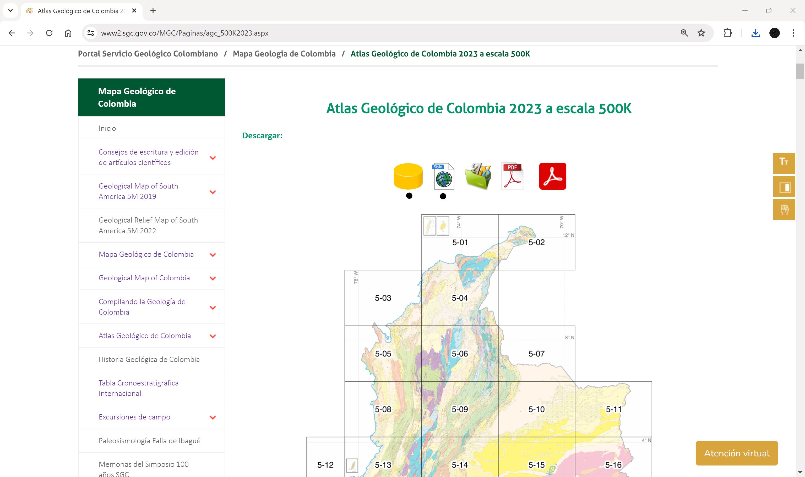
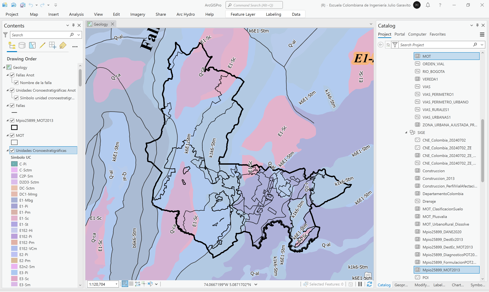
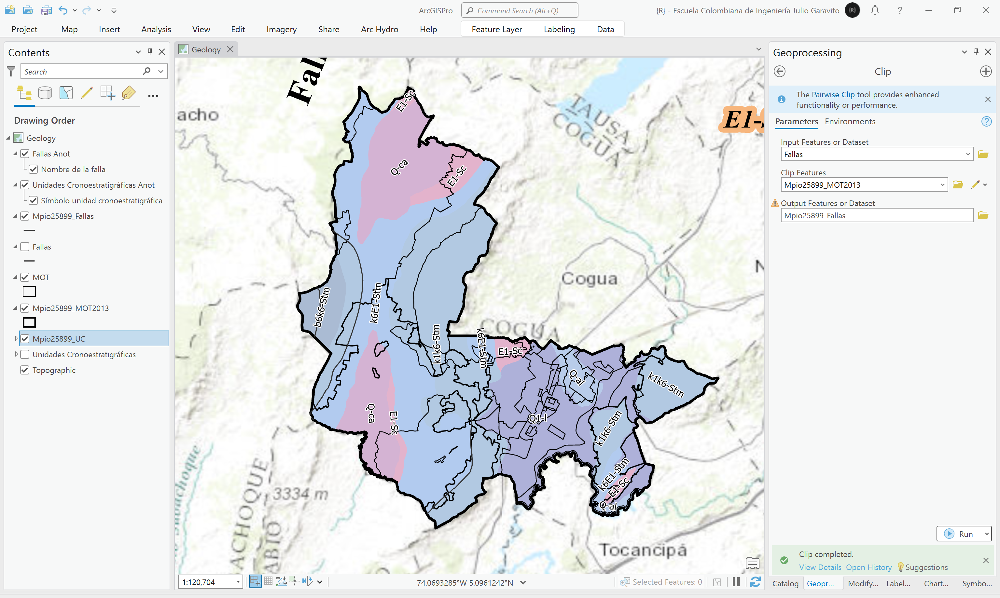

# Mapa geológico de Colombia vs. MOT
Keywords: `geology` `geological-map` `mot` `uc` `geological-fail` `volcanic`

Descargue el Mapa Geológico de Colombia del [Servicio Geológico Colombiano - SGC](https://www2.sgc.gov.co/MGC/Paginas/mgc_1_5M2023.aspx) y recorte las líneas de falla y unidades cronoestratigráficas hasta el límite municipal del mapa MOT del POT. Describa y explique las fallas y unidades presentes en la zona de estudio. Utilizando la herramienta de geoprocesamiento Intersect, combine el modelo de ocupación territorial MOT con la capa de unidades cronoestratigráficas y a través de un resumen estadístico, obtenga por cada categoría del MOT, las unidades cronoestratigráficas presentes y sus áreas. 

> El ordenamiento territorial y el funcionamiento de zonas productivas están influenciados por los factores ambientales y, particularmente, por las características del suelo, el paisaje y sus procesos exógenos. Los procesos naturales de origen geológico impactan severamente sobre la población afincada en sitios no aptos para su ocupación, representando estos una amenaza para el desarrollo social y económico de esas urbanizaciones, muchas de ellas ubicadas en las planicies aluviales de los ríos, en los piedemontes de las zonas montañosas o en las líneas de ribera del litoral marítimo. En el análisis geológico, se realiza la identificación de las litologías y de las principales estructuras geológicas, considerando su estabilidad y sus características geotécnicas; de las geoformas que conforman el paisaje, teniendo en cuenta especialmente pendientes, la morfodinámica actual y la estabilidad de las mismas; la identificación de los suelos, su caracterización y mapeo, incluyendo, si ocurriere, la evaluación de la degradación y la información referida a las aguas subterráneas y superficiales.[^1]

## Objetivos

* Estudiar la geología de la zona de estudio para identificar incompatibilidades con las zonas definidas en el modelo de ocupación territorial - MOT.
* Estudiar la composición de las unidades cronoestratigráficas.

## Requerimientos

* [:mortar_board:Actividad](../POTLayer/Readme.md): Inventario de información geo-espacial recopilada del POT y diccionario de datos.
* [:mortar_board:Actividad](../CountyLimit/Readme.md): Análisis veredal y límite territorial.
* [:toolbox:Herramienta](https://www.esri.com/en-us/arcgis/products/arcgis-pro/overview): ESRI ArcGIS Pro 3.3.1 o superior.
* [:toolbox:Herramienta](https://qgis.org/): QGIS 3.38 o superior.

## 1. Mapa geológico de la zona de estudio

1. Ingrese al sitio del [Servicio Geológico Colombiano - SGC](https://www2.sgc.gov.co/MGC/Paginas/mgc_1_5M2023.aspx) y descargue la File Geodatabase del Atlas Geológico de Colombia versión 2023 a escala 1:500K (_agc2023.gdb.zip_) y el archivo de estilos (_agc2023.style_). Guarde y descomprima en la carpeta `\file\data\SGC\`. 

2. Abra el proyecto de ArcGIS Pro, creado previamente y desde el menú _Insert_ cree un nuevo mapa _New Map_, renombre como _Geology_ y establezca el CRS 9377. Agregue al mapa la capa de unidades cronoestratigráficas (_UC_ y _UCAnot_) y fallas geológicas (_Fallas_ y _FallasAnot_) contenidas en `\file\data\SGC\agc2023.gdb\Geologia\` y ajuste la simbología a valores únicos representando el campo de atributos `Simbolo_UC`. Podrá observar que los colores de representación no se ajustan a los definidos en la [Tabla Cronoestratigráfica Internacional](../../ref/ChronostratChart2023-04SpanishAmer.pdf)[^2].

3. Para incorporar en ArcGIS Pro los estilos contenidos en el archivo _agc2023.style_ del SGC, en el menú _Insert_, seleccione la opción _Styles / Import_ y añada el archivo.  

> La importación de los estilos no actualiza automáticamente los colores aplicados a las unidades cronoestratigráficas, si aplicación puede ser realizada manualmente utilizando los códigos y colores importados.

Para aplicar un estilo, en la tabla de contenido de clic sobre una de las UC, en el panel de simbología podrá observar que se ha incluído un grupo de estilo nuevo, denominado _agc2023_. Para aplicar el estilo _C-Pi_, correspondiente a _Dioritas, granodioritas, cuarzodioritas, tonalitas y gabros_, seleccione el símbolo correspondiente.

4. Agregue al mapa, la capa del Modelo de Ocupación Territorial - MOT desde la ruta `\file\gdb\SIGE.gdb\POT2013Formulacion\MOT` y el límite territorial a partir del MOT creado en la actividad [Análisis veredal y límite territorial](../CountyLimit/Readme.md) desde la ruta `\file\gdb\SIGE.gdb\SIGE\Mpio25899_MOT2013`. Ajuste la simbología utilizando solo contornos y rotule el mapa geológico a partir del campo `Simbolo_UC`.

5. Utilizando la herramienta de geo-procesamiento _Analysis Tools / Clip_, recorte el mapa geológico y las fallas geológicas hasta el límite del mapa _Mpio25899_MOT2013_. Nombre las capas resultantes como `\file\gdb\SIGE.gdb\SIGE\Mpio25899_UC` Y `\file\gdb\SIGE.gdb\SIGE\Mpio25899_Fallas`. Podrá observar que para el caso de estudio, existen 7 diferentes unidades cronoestratigráficas y una falla inversa o de cabalgamiento.

Unidades encontradas  

| Símbolo UC | Descripción                                                                                                                       | Edad                       | UG integradas      |
|------------|-----------------------------------------------------------------------------------------------------------------------------------|----------------------------|--------------------|
| b6k6-Stm   | Shales, calizas, arenitas, cherts y fosforitas                                                                                    | Albiano-Maastrichtiano     |                    |
| E1-Sc      | Conglomerados intercalados con arenitas de grano medio a grueso y lodolitas carbonosas                                            | Paleoceno                  |                    |
| k1k6-Stm   | Shales, calizas, fosforitas, cherts y cuarzoarenitas. Predominio de facies finas al norte del Cocuy y facies más arenosas al sur. | Cenomaniano-Maastrichtiano |                    |
| k6E1-Stm   | Arcillolitas rojizas con intercalaciones de cuarzoarenitas de grano fino. Mantos de carbón a la base.                             | Maastrichtiano-Paleoceno   | Formación Guaduas  |
| Q-al       | Depósitos aluviales y de llanuras aluviales                                                                                       | Cuaternario                |                    |
| Q-ca       | Abanicos aluviales y depósitos coluviales                                                                                         | Cuaternario                |                    |
| Q1-l       | Arcillas, turbas, y arcillas arenosas con niveles delgados de gravas. Localmente, capas de depósitos de diatomeas.                | Pleistoceno                |                    |

6. Ajuste la simbología del mapa recortado utilizando los estilos importados.

7.  A partir de la capa de recorte, cree un gráfico de barras para analizar la distribución de áreas por cada unidad estratigráfica, podrá observar que la clase dominante es _k1k6-Stm_, correspondiente a _Shales, calizas, fosforitas, cherts y cuarzoarenitas. Predominio de facies finas al norte del Cocuy y facies más arenosas al sur de la edad Cenomaniano-Maastrichtiano_.

## 2. Geología vs. MOT

Para el análisis de compatibilidad entre las categorías del suelo establecidas en el Modelo de Ocupación Territorial - MOT y los tipos de unidades cronoestratigráficas - UC, evaluaremos principalmente los usos permitidos de vivienda sobre las unidades _Q-al_ y _Q-ca_, correspondientes a zonas con depósitos aluviales y de llanuras aluviales, y abanicos aluviales y depósitos coluviales, los cuales pueden provenir superficialmente de procesos de arrastre fluvial y de fenómenos de remoción en masa. Por otra parte, evaluaremos que zonas definidas en el MOT se encuentran sobre fallas geológicas. 

1. Utilizando la herramienta de geo-procesamiento _Analysis Tools / Intersect_, cree una intersección espacial entre la capa UC y la capa MOT, nombre la capa resultante como `\file\gdb\SIGE.gdb\SIGE\MOT_UC`. Podrá observar que las zonas de las unidades cronoestratigráficas se han fraccionado en múltiples partes.

2. Desde la tabla de atributos de la capa de intersección y desde el campo _catego_, cree un resúmen estadístico o _Summarize_ que permita identificar los diferentes tipos de unidades cronoestratigráficas. Nombre la tabla resultante como `\file\gdb\SIGE.gdb\MOT_UC_Eval`.

3. Abra la tabla obtenida, podrá observar que para cada categoría se pueden identificar las diferentes unidades. Utilizando la herramienta de selección por atributos y seleccione en la capa _MOT_UC_, todos aquellos polígonos categorizados como _Área de Vivienda Rural Campestre_, _Centro Poblado Rural_ y _Áreas de Actividad en Suelo Urbano_ que se encuentran sobre las unidades UC _Q-al_ y _Q-ca_.

SQL: `catego IN ('Área de Vivienda Rural Campestre', 'Áreas de Actividad en Suelo Urbano', 'Centro Poblado Rural') And SimboloUC IN ('Q-al', 'Q-ca')`

> Para este análisis también puede incluir las _Áreas de Actividad en Suelo de Expansión Urbana_.

Cambie el mapa base por el de la imágen satelital de ESRI.

El resultado de este análisis indica que en la unidad _Q-al_, puede existir incompatibilidad con las fracciones de áreas correspondientes a 3 las categorías en las siguientes zonas:

Rótulo Arcade: `$feature.SimboloUC + " " + $feature.NOMBRE`

Centro Poblado Rural - C.P.R. SANTA ISABEL 
 

Centro Poblado Rural - C.P.R. BARANDILLAS 
 

Áreas de Actividad en Suelo Urbano - Z.U. BARANDILLAS 
 

Centro Poblado Rural - C.P.R. LA MARIELA 
 

Área de Vivienda Rural Campestre - BARANDILLAS 
 

4. Para el análisis de fallas geológicas, seleccione por localización, todos aquellos polígonos del MOT que se intersecan con las fallas recortadas dentro de la zona de estudio. Podrá observar que las categorías del suelo establecidas corresponden a suelos rurales y de protección, y que como categoría principal no se encuentran en zonas con usos principales de vivienda, lo cual indica que no existe incompatibilidad directa.

Falla inversa o de cabalgamiento - Falla de La Quebrada Carrizal 
 

Falla inversa o de cabalgamiento 
 

Falla inversa o de cabalgamiento - Falla de El Porvenir 
 

## 3. Análisis usando software libre - QGIS

Para el desarrollo de las actividades desarrolladas en esta clase, se pueden utilizar en QGIS las siguientes herramientas o geo-procesos:

| Proceso                              | Procedimiento                                                                                                                                                                                        |
|:-------------------------------------|:-----------------------------------------------------------------------------------------------------------------------------------------------------------------------------------------------------|
| Simbología                           | Modificable desde las propiedades de la capa en la pestaña _Symbology_.                                                                                                                              |
| Rotulado                             | Modificable desde las propiedades de la capa en la pestaña _Labels_.                                                                                                                                 |
| Resumen estadístico (Summarize)      | Disponible en _Processing Toolbox / Vector Analysis / [Statistics by categories](https://docs.qgis.org/3.34/en/docs/user_manual/processing_algs/qgis/vectoranalysis.html#statistics-by-categories)_. |
| Recorte de capas vectoriales (clip)  | Herramienta disponible en el _Processing Toolbox / Vector Overlay / [Clip](https://docs.qgis.org/3.34/en/docs/user_manual/processing_algs/qgis/vectoroverlay.html#clip)_.                            |
| Intersección espacial (Intersection) | Se realizan desde el menú _Vector_ a través de la opción _Geoprocessing Tools / Intersection_.                                                                                                       |

Ejemplo rótulo en QGIS: `'A(ha): ' ||  round("AGha", 2) || '\n' || 'P (m): ' ||  round("PGm", 2) `

[:notebook:QGIS training manual](https://docs.qgis.org/3.34/en/docs/training_manual/)  
[:notebook:Herramientas comúnmente utilizadas en QGIS](../QGIS.md)

## Elementos requeridos en diccionario de datos

Agregue a la tabla resúmen generada en la actividad [Inventario de información geo-espacial recopilada del POT y diccionario de datos](../POTLayer/Readme.md), las capas generadas en esta actividad que se encuentran listadas a continuación:

| Nombre           | Descripción                                                                               | Geometría    | Registros | 
|------------------|-------------------------------------------------------------------------------------------|--------------|-----------| 
| Mpio25899_UC     | Recorte de unidades cronoestratigráficas utilizando las capas _Mpio25899_MOT2013_ y _UC_. | Polígono 2D  | 17        | 
| Mpio25899_Fallas | Recorte de fallas geológicas utilizando las capas _Mpio25899_MOT2013_ y _Fallas_.         | Polilínea 2D | 3         | 
| MOT_UC           | Intersección espacial de las capas _MOT_ y _UC_.                                          | Polígono 2D  | 175       | 
| MOT_UC_Eval      | Resúmen estadístico a partir de la capa _MOT_UC_.                                         | n/a (tabla)  | 90        | 

> :bulb:Para funcionarios que se encuentran ensamblando el SIG de su municipio, se recomienda incluir y documentar estas capas en el Diccionario de Datos.

## Actividades de proyecto :triangular_ruler:

En la siguiente tabla se listan las actividades que deben ser desarrolladas y documentadas por cada grupo de proyecto en un único archivo de Adobe Acrobat .pdf. El documento debe incluir portada (indicando el caso de estudio, número de avance, nombre del módulo, fecha de presentación, nombres completos de los integrantes), numeración de páginas, tabla de contenido, lista de tablas, lista de ilustraciones, introducción, objetivo general, capítulos por cada ítem solicitado, conclusiones y referencias bibliográficas.

| Actividad     | Alcance                                                                                                                                                                                                                                                                                                                                                                                                                                             |
|:--------------|:----------------------------------------------------------------------------------------------------------------------------------------------------------------------------------------------------------------------------------------------------------------------------------------------------------------------------------------------------------------------------------------------------------------------------------------------------|
| Avance **P3** | Desarrolle el análisis geológico presentado en esta actividad. Complemente el análisis incluyendo las capas de volcanes, pliegues, pozos, rocas alta presión, rocas alta temperatura, e indique si para su caso de estudio generan incompatibilidad con las categorías de uso establecidas en el MOT.                                                                                                                                               | 
| Avance **P3** | :compass:Mapa digital impreso _P4-7: Geología municipal._ Incluir tablas y gráficos de análisis. Embebido dentro del informe final como una imágen y referenciados como anexo.                                                                                                                                                                                                                                                                   | 
| Avance **P3** | :compass:Mapa digital impreso _P4-8: Geología municipal combinada con categorías de uso del POT._ Incluir tablas y gráficos de análisis. Embebido dentro del informe final como una imágen y referenciados como anexo.                                                                                                                                                                                                                           | 
| Avance **P3** | En una tabla y al final del informe de avance de esta entrega, indique el detalle de las sub-actividades realizadas por cada integrante de su grupo. Para actividades que no requieren del desarrollo de elementos de avance, indicar si realizo la lectura de la guía de clase y las lecturas indicadas al inicio en los requerimientos. Utilice las siguientes columnas: Nombre del integrante, Actividades realizadas, Tiempo dedicado en horas. | 

> No es necesario presentar un documento de avance independiente, todos los avances de proyecto de este módulo se integran en un único documento.
> 
> En el informe único, incluya un numeral para esta actividad y sub-numerales para el desarrollo de las diferentes sub-actividades, siguiendo en el mismo orden de desarrollo presentado en esta actividad.

## Referencias

* [Atlas Geológico de Colombia 2023 a escala 500K.](https://www2.sgc.gov.co/MGC/Paginas/agc_500K2023.aspx)
* [Memoria explicativa del Mapa Geológico de Colombia, Geological Map of Colombia y Atlas Geológico de Colombia 2023.](https://www2.sgc.gov.co/MGC/Documents/MGC_2023/Memoria_mgc_gmc_agc_2023.pdf)

## Control de versiones

| Versión    | Descripción                                                | Autor                                      | Horas |
|------------|:-----------------------------------------------------------|--------------------------------------------|:-----:|
| 2024.03.22 | Versión inicial con alcance de la actividad                | [rcfdtools](https://github.com/rcfdtools)  |   4   |
| 2024.07.27 | Investigación y documentación para caso de estudio general | [rcfdtools](https://github.com/rcfdtools)  |   8   |

_R.SIGE es de uso libre para fines académicos, conoce nuestra licencia, cláusulas, condiciones de uso y como referenciar los contenidos publicados en este repositorio, dando [clic aquí](LICENSE.md)._

_¡Encontraste útil este repositorio!, apoya su difusión marcando este repositorio con una ⭐ o síguenos dando clic en el botón Follow de [rcfdtools](https://github.com/rcfdtools) en GitHub._

| [:arrow_backward: Anterior](../LandIndex/Readme.md) | [:house: Inicio](../../README.md) | [:beginner: Ayuda / Colabora](https://github.com/rcfdtools/R.SIGE/discussions/26) | [Siguiente :arrow_forward:](../LandSoil/Readme.md) |
|-----------------------------------------------------|-----------------------------------|-----------------------------------------------------------------------------------|----------------------------------------------------|

[^1]: https://www.argentina.gob.ar/produccion/segemar/peligros-geologicos/ordenamiento-territorial
[^2]: Cohen, K.M., Finney, S.C., Gibbard, P.L. y Fan, J.-X. (2013; actualizado) The ICS International Chronostratigraphic Chart. Episodes 36: 199-204.