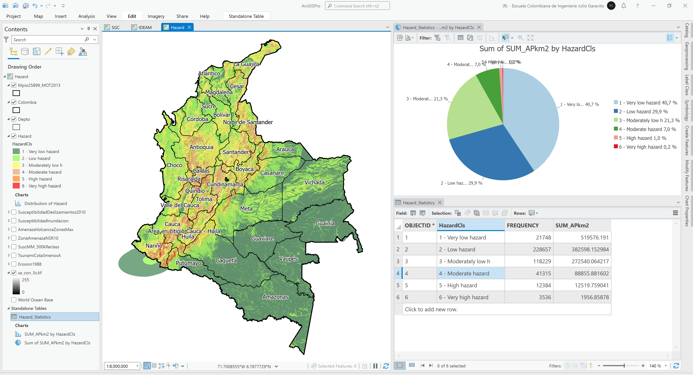
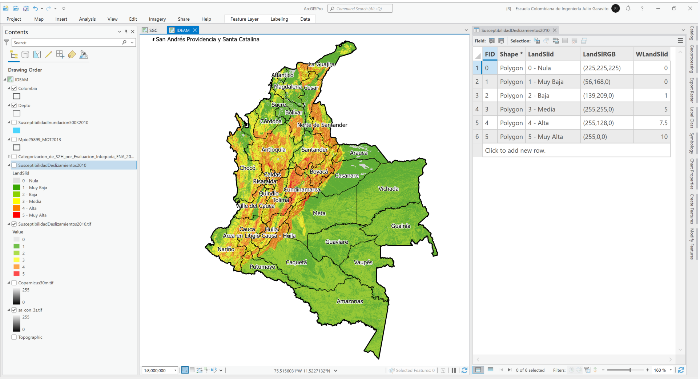
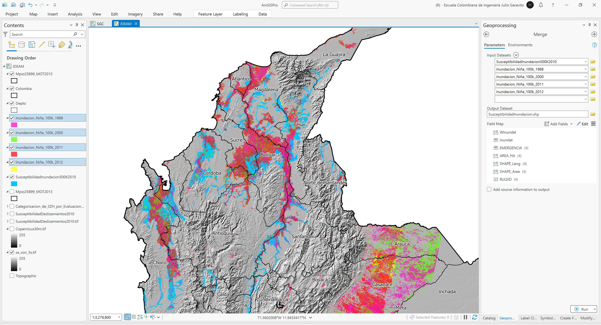
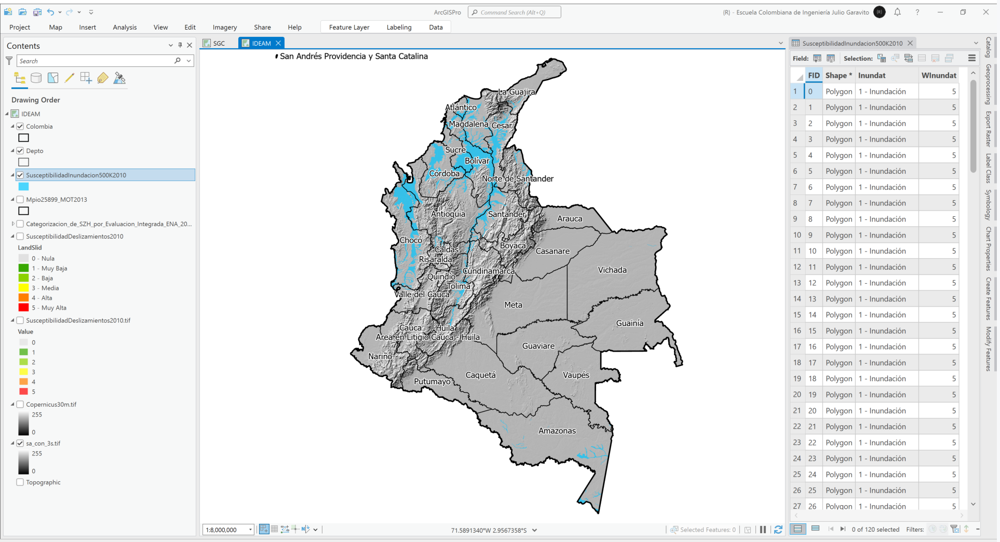
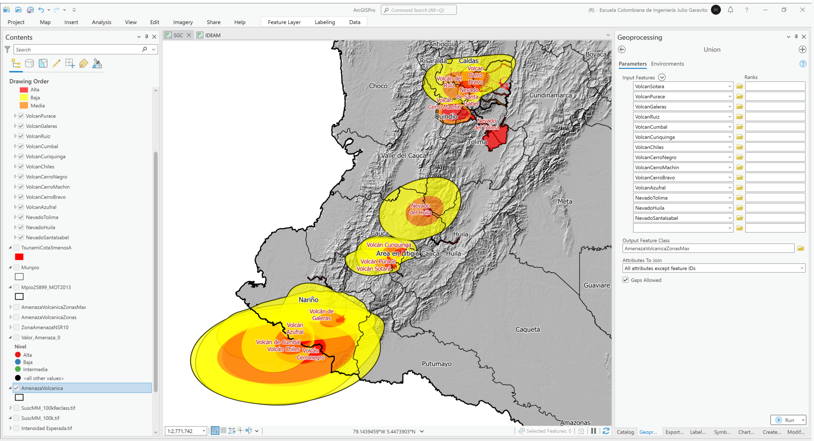
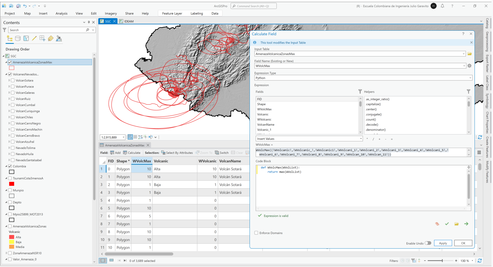
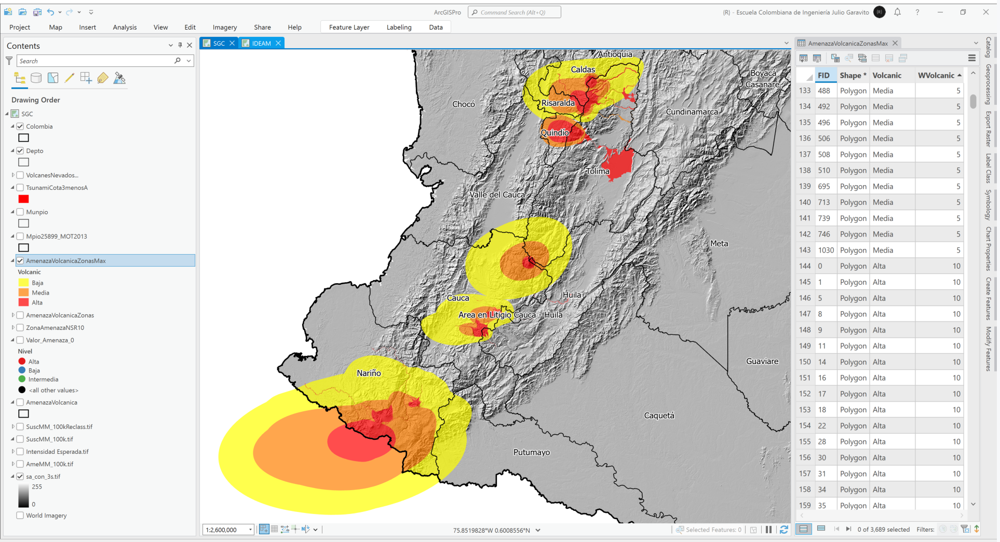
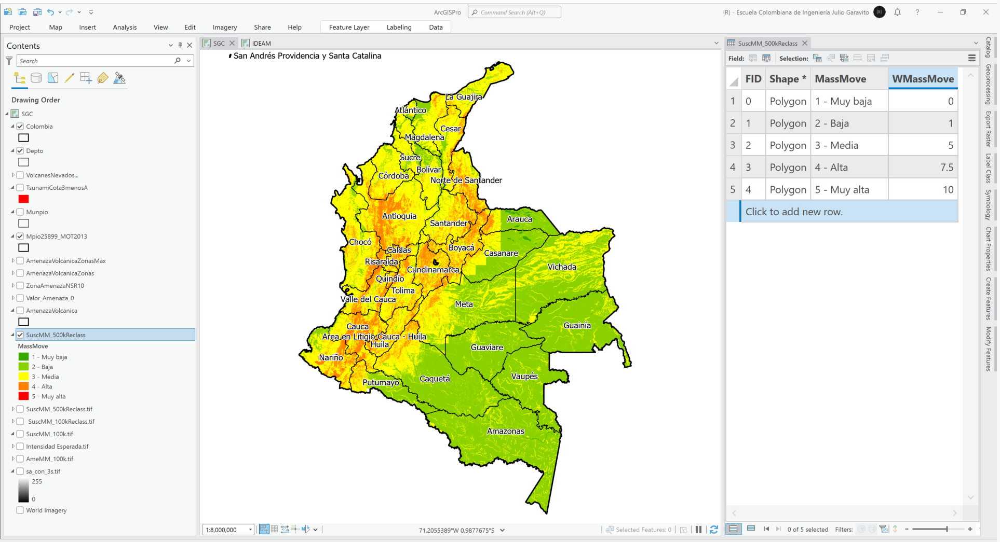
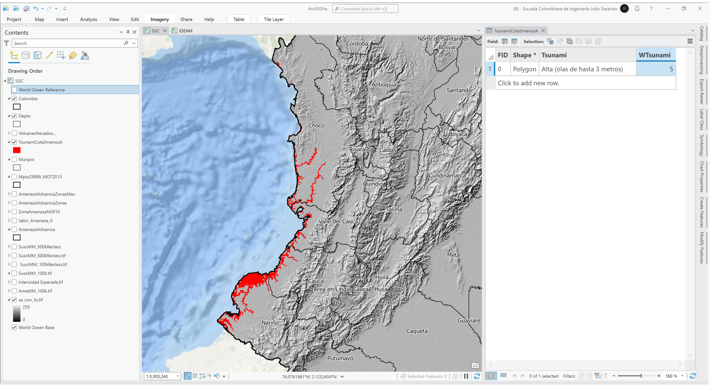

# ArcGIS Pro - Análisis de amenazas naturales
Keywords: `hazard`

A partir de los conceptos aprendidos en este curso y de la investigación de geo-procesos complementarios, desarrollaremos un procedimiento que permite obtener el mapa de amenazas de Colombia, incluye: flujograma de procesos indicando el nombre de los geoprocesos a utilizar, ejecución paso a paso de los geoprocesos indicados con visualización de mapas y tablas de atributos. Utilizando el mapa de amenazas obtenido y mediante un recorte hasta la zona límite del Modelo de Ocupación Territorial - MOT de la zona de estudio, determinar el riesgo ponderado en función de las áreas de cada clase.                           

<div align="center"></div>


## Objetivos

* 


## Requerimientos

* [:mortar_board:Actividad](../TopoBasic/Readme.md): Conceptos básicos de topografía, fotogrametría y fotointerpretación.
* [:mortar_board:Actividad](../POTLayer/Readme.md): Inventario de información geo-espacial recopilada del POT y diccionario de datos.
* [:toolbox:Herramienta](https://www.esri.com/en-us/arcgis/products/arcgis-pro/overview): ESRI ArcGIS Pro 3.3.1 o superior.
* [:toolbox:Herramienta](https://qgis.org/): QGIS 3.38 o superior.


## 1. Capas requeridas y pesos

<div align="center">

| Mapa / Capa                                                                  | Descripción                                                                                   |
|------------------------------------------------------------------------------|-----------------------------------------------------------------------------------------------|
| Colombia.shp                                                                 | Departamentos de Colombia - IGAC                                                              |
| SusceptibilidadDeslizamientos2010.shp<br><sub>\file\data\IDEAM\ </sub>       | Mapa de susceptibilidad a deslizamientos escala 1:500K - IDEAM - 2010                         |
| SusceptibilidadInundacion.shp<br><sub>\file\data\IDEAM\ </sub>               | Mapa de susceptibilidad por inundación - IDEAM                                                |
| AmenazaVolcanicaZonasMax.shp<br><sub>\file\data\SGC\AmenazaVolcanica\ </sub> | Mapa de amenazas volcánicas - SGC                                                             |
| ZonaAmenazaNSR10.shp<br><sub>\file\data\SGC\ </sub>                          | Zonas amenaza Sísmica NSR-10 - SGC                                                            |
| SuscMM_500kReclass.shp<br><sub>\file\data\SGC\ </sub>                        | Mapa de susceptibilidad por movimientos en masa debidos eventos sísmicos - SGC                |
| TsunamiCota3menos.shp<br><sub>\file\data\rcfdtools\ </sub>                   | Zonas con amenazas de inundación por tsunamí debidas a ondas inducidas por sismos - rcfdtools |
| Rivers.mpr                                                                   | Regiones con actividad torrencial en ríos                                                     |
| Beach.mpr                                                                    | Regiones con erosión en playas y/o acumulación de sedimentos                                  |
| Topograp.mpr                                                                 | Regiones topográficas de Colombia                                                             |
| Colombia.mpa                                                                 | Límites de departamentos de Colombia en formato vectorial                                     |

</div>


### 1.1. Mapa de susceptibilidad a deslizamientos - IDEAM - 2010

Este mapa del Instituto de Hidrología, Meteorología y Estudios Ambientales - IDEAM de Colombia, contiene información geográfica que corresponde a la información indicativa tipo raster de la susceptibilidad del terreno a los movimientos en masa, generado a partir de información primaria de geomorfología, geología, suelos y cobertura de la tierra, a escala 1:500.000 (obtenido a partir de mapa por servicio de https://www.colombiaenmapas.gov.co).

<div align="center">Pesos (SusceptibilidadDeslizamientos2010.shp)<br>

| LandSlid     |   LandSRGB    | WLandSlid<br><sub>(peso)</sub> |
|:-------------|:-------------:|:------------------------------:|
| 0 - Nula     | (225,225,225) |               0                |
| 1 - Muy Baja |  (56,168,0)   |               0                |
| 2 - Baja     |  (139,209,0)  |               1                |
| 3 - Media    |  (255,255,0)  |               5                |
| 4 - Alta     |  (255,128,0)  |              7.5               |
| 5 - Muy Alta |   (255,0,0)   |               10               |

</div><br>

> El mapa original de susceptibilidad a deslizamientos - IDEAM ha sido convertido a polígonos multiparte.

<div align="center"></div>


### 1.2. Mapa de susceptibilidad por inundación debida a lluvia - IDEAM

Este mapa del Instituto de Hidrología, Meteorología y Estudios Ambientales - IDEAM de Colombia, contiene información geográfica que corresponde a las zonas susceptibles a inundación, a escala 1:500.000 (obtenido a partir de mapa por servicio de https://www.colombiaenmapas.gov.co) combinada con las zonas inundadas por eventos extremos generados por el fenómeno de la Niña en los años 1988, 2000, 2011, 2012.

<div align="center">Pesos (SusceptibilidadInundacion.shp)<br>

| Inundat        | WInundat<br><sub>(peso)</sub> |
|:---------------|:-----------------------------:|
| 1 - Inundación |               5               |

</div><br>

<div align="center"></div>
<div align="center"></div>


### 1.3. Mapa de amenazas volcánicas - SGC

Este mapa del Servicio Geológico Colombiano - SGC, contiene la zonificación de áreas vulnerables que pueden resultar afectadas en caso de la posible erupción de un volcán, y sirve de herramienta fundamental para la planificación en prevención de desastres, en ordenamiento territorial y en planes de inversión. Elaborado el 01-01-2017 (obtenido a partir de servicio rest de https://www.colombiaenmapas.gov.co).

<div align="center">Pesos (AmenazaVolcanicaZonasMax.shp)<br>

| Volcanic |  VolcanRGB   | WVolcanic<br><sub>(peso)</sub> |
|:---------|:------------:|:------------------------------:|
| Baja     | (255,255,0)  |               1                |
| Media    | (255,128,0)  |               5                |
| Alta     |  (255,0,0)   |               10               |

</div><br>

Utilizando la herramienta _Analysis Tools / Union_ se han unido los polígonos de cada volcán o nevado contenido en _AmenazaVolcanicaZonas.shp_ y se ha definido como valor final del peso en cada fracción, el mayor peso encontrado (para ejecutar este procedimiento, primero se deben crear capas independientes para cada nevado o volcán). 

<div align="center"></div>

Script en Python para obtención de mayor peso   
```
def WVolcMax(WVolList):
    return max(WVolList)
```

Llamado de función a través de una lista de campos   
```
WVolcMax((!WVolcanic!,!WVolcanic_!,!WVolcanic1!,!WVolcani_1!,!WVolcani_2!,!WVolcani_3!,!WVolcani_4!,!WVolcani_5!,!WVolcani_6!,!WVolcani_7!,!WVolcani_8!,!WVolcani_9!,!WVolcan_10!,!WVolcan_11!))
```

> Los valores de los campos de atributos incluídos en la lista de entrada corresponden a los nombres asignados por la herramienta _Analysys Tools / Union_ a partir de las diferentes combinaciones de las intersecciones encontradas.

<div align="center"></div>

<div align="center">Mapa de pesos WVolcanic<br></div>


### 1.4. Zonas amenaza Sísmica NSR-10 - SGC

<div align="center">Pesos (ZonaAmenazaNSR10.shp)<br>

| SeismicID |  Seismic   | SeismicRGB  | WSeismic<br><sub>(peso)</sub>  |
|:---------:|:----------:|:-----------:|:------------------------------:|
|     3     |    Baja    | (56,168,0)  |               0                |
|     2     | Intermedia | (255,255,0) |               5                |
|     1     |    Alta    |  (255,0,0)  |               10               |

</div><br>

<div align="center"></div>


### 1.5. Mapa de susceptibilidad por movimientos en masa debidos eventos sísmicos - SGC

<div align="center">Pesos (SuscMM_500kReclass.shp)<br>

| MassMove     |   MassMRGB   | WMassMove<br><sub>(peso)</sub> |
|:-------------|:------------:|:------------------------------:|
| 1 - Muy Baja |  (56,168,0)  |               0                |
| 2 - Baja     | (139,209,0)  |               1                |
| 3 - Media    | (255,255,0)  |               5                |
| 4 - Alta     | (255,128,0)  |              7.5               |
| 5 - Muy Alta |  (255,0,0)   |               10               |

</div><br>

> Para simplificar el análisis presentado en esta actividad, el mapa original de susceptibilidad por movimientos en masa debidos eventos sísmicos - SGC a escala 1:100K ha sido reescalado por vecinos naturales a celdas de 250 metros y convertido a polígonos multiparte.

<div align="center"></div>


### 1.6. Zonas con amenazas de inundación por tsunamí debidas a ondas inducidas por sismos - rcfdtools

A partir del modelo digital de elevación SRTM (\file\data\NASA\SRTM\sa_con_3s.tif) se han creado los polígonos de zonas costeras amenazadas por Tsunamis con elevaciones inferiores o iguales a 3 metros, correspondientes a amenazas de nivel 3. En la delimitación de la zona de afectación, se han mantenido los corredores de los cauces principales cuya cota no supera el valor límite establecido; lo anterior debido a que los efectos de la onda cinemática y la condición de control en la descarga al pacífico, puede generar sobre elevaciones en los cauces e inundaciones. 

<div align="center">Pesos (TsunamiCota3menos.shp)<br>

| TsunamiAmp | Tsunami   | WTsunamRGB  | WTsunami<br><sub>(peso)</sub> |
|:----------:|:----------|:-----------:|:-----------------------------:|
|    0.3     | Baja      | (139,209,0) |               0               |
|     1      | Media     | (255,255,0) |               1               |
|     3      | Alta      | (255,128,0) |               5               |
|     5      | Extrema   |  (255,0,0)  |              7.5              |
|     10     | Severa    |  (168,0,0)  |              10               |

</div><br>

<div align="center"></div>


## 2. Análisis de amenazas

1. Abra el proyecto de ArcGIS Pro, creado previamente y desde el menú _Insert_ cree un nuevo mapa _New Map_, renombre como _PopulationGIS_ y establezca el CRS 9377. Agregue al mapa la capa del Modelo de Ocupación Territorial - MOT disponible en la información recopilada del POT en la ruta `\R.SIGE\file\data\POT\Anexo_Acuerdo_012_2013\shp\MOT.shp` y ajuste la simbología a valores únicos representando el campo de atributos `SUELO`.  

<div align="center"></div>


## 2. Análisis usando software libre - QGIS

Para el desarrollo de las actividades desarrolladas en esta clase, se pueden utilizar en QGIS las siguientes herramientas o geo-procesos:

| Proceso            | Procedimiento                                                           |
|:-------------------|:------------------------------------------------------------------------|
| Simbología         | Modificable desde las propiedades de la capa en la pestaña _Symbology_. |
| Rotulado           | Modificable desde las propiedades de la capa en la pestaña _Labels_.    |

Ejemplo rótulo en QGIS: `'A(ha): ' ||  round("AGha", 2) || '\n' || 'P (m): ' ||  round("PGm", 2) `

[:notebook:QGIS training manual](https://docs.qgis.org/3.34/en/docs/training_manual/)  
[:notebook:Herramientas comúnmente utilizadas en QGIS](../QGIS.md)


## Elementos requeridos en diccionario de datos

Agregue a la tabla resúmen generada en la actividad [Inventario de información geo-espacial recopilada del POT y diccionario de datos](../POTLayer/Readme.md), las capas generadas en esta actividad que se encuentran listadas a continuación:

| Nombre                           | Descripción                                                                                                                  | Geometría   | Registros | 
|----------------------------------|------------------------------------------------------------------------------------------------------------------------------|-------------|-----------| 
|                                  |                                                                                                                              | Polígono 2D | 14        | 
|                                  |                                                                                                                              | Polígono 2D | 14        | 
|                                  |                                                                                                                              | Polígono 2D | 14        | 

> :bulb:Para funcionarios que se encuentran ensamblando el SIG de su municipio, se recomienda incluir y documentar estas capas en el Diccionario de Datos.


## Actividades de proyecto :triangular_ruler:

En la siguiente tabla se listan las actividades que deben ser desarrolladas y documentadas por cada grupo de proyecto en un único archivo de Adobe Acrobat .pdf. El documento debe incluir portada (indicando el caso de estudio, número de avance, nombre del módulo, fecha de presentación, nombres completos de los integrantes), numeración de páginas, tabla de contenido, lista de tablas, lista de ilustraciones, introducción, objetivo general, capítulos por cada ítem solicitado, conclusiones y referencias bibliográficas.

| Actividad     | Alcance                                                                                                                                                                                                                                                                                                                                                                                                                                             |
|:--------------|:----------------------------------------------------------------------------------------------------------------------------------------------------------------------------------------------------------------------------------------------------------------------------------------------------------------------------------------------------------------------------------------------------------------------------------------------------|
| Avance **P7** | Esta actividad no requiere del desarrollo de elementos en el avance del proyecto final, los contenidos son evaluados en el quiz de conocimiento y habilidad.                                                                                                                                                                                                                                                                                        | 
| Avance **P7** | :compass:Mapa digital impreso _P7-1: xxxx_<br>Incluir xxxxx. Embebido dentro del informe final como una imágen y referenciados como anexo.                                                                                                                                                                                                                                                                                                          | 
| Avance **P7** | En una tabla y al final del informe de avance de esta entrega, indique el detalle de las sub-actividades realizadas por cada integrante de su grupo. Para actividades que no requieren del desarrollo de elementos de avance, indicar si realizo la lectura de la guía de clase y las lecturas indicadas al inicio en los requerimientos. Utilice las siguientes columnas: Nombre del integrante, Actividades realizadas, Tiempo dedicado en horas. | 

> No es necesario presentar un documento de avance independiente, todos los avances de proyecto de este módulo se integran en un único documento.
> 
> En el informe único, incluya un numeral para esta actividad y sub-numerales para el desarrollo de las diferentes sub-actividades, siguiendo en el mismo orden de desarrollo presentado en esta actividad.


## Referencias

* [Tsunami Coastal Assessment Tool (TsuCAT)](https://sift.pmel.noaa.gov/ComMIT/TsuCAT/software/)
* 


## Control de versiones

| Versión    | Descripción                                                | Autor                                      | Horas |
|------------|:-----------------------------------------------------------|--------------------------------------------|:-----:|
| 2024.02.24 | Versión inicial con alcance de la actividad                | [rcfdtools](https://github.com/rcfdtools)  |   4   |
| 2024.06.27 | Investigación y documentación para caso de estudio general | [rcfdtools](https://github.com/rcfdtools)  |   8   |


_R.SIGE es de uso libre para fines académicos, conoce nuestra licencia, cláusulas, condiciones de uso y como referenciar los contenidos publicados en este repositorio, dando [clic aquí](LICENSE.md)._

_¡Encontraste útil este repositorio!, apoya su difusión marcando este repositorio con una ⭐ o síguenos dando clic en el botón Follow de [rcfdtools](https://github.com/rcfdtools) en GitHub._

| [:arrow_backward: Anterior](../ILWISHazard/Readme.md) | [:house: Inicio](../../README.md) | [:beginner: Ayuda / Colabora](https://github.com/rcfdtools/R.SIGE/discussions/99999) | [Siguiente :arrow_forward:]() |
|-------------------------------------------------------|-----------------------------------|--------------------------------------------------------------------------------------|-------------------------------|

[^1]: 