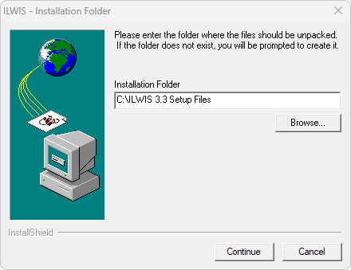
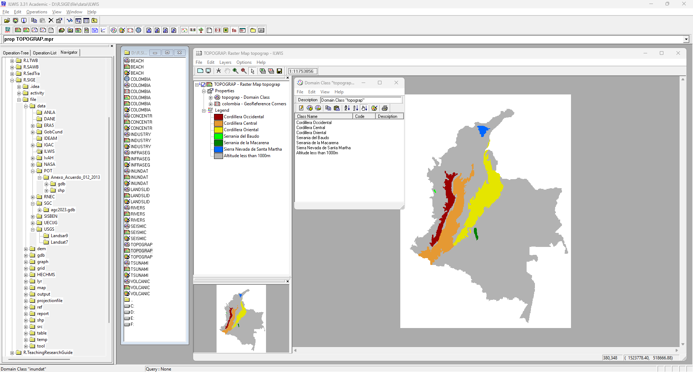

# ILWIS - Descarga y visualización de mapas base
Keywords: `integrated-land-and-water-information-system`

Descargue e instale [ILWIS 3.3](https://www.itc.nl/ilwis/download/), el paquete de actualización a la versión 3.31, y el paquete de datos y guía disponible en Exercises and data, correspondiente al caso de estudio 1. Hazard, vulnerability and risk analysis. Siguiendo las instrucciones de la guía de desarrollo del caso de estudio, visualice cada uno de los mapas disponibles y describa su contenido, consulte cada una de las tablas de dominio. Utilizando la opción Pixel Info, disponible en panel lateral Operation-Tree, visualice para todos los mapas, los valores representados en 3 localizaciones diferentes.     

## Objetivos

* Descargar y visualizar datos de amenazas naturales de Colombia. 

## Requerimientos

* [:mortar_board:Actividad](../TopoBasic/Readme.md): Conceptos básicos de topografía, fotogrametría y fotointerpretación.
* [:mortar_board:Actividad](../POTLayer/Readme.md): Inventario de información geo-espacial recopilada del POT y diccionario de datos.
* [:toolbox:Herramienta](https://www.esri.com/en-us/arcgis/products/arcgis-pro/overview): ESRI ArcGIS Pro 3.3.1 o superior.
* [:toolbox:Herramienta](https://qgis.org/): QGIS 3.38 o superior.

## 1. Instalación, descarga de paquete de datos y guía de desarrollo

1. Desde el enlace https://www.itc.nl/ilwis/download/, descargue e instale ILWIS 3.3 Academic y el paquete de actualización a la versión 3.31.

2. Descargue el paquete de datos y guía disponible en Exercises and data, correspondiente al caso de estudio [1. Hazard, vulnerability and risk analysis](https://www.itc.nl/ilwis/applications-guide/application-1/). Descomprima el paquete de datos en `\file\data\ILWIS`.

## 2. Visualización y descripción de objetos

1. Ingrese a la aplicación ILWIS 3.3 Academic, y desde el panel lateral izquierdo, localice la carpeta de datos `\file\data\ILWIS`. En la ventana flotante podrá observar el contenido de la carpeta.

Los datos de entrada incluyen las siguientes grillas y capa vectorial:

| Mapa / Capa   | Descripción                                                           |
|---------------|-----------------------------------------------------------------------|
| Colombia.mpr  | Departamentos de Colombia                                             |
| Landslid.mpr  | Regiones con problemas severos de deslizamientos                      |
| Volcanic.mpr  | Regiones con amenazas volcánicas                                      |
| Seismic.mpr   | Regiones con amenazas sísmicas                                        |
| Tsunami.mpr   | Regiones con amenazas de tsunamí debidas a ondas inducidas por sismos |
| Inundat.mpr   | Regiones con amenazas por inundación                                  |
| Rivers.mpr    | Regiones con actividad torrencial en ríos                             |
| Beach.mpr     | Regiones con erosión en playas y/o acumulación de sedimentos          |
| Industry.mpr  | Principales regiones industriales                                     |
| Infraseg.mpr  | Localización de infraestructura principal                             |
| Concentr.mpr  | Localización de zonas con concentración de actividades económicas     |
| Topograp.mpr  | Regiones topográficas de Colombia                                     |
| Colombia.mpa  | Límites de departamentos de Colombia en formato vectorial             |

2. De doble clic en la capa _Colombia.mpa_ y en la ventana de parámetros de visualización de clic en el botón _OK_. Podrá observar que este mapa tiene asociado el dominio _colombia_ y un sistema de coordenadas.

Como pudo observar, los elementos en ILWIS pueden tener asociados diferentes elementos, tales como:

| Extensión | Descripción de archivo                     |
|-----------|--------------------------------------------|
| .dom      | Clase de dominio o descriptores de objetos |
| .csy      | Sistema de proyección de coordenadas       |
| .grf      | Límite espacial o coordenadas de esquinas  |
| .mpa      | Capa vectorial                             |
| .mpr      | Grilla ráster                              |
| .rpr      | Paleta o estilos de color                  |

3. Visualice cada uno de los mapas disponibles y describa su contenido, consulte cada una de las tablas de dominio.

Mapa Landslid.mpr: Regiones con problemas severos de deslizamientos 

Mapa Volcanic.mpr: Regiones con amenazas volcánicas 

Mapa Seismic.mpr: Regiones con amenazas sísmicas 

Mapa Tsunami.mpr: Regiones con amenazas de tsunamí debidas a ondas inducidas por sismos 

Mapa Inundat.mpr: Regiones con amenazas por inundación 

Mapa Rivers.mpr: Regiones con actividad torrencial en ríos 

> En cuencas de pendientes fuertes existe la tendencia a la generación de crecientes en los ríos en tiempos relativamente cortos, estas cuencas se conocen como torrenciales, igual que los ríos que las drenan.[^1]

Mapa Beach.mpr: Regiones con erosión en playas y/o acumulación de sedimentos 

Mapa Industry.mpr: Principales regiones industriales 

Mapa Infraseg.mpr: Localización de infraestructura principal 

Mapa Concentr.mpr: Localización de zonas con concentración de actividades económicas    

Mapa Topograp.mpr: Regiones topográficas de Colombia 

4. Utilizando la opción _Pixel Info_, disponible en panel lateral *Operation-Tre*e, visualice para todos los mapas, los valores representados en varias localizaciones diferentes. Para ello, abra el mapa de Colombia y luego arrastre los mapas _Landslid_, _Volcanic_, _Tsunami_, _Inundat_, _Rivers_, _Beach_ y _Topograp_ a la misma ventana estableciendo transparencias en 50%.

En la ventana Pixel Information, agregue desde el menú _File / Add Map_ los diferentes mapas requeridos y luego localice el puntero del mouse en diferentes localizaciones.

## Actividades de proyecto :triangular_ruler:

En la siguiente tabla se listan las actividades que deben ser desarrolladas y documentadas por cada grupo de proyecto en un único archivo de Adobe Acrobat .pdf. El documento debe incluir portada (indicando el caso de estudio, número de avance, nombre del módulo, fecha de presentación, nombres completos de los integrantes), numeración de páginas, tabla de contenido, lista de tablas, lista de ilustraciones, introducción, objetivo general, capítulos por cada ítem solicitado, conclusiones y referencias bibliográficas.

| Actividad     | Alcance                                                                                                                                                                                                                                                                                                                                                                                                                                             |
|:--------------|:----------------------------------------------------------------------------------------------------------------------------------------------------------------------------------------------------------------------------------------------------------------------------------------------------------------------------------------------------------------------------------------------------------------------------------------------------|
| Avance **P7** | Realice las diferentes actividades desarrolladas en esta clase y visualice la información de los diferentes mapas en al menos 3 localizaciones diferentes.                                                                                                                                                                                                                                                                                          | 
| Avance **P7** | En una tabla y al final del informe de avance de esta entrega, indique el detalle de las sub-actividades realizadas por cada integrante de su grupo. Para actividades que no requieren del desarrollo de elementos de avance, indicar si realizo la lectura de la guía de clase y las lecturas indicadas al inicio en los requerimientos. Utilice las siguientes columnas: Nombre del integrante, Actividades realizadas, Tiempo dedicado en horas. | 

> No es necesario presentar un documento de avance independiente, todos los avances de proyecto de este módulo se integran en un único documento.
> 
> En el informe único, incluya un numeral para esta actividad y sub-numerales para el desarrollo de las diferentes sub-actividades, siguiendo en el mismo orden de desarrollo presentado en esta actividad.

## Referencias

* https://www.itc.nl/ilwis/
* https://www.itc.nl/ilwis/users-guide/
* https://www.itc.nl/ilwis/applications-guide/

## Control de versiones

| Versión    | Descripción                                                | Autor                                      | Horas |
|------------|:-----------------------------------------------------------|--------------------------------------------|:-----:|
| 2024.04.07 | Versión inicial con alcance de la actividad                | [rcfdtools](https://github.com/rcfdtools)  |   4   |
| 2024.09.27 | Investigación y documentación para caso de estudio general | [rcfdtools](https://github.com/rcfdtools)  |   4   |

_R.SIGE es de uso libre para fines académicos, conoce nuestra licencia, cláusulas, condiciones de uso y como referenciar los contenidos publicados en este repositorio, dando [clic aquí](LICENSE.md)._

_¡Encontraste útil este repositorio!, apoya su difusión marcando este repositorio con una ⭐ o síguenos dando clic en el botón Follow de [rcfdtools](https://github.com/rcfdtools) en GitHub._

| [:arrow_backward: Anterior](../RemoteSensingERA5/Readme.md) | [:house: Inicio](../../README.md) | [:beginner: Ayuda / Colabora](https://github.com/rcfdtools/R.SIGE/discussions/41) | [Siguiente :arrow_forward:](../ILWISWeight/Readme.md) |
|-------------------------------------------------------------|-----------------------------------|-----------------------------------------------------------------------------------|-------------------------------------------------------|

[^1]: https://www.cvc.gov.co/sites/default/files/Planes_y_Programas/Planes_de_Ordenacion_y_Manejo_de_Cuencas_Hidrografica/La%20Vieja%20-%20POMCA%20en%20Ajuste/Fase%20Diagnostico/7_CapituloI_Diagnostico_Morfometria.pdf