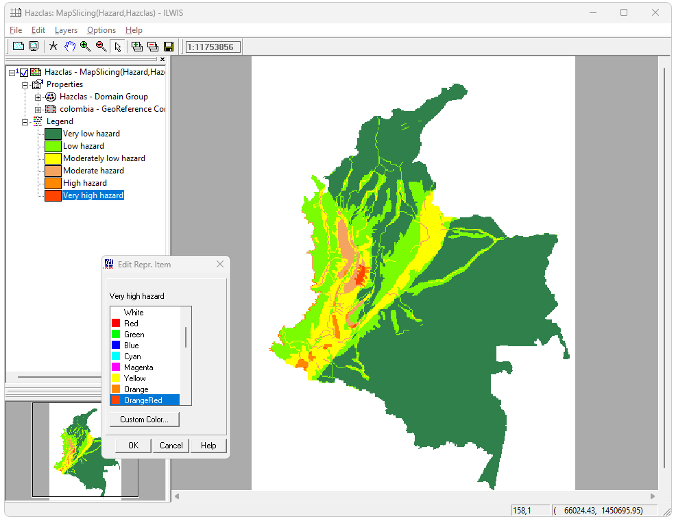
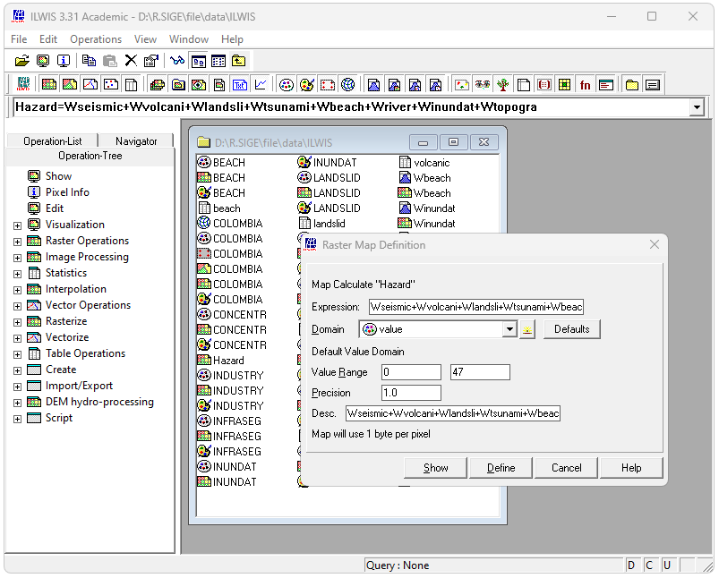
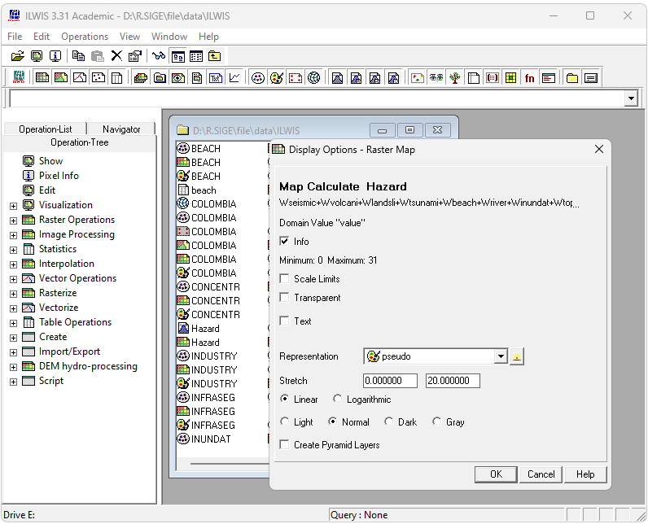
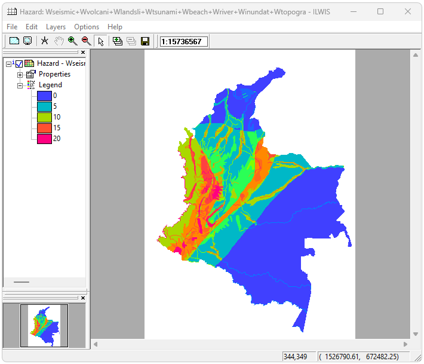
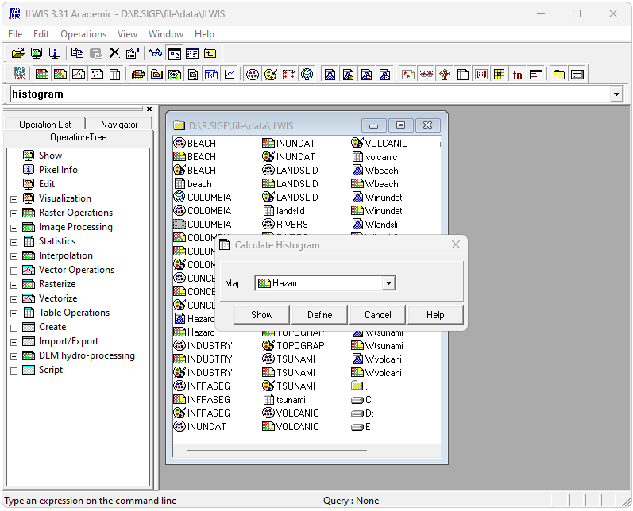
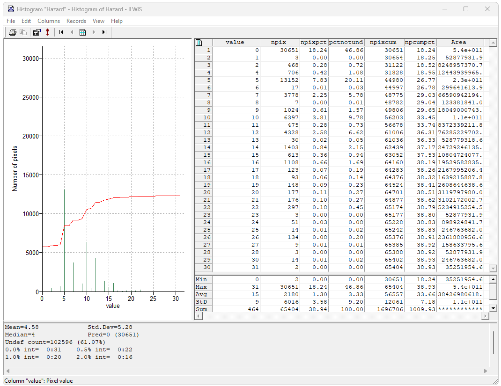
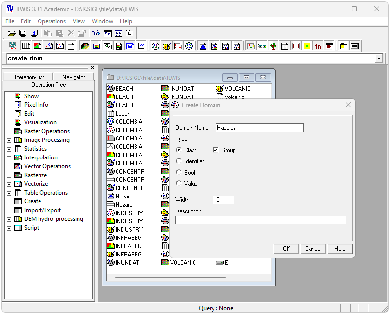
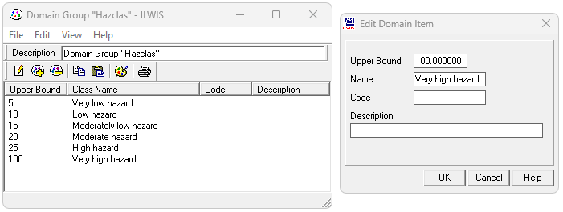
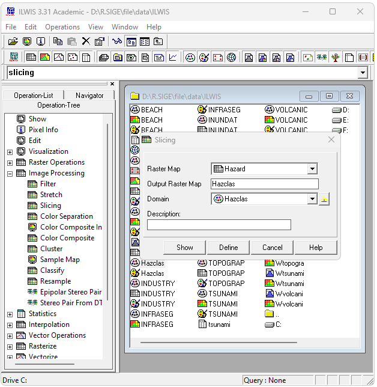
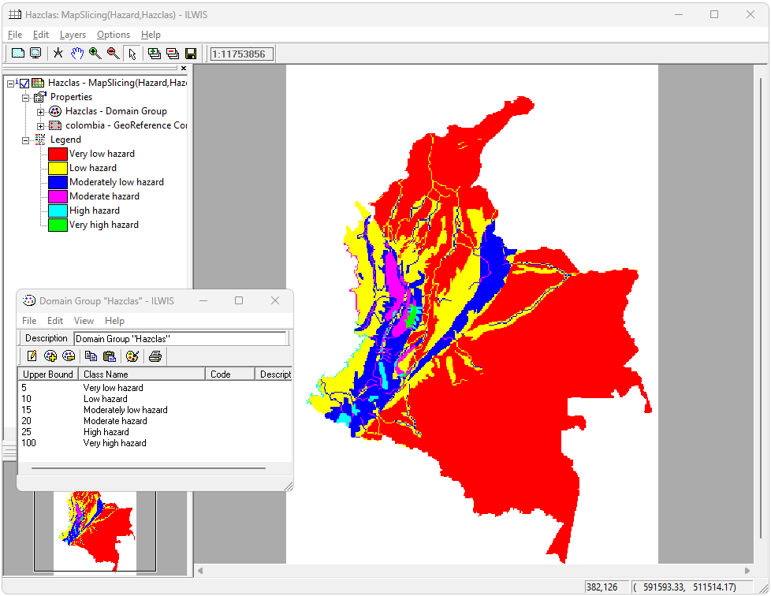

# ILWIS - Creación y clasificación del mapa combinado de amenazas
Keywords: `integrated-land-and-water-information-system` `hazard` `grid-map` `domain` `crs` `pixel-info`

Desde el Command Line, ejecute la expresión `Hazard=Wseismic+Wvolcani+Wlandslid+Wtsunami+Wbeach+Wriver+Winundat+Wtopogra` y obtenga el mapa de amenazas. Visualice el histograma generado y la tabla de estadísticos para las 32 diferentes combinaciones obtenidas. Explique los resultados obtenidos. Cree una tabla de dominio con el nombre Hazclas, de tipo Class y Group que incluya clases para clasificación de amenazas. Utilizando la herramienta Operation-Tree / Image Processing / Slicin, cree y visualice el mapa de clasificación para las 6 clases definidas. Nombrar como Hazclas y representar con los colores indicados. 

## Objetivos

* Crear y visualizar mapas de pesos para diferentes amenazas.
* Identificar los valores obtenidos en diferentes localizaciones. 

## Requerimientos

* [:toolbox:Herramienta](https://www.itc.nl/ilwis/): ILWIS 3.3 Academic.
* [:closed_book:Guía](https://www.itc.nl/ilwis/users-guide/): Guía de desarrollo caso de estudio amenazas con ILWIS.
* [:closed_book:Datos](https://www.itc.nl/ilwis/applications-guide/): Paquete de datos caso de estudio amenazas con ILWIS.

## 1. Procedimiento general

1. En ILWIS y desde el _Command Line_, ejecute el comando `Hazard=Wseismic+Wvolcani+Wlandsli+Wtsunami+Wbeach+Wriver+Winundat+Wtopogra` para obtener el mapa de amenazas correspondiente a la sumatoria de los diferentes mapas pesos generados en la actividad anterior. En la ventana emergente _Raster Map Definition_ de clic en el botón_Show_ y visualice utilizando la representación Pseudo..

2. Desde el menú _Operations_, ejecute la opción _Statistics / Histogram_ para el mapa _Hazard_, podrá observar que se han obtenido 30 diferentes valores discretos de amenazas.

> La ventana de estadísticos también incluye información del número de pixeles por clase, si distribución porcentual y área de cobertura en función de la resolución de la grilla de amenazas.

3. Para analizar el mapa de resultados, reclasificaremos los resultados en 6 clases utilizando los valores descritos en la siguiente tabla:

| Boundary  | Class                 | Color       | 
|:---------:|-----------------------|-------------|
|     5     | Very low hazard       | ForestGreen | 
|    10     | Low hazard            | LawnGreen   | 
|    15     | Moderately low hazard | Yellow      | 
|    20     | Moderate hazard       | SandyBrown  | 
|    25     | High hazard           | Orange      | 
|    100    | Very high hazard      | OrangeRed   | 

4. Cree una nueva tabla de dominio desde el menú _File / Create / Domain_, nombre como _Hazclas_ y seleccione las opciones _Class_ y _Group_. De clic en `OK`.

5. En la tabla de dominio, seleccione la opción _Edit / Add Item_ y cree los valores límite y etiquetas presentados en la tabla anterior.

6. Utilizando la herramienta _Operation-Tree / Image Processing / Slicin_, cree y visualice el mapa de clasificación para las 6 clases definidas. Nombrar como `Hazclas`.

Representar con los colores indicados en la tabla anterior.

## Actividades de proyecto :triangular_ruler:

En la siguiente tabla se listan las actividades que deben ser desarrolladas y documentadas por cada grupo de proyecto en un único archivo de Adobe Acrobat .pdf. El documento debe incluir portada (indicando el caso de estudio, número de avance, nombre del módulo, fecha de presentación, nombres completos de los integrantes), numeración de páginas, tabla de contenido, lista de tablas, lista de ilustraciones, introducción, objetivo general, capítulos por cada ítem solicitado, conclusiones y referencias bibliográficas.

| Actividad     | Alcance                                                                                                                                                                                                                                                                                                                                                                                                                                             |
|:--------------|:----------------------------------------------------------------------------------------------------------------------------------------------------------------------------------------------------------------------------------------------------------------------------------------------------------------------------------------------------------------------------------------------------------------------------------------------------|
| Avance **P7** | Realice las diferentes actividades desarrolladas en esta clase y visualice la información de los diferentes mapas de pesos en al menos 3 localizaciones diferentes.                                                                                                                                                                                                                                                                                 | 
| Avance **P7** | En una tabla y al final del informe de avance de esta entrega, indique el detalle de las sub-actividades realizadas por cada integrante de su grupo. Para actividades que no requieren del desarrollo de elementos de avance, indicar si realizo la lectura de la guía de clase y las lecturas indicadas al inicio en los requerimientos. Utilice las siguientes columnas: Nombre del integrante, Actividades realizadas, Tiempo dedicado en horas. | 

> No es necesario presentar un documento de avance independiente, todos los avances de proyecto de este módulo se integran en un único documento.
> 
> En el informe único, incluya un numeral para esta actividad y sub-numerales para el desarrollo de las diferentes sub-actividades, siguiendo en el mismo orden de desarrollo presentado en esta actividad.

## Referencias

* https://www.itc.nl/ilwis/
* https://www.itc.nl/ilwis/users-guide/
* https://www.itc.nl/ilwis/applications-guide/

## Control de versiones

| Versión    | Descripción                                                | Autor                                      | Horas |
|------------|:-----------------------------------------------------------|--------------------------------------------|:-----:|
| 2024.04.08 | Versión inicial con alcance de la actividad                | [rcfdtools](https://github.com/rcfdtools)  |   4   |
| 2024.09.28 | Investigación y documentación para caso de estudio general | [rcfdtools](https://github.com/rcfdtools)  |   4   |

_R.SIGE es de uso libre para fines académicos, conoce nuestra licencia, cláusulas, condiciones de uso y como referenciar los contenidos publicados en este repositorio, dando [clic aquí](LICENSE.md)._

_¡Encontraste útil este repositorio!, apoya su difusión marcando este repositorio con una ⭐ o síguenos dando clic en el botón Follow de [rcfdtools](https://github.com/rcfdtools) en GitHub._

| [:arrow_backward: Anterior](../ILWISDL/Readme.md) | [:house: Inicio](../../README.md) | [:beginner: Ayuda / Colabora](https://github.com/rcfdtools/R.SIGE/discussions/42) | [Siguiente :arrow_forward:](../ILWISHazard/Readme.md) |
|---------------------------------------------------|-----------------------------------|-----------------------------------------------------------------------------------|-------------------------------------------------------|

[^1]: 