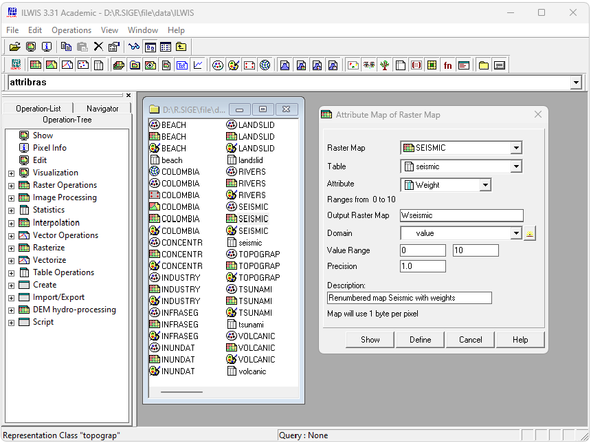

# ILWIS - Creación de mapas de pesos
Keywords: `dem` `agreedem`

Para los mapas Seismic, Volcanic, Landslid, Tsunami y Beach, cree tablas con los valores de los pesos que serán asignados a cada clase o valor. Utilice los valores de referencia indicados en el numeral 1.2 de la guía de desarrollo y asocie cada mapa con su tabla correspondiente. Utilizando la herramienta Operation-Tree/Raster Operations/Attribute Map of Raster Map, cree y visualice los mapas de pesos. Nombre los mapas usando el nombre original y agregando el prefijo W. Para los mapas Inundat, River, Topograp y utilizando expresiones desde la línea de comandos, genere y visualice los mapas de pesos. 

## Objetivos

* 

## Requerimientos

* [:mortar_board:Actividad](../TopoBasic/Readme.md): Conceptos básicos de topografía, fotogrametría y fotointerpretación.
* [:mortar_board:Actividad](../POTLayer/Readme.md): Inventario de información geo-espacial recopilada del POT y diccionario de datos.
* [:notebook:Lectura](https://edu.gcfglobal.org/es/estadistica-basica/): Conocimientos básicos en estadística.
* [:toolbox:Herramienta](https://www.microsoft.com/es/microsoft-365/excel?market=bz): Microsoft Excel 365.
* [:toolbox:Herramienta](https://www.esri.com/en-us/arcgis/products/arcgis-pro/overview): ESRI ArcGIS Pro 3.3.1 o superior.
* [:toolbox:Herramienta](https://qgis.org/): QGIS 3.38 o superior.
* [:open_file_folder:PoblacionDANE.xlsx](PoblacionDANE.xlsx): libro para registro y proyección de población DANE.

## 1. Creación de tablas de pesos

Para los mapas Seismic, Volcanic, Landslid, Tsunami y Beach, cree tablas con los valores de los pesos que serán asignados a cada clase o valor. Utilice los valores de referencia indicados en el numeral 1.2 de la guía de desarrollo y asocie cada mapa con su tabla correspondiente.

1. En ILWIS, seleccione la opción de menú _File / Create / Table_, defina como nombre _seismic_, seleccione el dominio _SEISMIC_ y de clic en el botón _OK_.

Asigne los pesos creando una columna nueva desde el menú _Columns / Add Column_, nombre como _Weight_, seleccione el Domain _Value_, defina el rango de valores entre 0 y 10 con precisión en 1.0 y de clic en _OK_:

Una vez creado el campo, rellene los valores de los pesos con los siguientes valores:

| Legend Seismic          | Weight |
|-------------------------|:------:|
| High seismic hazard     |   10   |
| Moderate seismic hazard |   5    |
| Low seismic hazard      |   0    |

> Tenga en cuenca que existen múltiples factores que definen el grado de amenaza dependiendo de la influencia de un mapa con respecto a los demás. Los pesos utilizados pueden ser subjetivos dependiendo del enfoque de análisis que se pretenda realizar, p. ej., si el enfoque de análisis es mayoritariamente, los valores de los pesos pueden ser entre 0 y 100, sí en enfoque es distributivo, se pueden utilizar pesos similares en las variables utilizando valores entre 0 y 10.

2. Repita el procedimiento anterior para las amenazas _Volcanic_, _Landslid_, _Tsunami_ y _Beach_ utilizando los siguientes valores:

| Legend **Volcanic** | Weight |
|---------------------|:------:|
| No Volcanic hazard  |   0    |
| Volcanic hazard     |   10   |

| Legend **Landslid**     | Weight |
|-------------------------|:------:|
| Narino                  |   2    |
| Region Huila            |   2    |
| Valle de Cauca          |   3    |
| Zona Cafetera           |   4    |
| Manizales y alrededores |   4    |
| Valle de Aburra         |   4    |
| Cundinamarca            |   3    |
| Boyaca and Santander    |   2    |
| Bucaramanga             |   2    |
| No landslide hazard     |   0    |

| Legend **Tsunami** | Weight |
|--------------------|:------:|
| Tsunami hazard     |   10   |
| No tsunami hazard  |   0    |

| Legend **Beach**           | Weight |
|----------------------------|:------:|
| Accumulation               |   0    |
| Accumulation and Erosion   |   1    |
| Erosion                    |   2    |
| No accumulation or erosion |   0    |

3. Desde las propiedades de cada mapa (clic derecho sobre cada mapa o grilla con extensión .mpr), asocie la tabla de pesos correspondiente. Asocie los 5 mapas con tablas de pesos. 

Abra cada mapa y verifique que la tabla de pesos se encuentre asociada y sea visible.

> La creación de los mapas de pesos correspondientes a los mapas _Inundat_, _River_ y _Topograf_ se realiza mediante un procedimiento independiente, toda vez que estos mapas únicamente serán evaluados a partir de un único peso.

## 2. Creación de mapas de pesos con tablas asociadas

Utilizando la herramienta Operation-Tree/Raster Operations/Attribute Map of Raster Map, cree y visualice los mapas de pesos. Nombre los mapas usando el nombre original y agregando el prefijo W

Para la creación de los mapas de pesos, ejecute la opción de menú _Operations / Raster Operations / Attibute Map_. Seleccione el mapa ráster _Seismic_, la tabla de atributos _seismic_ y el atributo de peso Weight, asigne como nombre de mapa _Wseismic_ y en la descripción indique _Renumbered map Seismic with weights_ y de clic en _Show_ y _OK_.

En la ventana de visualización, seleccione el tipo de representación _pseudo_ y de clic en _OK_.

En la visualización podrá observar que al dar clic sobre el mapa en cualquier localización, ya no es visible el nombre de la clase sino el valor de peso asignado.

Repita el procedimiento anterior para los mapas _Beach_, _Landslid_, _tsunami_ y _volcanic_ creando los mapas de pesos _Wlandsli_, _Wvolcani_, _Wtsunami_ y _Wbeach_ e ingresando descripciones como _Renumbered map xxxxxx with weights_.

## 3. Creación de mapas de pesos sin tablas asociadas

Para los mapas _Inundat_, _River_, _Topograp_ y utilizando las siguientes expresiones desde la línea de comandos, cree y visualice los mapas de pesos:

Expresiones:  
`Winundat=iff(INUNDAT="No inundation hazard",0,5)`  
`Wriver=iff(RIVERS="No river",0,4)`  
`Wtopogra=iff(TOPOGRAP="Altitude less than 1000m",0,2)`  

## Actividades de proyecto :triangular_ruler:

En la siguiente tabla se listan las actividades que deben ser desarrolladas y documentadas por cada grupo de proyecto en un único archivo de Adobe Acrobat .pdf. El documento debe incluir portada (indicando el caso de estudio, número de avance, nombre del módulo, fecha de presentación, nombres completos de los integrantes), numeración de páginas, tabla de contenido, lista de tablas, lista de ilustraciones, introducción, objetivo general, capítulos por cada ítem solicitado, conclusiones y referencias bibliográficas.

| Actividad     | Alcance                                                                                                                                                                                                                                                                                                                                                                                                                                             |
|:--------------|:----------------------------------------------------------------------------------------------------------------------------------------------------------------------------------------------------------------------------------------------------------------------------------------------------------------------------------------------------------------------------------------------------------------------------------------------------|
| Avance **P7** | Esta actividad no requiere del desarrollo de elementos en el avance del proyecto final, los contenidos son evaluados en el quiz de conocimiento y habilidad.                                                                                                                                                                                                                                                                                        | 
| Avance **P7** | :compass:Mapa digital impreso _P7-1: xxxx_ Incluir xxxxx. Embebido dentro del informe final como una imágen y referenciados como anexo.                                                                                                                                                                                                                                                                                                          | 
| Avance **P7** | En una tabla y al final del informe de avance de esta entrega, indique el detalle de las sub-actividades realizadas por cada integrante de su grupo. Para actividades que no requieren del desarrollo de elementos de avance, indicar si realizo la lectura de la guía de clase y las lecturas indicadas al inicio en los requerimientos. Utilice las siguientes columnas: Nombre del integrante, Actividades realizadas, Tiempo dedicado en horas. | 

> No es necesario presentar un documento de avance independiente, todos los avances de proyecto de este módulo se integran en un único documento.
> 
> En el informe único, incluya un numeral para esta actividad y sub-numerales para el desarrollo de las diferentes sub-actividades, siguiendo en el mismo orden de desarrollo presentado en esta actividad.

## Referencias

* 

## Control de versiones

| Versión    | Descripción                                                | Autor                                      | Horas |
|------------|:-----------------------------------------------------------|--------------------------------------------|:-----:|
| 2024.02.24 | Versión inicial con alcance de la actividad                | [rcfdtools](https://github.com/rcfdtools)  |   4   |
| 2024.06.27 | Investigación y documentación para caso de estudio general | [rcfdtools](https://github.com/rcfdtools)  |   8   |

_R.SIGE es de uso libre para fines académicos, conoce nuestra licencia, cláusulas, condiciones de uso y como referenciar los contenidos publicados en este repositorio, dando [clic aquí](LICENSE.md)._

_¡Encontraste útil este repositorio!, apoya su difusión marcando este repositorio con una ⭐ o síguenos dando clic en el botón Follow de [rcfdtools](https://github.com/rcfdtools) en GitHub._

| [:arrow_backward: Anterior](../xxxx) | [:house: Inicio](../../README.md) | [:beginner: Ayuda / Colabora](https://github.com/rcfdtools/R.SIGE/discussions/99999) | [Siguiente :arrow_forward:]() |
|---------------------|-------------------|---------------------------------------------------------------------------|---------------|

[^1]: 