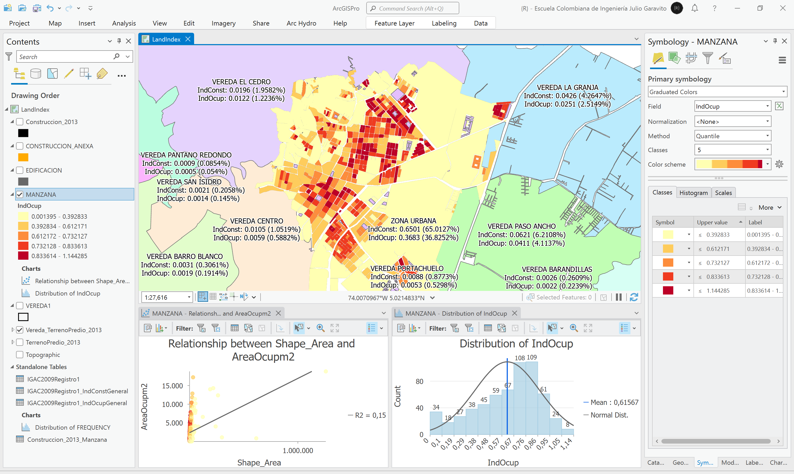
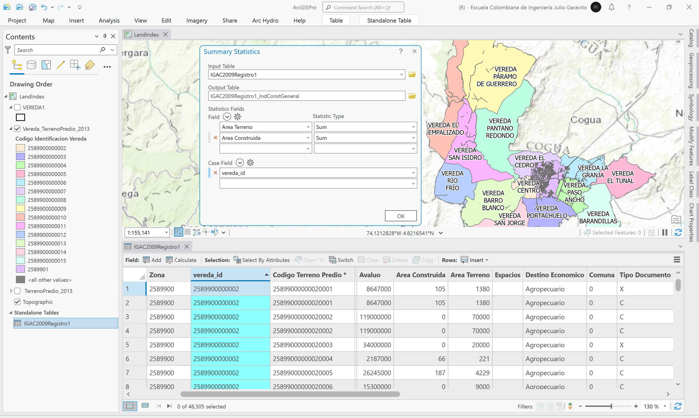

# Índices de ocupación y construcción del suelo
Keywords: `land-index` `land-occupation`

Utilizando las tablas del registro 1 de catastro, calcule el índice de ocupación y el índice de construcción municipal en cada vereda, en la zona urbana y en cada manzana. Una los resultados obtenidos con la capa de veredas DANE y manzanas IGAC y cree un mapa que simbolice o represente los valores obtenidos.  

## Objetivos

* Estimar el índice de ocupación y construcción municipal.
* Representar geográficamente los índices obtenidos.

## Requerimientos

* [:mortar_board:Actividad](../POTLayer/Readme.md): Inventario de información geo-espacial recopilada del POT y diccionario de datos.
* [:mortar_board:Actividad](../LandUseIGAC/Readme.md): Análisis de destinaciones económicas IGAC (creación de dominios).
* [:mortar_board:Actividad](../CountyLimit/Readme.md): Análisis veredal y límite territorial.
* [:toolbox:Herramienta](https://www.esri.com/en-us/arcgis/products/arcgis-pro/overview): ESRI ArcGIS Pro 3.3.1 o superior.
* [:toolbox:Herramienta](https://qgis.org/): QGIS 3.38 o superior.

## 0. Definiciones

| Índice                  | Descripción[^1]                                                                                                                                                                                                                                                     | Interpretación                                              |
|-------------------------|---------------------------------------------------------------------------------------------------------------------------------------------------------------------------------------------------------------------------------------------------------------------|-------------------------------------------------------------|
| Indice de ocupación     | Es la proporción del área de suelo que puede ser ocupada por edificación en primer piso bajo cubierta, y se expresa por el cociente que resulta de dividir el área que puede ser ocupada por edificación en primer piso bajo cubierta por el área total del predio. | Se interpreta como el desarrollo horizontal de un inmueble. |
| Índice de construcción  | Es el número máximo de veces que la superficie de un terreno puede convertirse por definición normativa en área construida, y se expresa por el cociente que resulta de dividir el área permitida de construcción por el área total de un predio.                   | Se interpreta como el desarrollo vertical de un inmueble.   |

Para el análisis de estos índices, se pueden utilizar diferentes estrategias:

| Estrategia                           | Descripción                                                                                                                                                                                                                                                                                                                                                                          |
|--------------------------------------|--------------------------------------------------------------------------------------------------------------------------------------------------------------------------------------------------------------------------------------------------------------------------------------------------------------------------------------------------------------------------------------|
| A partir de registros catastrales    | Las tablas del registro catastral 1 y 2 del IGAC, contiene información detallada de las características generales y físicas de los inmuebles. Se actualizan con mayor frecuencia que las bases prediales vectoriales, sin embargo, las áreas de predios y construcciones registradas pueden no corresponder con el área geodésica o planar de las capas de predios y construcciones. |
| A partir de información cartográfica | A partir de la cartografía digital de predios y construcciones y sus áreas planares o geodésicas, se puede realizar el análisis de ocupación, sin embargo, no es posible calcular indice de construcción. Generalmente, las bases vectoriales prediales, no contienen el mismo número de predios que contienen las tablas de registros catastrales.                                  |
| Por foto-interpretación              | Utilizando imágenes satelitales históricas, se puede evaluar el desarrollo progresivo de las construcciones y calcular las ocupaciones, sin embargo, la resolución espacial de captura es una limitante en construcciones pequeñas y el tiempo de procesamiento puede ser extenso si no se implementan algoritmos de aprendizaje.                                                    |

> En esta actividad, desarrollaremos el análisis a partir de registros catastrales combinados con información geográfica.

## 1. Obtención de zonas geopolíticas y categorización de registros catastrales

1. Abra el proyecto de ArcGIS Pro, creado previamente y desde el menú _Insert_ cree un nuevo mapa _New Map_, renombre como _LandIndex_ y establezca el CRS 9377. Agregue al mapa la capa de predios creada en la actividad [Análisis de destinaciones económicas IGAC](../LandUseIGAC/Readme.md), nombrada como `\file\gdb\SIGE.gdb\SIGE\TerrenoPredio_2013`, ajuste la simbología a valores únicos representando el campo de atributos `vereda_id`.  

> Previamente, a los predios de la zona urbana, se les asignó el código `vereda_id` = 2589901, con el propósito de poder crear análisis estadísticos y poblar completamente este campo. 

2. Utilizando la herramienta de geo-procesamiento _Data Managenet Tools / Dissolve_, disuelva los predios a partir del campo `vereda_id`, nombre como `\file\gdb\SIGE.gdb\SIGE\Vereda_TerrenoPredio_2013`. Abra la tabla de atributos, podrá observar que se obtienen 15 polígonos y que no se encuentra el nombre de las veredas y del área urbana.

> La disolución de predios para obtener los límites geopolíticos internos del municipio, no incluyen las áreas correspondientes a los corredores viales. Para el análisis de índices de ocupación y construcción, utilizaremos únicamente el área correspondiente a las unidades inmobiliarias.

3. Para asignar incluir los nombres de las veredas en la capa disuelta, cree un campo de texto de 100 caracteres de longitud e identifíquelo como `ZonaGeo`. Agregue la capa de veredas utilizadas en el diagnóstico del POT desde la ruta `\file\gdb\SIGE.gdb\POT2013Formulacion\VEREDA1` y realice un _Join_ o unión de registros en la capa disuelta.  

4. Utilizando el calculador de campo sobre `ZonaGeo`, asigne el nombre de vereda contenido en el campo `nombre` de la capa _VEREDA1_.

5. Remueva la unión de campo e ingrese manualmente el nombre del área urbana. Rotule a partir del campo `ZonaGeo`.

> Recuerde que en el análisis veredal realizado en la actividad [Análisis veredal y límite territorial.](../CountyLimit/Readme.md), evidenciamos que los códigos veredales y nombres de veredas DANE, fueron actualizados en el año 2020. Para este ejemplo, utilizaremos la codificación utilizada en la formulación del POT del año 2013.

6. Agregue al mapa la tabla del registro 1 de catastro del IGAC, disponible en la ruta `\file\gdb\SIGE.gdb\IGAC2009Registro1` y cree los siguientes atributos:

| Campo     | Descripción                   | Tipo      | Propiedad ArcGIS Pro | 
|-----------|-------------------------------|-----------|----------------------| 
| Zona      | Zona urbana o rural           | text (7)  | n/a                  |
| vereda_id | Código veredal                | text (30) | n/a                  |

7. Utilizando el calculador de campo sobre `Zona`, obtenga los 7 primeros dígitos del campo `PRE_COD` de cada uno de los 46305 registros de esta tabla (`Zona=!PRE_COD![:7]`).

8. Seleccione por atributos, los registros rurales cuyo código de zona es _2589900_ (15063 registros catastrales) y utilizando el calculador de campo, asigne en `vereda_id`, los 13 primeros dígitos del campo `PRE_COD` (`vereda_id=!PRE_COD![:13]`). 

9. Seleccione por atributos, los registros urbanos cuyo código de zona es _2589901_ (31242 registros catastrales) y utilizando el calculador de campo, asigne en `vereda_id`, los 7 primeros dígitos del campo `PRE_COD` (`vereda_id=!PRE_COD![:7]`). 

De esta forma, ha obtenido en cada registro catastral, los mismos códigos de vereda de los polígonos generados previamente en la disolución de predios.

## 2. Índice general de construcción 

1. En la tabla de atributos _IGAC2009Registro1_, y utilizando la herramienta de resúmen estadístico o _Summarize_ sobre el campo de atributos `vereda_id`, genere una tabla que consolide el total de metros construídos en cada zona geográfica definida. Nombre la tabla como `\file\gdb\SIGE.gdb\IGAC2009Registro1_IndConstGeneral`.

2. Abra la tabla de resumen generada, podrá observar que contienen el conteo de registros utilizados en cada zona, la sumatoria de área catastral construída y la sumatoria del área de las construcciones.

> Tenga en cuenta que en predios que contienen mejoras y propiedades horizontales, el área total de terreno obtenida, incluye la sumatoria múltiple de las áreas del mismo predio. Por ejemplo, si un predio de 100 m² posee internamente 4 mejoras, la sumatoria de terreno obtenida en el resumen estadístico de este predio será de 400 m². Al calcular los índices de construcción a partir de esta sumatoria, obtendrá valores errados y menores al índice de construcción real del predio. Es por ello que el cálculo del índice general se debe realizar a partir del área planar o geodésica de los polígonos disueltos a partir de las unidades prediales.  

3. En la capa _Vereda_TerrenoPredio_2013_, agregue 3 campos numéricos dobles con los nombres `AGm2`, `AreaConsm2`, `IndConst`. Luego cree un _Join_ o unión de tablas con los registros obtenidos del resúmen estadístico _IGAC2009Registro1_IndConstGeneral_

4. Utilizando el calculador de geometría, calcule el área geodésica `AGm2` de cada zona geográfica y asigne en `AreaConsm2` el valor obtenido en el campo `SUM_area_construida`.

5. Remueva la unión y calcule el índice de construcción dividiendo el área total construída entre el área total de la zona (`IndConst = !AreaConsm2!/!AGm2!`). Modifique el rótulo incluyendo el índice obtenido. Podrá observar que el área urbana tiene el mayor índice correspondiente a 0.65 o 65% de construcción, y que las veredas por ser rurales, presentan índices comparativamente menores. 

Rótulo Arcade: `$feature.ZonaGeo + '\nIndConst: ' + round($feature.IndConst, 4) + " (" + round($feature.IndConst*100, 4) + "%)"`

6. Cree una gráfica de barras representando los índices obtenidos.

## 3. Índice general de ocupación

Para la estimación del índice de ocupación, es necesario excluir de la tabla de registros catastrales, los propietarios secudarios y los identificadores de condición de propiedad y número de construcción repetidos; para ello, incluiremos en el análisis solo los valores con los códigos indicados en la siguiente tabla:

|  Condición de propiedad  | Descripción[^2]                                                                                         | Código a incluir |
|:---------------------------:|---------------------------------------------------------------------------------------------------------|:----------------:|
|              0              | Predio no reglamentado en propiedad horizontal - PH                                                     |       000        |
|              9              | Predio en propiedad horizontal - PH                                                                     |       901        |
|              8              | Predio en condominio                                                                                    |       801        |
|              7              | Parques cementerios                                                                                     |       701        |
|              6              | Mejoras por edificaciones en terreno ajeno en propiedad horizontal - PH                                 |       601        |
|              5              | Mejoras por edificaciones en terreno ajeno de propiedades no reglamentadas en propiedad horizontal - PH |       501        |
|              4              | Vías                                                                                                    |       401        |
|              3              | Bienes de uso público diferentes a las vías                                                             |       301        |
|              2              | No Ley 14 de 1983                                                                                       |       201        |

> El código de inclusión dependerá de las mutaciones catastrales contenidas en el municipio, en municipios con formación catastral antigua no actualizada, algunos de los códigos primarios (201, 301, 401...) no fueron conservados dinámicamente.

1. En la tabla _IGAC2009Registro1_, cree un campo de texto de 3 caracteres con el nombre _CPropCons_, utilizando el calculador de campo, obtenga los 3 dígitos finales del campo `CODPROPIEDAD`.

2. Desde el _Definition Query_ de la tabla de registros catastrales, filtre las filas correspondientes a números de orden 001 y condición de propiedad y construcción primarios. Obtendrá 27108 registros que no coinciden exactamente con el número de unidades prediales presentes en la capa _TerrenoPredio_2013_, correspondientes a 26304 (804 registros más).

> La diferencia principal se debe a que el registro 1 contienen más registros de propiedad primaria que las unidades prediales incluídas en la capa de predio. Generalmente, los procesos de actualización predial no son incorporados en la capa de vectores inmediatamente de la expedición de resolución de subdivisión. 

Definition Query para este ejemplo: `num_orden = '001' And CPropCons IN ('000', '201', '801', '901', '329')`

3. En la tabla de atributos _IGAC2009Registro1_, y utilizando la herramienta de resúmen estadístico o _Summarize_ sobre el campo de atributos `vereda_id`, genere una tabla que consolide el total de metros construídos en cada zona geográfica definida. Nombre la tabla como `\file\gdb\SIGE.gdb\IGAC2009Registro1_IndOcupGeneral`.

4. Abra la tabla de obtenida y verifique su contenido. Verifique que la sumatoria de las frecuencias sea igual al total de registros filtrados, correspondientes a 27108, para ello, en la cabecera de columna del campo `FRECUENCY` de clic derecho y seleccione la opción _Visualize Statistics_.

5. En la capa _Vereda_TerrenoPredio_2013_, agregue 2 campos numéricos dobles con los nombres `AreaOcupm2` e `IndOcup`. Luego cree un _Join_ o unión de tablas con los registros obtenidos del resúmen estadístico _IGAC2009Registro1_IndOcupGeneral_

6. Utilizando el calculador de campo, asigne en `AreaOcupm2` el valor obtenido en el campo `SUM_area_construida`. Como observa, el área ocupada es menor que el área construída.

7. Remueva la unión y calcule el índice de ocupación dividiendo el área total ocupada entre el área total de la zona (`IndOcup = !AreaOcupm2!/!AGm2!`). Modifique el rótulo incluyendo el índice obtenido. Podrá observar que el área urbana tiene el mayor índice correspondiente a 0.65 o 65% de construcción, y que las veredas por ser rurales, presentan índices comparativamente menores. 

Rótulo Arcade: `$feature.ZonaGeo + '\nIndConst: ' + round($feature.IndConst, 4) + " (" + round($feature.IndConst*100, 4) + "%)\nIndOcup: " + round($feature.IndOcup, 4) + " (" + round($feature.IndOcup*100, 4) + "%)" `

6. Cree una gráfica de barras representando los índices obtenidos.

## 4. Índice de ocupación por manzana urbana

1. Desde la ruta `\file\gdb\SIGE.gdb\IGAC2013Urbano\`. agregue al mapa las capas _MANZANA_, _EDIFICACION_ y _CONSTRUCCION_ANEXA_. Simbolice utilizando colores que permitan diferencias las construcciones y rotule las manzanas a partir de campo `codigo`.

2. Utilizando la herramienta de geo-procesamiento _Data Management Tools / Merge_, combine los polígonos de las construcciones en una única capa, nombre como `\file\gdb\SIGE.gdb\SIGE\Construccion_2013`. 

3. En la capa combinada, cree un campo de numérico doble con el nombre `AGm2` y calcule el área geodésica de cada construcción, también cree un campo de texto de 30 caracteres de longitud con el nombre `ManzanaId` y asigne los primeros 13 caracteres del campo `terreno_predio_id`.

4. Utilizando la herramienta _Summarize_ sobre el campo `ManzanaId` de la capa de construcciones integradas, genere un resúmen estadístico totalizando el área ocupada en cada manzana. Nombre como `\file\gdb\SIGE.gdb\Construccion_2013_Manzana`. Como observa, en cada manzana ha obtenido el número de construcciones que la ocupan y el área tota de ocupación.

5. En la capa de manzanas urbanas, cree dos campos numéricos dobles con los nombres `AreaOcupm2` e `IndOcup`. Luego realice un _Join_ o unión con la tabla de resumen estadístico de construcciones por manzana.

6. Utilizando el calculador de campo sobre `AreaOcupm2` de la capa de manzanas, asigne el valor `SUM_AGm2` de la tabla de resúmen estadístico.

7. Remueva la unión y en el campo `IndOcup`, calcule el índice de ocupación dividiendo el total del área ocupada entre el área total de la manzana.

## 5. Análisis usando software libre - QGIS

Para el desarrollo de las actividades desarrolladas en esta clase, se pueden utilizar en QGIS las siguientes herramientas o geo-procesos:

| Proceso            | Procedimiento                                                           |
|:-------------------|:------------------------------------------------------------------------|
| Simbología         | Modificable desde las propiedades de la capa en la pestaña _Symbology_. |
| Rotulado           | Modificable desde las propiedades de la capa en la pestaña _Labels_.    |

Ejemplo rótulo en QGIS: `'A(ha): ' ||  round("AGha", 2) || '\n' || 'P (m): ' ||  round("PGm", 2) `

[:notebook:QGIS training manual](https://docs.qgis.org/3.34/en/docs/training_manual/)  
[:notebook:Herramientas comúnmente utilizadas en QGIS](../QGIS.md)

## Elementos requeridos en diccionario de datos

Agregue a la tabla resúmen generada en la actividad [Inventario de información geo-espacial recopilada del POT y diccionario de datos](../POTLayer/Readme.md), las capas generadas en esta actividad que se encuentran listadas a continuación:

| Nombre                           | Descripción                                                                                                                  | Geometría   | Registros | 
|----------------------------------|------------------------------------------------------------------------------------------------------------------------------|-------------|-----------| 
|                                  |                                                                                                                              | Polígono 2D | 14        | 
|                                  |                                                                                                                              | Polígono 2D | 14        | 
|                                  |                                                                                                                              | Polígono 2D | 14        | 

> :bulb:Para funcionarios que se encuentran ensamblando el SIG de su municipio, se recomienda incluir y documentar estas capas en el Diccionario de Datos.

## Actividades de proyecto :triangular_ruler:

En la siguiente tabla se listan las actividades que deben ser desarrolladas y documentadas por cada grupo de proyecto en un único archivo de Adobe Acrobat .pdf. El documento debe incluir portada (indicando el caso de estudio, número de avance, nombre del módulo, fecha de presentación, nombres completos de los integrantes), numeración de páginas, tabla de contenido, lista de tablas, lista de ilustraciones, introducción, objetivo general, capítulos por cada ítem solicitado, conclusiones y referencias bibliográficas.

| Actividad     | Alcance                                                                                                                                                                                                                                                                                                                                                                                                                                             |
|:--------------|:----------------------------------------------------------------------------------------------------------------------------------------------------------------------------------------------------------------------------------------------------------------------------------------------------------------------------------------------------------------------------------------------------------------------------------------------------|
| Avance **P3** | Esta actividad no requiere del desarrollo de elementos en el avance del proyecto final, los contenidos son evaluados en el quiz de conocimiento y habilidad.                                                                                                                                                                                                                                                                                        | 
| Avance **P3** | :compass:Mapa digital impreso _P3-1: xxxx_ Incluir xxxxx. Embebido dentro del informe final como una imágen y referenciados como anexo.                                                                                                                                                                                                                                                                                                          | 
| Avance **P3** | En una tabla y al final del informe de avance de esta entrega, indique el detalle de las sub-actividades realizadas por cada integrante de su grupo. Para actividades que no requieren del desarrollo de elementos de avance, indicar si realizo la lectura de la guía de clase y las lecturas indicadas al inicio en los requerimientos. Utilice las siguientes columnas: Nombre del integrante, Actividades realizadas, Tiempo dedicado en horas. | 

> No es necesario presentar un documento de avance independiente, todos los avances de proyecto de este módulo se integran en un único documento.
> 
> En el informe único, incluya un numeral para esta actividad y sub-numerales para el desarrollo de las diferentes sub-actividades, siguiendo en el mismo orden de desarrollo presentado en esta actividad.

## Referencias

* https://geoportal.igac.gov.co/contenido/datos-abiertos-catastro
* https://datos.icde.gov.co/search?collection=dataset&q=CATASTRO
* [Reglamentación técnica de la formación catastral, la actualización de la formación catastral y la conservación catastral, IGAC.](https://antiguo.igac.gov.co/sites/igac.gov.co/files/normograma/resolucion_70_de_2011.pdf)

## Control de versiones

| Versión    | Descripción                                                | Autor                                      | Horas |
|------------|:-----------------------------------------------------------|--------------------------------------------|:-----:|
| 2024.02.24 | Versión inicial con alcance de la actividad                | [rcfdtools](https://github.com/rcfdtools)  |   4   |
| 2024.06.27 | Investigación y documentación para caso de estudio general | [rcfdtools](https://github.com/rcfdtools)  |   8   |

_R.SIGE es de uso libre para fines académicos, conoce nuestra licencia, cláusulas, condiciones de uso y como referenciar los contenidos publicados en este repositorio, dando [clic aquí](LICENSE.md)._

_¡Encontraste útil este repositorio!, apoya su difusión marcando este repositorio con una ⭐ o síguenos dando clic en el botón Follow de [rcfdtools](https://github.com/rcfdtools) en GitHub._

| [:arrow_backward: Anterior](../LandUseIGAC/Readme.md) | [:house: Inicio](../../README.md) | [:beginner: Ayuda / Colabora](https://github.com/rcfdtools/R.SIGE/discussions/99999) | [Siguiente :arrow_forward:]() |
|-------------------------------------------------------|-----------------------------------|--------------------------------------------------------------------------------------|-------------------------------|

[^1]: https://www.sdp.gov.co/sites/default/files/dts_0.pdf
[^2]: [Reglamentación técnica de la formación catastral, la actualización de la formación catastral y la conservación catastral, IGAC.](https://antiguo.igac.gov.co/sites/igac.gov.co/files/normograma/resolucion_70_de_2011.pdf)