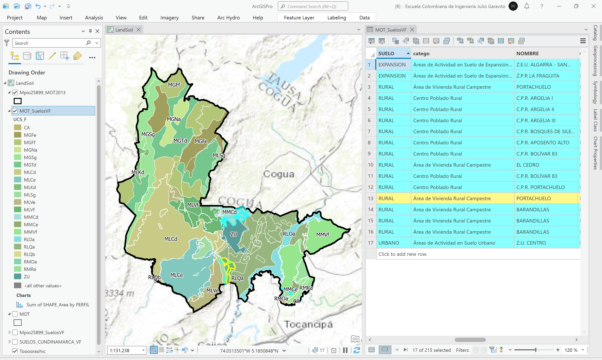

# Mapa de suelos, vocación de uso y conflictos de uso de Colombia vs. MOT
Keywords: `land-soil` `land-conflict` `land-potential-use`

Descargue el Mapa de Suelos, vocación de uso y conflictos de uso de Colombia del IGAC y recorte hasta el límite municipal del mapa MOT del POT. Describa y explique los tipos de suelos presentes en la zona de estudio. Utilizando la herramienta de geoprocesamiento Intersect, combine el modelo de ocupación territorial MOT con las capas de suelos. A través de un resumen estadístico, obtenga por cada categoría del MOT, los tipos de suelos presentes, usos potenciales, conflictos de uso y sus áreas.  

## Objetivos

* Estudiar los tipos de suelos presentes en la zona de estudio, sus vocaciones principales y los conflictos identificados por la autoridad catastral.
* Identificar íncompatibilidades entre suelos y el modelo de ocupación territorial - MOT.

## Requerimientos

* [:mortar_board:Actividad](../POTLayer/Readme.md): Inventario de información geo-espacial recopilada del POT y diccionario de datos.
* [:toolbox:Herramienta](https://www.microsoft.com/es/microsoft-365/excel?market=bz): Microsoft Excel 365.
* [:toolbox:Herramienta](https://www.esri.com/en-us/arcgis/products/arcgis-pro/overview): ESRI ArcGIS Pro 3.3.1 o superior.
* [:toolbox:Herramienta](https://qgis.org/): QGIS 3.38 o superior.

## 1. Mapa de suelos de la zona de estudio

El mapa de suelos del Departamento de Cundinamarca, ha sido creado por el [Instituto Geográfico Agustín Codazzi](https://www.igac.gov.co/) - Subdirección de Agrología - Grupo Interno de Trabajo Geomática - Carrera 30 # 48 - 51 – Sede Central, Bogotá D.C, Departamento de Cundinamarca, 111321, República de Colombia. Autor: german.alvarez@igac.gov.co (Subdirector de Agrología), +57 1 3694100 Ext. 91007

Este mapa temático representa la distribución de las características del suelo, determinadas mediante el levantamiento general de suelos del departamento de Cundinamarca a escala 1:100.000, publicado en el año 2001. Suministra información importante acerca del recurso suelo, a través de la descripción e interpretación de sus ambientes edafogenéticos, sus características físicas, químicas, mineralógicas y morfológicas, su taxonomía y distribución espacial, como base para la determinación de sus potenciales productivos, describiendo las limitantes de uso.

Los Levantamientos Generales de Suelos de los departamentos del Territorio Colombiano suministran información importante acerca del recurso suelo; a través de la descripción e interpretación de su génesis, características físicas, químicas, mineralógicas, morfológicas, taxonomía y distribución, como base para la determinación de sus potencialidades y limitaciones de uso.

**Estirpe**: la generación del Mapa Digital de Suelos, para el levantamiento general de suelos, escala 1:100.000, se realizó a partir de los parámetros definidos por la Subdirección de Agrología del Instituto Geográfico Agustín Codazzi, para el objeto: Suelos. Para la elaboración del levantamiento, el GIT de Levantamientos de Suelos y Aplicaciones Agrológicas, en la etapa de precampo recopiló información secundaria proveniente de estudios de suelos anteriores, e investigaciones sobre los factores formadores del suelo, tales como clima, geología y geomorfología, los cuales se interpretan con el apoyo de insumos de cartografía, sensores remotos y fotointerpretación. Posteriormente, en la etapa de campo se realiza la descripción de las observaciones tipo cajuelas o barrenaje, y calicatas, ajuste a las líneas de interpretación y recolección de muestras que serán analizadas por el Laboratorio Nacional de Suelos. La sistematización y georreferenciación de esta información sirve de apoyo fundamental para el trazo de las líneas de suelos, que son digitalizadas sobre cartografía base, imágenes de sensores remotos, modelos digitales de elevación, entre otros. Finalmente en la etapa de poscampo se consolidó la leyenda de suelos del estudio, la cartografía temática con sus diferentes atributos y la memoria técnica respectiva. 

* Fuente: https://www.colombiaenmapas.gov.co/, buscar como _Suelos Cundinamarca_
* Extensión espacial: Departamento de Cundinamarca - Colombia - Suramérica
* Escala: 1:100000
* Sistema de referencia de coordenadas: 3116
* Licencia: este producto adopta la licencia pública internacional de Reconocimiento-CompartirIgual 4.0 de Creative Commons, Creative Commons attribution – ShareAlike 4.0 Internacional. Por tal razón, nuevos productos y servicios derivados de su reutilización deben ser también licenciados bajo las mismas condiciones de uso y disponibilidad que habilitó la licencia antes mencionada. Lo anterior, sin perjuicio de los derechos de autor y propiedad intelectual del Instituto Geográfico Agustín Codazzi, con base en la Ley 23 de 1982 y demás normas concordantes. [CC BY 4.0](https://creativecommons.org/licenses/by/4.0/deed.es)

1. Desde el portal de https://www.colombiaenmapas.gov.co/, busque y descargue en formato GDB, el mapa de suelos del Departamento de Cundinamarca, guarde y descomprima en la ruta `\file\data\IGAC\SUELOS_CUNDINAMARCA_100K.gdb`.

2. Abra el proyecto de ArcGIS Pro, creado previamente y desde el menú _Insert_ cree un nuevo mapa _New Map_, renombre como _LandSoil_ y establezca el CRS 9377. Agregue al mapa la capa _SUELOS_CUNDINAMARCA_VF_, ajuste la simbología a valores únicos representando el campo de atributos `UCS_F` y rotule a partir del mismo campo.  

3. Agregue al mapa las capas `\file\gdb\SIGE.gdb\POT2013Formulacion\MOT` y `\file\gdb\SIGE.gdb\SIGE\Mpio25899_MOT2013`, simbolice solo por contornos. Acerque a la zona de estudio y rotule la capa de suelos.

4. Utilizando la herramienta de geo-procesamiento _Analysis Tools / Clip_, recorte el mapa de suelos a partir del límite municipal contenido en la capa _Mpio25899_MOT2013_, nombre como `\file\gdb\SIGE.gdb\SIGE\Mpio25899_SuelosVF`. Podrá observar que en las clasificaciones de uso de protección y rural localizadas al oeste del mapa, existen diferentes tipos de suelos,  

## 2. Suelos vs. MOT

## 3. Análisis usando software libre - QGIS

Para el desarrollo de las actividades desarrolladas en esta clase, se pueden utilizar en QGIS las siguientes herramientas o geo-procesos:

| Proceso            | Procedimiento                                                           |
|:-------------------|:------------------------------------------------------------------------|
| Simbología         | Modificable desde las propiedades de la capa en la pestaña _Symbology_. |
| Rotulado           | Modificable desde las propiedades de la capa en la pestaña _Labels_.    |

Ejemplo rótulo en QGIS: `'A(ha): ' ||  round("AGha", 2) || '\n' || 'P (m): ' ||  round("PGm", 2) `

[:notebook:QGIS training manual](https://docs.qgis.org/3.34/en/docs/training_manual/)  
[:notebook:Herramientas comúnmente utilizadas en QGIS](../QGIS.md)

## Elementos requeridos en diccionario de datos

Agregue a la tabla resúmen generada en la actividad [Inventario de información geo-espacial recopilada del POT y diccionario de datos](../POTLayer/Readme.md), las capas generadas en esta actividad que se encuentran listadas a continuación:

| Nombre                           | Descripción                                                                                                                  | Geometría   | Registros | 
|----------------------------------|------------------------------------------------------------------------------------------------------------------------------|-------------|-----------| 
|                                  |                                                                                                                              | Polígono 2D | 14        | 
|                                  |                                                                                                                              | Polígono 2D | 14        | 
|                                  |                                                                                                                              | Polígono 2D | 14        | 

> :bulb:Para funcionarios que se encuentran ensamblando el SIG de su municipio, se recomienda incluir y documentar estas capas en el Diccionario de Datos.

## Actividades de proyecto :triangular_ruler:

En la siguiente tabla se listan las actividades que deben ser desarrolladas y documentadas por cada grupo de proyecto en un único archivo de Adobe Acrobat .pdf. El documento debe incluir portada (indicando el caso de estudio, número de avance, nombre del módulo, fecha de presentación, nombres completos de los integrantes), numeración de páginas, tabla de contenido, lista de tablas, lista de ilustraciones, introducción, objetivo general, capítulos por cada ítem solicitado, conclusiones y referencias bibliográficas.

| Actividad     | Alcance                                                                                                                                                                                                                                                                                                                                                                                                                                             |
|:--------------|:----------------------------------------------------------------------------------------------------------------------------------------------------------------------------------------------------------------------------------------------------------------------------------------------------------------------------------------------------------------------------------------------------------------------------------------------------|
| Avance **P3** | Esta actividad no requiere del desarrollo de elementos en el avance del proyecto final, los contenidos son evaluados en el quiz de conocimiento y habilidad.                                                                                                                                                                                                                                                                                        | 
| Avance **P3** | :compass:Mapa digital impreso _P3-1: xxxx_ Incluir xxxxx. Embebido dentro del informe final como una imágen y referenciados como anexo.                                                                                                                                                                                                                                                                                                          | 
| Avance **P3** | En una tabla y al final del informe de avance de esta entrega, indique el detalle de las sub-actividades realizadas por cada integrante de su grupo. Para actividades que no requieren del desarrollo de elementos de avance, indicar si realizo la lectura de la guía de clase y las lecturas indicadas al inicio en los requerimientos. Utilice las siguientes columnas: Nombre del integrante, Actividades realizadas, Tiempo dedicado en horas. | 

> No es necesario presentar un documento de avance independiente, todos los avances de proyecto de este módulo se integran en un único documento.
> 
> En el informe único, incluya un numeral para esta actividad y sub-numerales para el desarrollo de las diferentes sub-actividades, siguiendo en el mismo orden de desarrollo presentado en esta actividad.

## Referencias

* 

## Control de versiones

| Versión    | Descripción                                                | Autor                                      | Horas |
|------------|:-----------------------------------------------------------|--------------------------------------------|:-----:|
| 2024.02.24 | Versión inicial con alcance de la actividad                | [rcfdtools](https://github.com/rcfdtools)  |   4   |
| 2024.06.27 | Investigación y documentación para caso de estudio general | [rcfdtools](https://github.com/rcfdtools)  |   8   |

_R.SIGE es de uso libre para fines académicos, conoce nuestra licencia, cláusulas, condiciones de uso y como referenciar los contenidos publicados en este repositorio, dando [clic aquí](LICENSE.md)._

_¡Encontraste útil este repositorio!, apoya su difusión marcando este repositorio con una ⭐ o síguenos dando clic en el botón Follow de [rcfdtools](https://github.com/rcfdtools) en GitHub._

| [:arrow_backward: Anterior](../xxxx) | [:house: Inicio](../../README.md) | [:beginner: Ayuda / Colabora](https://github.com/rcfdtools/R.SIGE/discussions/99999) | [Siguiente :arrow_forward:]() |
|---------------------|-------------------|---------------------------------------------------------------------------|---------------|

[^1]: 