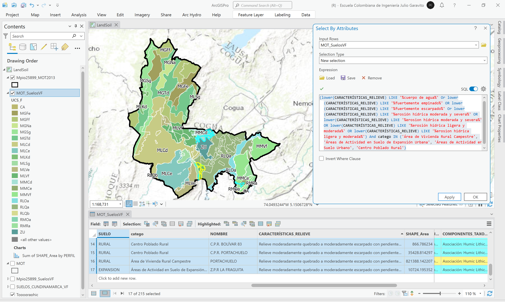
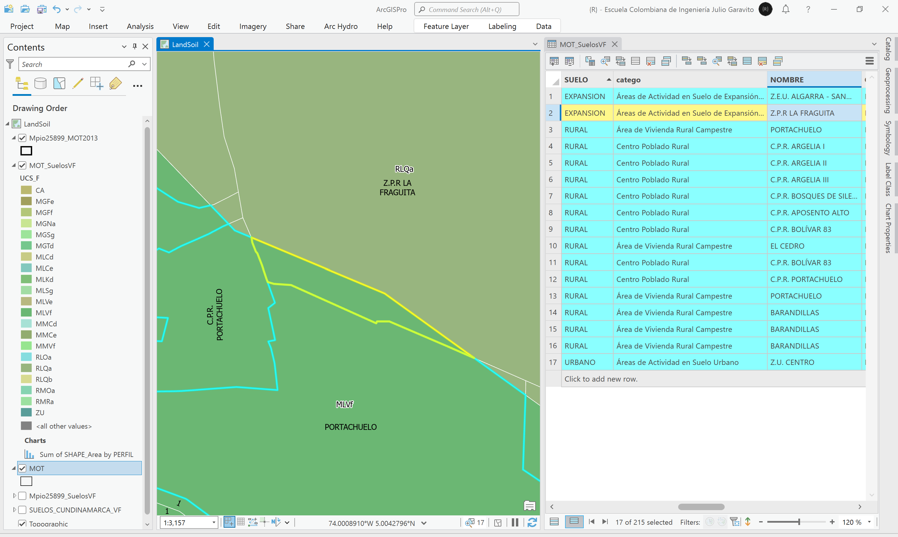

# Mapa de suelos, vocación de uso y conflictos de uso de Colombia vs. MOT
Keywords: `land-soil` `land-conflict` `land-potential-use`

Descargue el Mapa de Suelos, vocación de uso y conflictos de uso de Colombia del IGAC y recorte hasta el límite municipal del mapa MOT del POT. Describa y explique los tipos de suelos presentes en la zona de estudio. Utilizando la herramienta de geoprocesamiento Intersect, combine el modelo de ocupación territorial MOT con las capas de suelos. A través de un resumen estadístico, obtenga por cada categoría del MOT, los tipos de suelos presentes, usos potenciales, conflictos de uso y sus áreas.  

## Objetivos

* Estudiar los tipos de suelos presentes en la zona de estudio, sus vocaciones principales y los conflictos identificados por la autoridad catastral nacional.
* Identificar íncompatibilidades entre suelos y el modelo de ocupación territorial - MOT.

## Requerimientos

* [:mortar_board:Actividad](../POTLayer/Readme.md): Inventario de información geo-espacial recopilada del POT y diccionario de datos.
* [:toolbox:Herramienta](https://www.microsoft.com/es/microsoft-365/excel?market=bz): Microsoft Excel 365.
* [:toolbox:Herramienta](https://www.esri.com/en-us/arcgis/products/arcgis-pro/overview): ESRI ArcGIS Pro 3.3.1 o superior.
* [:toolbox:Herramienta](https://qgis.org/): QGIS 3.38 o superior.

## 1. Mapa de suelos de la zona de estudio

El mapa de suelos del Departamento de Cundinamarca, ha sido creado por el [Instituto Geográfico Agustín Codazzi](https://www.igac.gov.co/) - Subdirección de Agrología - Grupo Interno de Trabajo Geomática - Carrera 30 # 48 - 51 – Sede Central, Bogotá D.C, Departamento de Cundinamarca, 111321, República de Colombia. Autor: german.alvarez@igac.gov.co (Subdirector de Agrología), +57 1 3694100 Ext. 91007

Este mapa temático representa la distribución de las características del suelo, determinadas mediante el levantamiento general de suelos del departamento de Cundinamarca a escala 1:100.000, publicado en el año 2001. Suministra información importante acerca del recurso suelo, a través de la descripción e interpretación de sus ambientes edafogenéticos, sus características físicas, químicas, mineralógicas y morfológicas, su taxonomía y distribución espacial, como base para la determinación de sus potenciales productivos, describiendo las limitantes de uso.

Los Levantamientos Generales de Suelos de los departamentos del Territorio Colombiano suministran información importante acerca del recurso suelo; a través de la descripción e interpretación de su génesis, características físicas, químicas, mineralógicas, morfológicas, taxonomía y distribución, como base para la determinación de sus potencialidades y limitaciones de uso.

**Estirpe**: la generación del Mapa Digital de Suelos, para el levantamiento general de suelos, escala 1:100.000, se realizó a partir de los parámetros definidos por la Subdirección de Agrología del Instituto Geográfico Agustín Codazzi, para el objeto: Suelos. Para la elaboración del levantamiento, el GIT de Levantamientos de Suelos y Aplicaciones Agrológicas, en la etapa de precampo recopiló información secundaria proveniente de estudios de suelos anteriores, e investigaciones sobre los factores formadores del suelo, tales como clima, geología y geomorfología, los cuales se interpretan con el apoyo de insumos de cartografía, sensores remotos y fotointerpretación. Posteriormente, en la etapa de campo se realiza la descripción de las observaciones tipo cajuelas o barrenaje, y calicatas, ajuste a las líneas de interpretación y recolección de muestras que serán analizadas por el Laboratorio Nacional de Suelos. La sistematización y georreferenciación de esta información sirve de apoyo fundamental para el trazo de las líneas de suelos, que son digitalizadas sobre cartografía base, imágenes de sensores remotos, modelos digitales de elevación, entre otros. Finalmente en la etapa de poscampo se consolidó la leyenda de suelos del estudio, la cartografía temática con sus diferentes atributos y la memoria técnica respectiva. 

* Fuente: https://www.colombiaenmapas.gov.co/, buscar como _Suelos Cundinamarca_
* Extensión espacial: Departamento de Cundinamarca - Colombia - Suramérica
* Escala: 1:100000
* Sistema de referencia de coordenadas: 3116
* Licencia: este producto adopta la licencia pública internacional de Reconocimiento-CompartirIgual 4.0 de Creative Commons, Creative Commons attribution – ShareAlike 4.0 Internacional. Por tal razón, nuevos productos y servicios derivados de su reutilización deben ser también licenciados bajo las mismas condiciones de uso y disponibilidad que habilitó la licencia antes mencionada. Lo anterior, sin perjuicio de los derechos de autor y propiedad intelectual del Instituto Geográfico Agustín Codazzi, con base en la Ley 23 de 1982 y demás normas concordantes. [CC BY 4.0](https://creativecommons.org/licenses/by/4.0/deed.es)

1. Desde el portal de https://www.colombiaenmapas.gov.co/, busque y descargue en formato GDB, el mapa de suelos del Departamento de Cundinamarca, guarde y descomprima en la ruta `\file\data\IGAC\SUELOS_CUNDINAMARCA_100K.gdb`.

2. Abra el proyecto de ArcGIS Pro, creado previamente y desde el menú _Insert_ cree un nuevo mapa _New Map_, renombre como _LandSoil_ y establezca el CRS 9377. Agregue al mapa la capa _SUELOS_CUNDINAMARCA_VF_, ajuste la simbología a valores únicos representando el campo de atributos `UCS_F` y rotule a partir del mismo campo.  

3. Agregue al mapa las capas `\file\gdb\SIGE.gdb\POT2013Formulacion\MOT` y `\file\gdb\SIGE.gdb\SIGE\Mpio25899_MOT2013`, simbolice solo por contornos. Acerque a la zona de estudio y rotule la capa de suelos.

4. Utilizando la herramienta de geo-procesamiento _Analysis Tools / Clip_, recorte el mapa de suelos a partir del límite municipal contenido en la capa _Mpio25899_MOT2013_, nombre como `\file\gdb\SIGE.gdb\SIGE\Mpio25899_SuelosVF`. Podrá observar que en las clasificaciones de uso de protección y rural localizadas al oeste del mapa, existen múltiples tipos de suelos.  

5. Cree gráficos de barras representando las diferentes variables categóricas presentes en la capa de suelos dentro de la zona de estudio. 

Por paisaje, montaña presenta la mayor área.  

 

Por código de clasificación _UCS_F_, el suelo dominante es _MLCd_, correspondiente a suelos profundos a superficiales, bien drenados, con texturas moderadamente finas a moderadamente gruesas, reacción extremada a fuertemente ácida, saturación de aluminio media a alta y fertilidad, en general, moderada.  

 

Por clima, frío húmedo y muy frío muy húmedo, presentan las mayores áreas.  

 

Por tipo de relieve y litología, las rocas clásticas arenosas y limo arcillosas y mantos de ceniza volcánica, presentan la mayor área.  

 

## 2. Suelos vs. MOT

Para identificar las posibles incompatibilidades de los suelos con respecto a las categorías de uso establecidas en el modelo de ocupación territorial - MOT, utilizaremos los siguientes criterios en clases cuyo uso principal sea el habitacional y que en suelos las características de relieve contengan la descripción:

* Fuertemente empinado: correspondiente a pendientes superiores al 75%.
* Fuertemente escarpado: correspondiente a pendientes hasta del 75%.
* Erosión hídrica ligera y moderada.
* Erosión hídrica moderada y severa.
* Cuerpo de agua.

1. Utilizando la herramienta de geo-procesamiento _Analysis Tools / Intersect_, cree una intersección espacial de las capas _Mpio25899_SuelosVF_ y _MOT_, nombre la capa resultante como `\file\gdb\SIGE.gdb\SIGE\MOT_SuelosVF`. Podrá observar que cada categoría de suelo ha sido fraccionada con las clasificaciones del MOT.

2. Para identificar las zonas incompatibles, realice una selección por atributos utilizando la siguiente expresión.

SQL: `(lower(CARACTERÍSTICAS_RELIEVE) LIKE '%cuerpo de agua%' Or lower(CARACTERÍSTICAS_RELIEVE) LIKE '%fuertemente empinado%' OR lower(CARACTERÍSTICAS_RELIEVE) LIKE '%fuertemente escarpado%' Or lower(CARACTERÍSTICAS_RELIEVE) LIKE '%erosión hídrica moderada y severa%' OR lower(CARACTERÍSTICAS_RELIEVE) LIKE '%erosion hidrica moderada y severa%' OR lower(CARACTERÍSTICAS_RELIEVE) LIKE '%erosión hídrica ligera y moderada%' OR lower(CARACTERÍSTICAS_RELIEVE) LIKE '%erosion hidrica ligera y moderada%') And catego IN ('Área de Vivienda Rural Campestre', 'Áreas de Actividad en Suelo de Expansión Urbana', 'Áreas de Actividad en Suelo Urbano', 'Centro Poblado Rural')`

Podrá observar que se han identificado los siguientes 17 polígonos de intersección con posibles conflitos:

| Suelo     | Categoría                                       | Nombre                      | Relieve                                                                                                                                       |
|-----------|-------------------------------------------------|-----------------------------|-----------------------------------------------------------------------------------------------------------------------------------------------|
| EXPANSION | Áreas de Actividad en Suelo de Expansión Urbana | Z.E.U. ALGARRA - SAN RAFAEL | Relieve ligera a fuertemente quebrado con pendientes 7-12, 12-25 y 25-50%, afectado en sectores por erosión hídrica ligera y moderada         |
| EXPANSION | Áreas de Actividad en Suelo de Expansión Urbana | Z.P.R LA FRAGUITA           | Relieve moderadamente quebrado a moderadamente escarpado con pendientes de 12-75%, afectado en sectores por erosión hídrica ligera y moderada |
| RURAL     | Área de Vivienda Rural Campestre                | BARANDILLAS                 | Relieve fuertemente quebrado a moderadamente escarpado con pendientes de 25 a 75%, afectado en sectores por erosión hídrica moderada y severa |
| RURAL     | Área de Vivienda Rural Campestre                | BARANDILLAS                 | Relieve fuertemente quebrado a moderadamente escarpado con pendientes de 25 a 75%, afectado en sectores por erosión hídrica moderada y severa |
| RURAL     | Área de Vivienda Rural Campestre                | BARANDILLAS                 | Relieve ligera a fuertemente quebrado con pendientes 7-12, 12-25 y 25-50%, afectado en sectores por erosión hídrica ligera y moderada         |
| RURAL     | Área de Vivienda Rural Campestre                | EL CEDRO                    | Relieve ligera a fuertemente quebrado con pendientes 7-12, 12-25 y 25-50%, afectado en sectores por erosión hídrica ligera y moderada         |
| RURAL     | Área de Vivienda Rural Campestre                | PORTACHUELO                 | Relieve fuertemente empinado con pendientes superiores a 75%, afectado en sectores por erosión hídrica laminar ligera                         |
| RURAL     | Área de Vivienda Rural Campestre                | PORTACHUELO                 | Relieve moderadamente quebrado a moderadamente escarpado con pendientes de 12-75%, afectado en sectores por erosión hídrica ligera y moderada |
| RURAL     | Centro Poblado Rural                            | C.P.R. APOSENTO ALTO        | Relieve ligera a fuertemente quebrado con pendientes 7-12, 12-25 y 25-50%, afectado en sectores por erosión hídrica ligera y moderada         |
| RURAL     | Centro Poblado Rural                            | C.P.R. ARGELIA I            | Relieve ligera a fuertemente quebrado con pendientes 7-12, 12-25 y 25-50%, afectado en sectores por erosión hídrica ligera y moderada         |
| RURAL     | Centro Poblado Rural                            | C.P.R. ARGELIA II           | Relieve ligera a fuertemente quebrado con pendientes 7-12, 12-25 y 25-50%, afectado en sectores por erosión hídrica ligera y moderada         |
| RURAL     | Centro Poblado Rural                            | C.P.R. ARGELIA III          | Relieve ligera a fuertemente quebrado con pendientes 7-12, 12-25 y 25-50%, afectado en sectores por erosión hídrica ligera y moderada         |
| RURAL     | Centro Poblado Rural                            | C.P.R. BOLÍVAR 83           | Relieve ligera a fuertemente quebrado con pendientes 7-12, 12-25 y 25-50%, afectado en sectores por erosión hídrica ligera y moderada         |
| RURAL     | Centro Poblado Rural                            | C.P.R. BOLÍVAR 83           | Relieve moderadamente quebrado a moderadamente escarpado con pendientes de 12-75%, afectado en sectores por erosión hídrica ligera y moderada |
| RURAL     | Centro Poblado Rural                            | C.P.R. BOSQUES DE SILECIA   | Relieve ligera a fuertemente quebrado con pendientes 7-12, 12-25 y 25-50%, afectado en sectores por erosión hídrica ligera y moderada         |
| RURAL     | Centro Poblado Rural                            | C.P.R. PORTACHUELO          | Relieve moderadamente quebrado a moderadamente escarpado con pendientes de 12-75%, afectado en sectores por erosión hídrica ligera y moderada |
| URBANO    | Áreas de Actividad en Suelo Urbano              | Z.U. CENTRO                 | Relieve ligera a fuertemente quebrado con pendientes 7-12, 12-25 y 25-50%, afectado en sectores por erosión hídrica ligera y moderada         |

EXPANSION - Áreas de Actividad en Suelo de Expansión Urbana - Z.E.U. ALGARRA - SAN RAFAEL 
 

EXPANSION - Áreas de Actividad en Suelo de Expansión Urbana - Z.P.R LA FRAGUITA 
 

RURAL - Área de Vivienda Rural Campestre - PORTACHUELO 
 

RURAL - Centro Poblado Rural - C.P.R. ARGELIA I 
 

RURAL - Centro Poblado Rural - C.P.R. ARGELIA II 
 

RURAL - Centro Poblado Rural - C.P.R. ARGELIA III 
 

RURAL - Centro Poblado Rural - C.P.R. BOSQUES DE SILECIA 
 

RURAL - Centro Poblado Rural - C.P.R. APOSENTO ALTO 
 

RURAL - Centro Poblado Rural - C.P.R. BOLÍVAR 83 
 

> Gran parte del Centro Poblado Rural Bolívar 83, no ha sido identificado como zona incompatible en el análisis realizado, debido a que en la capa de suelos, casí toda su superficie ha sido catalogada como urbana.

RURAL - Centro Poblado Rural - C.P.R. PORTACHUELO 
 

RURAL - Área de Vivienda Rural Campestre - EL CEDRO 
 

RURAL - Área de Vivienda Rural Campestre - PORTACHUELO 
 

RURAL - Área de Vivienda Rural Campestre - BARANDILLAS 
 

URBANO - Áreas de Actividad en Suelo Urbano - Z.U. CENTRO 
 

> :bulb:Tenga en cuenta que las incompatibilidades identificadas, en algunos casos pueden ser mitigadas, p. ej., suelos con erosión hídrica ligera, moderada y severa, pueden ser acondicionados mediante procesos de reforestación y obras de protección a partir de estudios técnicos especializados. En el caso de terreno muy empinados y escarpados, el proceso de mitigación dependerá de la geología, la disposición de las capas del suelo, su proximidad a obras de infrastructura y otros factores de riesgo definidos a través de estudios técnicos especializados.  

## 3. Vocación de uso y conflictos de uso de Colombia vs. MOT

El análisis realizado de suelos, puede ser replicado utilizando la información geográfica contenida en los mapas de vocación de uso y conflictos de uso; el procedimiento consiste en descargar, recortar, intersecar e identificar a partir de los atributos contenidos, cuáles pueden generar incompatibilidad con las categorías propuestas en el MOT. 

> Para su caso de estudio, realice el análisis de posibles incompatibilidades de estos dos mapas, con respecto a las zonas definidas en el modelo de ocupación territorial - MOT.

### 3.1. Vocación de uso

El mapa de Vocación de Uso de las tierras del IGAC del año 2013, se determina mediante matrices de decisión que incluyen indicadores e índices de su estado. En los atributos geo gráficos considerados se encuentra el clima y la pendiente. Entre los de los suelos sobresalen la erosión, humedad, granulometría, pedregosidad, profundidad efectiva, fertilidad y salinidad. Esta clasificación comprende 5 clases: agrícola, ganadera, agroforestal, forestal y de conservación/recuperación. En cada una se establece el uso principal que debe tener. Este producto es generado por la Subdirección de Agrología del Instituto Geográfico Agustín Codazzi - IGAC, para el territorio nacional, el cual fue publicado en la obra Suelos y Tierras de Colombia 2016 a escala 1:100.000.

El objetivo principal de la vocación es la determinación del uso más apropiado que puede soportar cada uno de los suelos del país, propendiendo por una producción sostenible y sin deterioro de los recursos naturales. Son dos niveles categóricos los tenidos en cuenta en el presente estudio; el primero corresponde a la vocación general de uso de la tierra y, el segundo, como subdivisión del primero, hace referencia a los usos principales recomendados.

**Estirpe**: con la finalidad de establecer el mejor uso de las tierras, se analizan y evalúan una serie de características biofísicas estables en el tiempo y en el espacio; que influyen en la selección y desempeño de los usos agropecuarios y forestales, principalmente, con requerimientos implícitos de protección y conservación de los recursos naturales. Por tanto, para la determinación del uso más apropiado que puede soportar cada uno de los suelos, se tienen en cuenta algunas de sus propiedades, difícilmente modificables por el hombre en un corto y mediano plazo que ejercen fuerte influencia en las actividades productivas antrópicas; estos criterios de determinación del uso principal para cada uno de los suelos hacen referencia a factores climáticos, pendiente, erosión, factores de humedad, pedregosidad y factores intrínsecos al suelo como la profundidad efectiva, grupo textural, fertilidad, salinidad, porcentaje de saturación de sodio, aluminio y carbono orgánico. A partir de la anterior información y estableciendo combinación de indicadores; se generan los índices del estado de las tierras, los cuales permiten tipificar como están conformadas y cuáles son sus calidades, obteniendo así, los índices de impacto con los cuales se puede medir el grado de deterioro que presenta cada una de las unidades de tierra. Los indicadores e índices a tener en cuenta en el proceso de evaluación están referidos a factores climáticos (precipitación, temperatura, distribución de las lluvias), factores del relieve como la pendiente y geomorfología, factores externos a los suelos como la erosión, la humedad (drenaje natural e inundaciones y encharcamientos) y la pedregosidad (porcentaje de fragmentos en superficie) y factores intrínsecos al suelo (profundidad efectiva, grupo textural, fertilidad, salinidad, porcentaje de saturación de sodio, de aluminio, de carbono orgánico y fragmentos de roca en el suelo); obteniendo como resultado la vocación subdividida en cinco (5) clases las cuales se dividen a su vez en treinta y cinco (35) subclases: (Agrícola: Cultivos transitorios intensivos de clima cálido, Cultivos transitorios intensivos de clima medio, Cultivos transitorios intensivos de clima frío, Cultivos transitorios semi intensivos de clima cálido, Cultivos transitorios semi intensivos de clima medio, Cultivos transitorios semi intensivos de clima frío, Cultivos permanentes intensivos de clima cálido, Cultivos permanentes intensivos de clima medio, Cultivos permanentes intensivos de clima frío, Cultivos permanentes semi intensivos de clima cálido, Cultivos permanentes semi intensivos de clima medio, Cultivos permanentes semi intensivos de clima frío); (Ganadera: Pastoreo intensivo de clima cálido, Pastoreo intensivo de clima medio, Pastoreo intensivo de clima frío, Pastoreo semi intensivo de clima cálido, Pastoreo semi intensivo de clima medio, Pastoreo semi intensivo de clima frío, Pastoreo extensivo de clima cálido, Pastoreo extensivo de clima medio, Pastoreo extensivo de clima frío, Pastoreo extensivo de clima muy frío); (Agroforestal: Agrosilvícola con cultivos transitorios, Agrosilvícola con cultivos permanentes, Agrosilvopastoril con cultivos transitorios, Agrosilvopastoril con cultivos permanentes, Silvopastoril); (Forestal: Producción de clima cálido, Producción de clima medio, Producción de clima frío, Producción de clima muy frío, Protección – producción); (Conservación: Protección, Humedales, Conservación y recuperación).

Este mapa puede ser obtenido de https://www.colombiaenmapas.gov.co/ ingresando la cadena de búsqueda _Vocación de Uso. Territorio Nacional_.

### 3.2. Conflictos de uso

El mapa de conflictos de uso de las tierras del IGAC del año 2016, resulta de las discrepancias entre el uso que hace la población del medio natural y el que debería tener, de acuerdo con sus potencialidades y restricciones ambientales. El IGAC, a través de la Subdirección de Agrología, ha venido investigando durante los últimos 25 años, los criterios y metodologías tendientes a establecer el uso y las prácticas de manejo que deben tener los suelos y tierras del país, buscando su productividad sostenible en función de la oferta y demanda ambientales. Su mayor dedicación se ha concentrado en aspectos agrícolas, ganaderos, agroforestales, forestales y de conservación/recuperación de suelos y aguas. Este producto es generado por la Subdirección de Agrología del Instituto Geográfico Agustín Codazzi - IGAC, para el territorio nacional, el cual fue publicado en la obra Suelos y Tierras de Colombia 2016 a escala 1:100.000.

Este mapa puede ser obtenido de https://www.colombiaenmapas.gov.co/ ingresando la cadena de búsqueda _Conflictos de uso de la tierra año 2012. Territorio nacional_.

## 4. Análisis usando software libre - QGIS

Para el desarrollo de las actividades desarrolladas en esta clase, se pueden utilizar en QGIS las siguientes herramientas o geo-procesos:

| Proceso                              | Procedimiento                                                                                                                                                                                         |
|:-------------------------------------|:------------------------------------------------------------------------------------------------------------------------------------------------------------------------------------------------------|
| Simbología                           | Modificable desde las propiedades de la capa en la pestaña _Symbology_.                                                                                                                               |
| Rotulado                             | Modificable desde las propiedades de la capa en la pestaña _Labels_.                                                                                                                                  |
| Resumen estadístico (Summarize)      | Disponible en _Processing Toolbox / Vector Analysis / [Statistics by categories](https://docs.qgis.org/3.34/en/docs/user_manual/processing_algs/qgis/vectoranalysis.html#statistics-by-categories)_.  |
| Recorte de capas vectoriales (clip)  | Herramienta disponible en el _Processing Toolbox / Vector Overlay / [Clip](https://docs.qgis.org/3.34/en/docs/user_manual/processing_algs/qgis/vectoroverlay.html#clip)_.                             |
| Intersección espacial (Intersection) | Se realizan desde el menú _Vector_ a través de la opción _Geoprocessing Tools / Intersection_.                                                                                                        |

Ejemplo rótulo en QGIS: `'A(ha): ' ||  round("AGha", 2) || '\n' || 'P (m): ' ||  round("PGm", 2) `

[:notebook:QGIS training manual](https://docs.qgis.org/3.34/en/docs/training_manual/)  
[:notebook:Herramientas comúnmente utilizadas en QGIS](../QGIS.md)

## Elementos requeridos en diccionario de datos

Agregue a la tabla resúmen generada en la actividad [Inventario de información geo-espacial recopilada del POT y diccionario de datos](../POTLayer/Readme.md), las capas generadas en esta actividad que se encuentran listadas a continuación:

| Nombre             | Descripción                                                                                                     | Geometría   | Registros | 
|--------------------|-----------------------------------------------------------------------------------------------------------------|-------------|-----------| 
| Mpio25899_SuelosVF | Recorte mapa SUELOS_CUNDINAMARCA_VF a partir del límite municipal Mpio25899_MOT2013.                            | Polígono 2D | 36        | 
| MOT_SuelosVF       | Intersección espacial de suelos en zona de estudio Mpio25899_SuelosVF y modelo de ocupación territorial - MOT.  | Polígono 2D | 215       | 

> :bulb:Para funcionarios que se encuentran ensamblando el SIG de su municipio, se recomienda incluir y documentar estas capas en el Diccionario de Datos.

## Actividades de proyecto :triangular_ruler:

En la siguiente tabla se listan las actividades que deben ser desarrolladas y documentadas por cada grupo de proyecto en un único archivo de Adobe Acrobat .pdf. El documento debe incluir portada (indicando el caso de estudio, número de avance, nombre del módulo, fecha de presentación, nombres completos de los integrantes), numeración de páginas, tabla de contenido, lista de tablas, lista de ilustraciones, introducción, objetivo general, capítulos por cada ítem solicitado, conclusiones y referencias bibliográficas.

| Actividad     | Alcance                                                                                                                                                                                                                                                                                                                                                                                                                                             |
|:--------------|:----------------------------------------------------------------------------------------------------------------------------------------------------------------------------------------------------------------------------------------------------------------------------------------------------------------------------------------------------------------------------------------------------------------------------------------------------|
| Avance **P3** | Desarrolle las actividades presentadas en esta actividad, incluído el análisis de incompatibilidades de suelos, vocaciones y conflictos.                                                                                                                                                                                                                                                                               | 
| Avance **P3** | :compass:Mapa digital impreso _P4-9: Suelos del municipio._ Incluir tablas y gráficos de análisis. Embebido dentro del informe final como una imágen y referenciados como anexo.                                                                                                                                                                                                                                                                 | 
| Avance **P3** | :compass:Mapa digital impreso _P4-10: Suelos combinado con actividades de uso POT e identificación de zonas incompatibles._ Incluir tablas y gráficos de análisis. Embebido dentro del informe final como una imágen y referenciados como anexo.                                                                                                                                                                                                 | 
| Avance **P3** | En una tabla y al final del informe de avance de esta entrega, indique el detalle de las sub-actividades realizadas por cada integrante de su grupo. Para actividades que no requieren del desarrollo de elementos de avance, indicar si realizo la lectura de la guía de clase y las lecturas indicadas al inicio en los requerimientos. Utilice las siguientes columnas: Nombre del integrante, Actividades realizadas, Tiempo dedicado en horas. | 

> No es necesario presentar un documento de avance independiente, todos los avances de proyecto de este módulo se integran en un único documento.
> 
> En el informe único, incluya un numeral para esta actividad y sub-numerales para el desarrollo de las diferentes sub-actividades, siguiendo en el mismo orden de desarrollo presentado en esta actividad.

## Referencias

* [Mapa Digital de Suelos del Departamento de Cundinamarca, República de Colombia. Escala 1:100.000. Año 2001.](https://metadatos.icde.gov.co/geonetwork/srv/api/records/f7c184ea-8abb-45a5-9cf2-1f88981760b6)
* https://www.colombiaenmapas.gov.co/
* https://geoportal.igac.gov.co/contenido/datos-abiertos-agrologia
* https://www.datos.gov.co/dataset/vocaciondeusoterritorionacional/ip25-k55k/about_data

## Control de versiones

| Versión     | Descripción                                                | Autor                                      | Horas |
|-------------|:-----------------------------------------------------------|--------------------------------------------|:-----:|
| 2024.03.23  | Versión inicial con alcance de la actividad                | [rcfdtools](https://github.com/rcfdtools)  |   4   |
| 2024.07.28  | Investigación y documentación para caso de estudio general | [rcfdtools](https://github.com/rcfdtools)  |   8   |

_R.SIGE es de uso libre para fines académicos, conoce nuestra licencia, cláusulas, condiciones de uso y como referenciar los contenidos publicados en este repositorio, dando [clic aquí](LICENSE.md)._

_¡Encontraste útil este repositorio!, apoya su difusión marcando este repositorio con una ⭐ o síguenos dando clic en el botón Follow de [rcfdtools](https://github.com/rcfdtools) en GitHub._

| [:arrow_backward: Anterior](../Geology/Readme.md) | [:house: Inicio](../../README.md) | [:beginner: Ayuda / Colabora](https://github.com/rcfdtools/R.SIGE/discussions/27) | [Siguiente :arrow_forward:]() |
|---------------------------------------------------|-----------------------------------|-----------------------------------------------------------------------------------|-------------------------------|

[^1]: 