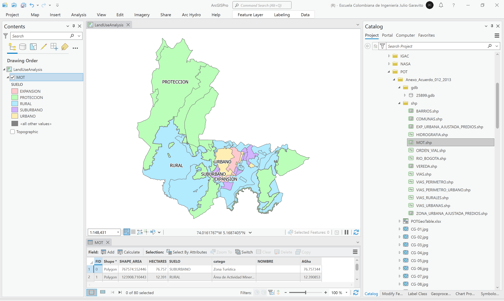

# Análisis geográfico del Modelo de Ocupación Territorial - MOT
Keywords: `land-use-analysis` `mot`

A partir de la capa MOT contenida en el anexo de formulación del POT, realice un análisis estadístico de áreas por clasificación del suelo (urbano, expansión urbana, rural) y categorías definidas en el Modelo de Ocupación Territorial - MOT con porcentaje de distribución respecto al total del área municipal.

 Tomado de: <a href="Public Domain, https://commons.wikimedia.org/w/index.php?curid=479365">https://commons.wikimedia.org</a>  

## Objetivos

* El mapa CG-01 de Clasificación general del territorio anexo al Plan de Ordenamiento, contiene los valores de áreas y porcentajes de distribución territorial calculadas a partir del CRS 3116. A partir de la capa del Modelo de Ocupación Territorial - MOT, generaremos los polígonos de clasificación y calcularemos las áreas y dis distribuciones porcentuales usando el CRS 9377.

## Requerimientos

* [:mortar_board:Actividad](../POTLayer/Readme.md): Inventario de información geo-espacial recopilada del POT y diccionario de datos.
* [:toolbox:Herramienta](https://www.microsoft.com/es/microsoft-365/excel?market=bz): Microsoft Excel 365.
* [:toolbox:Herramienta](https://www.esri.com/en-us/arcgis/products/arcgis-pro/overview): ESRI ArcGIS Pro 3.3.1 o superior.
* [:toolbox:Herramienta](https://qgis.org/): QGIS 3.38 o superior.
* [:open_file_folder:PoblacionDANE.xlsx](LandUseAnalysis.xlsx): libro para comparación de áreas.

## 1. Áreas y porcentajes por clasificación general del territorio

1. Abra el proyecto de ArcGIS Pro, creado previamente y desde el menú _Insert_ cree un nuevo mapa _New Map_, renombre como _LandUseAnalysis_ y establezca el CRS 9377. En la parte superior de la ventana se encuentran los diferentes mapas y la plantilla de impresión creados en actividades anteriores, ciérrelos.

> Los mapas y plantillas de impresión son almacenados dentro de la estructura del proyecto de ArcGIS Pro, estos pueden ser abiertos directamente desde el arbol de catálogo o _Catalog Pane_.

Agregue al mapa la capa del Modelo de Ocupación Territorial - MOT disponible en la información recopilada del POT en la ruta `\R.SIGE\file\data\POT\Anexo_Acuerdo_012_2013\shp\MOT.shp` y ajuste la simbología a valores únicos representando el campo de atributos `SUELO`, rotule a partir de este mismo campo. Como puede observar, este mapa contiene 5 tipos diferentes de clasificación de suelo, de los cuales, Rural - Suburbano - Protección, pertenecen a la clase rural. 

2. Utilizando la herramienta _Data Management Tools / Dissolve_, disuelva los polígonos del Modelo de Ocupación Territorial - MOT a partir del campo de atributos `SUELO`. Guarde la capa o clase de entidad resultante en la ruta `\file\shp\MOT_ClasificacionSuelo_Dissolve.shp` y abra la tabla de atributos de la capa inicial y la capa disuelta. Podrá observar que de los 80 polígonos iniciales, hemos obtenido 5 zonas.

## 2. Áreas y porcentajes en mapa del modelo ocupación territorial - MOT

Agregue al mapa la capa del Modelo de Ordenamiento Territorial - MOT disponible en la información recopilada del POT en la ruta `\R.SIGE\file\data\POT\Anexo_Acuerdo_012_2013\shp\MOT.shp` y ajuste la simbología a valores únicos representando el campo de atributos `SUELO`.  

## 3. Análisis usando software libre - QGIS

Para el desarrollo de las actividades desarrolladas en esta clase, se pueden utilizar en QGIS las siguientes herramientas o geo-procesos:

| Proceso                                                                                                         | Procedimiento                                                                                                                                                                                                                                   |
|:----------------------------------------------------------------------------------------------------------------|:------------------------------------------------------------------------------------------------------------------------------------------------------------------------------------------------------------------------------------------------|
| Simbología                                                                                                      | Modificable desde las propiedades de la capa en la pestaña _Symbology_.                                                                                                                                                                         |
| Rotulado                                                                                                        | Modificable desde las propiedades de la capa en la pestaña _Labels_.                                                                                                                                                                            |

Ejemplo rótulo en QGIS: `'A(ha): ' ||  round("AGha", 2) || '\n' || 'P (m): ' ||  round("PGm", 2) `

## Elementos requeridos en diccionario de datos

Agregue a la tabla resúmen generada en la actividad [Inventario de información geo-espacial recopilada del POT y diccionario de datos](../POTLayer/Readme.md), las capas generadas en esta actividad que se encuentran listadas a continuación:

| Nombre                           | Descripción                                                                                                                  | Geometría   | Registros | 
|----------------------------------|------------------------------------------------------------------------------------------------------------------------------|-------------|-----------| 
|                                  |                                                                                                                              | Polígono 2D | 14        | 
|                                  |                                                                                                                              | Polígono 2D | 14        | 
|                                  |                                                                                                                              | Polígono 2D | 14        | 

> :bulb:Para funcionarios que se encuentran ensamblando el SIG de su municipio, se recomienda incluir y documentar estas capas en el Diccionario de Datos.

## Actividades de proyecto :triangular_ruler:

En la siguiente tabla se listan las actividades que deben ser desarrolladas y documentadas por cada grupo de proyecto en un único archivo de Adobe Acrobat .pdf. El documento debe incluir portada (indicando el caso de estudio, número de avance, nombre del módulo, fecha de presentación, nombres completos de los integrantes), numeración de páginas, tabla de contenido, lista de tablas, lista de ilustraciones, introducción, objetivo general, capítulos por cada ítem solicitado, conclusiones y referencias bibliográficas.

| Actividad     | Alcance                                                                                                                                                                                                                                                                                                                                                                                                                                             |
|:--------------|:----------------------------------------------------------------------------------------------------------------------------------------------------------------------------------------------------------------------------------------------------------------------------------------------------------------------------------------------------------------------------------------------------------------------------------------------------|
| Avance **P1** | Esta actividad no requiere del desarrollo de elementos en el avance del proyecto final, los contenidos son evaluados en el quiz de conocimiento y habilidad.                                                                                                                                                                                                                                                                                        | 
| Avance **P1** | :compass:Mapa digital impreso _P1-1: xxxx_ (Incluir xxxxx. Embebidos dentro del informe final como una imágen y referenciados como anexo.                                                                                                                                                                                                                                                                                                        | 
| Avance **P1** | En una tabla y al final del informe de avance de esta entrega, indique el detalle de las sub-actividades realizadas por cada integrante de su grupo. Para actividades que no requieren del desarrollo de elementos de avance, indicar si realizo la lectura de la guía de clase y las lecturas indicadas al inicio en los requerimientos. Utilice las siguientes columnas: Nombre del integrante, Actividades realizadas, Tiempo dedicado en horas. | 

> No es necesario presentar un documento de avance independiente, todos los avances de proyecto de este módulo se integran en un único documento.
> 
> En el informe único, incluya un numeral para esta actividad y sub-numerales para el desarrollo de las diferentes sub-actividades, siguiendo en el mismo orden de desarrollo presentado en esta actividad.

## Referencias

* 

## Control de versiones

| Versión    | Descripción                                                | Autor                                      | Horas |
|------------|:-----------------------------------------------------------|--------------------------------------------|:-----:|
| 2024.02.24 | Versión inicial con alcance de la actividad                | [rcfdtools](https://github.com/rcfdtools)  |   4   |
| 2024.06.27 | Investigación y documentación para caso de estudio general | [rcfdtools](https://github.com/rcfdtools)  |   8   |

_R.SIGE es de uso libre para fines académicos, conoce nuestra licencia, cláusulas, condiciones de uso y como referenciar los contenidos publicados en este repositorio, dando [clic aquí](LICENSE.md)._

_¡Encontraste útil este repositorio!, apoya su difusión marcando este repositorio con una ⭐ o síguenos dando clic en el botón Follow de [rcfdtools](https://github.com/rcfdtools) en GitHub._

| [:arrow_backward: Anterior](../Layout/Readme.md) | [:house: Inicio](../../README.md) | [:beginner: Ayuda / Colabora](https://github.com/rcfdtools/R.SIGE/discussions/99999) | [Siguiente :arrow_forward:]() |
|------------------------------------------|-------------------|---------------------------------------------------------------------------|---------------|

[^1]: 