

# 2.5. Análisis geográfico del Modelo de Ocupación Territorial - MOT
Keywords: `land-use-analysis` `mot`

A partir de la capa MOT contenida en el anexo de formulación del POT, realice un análisis estadístico de áreas por clasificación del suelo (urbano, expansión urbana, rural) y categorías definidas en el Modelo de Ocupación Territorial - MOT con porcentaje de distribución respecto al total del área municipal.

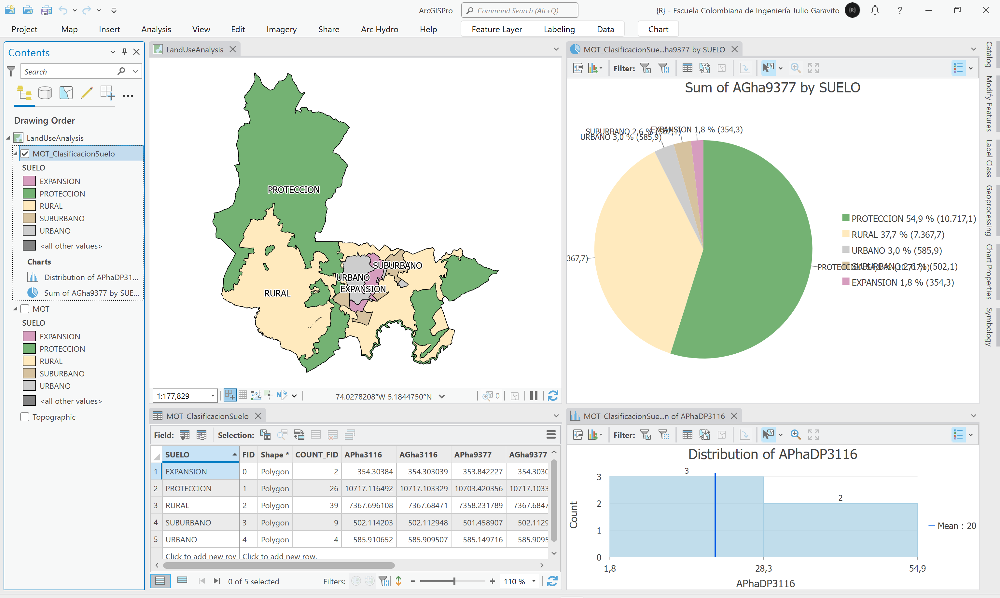 Tomado de: <a href="Public Domain, https://commons.wikimedia.org/w/index.php?curid=479365">https://commons.wikimedia.org</a>  

## Objetivos

* Disolver los polígonos de subcategorías del Modelo de Ocupación Territorial - MOT para obtener el mapa de clasificación del suelo.
* Calcular las áreas de los polígonos de clasificación e identificar las diferencias geográficas entre el mapa oficial CG-01 del POT y las clasificaciones contenidas en el Modelo de Ocupación Territorial - MOT.
* Entender la diferencia entre cálculo geométrico planar y geodésico.

## Requerimientos

* [:mortar_board:Actividad](../POTLayer/Readme.md): Inventario de información geo-espacial recopilada del POT y diccionario de datos.
* [:toolbox:Herramienta](https://www.microsoft.com/es/microsoft-365/excel?market=bz): Microsoft Excel 365.
* [:toolbox:Herramienta](https://www.esri.com/en-us/arcgis/products/arcgis-pro/overview): ESRI ArcGIS Pro 3.3.1 o superior.
* [:toolbox:Herramienta](https://qgis.org/): QGIS 3.38 o superior.
* [:open_file_folder:LandUseAnalysis.xlsx](LandUseAnalysis.xlsx): libro para comparación de áreas.

## 1. Áreas y porcentajes por clasificación general del territorio

El mapa CG-01 de Clasificación general del territorio anexo al Plan de Ordenamiento, contiene los valores de áreas y porcentajes de distribución territorial calculadas a partir del CRS 3116. A partir de la capa del Modelo de Ocupación Territorial - MOT, generaremos los polígonos de clasificación y calcularemos las áreas y distribuciones porcentuales usando el CRS 9377.

Mapa CG-01 Clasificación general del territorio a ser utilizado como referente para la comparación de áreas y distribuciones porcentuales. Tomado de: Plan de Ordenamiento Territorial Municipio de Zipaquirá, Acuerdo 012 de 2013. 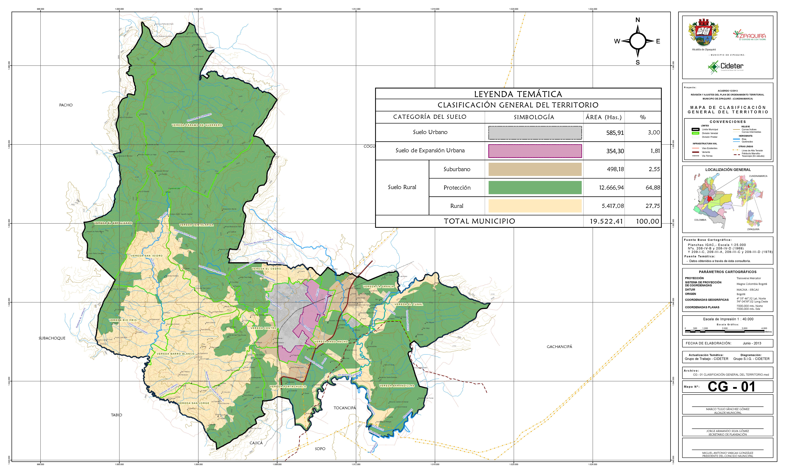 

1. Abra el proyecto de ArcGIS Pro, creado previamente y desde el menú _Insert_ cree un nuevo mapa _New Map_, renombre como _LandUseAnalysis_ y establezca el CRS 9377. En la parte superior de la ventana se encuentran los diferentes mapas y la plantilla de impresión creados en actividades anteriores, ciérrelos.

> Los mapas y plantillas de impresión son almacenados dentro de la estructura del proyecto de ArcGIS Pro, estos pueden ser abiertos directamente desde el arbol de catálogo o _Catalog Pane_.

Agregue al mapa la capa del Modelo de Ocupación Territorial - MOT disponible en la información recopilada del POT en la ruta `\R.SIGE\file\data\POT\Anexo_Acuerdo_012_2013\shp\MOT.shp` y ajuste la simbología a valores únicos representando el campo de atributos `SUELO`, rotule a partir de este mismo campo. Como puede observar, este mapa contiene 5 tipos diferentes de clasificación de suelo, de los cuales, Rural - Suburbano - Protección, pertenecen a la clase rural. 

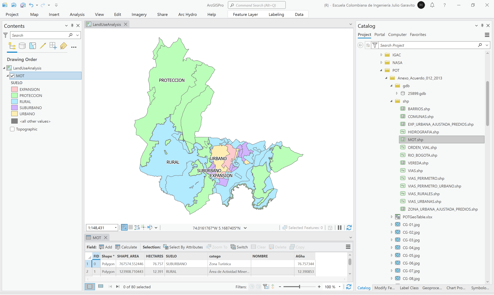

2. Utilizando la herramienta _Data Management Tools / Dissolve_, disuelva los polígonos del Modelo de Ocupación Territorial - MOT a partir del campo de atributos `SUELO`, defina en _Environments_ el sistema de proyección 9377 asignado al mapa. Guarde la capa o clase de entidad resultante en la ruta `\file\shp\MOT_ClasificacionSuelo.shp` y abra la tabla de atributos de la capa inicial y la capa disuelta. Podrá observar que de los 80 polígonos iniciales, hemos obtenido 5 zonas.

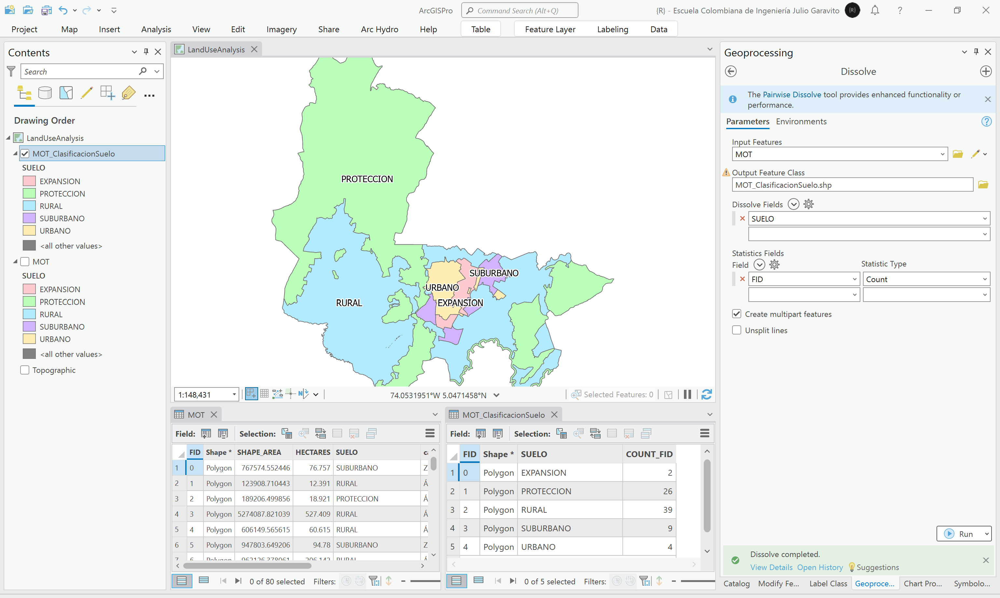

3. En la tabla de atributos de la capa disuelta, cree los siguientes campos:

| Campo      | Descripción                                           | Tipo    | Propiedad ArcGIS Pro | 
|------------|-------------------------------------------------------|---------|----------------------| 
| APha3116   | Área planar en hectáreas a partir de CRS 3116         | Double  | Area                 |
| AGha3116   | Área geodésica en hectáreas a partir de CRS 3116      | Double  | Area (geodesic)      |
| APha9377   | Área planar en hectáreas a partir de CRS 9377         | Double  | Area                 |
| AGha9377   | Área geodésica en hectáreas a partir de CRS 9377      | Double  | Area (geodesic)      |
| APhaDP3116 | Distribución porcentual de áreas a partir de APha3116 | Double  | N/A                  |
| AGhaDP3116 | Distribución porcentual de áreas a partir de AGha3116 | Double  | N/A                  |
| APhaDP9377 | Distribución porcentual de áreas a partir de APha9377 | Double  | N/A                  |
| AGhaDP9377 | Distribución porcentual de áreas a partir de AGha9377 | Double  | N/A                  |

> CRS 3116: MAGNA Sirgas orígen Bogota.  
> CRS 9377: MAGNA Colombia orígen único nacional.

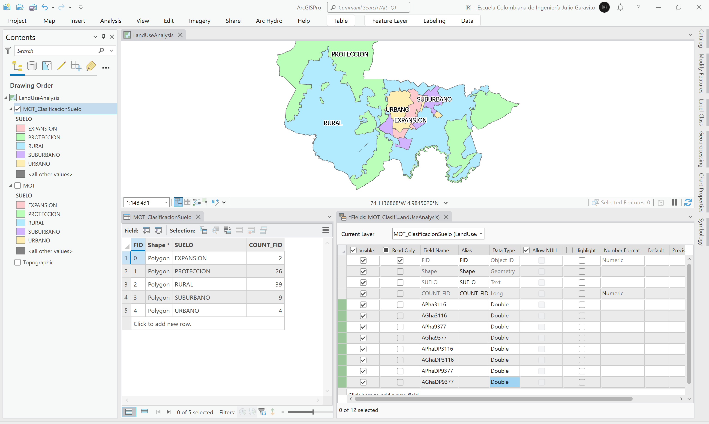

Ajuste los colores del mapa utilizando los siguientes valores hexadecimales. 

| Categoría        | HEX color |
|------------------|-----------|
| Urbano           | #CDCDCD   |
| Expansión urbana | #D69DBE   |
| Suburbano        | #D6C29F   |
| Protección       | #74B273   |
| Rural            | #FFEABE   |

4. Desde la tabla de atributos, calcule las propiedades geométricas de los campos `APha3116`, `AGha3116`, `APha9377` y `AGha9377`. Como observa, los valores de las áreas planares y geográficas son diferentes en un mismo sistema y también entre los dos CRS calculados.

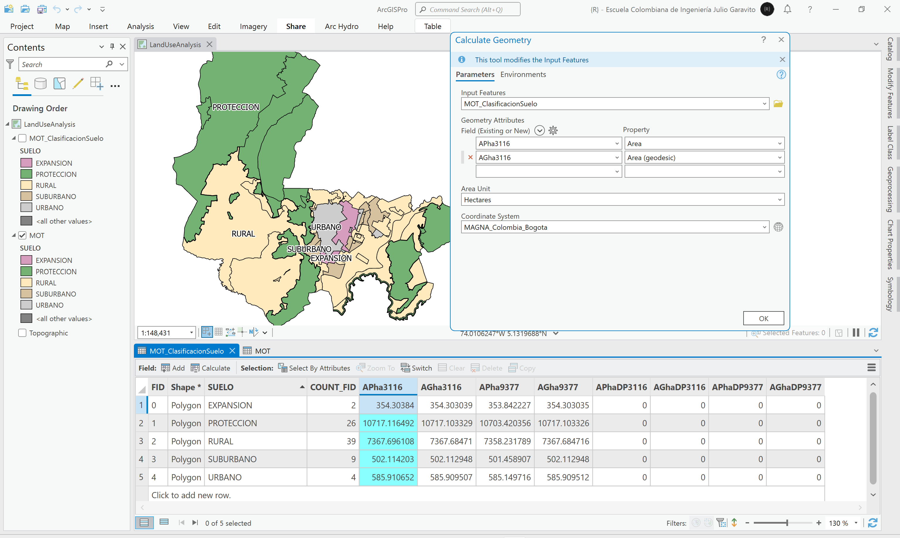

5. Para el cálculo de porcentajes de distribución, es necesario primero obtener los valores totales de áreas de todo el municipio. Desde la tabla de contenido, de clic derecho en la capa _MOT_ClasificacionSuelo_ y seleccione la opción _Data Engeneering_.

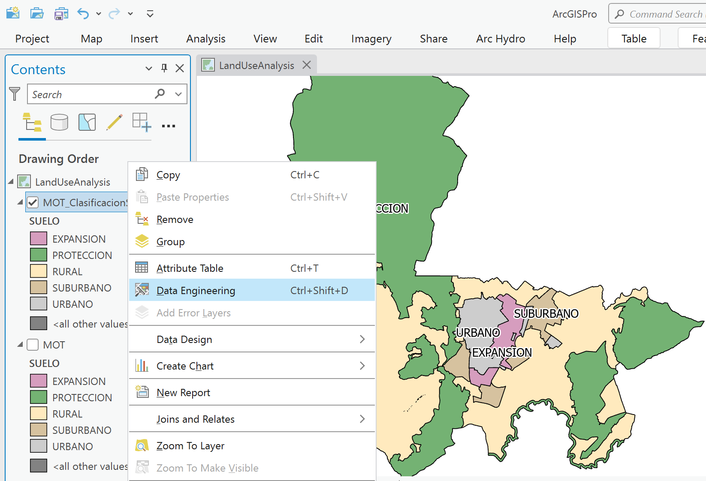

Arrastre los campos de atributos de áreas calculadas y de clic en _Calcular_. Podrá observar que se calculan los estadísticos característicos de cada una de las variables, incluída la sumatoria.

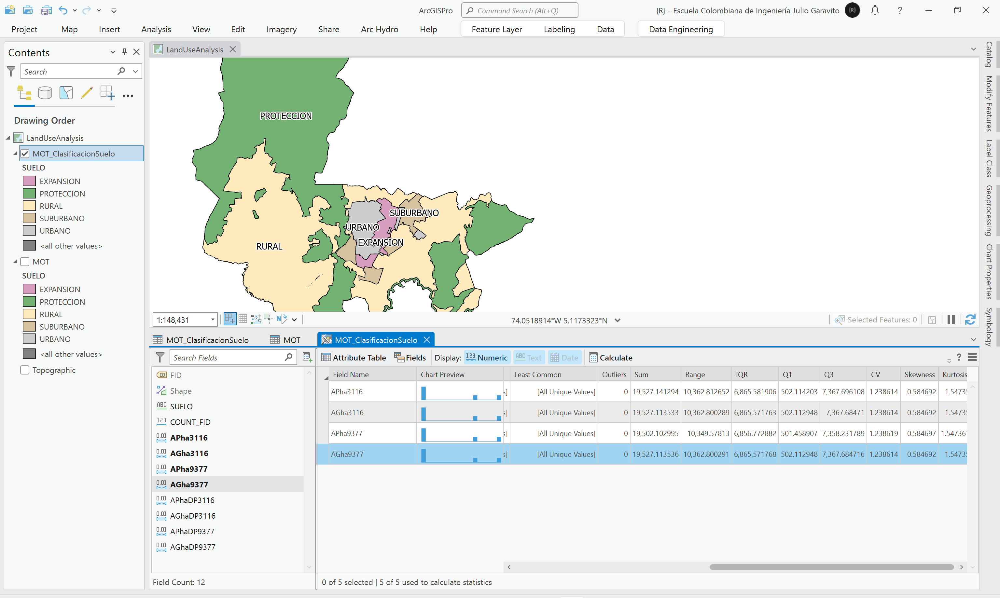

Otendrá los siguientes valores:

| Campo      | Descripción                                           | Área (ha)          | 
|------------|-------------------------------------------------------|--------------------| 
| APha3116   | Área planar en hectáreas a partir de CRS 3116         | 19527.141294129    |
| AGha3116   | Área geodésica en hectáreas a partir de CRS 3116      | 19527.113533120002 |
| APha9377   | Área planar en hectáreas a partir de CRS 9377         | 19502.102995412    |
| AGha9377   | Área geodésica en hectáreas a partir de CRS 9377      | 19527.113536283    |

> Como aprecia, los valores del área total municipal también son diferentes dependiendo del sistema de proyección utilizado. 

6. Para calcular el porcentaje de distribución, de clic derecho en el campo `APhaDP3116`, seleccione la opción _Calculate Field_ y establezca los parámetros mostrados en la ilustración, correspondientes a dividir cada área entre su sumatoria x 100. Repita el procedimiento anterior para las demás campos de atributos de distribución porcentual.

`APhaDP3116 = (!APha3116!/19527.141294129)*100`  
`AGha3116 = (!AGha3116!/19527.113533120002)*100`  
`APha9377 = (!APha9377!/19502.102995412)*100`  
`AGha9377 = (!AGha9377!/19527.113536283)*100`  

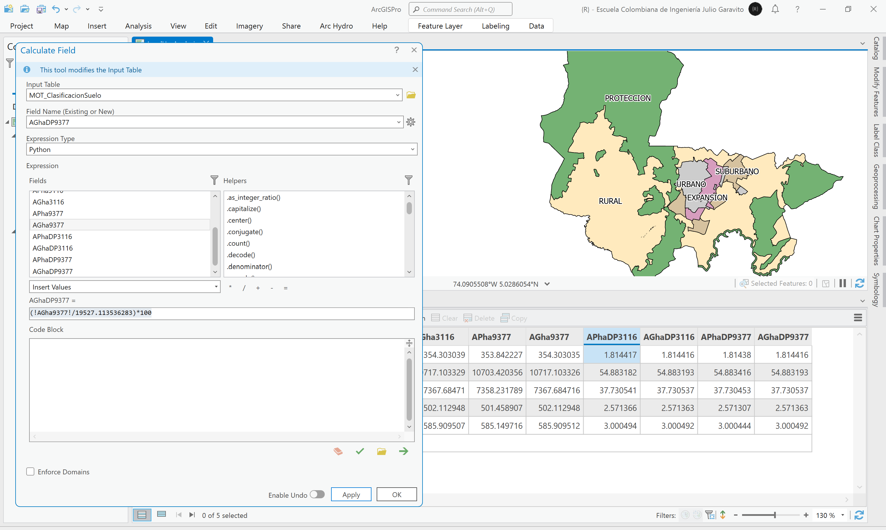

7. Para verificar que las distribuciones porcentuales son correctas, de clic derecho en el campo `APhaDP3116`, seleccione la opción _Visual Statistics_ y verifique que el total de la distribución sea 100%. Verifique también las demás distribuciones.

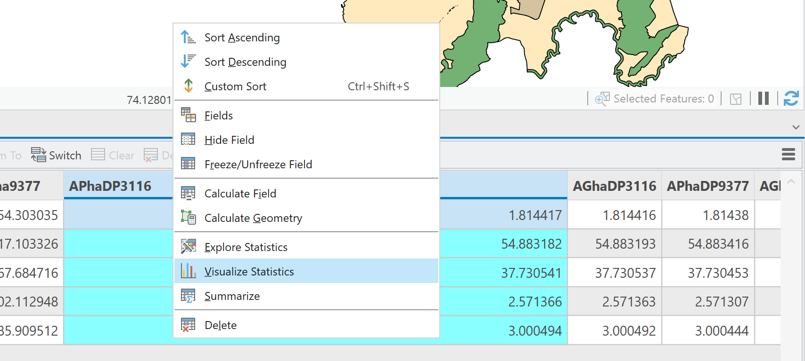

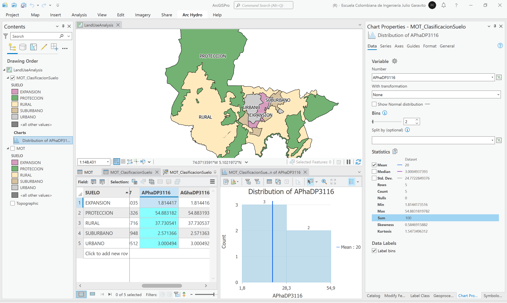

8. Para visualizar los resultados obtenidos, cree gráficos de pastel representado las áreas obtenidas.

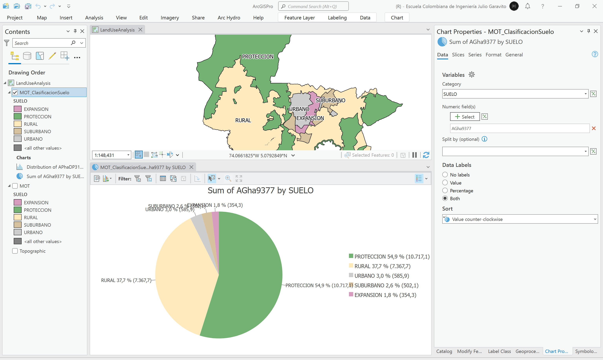

## 2. Análisis de diferencias

En la siguiente tabla de resumen e ilustración, podrá observar las diferencias encontradas entre las áreas por clasificación de suelo a partir de los datos mostrados en el mapa oficial del POT CG-01, con respecto a las asignaciones de categoría de suelo contenidas en la capa _MOT.shp_.

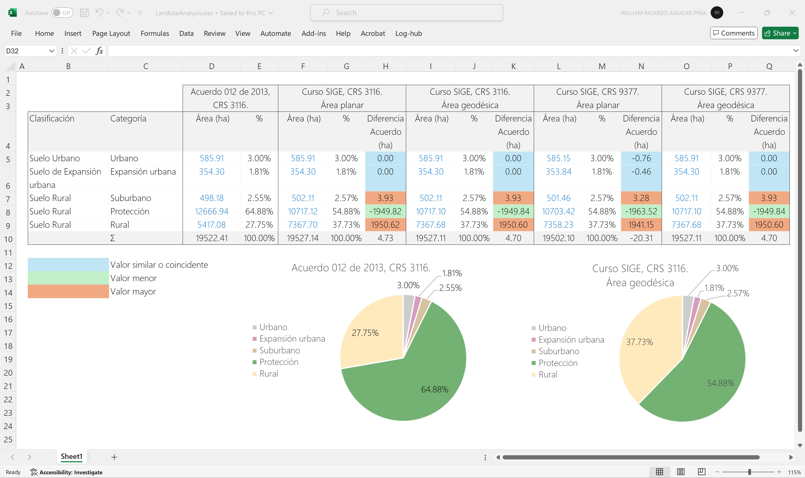

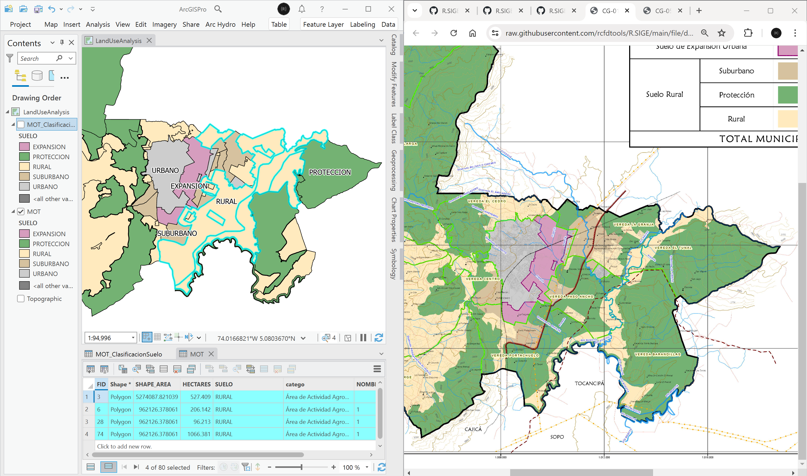

Diferencias:  
* Existe una diferencia de aproximadamente 4.7 hectáreas, entre el área total municipal mostrada en el mapa oficial y en los totales calculados a partir de la capa del MOT.
* En la capa MOT y a partir de los valores obtenidos con el CRS 3116, los suelos clasificados como suburbanos son 3.93 ha mayores a los mostrados en el mapa oficial CG-01.
* En la capa MOT y a partir de los valores obtenidos con el CRS 3116, los suelos clasificados como protección son 1949.82 ha menores a los mostrados en el mapa oficial CG-01.
* En la capa MOT y a partir de los valores obtenidos con el CRS 3116, los suelos clasificados como rural son 1950.62 ha mayores a los mostrados en el mapa oficial CG-01.
* En la ilustración mostrada, se puede observar que algunas de las categorías del MOT han sido catalogadas en una clasificación de suelo diferente a la mostrada en el mapa oficial CG-01.
 
> Para los análisis de Plusvalía, es necesario verificar las clasificaciones de suelo del MOT para poder identificar y asociar correctamente el hecho generador (plusvalía o minusvalía). 

## 3. Análisis usando software libre - QGIS

Para el desarrollo de las actividades desarrolladas en esta clase, se pueden utilizar en QGIS las siguientes herramientas o geo-procesos:

| Proceso                         | Procedimiento                                                                                                                                                                                                                                                                                                                                                                                                                       |
|:--------------------------------|:------------------------------------------------------------------------------------------------------------------------------------------------------------------------------------------------------------------------------------------------------------------------------------------------------------------------------------------------------------------------------------------------------------------------------------|
| Simbología                      | Modificable desde las propiedades de la capa en la pestaña _Symbology_.                                                                                                                                                                                                                                                                                                                                                             |
| Rotulado                        | Modificable desde las propiedades de la capa en la pestaña _Labels_.                                                                                                                                                                                                                                                                                                                                                                |
| Disolución                      | Se ejecuta desde el _Processing Toolbox / Vector Geometry / [Dissolve](https://docs.qgis.org/3.34/en/docs/user_manual/processing_algs/qgis/vectorgeometry.html#dissolve)_ o desde el menú _Vector / Geoprocessing Tools / Dissolve_.                                                                                                                                                                                                |
| Cálculos geométricos o de campo | Directamente desde la tabla de atributos mediante el botón _Open Field Calculator_ o <kbd>Ctr</kbd>+<kbd>I</kbd>. La geometría de cálculo `$area` permite obtener el valor elipsoidal y `area` el valor proyectado.                                                                                                                                                                                                                 |
| Estadísticas de campo           | Se obtienen desde el menú _Vector_ a través de la opción _Analysis Tools / [Basic Statistics for Fields](https://docs.qgis.org/3.34/en/docs/user_manual/processing_algs/qgis/vectoranalysis.html#basic-statistics-for-fields)_. Obtendrá: Count, Unique, Empty, Filled, Min, Max, Cv, Sum, Mean, Std_Dev, Range, Median, Minority, Majority, Firstquartile, Thirdquartile, IQR.                                                     |

Ejemplo rótulo en QGIS: `'A(ha): ' ||  round("AGha", 2) || '\n' || 'P (m): ' ||  round("PGm", 2) `

[:notebook:QGIS training manual](https://docs.qgis.org/3.34/en/docs/training_manual/)

## Elementos requeridos en diccionario de datos

Agregue a la tabla resúmen generada en la actividad [Inventario de información geo-espacial recopilada del POT y diccionario de datos](../POTLayer/Readme.md), las capas generadas en esta actividad que se encuentran listadas a continuación:

| Nombre                     | Descripción                                                                                     | Geometría   | Registros | 
|----------------------------|-------------------------------------------------------------------------------------------------|-------------|-----------| 
| MOT_ClasificacionSuelo.shp | Mapa de clasificación del suelo a partir de disolución del Modelo de Ocupación Territorial MOT. | Polígono 2D | 5         | 

> :bulb:Para funcionarios que se encuentran ensamblando el SIG de su municipio, se recomienda incluir y documentar estas capas en el Diccionario de Datos.

## Actividades de proyecto :triangular_ruler:

En la siguiente tabla se listan las actividades que deben ser desarrolladas y documentadas por cada grupo de proyecto en un único archivo de Adobe Acrobat .pdf. El documento debe incluir portada (indicando el caso de estudio, número de avance, nombre del módulo, fecha de presentación, nombres completos de los integrantes), numeración de páginas, tabla de contenido, lista de tablas, lista de ilustraciones, introducción, objetivo general, capítulos por cada ítem solicitado, conclusiones y referencias bibliográficas.

| Actividad     | Alcance                                                                                                                                                                                                                                                                                                                                                                                                                                             |
|:--------------|:----------------------------------------------------------------------------------------------------------------------------------------------------------------------------------------------------------------------------------------------------------------------------------------------------------------------------------------------------------------------------------------------------------------------------------------------------|
| Avance **P2** | Desarrollar los numerales descritos en esta actividad incluyendo: mapa detallado que represente las categorías del MOT utilizando los mismos colores definidos en el mapa oficial CG-01 del POT, tabla de resumen estadístico y gráficos de barras, y tabla de comparación entre el análisis realizado y los valores reportados en el mapa CG-01 del POT. Explique las diferencias encontradas.                                                     | 
| Avance **P2** | A partir de las sub categorías definidas en la capa MOT.shp, realice el análisis de áreas disueltas y compare los resultados obtenidos con los mostrados en el mapa oficial CG-05. Explique las diferencias encontradas.                                                                                                                                                                                                                            | 
| Avance **P2** | :compass:Mapa digital impreso _P2-3: Categorías de suelo con tabla de distribución y comparación_ Incluir tablas de resultados y gráficos de análisis. Embebido dentro del informe final como una imágen y referenciados como anexo.                                                                                                                                                                                                           | 
| Avance **P2** | En una tabla y al final del informe de avance de esta entrega, indique el detalle de las sub-actividades realizadas por cada integrante de su grupo. Para actividades que no requieren del desarrollo de elementos de avance, indicar si realizo la lectura de la guía de clase y las lecturas indicadas al inicio en los requerimientos. Utilice las siguientes columnas: Nombre del integrante, Actividades realizadas, Tiempo dedicado en horas. | 

> No es necesario presentar un documento de avance independiente, todos los avances de proyecto de este módulo se integran en un único documento.
> 
> En el informe único, incluya un numeral para esta actividad y sub-numerales para el desarrollo de las diferentes sub-actividades, siguiendo en el mismo orden de desarrollo presentado en esta actividad.

## Referencias

* https://docs.qgis.org/3.34/en/docs/user_manual/processing_algs/qgis/vectoranalysis.html#basic-statistics-for-fields
* https://pro.arcgis.com/es/pro-app/latest/help/analysis/geoprocessing/data-engineering/what-is-data-engineering.htm

## Control de versiones

| Versión    | Descripción                                                | Autor                                      | Horas |
|------------|:-----------------------------------------------------------|--------------------------------------------|:-----:|
| 2024.03.11 | Versión inicial con alcance de la actividad                | [rcfdtools](https://github.com/rcfdtools)  |   4   |
| 2024.07.12 | Investigación y documentación para caso de estudio general | [rcfdtools](https://github.com/rcfdtools)  |   5   |

_R.SIGE es de uso libre para fines académicos, conoce nuestra licencia, cláusulas, condiciones de uso y como referenciar los contenidos publicados en este repositorio, dando [clic aquí](LICENSE.md)._

_¡Encontraste útil este repositorio!, apoya su difusión marcando este repositorio con una ⭐ o síguenos dando clic en el botón Follow de [rcfdtools](https://github.com/rcfdtools) en GitHub._

| [◄ Anterior](../Layout/Readme.md) | [:house: Inicio](../../README.md) | [:beginner: Ayuda / Colabora](https://github.com/rcfdtools/R.SIGE/discussions/14) | [Siguiente ►](../AddedValue/Readme.md) |
|--------------------------------------------------|-----------------------------------|-----------------------------------------------------------------------------------|------------------------------------------------------|

[^1]: 