# 4.2. Análisis de destinaciones económicas IGAC (creación de dominios)
Keywords: `domain` `land-economic-use` `land-prohibited-use` `landuse`

A partir de los predios urbanos y rurales importados en la GDB, realice una unión de capas para obtener una base de datos integrada de predios. A partir de un resumen estadístico, indique el número de predios de cada vereda y del área urbana, calcule el total del área predial de cada grupo. A partir de un Join entre la capa geográfica de predios y utilizando solo la información disponible en números de orden iguale a 1 de la tabla catastro, cree un resumen estadístico indicando el número de predios por destinación económica principal. En la base de datos, cree un nuevo dominio con el nombre `destino_econ` normalizando como campo de texto los códigos disponibles en el artículo 86 de la Resolución 70 de 2011 Instituto Geográfico Agustín Codazzi. Asocie el dominio creado con el campo de atributos `destino_econ` de la capa de predios. Cree un mapa de disolución que represente las destinaciones económicas principales de todo el municipio y compare las destinaciónes economicas catastrales con el mapa MOT correspondiente al modelo de ocupación territorial establecido en el POT, explique las diferencias entre estos dos mapas.

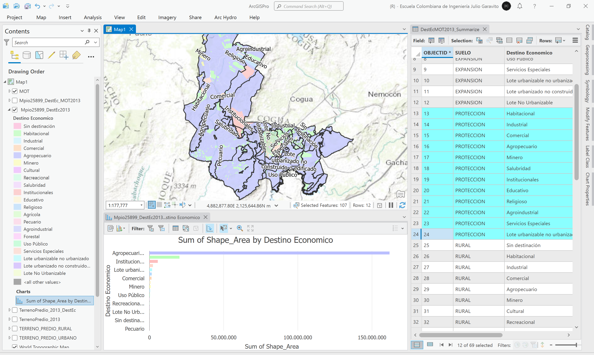

## Objetivos

* Integrar la capa de predios urbanos y rurales generando un análisis estadístico general.
* Crea un dominio de base de datos que contenga los descriptores de destinaciones económicas del IGAC.
* Crear el mapa de destinaciones económicas y comparar sus límites con los del mapa del modelo de ocupación territorial - MOT.
* Identificar actividades económicas y zonas geográficas incompatibles con las categorías de uso definidas en el POT. 

## Requerimientos

* [:mortar_board:Actividad](../POTLayer/Readme.md): Inventario de información geo-espacial recopilada del POT y diccionario de datos.
* [:toolbox:Herramienta](https://www.microsoft.com/es/microsoft-365/excel?market=bz): Microsoft Excel 365.
* [:toolbox:Herramienta](https://www.esri.com/en-us/arcgis/products/arcgis-pro/overview): ESRI ArcGIS Pro 3.3.1 o superior.
* [:toolbox:Herramienta](https://qgis.org/): QGIS 3.38 o superior.
* [:open_file_folder:LandUseIGAC.xlsx](LandUseIGAC.xlsx): libro con códigos y descriptores de destinaciones económicas de predios IGAC.

## 1. Combinación de predios urbanos y rurales (base predial)

1. Abra el proyecto de ArcGIS Pro, creado previamente y desde el menú _Insert_ cree un nuevo mapa _New Map_, renombre como _LandUseIGAC_ y establezca el CRS 9377. Agregue al mapa las clases de entidad de predios urbanos y rurales disponibles en la base de datos geográfica en las rutas `\file\gdb\SIGE.gdb\IGAC2013Urbano\TERRENO_PREDIO_URBANO` y `\file\gdb\SIGE.gdb\IGAC2013Rural\TERRENO_PREDIO_RURAL`.

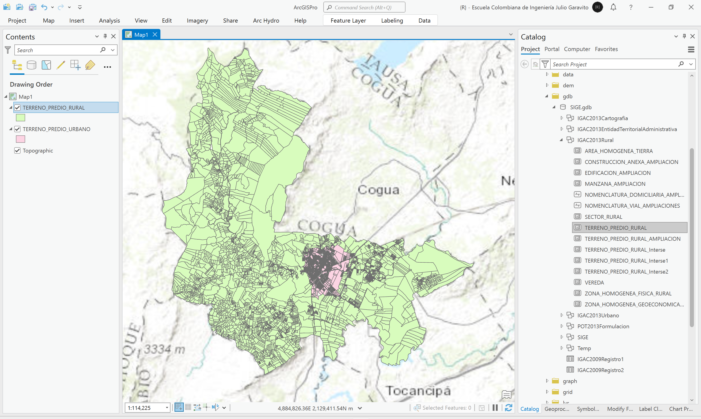

2. Utilizando la herramienta de geo-procesamiento _Data Management Tools / Merge_, integre la capa de predios urbanos y rurales excluyendo todos los campos relacionados con áreas y perímetros, nombre como `\file\gdb\SIGE.gdb\SIGE\TerrenoPredio_2013` y simbolice por valores únicos a partir del campo `vereda_id` o código de identificación de vereda. Podrá observar que la capa contiene 26304 predios y que los predios urbanos no tienen asociado un código de vereda. 

> Al incorporar clases de entidad dentro de una base de datos, las propiedades geométricas de área y perímetro son calculadas automáticamente en los campos `Shape_Area` y `Shape_Length`, cuyos valores son calculados a partir de los valores planares obtenidos usando el sistema de proyección de coordenadas del dataset.

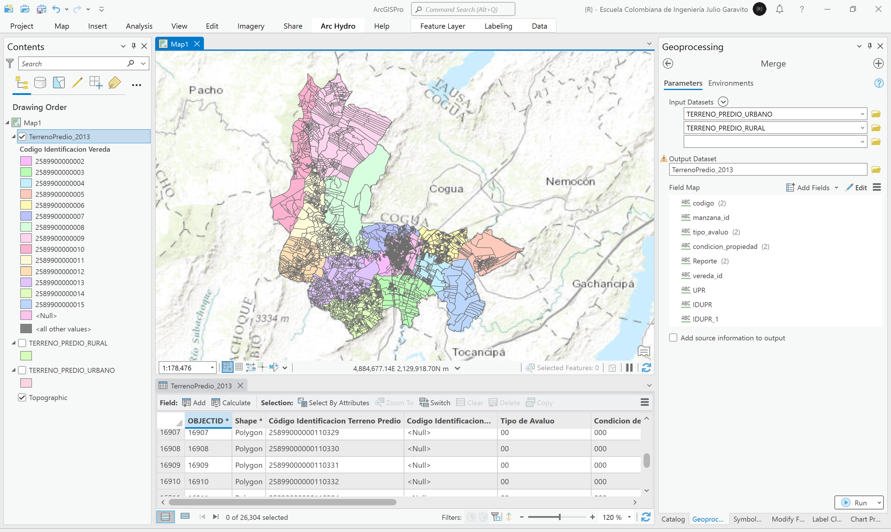

3. Para la generación de gráficos estadísticos de análisis, es necesario agregar en el campo `vereda_id`, el identificador correspondiente a predios urbano. Utilizando el campo _tipo_avaluo_, realice una selección por atributos de los predios urbanos (`tipo_avaluo = '01'` obteniendo 16750 predios), luego desde la tabla de atributos y con el calculador de campo, asigne en el campo de código veredal, los 7 primeros caracteres del código predial (Python slice: `!codigo![:7]`). Ajuste la simbología para representar correctamente el código urbano.

> Para obtener un slice derecho en Python, puede utilizar p. ej., la expresión `!vereda_id![-2:]`

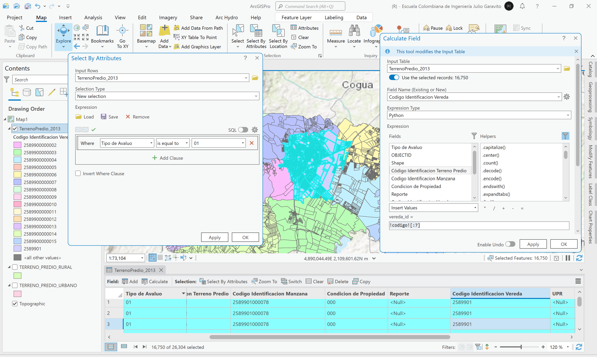

4. A partir del campo `tipo_avaluo`, cree un gráfico de pastel totalizando el área. Como observa, a nivel predial, el área urbana ocupa el 3.4% del área municipal, y el área rural el 96.6%.

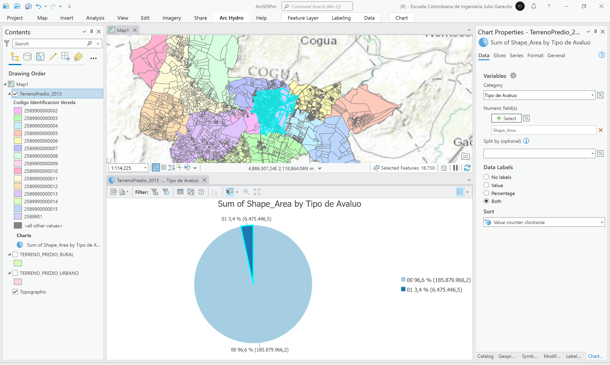

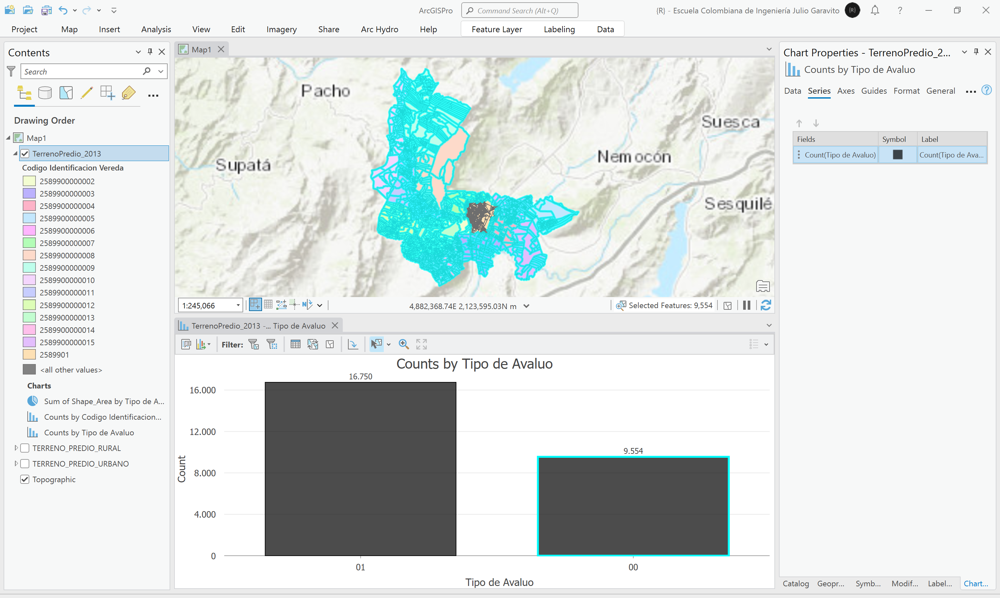

6. A partir del campo `vereda_id`, cree un gráfico de barras totalizando el área. Como observa, a nivel predial, la vereda con mayor extensión es la 2589900000009 y la zona que contiene el mayor número de unidades prediales, es la urbana.

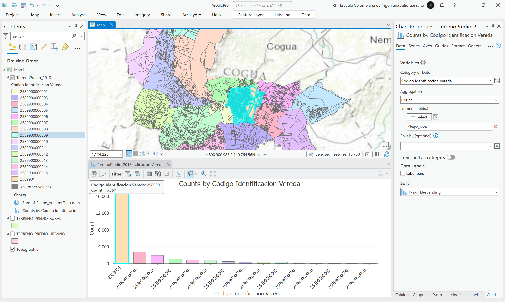

## 2. Base catastral Registro 1

Para el estudio de las destinaciones económicas, utilizaremos el Registro 1 del IGAC, que corresponde a información catastral en su componente alfanumérico y describe los siguientes aspectos generales del predio en su aspecto físico:

* Departamento
* Municipio
* Número predial
* Dirección
* Destino económico
* Área de terreno (m²)
* Área construida (m²)

> En cuanto al Registro 2, este corresponde a la información catastral en su componente alfanumérico y describe los aspectos generales del predio en su aspecto físico, tales como: Departamento, Municipio, Número predial, Zona homogénea física, Zona homogénea geoeconómica, Número de baños, Número de locales, Número de pisos, Tipificación, Uso construcción, Puntaje y Área construida (m²). 

Agregue a la tabla de contenido, el registro 1 del IGAC disponible en la raíz de la base de datos, abra la tabla y revise su contenido. Como observa, los registros descargados de https://www.colombiaot.gov.co/, contienen la información básica regular (incluída la destinación económica representada por una letra), e información de los propietarios.

> De acuerdo al Artículo 6° de la Ley 1266 de 2008 de Derechos de los titulares de la información, la administración de datos semiprivados y privados requiere el consentimiento previo y expreso del titular de los datos, salvo en el caso del dato financiero, crediticio, comercial, de servicios y el proveniente de terceros países el cual no requiere autorización del titular. En todo caso, la administración de datos semiprivados y privados se sujeta al cumplimiento de los principios de la administración de datos personales y a las demás disposiciones de esta ley.

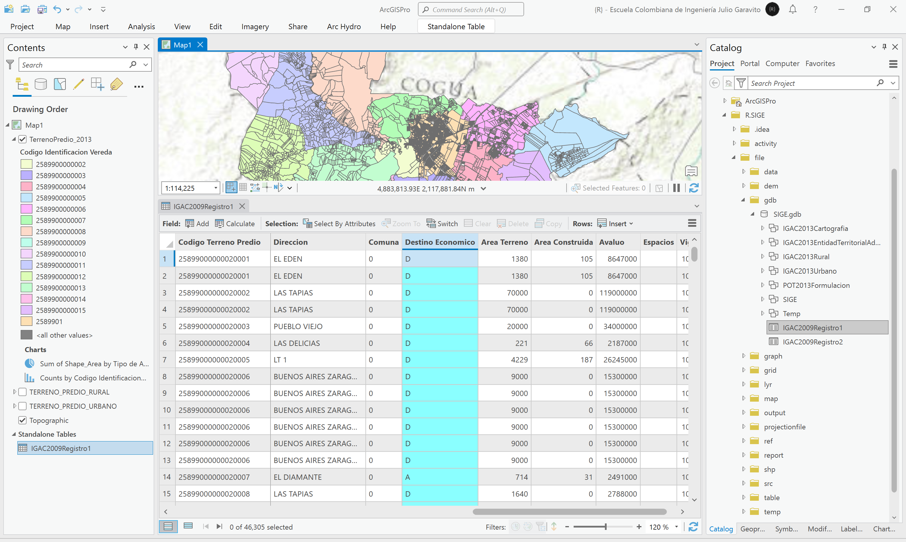

## 3. Dominio de destinaciones catastrales

El Artículo 86 de la [Resolución 70 de 2011](../../file/ref/resolucion_70_de_2011.pdf) Instituto Geográfico Agustín Codazzi, contiene la descripción de las destinaciones económicas asociadas a un predio, correspondientes a:

|  DestEc  | DestEcNom                                 | DestEcDesc                                                                                                                                                                                                                                                                                                                                                                                                                                                                                                                                                                                                                                                                                                                                                                     |
|:--------:|-------------------------------------------|--------------------------------------------------------------------------------------------------------------------------------------------------------------------------------------------------------------------------------------------------------------------------------------------------------------------------------------------------------------------------------------------------------------------------------------------------------------------------------------------------------------------------------------------------------------------------------------------------------------------------------------------------------------------------------------------------------------------------------------------------------------------------------|
|    0     | Sin destinación                           | Sin destinación asociada                                                                                                                                                                                                                                                                                                                                                                                                                                                                                                                                                                                                                                                                                                                                                       |
|    A     | Habitacional                              | Predios destinados a vivienda. Se incluyen dentro de esta clase los parqueaderos, garajes y depósitos contenidos en el reglamento de propiedad horizontal, ligado a este destino.                                                                                                                                                                                                                                                                                                                                                                                                                                                                                                                                                                                              |
|    B     | Industrial                                | Predios en los cuales se desarrollan actividades de elaboración y transformación de materias primas.                                                                                                                                                                                                                                                                                                                                                                                                                                                                                                                                                                                                                                                                           |
|    C     | Comercial                                 | Predios destinados al intercambio de bienes y/o servicios con el fin de satisfacer las necesidades de una colectividad.                                                                                                                                                                                                                                                                                                                                                                                                                                                                                                                                                                                                                                                        |
|    D     | Agropecuario                              | Predios con destinación agrícola y pecuaria.                                                                                                                                                                                                                                                                                                                                                                                                                                                                                                                                                                                                                                                                                                                                   |
|    E     | Minero                                    | Predios destinados a la extracción y explotación de minerales.                                                                                                                                                                                                                                                                                                                                                                                                                                                                                                                                                                                                                                                                                                                 |
|    F     | Cultural                                  | Predios destinados al desarrollo de actividades artísticas e intelectuales.                                                                                                                                                                                                                                                                                                                                                                                                                                                                                                                                                                                                                                                                                                    |
|    G     | Recreacional                              | Predios dedicados al desarrollo o a la práctica de actividades de esparcimiento y entretenimiento.                                                                                                                                                                                                                                                                                                                                                                                                                                                                                                                                                                                                                                                                             |
|    H     | Salubridad                                | Predios destinados a clínicas, hospitales y puestos de salud.                                                                                                                                                                                                                                                                                                                                                                                                                                                                                                                                                                                                                                                                                                                  |
|    I     | Institucionales                           | Predios destinados a la administración y prestación de servicios del Estado y que no están incluidos en los literales de este artículo.                                                                                                                                                                                                                                                                                                                                                                                                                                                                                                                                                                                                                                        |
|    J     | Educativo                                 | Predios destinados al desarrollo de actividades académicas.                                                                                                                                                                                                                                                                                                                                                                                                                                                                                                                                                                                                                                                                                                                    |
|    K     | Religioso                                 | Predios destinados a la práctica de culto religioso.                                                                                                                                                                                                                                                                                                                                                                                                                                                                                                                                                                                                                                                                                                                           |
|    L     | Agrícola                                  | Predios destinados a la siembra y aprovechamiento de especies vegetales.                                                                                                                                                                                                                                                                                                                                                                                                                                                                                                                                                                                                                                                                                                       |
|    M     | Pecuario                                  | Predios destinados a la cría, beneficio y aprovechamiento de especies animales.                                                                                                                                                                                                                                                                                                                                                                                                                                                                                                                                                                                                                                                                                                |
|    N     | Agroindustrial                            | Predios destinados a la actividad que implica cultivo y transformación en los sectores agrícola, pecuario y forestal.                                                                                                                                                                                                                                                                                                                                                                                                                                                                                                                                                                                                                                                          |
|    O     | Forestal                                  | Predios destinados a la explotación de especies maderables y no maderables.                                                                                                                                                                                                                                                                                                                                                                                                                                                                                                                                                                                                                                                                                                    |
|    P     | Uso Público                               | Predios cuyo uso es abierto a la comunidad y que no están incluidos en los literales anteriores.                                                                                                                                                                                                                                                                                                                                                                                                                                                                                                                                                                                                                                                                               |
|    Q     | Servicios Especiales                      | Predios que genera alto impacto ambiental y /o Social. Entre otros, están:  Centro de Almacenamiento de Combustible, Cementerios, Embalses, Rellenos Sanitarios, Lagunas de Oxidación, Mataderos, Frigoríficos y Cárceles. Parágrafo 1°. Esta clasificación podrá ser objeto de subclasificación de acuerdo con lo establecido mediante reglamento del Instituto Geográfico "Agustín Codazzi". Parágrafo 2°. En los casos de existir diversas destinaciones en un mismo predio, se clasificará atendiendo aquella actividad predominante que se desarrolle, para lo cual se aplicará el criterio de tomar la mayor área de terreno y /o construcción. Parágrafo 3°. Para fines catastrales y estadísticos los lotes se clasificarán de acuerdo con su grado de desarrollo, así |
|    R     | Lote urbanizable no urbanizado            | Predios no construidos que estando reglamentados para su desarrollo, no han sido urbanizados.                                                                                                                                                                                                                                                                                                                                                                                                                                                                                                                                                                                                                                                                                  |
|    S     | Lote urbanizado no construido o edificado | Predios no construidos que cuentan con algún tipo de obra de urbanismo.                                                                                                                                                                                                                                                                                                                                                                                                                                                                                                                                                                                                                                                                                                        |
|    T     | Lote no Urbanizable                       | Predios que de conformidad con la reglamentación no se permite su desarrollo urbanístico.                                                                                                                                                                                                                                                                                                                                                                                                                                                                                                                                                                                                                                                                                      |

1. Desde el libro de Excel suministrado _LandUseIGAC.xlsx_, cargue al proyecto la hoja _DestEc_. Verifique que contenga 21 registros.

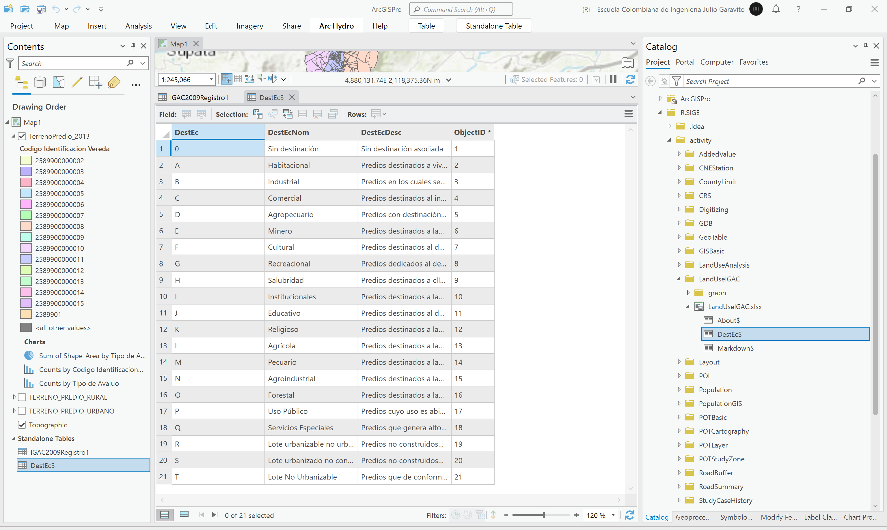

2. Utilizando la herramienta de geo-procesamiento Data Management _Tools / Table To Domain_, cree la tabla de dominio. Dando botón derecho sobre la base de datos geográfica _SIGE.gdb_, consulte las tablas de dominio mediante la opción _Domains_.

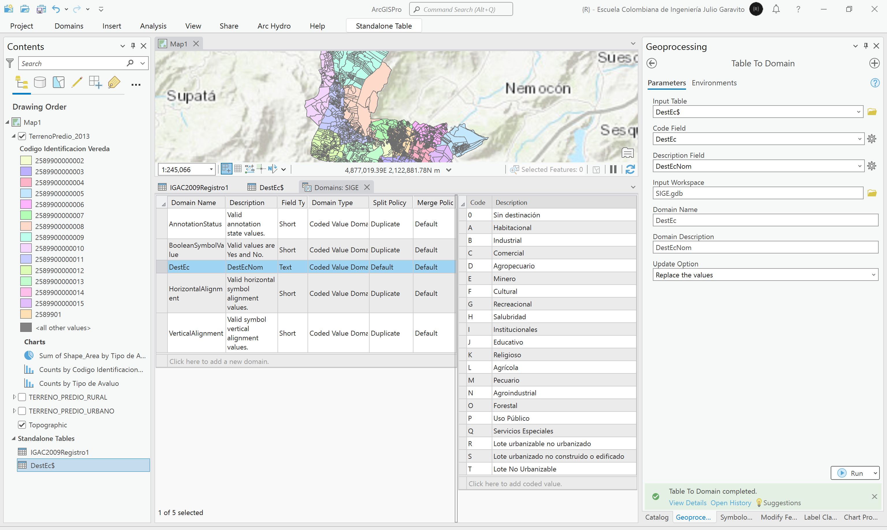

3. En la tabla de atributos _Registro1_ y desde el editor de campos, asocie el dominio _DestEc_ al campo `destino_econ`.

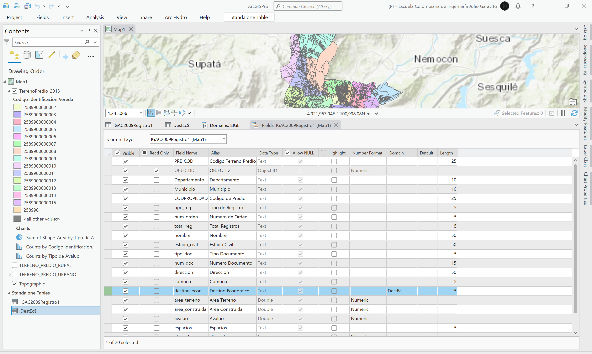

4. A partir de la tabla _Registro1_, cree una gráfica de barras que represente el número de predios por cada destinación. Podrá observar que en los rótulos aparecen los nombres descriptivos de cada destinación y no solo su código, también que la categoría con el mayor número de registros catastrales es la habitacional con 31237 filas.

> Tenga en cuenta que el _Registro1_ del IGAC, contiene la información de todos los propietarios y que el conteo obtenido se refiere al número de registros y no al número de predios.

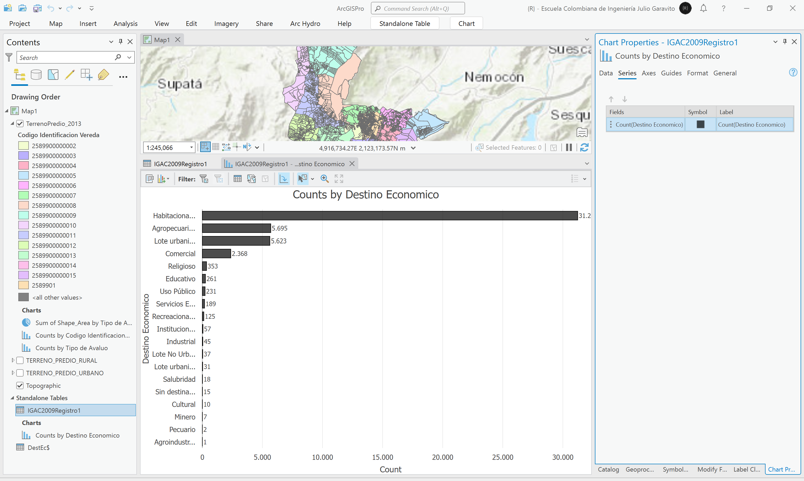

## 4. Integración de predios a registros de catastro y estudio de destinaciones 

1. En la tabla del Registro 1 de catastro, filtre los registros a partir del Orden 1 (`num_orden = '001'`), de los 46305 registros obtendrá 30939.  

> El filtro le permitirá obtener los registros correspondientes solo al propietario principal de cada una de las mejoras o propiedades horizontales de cada inmueble. Si bien, en un predio pueden existir múltiples propiedades horizontales y mejoras con diferentes destinaciones, se puede considerar como predominante la contenida en el orden 001. Para obtener solo la primera mejora y el primer número de orden, puede crear una columna de atributos tipo texto de 3 caracteres y obtener los 3 dígitos derechos almacenados en el campo `CODPROPIEDAD`, luego en la expresión de filtrado, puede incluir el condicional "Y" con los valores terminados en _000_.

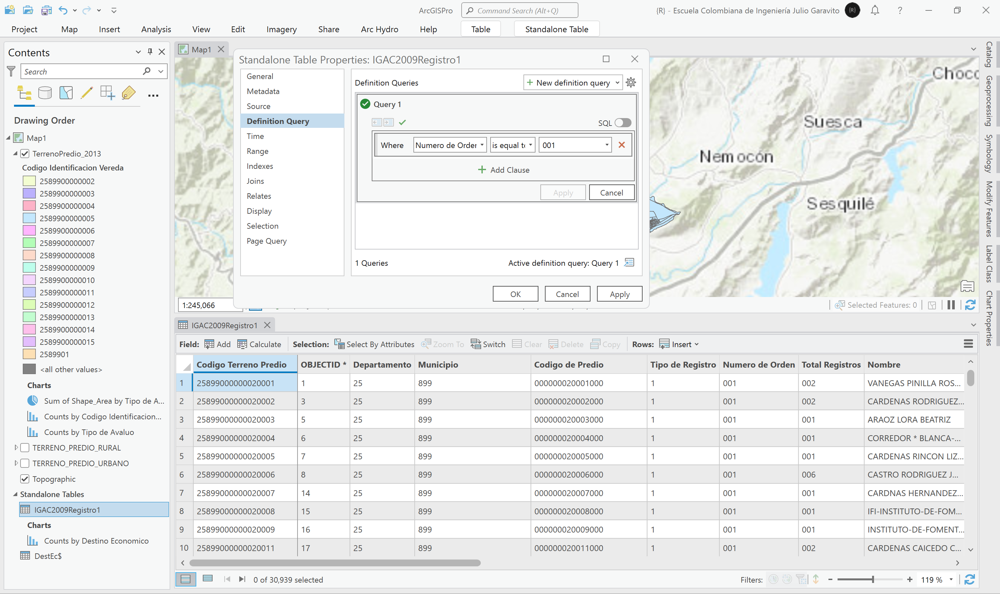

2. Utilizando un _Join_ de tabla, integre los registros de la capa _TerrenoPredio_2013_ con los registros filtrados en la tabla _IGAC2009Registro1_. Podrá observar que en la tabla de atributos de los predios ahora aparecen las columnas correspondientes a los registros catastrales, incluída la destinación económica con la asociación de su dominio.

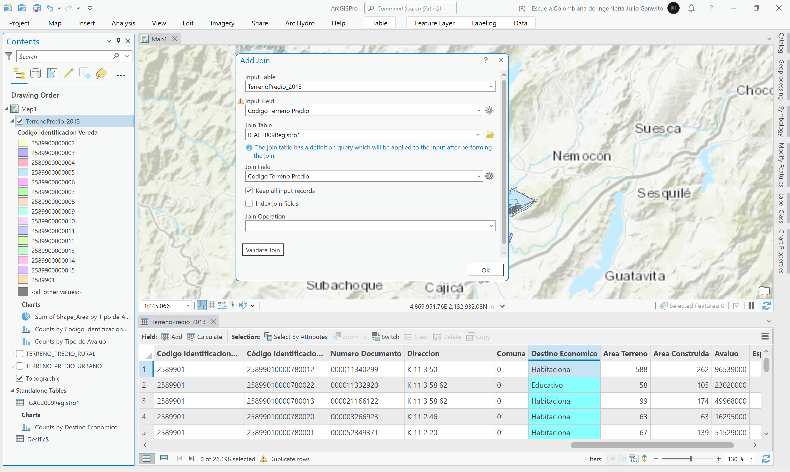

3. Ajuste la simbología de los predios, representando ahora por destinaciones económicas. Podrá observar que no aparecen los nombres descriptivos del dominio, por lo que es necesario, crear una copia de la capa de predios para poder realizar la asociación y representación directa del dominio asociado.

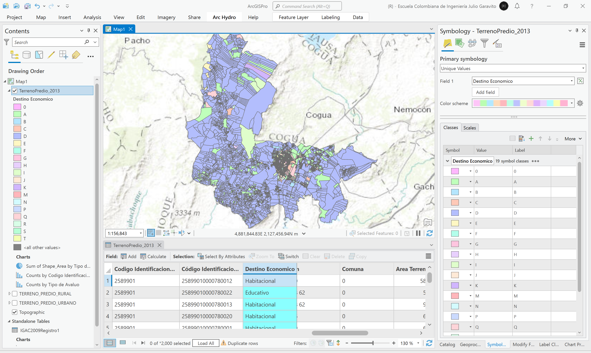

4. En la tabla de contenido o _Contents_, de clic derecho en la capa de predios y mediante la opción _Data / Export Features_, cree una copia de esta capa, nombre como `\file\gdb\SIGE.gdb\SIGE\TerrenoPredio_2013_DestEc`. 

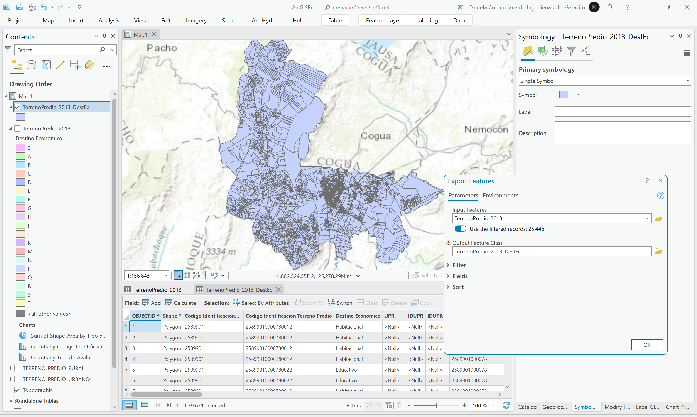

5. Desde las propiedades de campo de la capa creada, asocie al campo `destino_econ` el dominio de destinaciones _DestEc_ y simbolice por este campo. Podrá observar que los descriptores de dominio ahora muestran los valores asociados.

> En versiones recientes de ArcGIS Pro, la asociación de dominio será realizada automáticamente al exportar la copia de la capa de predios.

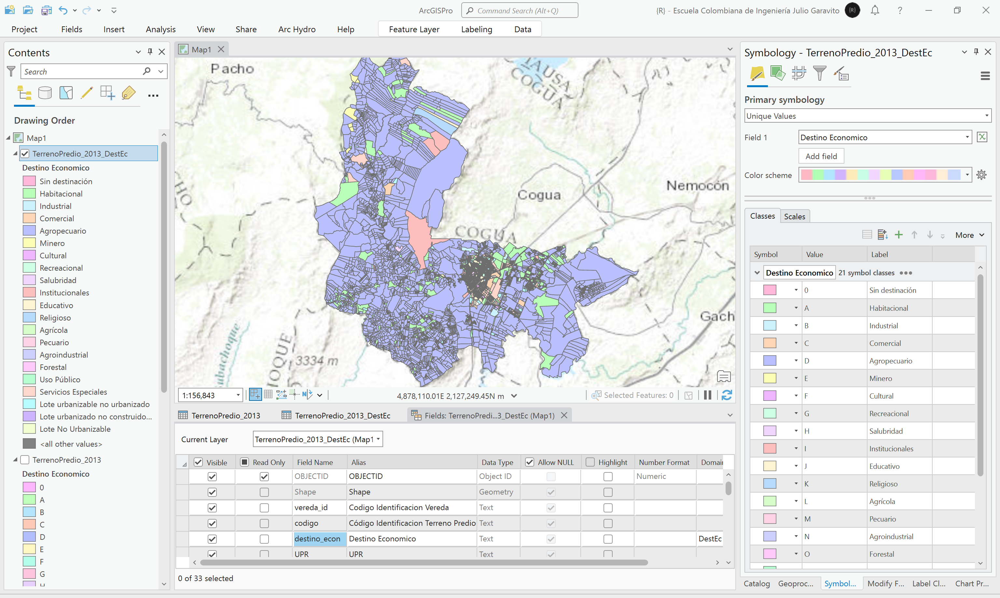

6. Cree gráficos de análisis con el total de predios por destinación y área total. Podrá observar que el mayor número de destinaciones por predio corresponde a usos habitacionales y que en área, el mayor valor corresponde a predios con destinación agropecuaria. 

> Opcionalmente y con la herramienta _Summarize_ (clic derecho sobre el campo `destino_econ` en la tabla de atributos), puede generar un resumen estadístico de predios por destinación económica como tabla.

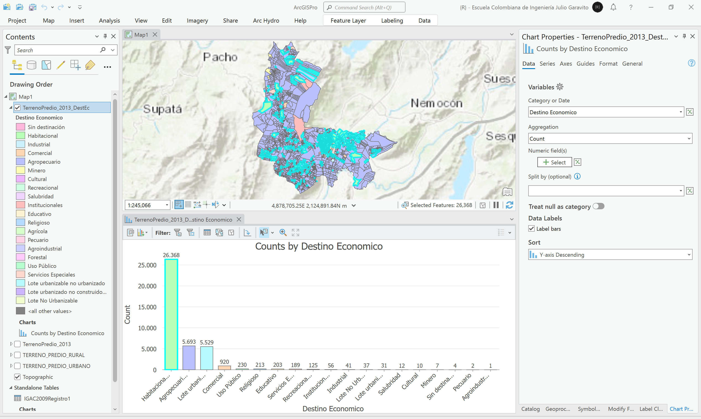

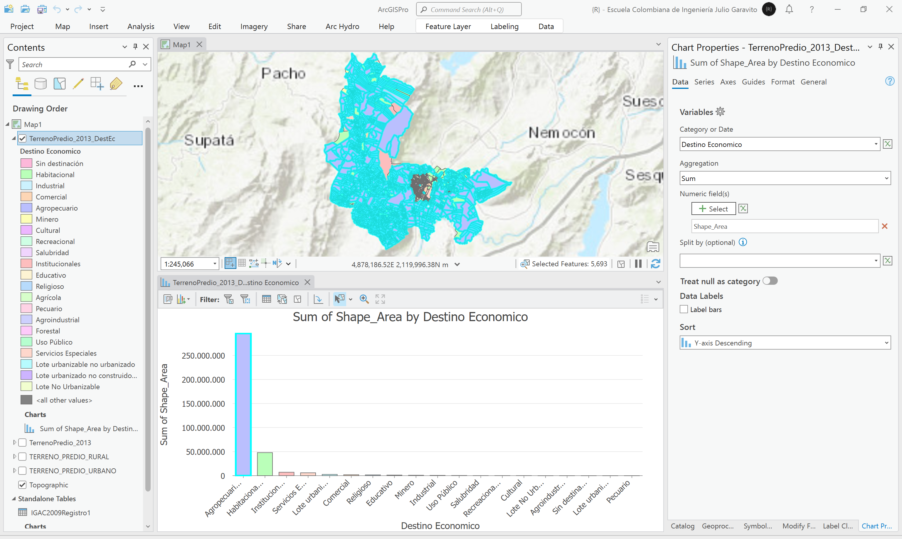

## 5. Destinos económicos vs. Modelo de ocupación territorial - MOT 

1. Utilizando la herramienta de geo-procesamiento _Data Management Tools / Dissolve_, disuelva los predios a partir de las destinaciones económicas, nombre la clase de entidad resultante como `\file\gdb\SIGE.gdb\SIGE\Mpio25899_DestEc2013` y asocie el dominio de destinación económica al campo `destino_econ`. Obtendrá 19 zonas o polígonos multiparte diferentes. Modifique la simbología sin contornos y manteniendo los colores actuales. 

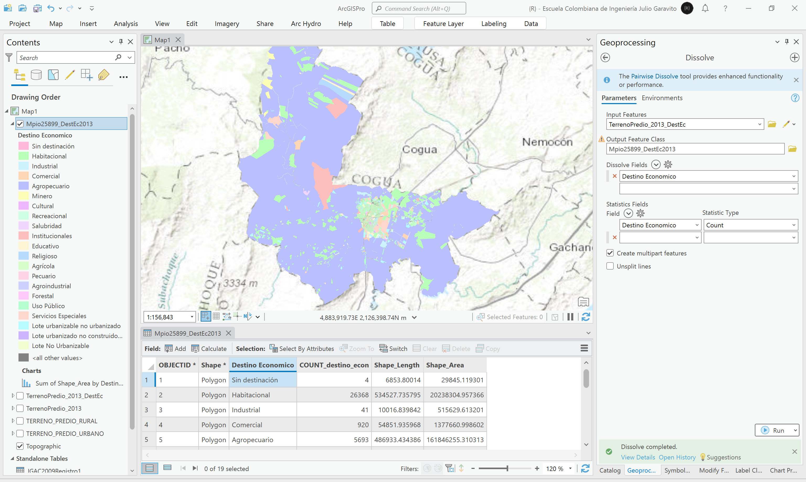

2. Agregue la clase de entidad del modelo de ocupación territorial - MOT desde la ruta `\file\gdb\SIGE.gdb\POT2013Formulacion\MOT`, modifique la simbología utilizando solo contorno y rotule la capa de destinaciones y MOT a partir de los campos `destino_econ` y `SUELO`. Podrá observar que a nivel general, en los suelos clasificados con rural de protección, existen zonas con destinaciones económicas catastrales habitacionales, agroindustriales, comerciales, mineras, de equipamientos y otros usos no compatibles. 

Rótulo Arcade para destinaciones económicas: `DomainName($feature, 'destino_econ')`

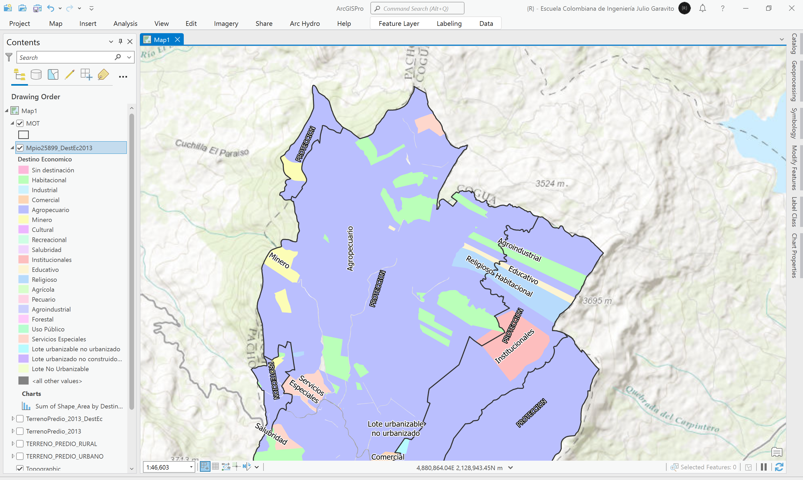

Cambie el mapa de fondo por la imágen satelital de ESRI y establezca transparencia de 30% en la capa de destinaciones.

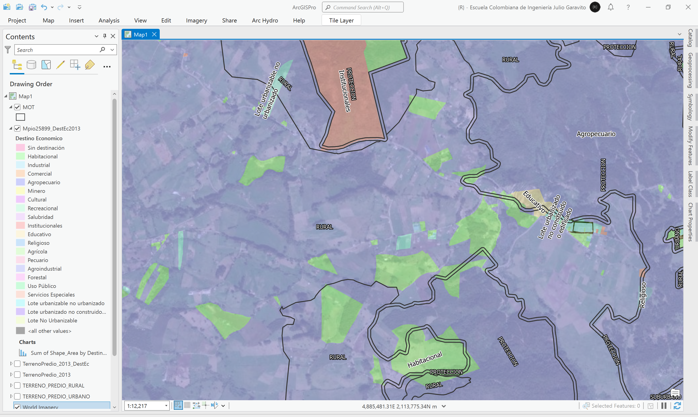

3. Para identificar incompatibilidades entre la clasificación del suelo del MOT y las destinaciones económicas, cree con la herramienta de geo-procesamiento _Analysis Tools / Intersect_, la intersección espacial de estas dos capas y asocie el dominio de destinación económica. Nombre la clase de entidad resultante como `\file\gdb\SIGE.gdb\SIGE\Mpio25899_DestEc_MOT2013` y ajuste la simbología agregando contornos de color blanco. Podrá observar que ahora se identifican sub-fracciones combinadas de los polígonos originales.

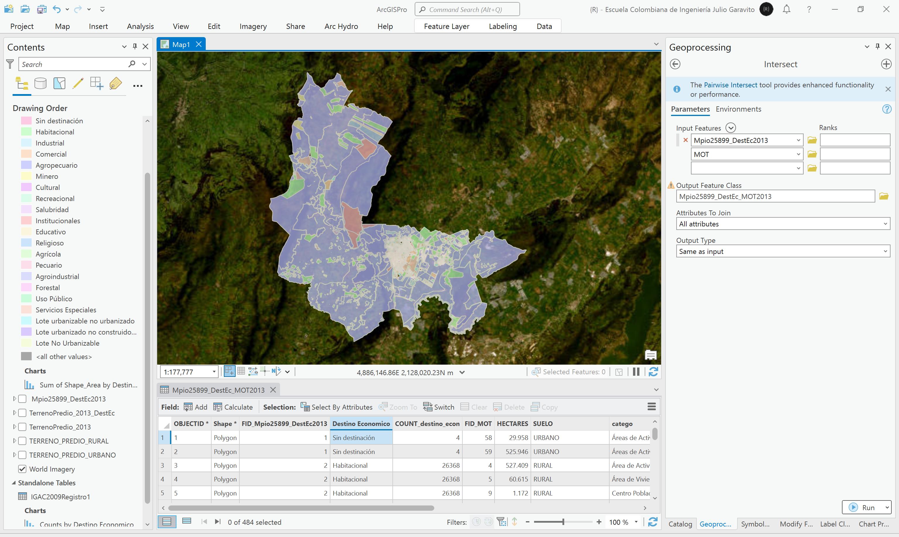

4. A partir de un resumen estadístico de campo, genere una tabla que permita identificar por cada clase de suelo, las destinaciones asociadas. En la tabla de atributos de la capa _Mpio25899_DestEc_MOT2013_, de clic derecho en el campo `SUELO` y seleccione la herramienta _Summarize_. Guarde la tabla resultante como `\file\gdb\SIGE.gdb\DestEcMOT2013_Summarize`.

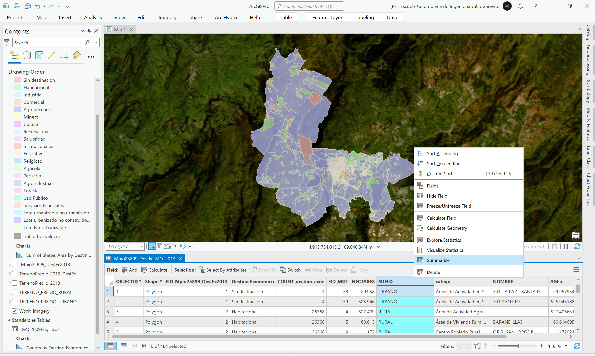

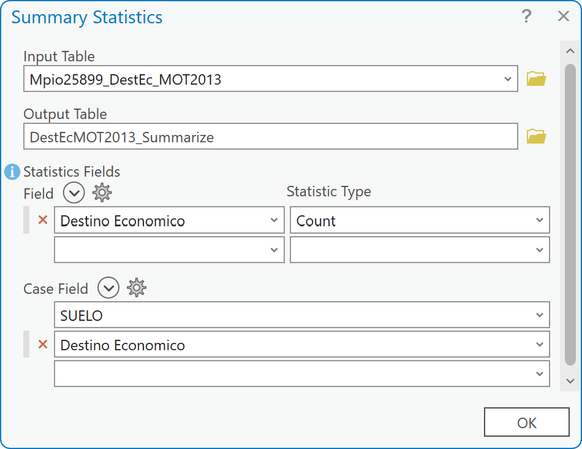

Abra la tabla generada, podrá observar que para cada clase de suelo, se pueden conocer las destinaciones y el número de polígonos multi-parte asociados.

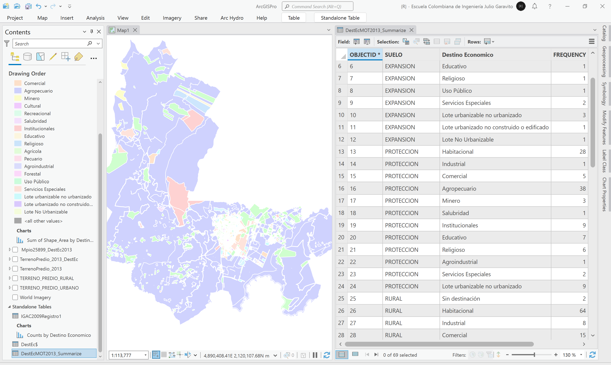

De acuerdo a lo establecido en el Artículo 19 del Acuerdo Municipal 012 de 2013, para la asignación y definición de prioridades y compatibilidades, se distinguen las siguientes cuatro categorías de usos:

| Uso                               | Descripción                                                                                                                                                                                                              |
|-----------------------------------|--------------------------------------------------------------------------------------------------------------------------------------------------------------------------------------------------------------------------|
| Uso principal                     | Uso deseable que coincide con la función específica de la zona y que ofrece las mayores ventajas para el desarrollo sostenible.                                                                                          |
| Usos compatibles                  | Son aquellos que no se oponen al principal y concuerdan con la potencialidad, productividad y protección del suelo y demás recursos naturales conexos.                                                                   |
| Usos condicionados o restringidos | Son aquellos que presentan algún grado de incompatibilidad urbanística y/o ambiental que se puede controlar de acuerdo con las condiciones que impongan las normas urbanísticas y ambientales correspondientes.          |
| Usos prohibidos                   | Son aquellos incompatibles con el uso principal de una zona, con los objetivos de conservación ambiental, de planificación ambiental territorial y por consiguiente, implica graves riesgos de tipo ecológico y social.  |

Con respecto a las áreas de rurales y las de conservación y protección ambiental que definen la estructura ecológica principal y según lo establecido en los Artículos 20 y 135 del mismo Acuerdo, se establecen como prohibidos los siguientes usos:

| Artículo | Categoría de suelo                                                               | Uso prohibido                                                                                                                                                                                                                                                                                                           |
|:--------:|----------------------------------------------------------------------------------|-------------------------------------------------------------------------------------------------------------------------------------------------------------------------------------------------------------------------------------------------------------------------------------------------------------------------|
|    20    | Distrito de manejo integrado páramo y sub-páramo de Guerrero                     | Agropecuario mecanizado, recreación masiva, parcelación con fines de construcción de vivienda campestre, minería y extracción de materiales de construcción.                                                                                                                                                            |
|    20    | Bosque protector                                                                 | Agropecuarios, industriales, urbanísticos, minería, institucionales y actividades como tala, quema, caza y pesca.                                                                                                                                                                                                       |
|    20    | Área de amortiguación de áreas protegidas                                        | Institucionales, agropecuario mecanizado, recreación masiva y parcelaciones con fines de construcción de vivienda campestre, minería y extracción de materiales de construcción.                                                                                                                                        |
|    20    | Ronda de protección río Bogotá – CAR                                             | Agropecuario tradicional, mecanizado o industrial, forestal productor, recreación activa, minero e industrial de todo tipo, extracción de materiales de construcción y/o material de río, disposición de residuos sólidos, quema y tala de vegetación nativa, rocería de la vegetación, caza, residencial de todo tipo. |
|    20    | Áreas periféricas a nacimientos, cauces de ríos y quebradas, lagunas y humedales | Usos agropecuarios, industriales, urbanos, loteo y construcción de viviendas, minería, disposición de residuos sólidos, tala y rocería de la vegetación.                                                                                                                                                                |
|   135    | Área agropecuaria tradicional                                                    | Residencial con intensidad urbana y suburbana, industria, loteos y parcelaciones para uso residencial campestre, minería y los demás no considerados como usos principales, compatibles o condicionados.                                                                                                                |
|   135    | Área agropecuaria semi-intensiva                                                 | Residencial con intensidad urbana y suburbana, industria, loteos y parcelaciones para uso residencial campestre, minería y los demás no considerados como usos principales, compatibles o condicionados.                                                                                                                |
|   135    | Área agropecuaria intensiva                                                      | Residencial con intensidad urbana y suburbana, industria, loteos y parcelaciones para uso residencial campestre, minería y los demás no considerados como usos principales, compatibles o condicionados. Las demás no contempladas.                                                                                     |
|   135    | Área de bosque protector - productor                                             | Agropecuarios, industriales, urbanísticos, minería, institucionales y actividades como tala, quema, caza y pesca. Las demás no contempladas.                                                                                                                                                                            |
|   135    | Área de actividad de vivienda campestre                                          | Residencial con intensidad urbana y suburbana,	industria, minería	y los demás no considerados como usos principales, compatibles o condicionados. Las demás no contempladas.                                                                                                                                            |

A partir de la tabla anterior, se puede concluir que las destinaciones económicas incompatibles o prohibidas en el suelo de protección, corresponden a las mostradas en la siguiente ilustración:

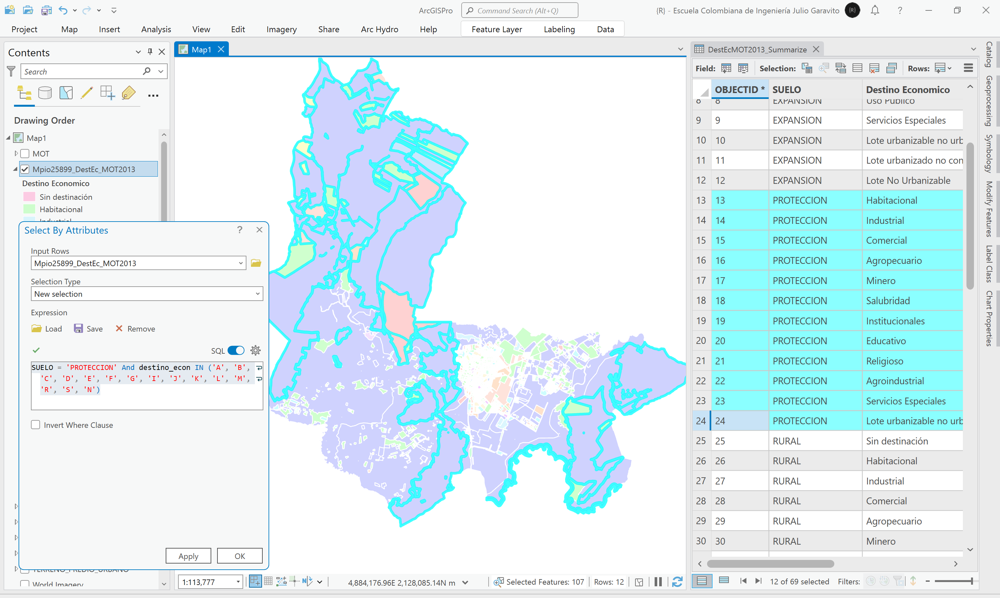

Selection Query: `SUELO = 'PROTECCION' And destino_econ IN ('A', 'B', 'C', 'D', 'E', 'F', 'G', 'I', 'J', 'K', 'L', 'M', 'R', 'S', 'N')` 

## 6. Análisis usando software libre - QGIS

Para el desarrollo de las actividades desarrolladas en esta clase, se pueden utilizar en QGIS las siguientes herramientas o geo-procesos:

| Proceso                         | Procedimiento                                                                                                                                                                                                                                                                                                                                                                                                                                 |
|:--------------------------------|:----------------------------------------------------------------------------------------------------------------------------------------------------------------------------------------------------------------------------------------------------------------------------------------------------------------------------------------------------------------------------------------------------------------------------------------------|
| Simbología                      | Modificable desde las propiedades de la capa en la pestaña _Symbology_.                                                                                                                                                                                                                                                                                                                                                                       |
| Rotulado                        | Modificable desde las propiedades de la capa en la pestaña _Labels_.                                                                                                                                                                                                                                                                                                                                                                          |
| Combinación de capas (Merge)    | Herramienta disponible en el _Processing Toolbox / Vector General / [Merge vector layers](https://docs.qgis.org/3.34/en/docs/user_manual/processing_algs/qgis/vectorgeneral.html#merge-vector-layers)_.                                                                                                                                                                                                                                       |
| Resumen estadístico (Summarize) | Disponible en _Processing Toolbox / Vector Analysis / [Statistics by categories](https://docs.qgis.org/3.34/en/docs/user_manual/processing_algs/qgis/vectoranalysis.html#statistics-by-categories)_.                                                                                                                                                                                                                                          |
| Unión de tablas                 | En las propiedades de capa geográfica, seleccionar la pestaña _Join_ y realizar la unión. Solo se mostrarán los registros correspondientes a la primer coincidencia encontrada. Para visualizar o representar otros valores, es necesario filtrar previamente la tabla a unir.                                                                                                                                                                |
| Disolución (Dissolve)           | Se ejecuta desde el _Processing Toolbox / Vector Geometry / [Dissolve](https://docs.qgis.org/3.34/en/docs/user_manual/processing_algs/qgis/vectorgeometry.html#dissolve)_ o desde el menú _Vector / Geoprocessing Tools / Dissolve_.                                                                                                                                                                                                          |
| Dominios (Domains)              | En QGIS 3.0 o superior, se pueden a través de la pestaña [Attibute Forms](https://docs.qgis.org/3.34/en/docs/training_manual/create_vector_data/forms.html) de la capa, configurar valores codificados de dominio a campos de atributos, que luego puden seleccionados desde la tabla.                                                                                                                                                        |

Ejemplo rótulo en QGIS: `'A(ha): ' ||  round("AGha", 2) || '\n' || 'P (m): ' ||  round("PGm", 2) `

[:notebook:QGIS training manual](https://docs.qgis.org/3.34/en/docs/training_manual/)  
[:notebook:Herramientas comúnmente utilizadas en QGIS](../QGIS.md)

## Elementos requeridos en diccionario de datos

Agregue a la tabla resúmen generada en la actividad [Inventario de información geo-espacial recopilada del POT y diccionario de datos](../POTLayer/Readme.md), las capas generadas en esta actividad que se encuentran listadas a continuación:

| Nombre                    | Descripción                                                                                               | Geometría   | Registros | 
|---------------------------|-----------------------------------------------------------------------------------------------------------|-------------|-----------| 
| TerrenoPredio_2013        | Combinación de predios urbano y rurales utilizados en el diagnóstico del POT.                             | Polígono 2D | 26198     | 
| TerrenoPredio_2013_DestEc | Predios por destinación económica catastral para registros orden 001.                                     | Polígono 2D | 26198     | 
| Mpio25899_DestEc2013      | Destinación económica catastral municipal.                                                                | Polígono 2D | 19        | 
| Mpio25899_DestEc_MOT2013  | Intersección del modelo de ocupación territorial - MOT y el mapa de destinaciones económicas catastrales. | Polígono 2D | 484       | 

> :bulb:Para funcionarios que se encuentran ensamblando el SIG de su municipio, se recomienda incluir y documentar estas capas en el Diccionario de Datos.

## Actividades de proyecto :triangular_ruler:

En la siguiente tabla se listan las actividades que deben ser desarrolladas y documentadas por cada grupo de proyecto en un único archivo de Adobe Acrobat .pdf. El documento debe incluir portada (indicando el caso de estudio, número de avance, nombre del módulo, fecha de presentación, nombres completos de los integrantes), numeración de páginas, tabla de contenido, lista de tablas, lista de ilustraciones, introducción, objetivo general, capítulos por cada ítem solicitado, conclusiones y referencias bibliográficas.

| Actividad     | Alcance                                                                                                                                                                                                                                                                                                                                                                                                                                             |
|:--------------|:----------------------------------------------------------------------------------------------------------------------------------------------------------------------------------------------------------------------------------------------------------------------------------------------------------------------------------------------------------------------------------------------------------------------------------------------------|
| Avance **P4** | Utilizando el procedimiento presentado en esta actividad, realice la integración predial, estudie las destinaciones económicas e identifique las incompatibilidades con respecto al suelo de protección.                                                                                                                                                                                                                                            | 
| Avance **P4** | Descargue la base predial y registros de la última actualización catastral de su caso de estudio, realice un análisis de destinaciones económicas y compare con los valores obtenidos del estudio y adopción del POT.                                                                                                                                                                                                                               | 
| Avance **P4** | :compass:Mapa digital impreso _P4-1: Predios urbanos y rurales 2013 por destinación económica._ Incluir tabla y gráficos de análisis. Embebido dentro del informe final como una imágen y referenciados como anexo.                                                                                                                                                                                                                              | 
| Avance **P4** | :compass:Mapa digital impreso _P4-2: Destinaciones económicas disueltas 2013._ Incluir tabla y gráficos de análisis. Embebido dentro del informe final como una imágen y referenciados como anexo.                                                                                                                                                                                                                                               | 
| Avance **P4** | :compass:Mapa digital impreso _P4-3: Comparación MOT vs. Destinación económicas 2013._ Incluir tabla y gráficos de análisis. Embebido dentro del informe final como una imágen y referenciados como anexo.                                                                                                                                                                                                                                       | 
| Avance **P4** | En una tabla y al final del informe de avance de esta entrega, indique el detalle de las sub-actividades realizadas por cada integrante de su grupo. Para actividades que no requieren del desarrollo de elementos de avance, indicar si realizo la lectura de la guía de clase y las lecturas indicadas al inicio en los requerimientos. Utilice las siguientes columnas: Nombre del integrante, Actividades realizadas, Tiempo dedicado en horas. | 

> No es necesario presentar un documento de avance independiente, todos los avances de proyecto de este módulo se integran en un único documento.
> 
> En el informe único, incluya un numeral para esta actividad y sub-numerales para el desarrollo de las diferentes sub-actividades, siguiendo en el mismo orden de desarrollo presentado en esta actividad.

## Referencias

* [Reglamentación técnica de la formación catastral, la actualización de la formación catastral y la conservación catastral, IGAC.](https://antiguo.igac.gov.co/sites/igac.gov.co/files/normograma/resolucion_70_de_2011.pdf) 
* https://colaboracion.dnp.gov.co/CDT/Programa%20Nacional%20del%20Servicio%20al%20Ciudadano/NORMATIVA%20PROTECCI%C3%93N%20DE%20DATOS%20PERSONALES.pdf
* https://geoportal.igac.gov.co/contenido/datos-abiertos-catastro
* https://gis.stackexchange.com/questions/43712/using-subtypes-and-domains-in-qgis-like-can-be-done-in-arcgis-desktop
* [Base Catastral Nacional en https://www.colombiaenmapas.gov.co/](https://www.colombiaenmapas.gov.co/)
* [Geovisor del municipio de Zipaquirá](https://www.arcgis.com/apps/webappviewer/index.html?id=122af7ada9f1415692af27e9239a6d49)

## Control de versiones

| Versión     | Descripción                                                | Autor                                      | Horas |
|-------------|:-----------------------------------------------------------|--------------------------------------------|:-----:|
| 2024.03.20  | Versión inicial con alcance de la actividad                | [rcfdtools](https://github.com/rcfdtools)  |   4   |
| 2024.07.25 | Investigación y documentación para caso de estudio general | [rcfdtools](https://github.com/rcfdtools)  |   8   |

_R.SIGE es de uso libre para fines académicos, conoce nuestra licencia, cláusulas, condiciones de uso y como referenciar los contenidos publicados en este repositorio, dando [clic aquí](LICENSE.md)._

_¡Encontraste útil este repositorio!, apoya su difusión marcando este repositorio con una ⭐ o síguenos dando clic en el botón Follow de [rcfdtools](https://github.com/rcfdtools) en GitHub._

| [:arrow_backward: Anterior](../GDB/Readme.md) | [:house: Inicio](../../README.md) | [:beginner: Ayuda / Colabora](https://github.com/rcfdtools/R.SIGE/discussions/24) | [Siguiente :arrow_forward:](../LandIndex/Readme.md) |
|-----------------------------------------------|-----------------------------------|-----------------------------------------------------------------------------------|-----------------------------------------------------|

[^1]: 