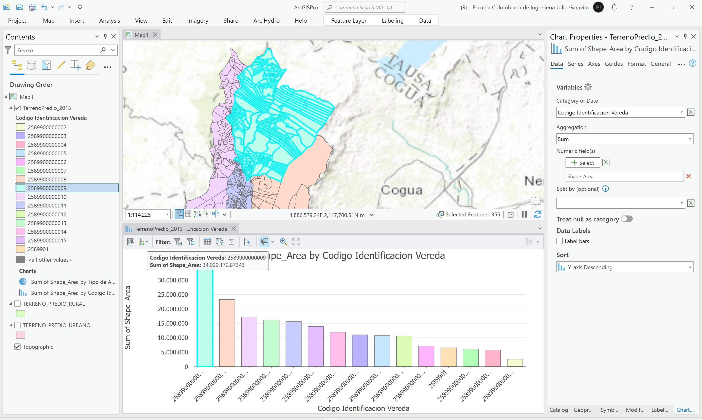

# Análisis de destinaciones económicas IGAC (creación de dominios)
Keywords: `domain` `land-economic-use`

A partir de los predios urbanos y rurales importados en la GDB, realice una unión de capas para obtener una base de datos integrada de predios. A partir de un resumen estadístico, indique el número de predios de cada vereda y del área urbana, calcule el total del área predial de cada grupo. A partir de un Join entre la capa geográfica de predios y utilizando solo la información disponible en números de orden iguale a 1 de la tabla catastro, cree un resumen estadístico indicando el número de predios por destinación económica principal. En la base de datos, cree un nuevo dominio con el nombre `destino_econ` normalizando como campo de texto los códigos disponibles en el artículo 86 de la Resolución 70 de 2011 Instituto Geográfico Agustín Codazzi. Asocie el dominio creado con el campo de atributos `destino_econ` de la capa de predios. Cree un mapa de disolución que represente las destinaciones económicas principales de todo el municipio y compare las destinaciónes economicas catastrales con el mapa MOT correspondiente al modelo de ocupación territorial establecido en el POT, explique las diferencias entre estos dos mapas.

## Objetivos

* Integrar la capa de predios urbanos y rurales generando un análisis estadístico general.
* Crea un dominio de base de datos que contenga los descriptores de destinaciones económicas del IGAC.
* Crear el mapa de destinaciones económicas y comparar sus límites con los del mapa del modelo de ocupación territorial - MOT.

## Requerimientos

* [:mortar_board:Actividad](../POTLayer/Readme.md): Inventario de información geo-espacial recopilada del POT y diccionario de datos.
* [:toolbox:Herramienta](https://www.microsoft.com/es/microsoft-365/excel?market=bz): Microsoft Excel 365.
* [:toolbox:Herramienta](https://www.esri.com/en-us/arcgis/products/arcgis-pro/overview): ESRI ArcGIS Pro 3.3.1 o superior.
* [:toolbox:Herramienta](https://qgis.org/): QGIS 3.38 o superior.
* [:open_file_folder:PoblacionDANE.xlsx](PoblacionDANE.xlsx): libro para registro y proyección de población DANE.

## 1. Integración predial

1. Abra el proyecto de ArcGIS Pro, creado previamente y desde el menú _Insert_ cree un nuevo mapa _New Map_, renombre como _LandUseIGAC_ y establezca el CRS 9377. Agregue al mapa las clases de entidad de predios urbanos y rurales disponibles en la base de datos geográfica en las rutas `\file\gdb\SIGE.gdb\IGAC2013Urbano\TERRENO_PREDIO_URBANO` y `\file\gdb\SIGE.gdb\IGAC2013Rural\TERRENO_PREDIO_RURAL`.

2. Utilizando la herramienta de geo-procesamiento _Data Management Tools / Merge_, integre la capa de predios urbanos y rurales excluyendo todos los campos relacionados con áreas y perímetros, nombre como `\file\gdb\SIGE.gdb\SIGE\TerrenoPredio_2013` y simbolice por valores únicos a partir del campo `vereda_id` o código de identificación de vereda. Podrá observar que la capa contiene 26304 predios y que los predios urbanos no tienen asociado un código de vereda. 

> Al incorporar clases de entidad dentro de una base de datos, las propiedades geométricas de área y perímetro son calculadas automáticamente en los campos `Shape_Area` y `Shape_Length`, cuyos valores son calculados a partir de los valores planares obtenidos usando el sistema de proyección de coordenadas del dataset.

3. Para la generación de gráficos estadísticos de análisis, es necesario agregar en el campo `vereda_id`, el identificador correspondiente a predios urbano. Utilizando el campo _tipo_avaluo_, realice una selección por atributos de los predios urbanos (`tipo_avaluo = '01'` obteniendo 16750 predios), luego desde la tabla de atributos y con el calculador de campo, asigne en el campo de código veredal, los 7 primeros caracteres del código predial (Python slice: `!codigo![:7]`). Ajuste la simbología para representar correctamente el código urbano.

> Para obtener un slice derecho en Python, puede utilizar p. ej., la expresión `!vereda_id![-2:]`

4. A partir del campo tipo de avalúo, cree un gráfico de pastel totalizando el área. Como observa, a nivel predial, el área urbana ocupa el 3.4% del área municipal, y el área rural el 96.6%.

6. A partir del campo `tipo_avaluo`, cree un gráfico de barras totalizando el área. Como observa, a nivel predial, la vereda con mayor extensión es la 2589900000009 y la zona que contiene el mayor número de unidades prediales, es la urbana.

## 2. Base catastral Registro 1

Para el estudio de las destinaciones económicas, utilizaremos el Registro 1 del IGAC, que corresponde a la información catastral en su componente alfanumérico, que describe los aspectos generales del predio en su aspecto físico:

* Departamento
* Municipio
* Número predial
* Dirección
* Destino económico
* Área de terreno (m²)
* Área construida (m²)

> En cuanto al Registro 2 del IGAC, este corresponde a la información catastral en su componente alfanumérico que describe los aspectos generales del predio en su aspecto físico, tales como: Departamento, Municipio, Número predial, Zona homogénea física, Zona homogénea geoeconómica, Número de baños, Número de locales, Número de pisos, Tipificación, Uso construcción,Puntaje y Área construida (m²). 

1. Agregue a la tabla de contenido, el registro 1 del IGAC disponible en la raíz de la base de datos, abra la tabla y revise su contenido. Como observa,

## 2. Análisis usando software libre - QGIS

Para el desarrollo de las actividades desarrolladas en esta clase, se pueden utilizar en QGIS las siguientes herramientas o geo-procesos:

| Proceso            | Procedimiento                                                           |
|:-------------------|:------------------------------------------------------------------------|
| Simbología         | Modificable desde las propiedades de la capa en la pestaña _Symbology_. |
| Rotulado           | Modificable desde las propiedades de la capa en la pestaña _Labels_.    |

Ejemplo rótulo en QGIS: `'A(ha): ' ||  round("AGha", 2) || '\n' || 'P (m): ' ||  round("PGm", 2) `

[:notebook:QGIS training manual](https://docs.qgis.org/3.34/en/docs/training_manual/)  
[:notebook:Herramientas comúnmente utilizadas en QGIS](../QGIS.md)

## Elementos requeridos en diccionario de datos

Agregue a la tabla resúmen generada en la actividad [Inventario de información geo-espacial recopilada del POT y diccionario de datos](../POTLayer/Readme.md), las capas generadas en esta actividad que se encuentran listadas a continuación:

| Nombre                           | Descripción                                                                                                                  | Geometría   | Registros | 
|----------------------------------|------------------------------------------------------------------------------------------------------------------------------|-------------|-----------| 
|                                  |                                                                                                                              | Polígono 2D | 14        | 
|                                  |                                                                                                                              | Polígono 2D | 14        | 
|                                  |                                                                                                                              | Polígono 2D | 14        | 

> :bulb:Para funcionarios que se encuentran ensamblando el SIG de su municipio, se recomienda incluir y documentar estas capas en el Diccionario de Datos.

## Actividades de proyecto :triangular_ruler:

En la siguiente tabla se listan las actividades que deben ser desarrolladas y documentadas por cada grupo de proyecto en un único archivo de Adobe Acrobat .pdf. El documento debe incluir portada (indicando el caso de estudio, número de avance, nombre del módulo, fecha de presentación, nombres completos de los integrantes), numeración de páginas, tabla de contenido, lista de tablas, lista de ilustraciones, introducción, objetivo general, capítulos por cada ítem solicitado, conclusiones y referencias bibliográficas.

| Actividad     | Alcance                                                                                                                                                                                                                                                                                                                                                                                                                                             |
|:--------------|:----------------------------------------------------------------------------------------------------------------------------------------------------------------------------------------------------------------------------------------------------------------------------------------------------------------------------------------------------------------------------------------------------------------------------------------------------|
| Avance **P3** | Esta actividad no requiere del desarrollo de elementos en el avance del proyecto final, los contenidos son evaluados en el quiz de conocimiento y habilidad.                                                                                                                                                                                                                                                                                        | 
| Avance **P3** | :compass:Mapa digital impreso _P3-1: xxxx_ Incluir xxxxx. Embebido dentro del informe final como una imágen y referenciados como anexo.                                                                                                                                                                                                                                                                                                          | 
| Avance **P3** | En una tabla y al final del informe de avance de esta entrega, indique el detalle de las sub-actividades realizadas por cada integrante de su grupo. Para actividades que no requieren del desarrollo de elementos de avance, indicar si realizo la lectura de la guía de clase y las lecturas indicadas al inicio en los requerimientos. Utilice las siguientes columnas: Nombre del integrante, Actividades realizadas, Tiempo dedicado en horas. | 

> No es necesario presentar un documento de avance independiente, todos los avances de proyecto de este módulo se integran en un único documento.
> 
> En el informe único, incluya un numeral para esta actividad y sub-numerales para el desarrollo de las diferentes sub-actividades, siguiendo en el mismo orden de desarrollo presentado en esta actividad.

## Referencias

* [Reglamentación técnica de la formación catastral, la actualización de la formación catastral y la conservación catastral, IGAC.](https://antiguo.igac.gov.co/sites/igac.gov.co/files/normograma/resolucion_70_de_2011.pdf) 

## Control de versiones

| Versión    | Descripción                                                | Autor                                      | Horas |
|------------|:-----------------------------------------------------------|--------------------------------------------|:-----:|
| 2024.02.24 | Versión inicial con alcance de la actividad                | [rcfdtools](https://github.com/rcfdtools)  |   4   |
| 2024.06.27 | Investigación y documentación para caso de estudio general | [rcfdtools](https://github.com/rcfdtools)  |   8   |

_R.SIGE es de uso libre para fines académicos, conoce nuestra licencia, cláusulas, condiciones de uso y como referenciar los contenidos publicados en este repositorio, dando [clic aquí](LICENSE.md)._

_¡Encontraste útil este repositorio!, apoya su difusión marcando este repositorio con una ⭐ o síguenos dando clic en el botón Follow de [rcfdtools](https://github.com/rcfdtools) en GitHub._

| [:arrow_backward: Anterior](../GDB/Readme.md) | [:house: Inicio](../../README.md) | [:beginner: Ayuda / Colabora](https://github.com/rcfdtools/R.SIGE/discussions/99999) | [Siguiente :arrow_forward:]() |
|-----------------------------------------------|-----------------------------------|--------------------------------------------------------------------------------------|-------------------------------|

[^1]: 