# Creación de plantillas para impresión digital
Keywords: `layout` `north` `scale-text` `scale-bar` `grid` `contents` `crs` `map-series`

Creación de plantillas con inclusión de elementos dinámicos para impresión digital: norte, escala, grilla, convenciones, CRS y otros elementos. Impresión digital de mapas por vereda con representación de clasificación del suelo y categorías de uso del Modelo de Ocupación del Territorio - MOT.                 

 Tomado de: <a href="Public Domain, https://commons.wikimedia.org/w/index.php?curid=479365">https://commons.wikimedia.org</a>  

## Objetivos

* Crear una plantilla para impresión digital de mapas.
* 

## Requerimientos

* [:mortar_board:Actividad](../POTLayer/Readme.md): Inventario de información geo-espacial recopilada del POT y diccionario de datos.
* [:toolbox:Herramienta](https://www.microsoft.com/es/microsoft-365/excel?market=bz): Microsoft Excel 365.
* [:toolbox:Herramienta](https://www.esri.com/en-us/arcgis/products/arcgis-pro/overview): ESRI ArcGIS Pro 3.3.1 o superior.
* [:toolbox:Herramienta](https://qgis.org/): QGIS 3.38 o superior.

## 1. Creación de plantilla

1. Abra el proyecto de ArcGIS Pro, creado previamente y desde el menú _Insert_ seleccione _New Layout_ y tamaño de papel A0 (841 mm x 1189 mm) landscape u horizontal.  

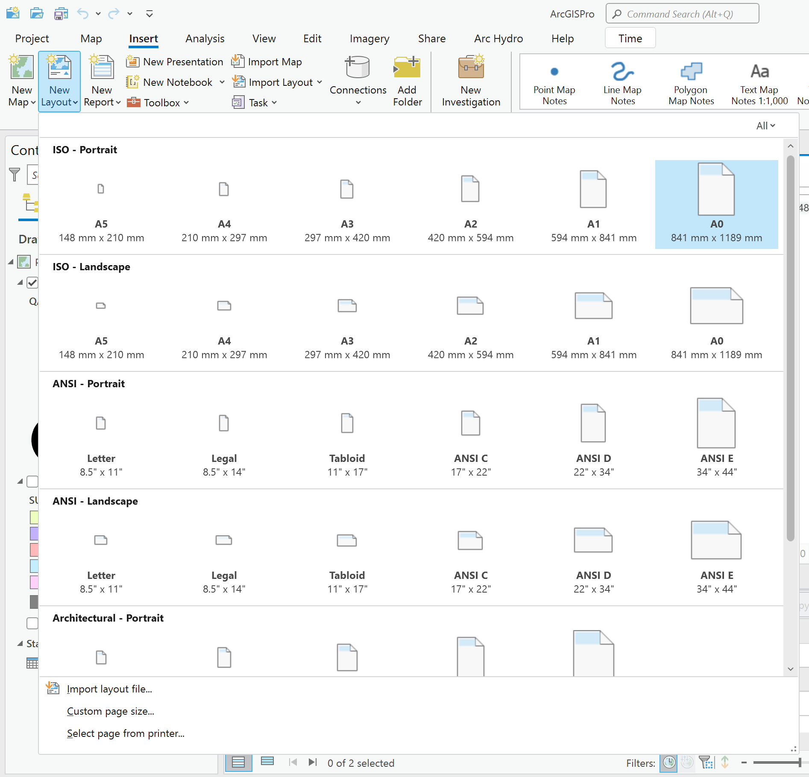

2. En la parte superior, seleccione el menú _Insert_ y de clic en _Map Frames / Map Frame_. Podrá observar que se encuentran los mapas creados en actividades anteriores y una opción adicional para incluir otro mapa. Seleccione, por ejemplo, el mapa _CountyLimit_ que contiene los límites veredales y municipales evaluados previamente, y dibuje un rectángulo con que cubra casi la totalidad de la plantilla.

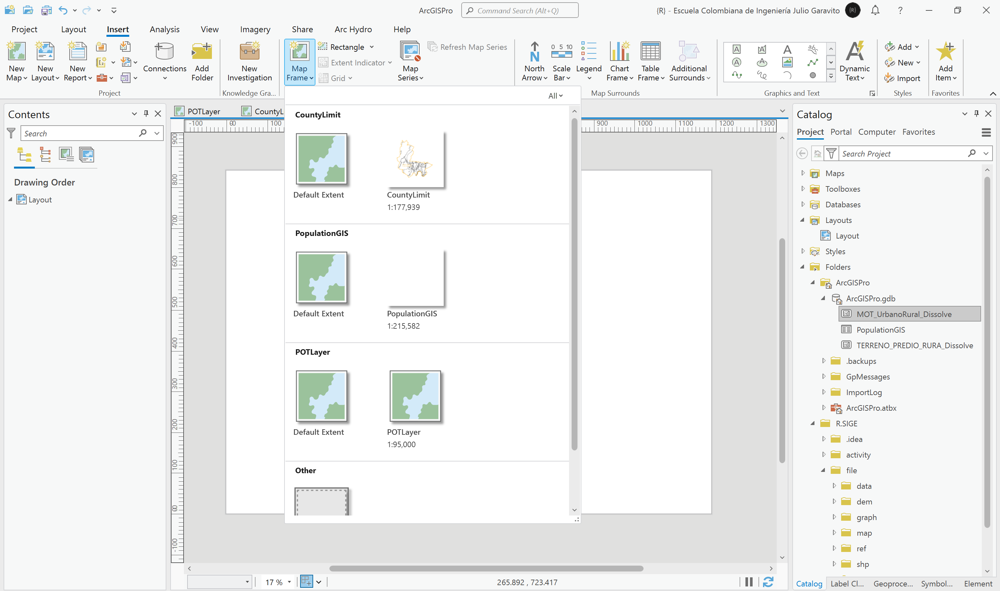

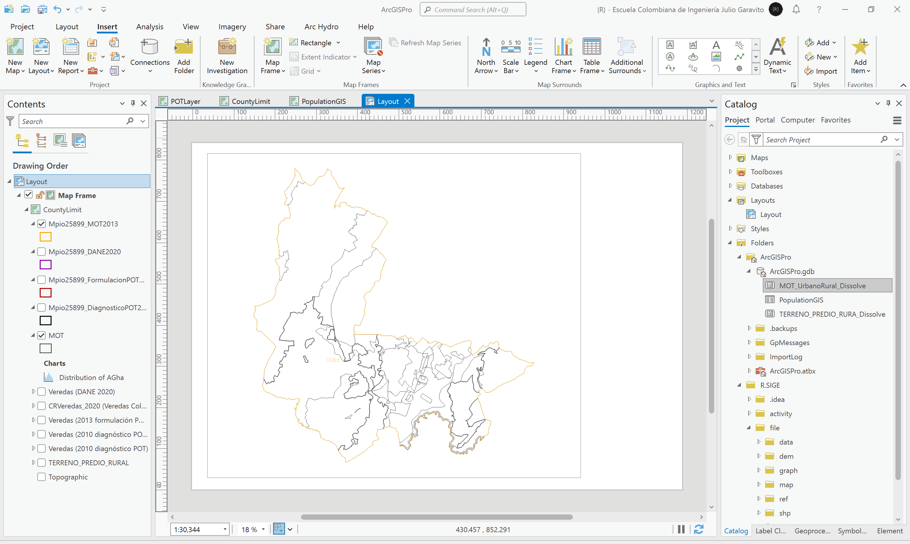

3. Acceda a las propiedades del _Map Frame_ y defina el tamaño del recuadro en 925 mm x 800 mm.

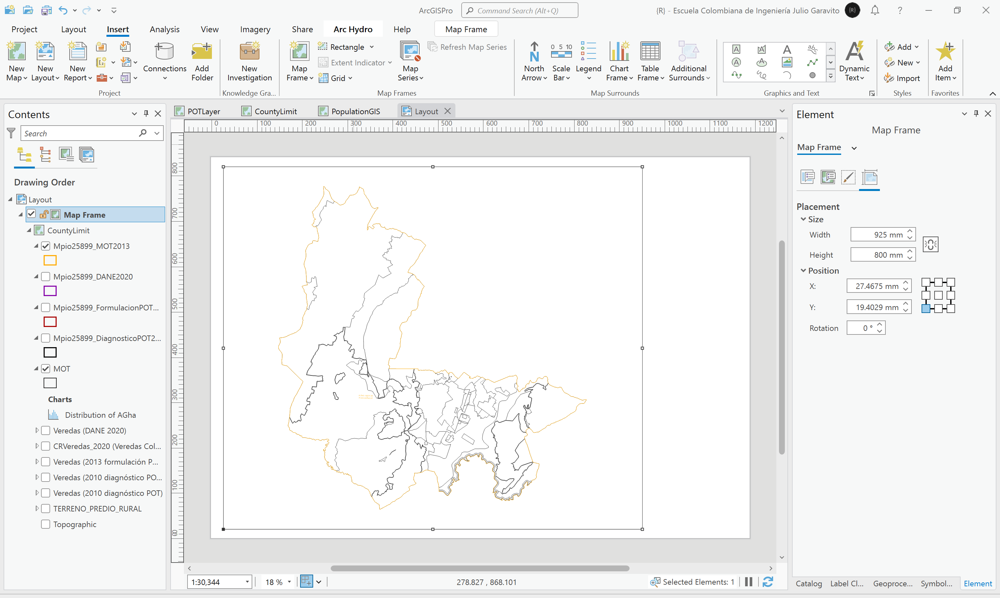

4. En la parte superior, seleccione el menú _Insert_, de clic en _Map Frames / Grid_ y seleccione el estilo _Measure Grid / Black Vertical Label Grid_. Observará que automáticamente se define un intervalo de espaciamiento. En la parte inferior de la ventana de ArcGIS Pro, defina escala 1:30000.

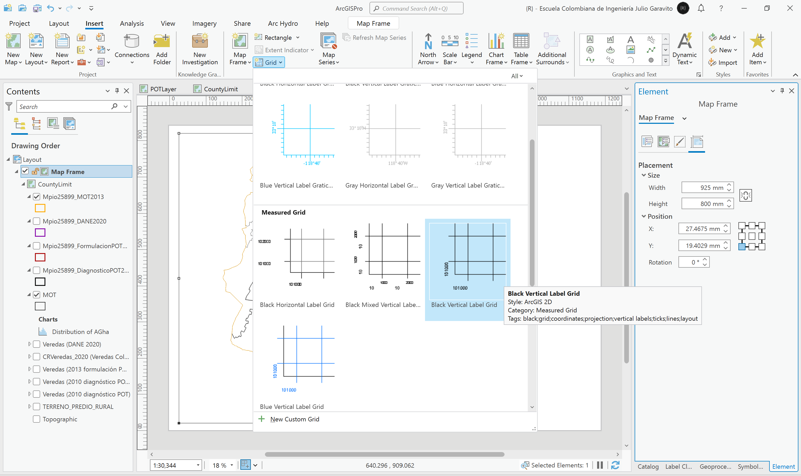

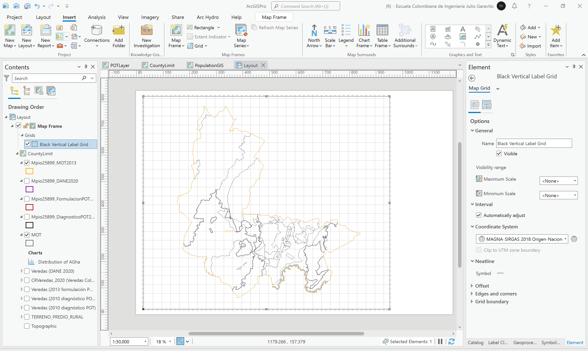

Desde las propiedades de la grilla, desactive la casilla _Automatically Adjust_ y defina un intervalo de grilla equivalente a `1/10` de la escala de visualización, que para el ejemplo corresponde a 3000 metros.

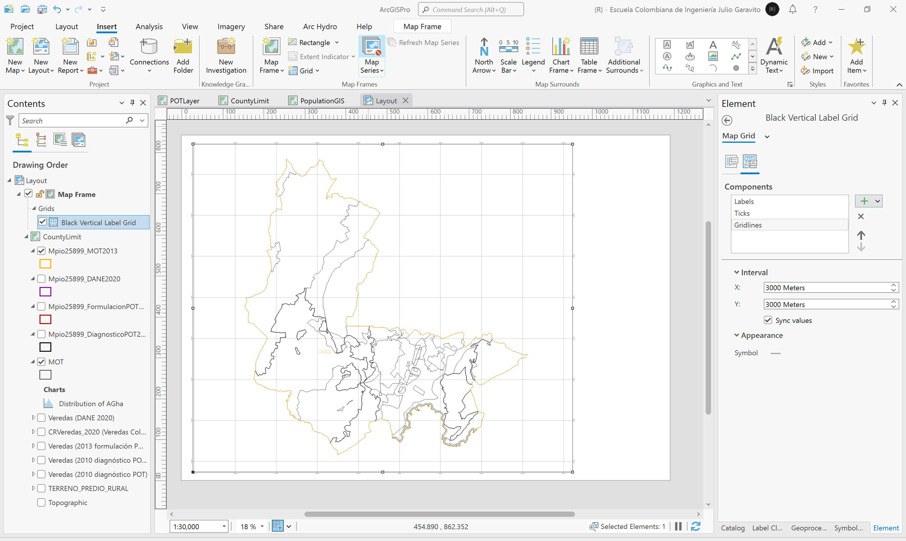

5. Inserte ahora el símbolo norte desde el menú _Insert / Map Surrounds / North Arrow_. Defina un tamaño de 50 mm x 50 mm.

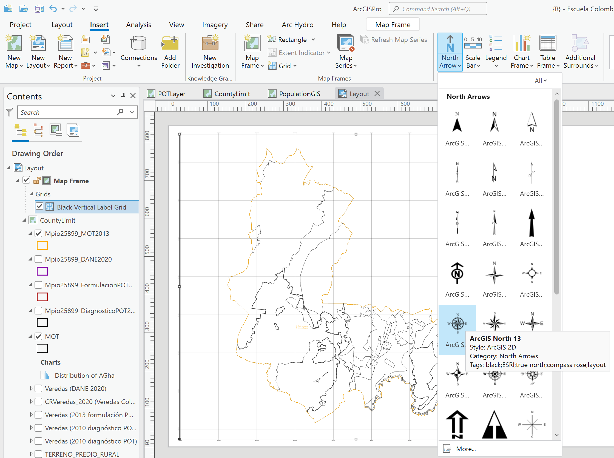

6. Inserte uno de los gráficos creados previamente, por ejemplo el de Veredas DANE 2020. Para que sea visible, la capa de veredas debe activarse en la tabla de contenido.

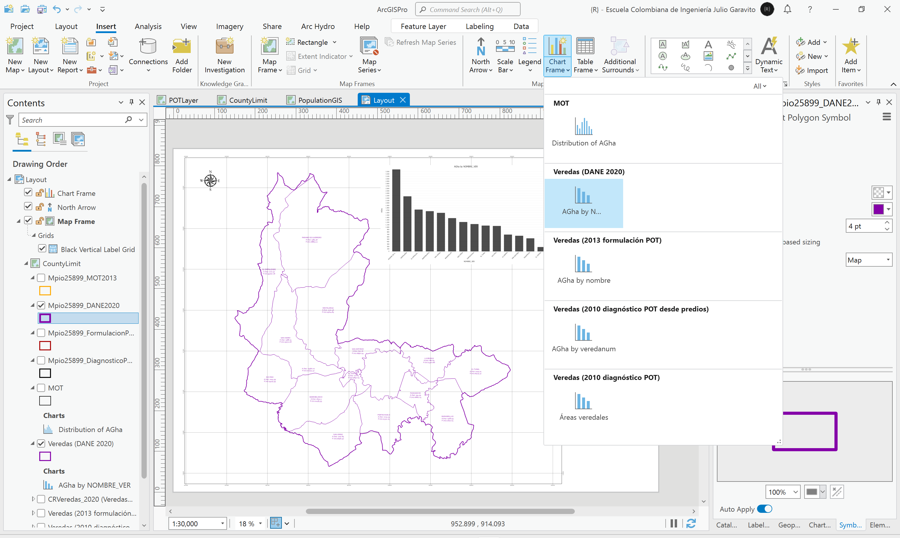

7. En la zona remanente de la plantilla localizada a la derecha y utilizando los elementos gráficos y de texto, cree rectángulos para crear el marco detallado del mapa, incluya por ejemplo secciones o grupos para:

* Logo y nombre del municipio o la entidad.
* Proyecto: indicando el Acuerdo o Decreto, el título del documento, el nombre del mapa temático y las convenciones.
* Mapa de localización general con ubicación en el país y en el departamento.
* Fuente base cartográfica y temática.
* Parámetros cartográficos o sistema de proyección.
* Escala de impresión: texto y barra de escala gráfica en metros.
* Fecha de elaboración.
* Responsable(s).
* Número de mapa.
* Espacio para firmas oficiales.

> :bulb:Para la creación de su plantilla, utilice como referencia los mapas digitales impresos del caso de estudio.  

Legenda 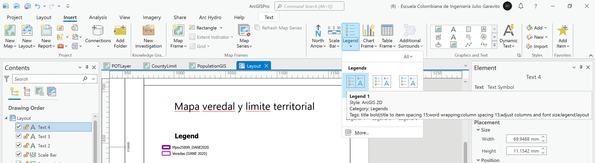
 

Logotipo 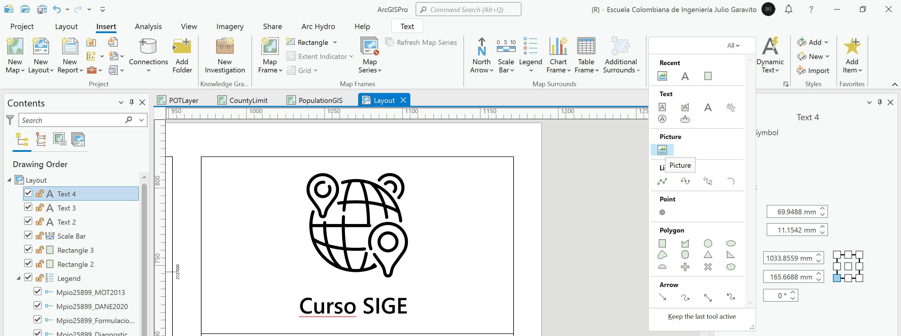
 

Barra de escala 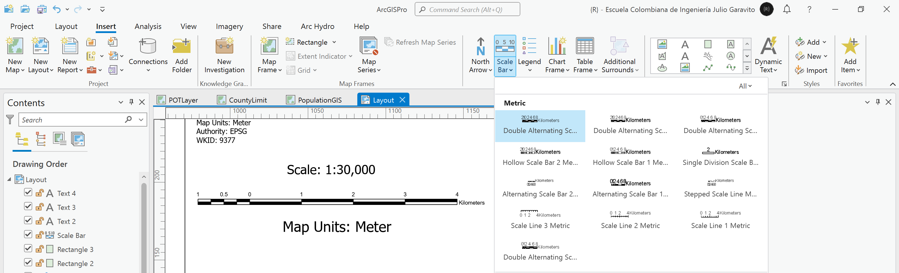
 

Textos dinámicos 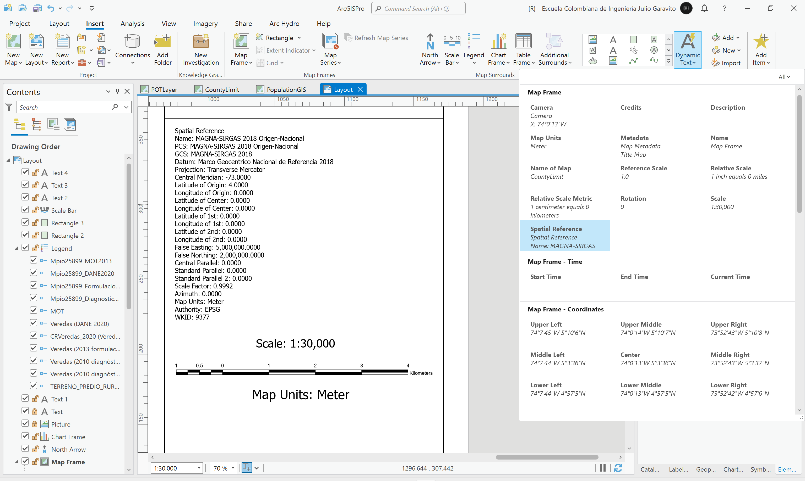
 

Plantilla preliminar 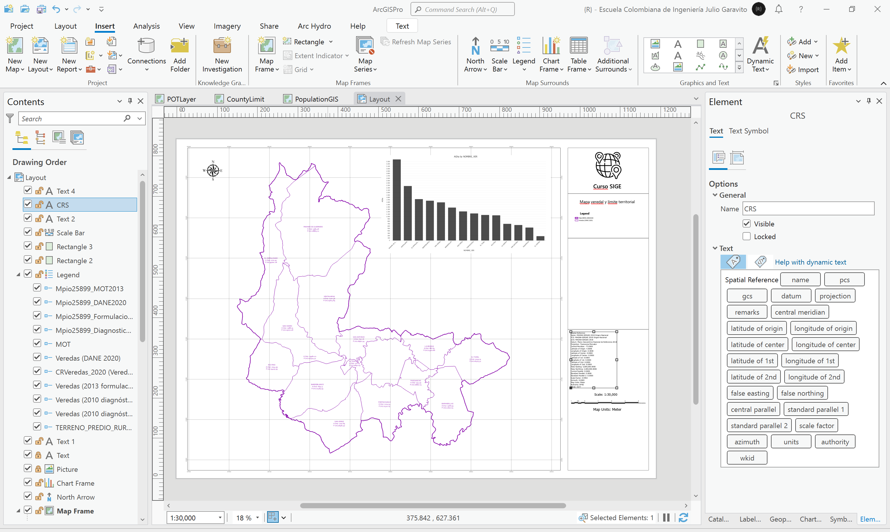
 

8. En algunos casos, es conveniente rotar la vista del mapa para ajustar el contenido al tamaño del papel y así poder utilizar una escala menor, para ello, seleccione el _Map Frame_ o marco de mapa, de clic derecho y seleccione la opción _Activate_ que le permitirá cambiar manualmente la posición dentro del mapa, la escala y la rotación. Para la rotación, en la tabla de contenido de doble clic en el nombre del mapa _CountyLimit_ y en la pestaña general establezca la rotación requerida, por ejemplo, 45 grados. Podrá observar que el mapa, la grilla y el norte, ahora se ajustan a la rotación indicada.

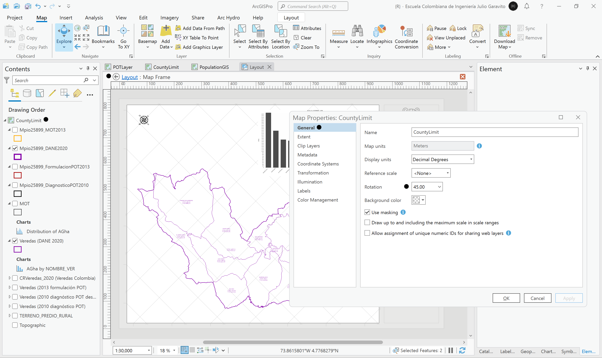

Para salir del modo de ajuste del marco de impresión del mapa, de clic en la flecha de retorno de layout localizada en la parte superior.

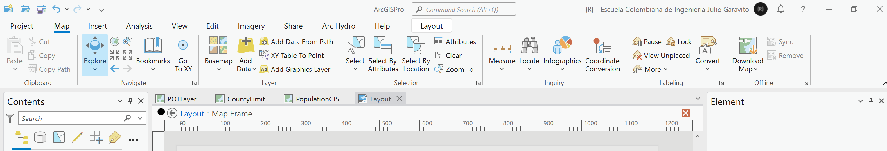

## 2. Creación de mapas de localización

### 2.1. Mapa departamental

Desde el menú _Insert_, cree un mapa nuevo y nómbrelo como _Localizacion Departamental_, ajuste el CRS a 9377 correspondiente al Orígen Único Nacional de Colombia.

Desde https://www.colombiaenmapas.gov.co/, descargue como shapefile el mapa de Departamentos de Colombia 2023 del IGAC y guarde el comprimido en la ruta `\file\data\IGAC\` como _Departamentos_Agosto_2023.zip_, descomprima y agregue la capa _Depto.shp_ al mapa.

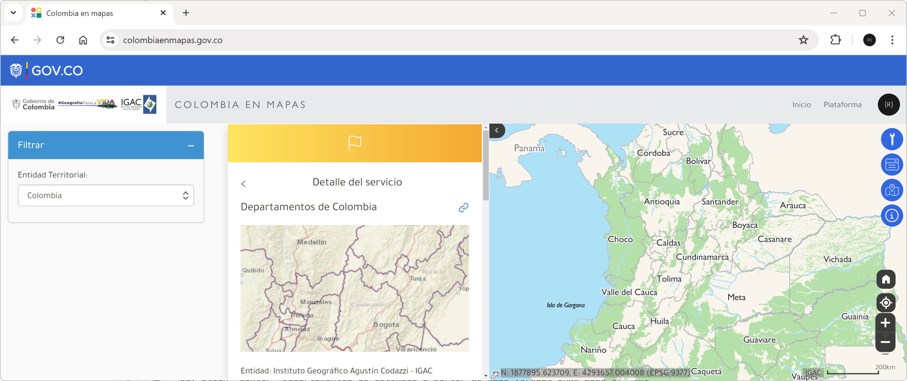

Simbolice por valores únicos a partir del nombre del departamento estableciendo color gris claro para todos los departamentos excepto Cundinamarca y gris oscuro para este departamento. 

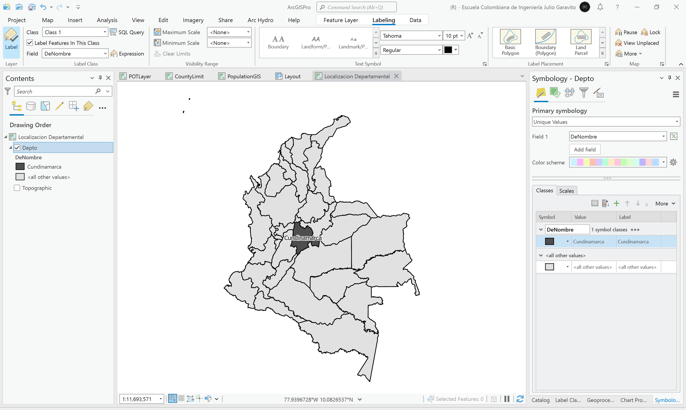

Para el mapa de localización solo es necesario rotular el departamento de Cundinamarca, para ello, en el rotulador, filtre mediante una expresión SQL, el departamento utilizando la expresión: `DeNombre = 'Cundinamarca'` .

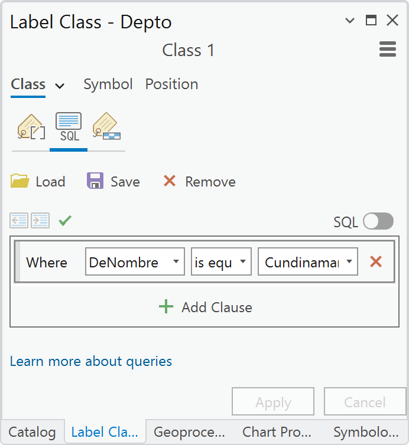

### 2.2. Mapa municipal

Desde el menú _Insert_, cree un mapa nuevo y nómbrelo como _Localizacion Municipal_, ajuste el CRS a 9377 correspondiente al Orígen Único Nacional de Colombia.

Desde https://www.colombiaenmapas.gov.co/, descargue como shapefile el mapa de Municipios, Distritos y Áreas no municipalizadas de Colombia 2023 del IGAC y guarde el comprimido en la ruta `\file\data\IGAC\` como _Municipios_Agosto_2023.zip_, descomprima y agregue la capa _Munpio.shp_ al mapa. Desde las propiedades de la capa y a través de un filtro o _Definition Query_, filtre solo los municipios de Cundinamarca.

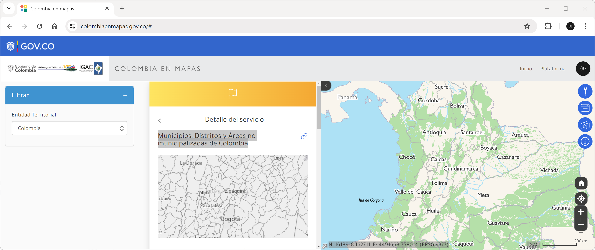

Simbolice por valores únicos a partir del nombre del municipio estableciendo color gris claro para todos los municipios excepto Zipaquirá y gris oscuro para este municipio. Rotule solo este municipio.

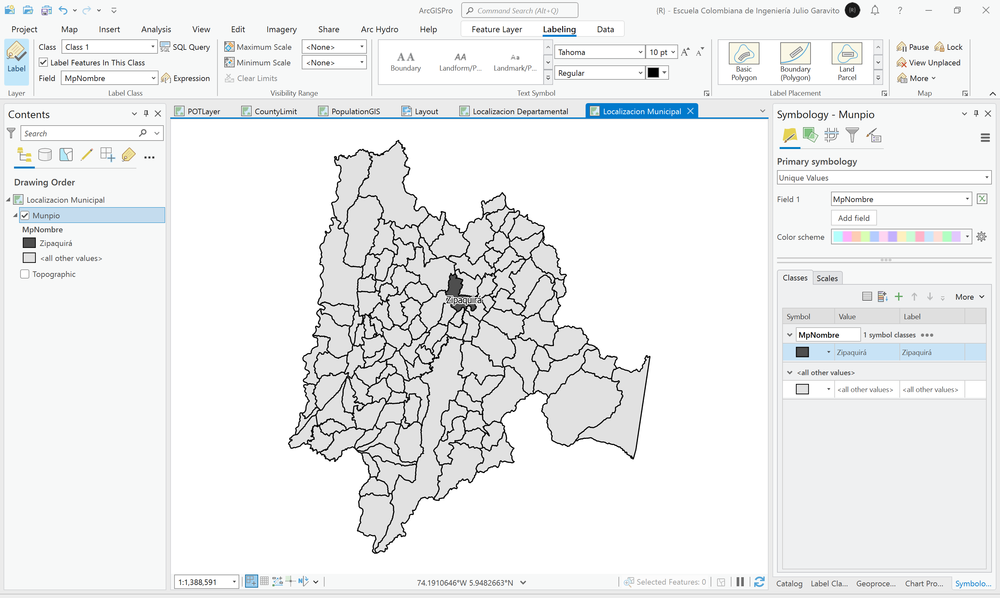

Para resaltar el contorno del departamento, agregue la capa _Depto.shp_, filtre solo Cundinamarca, establezca la simbología con borde de grosor 2 negro y sin relleno.

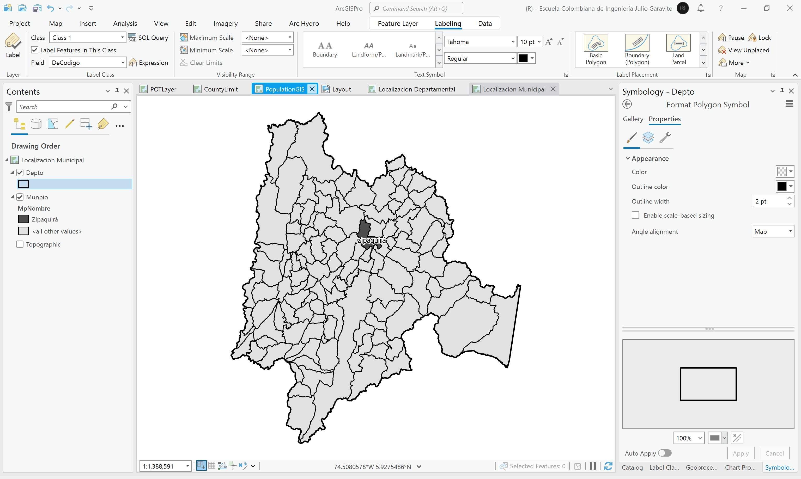

### 2.3. Inserción en la plantilla de impresión

Abra el _Layout_ de impresión creado previamente e inserte dos nuevos _Map Frame_, el primero para la localización departamental, y el segundo para la municipal.

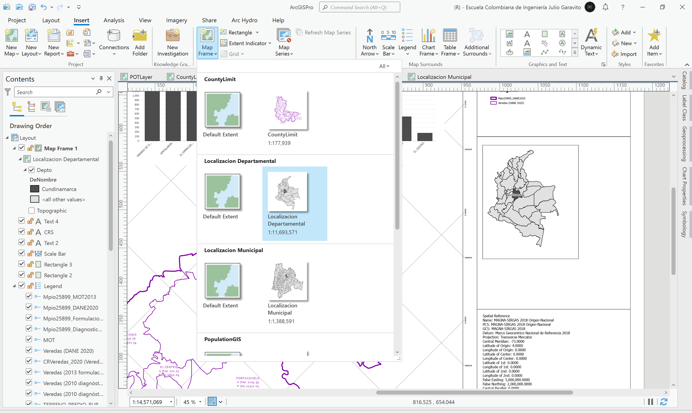

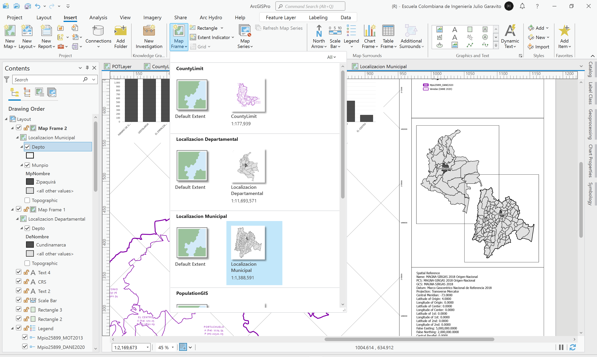

Como observa, los mapas de localización incluyen el borde del _Map Frame_, desde sus propiedades se puede retirar el color del contorno.

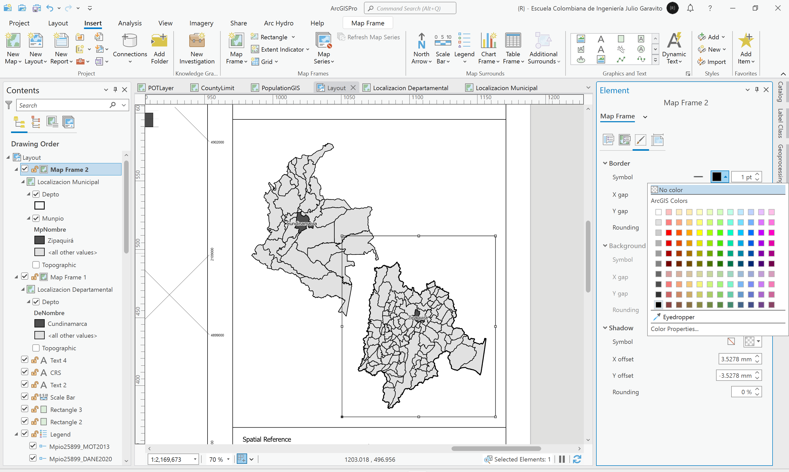

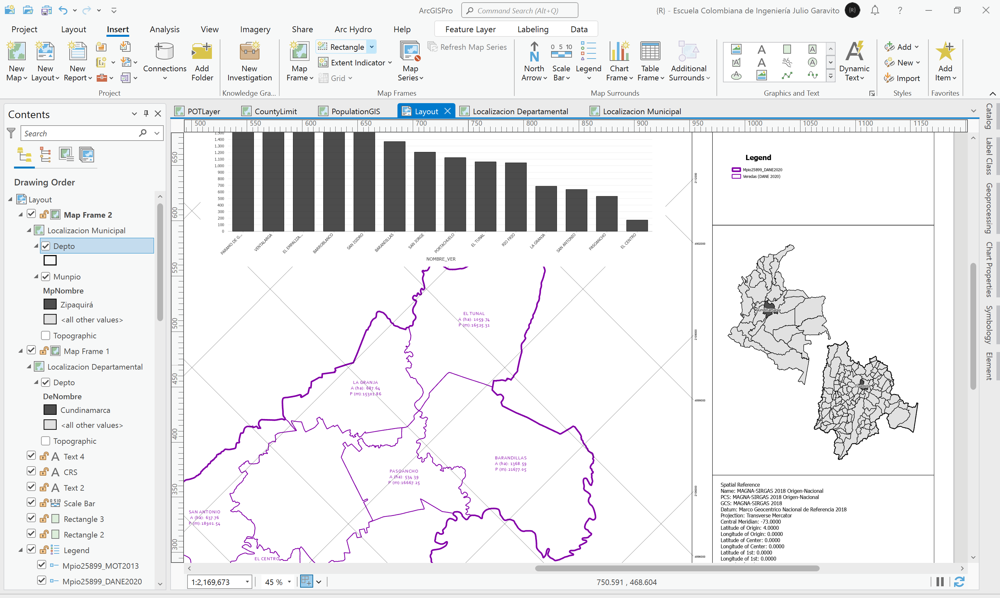

## 3. Impresión digital de mapas por vereda con representación de usos del MOT

> Para la impresión digital en formato Adobe Acrobat .pdf, es necesario instalar previamente Adobe Acrobat o una impresora virtual compatible con impresión digital pdf.

1. Agregue al mapa _CountyLimit_ el mapa del Modelo de Ocupación Territorial - MOT, disponible en la ruta `\file\data\POT\Anexo_Acuerdo_012_2013\shp\MOT.shp`. Simbolice por valores únicos a partir del campo `catego` utilizando la paleta _Muted Pastels_ y para todos los elementos defina borde color blanco en grosor 1.0 y transparencia de 30%. Active el mapa topográfico de fondo.

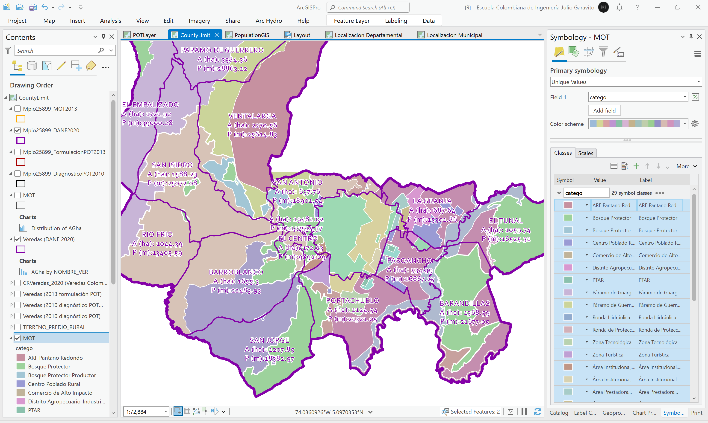

Rotule utilizando un rótulo compuesto que contenga la clasificación del suelo y las categorías del MOT.

Rótulo Arcade: `"Suelo: " + $feature.SUELO + textformatting.Newline + "Cat.: " + $feature.catego + textformatting.Newline + $feature.NOMBRE`

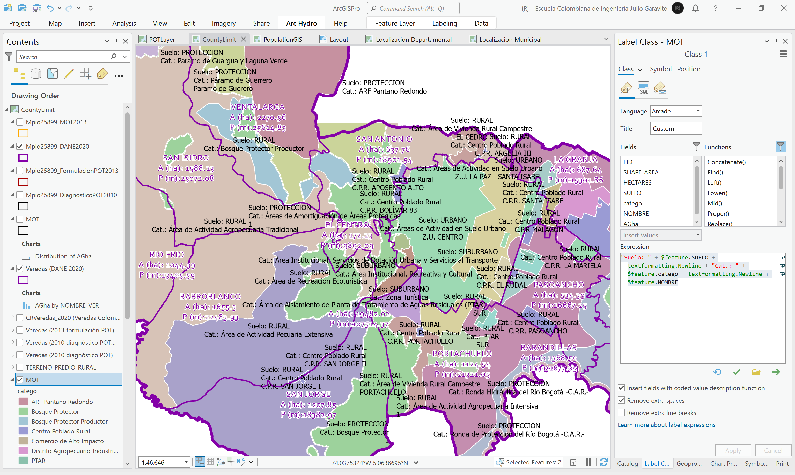

2. Abra la plantilla o _Layout_ de impresión creado previamente, podrá observar que ya se encuentra la representación incluyendo el MOT. Ajuste la escala a 1:25700. El el menu superior _Share_, de clic en _Print Layout_, ajuste los parámetros de acuerdo a los valores mostrados en la ilustración y guarde como _MapaGeneralVeredaMOT.pdf_.

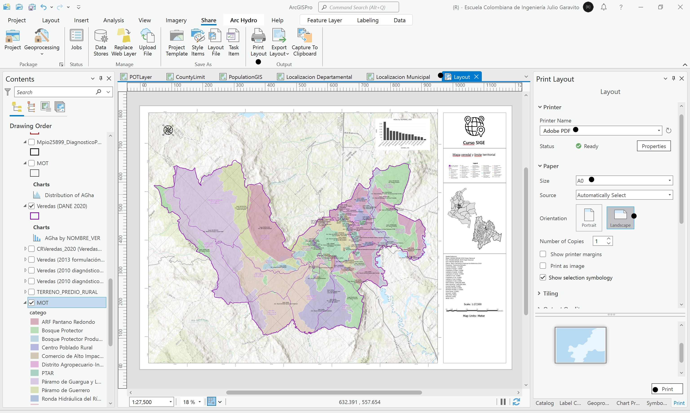

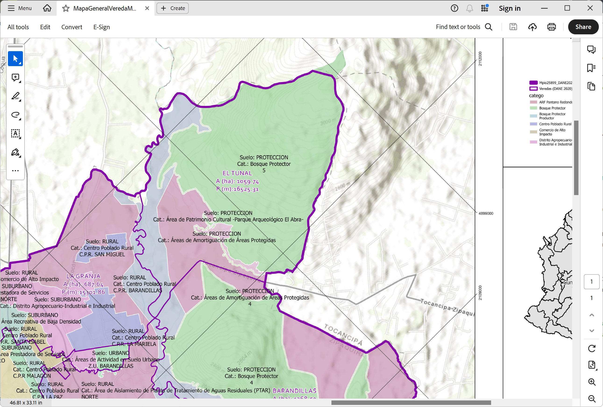

> :bulb: Como observa en el mapa impreso general, los rótulos cubren en gran parte la representación del mapa, se recomienda incluir en la capa _MOT.shp_ una columna de atributos con la sigla representativa relacionada a cada actividad e imprimir el mapa solo con estos valores. 

3. Para la impresión de un mapa único por vereda, utilizaremos la herramienta _Map Series / Spatial_ disponible en el menu _Insert_ de la plantilla de impresión.

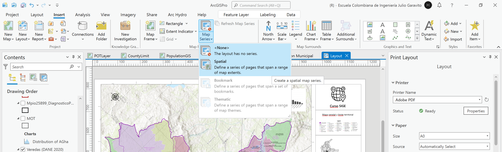

Realice la siguiente configuración basada en la capa de Veredas de DANE 2020.

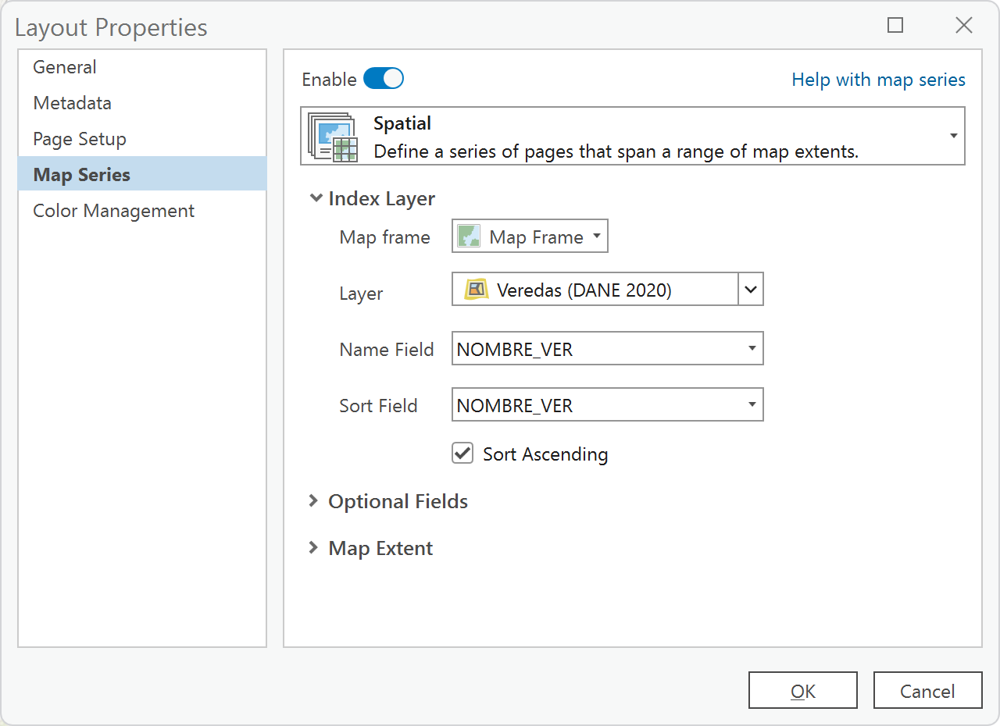

Luego de aceptar la configuración, podrá observar que automáticamente se cream los mapas de series con una impresión para cada vereda. Observe que el gráfico de barras se ha ajustado automáticamente para mostrar solo las veredas que aparecen en cada impreso.

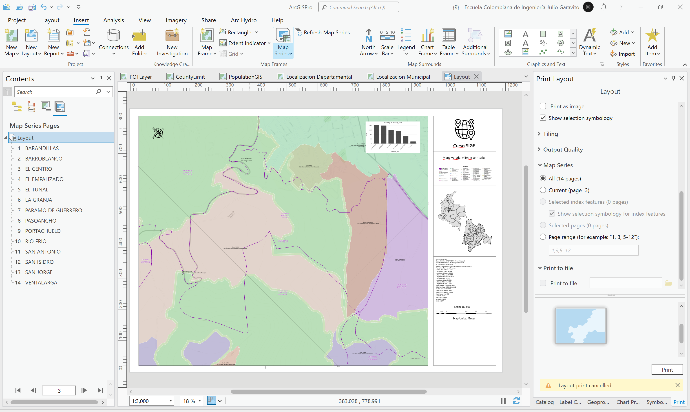

Para imprimir en digital, solo basta con dar clic en el botón _Print_ localizado en el panel derecho de impresión. Imprima y guarde como _MapaSerieVeredaMOT.pdf_.

Ejemplo de mapas impresos digitalmente 
* [:closed_book:Adobe Acrobat](pdfsample/MapaGeneralVeredaMOT.pdf): Veredal general
* :closed_book:Adobe Acrobat: Vereda en series

## 4. Análisis usando software libre - QGIS

Para el desarrollo de las actividades desarrolladas en esta clase, se pueden utilizar en QGIS las siguientes herramientas o geo-procesos:

| Proceso                                                                                                         | Procedimiento                                                                                                                                                                                                                                   |
|:----------------------------------------------------------------------------------------------------------------|:------------------------------------------------------------------------------------------------------------------------------------------------------------------------------------------------------------------------------------------------|
| Simbología                                                                                                      | Modificable desde las propiedades de la capa en la pestaña _Symbology_.                                                                                                                                                                         |
| Rotulado                                                                                                        | Modificable desde las propiedades de la capa en la pestaña _Labels_.                                                                                                                                                                            |

Ejemplo rótulo en QGIS: `'A(ha): ' ||  round("AGha", 2) || '\n' || 'P (m): ' ||  round("PGm", 2) `

## Elementos requeridos en diccionario de datos

Agregue a la tabla resúmen generada en la actividad [Inventario de información geo-espacial recopilada del POT y diccionario de datos](../POTLayer/Readme.md), las capas generadas en esta actividad que se encuentran listadas a continuación:

| Nombre                           | Descripción                                                                                                                  | Geometría   | Registros | 
|----------------------------------|------------------------------------------------------------------------------------------------------------------------------|-------------|-----------| 
|                                  |                                                                                                                              | Polígono 2D | 14        | 
|                                  |                                                                                                                              | Polígono 2D | 14        | 
|                                  |                                                                                                                              | Polígono 2D | 14        | 

> :bulb:Para funcionarios que se encuentran ensamblando el SIG de su municipio, se recomienda incluir y documentar estas capas en el Diccionario de Datos.

## Actividades de proyecto :triangular_ruler:

En la siguiente tabla se listan las actividades que deben ser desarrolladas y documentadas por cada grupo de proyecto en un único archivo de Adobe Acrobat .pdf. El documento debe incluir portada (indicando el caso de estudio, número de avance, nombre del módulo, fecha de presentación, nombres completos de los integrantes), numeración de páginas, tabla de contenido, lista de tablas, lista de ilustraciones, introducción, objetivo general, capítulos por cada ítem solicitado, conclusiones y referencias bibliográficas.

| Actividad     | Alcance                                                                                                                                                                                                                                                                                                                                                                                                                                             |
|:--------------|:----------------------------------------------------------------------------------------------------------------------------------------------------------------------------------------------------------------------------------------------------------------------------------------------------------------------------------------------------------------------------------------------------------------------------------------------------|
| Avance **P1** | Esta actividad no requiere del desarrollo de elementos en el avance del proyecto final, los contenidos son evaluados en el quiz de conocimiento y habilidad.                                                                                                                                                                                                                                                                                        | 
| Avance **P1** | En una tabla y al final del informe de avance de esta entrega, indique el detalle de las sub-actividades realizadas por cada integrante de su grupo. Para actividades que no requieren del desarrollo de elementos de avance, indicar si realizo la lectura de la guía de clase y las lecturas indicadas al inicio en los requerimientos. Utilice las siguientes columnas: Nombre del integrante, Actividades realizadas, Tiempo dedicado en horas. | 

> No es necesario presentar un documento de avance independiente, todos los avances de proyecto de este módulo se integran en un único documento.
> 
> En el informe único, incluya un numeral para esta actividad y sub-numerales para el desarrollo de las diferentes sub-actividades, siguiendo en el mismo orden de desarrollo presentado en esta actividad.

## Compatibilidad

* Esta actividad puede ser desarrollada con cualquier software SIG que disponga de herramientas para de digitalización con opciones de encajado o snapping.
* 

## Referencias

* [Easily Create a Spatial Map Series in ArcGIS Pro](https://www.youtube.com/watch?v=HcESlqEBebU)

## Control de versiones

| Versión    | Descripción                                                | Autor                                      | Horas |
|------------|:-----------------------------------------------------------|--------------------------------------------|:-----:|
| 2024.02.24 | Versión inicial con alcance de la actividad                | [rcfdtools](https://github.com/rcfdtools)  |   4   |
| 2024.06.27 | Investigación y documentación para caso de estudio general | [rcfdtools](https://github.com/rcfdtools)  |   8   |

_R.SIGE es de uso libre para fines académicos, conoce nuestra licencia, cláusulas, condiciones de uso y como referenciar los contenidos publicados en este repositorio, dando [clic aquí](LICENSE.md)._

_¡Encontraste útil este repositorio!, apoya su difusión marcando este repositorio con una ⭐ o síguenos dando clic en el botón Follow de [rcfdtools](https://github.com/rcfdtools) en GitHub._

| [:arrow_backward: Anterior](../PopulationGIS/Readme.md) | [:house: Inicio](../../README.md) | [:beginner: Ayuda / Colabora](https://github.com/rcfdtools/R.SIGE/discussions/99999) | [Siguiente :arrow_forward:]() |
|---------------------------------------------------------|-----------------------------------|--------------------------------------------------------------------------------------|-------------------------------|

[^1]: 