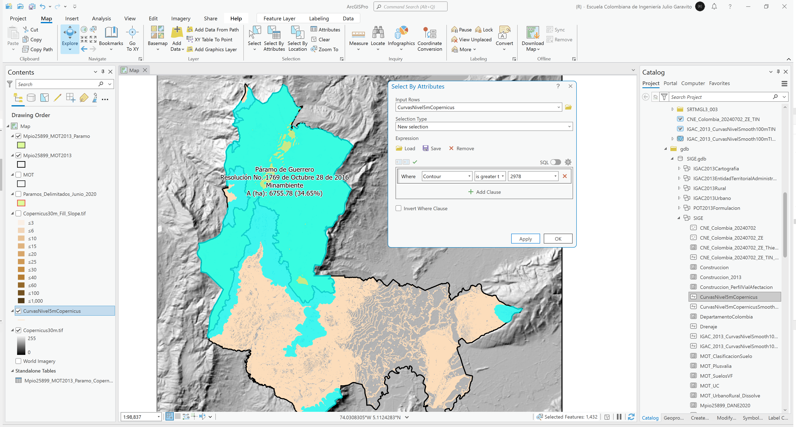

# Estudio de zonas de páramo
Keywords: `moorland` 

Según el artículo 4 de la Ley 1930 de 2018 o Ley de páramos, el Ministerio de Ambiente y Desarrollo Sostenible debe realizar la delimitación de los páramos con base en el área de referencia generada por el Instituto de Investigación de Recursos Biológicos Alexander von Humboldt a escala 1:25.000. En este ejercicio, realizaremos la delimitación a partir de una cota específica utilizando el modelo digital de elevación ESA Copernicus y evaluaremos su correspondencia con el mapa de Complejos de páramos de Colombia del IvAH.

## Objetivos

* Evaluar los límites del complejo de páramos de Colombia dentro del área geográfica de estudio.
* Identificar rangos de elevaciones y pendientes dentro de la zona de páramo municipal.
* Identificar incompatibilidades con respecto al modelo de ocupación territorial - MOT. 

## Requerimientos

* [:mortar_board:Actividad](../TopoBasic/Readme.md): Conceptos básicos de topografía, fotogrametría y fotointerpretación.
* [:mortar_board:Actividad](../POTLayer/Readme.md): Inventario de información geo-espacial recopilada del POT y diccionario de datos.
* [:toolbox:Herramienta](https://www.esri.com/en-us/arcgis/products/arcgis-pro/overview): ESRI ArcGIS Pro 3.3.1 o superior.
* [:toolbox:Herramienta](https://qgis.org/): QGIS 3.38 o superior.

## 0. Complejos de páramos de Colombia

El Instituto Humboldt es una entidad colombiana, vinculada al Ministerio de Ambiente y Desarrollo Sostenible, regida por el derecho privado, que investiga acerca de la biodiversidad y de las relaciones entre esta y el bienestar humano.[^1]

Constituido en diciembre de 1993, mediante la Ley 99, comenzó operaciones en enero de 1995 en Villa de Leyva, Boyacá. En la actualidad el Claustro de San Agustín es una de las tres sedes del Instituto, donde se almacenan las Colecciones Biológicas que soportan el inventario nacional de la biodiversidad, parte de las cuales fueron heredadas del antiguo Inderena. Las otras sedes del Instituto están en Bogotá, D. C. (Venado de Oro, Calle 72 y Calle 28) y el Laboratorio de Biología Molecular y Banco de Tejidos, en Palmira, Valle, en las instalaciones del Centro Internacional de Agricultura Tropical (Ciat). Adicionalmente, el Instituto tiene investigadores en campo en los sitios donde se llevan a cabo los proyectos de investigación y de profesionales en distintas locaciones del país, vinculados a través de teletrabajo.


Para garantizar la operación institucional, el Instituto recibe recursos públicos de fuentes diversas como el Presupuesto General de la Nación, el Sistema General de Regalías y el Fondo Nacional Ambiental (Fonam), entre otros. Así mismo, gestiona proyectos de investigación y gestión de cooperación internacional, municipios y empresas privadas.

**Complejos de páramos de Colombia**: esta información corresponde a la actualización de los límites cartográficos de los Complejos de Páramos de Colombia, a escala 1:100.000, con criterios y variables unificados para el país. Las principales variables consideradas para la actualización del límite fueron: Temperatura promedio anual, geo-sistemas de alta montaña, modelos potenciales de presencia de fauna y flora, integridad ecológica e imágenes de satélite de alta resolución.

Desde el portal de datos abiertos del SIAC, descargue la capa de [Páramos delimitados Junio 2020 - SIAC](https://siac-datosabiertos-mads.hub.arcgis.com/datasets/9631ed8c44274baa824e6277276de48f/about), guarde y descomprima en la carpeta `\file\data\IvAH`.

## 1. Análisis de cubrimiento de páramos en zona de estudio

1. Abra el proyecto de ArcGIS Pro, creado previamente y desde el menú _Insert_ cree un nuevo mapa _New Map_, renombre como _MoorLand_ y establezca el CRS 9377. Agregue al mapa la capa de delimitación de páramos disponible en `\file\data\IvAH\Paramos_Delimitados_Junio_2020.shp` y ajuste la simbología a contorno de color rojo, agregue además las capas `Mpio25899_MOT2013`, `MOT`, el modelo digital de elevación _Copernicus30m.tif_ y el modelo de pendientes _Copernicus30m_Fill_Slope.tif_.  

2. Utilizando la herramienta de geo-procesamiento _Analysis Tools / Intersect_, obtenga la intersección espacial de la capa de páramos y la capa del límite municipal del MOT. Nombre el archivo resultante como `\file\gdb\SIGE.gdb\SIGE\Mpio25899_MOT2013_Paramo`. Podrá observar que en la divisoria nor-occidental, toda el área rural no está cubierta por la capa de páramos.

Rótulo Arcade: `"Páramo de " + $feature.Nombre + "\n" + $feature.Acto_Admin + "\n" +  $feature.Fuente`

3. Abra la tabla de atributos de la capa de intersección y cree dos campos numéricos dobles con los nombres `APParha` y `APParPorc` y calcule el área geométrica planar del polígono utilizando el CRS 9377 y el porcentaje con respecto al área total municipal. Rotule indicando el área total de la zona de páramo y su porcentaje con respecto al total del área municipal, podrá observar que la zona de páramo tiene una cobertura del 34.65% del área municipal.

Rótulo Arcade: `"Páramo de " + $feature.Nombre + "\n" + $feature.Acto_Admin + "\n" +  $feature.Fuente + "\nA (ha): " + Round($feature.APParha, 2) + " (" + Round($feature.APParPorc, 2) + "%)"`

## 2. Análisis de elevación y pendiente en zona de páramo

1. Utilizando la herramienta de geo-procesamiento _Image Analyst Tools / Zonal Statistics as Table_, obtenga los estadísticos de elevación del polígono del páramo en la zona de estudio. Nombre la tabla resultante como `\file\gdb\SIGE.gdb\Mpio25899_MOT2013_Paramo_Copernicus_Stat`. Podrá observar que los rangos de elevaciones de la zona de páramo se encuentran entre los 2977.28 y 3721.21 m.s.n.m.

2. Agregue la capa de curvas de nivel desde la ruta `\file\gdb\SIGE.gdbSIGE\CurvasNivel5mCopernicus` y seleccione por atributos, todas aquellas curvas cuya elevación sea mayor o igual a 2978 m, podrá observar que el límite geográfico de la selección incluye áreas fuera del límite del parque, con lo que se evidencia que la delimitación de las zonas de páramo no obedece a criterios de cota, sino a presencia de fauna y flora, integridad ecológica y temperatura.

3. Para el análisis de pendientes dentro de la zona de páramo, realice también una estadística zonal, nombre la tabla resultante como `\file\gdb\SIGE.gdb\Mpio25899_MOT2013_Paramo_CopernicusSlope_Stat`. Podrá observar en los resultados que el rango de pendientes va de 0 a 164.48% con media en 28.23%.

## 3. Identificación de incompatibilidades con el MOT

Utilizando la herramienta de geo-procesamiento _Analysis Tools / Intersect_, obtenga la intersección espacial de la capa de páramos y la capa del MOT. Nombre el archivo resultante como `\file\gdb\SIGE.gdb\SIGE\MOT_Paramo`. Podrá observar que en el suelo rural existen varias fracciones de suelo incompatibles correspondientes a _Áreas de Actividad Agropecuaria Tradicional_ correspondientes a 52.05 hectáreas.

## 4. Análisis usando software libre - QGIS

Para el desarrollo de las actividades desarrolladas en esta clase, se pueden utilizar en QGIS las siguientes herramientas o geo-procesos:

| Proceso                                                  | Procedimiento                                                                                                                                                                                                       |
|:---------------------------------------------------------|:--------------------------------------------------------------------------------------------------------------------------------------------------------------------------------------------------------------------|
| Simbología                                               | Modificable desde las propiedades de la capa en la pestaña _Symbology_.                                                                                                                                             |
| Rotulado                                                 | Modificable desde las propiedades de la capa en la pestaña _Labels_.                                                                                                                                                |
| Cálculos geométricos o de campo                          | Directamente desde la tabla de atributos mediante el botón _Open Field Calculator_ o <kbd>Ctr</kbd>+<kbd>I</kbd>. La geometría de cálculo `$area` permite obtener el valor elipsoidal y `area` el valor proyectado. |
| Intersección espacial (Intersection)                     | Se realizan desde el menú _Vector_ a través de la opción _Geoprocessing Tools / Intersection_.                                                                                                                      |
| Estadística zonal como tabla (Zonal statistics as table) | Herramienta disponible en el _Processing Toolbox / Raster analysis / Zonal statistics.                                                                                                                              |

Ejemplo rótulo en QGIS: `'A(ha): ' ||  round("AGha", 2) || '\n' || 'P (m): ' ||  round("PGm", 2) `

[:notebook:QGIS training manual](https://docs.qgis.org/3.34/en/docs/training_manual/)  
[:notebook:Herramientas comúnmente utilizadas en QGIS](../QGIS.md)

## Elementos requeridos en diccionario de datos

Agregue a la tabla resúmen generada en la actividad [Inventario de información geo-espacial recopilada del POT y diccionario de datos](../POTLayer/Readme.md), las capas generadas en esta actividad que se encuentran listadas a continuación:

| Nombre                                        | Descripción                                                                                                        | Geometría   | Registros | 
|-----------------------------------------------|--------------------------------------------------------------------------------------------------------------------|-------------|-----------| 
| Paramos_Delimitados_Junio_2020.shp            | Páramos de Colombia a 2020 por Minambiemte.                                                                        | Polígono 2D | 163       | 
| Mpio25899_MOT2013_Paramo                      | Intersección espacial límite municipal a partir del MOT y páramos de Colombia.                                     | Polígono 2D | 1         | 
| Mpio25899_MOT2013_Paramo_Copernicus_Stat      | Tabla de estadística zonal de elevaciones Copernicus dentro del límite de páramo en la zona de estudio.            | (Table)     | 1         | 
| Mpio25899_MOT2013_Paramo_CopernicusSlope_Stat | Tabla de estadística zonal de pendientes a partir de Copernicus dentro del límite de páramo en la zona de estudio. | (Table)   | 1         | 
| MOT_Paramo                                    | Intersección espacial de polígonos de categorias del MOT y el límite de páramo en la zona de estudio.              | Polígono 2D | 12        | 

> :bulb:Para funcionarios que se encuentran ensamblando el SIG de su municipio, se recomienda incluir y documentar estas capas en el Diccionario de Datos.

## Actividades de proyecto :triangular_ruler:

En la siguiente tabla se listan las actividades que deben ser desarrolladas y documentadas por cada grupo de proyecto en un único archivo de Adobe Acrobat .pdf. El documento debe incluir portada (indicando el caso de estudio, número de avance, nombre del módulo, fecha de presentación, nombres completos de los integrantes), numeración de páginas, tabla de contenido, lista de tablas, lista de ilustraciones, introducción, objetivo general, capítulos por cada ítem solicitado, conclusiones y referencias bibliográficas.

| Actividad     | Alcance                                                                                                                                                                                                                                                                                                                                                                                                                                             |
|:--------------|:----------------------------------------------------------------------------------------------------------------------------------------------------------------------------------------------------------------------------------------------------------------------------------------------------------------------------------------------------------------------------------------------------------------------------------------------------|
| Avance **P5** | Realice el análisis de páramos presentado en esta actividad. En caso de que en su zona de estudio no existan páramos, identifique por proximidad los páramos más cercanos.                                                                                                                                                                                                                                                                          | 
| Avance **P5** | :compass:Mapa digital impreso _P5-11: Mapa de páramos dentro de la zona de estudio con análisis de incompatibilidades MOT._ Incluir tablas de resumen estadístico y rótulos descriptivos. Embebido dentro del informe final como una imágen y referenciados como anexo.                                                                                                                                                                          | 
| Avance **P5** | En una tabla y al final del informe de avance de esta entrega, indique el detalle de las sub-actividades realizadas por cada integrante de su grupo. Para actividades que no requieren del desarrollo de elementos de avance, indicar si realizo la lectura de la guía de clase y las lecturas indicadas al inicio en los requerimientos. Utilice las siguientes columnas: Nombre del integrante, Actividades realizadas, Tiempo dedicado en horas. | 

> No es necesario presentar un documento de avance independiente, todos los avances de proyecto de este módulo se integran en un único documento.
> 
> En el informe único, incluya un numeral para esta actividad y sub-numerales para el desarrollo de las diferentes sub-actividades, siguiendo en el mismo orden de desarrollo presentado en esta actividad.

## Referencias

* [Páramos delimitados Junio 2020 - SIAC](https://siac-datosabiertos-mads.hub.arcgis.com/datasets/9631ed8c44274baa824e6277276de48f/about)
* https://pro.arcgis.com/en/pro-app/latest/tool-reference/analysis/intersect.htm

## Control de versiones

| Versión    | Descripción                                                                                             | Autor                                      | Horas |
|------------|:--------------------------------------------------------------------------------------------------------|--------------------------------------------|:-----:|
| 2024.09.04 | Versión inicial con alcance de la actividad, investigación y documentación para caso de estudio general | [rcfdtools](https://github.com/rcfdtools)  |   4   |

_R.SIGE es de uso libre para fines académicos, conoce nuestra licencia, cláusulas, condiciones de uso y como referenciar los contenidos publicados en este repositorio, dando [clic aquí](LICENSE.md)._

_¡Encontraste útil este repositorio!, apoya su difusión marcando este repositorio con una ⭐ o síguenos dando clic en el botón Follow de [rcfdtools](https://github.com/rcfdtools) en GitHub._

| [:arrow_backward: Anterior](../DEMSlope/Readme.md) | [:house: Inicio](../../README.md) | [:beginner: Ayuda / Colabora](https://github.com/rcfdtools/R.SIGE/discussions/31) | [Siguiente :arrow_forward:]() |
|----------------------------------------------------|-----------------------------------|-----------------------------------------------------------------------------------|-------------------------------|

[^1]: https://www.humboldt.org.co/sobre-el-instituto