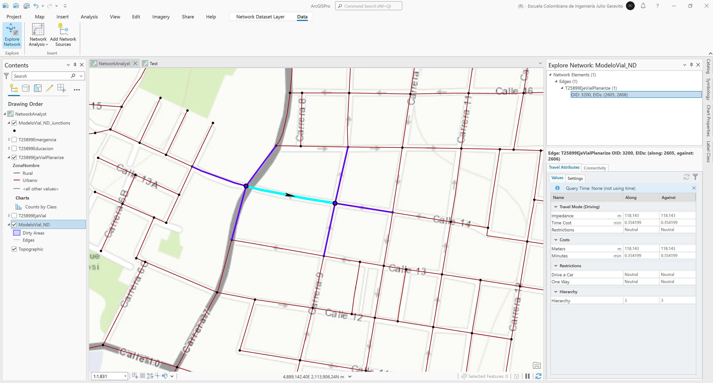

# Network Analyst - Creación y configuración del network dataset
Keywords: `facilities` `emergencies`

En el dataset contenido en la GDB, crear el dataset para modelación de redes viales a partir de los ejes viales homologados. Acceda a las propiedades de la red y realize las configuraciones de conectividad, costos, sentidos viales, giros en U y vías con restricción vehicular.    

<div align="center"></div>


## Objetivos

* Crear y configurar el network dataset
* Definir atributos de costos, giros permitidos y prohibidos, restricción vehicular y modos de transporte.


## Requerimientos

* [:mortar_board:Actividad](../POTLayer/Readme.md): Inventario de información geo-espacial recopilada del POT y diccionario de datos.
* [:toolbox:Herramienta](https://www.esri.com/en-us/arcgis/products/arcgis-pro/overview): ESRI ArcGIS Pro 3.3.1 o superior.


## 1. Creación y configuración de la red de analisis

1. Abra el proyecto de ArcGIS Pro y el mapa _NetworkAnalyst_ creado previamente. En el Dataset `ModeloVial` contenido en la GDB, de clic derecho y seleccione la opción _Create Network Dataset_, nombre como `ModeloVial_ND` y seleccione el feature class `T25899EjeVialPlanarize`. En caso de que su red corresponda a líneas 3D o haya incluido atributos para pasos elevados o deprimidos, seleccione la opción `Elevation Fields`. Remueva el Network Dataset del mapa para que se puedan modificar sus propiedades.

<div align="center"></div>

2. Desde el Catalog Pane, acceda a las propiedades del ND y en la pestaña _Source Settings_ establezca los parámetros de conectividad vertical (sí creo previamente los atributos verticales). 

> Para el ejercicio de clase utilizaremos una red sin propiedades 3D, sin embargo, las longitudes 3D pueden ser calculadas y asignadas en el campo `Meters` de la capa vial.

<div align="center"></div>

3. En _Travel Attributes / Costs_, defina los nombres `Length` con la propiedad `!Shape!` y `Time` con los campos de atributos `!FT_Minutes!` y `!TF_Minutes!` a lo largo y en el sentido contrario de los vectores (Along, Against), renombre como Meters y Minutes. En el costeo de tiempo, cambie Turns al tipo Turn Category

> Para la creación de los costos de distancia, en la parte superior derecha podrá observar un ícono con 3 líneas horizontales que contiene la opción _New_.  
> El atributo `Length` también puede ser definido a partir del campo `Meters` de la capa vial.

<div align="center"></div>
<div align="center"></div>

Para la configuración de costos de tiempo en minutos, en la sección _Evaluators / Turns_ podrá definir los tipos de giros y tiempos de retardo en intersecciones.

<div align="center"></div>

4. En la pestaña _Travel Attributes_, establezca la restricción _Drive a Car_ en _Prohibited_ con `!Class! == "Peatonal"`

<div align="center"></div>

5. En la pestaña _Travel Attributes_, establezca la restricción _One Way_ en _Prohibited_ usando los siguientes scripts de Python:

Script One Way (Along)  
```
def SetOneway(value):
 if value and value.upper() in ('N', 'TF', 'T'):
  return True
 return False
```  

Script One Way (Against)  
```
def SetOneway(value):
 restricted = False
 if value and value.upper() in ('N', 'FT', 'F'):
  restricted = True
 return restricted
```

Llamado de función: `SetOneway(!Oneway!)`

<div align="center"></div>
<div align="center"></div>

6. En la pestaña _Travel Attributes_, defina en _Hierarchy_ las jerarquías viales a través del _Field Script_ `!Hierarchy!`, defina en <Default> un valor constante de 1

<div align="center"></div>

7. En _Travel Attributes_, defina en _Travel Modes_, costos de _Impedance_ usando `Meters` y _Time Cost_ usando `Minutes`, active las restricciones (Driving a Car), no permita giros en U y active Hierarchy.

<div align="center"></div>

8. En _Directions_, establecer en _General_ / _Default Length Attribute = Meters_ y _Default Time Attribute = Minutes_.

<div align="center"></div>

En _Field Mappings_ establecer _Prefix Type = Class_ y _Base Name = Name_.

<div align="center"></div>

En _Landmarks_ agregar _Confirmation_ y _Turn_ para las localizaciones de instituciones Educativas y Centros de Atención de Emergencias, usar el campo `Name` como _Label Field_.

<div align="center"></div>

9. En el _Catalog Pane_ de clic derecho en el dataset _ModeloVial_ND_, seleccione la opción _Network Dataset / Build_ y marque la casilla _Force Full Build_. Agregue al mapa el dataset y la capa `ModeloVial_ND_Junctions`.

> En caso de que los nodos de construcción de la red `ModeloVial_ND_Junctions` no aparezcan en pantalla, cierre y vuelva a abrir ArcGIS Pro.

<div align="center"></div>


## 2. Exploración de la red

En el panel lateral izquierdo _Contents_, seleccione el dataset _ModeloVial_ND_ y en el menú superior _Data_ seleccione la opción _Explore Network_. De clic en cualquier tramo de la red, verifique los resultados obtenidos en el panel lateral derecho correspondientes a las propiedades configuradas para su solución. Repita la exploración en varias localizaciones de la red en la zona urbana y rural. 

<div align="center"></div>
<div align="center"></div>
<div align="center"></div>


## Elementos requeridos en diccionario de datos

Agregue a la tabla resúmen generada en la actividad [Inventario de información geo-espacial recopilada del POT y diccionario de datos](../POTLayer/Readme.md), las capas generadas en esta actividad que se encuentran listadas a continuación:

| Nombre         | Descripción    | Geometría      | Registros      | 
|----------------|----------------|----------------|----------------| 
| (No requerido) | (No requerido) | (No requerido) | (No requerido) | 

> :bulb:Para funcionarios que se encuentran ensamblando el SIG de su municipio, se recomienda incluir y documentar estas capas en el Diccionario de Datos.


## Actividades de proyecto :triangular_ruler:

En la siguiente tabla se listan las actividades que deben ser desarrolladas y documentadas por cada grupo de proyecto en un único archivo de Adobe Acrobat .pdf. El documento debe incluir portada (indicando el caso de estudio, número de avance, nombre del módulo, fecha de presentación, nombres completos de los integrantes), numeración de páginas, tabla de contenido, lista de tablas, lista de ilustraciones, introducción, objetivo general, capítulos por cada ítem solicitado, conclusiones y referencias bibliográficas.

| Actividad     | Alcance                                                                                                                                                                                                                                                                                                                                                                                                                                             |
|:--------------|:----------------------------------------------------------------------------------------------------------------------------------------------------------------------------------------------------------------------------------------------------------------------------------------------------------------------------------------------------------------------------------------------------------------------------------------------------|
| Avance **P7** | Para su caso de estudio, cree, configure y verifique que se creen los nodos de intersección de la red vehicular.                                                                                                                                                                                                                                                                                                                                    | 
| Avance **P7** | En una tabla y al final del informe de avance de esta entrega, indique el detalle de las sub-actividades realizadas por cada integrante de su grupo. Para actividades que no requieren del desarrollo de elementos de avance, indicar si realizo la lectura de la guía de clase y las lecturas indicadas al inicio en los requerimientos. Utilice las siguientes columnas: Nombre del integrante, Actividades realizadas, Tiempo dedicado en horas. | 

> No es necesario presentar un documento de avance independiente, todos los avances de proyecto de este módulo se integran en un único documento.
> 
> En el informe único, incluya un numeral para esta actividad y sub-numerales para el desarrollo de las diferentes sub-actividades, siguiendo en el mismo orden de desarrollo presentado en esta actividad.


## Referencias

* [ArcGIS Pro - Network Analyst tutorials](https://pro.arcgis.com/en/pro-app/latest/help/analysis/networks/network-analyst-tutorials.htm)
* [ArcGIS Pro - Create a network dataset](https://pro.arcgis.com/en/pro-app/latest/help/analysis/networks/how-to-create-a-usable-network-dataset.htm)


## Control de versiones

| Versión    | Descripción                                                | Autor                                      | Horas |
|------------|:-----------------------------------------------------------|--------------------------------------------|:-----:|
| 2024.04.13 | Versión inicial con alcance de la actividad                | [rcfdtools](https://github.com/rcfdtools)  |   4   |
| 2024.11.04 | Investigación y documentación para caso de estudio general | [rcfdtools](https://github.com/rcfdtools)  |  3   |


_R.SIGE es de uso libre para fines académicos, conoce nuestra licencia, cláusulas, condiciones de uso y como referenciar los contenidos publicados en este repositorio, dando [clic aquí](LICENSE.md)._

_¡Encontraste útil este repositorio!, apoya su difusión marcando este repositorio con una ⭐ o síguenos dando clic en el botón Follow de [rcfdtools](https://github.com/rcfdtools) en GitHub._

| [:arrow_backward: Anterior](../Hazard/Readme.md) | [:house: Inicio](../../README.md) | [:beginner: Ayuda / Colabora](https://github.com/rcfdtools/R.SIGE/discussions/46) | [Siguiente :arrow_forward:]() |
|--------------------------------------------------|-----------------------------------|-----------------------------------------------------------------------------------|-------------------------------|

[^1]: 