# Equipamientos educativos y centros de atención de emergencias
Keywords: `facilities` `emergencies`

Importe a la GDB, la capa de establecimientos educativos obtenidos de la cartografía del POT. Importe a la GDB, las capas de equipamientos y elimine los elementos que no hacen parte de atención a emergencias.

<div align="center">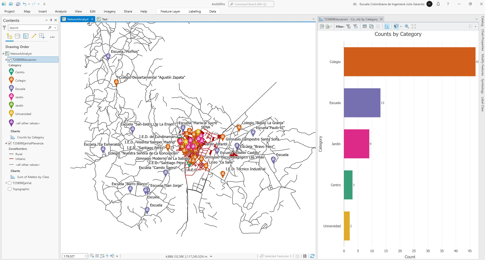</div>


## Objetivos

* Importar y homologar atributos de equipamientos educativos
* Importar y homologar atributos de centros de atención de emergencias


## Requerimientos

* [:mortar_board:Actividad](../POTLayer/Readme.md): Inventario de información geo-espacial recopilada del POT y diccionario de datos.
* [:toolbox:Herramienta](https://www.esri.com/en-us/arcgis/products/arcgis-pro/overview): ESRI ArcGIS Pro 3.3.1 o superior.


## 1. Importación de establecimientos educativos y homologación de atributos 

1. Abra el proyecto de ArcGIS Pro y el mapa _NetworkAnalyst_ creado en la actividad anterior. Importe a la GDB _RedVial_, la capa _\data\POT\Anexo_Acuerdo_012_2013\gdb\25899.gdb\CARTOGRAFIA\EDUCATIVO_ de la cartografía del POT, correspondiente a la localización de instituciones educativas y nombre cómo T25899Educacion. Agregue al mapa y simbolice utilizando el _Pushpin School_.

<div align="center">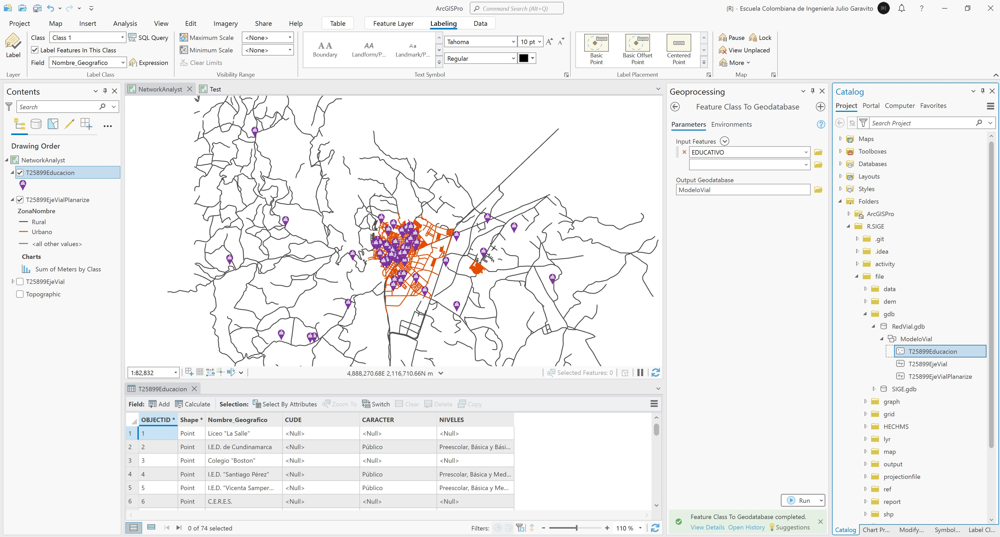</div>

2. En la tabla de atributos, cree los siguientes campos:

<div align="center">

| Atributo | Descripción                                                                  | Tipo       |
|:---------|:-----------------------------------------------------------------------------|:-----------|
| Name     | Nombre de la institución educativa                                           | Text (255) |
| Category | Categoría de la institución (Centro, Colegio, Escuela, Jardin, Universidad)  | Text (50)  |

</div>

<div align="center">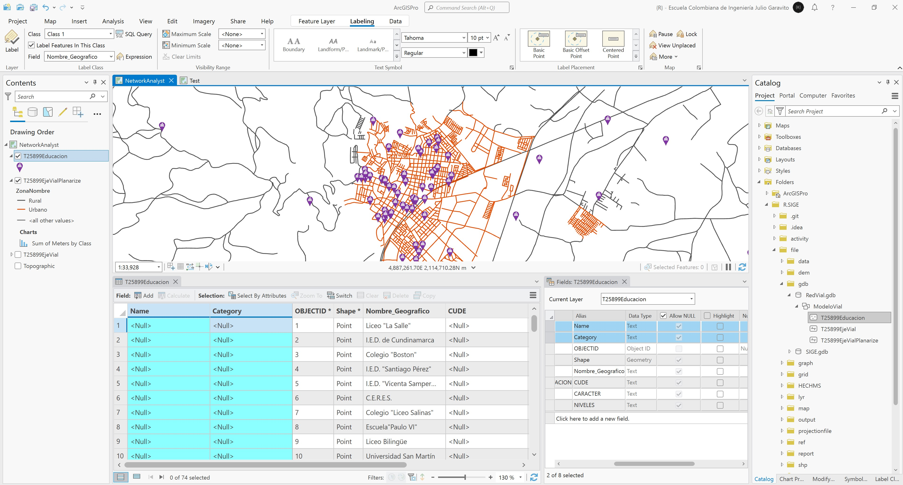</div>

3. Utilizando el calculador de campo, asigne en _Name_ los nombres de instituciones disponibles en `Nombre_Geografico`, luego de la asignación elimine el campo `Nombre_Geografico` y el campo `CUDE` que se encuentra vacío.

<div align="center">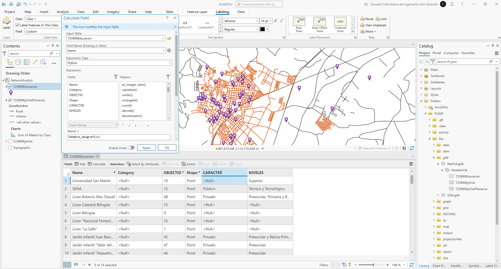</div>

4. Para la asignación de las categorías requeridas en el campo `Category`, ejecute el siguiente script en Python:

```
# edufaclist: 0-SearchText, 1-AssignedCategory
edufaclist = [['Centro', 'Centro'],
            ['Escuela', 'Escuela'],
            ['Jardin', 'Jardin'],
            ['Jardín', 'Jardin'],
            ['I.C.B.F.', 'Jardin'],
            ['Universidad', 'Universidad'],
            ['SENA', 'Universidad'],
            ['Colegio', 'Colegio'],
            ['Gimnasio', 'Colegio'],
            ['Instituto', 'Colegio'],
            ['Liceo', 'Colegio'],
            ['I.E.D.', 'Colegio']]

def edufaccategory(edufac):
  edufac = ' ' + edufac + ' ' # required initial and end spaces for correct validation
  val = True
  txt = 'Centro' # default value for facilities uncontained in the list
  for i in edufaclist:
    if edufac.upper().find(i[0].upper()) > 0 and val:
      val = False
      txt = i[1]
  return txt
  ```

Llamado de función

* Category = `edufaccategory(!Name!)`

<div align="center">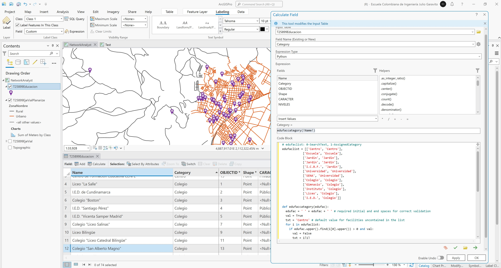</div>

5. Simbolice por valores únicos y cree un gráfico de barras mostrando el conteo de establecimientos educativos por categoría.

<div align="center">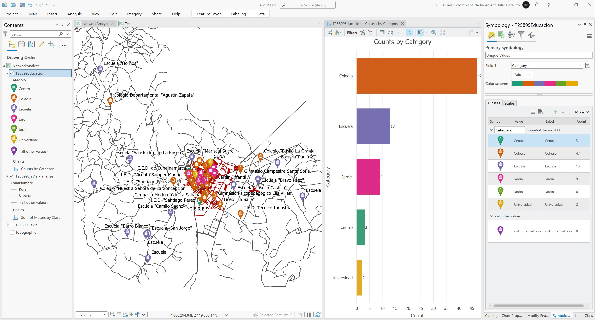</div>


## 2. Importación de centros de atención de emergencias y homologación de atributos 

1. Utilizando la herramienta de Geo-procesamiento _Data Management Tools / Merge_, combine dentro de la GDB `RedVial`, las capas _\data\POT\Anexo_Acuerdo_012_2013\gdb\25899.gdb\CARTOGRAFIA\ANOTACION_ y _\data\POT\Anexo_Acuerdo_012_2013\gdb\25899.gdb\CARTOGRAFIA\ANOTACION_URBANO_ de la cartografía del POT, que incluyen puntos de interés y equipamientos. Elimine los elementos que no hacen parte de atención a emergencias, nombre como `T25899Emergencia`. Abra y verifique la tabla de atributos, podrá observar que se han integrado 2009 localizaciones y varias de ellas no tienen nombre geográfico o etiqueta.

<div align="center">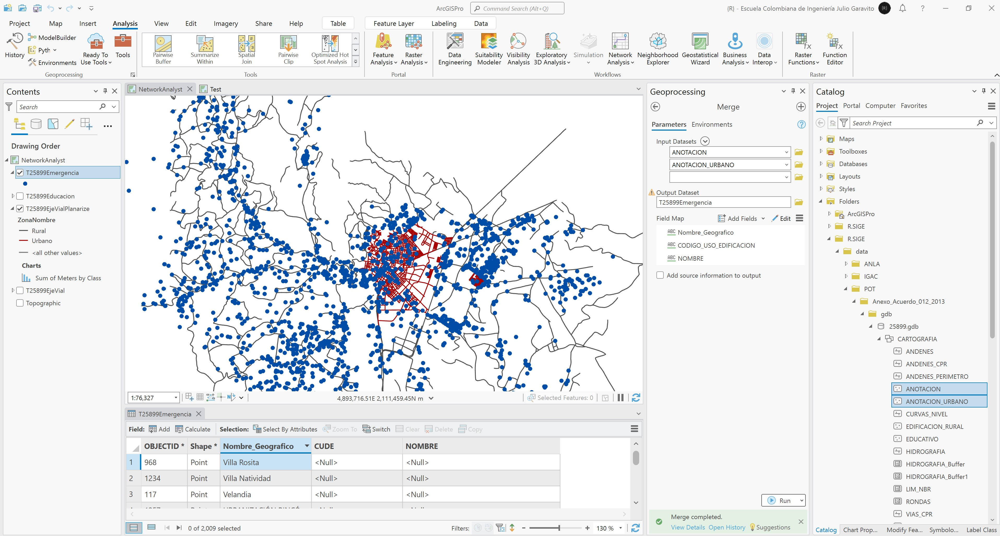</div>

2. En la tabla de atributos, cree los siguientes campos:

<div align="center">

| Atributo  | Descripción                                                                                          | Tipo       |
|:----------|:-----------------------------------------------------------------------------------------------------|:-----------|
| Name      | Nombre del centro de atención                                                                        | Text (255) |
| Emergency | Centro de atención de emergencias: 1-Sí, 0-No                                                        | Short      |
| Category  | Categoría del centro de atención (Bomberos, Policía, Municipal, CAI, Hospital, Centro Salud, Médico) | Text (50)  |

</div>

<div align="center">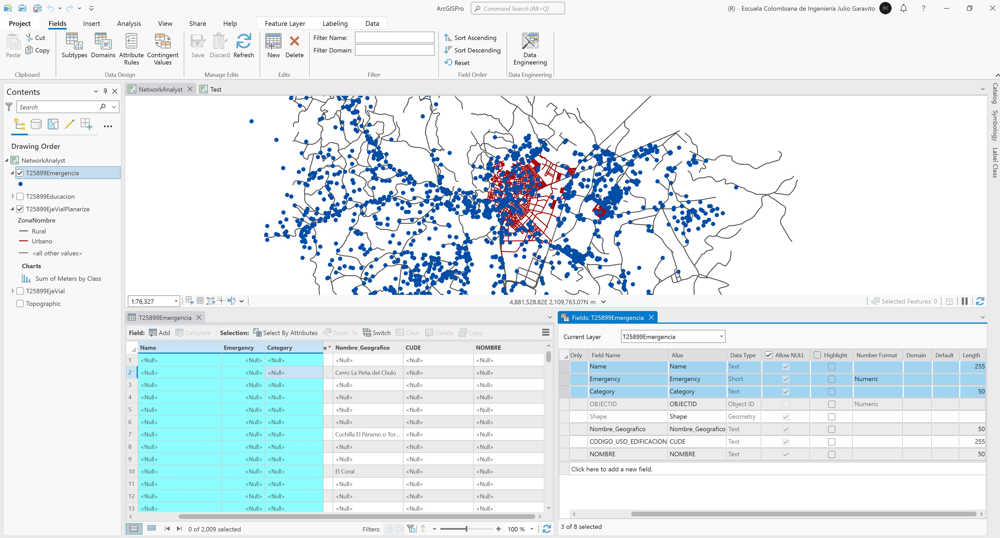</div>

3. En el campo `Nombre`, asigne los nombres contenidos en los campos `Nombre_Geografico` y `NOMBRE` filtrando o seleccionando por atributos aquellos elementos que se encuentran vacíos o nulos.

<div align="center">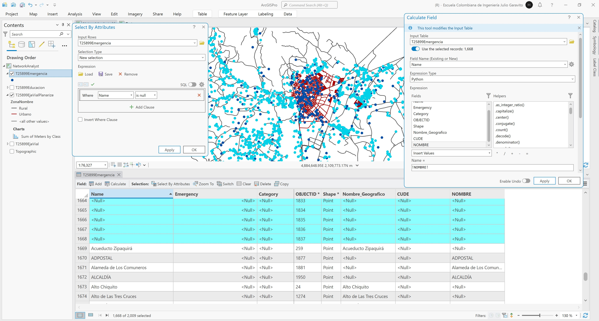</div>

4. Utilizando la herramienta de selección por atributos, elimine todas las localizaciones que no tienen nombre. Para el ejemplo corresponden a 1668 de las 2009 localizaciones integradas. Obtendrá 341 localizaciones con nombres asignados. Una vez eliminados estas entidades, elimine los campos `CUDE`, `Nombre_Geografico` y `NOMBRE`.

<div align="center">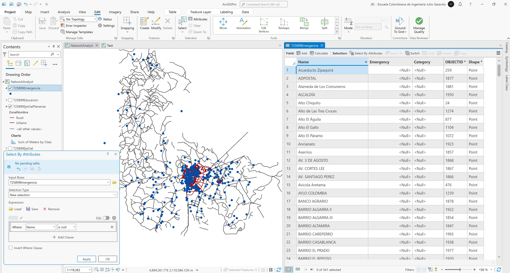</div>

4. Para la asignación de las categorías requeridas en el campo `Category`, ejecute el siguiente script en Python:

```
# emergencylist: 0-SearchText, 1-AssignedCategory
emergencylist = [['Bomberos', 'Bomberos'],
                ['Policía', 'Policia'],
                ['Municipal', 'Municipal'],
                ['CAI', 'Policia'],
                ['Hospital', 'Medico'],
                ['Centro Salud', 'Medico'],
                ['Médico', 'Medico'],
                ['Clínica', 'Medico'],
                ['E.A.A.A.Z.', 'Municipal'],
                ['Salud', 'Medico'],
                ['Médica', 'Medico'],
                ['ALCALDÍA', 'Municipal'],
                ['SALUDCOOP', 'Medico']]
def emergencycategory(emergencyname):
  emergencyname = ' ' + emergencyname + ' ' # required initial and end spaces for correct validation
  val = True
  txt = '(No emergencias)' # default value for facilities uncontained in the list
  for i in emergencylist:
    if emergencyname.upper().find(i[0].upper()) > 0 and val:
      val = False
      txt = i[1]
  return txt
  ```

Llamado de función

* Category = `emergencycategory(!Name!)`

<div align="center">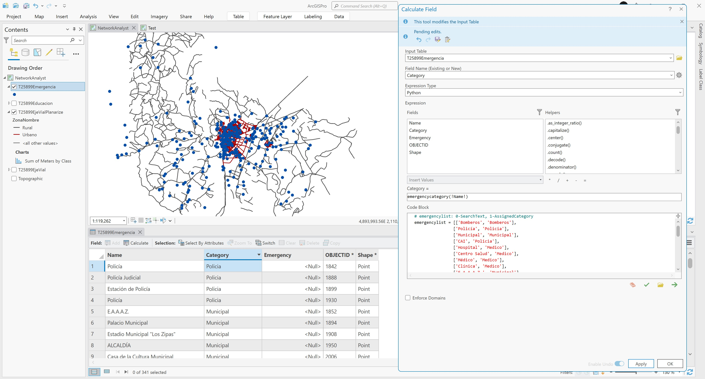</div>

5. Para la marcación de cuáles localizaciones atienden o no emergencias, seleccione por atributos todos los registros cuya categoría sea `(No emergencias)` y asigne el código cero, luego invierta la selección y asigne 1 a las localizaciones con categoría asignada.

<div align="center">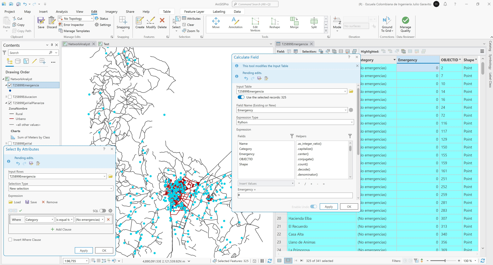</div>
<div align="center">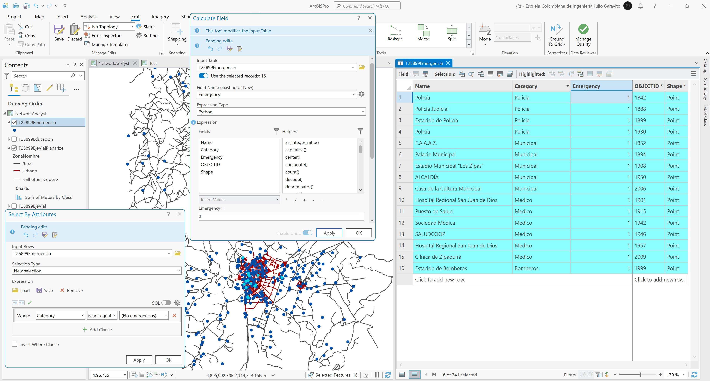</div>

6. Simbolice por categoría y cree una gráfica de barras mostrando el conteo de elementos.

<div align="center">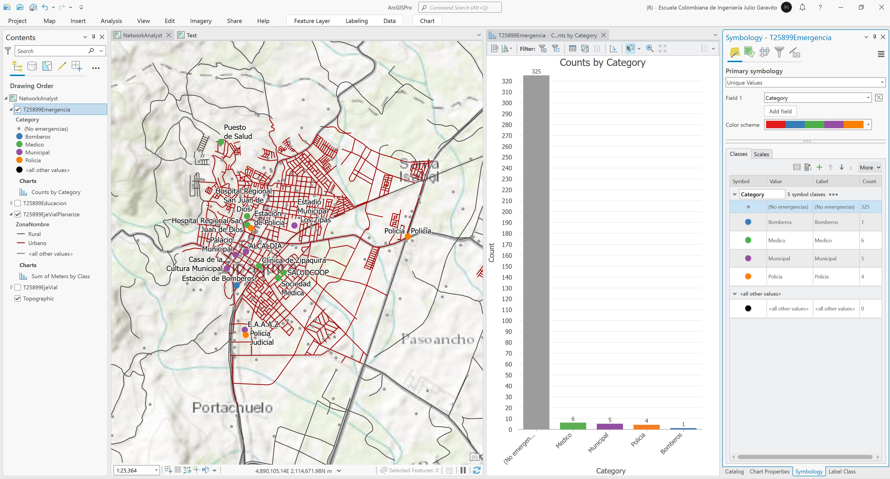</div>


## Elementos requeridos en diccionario de datos

Agregue a la tabla resúmen generada en la actividad [Inventario de información geo-espacial recopilada del POT y diccionario de datos](../POTLayer/Readme.md), las capas generadas en esta actividad que se encuentran listadas a continuación:

| Nombre           | Descripción                                                            | Geometría | Registros | 
|------------------|------------------------------------------------------------------------|-----------|-----------| 
| T25899Educacion  | Localización de establecimientos educativos                            | Point 2D  | 74        | 
| T25899Emergencia | Localización de puntos de interes y centros de atención de emergencias | Point 2D  | 341       | 

> :bulb:Para funcionarios que se encuentran ensamblando el SIG de su municipio, se recomienda incluir y documentar estas capas en el Diccionario de Datos.


## Actividades de proyecto :triangular_ruler:

En la siguiente tabla se listan las actividades que deben ser desarrolladas y documentadas por cada grupo de proyecto en un único archivo de Adobe Acrobat .pdf. El documento debe incluir portada (indicando el caso de estudio, número de avance, nombre del módulo, fecha de presentación, nombres completos de los integrantes), numeración de páginas, tabla de contenido, lista de tablas, lista de ilustraciones, introducción, objetivo general, capítulos por cada ítem solicitado, conclusiones y referencias bibliográficas.

| Actividad     | Alcance                                                                                                                                                                                                                                                                                                                                                                                                                                             |
|:--------------|:----------------------------------------------------------------------------------------------------------------------------------------------------------------------------------------------------------------------------------------------------------------------------------------------------------------------------------------------------------------------------------------------------------------------------------------------------|
| Avance **P7** | Para su caso de estudio, importe y homologue los centros educativos y de atención de emergencias.                                                                                                                                                                                                                                                                                                                                                   | 
| Avance **P7** | En una tabla y al final del informe de avance de esta entrega, indique el detalle de las sub-actividades realizadas por cada integrante de su grupo. Para actividades que no requieren del desarrollo de elementos de avance, indicar si realizo la lectura de la guía de clase y las lecturas indicadas al inicio en los requerimientos. Utilice las siguientes columnas: Nombre del integrante, Actividades realizadas, Tiempo dedicado en horas. | 

> No es necesario presentar un documento de avance independiente, todos los avances de proyecto de este módulo se integran en un único documento.
> 
> En el informe único, incluya un numeral para esta actividad y sub-numerales para el desarrollo de las diferentes sub-actividades, siguiendo en el mismo orden de desarrollo presentado en esta actividad.


## Referencias

* [ArcGIS Pro - Network Analyst tutorials](https://pro.arcgis.com/en/pro-app/latest/help/analysis/networks/network-analyst-tutorials.htm)
* [ArcGIS Pro - Create a network dataset](https://pro.arcgis.com/en/pro-app/latest/help/analysis/networks/how-to-create-a-usable-network-dataset.htm)


## Control de versiones

| Versión    | Descripción                                                | Autor                                      | Horas |
|------------|:-----------------------------------------------------------|--------------------------------------------|:-----:|
| 2024.04.12 | Versión inicial con alcance de la actividad                | [rcfdtools](https://github.com/rcfdtools)  |   4   |
| 2024.11.04 | Investigación y documentación para caso de estudio general | [rcfdtools](https://github.com/rcfdtools)  |   5   |


_R.SIGE es de uso libre para fines académicos, conoce nuestra licencia, cláusulas, condiciones de uso y como referenciar los contenidos publicados en este repositorio, dando [clic aquí](LICENSE.md)._

_¡Encontraste útil este repositorio!, apoya su difusión marcando este repositorio con una ⭐ o síguenos dando clic en el botón Follow de [rcfdtools](https://github.com/rcfdtools) en GitHub._

| [:arrow_backward: Anterior](../Hazard/Readme.md) | [:house: Inicio](../../README.md) | [:beginner: Ayuda / Colabora](https://github.com/rcfdtools/R.SIGE/discussions/46) | [Siguiente :arrow_forward:]() |
|--------------------------------------------------|-----------------------------------|-----------------------------------------------------------------------------------|-------------------------------|

[^1]: 