# Network Analyst - Homologación de red vial urbana y rural
Keywords: `network-properties` `hierarchy` `oneway` `planarize`

En la carpeta GDB cree una File Geodatabase y un dataset para la integración de la red vial. Importe al dataset las vías municipales y homologue a los atributos para modelación de redes viales. Seleccione todas las vías y ejecute la función Planarize que le permitira obtener tramos independientes entre intersecciones (recalcule longitudes y tiempos de viaje en cada tramo).

<div align="center">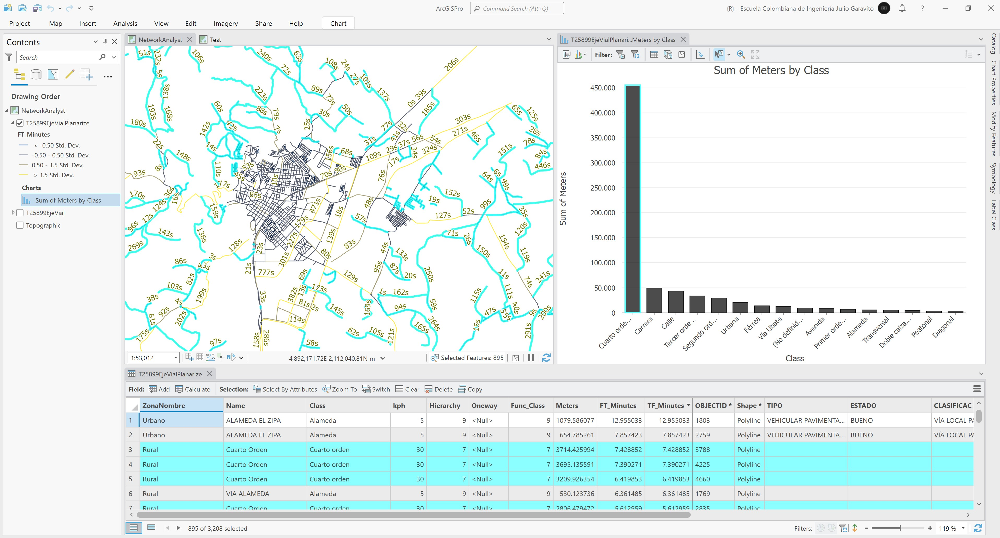</div>


## Objetivos

* Crear una base de datos geográfica y un Network Dataset para simulación de redes vehiculares
* Homologar los atributos de la red vial municipal


## Requerimientos

* [:mortar_board:Actividad](../RoadSummary/Readme.md): Análisis estadístico de la red vial.
* [:toolbox:Herramienta](https://www.esri.com/en-us/arcgis/products/arcgis-pro/overview): ESRI ArcGIS Pro 3.3.1 o superior.


## 1. Creación de base de datos e importación de ejes viales

1. Abra el proyecto de ArcGIS Pro, creado previamente y desde el menú _Insert_ cree un nuevo mapa _New Map_, renombre como _NetworkAnalyst_ y establezca el CRS 9377. Agregue al mapa la capa de la red vial municipal disponible en la ruta `\file\gdb\SIGE.gdb\Red_vial` y ajuste la simbología a valores únicos representando el campo de atributos `ZonaNombre`.  

<div align="center">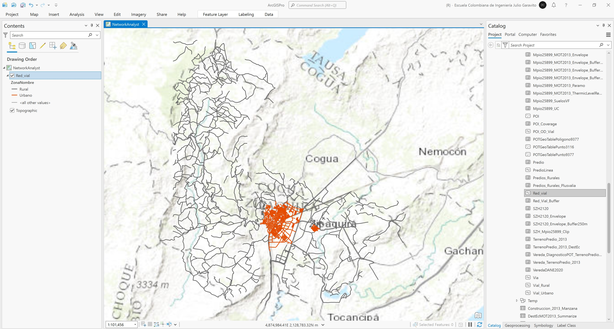</div>

2. Dentro de la carpeta `\file\GDB`, cree una File Geodatabase con el nombre _RedVial_ y un dataset llamado _ModeloVial_ asignando el CRS 9377.

<div align="center">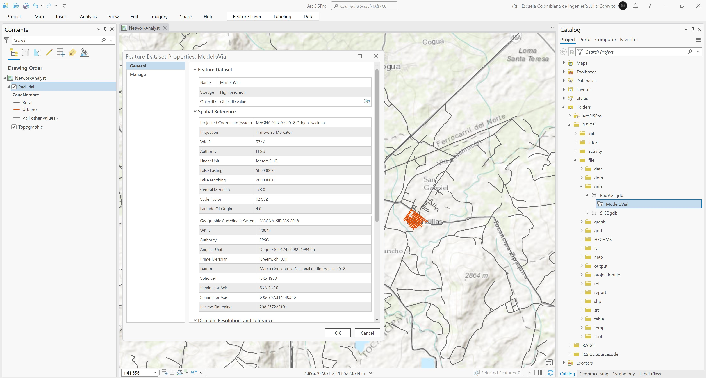</div>

3. Importe al dataset _ModeloVial_, la capa _Red_vial_. Desde el panel lateral izquierdo _Contents_, modifique la fuente de datos de la capa _Red_vial_ hacia la ruta de la GDB del _ModeloVial_. Renombre como `T25899EjeVial`.

<div align="center"></div>

4. En la tabla de atributos de la red vial, cree los siguientes campos:

<div align="center">

| Atributo    | Descripción                                                                                                                   | Tipo       |
|:------------|:------------------------------------------------------------------------------------------------------------------------------|:-----------|
| Name        | Nombre de la vía                                                                                                              | Text (255) |
| Class       | Clase de vía (Autopista, Calle, Camino, Carrera, Diagonal, Férrea, Peatonal, Transversal, Rural, Alameda, Avenida, Sin clase) | Text (255) |
| Meters      | Longitud de tramo en metros                                                                                                   | Double     |
| kph         | Velocidad de tramo en kilómetros / hora                                                                                       | Double     |
| Oneway      | Sentido vial vector (FT, TF, N). To, From, Not                                                                                | Text (2)   |
| Hierarchy   | Jerarquía vial de 1 a n                                                                                                       | Long       |
| Func_Class  | Clasificador vial numérico en función de la clase, jerarquía y localización geográfica                                        | Long       |
| FT_Minutes  | Tiempo de viaje en minutos, desde a hacia o hacia desde. Calcular con la expresión FT_Minutes = (!Meters!/1000)/(!kph!/60)    | Double     |
| TF_Minutes  | Tiempo de viaje en minutos, hacia a desde. Calcular con la expresión FT_Minutes = (!Meters!/1000)/(!kph!/60)                  | Double     |

</div>

> Atributos complementarios: en caso de que la red vial incluya puentes, deprimidos, tramos sin pavimentar, zonas de paso peatonal y otros elementos importantes, deberá incluir estos atributos

<div align="center">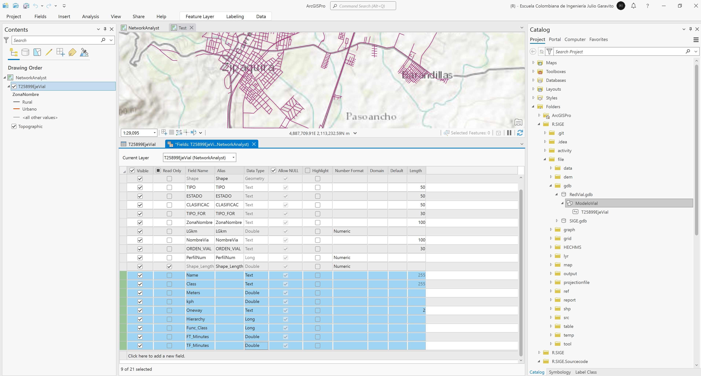</div>


## 2. Homologación de atributos

1. Para la homologación de atributos, asigne al campo _Name_ los valores contenidos en el campo _NombreVia_, para ello utilice el calculador de campo. Podrá observar que mayoritariamente los nombres solo están disponibles en las vías urbanas.

<div align="center">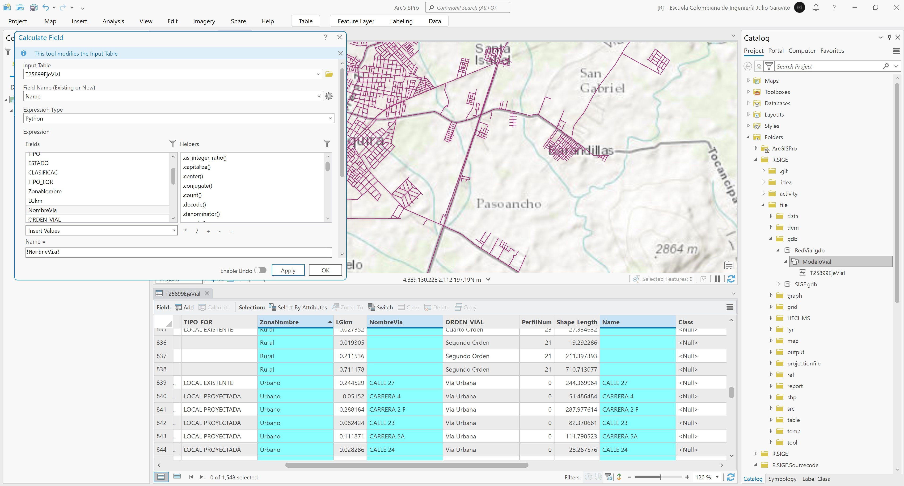</div>

Desde las propiedades de la capa de vías, filtre solo aquellos tramos que no tienen nombre y utilizando el calculador de campo, asigne nombres temporales a partir de los demás campos existentes en la tabla. Por ejemplo, asigne como nombre los valores contenidos en los campos _ORDEN_VIAL_ y _TIPO_FOR_. Luego de la asignación podrá observar que todas las vías tienen un nombre asignado.

Expresión Python: `!ORDEN_VIAL! + " " + !TIPO_FOR!`

<div align="center">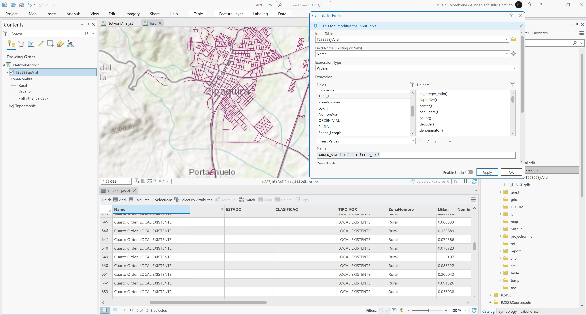</div>

> Para vías sin ningún tipo de atributo disponible asigne _(Sin nombre)_.

2. Para la homologación de los atributos `Class` correspondiente a la clase de vía, `kph` correspondiente a la velocidad y `Hierarchy` correspondiente a la jerarquía vía, utilice como referencia los valores descritos en la siguiente tabla y script de Python:

<div align="center">

| Class         | kph | Hierarchy |
|:--------------|:---:|:---------:|
| Peatonal      |  5  |     9     |
| Alameda       |  5  |     9     |
| Autopista     | 60  |     1     |
| Avenida       | 30  |     2     |
| Carrera       | 30  |     2     |
| Calle         | 20  |     3     |
| Diagonal      | 20  |     2     |
| Transversal   | 20  |     2     |
| Férrea        | 30  |     9     |
| Camino        | 40  |     4     |
| Urbana        | 20  |     3     |
| Primer orden  | 50  |     4     |
| Segundo orden | 40  |     5     |
| Tercer orden  | 35  |     6     |
| Cuarto orden  | 30  |     7     |
| Doble calzada | 60  |     1     |
| Vía Ubate     | 60  |     1     |
| Rural         | 30  |     3     |

</div>

> Para vías que contienen dos descriptores, p.ej. _Peatonal Carrera 6_, la clase asignada corresponderá a la primera encontrada en la lista de evaluación del script de Python.  
> Para vías por tipo de orden también son necesarias las homologaciones.  
> Las velocidades definidas en el campo _kph_ corresponden a velocidades vehiculares. 

```
# roadlist: 0-Class, 1-kph, 2-Hierarchy
roadlist = [['Peatonal', 5, 9],
            ['Alameda', 5, 9],
            ['Autopista', 60, 1],
            ['Avenida', 30, 2],
            ['Carrera', 30, 2],
            ['Calle', 20, 3],
            ['Diagonal', 20, 2],
            ['Transversal', 20, 2],
            ['Férrea', 30, 9],
            ['Camino', 40, 5],
            ['Urbana', 20, 3],
            ['Primer orden', 50, 4],
            ['Segundo orden', 40, 5],
            ['Tercer orden', 35, 6],
            ['Cuarto orden', 30, 7],
            ['Doble calzada', 60, 1],
            ['Vía Ubate', 60, 1],
            ['Rural', 30, 4]]

#valnovalid: Class='(No definido)', kph=20, Hierarchy=9
def roadclass(roadname, atributo, valnovalid):
  roadname = ' ' + roadname + ' ' # required initial and end spaces for correct validation
  val = True
  txt = valnovalid
  for i in roadlist:
    if roadname.upper().find(i[0].upper()) > 0 and val:
      val = False
      txt = i[atributo]
  return txt
  ```

Llamados de función

* Class = `roadclass(!Name!, 0, '(No definido)')` donde 0 corresponde a la columna de la matriz de atributos
* kph = `roadclass(!Name!, 1, 20)` donde 20 corresponde a 20 kph para vías sin Class 
* Hierarchy = `roadclass(!Name!, 2, 9)` donde 9 corresponde la jerarquía para vías sin Class

> En el llamado de función, los valores del segundo parámetros correspondientes a 0,1,2, corresponden al número de columnas en la matriz roadlist, donde 0 es utilizado para la clase, 1 para la velocidad en kph y 2 para las jerarquías.

<div align="center">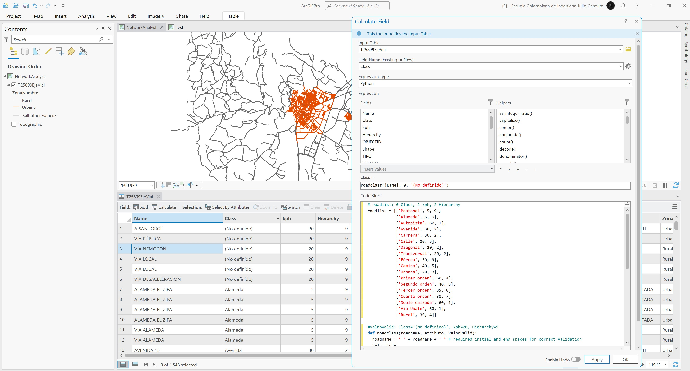</div>

Simbología para clases viales

<div align="center"></div>

Simbología para velocidades viales

<div align="center">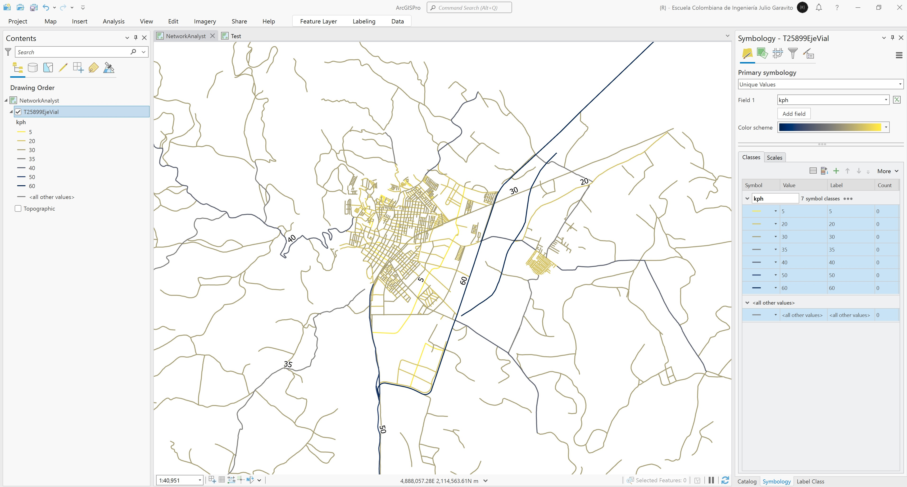</div>

Simbología para jerarquías viales

<div align="center"></div>

3. Para la homologación del campo _Oneway_ correspondiente a sentidos viales, simbolice utilizando la direccionalidad de las líneas y establezca los siguientes valores de ejemplo:

* Vías peatonales: `N` debido a que no es transitable en vehículo.
* VÍA FERREA: `N` debido a que no es transitable en vehículo.
* CARRERA 10: `TF` debido a que el tránsito de esta vía es de noreste a sudeste.  
* CARRERA 11: `FT` debido a que el tránsito de esta vía es de sudeste a noreste. 

Para vías peatonales y vía férrea

<div align="center">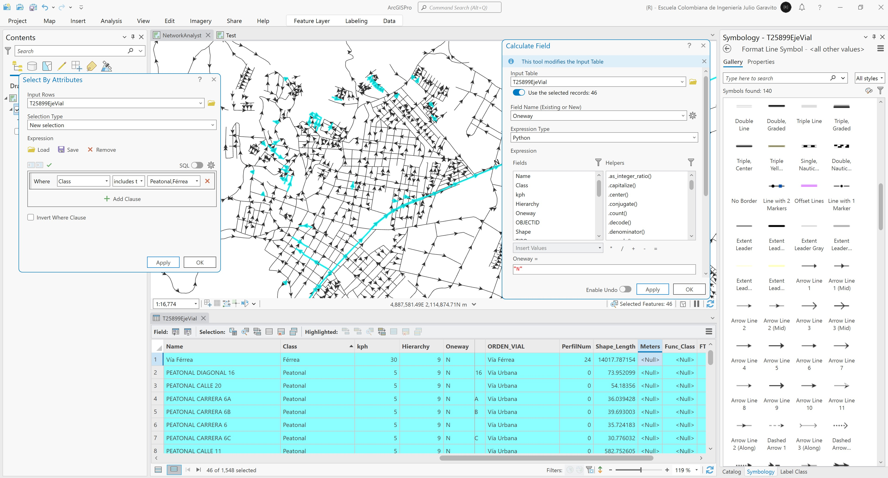</div>

Para carrera 10

<div align="center"></div>

Para carrera 11

<div align="center">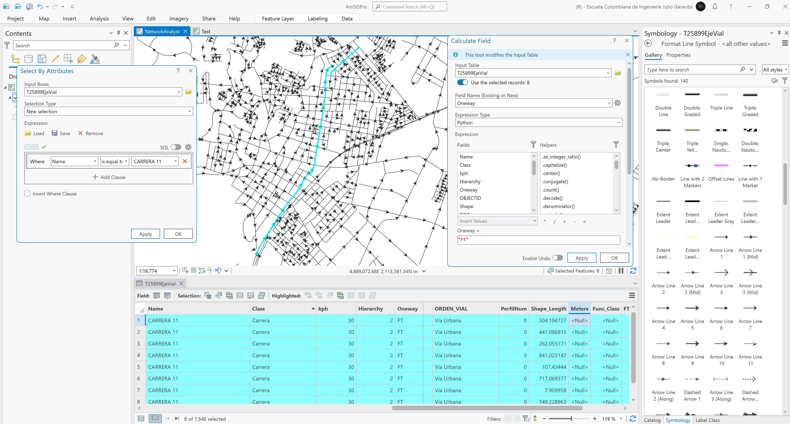</div>

> Para completar la homologación de sentidos viales se recomienda utilizar como referencia las flechas direccionales de los mapas de Google Street o Waze.

Simbología de jerarquía

<div align="center">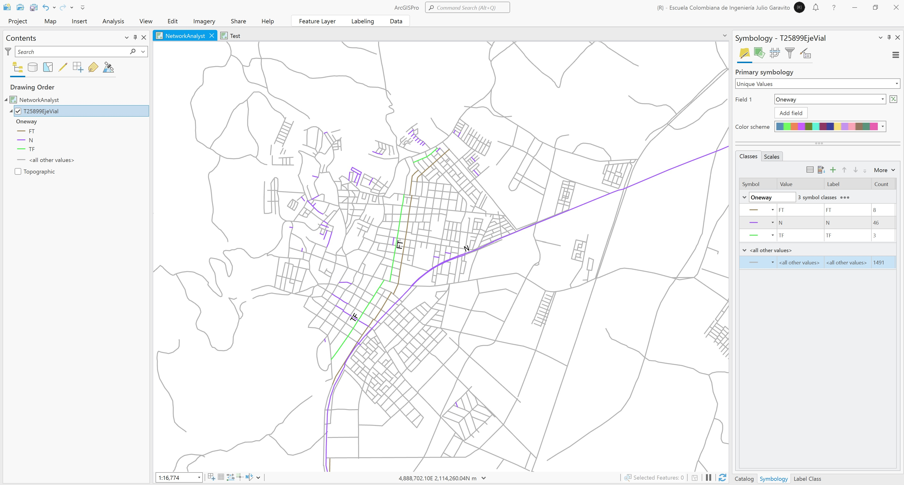</div>

4. Para la homologación del atributo `Func_Class` correspondiente a la combinación de clase, jerarquía y localización geográfica, que permite ajustar la prioridad con la que se resolverá la red, utilizaremos los valores inicialmente definidos en _Hierarchy_.

<div align="center"></div>

> Los atributos de longitud de tramo `Meters` y tiempos de desplazamiento en diferentes sentidos FT_Minutes y TF_Minutes, serán calculados una vez se segmenten los tramos viales entre intersecciones.


## 3. Segmentación de tramos por intersecciones y complementación de atributos

1. Cree una copia de la capa `T25899EjeVial` y nombre como `\file\gdb\RedVial.gdb\ModeloVial\T25899EjeVialPlanarize`.

<div align="center">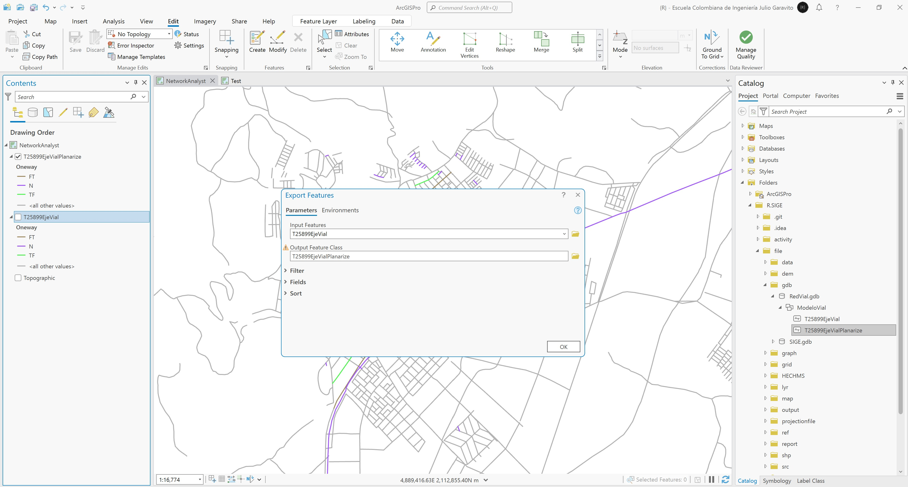</div>

2. Desde el panel lateral izquierdo _Contents_ y dando clic derecho sobre la capa `T25899EjeVialPlanarize`, seleccione todas las entidades o líneas (para el caso de estudio corresponde a 1584 líneas). Luego desde el menú _Edit / Tools_, ejecute la opción _Divide / Planarize_ que subdividirá cada línea a partir de las intersecciones encontradas. Defina el _Cluster Tolerance_ o radio de aproximación de intersección en 0.001m. Una vez segmentadas las líneas, en el menú _Edit_ de clic en _Save_ para guardar las modificaciones realizadas.

> El proceso de segmentación de tramos en intersecciones es requerido para resolver los giros en esquinas. Pasos elevados entre tramos, p.ej., los correspondientes a puentes, requieren de la unión de tramos próximos para evitar giros incorrectos. 

<div align="center">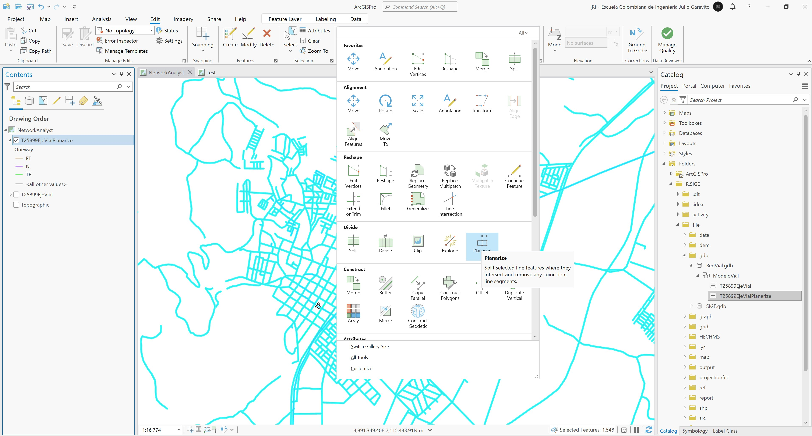</div>

3. Abra la tabla de atributos y simbolice a partir de flechas direccionales hacia el punto final, podrá observar que se han obtenido 3208 entidades.

<div align="center">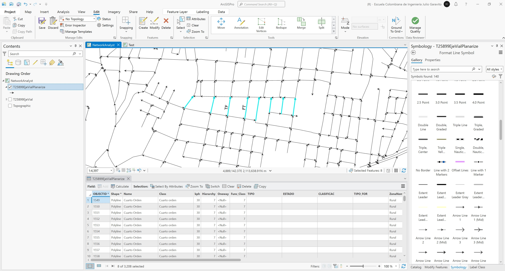</div>

4. Utilizando el calculador de campo, calcule en el campo `Meters` la longitud en metros de cada segmento de la red. Rotule cada tramo y verifique las longitudes de cada segmento.

Rótulo Arcade: `Round($feature.Meters, 1)`

<div align="center">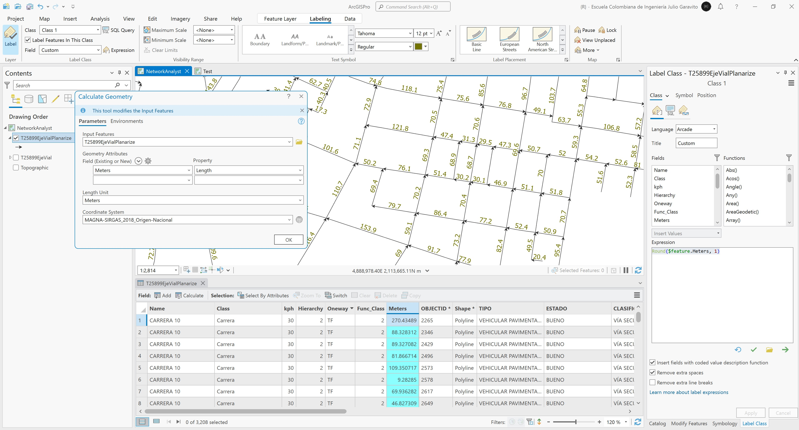</div>

5. Utilizando el calculador de campo, calcule el tiempo de viaje por tramo en los campos `FT_Minutes` y `Tf_Minutes = (!Meters!/1000)/(!kph!/60)`. Rotule y verifique los valores obtenidos convirtiendo a minutos. Simbolice por colores graduados y desviación estándar la red a partir de los tiempos obtenidos.

Rótulo Arcade: `Round($feature.FT_Minutes*60, 0) + "seg"` 

<div align="center"></div>


## Elementos requeridos en diccionario de datos

Agregue a la tabla resúmen generada en la actividad [Inventario de información geo-espacial recopilada del POT y diccionario de datos](../POTLayer/Readme.md), las capas generadas en esta actividad que se encuentran listadas a continuación:

| Nombre                  | Descripción                                                                             | Geometría     | Registros  | 
|-------------------------|-----------------------------------------------------------------------------------------|---------------|------------| 
| T25899EjeVial           | Red vial municipal importada a la GDB RedVial.gdb                                       | Poli-línea 2D | 1548       | 
| T25899EjeVialPlanarize  | Red vial municipal importada a la GDB con tramos segmentados a partir de intersecciones | Poli-línea 2D | 3208       | 

> :bulb:Para funcionarios que se encuentran ensamblando el SIG de su municipio, se recomienda incluir y documentar estas capas en el Diccionario de Datos.


## Actividades de proyecto :triangular_ruler:

En la siguiente tabla se listan las actividades que deben ser desarrolladas y documentadas por cada grupo de proyecto en un único archivo de Adobe Acrobat .pdf. El documento debe incluir portada (indicando el caso de estudio, número de avance, nombre del módulo, fecha de presentación, nombres completos de los integrantes), numeración de páginas, tabla de contenido, lista de tablas, lista de ilustraciones, introducción, objetivo general, capítulos por cada ítem solicitado, conclusiones y referencias bibliográficas.

| Actividad     | Alcance                                                                                                                                                                                                                                                                                                                                                                                                                                             |
|:--------------|:----------------------------------------------------------------------------------------------------------------------------------------------------------------------------------------------------------------------------------------------------------------------------------------------------------------------------------------------------------------------------------------------------------------------------------------------------|
| Avance **P7** | Para su caso de estudio, importe, homologue y segmente los tramos viales a partir de intersecciones. Verifique que los campos de atributos creados estén completamente poblados, excepto por el atributo `Oneway` que únicamente se aplica a tramos específicos de la red.                                                                                                                                                                          | 
| Avance **P7** | En una tabla y al final del informe de avance de esta entrega, indique el detalle de las sub-actividades realizadas por cada integrante de su grupo. Para actividades que no requieren del desarrollo de elementos de avance, indicar si realizo la lectura de la guía de clase y las lecturas indicadas al inicio en los requerimientos. Utilice las siguientes columnas: Nombre del integrante, Actividades realizadas, Tiempo dedicado en horas. | 

> No es necesario presentar un documento de avance independiente, todos los avances de proyecto de este módulo se integran en un único documento.
> 
> En el informe único, incluya un numeral para esta actividad y sub-numerales para el desarrollo de las diferentes sub-actividades, siguiendo en el mismo orden de desarrollo presentado en esta actividad.


## Referencias

* [ArcGIS Pro - Network Analyst tutorials](https://pro.arcgis.com/en/pro-app/latest/help/analysis/networks/network-analyst-tutorials.htm)
* [ArcGIS Pro - Create a network dataset](https://pro.arcgis.com/en/pro-app/latest/help/analysis/networks/how-to-create-a-usable-network-dataset.htm)


## Control de versiones

| Versión     | Descripción                                                | Autor                                      | Horas |
|-------------|:-----------------------------------------------------------|--------------------------------------------|:-----:|
| 2024.04.11  | Versión inicial con alcance de la actividad                | [rcfdtools](https://github.com/rcfdtools)  |   4   |
| 2024.11.02  | Investigación y documentación para caso de estudio general | [rcfdtools](https://github.com/rcfdtools)  |   8   |


_R.SIGE es de uso libre para fines académicos, conoce nuestra licencia, cláusulas, condiciones de uso y como referenciar los contenidos publicados en este repositorio, dando [clic aquí](LICENSE.md)._

_¡Encontraste útil este repositorio!, apoya su difusión marcando este repositorio con una ⭐ o síguenos dando clic en el botón Follow de [rcfdtools](https://github.com/rcfdtools) en GitHub._

| [:arrow_backward: Anterior](../Hazard/Readme.md) | [:house: Inicio](../../README.md) | [:beginner: Ayuda / Colabora](https://github.com/rcfdtools/R.SIGE/discussions/45) | [Siguiente :arrow_forward:](../NAFacilities/Readme.md) |
|--------------------------------------------------|-----------------------------------|-----------------------------------------------------------------------------------|--------------------------------------------------------|

[^1]: 