

# 7B.4. Network Analyst - Estudio de rutas de transporte escolar
Keywords: `school` `route` `network-solve` `facilities`

Realice un análisis de ruta única óptima que permita recorrer las instituciones educativas y determine el tiempo y distancia total recorrida. Defina como tolerancia de búsqueda 1000 metros e indique cuáles instituciones no han sido cubiertas. Active las restricciones y modos de transporte establecidas sin permitir giros en U. Para las instituciones cubiertas determine la distancia hasta la red. Muestre el detalle de las instrucciones de recorrido. Realice un análisis de ruta óptima por categoría de institución educativa que permita recorrer las instituciones educativas y determine los tiempos y distancias totales recorridas por cada ruta. Resuelva el recorrido de la red simulando un incidente en una localización específica, compare los tiempos y distancias con los obtenidos anteriormente. Resuelva el recorrido de la red simulando cierre completo en el centro histórico. 

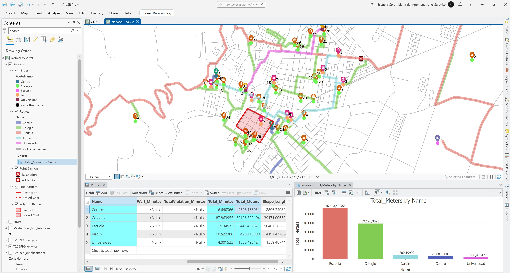

## Objetivos

* Resolver rutas escolares generales y por categorías
* Resolver redes simulando eventos de bloqueo

## Requerimientos

* [:mortar_board:Actividad](../NADataset/Readme.md): Creación y configuración del network dataset.
* [:toolbox:Herramienta](https://www.esri.com/en-us/arcgis/products/arcgis-pro/overview): ESRI ArcGIS Pro 3.3.1 o superior.

## 1. Ruta óptima global

Realice un análisis de ruta única óptima que permita recorrer las instituciones educativas y determine el tiempo y distancia total recorrida. Defina como tolerancia de búsqueda 1000 metros e indique cuáles instituciones no han sido cubiertas. Active las restricciones y modos de transporte establecidas sin permitir giros en U. Para las instituciones cubiertas determine la distancia hasta la red. Muestre el detalle de las instrucciones de recorrido

1. Abra el proyecto de ArcGIS Pro y el mapa _NetworkAnalyst_ creado previamente, en contents verifique que esté cargado el Network Dataset y selecciónelo. En el menú superior _Network Dataset Layer - Data_, seleccione la opción _Network Analysis / Route_.

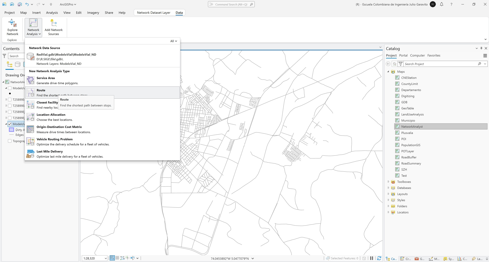

2. En el panel lateral _Contents_, seleccione _Stops_ en _Route_ y en el menú _Route Layer - Data_, de clic en _Import Stops_. En la ventana de importación de localizaciones, seleccione en _Input Locations_ la capa o feature class `T25899Educacion` y establezca la tolerancia de búsqueda en 1000 metros.

> Debido a que previamente se realizó la definición de atributos con nombres compatibles con esta herramienta y se realizó la configuración de del Dataset, automáticamente han sido asociados el campo de nombre y los elementos de criterio de búsqueda relacionados con la red vial y sus nodos.

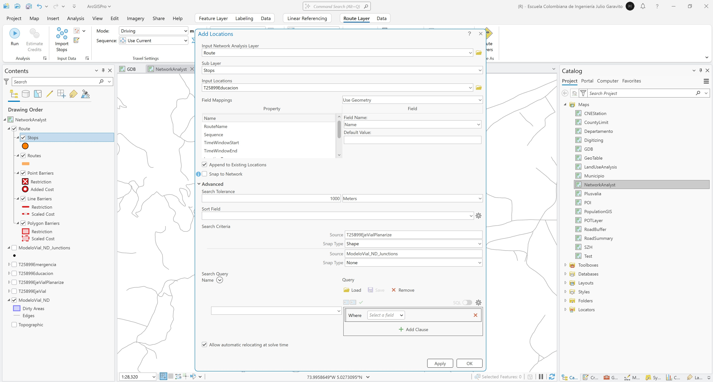

 
Luego de dar clic en aceptar, podrá observar que se han cargado las localizaciones de la red a resolver. Abra y explore la tabla de atributos, observará que la secuencia ha sido definida en el mismo orden de entidades de la capa de instituciones educativas. El campo `DistanceToNetworkInMeters` contiene el cálculo inicial de proximidad hasta el punto más cercano en la red.

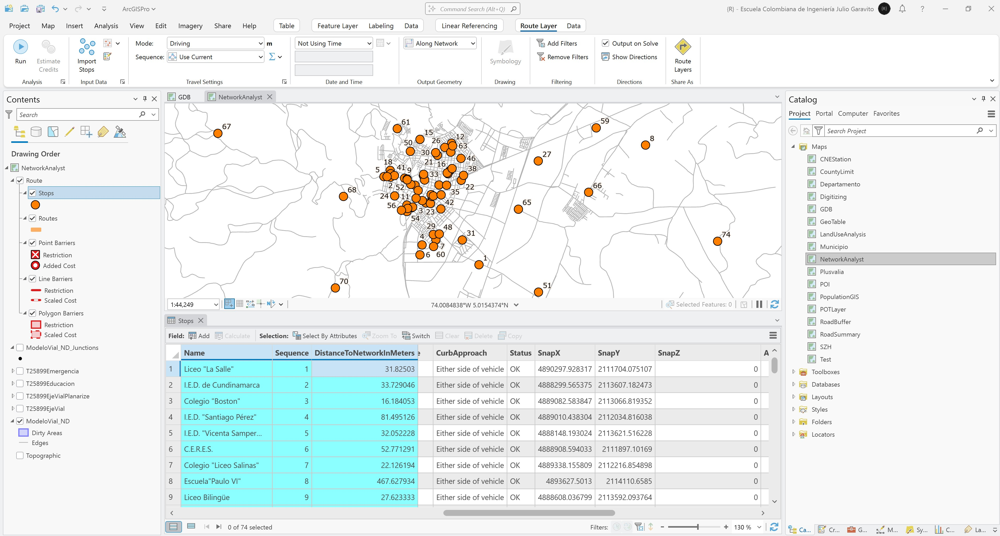

3. Para resolver la red optimizando la secuencia de viaje, en _Contents_ seleccione _Route_ y en el menu _Route Layer_ seleccione la opción Travel _Settings / Sequence / Find Best_ y luego de clic en _Run_. Podrá observar que se ha resuelto la ruta óptima. De clic en el expansor de la pentaña _Analysis_ para conocer qué instituciones educativas no pudieron ser resueltas, podrá observar que dos de ellas no cumplen con los criterios establecidos de solución.

> Tenga en cuenta que en la parametrización de la red, se definieron globalmente restricciones para giros en U, solución por jerarquía vial y se inhabilitaron los corredores peatonales para paso vehicular. 

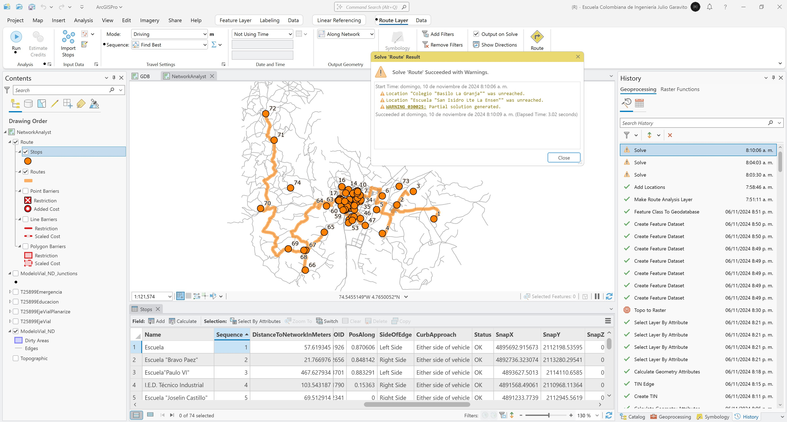

4. Para conocer la secuencia de barrido, los tiempos de viaje y las distancias acumuladas, revise las columnas de atributos `Sequence`, `Cumul_Minutes` y `Cumul_Meters`.

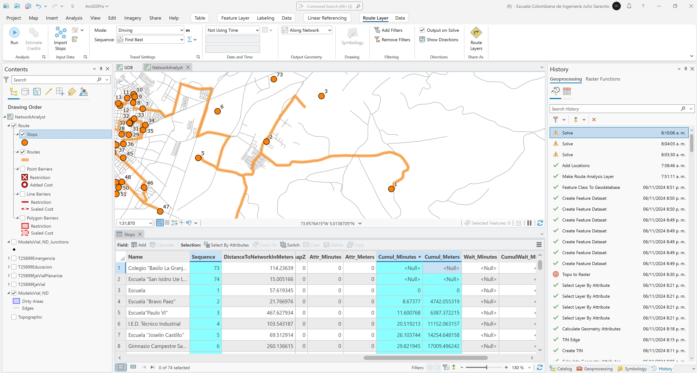

> Para la red resuelta se ha obtenido un tiempo total de 163.16 minutos y una distancia total recorrida de 77919.05 metros.

5. Para desactivar las restricciones de giros en U o las demás restricciones definidas para la red, de clic en el expansor de la pestaña _Travel Settings_ y desmarque las casillas requeridas. Para este ejemplo desactivaremos las restricciones de giros en U y permitiremos el paso por vías peatonales. Vuelva a solucionar la red y verifique el nuevo tiempo total y distancia recorrida, podrá observar que ahora el tiempo total es de 154.29 minutos y distancia recorrida de 75985.24 metros, inferior a la obtenida inicialmente.

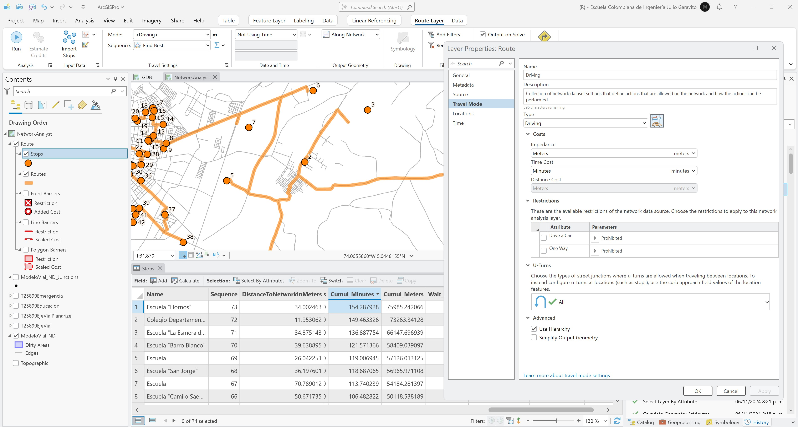

6. Para conocer las secuencias y giros a realizar en cada vía, en el menú _Route Layer_ de clic en la opción _Directions / Show Directions_.

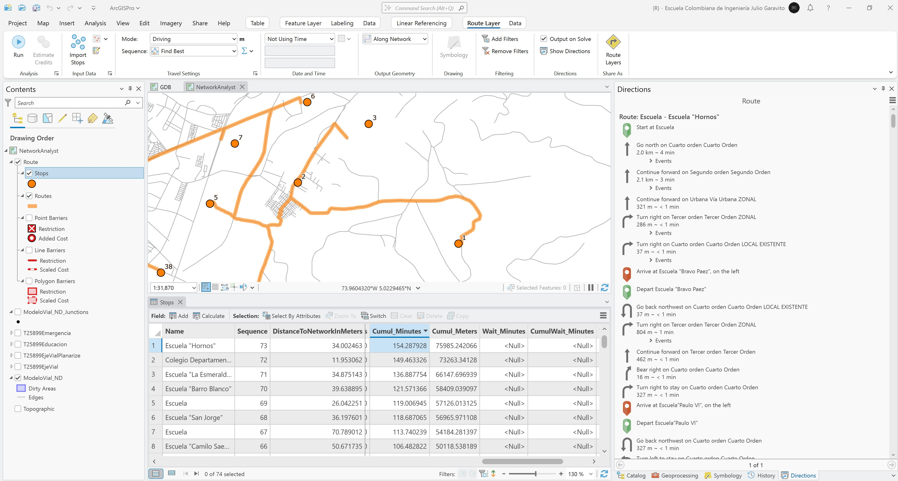

## 2. Ruta óptima por categoría de institución educativa

1. En el panel lateral _Contents_, seleccione el Network Dataset _ModeloVial_ND_ y en el menú superior _Network Dataset Layer - Data_, seleccione la opción _Network Analysis / Route_ para crear una nueva ruta a resolver, será nombrada como _Route 2_. 

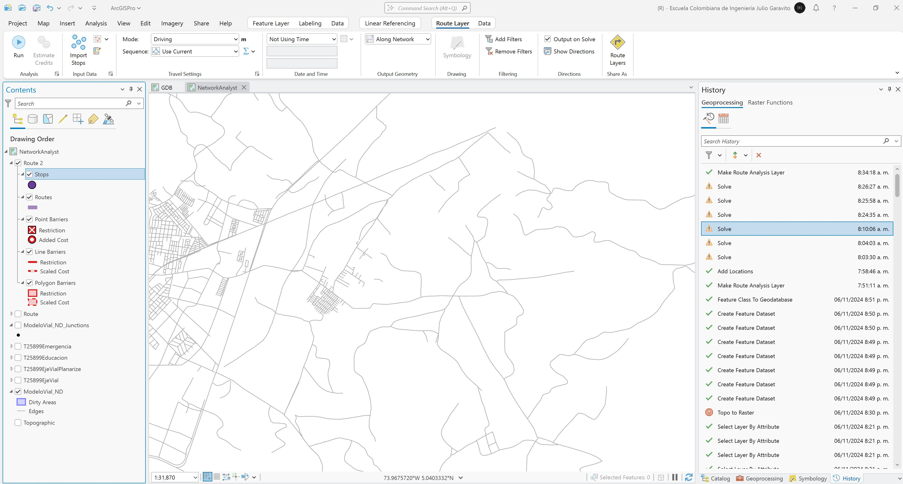

2. En el panel lateral _Contents_, seleccione _Stops_ en _Route_ y en el menú _Route Layer - Data_, de clic en _Import Stops_. En la ventana de importación de localizaciones, seleccione en _Input Locations_ la capa o feature class `T25899Educacion`, establezca la tolerancia de búsqueda en 1000 metros y en _Field Mappings / Property_, seleccione la propiedad _RouteName_ y el campo `Category`. Simbolice los nodos de ruta por valores únicos a partir del campo _RouteName_. En la tabla de atributos podrá observar que cada grupo tiene una secuencia específica a resolver.

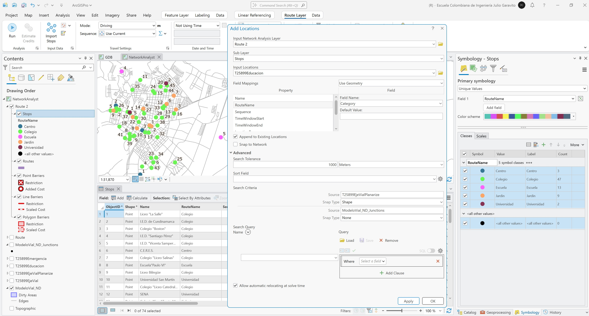

3. Solucione la red por ruta óptima, simbolice por valores únicos cada ruta y analice el resultado obtenido. En la tabla de atributos de rutas podrá conocer los tiempos y distancia acumulada obtenida para cada una. Cree una gráfica de análisis.

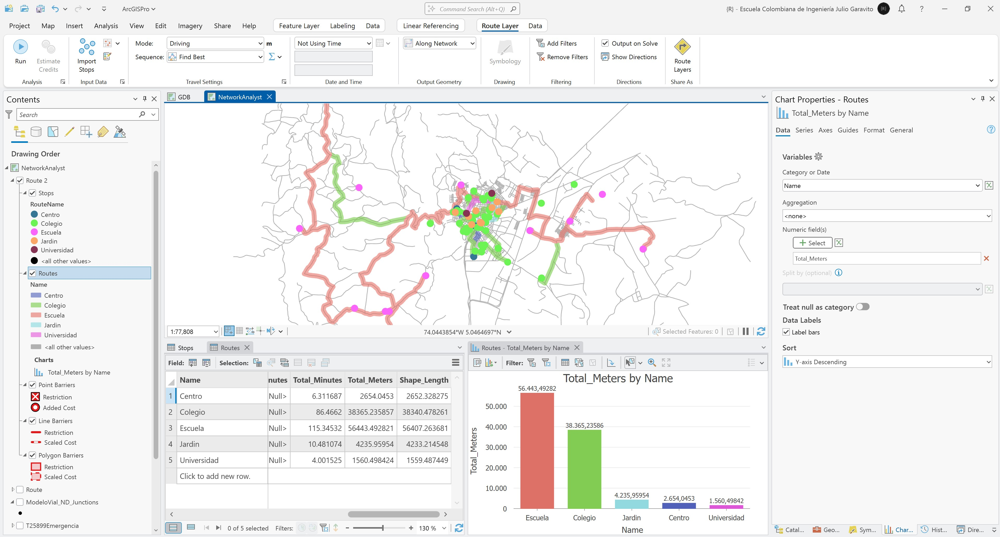

## 3. Simulación de incidentes y restricciones en red

1. Para la ruta anterior por categoría de establecimiento, agregue manualmente un incidente en la coordenada x: 4890174.2372m, y: 2114019.1483999994m. En el panel lateral _Contents_, seleccione _Route 2_ y en el menú _Route Layer / Input Data_, seleccione la opción _Create Features_.  

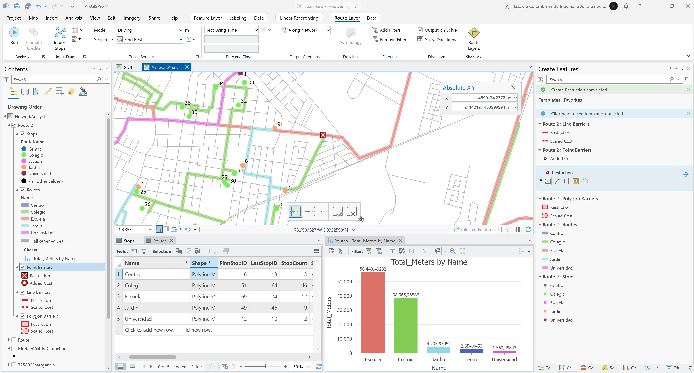

2. Resuelva la red y evalúe los cambios en las distancias recorridas y corredores utilizados. Podrá observar que la ruta de Colegios tuvo una pequeña variación.

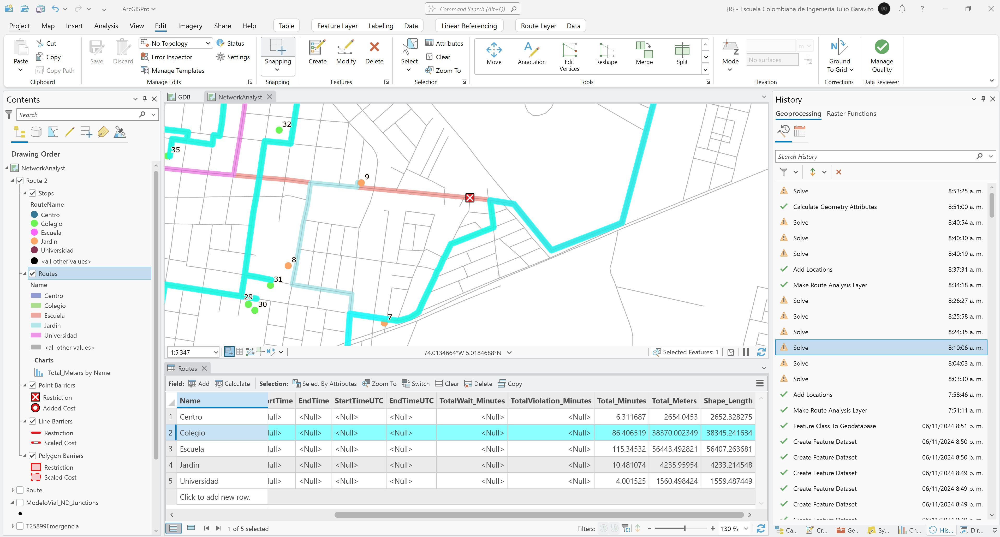

3. Resuelva el recorrido de la red simulando cierre completo en el centro histórico entre las calles 3 y 6 y las carreras 6 y 10. Utilice las siguientes coordenadas para la generación del polígono de restricción vehicular.

| Nodo | CX(m)            | CY(m)           |
|------|------------------|-----------------|
| 1    | 4888861.8813000  | 2112922.9550000 |
| 2    | 4888552.6838000  | 2113139.8007000 |
| 3    | 4888703.8872000  | 2113367.5113000 |
| 4    | 4889038.4363000  | 2113198.6524000 |

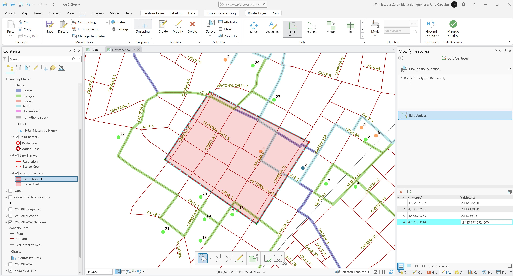

Solucione la red, podrá observar que varias de las rutas han cambiado al igual que los tiempos y distancias recorridas.

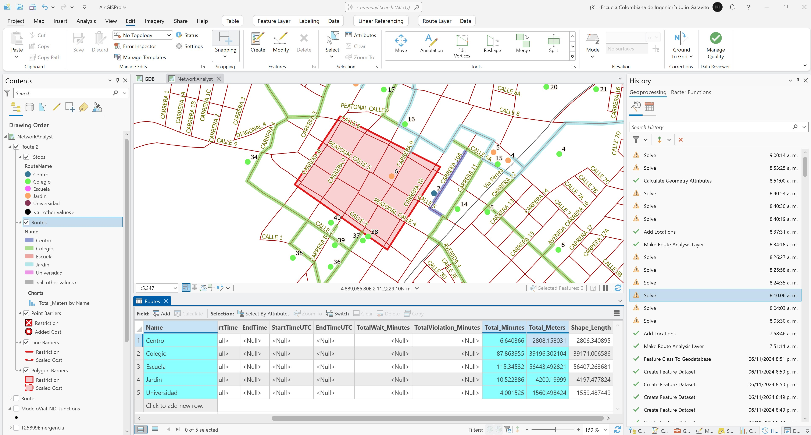

## Elementos requeridos en diccionario de datos

Agregue a la tabla resúmen generada en la actividad [Inventario de información geo-espacial recopilada del POT y diccionario de datos](../POTLayer/Readme.md), las capas generadas en esta actividad que se encuentran listadas a continuación:

| Nombre         | Descripción    | Geometría      | Registros      | 
|----------------|----------------|----------------|----------------| 
| (No requerido) | (No requerido) | (No requerido) | (No requerido) | 

> :bulb:Para funcionarios que se encuentran ensamblando el SIG de su municipio, se recomienda incluir y documentar estas capas en el Diccionario de Datos.

## Actividades de proyecto :triangular_ruler:

En la siguiente tabla se listan las actividades que deben ser desarrolladas y documentadas por cada grupo de proyecto en un único archivo de Adobe Acrobat .pdf. El documento debe incluir portada (indicando el caso de estudio, número de avance, nombre del módulo, fecha de presentación, nombres completos de los integrantes), numeración de páginas, tabla de contenido, lista de tablas, lista de ilustraciones, introducción, objetivo general, capítulos por cada ítem solicitado, conclusiones y referencias bibliográficas.

| Actividad     | Alcance                                                                                                                                                                                                                                                                                                                                                                                                                                             |
|:--------------|:----------------------------------------------------------------------------------------------------------------------------------------------------------------------------------------------------------------------------------------------------------------------------------------------------------------------------------------------------------------------------------------------------------------------------------------------------|
| Avance **P7** | Para su caso de estudio, resuelva rútas optimas para todas las instituciones educativas y por categorías, incluya la simulación de accidentes y restricciones lineales y por áreas.                                                                                                                                                                                                                                                                 | 
| Avance **P7** | Estudio de rutas de transporte público: a partir de los conceptos y habilidades obtenidas en el estudio de rutas de transporte escolar, diseñe y modelo 2 rutas de transporte público en diferentes paraderos establecidos.                                                                                                                                                                                                                         | 
| Avance **P7** | En una tabla y al final del informe de avance de esta entrega, indique el detalle de las sub-actividades realizadas por cada integrante de su grupo. Para actividades que no requieren del desarrollo de elementos de avance, indicar si realizo la lectura de la guía de clase y las lecturas indicadas al inicio en los requerimientos. Utilice las siguientes columnas: Nombre del integrante, Actividades realizadas, Tiempo dedicado en horas. | 

> No es necesario presentar un documento de avance independiente, todos los avances de proyecto de este módulo se integran en un único documento.
> 
> En el informe único, incluya un numeral para esta actividad y sub-numerales para el desarrollo de las diferentes sub-actividades, siguiendo en el mismo orden de desarrollo presentado en esta actividad.

## Referencias

* [ArcGIS Pro - Network Analyst tutorials](https://pro.arcgis.com/en/pro-app/latest/help/analysis/networks/network-analyst-tutorials.htm)
* [ArcGIS Pro - Create a network dataset](https://pro.arcgis.com/en/pro-app/latest/help/analysis/networks/how-to-create-a-usable-network-dataset.htm)

## Control de versiones

| Versión    | Descripción                                                | Autor                                      | Horas |
|------------|:-----------------------------------------------------------|--------------------------------------------|:-----:|
| 2024.04.14 | Versión inicial con alcance de la actividad                | [rcfdtools](https://github.com/rcfdtools)  |   4   |
| 2024.11.10 | Investigación y documentación para caso de estudio general | [rcfdtools](https://github.com/rcfdtools)  |   4   |

_R.SIGE es de uso libre para fines académicos, conoce nuestra licencia, cláusulas, condiciones de uso y como referenciar los contenidos publicados en este repositorio, dando [clic aquí](LICENSE.md)._

_¡Encontraste útil este repositorio!, apoya su difusión marcando este repositorio con una ⭐ o síguenos dando clic en el botón Follow de [rcfdtools](https://github.com/rcfdtools) en GitHub._

| [◄ Anterior](../NADataset/Readme.md) | [:house: Inicio](../../README.md) | [:beginner: Ayuda / Colabora](https://github.com/rcfdtools/R.SIGE/discussions/48) | [Siguiente ►](../NAServiceArea/Readme.md) |
|-----------------------------------------------------|-----------------------------------|-----------------------------------------------------------------------------------|---------------------------------------------------------|

[^1]: 