# Network Analyst - Estudio de áreas de servicio para atención de emergencias y costos
Keywords: `service-area` `rings` `facilities` `od_matrix_cost` `closest-facility`

Realice un análisis de áreas de servicio por anillos alejándose del centro de atención para impedancias de 1, 3, 5 minutos. Defina como tolerancia de búsqueda 500 metros, active las restricciones y permita giros en U. Indique el total de las áreas cubiertas en hectáreas y qué zonas no han sido cubiertas. Realice el mismo análisis simulando un accidente en una coordenada específica, compare las áreas de cobertura con las obtenidas anteriormente. En 3 localizaciones, se han producido incidentes que requieren atención de emergencias, resuelva la red indicando cuál es el centro de atención más cercano y cuáles pueden ser atendidos en menos de 5 minutos. Indique los tiempos y distancias recorridas desde el centro de atención hasta el lugar del incidente. Cree un análisis de matriz de costos OD, establezca como origen los centros de atención de emergencia y como destino las instituciones educativas.

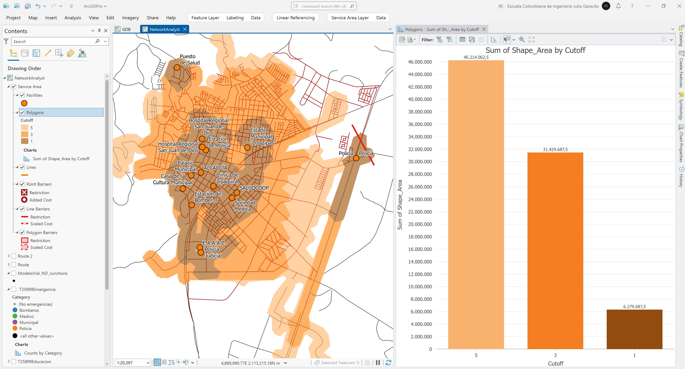

## Objetivos

* Estudiar áreas de servicio
* Realizar análisis de cobertura de áreas de servicio
* Obtener el centro de atención de emergencia más cercano para atención de incidentes
* Crear y evaluar matrices de costos origen- destino

## Requerimientos

* [:mortar_board:Actividad](../NADataset/Readme.md): Creación y configuración del network dataset.
* [:toolbox:Herramienta](https://www.esri.com/en-us/arcgis/products/arcgis-pro/overview): ESRI ArcGIS Pro 3.3.1 o superior.

## 1. Estudio de áreas de servicio

Realice un análisis de áreas de servicio por anillos alejándose del centro de atención de emergencias y analice sus coberturas.

1. Abra el proyecto de ArcGIS Pro y el mapa _NetworkAnalyst_ creado previamente, en contents verifique que esté cargado el Network Dataset y la clase de entidad `T25899Emergencia`. Filtre los centros correspondientes a puntos de atención de emergencias.

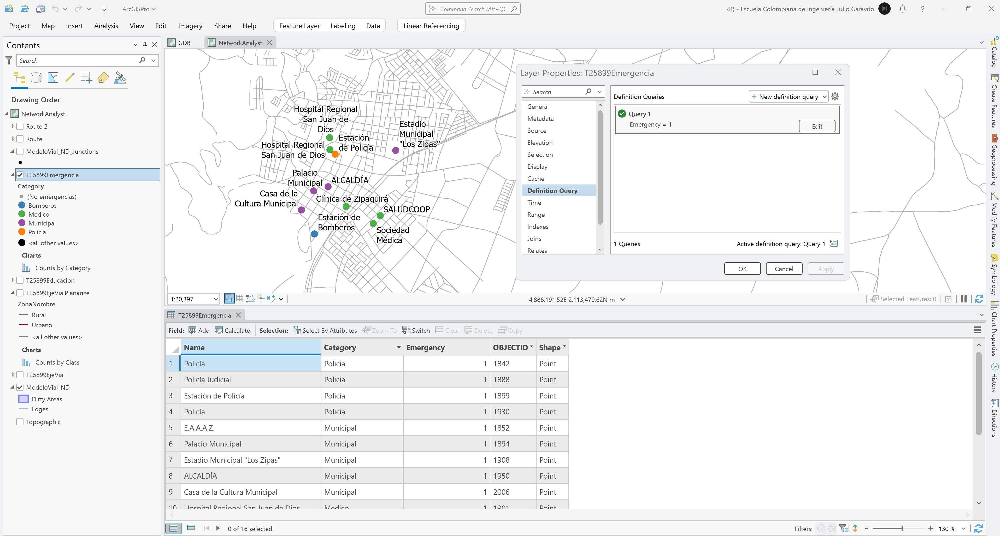

2. En el panel lateral _Contents_, seleccione el _Network Dataset_ `ModeloVial_ND` y en el menú superior _Network Dataset Layer - Data_, seleccione la opción _Network Analysis - Data / Service Area_.

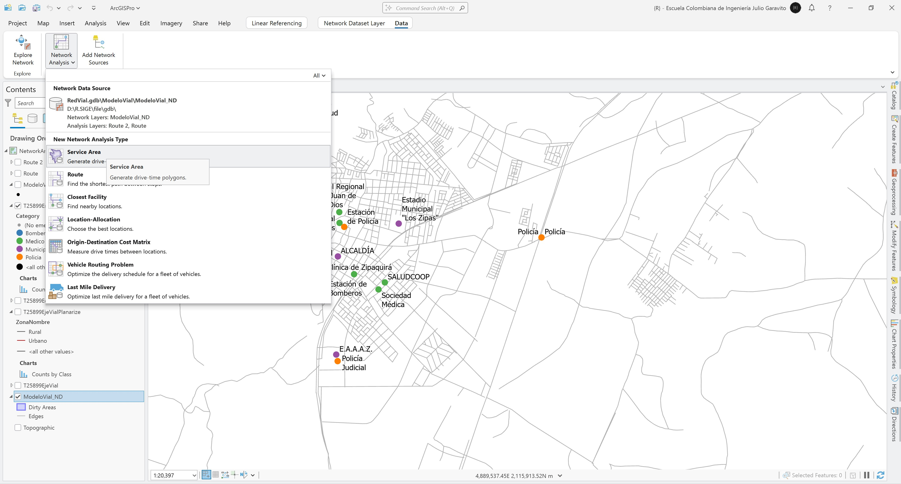

3. En el grupo _Service Area_ mostrado en el panel lateral _Contents_, seleccione _Facilities_, luego en el menú superior _Service Area Layer_ importe las instalaciones desde la pestaña _Imput Data / Import Facilities_. En la ventana de configuración, seleccione la capa _T25899Emergencia_ y establezca la tolerancia de búsqueda en 500 metros. Rotule por nombre de punto de emergencia.

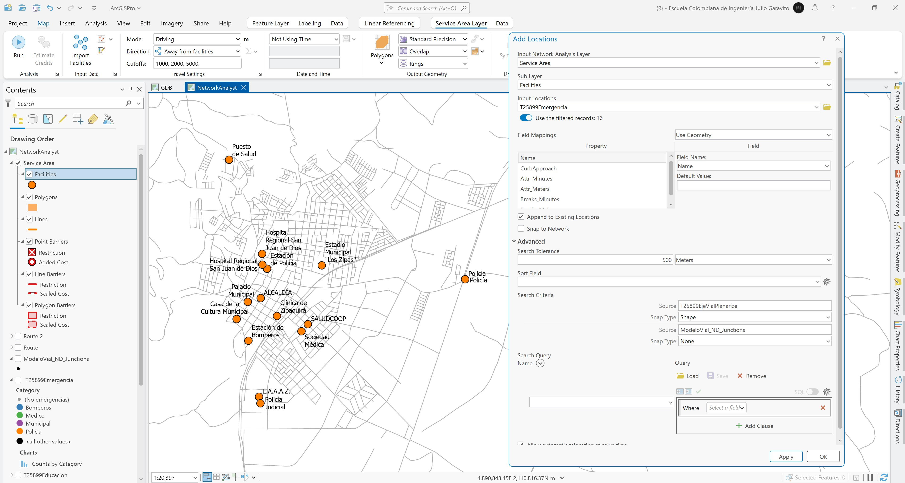

4. En el expansor de la pestaña _Travel Settings_, defina en costos impedancias en función del tiempo en minutos y desactive la restricción de giros en U y la jerarquía.

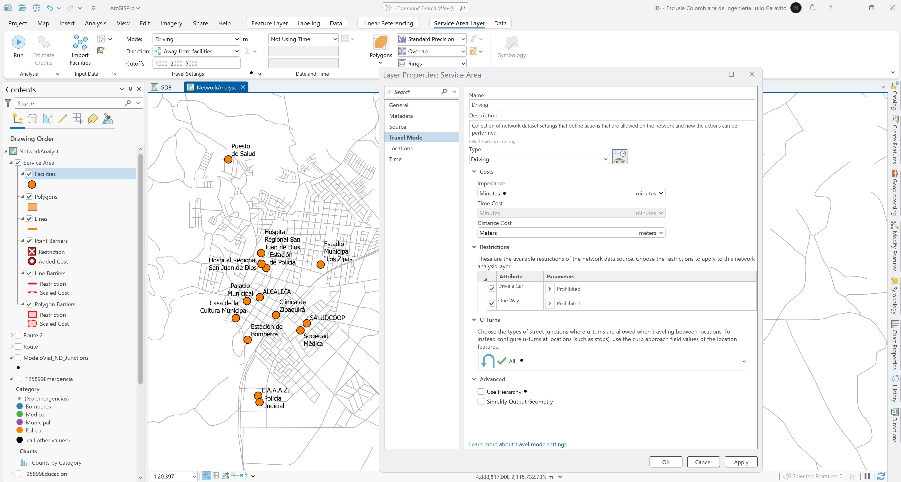

5. En la pestaña _Travel Settings_, defina cortes o _Cutoffs_ en 1, 3 y 5 minutos alejándose del centro de atención de emergencias y de clic en resolver o _Run_. Podrá observar que casi toda el área urbana puede ser atendida en los tiempos establecidos. Para una mejor representación, desde la simbología remueva los contornos de los polígonos de áreas de servicio. Desde la tabla de atributos podrá seleccionar cualquiera de los puntos de atención y la cobertura por atención para cada tiempo.

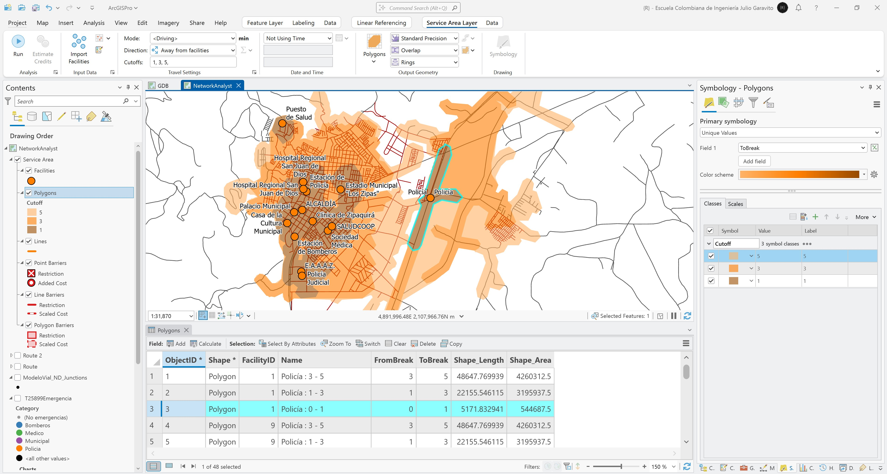

6. Para resolver áreas de servicio incluyendo incidentes, incluya un cierre vehicular a lo largo de las siguientes coordenadas:

| Nodo | CX(m)        | CY(m)              |
|------|--------------|--------------------|
| 1    | 4891436.0648 | 2113342.3385000005 |
| 2    | 4891110.0199 | 2113940.2716000006 |

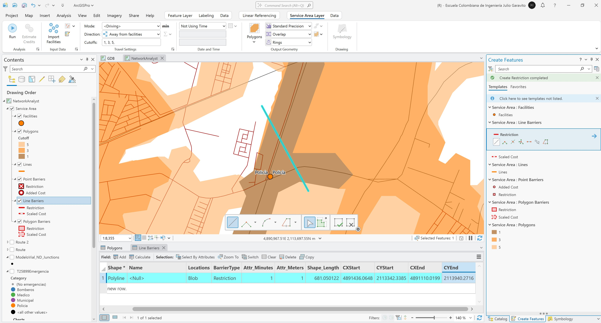

7. Resuelva la red y analice las áreas de coberturas. Podrá observar que en la zona oeste ya no pueden ser atendidas emergencias en los tiempos establecidos.

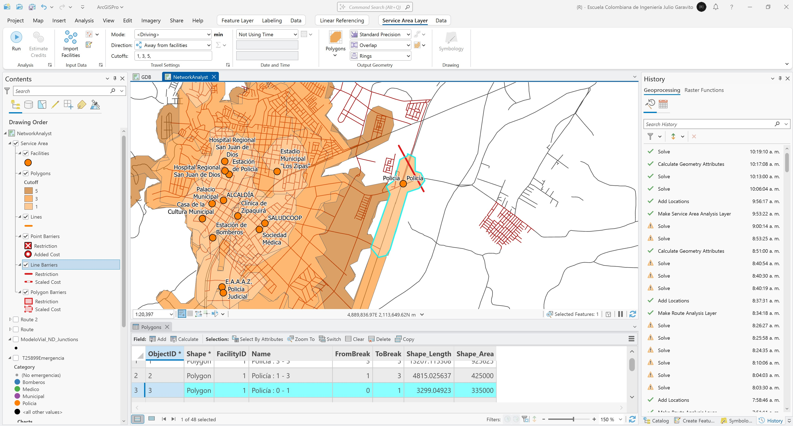

Cree una gráfica de análisis totalizando las áreas cubiertas para cada tiempo resuelto.

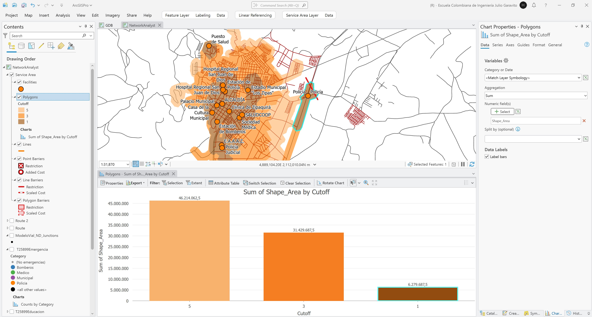

## 2. Estudio centro de atención más cercano para atención de incidentes

En las siguientes 3 localizaciones, se han producido incidentes que requieren atención de emergencias, resuelva la red indicando cuál es el centro de atención más cercano y cuáles pueden ser atendidos en menos de 5 minutos. Indique los tiempos y distancias recorridas desde el centro de atención hasta el lugar del incidente.

| Localización | CX(m)       | CY(m)       |
|--------------|-------------|-------------|
| 1            | 4889782.448 | 2114328.889 |
| 2            | 4888182.875 | 2113572.618 |
| 3            | 4890313.638 | 2112615.276 |

1. En el panel lateral _Contents_, seleccione el _Network Dataset_ `ModeloVial_ND` y en el menú superior _Network Dataset Layer - Data_, seleccione la opción _Network Analysis - Data / Closest Facility_.

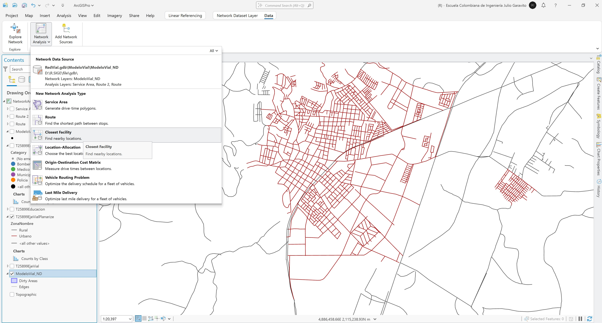

2. En el panel lateral _Contents_, seleccione _Facilities_ en el grupo _Closest Facility_ y desde el menú superior _Closest Facility Layer_ seleccione la opción _Import Facilities_. En la ventana de importación, seleccione _T25899Emergencia_ en _Input Locations_ y establezca tolerancias de búsqueda en 500 metros.

> En el numeral anterior filtramos de_T25899Emergencia_ los nodos correspondientes a centros de atención de emergencias.

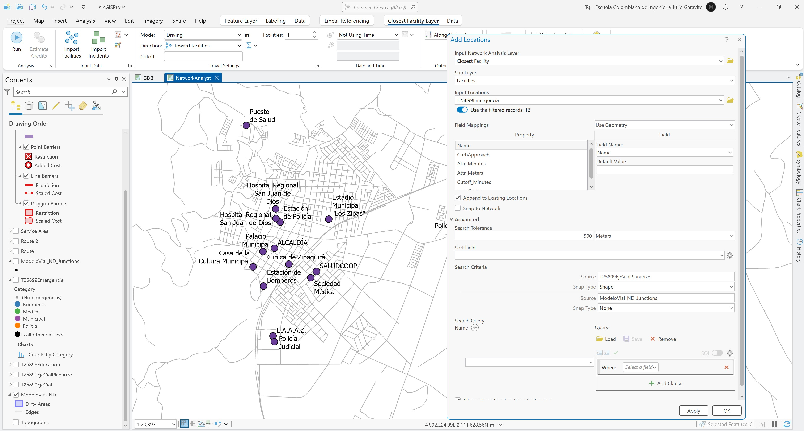

3. Utilizando el editor de entidades, cree en _Incidents_ las 3 localizaciones indicadas. Manualmente, nombre como _Incidente 1_, _Incidente 2_ e _Incidente 3_.

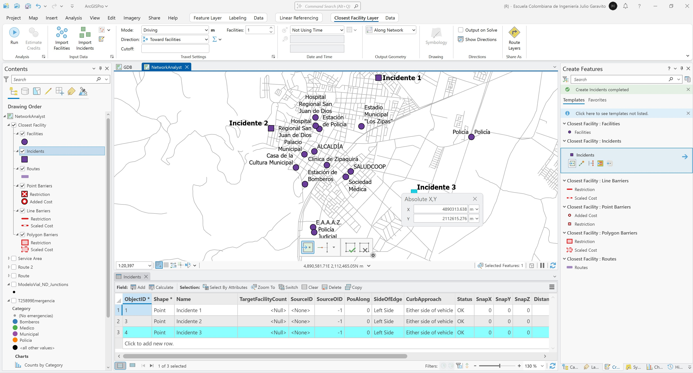

4. Resuelva la red definiendo en _Travel Settings_ costos por tiempo para corte en menos de 5 minutos y atención desde un único centro de atención de emergencias.

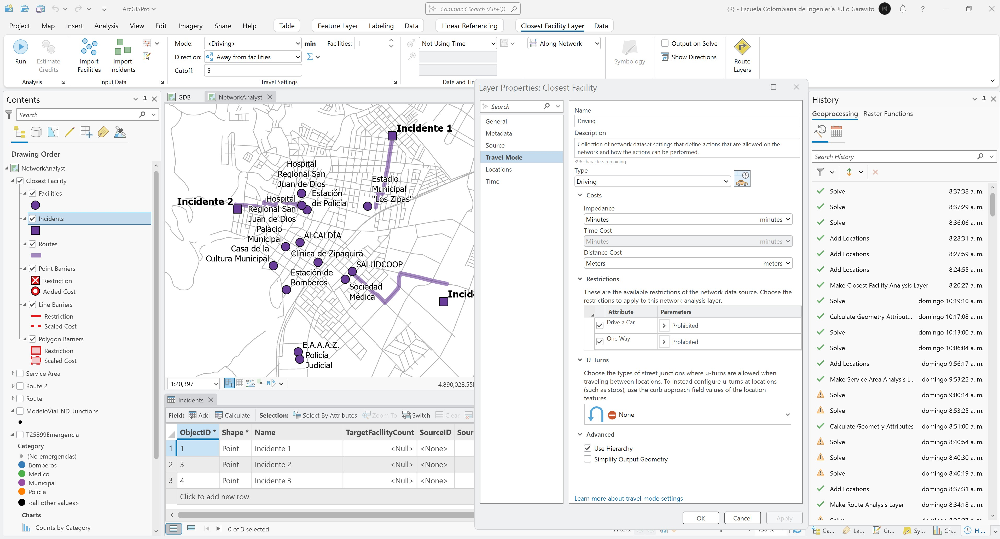

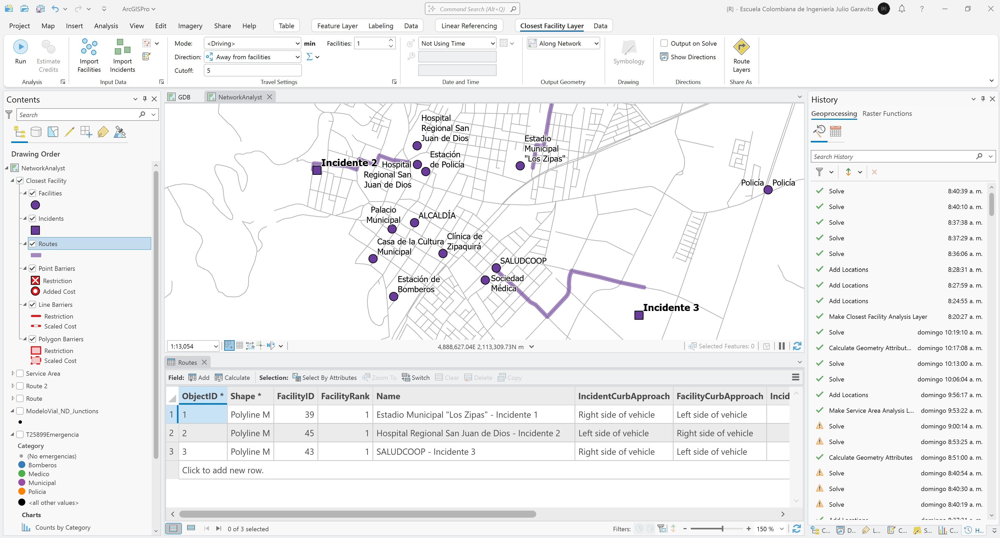

5. Resuelva la red con los dos centros de atención de emergencias más cercanos a cada incidente.

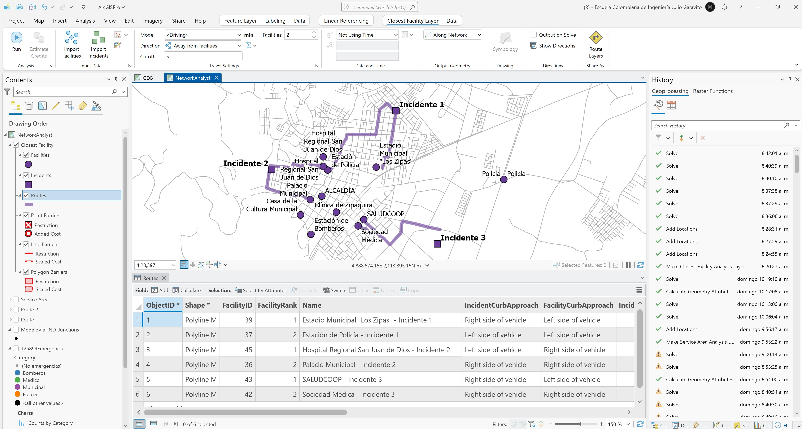

## 3. Matriz de costos Origen a Destino

Cree un análisis de matriz de costos OD, establezca como origen los centros de atención de emergencia y como destino las instituciones educativas. Defina 1000 metros como radio de búsqueda, active las restricciones definidas anteriormente y resuelva para impedancias menores o iguales a 5 minutos para máximo 5 destinaciones por centro de emergencia. Indique cuáles instituciones pueden ser atendidas y cree un gráfico de análisis de los resultados obtenidos.

1. En el panel lateral _Contents_, seleccione el _Network Dataset_ `ModeloVial_ND` y en el menú superior _Network Dataset Layer - Data_, seleccione la opción _Network Analysis - Data / Origin-Destination Cost Matrix_.

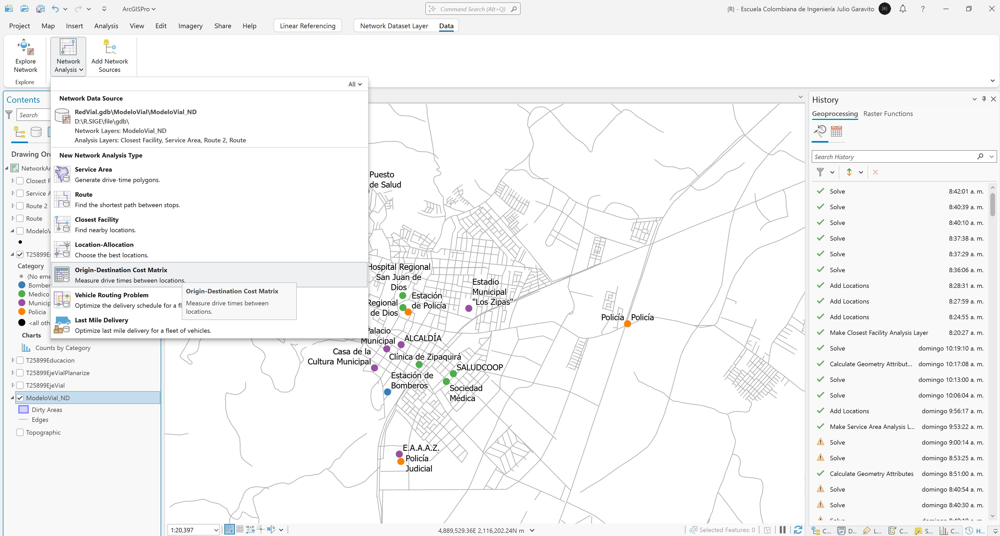

2. En el panel lateral _Contents_, seleccione _Origins_ en el grupo _OD Cost Matrix_ y desde el menú superior _OD Cost Matrix Layer_ seleccione la opción _Import Origins_. En la ventana de importación, seleccione _T25899Emergencia_ en _Input Locations_ y establezca tolerancias de búsqueda en 1000 metros.

> Previamente, filtramos de_T25899Emergencia_ los nodos correspondientes a centros de atención de emergencias.

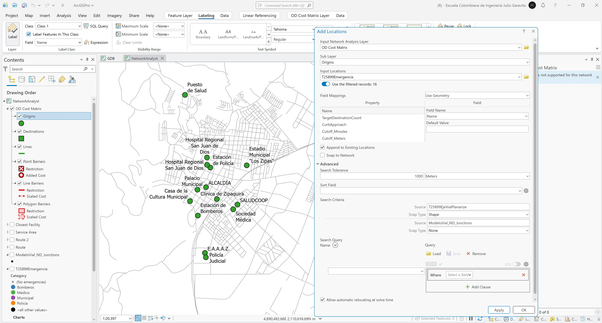

3. En el panel lateral _Contents_, seleccione _Destinations_ en el grupo _OD Cost Matrix_ y desde el menú superior _OD Cost Matrix Layer_ seleccione la opción _Import Destinations_. En la ventana de importación, seleccione _T25899Educacion_ en _Input Locations_ y establezca tolerancias de búsqueda en 1000 metros.

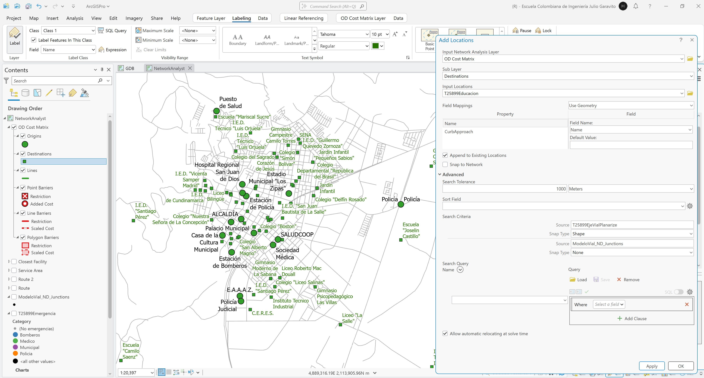

4. Resuelva la matriz de costos para impedancias menores o iguales a 5 minutos para máximo 5 destinaciones por centro de emergencia.

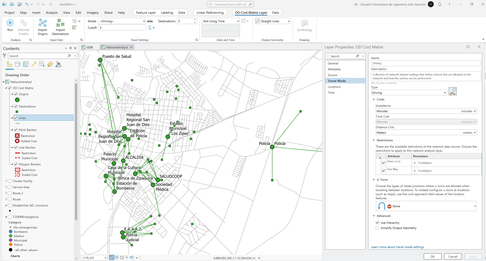

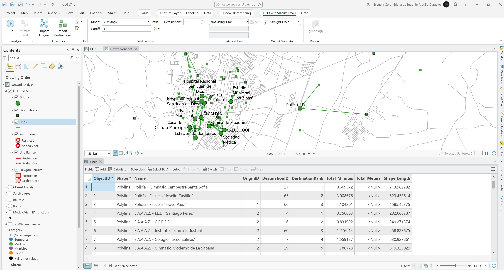

5. Rotule las líneas conectoras con la expresión: `"(" + $feature.DestinationRank + ") "+ Round($feature.Total_Minutes, 2) + 'min'`

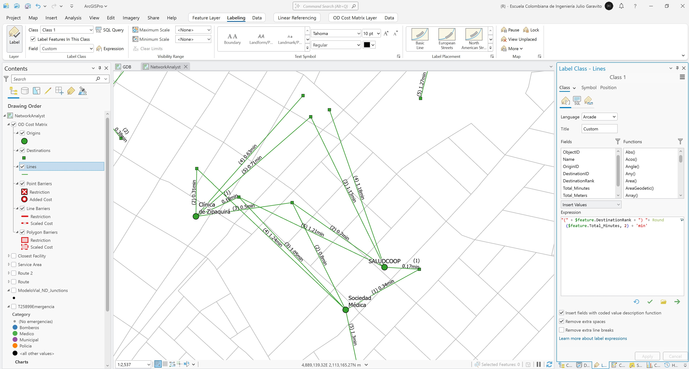

6. Cree un gráfico de análisis de los resultados obtenidos.

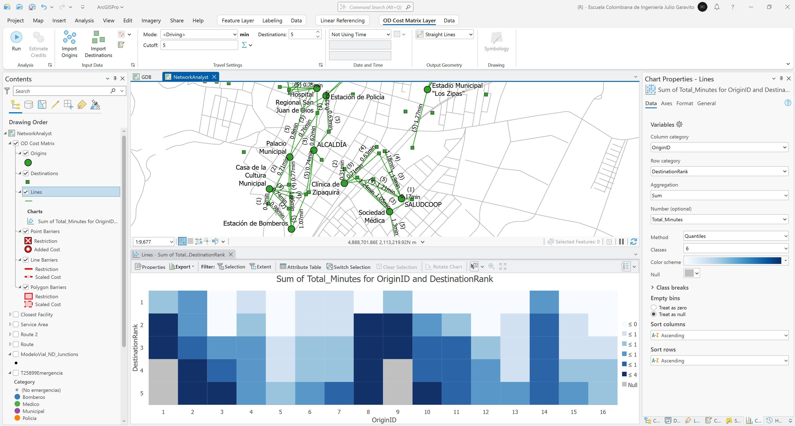

## Elementos requeridos en diccionario de datos

Agregue a la tabla resúmen generada en la actividad [Inventario de información geo-espacial recopilada del POT y diccionario de datos](../POTLayer/Readme.md), las capas generadas en esta actividad que se encuentran listadas a continuación:

| Nombre         | Descripción    | Geometría      | Registros      | 
|----------------|----------------|----------------|----------------| 
| (No requerido) | (No requerido) | (No requerido) | (No requerido) | 

> :bulb:Para funcionarios que se encuentran ensamblando el SIG de su municipio, se recomienda incluir y documentar estas capas en el Diccionario de Datos.

## Actividades de proyecto :triangular_ruler:

En la siguiente tabla se listan las actividades que deben ser desarrolladas y documentadas por cada grupo de proyecto en un único archivo de Adobe Acrobat .pdf. El documento debe incluir portada (indicando el caso de estudio, número de avance, nombre del módulo, fecha de presentación, nombres completos de los integrantes), numeración de páginas, tabla de contenido, lista de tablas, lista de ilustraciones, introducción, objetivo general, capítulos por cada ítem solicitado, conclusiones y referencias bibliográficas.

| Actividad     | Alcance                                                                                                                                                                                                                                                                                                                                                                                                                                                                                                                                            |
|:--------------|:---------------------------------------------------------------------------------------------------------------------------------------------------------------------------------------------------------------------------------------------------------------------------------------------------------------------------------------------------------------------------------------------------------------------------------------------------------------------------------------------------------------------------------------------------|
| Avance **P7** | Para su caso de estudio, resuelva areas de servicio, equipamientos cercanos y matriz de costos.                                                                                                                                                                                                                                                                                                                                                                                                                                                    | 
| Avance **P7** | TransCAD (investigación aplicada): A. Investigue qué es y como funciona el software TransCAD, B.Cree un ejemplo aplicado que permita modelar y optimizar los recorridos de las rutas de transporte escolar del Municipio de Zipaquirá, C. Compare los tiempos y distancias obtenidas por tipo de ruta escolar con las obtenidas utiizando ArcGIS Pro, D. En el informe técnico incluya capturas de pantalla con el paso a paso realizado para la construcción de la red vial, su configuración detallada, mapas y tablas detalladas de resultados. | 
| Avance **P7** | En una tabla y al final del informe de avance de esta entrega, indique el detalle de las sub-actividades realizadas por cada integrante de su grupo. Para actividades que no requieren del desarrollo de elementos de avance, indicar si realizo la lectura de la guía de clase y las lecturas indicadas al inicio en los requerimientos. Utilice las siguientes columnas: Nombre del integrante, Actividades realizadas, Tiempo dedicado en horas.                                                                                                | 

> No es necesario presentar un documento de avance independiente, todos los avances de proyecto de este módulo se integran en un único documento.
> 
> En el informe único, incluya un numeral para esta actividad y sub-numerales para el desarrollo de las diferentes sub-actividades, siguiendo en el mismo orden de desarrollo presentado en esta actividad.

## Referencias

* [ArcGIS Pro - Network Analyst tutorials](https://pro.arcgis.com/en/pro-app/latest/help/analysis/networks/network-analyst-tutorials.htm)
* [ArcGIS Pro - Create a network dataset](https://pro.arcgis.com/en/pro-app/latest/help/analysis/networks/how-to-create-a-usable-network-dataset.htm)

## Control de versiones

| Versión    | Descripción                                                | Autor                                      | Horas |
|------------|:-----------------------------------------------------------|--------------------------------------------|:-----:|
| 2024.04.14 | Versión inicial con alcance de la actividad                | [rcfdtools](https://github.com/rcfdtools)  |   4   |
| 2024.11.10 | Investigación y documentación para caso de estudio general | [rcfdtools](https://github.com/rcfdtools)  |   4   |

_R.SIGE es de uso libre para fines académicos, conoce nuestra licencia, cláusulas, condiciones de uso y como referenciar los contenidos publicados en este repositorio, dando [clic aquí](LICENSE.md)._

_¡Encontraste útil este repositorio!, apoya su difusión marcando este repositorio con una ⭐ o síguenos dando clic en el botón Follow de [rcfdtools](https://github.com/rcfdtools) en GitHub._

| [:arrow_backward: Anterior](../NADataset/Readme.md) | [:house: Inicio](../../README.md) | [:beginner: Ayuda / Colabora](https://github.com/rcfdtools/R.SIGE/discussions/48) | [Siguiente :arrow_forward:]() |
|-----------------------------------------------------|-----------------------------------|-----------------------------------------------------------------------------------|-------------------------------|

[^1]: 