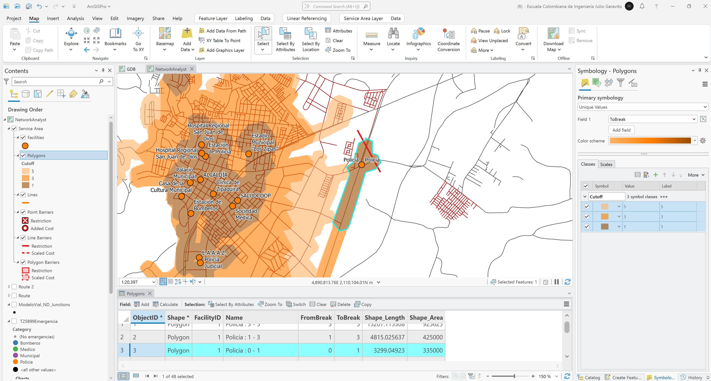

# Network Analyst - Estudio de áreas de servicio para atención de emergencias y costos
Keywords: `service-area` `rings` `facilities`

Realice un análisis de áreas de servicio por anillos alejándose del centro de atención para impedancias de 1, 3, 5 minutos. Defina como tolerancia de búsqueda 500 metros, active las restricciones y permita giros en U. Indique el total de las áreas cubiertas en hectáreas y que zonas no han sido cubiertas. Realice el mismo análisis simulando un accidente en una coordenada específica, compare las áreas de cobertura con las obtenidas anteriormente 

## Objetivos

* Estudiar áreas de servicio
* Realizar análisis de cobertura de áreas de servicio

## Requerimientos

* [:mortar_board:Actividad](../NADataset/Readme.md): Creación y configuración del network dataset.
* [:toolbox:Herramienta](https://www.esri.com/en-us/arcgis/products/arcgis-pro/overview): ESRI ArcGIS Pro 3.3.1 o superior.

## 1. Estudio de áreas de servicio

Realice un análisis de áreas de servicio por anillos alejándose del centro de atención de emergencias y analice sus coberturas.

1. Abra el proyecto de ArcGIS Pro y el mapa _NetworkAnalyst_ creado previamente, en contents verifique que esté cargado el Network Dataset y la clase de entidad `T25899Emergencia`. Filtre los centros correspondientes a puntos de atención de emergencias.

2. En el panel lateral _Contents_, seleccione el _Network Dataset_ `ModeloVial_ND` y en el menú superior _Network Dataset Layer - Data_, seleccione la opción _Network Analysis - Data / Service Area_.

3. En el grupo _Service Area_ mostrado en el panel lateral _Contents_, seleccione _Facilities_, luego en el menú superior _Service Area Layer_ importe las instalaciones desde la pestaña _Imput Data / Import Facilities_. En la ventana de configuración, seleccione la capa _T25899Emergencia_ y establezca la tolerancia de búsqueda en 500 metros. Rotule por nombre de punto de emergencia.

4. En el expansor de la pestaña _Travel Settings_, defina en costos impedancias en función del tiempo en minutos y desactive la restricción de giros en U y la jerarquía.

5. En la pestaña _Travel Settings_, defina cortes o _Cutoffs_ en 1, 3 y 5 minutos alejándose del centro de atención de emergencias y de clic en resolver o _Run_. Podrá observar que casi toda el área urbana puede ser atendida en los tiempos establecidos. Para una mejor representación, desde la simbología remueva los contornos de los polígonos de áreas de servicio. Desde la tabla de atributos podrá seleccionar cualquiera de los puntos de atención y la cobertura por atención para cada tiempo.

6. Para resolver áreas de servicio incluyendo incidentes, incluya un cierre vehicular a lo largo de las siguientes coordenadas:

| Nodo | CX(m)        | CY(m)              |
|------|--------------|--------------------|
| 1    | 4891436.0648 | 2113342.3385000005 |
| 2    | 4891110.0199 | 2113940.2716000006 |

7. Resuelva la red y analice las áreas de coberturas. Podrá observar que en la zona oeste ya no pueden ser atendidas emergencias en los tiempos establecidos.

## Elementos requeridos en diccionario de datos

Agregue a la tabla resúmen generada en la actividad [Inventario de información geo-espacial recopilada del POT y diccionario de datos](../POTLayer/Readme.md), las capas generadas en esta actividad que se encuentran listadas a continuación:

| Nombre         | Descripción    | Geometría      | Registros      | 
|----------------|----------------|----------------|----------------| 
| (No requerido) | (No requerido) | (No requerido) | (No requerido) | 

> :bulb:Para funcionarios que se encuentran ensamblando el SIG de su municipio, se recomienda incluir y documentar estas capas en el Diccionario de Datos.

## Actividades de proyecto :triangular_ruler:

En la siguiente tabla se listan las actividades que deben ser desarrolladas y documentadas por cada grupo de proyecto en un único archivo de Adobe Acrobat .pdf. El documento debe incluir portada (indicando el caso de estudio, número de avance, nombre del módulo, fecha de presentación, nombres completos de los integrantes), numeración de páginas, tabla de contenido, lista de tablas, lista de ilustraciones, introducción, objetivo general, capítulos por cada ítem solicitado, conclusiones y referencias bibliográficas.

| Actividad     | Alcance                                                                                                                                                                                                                                                                                                                                                                                                                                             |
|:--------------|:----------------------------------------------------------------------------------------------------------------------------------------------------------------------------------------------------------------------------------------------------------------------------------------------------------------------------------------------------------------------------------------------------------------------------------------------------|
| Avance **P7** | Para su caso de estudio, resuelva rútas optimas para todas las instituciones educativas y por categorías, incluya la simulación de accidentes y restricciones lineales y por áreas.                                                                                                                                                                                                                                                                 | 
| Avance **P7** | Estudio de rutas de transporte público: a partir de los conceptos y habilidades obtenidas en el estudio de rutas de transporte escolar, diseñe y modelo 2 rutas de transporte público en diferentes paraderos establecidos.                                                                                                                                                                                                                         | 
| Avance **P7** | En una tabla y al final del informe de avance de esta entrega, indique el detalle de las sub-actividades realizadas por cada integrante de su grupo. Para actividades que no requieren del desarrollo de elementos de avance, indicar si realizo la lectura de la guía de clase y las lecturas indicadas al inicio en los requerimientos. Utilice las siguientes columnas: Nombre del integrante, Actividades realizadas, Tiempo dedicado en horas. | 

> No es necesario presentar un documento de avance independiente, todos los avances de proyecto de este módulo se integran en un único documento.
> 
> En el informe único, incluya un numeral para esta actividad y sub-numerales para el desarrollo de las diferentes sub-actividades, siguiendo en el mismo orden de desarrollo presentado en esta actividad.

## Referencias

* [ArcGIS Pro - Network Analyst tutorials](https://pro.arcgis.com/en/pro-app/latest/help/analysis/networks/network-analyst-tutorials.htm)
* [ArcGIS Pro - Create a network dataset](https://pro.arcgis.com/en/pro-app/latest/help/analysis/networks/how-to-create-a-usable-network-dataset.htm)

## Control de versiones

| Versión    | Descripción                                                | Autor                                      | Horas |
|------------|:-----------------------------------------------------------|--------------------------------------------|:-----:|
| 2024.04.14 | Versión inicial con alcance de la actividad                | [rcfdtools](https://github.com/rcfdtools)  |   4   |
| 2024.11.10 | Investigación y documentación para caso de estudio general | [rcfdtools](https://github.com/rcfdtools)  |   4   |

_R.SIGE es de uso libre para fines académicos, conoce nuestra licencia, cláusulas, condiciones de uso y como referenciar los contenidos publicados en este repositorio, dando [clic aquí](LICENSE.md)._

_¡Encontraste útil este repositorio!, apoya su difusión marcando este repositorio con una ⭐ o síguenos dando clic en el botón Follow de [rcfdtools](https://github.com/rcfdtools) en GitHub._

| [:arrow_backward: Anterior](../NADataset/Readme.md) | [:house: Inicio](../../README.md) | [:beginner: Ayuda / Colabora](https://github.com/rcfdtools/R.SIGE/discussions/48) | [Siguiente :arrow_forward:]() |
|-----------------------------------------------------|-----------------------------------|-----------------------------------------------------------------------------------|-------------------------------|

[^1]: 