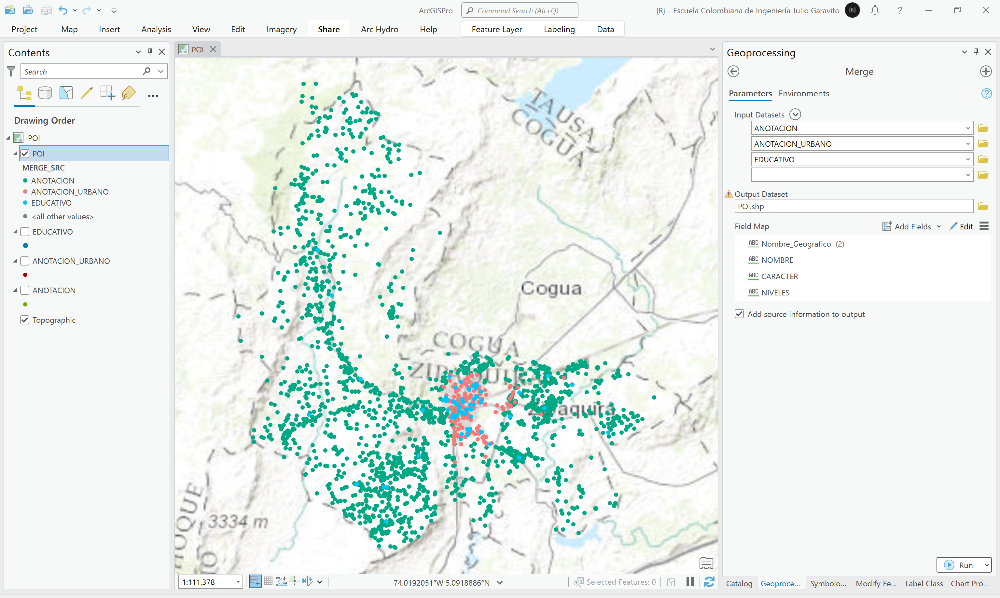

# Estudio de localización de equipamientos y puntos de interés - POI
Keywords: `poi` `point-of-interest` `facilities`

Utilizando la capa vial y la localización de los diferentes equipamientos, realice un análisis de proximidad para identificar la vía más próxima y cree un buffer de proximidad por categoría.

## Objetivos

* Identificar la vía más próxima a los equipamientos municipales.
* Identificar áreas de cobertura por equipamiento a partir de tiempos de desplazamiento.

## Requerimientos

* [:mortar_board:Actividad](../POTLayer/Readme.md): Inventario de información geo-espacial recopilada del POT y diccionario de datos.
* [:toolbox:Herramienta](https://www.esri.com/en-us/arcgis/products/arcgis-pro/overview): ESRI ArcGIS Pro 3.3.1 o superior.
* [:toolbox:Herramienta](https://qgis.org/): QGIS 3.38 o superior.

## 1. Integración y homologación de nodos

1. Abra el proyecto de ArcGIS Pro, creado previamente y desde el menú _Insert_ cree un nuevo mapa _New Map_, renombre como _POI_ y establezca el CRS 9377. Agregue al mapa las capas _ANOTACION, ANOTACION_URBANO, EDUCATIVO_ disponibles en la ruta `\file\data\POT\Anexo_Acuerdo_012_2013\gdb\25899.gdb`.

2. Utilizando la herramienta de geo-procesamiento _Data Management Tools / Merge_, integre las 3 capas de puntos en una única capa, nombre como `\file\data\shp\POI.shp` y utilice el CRS 9377. Asegúrese de marcar la casilla _Add source information to output_ para incluir el nombre de cada capa fuente en la nueva capa integrada y no incluya el campo `CODIGO_USO_EDIFICACION`. Simbolice por valores únicos utilizando el campo `MERGE_SRC`.

3. Abra la tabla de atributos y utilizando la herramienta de selección por atributos, seleccione todos los POI con `NOMBRE` vacío.

4. Utilizando el calculador de campo y para solo los puntos seleccionados, asigne al campo `NOMBRE`, los valores contenidos en el campo `Nombre_Geo`. Esta acción se realizará sobre 1925 puntos.

5. Seleccione y elimine los POI que no tienen `NOMBRE` y `Nombre_Geo` definido. Esta acción eliminará 1668 puntos que no tienen información descriptiva y en la capa obtendremos 415 elementos.

Luego de eliminados los nodos, guarde los cambios realizados en la capa y elimine el campo `Nombre_Geo`.

## 2. Análisis de proximidad POI a Vía

1. Agregue al mapa la capa vías municipales creada en la actividad [Análisis estadístico de la red vial](../RoadSummary/Readme.md), desde la ruta `\file\data\shp\Red_vial.shp`, ajuste la simbología a valores únicos representando el campo de atributos `ORDEN_VIAL` y rotule a partir del nombre de la vía. Opcionalmente, puede rotular los POI usando su nombre.

2. Utilizando la herramienta de geo-procesamiento _Analysis Tools / Proximity / Near_, agregué a la capa de puntos de interés POI, los atributos de proximidad a la vía más cercana. Esta herramienta no crea una nueva capa, únicamente agrega atributos adicionales a la tabla.

Como observa, se han agregado los siguientes atributos:

* NEAR_FID: identificador de objeto espacial de la vía.
* NEAR_DIST: distancia en las unidades de distancia seleccionadas.
* NEAR_X: coordenada de localización X del punto próximo sobre la vía. 
* NEAR_Y: coordenada de localización Y del punto próximo sobre la vía.
* NEAR_ANGLE: ángulo de inclinación de la línea imaginaria de proximidad.

3. Para verificar la localización de las coordenadas de proximidad, en el menú _Map_, seleccione la herramienta _Go To XY_ e ingrese las coordenadas de uno de los puntos. Por ejemplo, para el POI identificado como _Cerro la Peña_, la vía más próxima se encuentra a 354.47 metros de distancia.

> En ArcGIS Pro, la herramienta _Analysis / Generate Origin-Destination Links_ permite generar las líneas conectoras desde el POI a la vía más cercana, sin embargo, en actualizaciones recientes, las líneas conectoras no se dibujan perpendiculares a la vía o sin dibujadas hasta su centroide.

## 3. Creación de líneas conectoras y cálculo de desplazamiento

1. En la tabla de atributos de la capa POI, cree los campos numéricos dobles CX y CY, calcule sus valores geométricos utilizando la herramienta cálculo de geometría.

2. Utilizando la herramienta de geo-procesamiento _Data Management Tools / XY To Line_, cree líneas conectoras entre las coordenadas del punto y las coordenadas del punto de proximidad de vía, nombre la capa como `\file\data\shp\POI_OD_Vial.shp` y simbolice utilizando flechas direccionales hacia el final.

3. Calcule el tiempo de desplazamiento caminando desde cada POI a la vía más cercana, suponga que la población tiene una edad promedio de 35 años y utilice como referencia las velocidades presentadas en la siguiente tabla[^1]:

|  Edad  |  Velocidad (km/h)   |  Velocidad (mph)   |
|:------:|:-------------------:|:------------------:|
|  < 30  |        4.82         |         3          |
| 30–39  |        4.54         |        2.8         |
| 40–49  |        4.54         |        2.8         |
| 50–59  |        4.43         |        2.75        |
| 60–64  |        4.34         |        2.7         |
|  >65   |        3.42         |        2.1         |

Para el caso de estudio, la velocidad a emplear es de 4.54 km/h.

En la tabla de atributos de la capa de líneas de proximidad, cree dos campos de atributos numéricos dobles con los nombres `LGm` y `Tmin`, correspondientes a la longitud geodésica de la línea y el tiempo de desplazamiento caminando en minutos. Utilice el calculador de geometría de campo para obtener la longitud y calcule el tiempo con la siguiente expresión:

Tmin = `((!LGm!/1000)/4.54)*60`

> La distancia se ha convertido de metros a kilómetros dividiendo por 1000, y el tiempo obtenido se ha convertido en minutos al multiplicar por 60.

Rotule la línea de proximidad incluyendo la distancia y el tiempo.

Rótulo Arcade: `"d (m): "+ ROund($feature.LGm, 2) +  textformatting.NewLine + "t (min): " + Round($feature.Tmin, 1)`

## 4. Cobertura geográfica por POI

1. 

## 2. Análisis usando software libre - QGIS

Para el desarrollo de las actividades desarrolladas en esta clase, se pueden utilizar en QGIS las siguientes herramientas o geo-procesos:

| Proceso                                                                                                         | Procedimiento                                                                                                                                                                                                                                   |
|:----------------------------------------------------------------------------------------------------------------|:------------------------------------------------------------------------------------------------------------------------------------------------------------------------------------------------------------------------------------------------|
| Simbología                                                                                                      | Modificable desde las propiedades de la capa en la pestaña _Symbology_.                                                                                                                                                                         |
| Rotulado                                                                                                        | Modificable desde las propiedades de la capa en la pestaña _Labels_.                                                                                                                                                                            |

Ejemplo rótulo en QGIS: `'A(ha): ' ||  round("AGha", 2) || '\n' || 'P (m): ' ||  round("PGm", 2) `

[:notebook:QGIS training manual](https://docs.qgis.org/3.34/en/docs/training_manual/)

## Elementos requeridos en diccionario de datos

Agregue a la tabla resúmen generada en la actividad [Inventario de información geo-espacial recopilada del POT y diccionario de datos](../POTLayer/Readme.md), las capas generadas en esta actividad que se encuentran listadas a continuación:

| Nombre                           | Descripción                                                                                                                  | Geometría   | Registros | 
|----------------------------------|------------------------------------------------------------------------------------------------------------------------------|-------------|-----------| 
|                                  |                                                                                                                              | Polígono 2D | 14        | 
|                                  |                                                                                                                              | Polígono 2D | 14        | 
|                                  |                                                                                                                              | Polígono 2D | 14        | 

> :bulb:Para funcionarios que se encuentran ensamblando el SIG de su municipio, se recomienda incluir y documentar estas capas en el Diccionario de Datos.

## Actividades de proyecto :triangular_ruler:

En la siguiente tabla se listan las actividades que deben ser desarrolladas y documentadas por cada grupo de proyecto en un único archivo de Adobe Acrobat .pdf. El documento debe incluir portada (indicando el caso de estudio, número de avance, nombre del módulo, fecha de presentación, nombres completos de los integrantes), numeración de páginas, tabla de contenido, lista de tablas, lista de ilustraciones, introducción, objetivo general, capítulos por cada ítem solicitado, conclusiones y referencias bibliográficas.

| Actividad     | Alcance                                                                                                                                                                                                                                                                                                                                                                                                                                             |
|:--------------|:----------------------------------------------------------------------------------------------------------------------------------------------------------------------------------------------------------------------------------------------------------------------------------------------------------------------------------------------------------------------------------------------------------------------------------------------------|
| Avance **P3** | Esta actividad no requiere del desarrollo de elementos en el avance del proyecto final, los contenidos son evaluados en el quiz de conocimiento y habilidad.                                                                                                                                                                                                                                                                                        | 
| Avance **P3** | :compass:Mapa digital impreso _P3-1: xxxx_ Incluir xxxxx. Embebido dentro del informe final como una imágen y referenciados como anexo.                                                                                                                                                                                                                                                                                                          | 
| Avance **P3** | En una tabla y al final del informe de avance de esta entrega, indique el detalle de las sub-actividades realizadas por cada integrante de su grupo. Para actividades que no requieren del desarrollo de elementos de avance, indicar si realizo la lectura de la guía de clase y las lecturas indicadas al inicio en los requerimientos. Utilice las siguientes columnas: Nombre del integrante, Actividades realizadas, Tiempo dedicado en horas. | 

> No es necesario presentar un documento de avance independiente, todos los avances de proyecto de este módulo se integran en un único documento.
> 
> En el informe único, incluya un numeral para esta actividad y sub-numerales para el desarrollo de las diferentes sub-actividades, siguiendo en el mismo orden de desarrollo presentado en esta actividad.

## Referencias

* https://www.medicalnewstoday.com/articles/average-walking-speed#average-speed-by-age

## Control de versiones

| Versión    | Descripción                                                | Autor                                      | Horas |
|------------|:-----------------------------------------------------------|--------------------------------------------|:-----:|
| 2024.02.24 | Versión inicial con alcance de la actividad                | [rcfdtools](https://github.com/rcfdtools)  |   4   |
| 2024.06.27 | Investigación y documentación para caso de estudio general | [rcfdtools](https://github.com/rcfdtools)  |   8   |

_R.SIGE es de uso libre para fines académicos, conoce nuestra licencia, cláusulas, condiciones de uso y como referenciar los contenidos publicados en este repositorio, dando [clic aquí](LICENSE.md)._

_¡Encontraste útil este repositorio!, apoya su difusión marcando este repositorio con una ⭐ o síguenos dando clic en el botón Follow de [rcfdtools](https://github.com/rcfdtools) en GitHub._

| [:arrow_backward: Anterior](../xxxx) | [:house: Inicio](../../README.md) | [:beginner: Ayuda / Colabora](https://github.com/rcfdtools/R.SIGE/discussions/99999) | [Siguiente :arrow_forward:]() |
|---------------------|-------------------|---------------------------------------------------------------------------|---------------|

[^1]: 