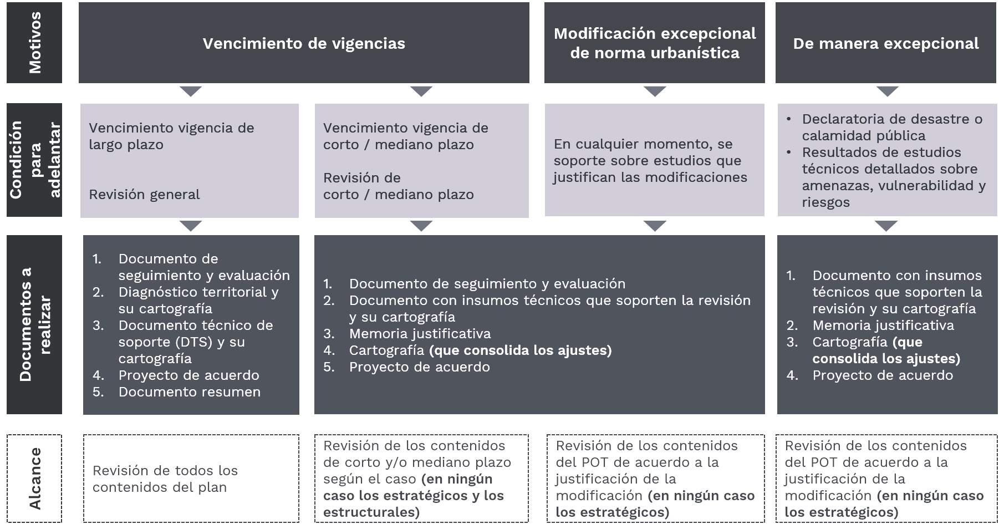
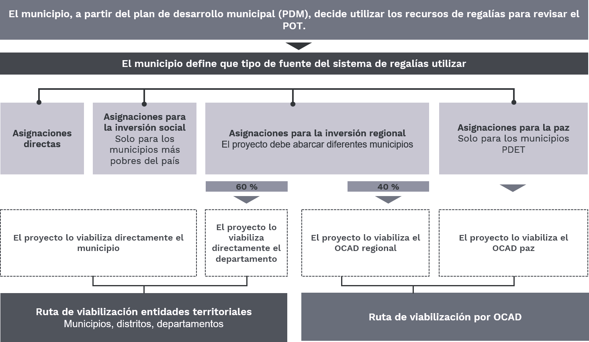
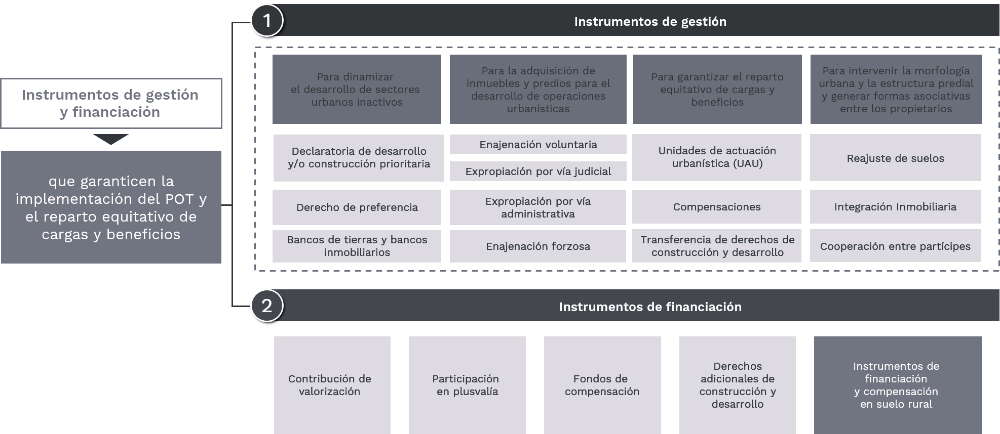

# 1.5. Conceptos generales de Ordenamiento Territorial - OT
Keywords: `EOT` `PBOT` `POT`

El ordenamiento del territorio comprende un conjunto de acciones político-administrativas y de planificación física concertadas, adelantadas por los municipios o distritos y áreas metropolitanas, en ejercicio de la función pública que les compete, dentro de los límites fijados por la Constitución y las leyes, en orden a disponer de instrumentos eficientes para orientar el desarrollo del territorio bajo su jurisdicción y regular la utilización, transformación y ocupación del espacio, de acuerdo con las estrategias de desarrollo socioeconómico y en armonía con el medio ambiente y las tradiciones históricas y culturales (Art. 5 Ley 388 de 1997).

 Tomado de: <a href="https://commons.wikimedia.org/wiki/File:Shanghai_Urban_Planning_Museum_city_model_4.jpg">https://commons.wikimedia.org</a>  

En esta actividad realizaremos una revisión del marco general de los POT y su normativa, etapas de desarrollo (Diagnóstico, Formulación, Implementación, Evaluación y Seguimiento), el alcance en la gestión del riesgo, su participación y las fuentes de financiación.

## Objetivos

* Estudiar el marco normativo que reglamenta el ordenamiento territorial en Colombia.
* Entender el objeto de los POT, sus denominaciones, las etapas desde el diagnóstico hasta la revisión, identificar los tipos de normas urbanísticas aplicables.
* Comprender los conceptos de gestión del riesgo en el alcance de los POT.
* Entender la importancia de la inclusión del cambio climático en la revisión de los POT.

## Requerimientos

* [:notebook:Lectura](http://www.secretariasenado.gov.co/senado/basedoc/ley_0388_1997.html): Ley 388 de 1997. (Leer en [SUIN Juriscol](https://www.suin-juriscol.gov.co/viewDocument.asp?id=1659295).)
* [:notebook:Lectura](https://www.faoswalim.org/resources/Land/Land_resource_Mgt/pdfdocs/guia_sim.pdf): Guía simplificada para la elaboración del plan de ordenamiento territorial municipal.

## 1. Marco normativo

| Norma                                                                                                                                                                                                         | Alcance                                                                                                                                                                                                                                                                                                                                                                                  |
|:--------------------------------------------------------------------------------------------------------------------------------------------------------------------------------------------------------------|:-----------------------------------------------------------------------------------------------------------------------------------------------------------------------------------------------------------------------------------------------------------------------------------------------------------------------------------------------------------------------------------------|
| [Constitución política de Colombia ](http://www.secretariasenado.gov.co/constitucion-politica)                                                                                                                | Establece la competencia de los municipios para el ordenamiento territorial (Art. 311 y 318)                                                                                                                                                                                                                                                                                             |
| [Ley 388 de 1997](http://www.secretariasenado.gov.co/senado/basedoc/ley_0388_1997.html)                                                                                                                       | Obligatoriedad, forma y contenido de los POT, PBOT y EOT.                                                                                                                                                                                                                                                                                                                                |
| [Ley 1454 de 2011](http://www.secretariasenado.gov.co/senado/basedoc/ley_1454_2011.html)                                                                                                                      | Distribuye competencias en materia de ordenamiento territorial.                                                                                                                                                                                                                                                                                                                          |
| [Ley 1551 de 2012](http://www.secretariasenado.gov.co/senado/basedoc/ley_1551_2012.html)                                                                                                                      | Establece que es función de los municipios formular y adoptar los planes de ordenamiento territorial.                                                                                                                                                                                                                                                                                    |
| [Decreto 1077 de 2015](https://minvivienda.gov.co/sites/default/files/normativa/1077%20-%202015.pdf)                                                                                                          | Reglamenta y complementa las disposiciones de la Ley 388 de 1997.                                                                                                                                                                                                                                                                                                                        |
| [Decreto 1783 de 2021](https://minvivienda.gov.co/sites/default/files/normativa/decreto-1783-del-20-de-diciembre-de-2021-modificacion-parcial-con-el-estudio-tramite-y-expedicion-licencias-urbanisticas.pdf) | Por el cual se modifica parcialmente el Decreto 1077 de 2015 Único Reglamentarío del Sector Vivienda, Ciudad y Territorio, en lo relacionado con el estudio, trámite y expedición de las licencias urbanísticas y se dictan otras disposiciones.                                                                                                                                        |
| [Ley 2079 de 2021](http://www.secretariasenado.gov.co/senado/basedoc/ley_2079_2021.html)                                                                                                                      | Tiene por objeto reconocer la política pública de hábitat y vivienda como una política de Estado que diseñe y adopte normas destinadas a complementar el marco normativo dentro del cual se formula y ejecuta la política habitacional urbana y rural en el país, con el fin de garantizar el ejercicio efectivo del derecho a una vivienda y hábitat dignos para todos los colombianos. |
| Acuerdo o Decreto de planificación territorial del nivel municipal                                                                                                                                            | Instrumento de planificación territorial del nivel municipal.                                                                                                                                                                                                                                                                                                                            |

> En la jurisprudencia existen diferentes normas que complementan los alcances definidos en el ordenamiento territorial, la lista anterior solo presenta algunas de las normas principales.

## 2. Objeto del Plan de Ordenamiento Territorial 

Según la Ley 388 de 1997, Artículo 6, el POT se define como el conjunto de objetivos, directrices, políticas, estrategias, metas, programas, actuaciones y normas adoptadas para orientar y administrar el desarrollo físico del territorio y la utilización del suelo.

El ordenamiento del Territorio Municipal y Distrital tiene por objeto complementar la planificación económica y social con la dimensión territorial, identificar las necesidades de espacio público, priorizando los requerimientos de los niños, niñas, adolescentes, mujeres, adultos mayores y personas en condición de discapacidad, racionalizar las intervenciones sobre el territorio y orientar su desarrollo y aprovechamiento sostenible, mediante:

1. La definición de las estrategias territoriales de uso, ocupación y manejo del suelo, en función de los objetivos económicos, sociales, urbanísticos y ambientales.
2. El diseño y adopción de los instrumentos y procedimientos de gestión y actuación que permitan ejecutar actuaciones urbanas integrales y articular las actuaciones sectoriales que afectan la estructura del territorio municipal o distrital.
3. La definición de los programas y proyectos que concretan estos propósitos.

> El ordenamiento del territorio municipal y distrital se hará tomando en consideración las relaciones intermunicipales, metropolitanas y regionales; deberá dar prelación a los espacios públicos, atender las condiciones de diversidad étnica y cultural, reconociendo el pluralismo y el respeto a las diferencias; e incorporará instrumentos que regulen las dinámicas de transformación territorial de manera que se optimice la utilización de los recursos naturales, humanos y tecnológicos para el logro de condiciones de vida dignas para la población actual y las generaciones futuras.

## 3. Denominación POT, PBOT, EOT

De acuerdo a la Ley 388 de 1997, Artículo 9, las denominaciones de los POT son las siguientes:

| Denominación                                    | Población                        | Adoptan                 | 
|:------------------------------------------------|:---------------------------------|:------------------------|
| POT - Plan de ordenamiento territorial          | Superior a 100000 habitantes     | Distritos o municipios  |
| PBOT - Plan básico de ordenamiento territorial  | Entre 30000 y 100000 habitantes  | Municipios              |
| EOT - Esquema de ordenamiento territorial       | Inferior a 30000 habitantes      | Municipios              |

> Todos los tipos de planes de ordenamiento territorial tienen los mismos contenidos.

## 4. Etapas del proceso de planificación territorial y revisión

### 4.1. Etapas

| Etapa                       | Alcance                                                                                                                                                                                                                                                                                                                                                                                                                                                                                                                                                                                                                                                                                                                                                                                                                                                |
|:----------------------------|:-------------------------------------------------------------------------------------------------------------------------------------------------------------------------------------------------------------------------------------------------------------------------------------------------------------------------------------------------------------------------------------------------------------------------------------------------------------------------------------------------------------------------------------------------------------------------------------------------------------------------------------------------------------------------------------------------------------------------------------------------------------------------------------------------------------------------------------------------------|
| Diagnóstico                 | Es la etapa dentro del proceso de planificación del ordenamiento territorial, que analiza de forma integral las condiciones actuales del territorio. En ese sentido se adelantarán acciones para recopilar y analizar la información disponible y relevante de cara al proceso de elaboración, revisión o modificación del POT a partir de las 5 dimensiones del territorio (ambiental, económica, socio-cultural, funcional, institucional). Se entregan: Síntesis del diagnóstico territorial y cartografía de diagnóstico.                                                                                                                                                                                                                                                                                                                          |
| Formulación                 | Es un momento en el cual, mediante un esfuerzo técnico, administrativo, interdisciplinario e interinstitucional (instancias del proceso de revisión del POT), se toman las decisiones de ordenamiento territorial para el municipio o el distrito, a partir de los resultados del diagnóstico territorial y del seguimiento y evaluación y del diagnóstico territorial. Instancias: Consejo de gobierno, Autoridad ambiental, Junta metropolitana, Consejo territorial de planeación, Concejo municipal.                                                                                                                                                                                                                                                                                                                                               |
| Seguimiento y evaluación    | Es la etapa que se desarrolla paralelamente a la etapa de implementación del POT (después de la adopción del instrumento) y durante la cual, el municipio o distrito realiza, de manera sistemática y mínimo cada año, la recolección, análisis y reporte de información que mide los avances del Plan en relación a la implementación de las normas urbanística, al modelo territorial y a los programas y proyectos. Lo anterior, con el fin de definir la relevancia, eficiencia y efectividad de la implementación del Plan, así como soportar los motivos para proceder con la revisión y ajuste del POT. Para adelantar la etapa de seguimiento y evaluación, la ley 388 (art.112) y el decreto 1077 de 2015 (art. 2.2.2.1.2.1.5) establecen la obligatoriedad para los municipios y distritos de conformar el sistema del expediente municipal. |

> No se incluye la etapa de adopción debido a que en el país ya han sido implementados los POT en la mayoría de municipios.

### 4.2. Revisión y fuentes de financiación

El municipio debe proceder a la revisión del POT por los siguientes motivos [^1]:

 Motivos de revisión del POT Tomado de: <a href="https://minvivienda.gov.co/viceministerio-de-vivienda/espacio-urbano-y-territorial/plan-ordenamiento-territorial/pot">https://minvivienda.gov.co</a>  

En cuanto a los requerimientos para iniciar la revisión:

| Requerimiento                     | Alcance                                                                                                                                                                                                                                                                                                                                                                                                                                                                    |
|:----------------------------------|:---------------------------------------------------------------------------------------------------------------------------------------------------------------------------------------------------------------------------------------------------------------------------------------------------------------------------------------------------------------------------------------------------------------------------------------------------------------------------|
| Plan de desarrollo municipal      | En necesario que la revisión del POT haya quedado incluída en el plan de inversiones del Plan de desarrollo municipal - PDM.                                                                                                                                                                                                                                                                                                                                               |
| Definir la fuente de financiación | El POT podrá financiarse a partir de una o diferentes fuentes, por ejemplo: * Recursos propios que estén claramente identificados en el plan de inversiones del PDM. * Recursos del sistema general de regalías - SGR definidos en un capítulo especial del PDM  * Otras fuentes de financiación (convenios inter-administrativos, recursos de cooperación financiera internacional, créditos del Banco de Desarrollo Territorial - [Findeter]() y otros bancos). |
| Contratación                      | Cuando el municipio no cuente con la capacidad operativa y técnica para adelantar la revisión del POT, podrá realizar la contratación, para lo cual es necesario realizar un estudio previo que determine las condiciones contractuales.                                                                                                                                                                                                                                   |

> ¿Cuánto tiempo toma? Dependerá de la fuente de financiación, la cual puede implicar tiempos de acceso a los recursos. Además, se deben considerar los tiempos propios de la licitación de acuerdo a lo establecido en las 

Para revisiones en las que se contemple la financiación a través de recursos provenientes de regalías, es importante considerar los alcances definidos las siguientes normas y orientaciones:

* [Ley 2056 de 2020](http://www.secretariasenado.gov.co/senado/basedoc/ley_2056_2020.html): regula la organización y el funcionamiento del sistema geneal de regalías.
* [Decreto 1821 de 2021](https://www.funcionpublica.gov.co/eva/gestornormativo/norma.php?i=154466): decreto único reglamentario del sistema general de regalías.
* [Orientaciones transitorias para la gestión de proyectos de inversión (2021)](https://www.minvivienda.gov.co/sites/default/files/documentos/orientaciones-transitorias-gestion-proyectos-v-2.0-08-04-2021.pdf): documento del Departamento Nacional de Planeación que establece los requisitos para la esructuración de los proyectos en el SGR.

 Financiación con recursos del SGR Tomado de: <a href="https://minvivienda.gov.co/viceministerio-de-vivienda/espacio-urbano-y-territorial/fuentes-de-financiacion">https://minvivienda.gov.co</a>  

## 5. Componentes y vigencias

La Ley 388 de 1997 en el Artículo 13 estableció los contenidos de los planes de ordenamiento territorial, los cuales se desarrollan durante la etapa de formulación y hacen referencia a lo siguiente

| Componente                          | Alcance                                                                                                                                                                                                                                                                                                                                                                                                                                                                                                                                                                                                                                                                                                                                                                                                                                                                                                                                                                                                                                                                                                                                                                                          | Corto plazo | Mediano plazo | Largo plazo |
|:------------------------------------|:-------------------------------------------------------------------------------------------------------------------------------------------------------------------------------------------------------------------------------------------------------------------------------------------------------------------------------------------------------------------------------------------------------------------------------------------------------------------------------------------------------------------------------------------------------------------------------------------------------------------------------------------------------------------------------------------------------------------------------------------------------------------------------------------------------------------------------------------------------------------------------------------------------------------------------------------------------------------------------------------------------------------------------------------------------------------------------------------------------------------------------------------------------------------------------------------------|:-----------:|:-------------:|:-----------:|
| General                             | Contiene los objetivos y estrategias territoriales que complementarán diferentes acciones desde el punto de vista del manejo territorial, el desarrollo municipal y distrital. Contenido relacionado con la estructura urbano-rural e intraurbana con la correspondiente identificación de la naturaleza de las infraestructuras, redes de comunicación y servicios, así como otros elementos o equipamientos estructurantes de gran escala.                                                                                                                                                                                                                                                                                                                                                                                                                                                                                                                                                                                                                                                                                                                                                     |             |               |    ✓ (3)    |
| Urbano                              | Instrumento para la administración del desarrollo y la ocupación del espacio físico clasificado como suelo urbano y suelo de expansión urbana, que integra políticas de mediano y corto plazo, procedimientos e instrumentos de gestión y normas urbanísticas.                                                                                                                                                                                                                                                                                                                                                                                                                                                                                                                                                                                                                                                                                                                                                                                                                                                                                                                                   |    ✓ (1)    |     ✓ (2)     |             |
| Rural                               | Instrumento para garantizar la adecuada interacción entre los asentamientos rurales y la cabecera municipal, la conveniente utilización del suelo rural y las actuaciones públicas tendientes al suministro de infraestructuras y equipamientos básicos para el servicio de los pobladores rurales.                                                                                                                                                                                                                                                                                                                                                                                                                                                                                                                                                                                                                                                                                                                                                                                                                                                                                              |    ✓ (1)    |     ✓ (2)     |             |
| Programas, proyectos e instrumentos | El ordenamiento territorial requiere altas inversiones públicas y privadas y para ello, la Ley 388 de 1997 y otras normas complementarias, han dispuesto unos instrumentos que sirven para gestionar los proyectos y las obras necesarias para cumplir con los objetivos de lo propuesto en los Planes de Ordenamiento Territorial. Los Instrumentos tienen como objeto promover la función social de la propiedad, el reparto equitativo de las cargas y beneficios derivados de las operaciones y actuaciones sobre el territorio y el principio de equidad, primando el interés general sobre el particular. La elección  de los Instrumentos de Gestión y Financiación  por parte del municipio en el proceso de revisión debe ser mantener una coherencia entre, las acciones de desarrollo territorial y las necesidades consecuentes en cuento a manejo de gestión del suelo y financiación de las mismas acciones urbanísticas. Estos definen la estrategia de financiación del POT de acuerdo con el análisis financiero de las intervenciones propuestas. Asimismo, definen las acciones de carácter administrativo, financiero y organizacional que permiten hacer operativo el POT.  |      ✓      |       ✓       |      ✓      |
| Programa de ejecución               | El programa de ejecución define con carácter obligatorio, las actuaciones sobre el territorio previstas en el plan de ordenamiento, que serán ejecutadas durante el período de la correspondiente administración municipal o distrital, de acuerdo con lo definido en el correspondiente Plan de Desarrollo, señalando las prioridades, la programación de actividades, las entidades responsables y los recursos respectivos. Más información en artículo 18 de la Ley 388 de 1997.                                                                                                                                                                                                                                                                                                                                                                                                                                                                                                                                                                                                                                                                                                             |    ✓ (1)    |       ✓       |      ✓      |

> El valor indicado entre paréntesis corresponde a la vigencia en función del número de períodos constitucionales de las administraciones municipales. No obstante, si al finalizar el plazo de vigencia establecido no se ha adoptado un nuevo plan de ordenamiento territorial, seguirá vigente el ya adoptado.

 La vigencia (corto, mediano y largo plazo) de los POT es de hasta tres períodos constitucionales completos y estos se deben contar a partir del momento en que el municipio adopta el instrumento. Por ejemplo, si la adopción del POT se realizó a mediados de 2012, se entenderá que la vigencia de corto plazo incluirá todo el período constitucional hasta el 31/12/2019 y el siguiente período constitucional, ya que el período 2012-2015, no puede considerarse completo. Así mismo, la vigencia de mediano plazo se ejecutará en el período 2020-2023 y la de largo plazo en el período 2024-2027.

 Instrumentos de gestión y financiación de los POT Tomado de: <a href="https://www.minvivienda.gov.co/viceministerio-de-vivienda/espacio-urbano-y-territorial/plan-ordenamiento-territorial/etapas-pot/instrumentos">https://minvivienda.gov.co</a>  

## 6. Normas urbanísticas

Las normas urbanísticas regulan el uso, la ocupación y el aprovechamiento del suelo y definen la naturaleza y las consecuencias de las actuaciones urbanísticas indispensables para la administración de estos procesos. Estas normas estarán jerarquizadas de acuerdo con los criterios de prevalencia aquí especificados y en su contenido quedarán establecidos los procedimientos para su revisión, ajuste o modificación, en congruencia con lo que a continuación se señala.

| Tipo                              | Alcance                                                                                                                                                                                                                                                                                                                                                                                                                                                                                                                                                                                                                                                                                               |
|:----------------------------------|:------------------------------------------------------------------------------------------------------------------------------------------------------------------------------------------------------------------------------------------------------------------------------------------------------------------------------------------------------------------------------------------------------------------------------------------------------------------------------------------------------------------------------------------------------------------------------------------------------------------------------------------------------------------------------------------------------|
| Normas urbanísticas estructurales | Son las que aseguran la consecución de los objetivos y estrategias adoptadas en el componente general del plan y en las políticas y estrategias de mediano plazo del componente urbano. Prevalecen sobre las demás normas, en el sentido de que las regulaciones de los demás niveles no pueden adoptarse ni modificarse contraviniendo lo que en ellas se establece, y su propia modificación solo puede emprenderse con motivo de la revisión general del plan o excepcionalmente a iniciativa del alcalde municipal o distrital, con base en motivos y estudios técnicos debidamente sustentados.                                                                                                  |
| Normas urbanísticas generales     | Son aquellas que permiten establecer usos e intensidad de usos del suelo, así como actuaciones, tratamientos y procedimientos de parcelación, urbanización, construcción e incorporación al desarrollo de las diferentes zonas comprendidas dentro del perímetro urbano y suelo de expansión. Por consiguiente, otorgan derechos e imponen obligaciones urbanísticas a los propietarios de terrenos y a sus constructores, conjuntamente con la especificación de los instrumentos que se emplearán para que contribuyan eficazmente a los objetivos del desarrollo urbano y a sufragar los costos que implica tal definición de derechos y obligaciones.                                             |
| Normas complementarias            | Se trata de aquellas relacionadas con las actuaciones, programas y proyectos adoptados en desarrollo de las previsiones contempladas en los componentes general y urbano del plan de ordenamiento, y que deben incorporarse al Programa de ejecución que se establece en el artículo 18 de la presente ley. También forman parte de este nivel normativo, las decisiones sobre las acciones y actuaciones que por su propia naturaleza requieren ser ejecutadas en el corto plazo y todas las regulaciones que se expidan para operaciones urbanas específicas y casos excepcionales, de acuerdo con los parámetros, procedimientos y autorizaciones emanadas de las normas urbanísticas generales.   |

## 7. Participación

De acuerdo al Artículo 4 de la Ley 388 de 1997, en ejercicio de las diferentes actividades que conforman la acción urbanística, las administraciones municipales, distritales y metropolitanas deberán fomentar la concertación entre los intereses sociales, económicos y urbanísticos, mediante la participación de los pobladores y sus organizaciones.

Esta concertación tendrá por objeto asegurar la eficacia de las políticas públicas respecto de las necesidades y aspiraciones de los diversos sectores de la vida económica y social relacionados con el ordenamiento del territorio municipal, teniendo en cuenta los principios señalados en el artículo 2º de la presente ley.

La participación ciudadana podrá desarrollarse mediante el derecho de petición, la celebración de audiencias públicas, el ejercicio de la acción de cumplimiento, la intervención en la formulación, discusión y ejecución de los planes de ordenamiento y en los procesos de otorgamiento, modificación, suspensión o revocatoria de las licencias urbanísticas, en los términos establecidos en la ley y sus reglamentos.

Lo anterior, permite asegurar la eficacia del ordenamiento del territorio respecto de las necesidades y aspiraciones de los diversos sectores de la vida económica y social de un contexto específico. El alcalde distrital o municipal, a través de las oficinas de planeación o de las dependencias que hagan sus veces, será responsable de coordinar la formulación oportuna del proyecto de Plan de Ordenamiento Territorial y de someterlo a consideración del consejo de gobierno.

 Mecanismos de participación Tomado de: <a href="https://minvivienda.gov.co/viceministerio-de-vivienda/espacio-urbano-y-territorial/plan-ordenamiento-territorial/participacion-pot">https://minvivienda.gov.co</a>  

## 8. Gestión del riesgo

La gestión de riesgo de desastres es un proceso dinámico y permanente orientado a definir, ejecutar y evaluar acciones para avanzar en el conocimiento, la reducción del riesgo y el manejo de desastres. En este orden de ideas, la Ley 388 de 1997 reconoce la prevención de amenazas y riesgos como un determinante para el ordenamiento del territorio, estableciendo los alcances jurídicos y técnicos para su incorporación en  as decisiones que se planteen en los Planes de Ordenamiento Territorial, por tanto, su inclusión es obligatoria e inaplazable y debe ser verificada por la autoridad ambiental en el trámite de concertación de los asuntos ambientales. [^1]

Mediante la Ley 1523 de 2012, se creó el Sistema Nacional de Gestión del Riesgo de Desastres, y mediante la [Resolución 448 de 2014 del Ministerio de Vivienda, Ciudad y Territorio](https://minvivienda.gov.co/normativa/resolucion-0448-2014), se definió la [metodología para realizar el inventario nacional de asentamientos humanos en zonas de alto riesgo](https://minvivienda.gov.co/sites/default/files/documentos/guia-aplicacion-asentamientos.pdf) por su localización, contemplados en el artículo 56 de la Ley 9 de 1989 (modificada por el artículo 5 de la Ley 2 de 1991).

 Asentamientos en zonas de alto riesgo por inudación o movimientos en masa Tomado de: <a href="https://minvivienda.gov.co/sites/default/files/documentos/guia-aplicacion-asentamientos.pdf">https://minvivienda.gov.co</a>  

### 8.1. Conceptos básicos

| Concepto                         | Definición                                                                                                                                                                                                                                                                                                                                                                                                                                                                                                                                                                                                                                                                                                                             |
|:---------------------------------|:---------------------------------------------------------------------------------------------------------------------------------------------------------------------------------------------------------------------------------------------------------------------------------------------------------------------------------------------------------------------------------------------------------------------------------------------------------------------------------------------------------------------------------------------------------------------------------------------------------------------------------------------------------------------------------------------------------------------------------------|
| Amenaza                          | Corresponde al peligro latente de que un evento físico de origen natural, causado o inducido por la acción humana de manera accidental, se presente con una severidad suficiente para generar pérdida de vidas, lesiones u otros impactos en la salud, así como también daños y pérdidas en los bienes, la infraestructura, los medios de sustento, la prestación de servicios y los recursos ambientales (Ley 1523 de 2012). Los análisis de amenazas brindan información en cuanto a la intensidad, la magnitud, la frecuencia y los posibles impactos de los fenómenos evaluados. La categorización que se da en este análisis se establece de acuerdo con dichas características y generalmente se asigna como alta, media y baja. |
| Vulnerabilidad                   | Hace referencia a la susceptibilidad o fragilidad física, económica, social, ambiental o institucional que tiene una comunidad, de ser afectada o de sufrir efectos adversos en caso de que un evento físico peligroso se presente. Corresponde a la predisposición a sufrir pérdidas o daños de los seres humanos y sus medios de subsistencia, así como de sus sistemas físicos, sociales, económicos y de apoyo que pueden ser afectados por eventos físicos peligrosos (Ley 1523 de 2012).                                                                                                                                                                                                                                         |
| Riesgo de desastres              | `Amenaza + Vulnerabilidad = Riesgo`. Corresponde a los daños o pérdidas potenciales que pueden presentarse debido a los eventos físicos peligrosos de origen natural, socio natural, tecnológico, biosanitario o humano no intencional, en un período de tiempo específico, y que son determinados por la vulnerabilidad de los elementos expuestos; por consiguiente, el riesgo de desastres se deriva de la combinación de la amenaza y la vulnerabilidad (Ley 1523 de 2012).                                                                                                                                                                                                                                                        |
| Exposición (elementos expuestos) | Se refiere a la presencia de personas, medios de subsistencia, servicios ambientales, recursos económicos y sociales, bienes culturales e infraestructura, que su localización pueden ser afectados por la manifestación de una amenaza (Ley 1523 de 2012).                                                                                                                                                                                                                                                                                                                                                                                                                                                                            |
| Análisis y evaluación del riesgo | Implica la consideración de las causas y fuentes del riesgo, sus consecuencias y la probabilidad de que dichas consecuencias puedan ocurrir. Es el modelo mediante el cual se relaciona la amenaza y la vulnerabilidad de los elementos expuestos, con el fin de determinar los posibles efectos sociales, económicos y ambientales y sus probabilidades. Se estima el valor de los daños y las pérdidas potenciales y se compara con criterios de seguridad establecidos, con el propósito de definir tipos de intervención y alcance de la reducción del riesgo y preparación para la respuesta y recuperación (Ley 1523 de 2012).                                                                                                   |

> La evaluación del riesgo establece una espacialización y categorización, indicando generalmente zonas de riesgo alto, medio y bajo. Se requiere que cada una de las zonas explicite claramente las características dadas por la categoría asignada, de manera que quienes toman decisiones cuenten con información que les permita establecer acciones adecuadas para avanzar en la reducción del riesgo.

Para el análisis del riesgo se realizan dos tipos de estudios:

| Básicos                                                                                                                                                                                     | Detallados                                                                                                                                                                                                                   |
|---------------------------------------------------------------------------------------------------------------------------------------------------------------------------------------------|------------------------------------------------------------------------------------------------------------------------------------------------------------------------------------------------------------------------------|
| Se realizan como requisito para adelantar los procesos de revisión del POT.  Permiten priorizar las zonas en donde se requiere adelantar estudios que permitan categorizar el riesgo. | Se pueden plantear en el contenido programático del POT, con el fin de que se desarrollen en su implementación.  Permite categorizar el riesgo y establecer las medidas de intervención estructurales para su manejo.  |

La incorporación de la gestión en la planificación del ordenamiento territorial se debe realizar en cada una de sus etapas con el fin de garantizar que este sea un proceso integral, gradual, continuo y sistemático, para lo cual, en la etapa de formulación del POT se debe definir las medidas de intervención en función de los objetivos, estrategias y prioridades adoptados para la concreción del modelo de ocupación territorial.

Para esto, en suelo urbano, de expansión urbana, centros poblados y suelo suburbano se deben delimitar las áreas con condición de riesgo y las áreas con condición de amenaza, las cuales se definen según el Artículo 2.2.2.1.3.1.3 del Decreto 1077 de 2015, como: 

* Áreas con condición de amenaza, son las zonas o áreas del territorio municipal zonificadas como de amenaza alta y media en las que se establezca en la revisión o expedición de un nuevo POT la necesidad de clasificarlas como suelo urbano, de expansión urbana, rural suburbano o centros poblados rurales para permitir su desarrollo.
* Áreas con condición de riesgo, corresponden a las zonas o áreas del territorio municipal clasificadas como de amenaza alta que estén urbanizadas, ocupadas o edificadas, así como en las que se encuentren elementos del sistema vial, equipamientos (salud, educación, otros) e infraestructura de servicios públicos.

> La determinación de las medidas específicas para su mitigación, las cuales deben incluirse en la cartografía correspondiente.

### 8.2. Tipos de riesgos

| Tipo de riesgo      | Tipo                                                                                                                                                                                                                                                                                                                                                                                                                                                                                                                                                                                                                                                                                                                                    |
|:--------------------|:----------------------------------------------------------------------------------------------------------------------------------------------------------------------------------------------------------------------------------------------------------------------------------------------------------------------------------------------------------------------------------------------------------------------------------------------------------------------------------------------------------------------------------------------------------------------------------------------------------------------------------------------------------------------------------------------------------------------------------------|
| Inundación          | Es la ocupación por parte del agua de zonas que habitualmente están libres de esta, por desbordamiento de ríos, corrientes, quebradas, por lluvias torrenciales, deshielo, por subida de las mareas por encima del nivel habitual, por maremotos, huracanes, entre otros. (Tomado de [Wikipedia](https://es.wikipedia.org/wiki/Inundaci%C3%B3n))                                                                                                                                                                                                                                                                                                                                                                             |
| Movimiento en masa  | Derrumbes y deslizamientos. De acuerdo al [IDIGER](https://www.idiger.gov.co/), es el proceso por el cual un volumen de material constituido por roca, suelo, tierras, detritos o escombros, se desplaza ladera abajo por acción de la gravedad.                                                                                                                                                                                                                                                                                                                                                                                                                                                                                        | 
| Volcánico           | Consecuencias predecibles de un evento volcánico en términos de daños y pérdida de vidas, destrucción de algunos tipos específicos de propiedad y otras pérdidas económicas. (Tomado de la revista [IPGH](https://revistasipgh.org/index.php/regeo/article/download/204/207/378))                                                                                                                                                                                                                                                                                                                                                                                                                                            | 
| Tsunami             | Un tsunami, sunami o maremoto es un evento complejo que involucra un grupo de olas en un cuerpo de agua de gran energía y de tamaño variable que se produce cuando se desplaza verticalmente una gran masa de agua por algún fenómeno extraordinario, por ejemplo, terremotos, erupciones volcánicas, detonaciones nucleares submarinas, deslizamientos de terreno, impacto de meteoritos, etc. (Tomado de [Wikipedia](https://es.wikipedia.org/wiki/Tsunami))                                                                                                                                                                                                                                                               | 
| Subsidencia         | Describe el progresivo hundimiento de una superficie, generalmente de la litosfera, bien sea por el movimiento relativo de las placas tectónicas que incluyen tanto la convergencia de las mismas como su divergencia o, en una escala menor, por el asentamiento del terreno en las cuencas sedimentarias (a menudo acelerado por la acción humana, como es el caso de las cuencas petroleras o la extracción de aguas subterráneas1 o por el cese de la actividad volcánica en áreas reducidas en torno a los volcanes propiamente dichos, como sucede en el caso de los atolones. (Tomado de [Wikipedia](https://es.wikipedia.org/wiki/Subsidencia))                                                                      | 
| Sísmico             | Consecuencias sociales y económicas provocadas por un terremoto, como resultado de la falla de estructuras cuya capacidad resistente fue excedida por un terremoto. Lo anterior depende del grado de Amenaza Sísmica entendido como la probabilidad que ocurra un fenómeno físico como consecuencia de un terremoto, provocando efectos adversos a la actividad humana que se acentúan según la vulnerabilidad del territorio; definido como un valor único que permite clasificar a las estructuras de acuerdo a la calidad estructural intrínseca de las mismas. (Tomado de [Gobierno del Salvador, Ministerio de Medio Ambiente](https://www.snet.gob.sv/ver/sismologia/riesgo+sismico/))                                 |
| Tecnológico         | Generado por la construcción de obras civiles mayores, industriales, transporte y almacenamiento de carga,  construcción de edificaciones categoría IV de alta complejidad. (Tomado de [IDIGER](https://www.idiger.gov.co/))                                                                                                                                                                                                                                                                                                                                                                                                                                                                                                 | 
| Condición insalubre | Falta de condiciones higiénicas mínimas que son necesarias para que una edificación o un terreno pueda ser ocupado o utilizado para fines determinados. Cuando se da la insalubridad, suelen aparecer distintos conflictos relacionados con problemas de salud, daños en edificaciones, aparición de agentes contaminantes o incluso presencia de bichos y animales. (Tomado de [Perito Judicial Group](https://peritojudicial.com/informe-insalubridad/))                                                                                                                                                                                                                                                                   |

> De acuerdo a la Ley 388 de 1997, se deben determinar las medidas para el manejo de dichas zonas, incluídos los mecanísmos de reubicación de asentamientos cuando esto se requiera, así mismo se debe contemplar la transformación del uso asignado a tales zonas para evitar reasentamientos de alto riesgo; la constitución de reservas de tierras y la adquisición y expropiación de inmuebles que sean necesarios para reubicación de poblaciones de alto riesgo.

## 9. Relación entre el Plan de Desarrollo Municipal - PDM y el Plan de Ordenamiento Territorial - POT

Seguin lo establecido en la Ley 388 de 1997, Artículo 21, el plan de ordenamiento territorial define a largo y mediano plazo un modelo de ocupación del territorio municipal y distrital, señalando su estructura básica y las acciones territoriales necesarias para su adecuada organización, el cual estará vigente mientras no sea modificado o sustituido. En tal sentido, en la definición de programas y proyectos de los planes de desarrollo de los municipios se tendrán en cuenta las definiciones de largo y mediano plazo de ocupación del territorio.

Articulación [^2]

|                 | PDM                                                                                                                                                                                                                                                                                                                  | POT                                                                                                                                                                                                                                                                                                                                                                                                                                                                     |
|-----------------|----------------------------------------------------------------------------------------------------------------------------------------------------------------------------------------------------------------------------------------------------------------------------------------------------------------------|-------------------------------------------------------------------------------------------------------------------------------------------------------------------------------------------------------------------------------------------------------------------------------------------------------------------------------------------------------------------------------------------------------------------------------------------------------------------------|
| Fines           | Desempeñar adecuadamente las funciones para garantízar los derechos a cargo del Municipio en busca del bienestar general y el mejoramiento de la calidad de vida de la población en su respectivo territorio.  Desarrollar estrategias de lucha contra la pobreza.  Art. 339 CP, Art. 1 Ley 136 de 1994. | Posibilitar a los habitantes el acceso a vias, transporte, espacios públicos y hacer efectivos los derechos a la vivienda y servicios públicos domiciliarios.  Buscar el desarrollo sostenible.  Propender por el mejoramiento de la calidad de vida de los habitantes y el desarrollo y la preservación del patrimonio cultural y natural.  Mejorar la seguridad de los asentamientos humanos ante riesgos naturales.  Art. 3 Ley 388 de 1997. |
| Objetivos       | Señalar los propósitos, objetivos, políticas y estrategias en materia social, económica y ambiental en busca de los fines de desarrollo. Art. 339 CP.                                                                                                                                                                | Complementa la planificación económica y social con la dimensión territorial, racionalizar las intervenciones sobre el territorio y orientar su desarrollo y aprovechamiento sostenible. Art. 5 ley 388 de 1997.                                                                                                                                                                                                                                                        |
| Diagnóstico     | **Bases del Plan**  Básicos demográficos.  Básicos sociales, económicos y ambientales.  Análisis de dinámica demográfica y poblacional.  Análisis de interacciones, balances y tensiones.  Grandes retos.                                                                              | **Documento Técnico de Soporte (DTS)**  Básicos demográficos.  Básicos sociales, económicos y ambientales.  Análisis de dinámica demográfica y poblacional.  Análisis de interacciones, balances y tensiones.  Grandes retos.                                                                                                                                                                                                             |
| Visión integral | Visión de desarrollo.                                                                                                                                                                                                                                                                                                | Visión de territorio.  Objetivos y estrategias territoriales.                                                                                                                                                                                                                                                                                                                                                                                                     |

> Con respecto a la participación de la nación en el desarrollo urbano, el Gobierno Nacional formulará la Política Nacional Urbana, tendiente a garantizar el desarrollo equilibrado y eficiente de los centros urbanos, la cual incluirá directrices, orientaciones, objetivos y estrategias, así como los parámetros para la determinación de los planes tendientes a su cumplimiento, lo mismo que las fuentes de financiación del componente nacional. Para tales efectos, el Ministerio de Desarrollo Económico formulará la Política Nacional Urbana y los planes tendientes a su ejecución, en armonía con los intereses regionales y locales (Art. 110, Ley 388 de 1997).

## 10. Planes de ordenamiento y cambio climático  
Tomado y adaptado de: Lineamientos para el uso de información geográfica en el desarrollo del componente rural de los Planes de Ordenamiento Territorial – POT, Instituto Geográfico Agustín Codazzi, 2019. [^2]

 Cambio en la temperatura planetaria en los últimos 50 años Tomado de: <a href="https://commons.wikimedia.org/wiki/File:Change_in_Average_Temperature_With_Fahrenheit.svg">https://data.giss.nasa.gov/gistemp/maps/index_v4.html</a>  

De acuerdo al Artículo 10 de la Ley 388 de 1997, una de las determinantes de Nivel 1 del ordenamiento territorial es la gestión del cambio climático.

De manera natural, las condiciones climáticas se encuentran en constante cambio, sin embargo, se han encontrado evidencias de que el clima en el planeta está cambiando a un ritmo más acelerado de lo esperado, lo que es atribuido directa o indirectamente a actividades humanas como las de producción, extracción, asentamiento y consumo, que se reflejan en el aumento de los niveles de los gases efecto invernadero - GEI en la atmósfera y en cambios en los usos de los suelos. A este fenómeno se le conoce como Cambio Climático - CC y su estudio, de acuerdo con las metodologías del Grupo Intergubernamental de Expertos sobre el Cambio Climático (The Intergovernmental Panel on Climate Change – IPCC), se basa en prever alteraciones en los regímenes de temperatura y precipitación. 

El cambio climático toma relevancia en la medida en que las comunidades estén preparadas o no para asumir sus consecuencias que para Colombia pueden incluir: 

* Aumento del nivel del mar
* Derretimiento de glaciares y nevados
* Retroceso de los sistemas de páramos
* Reducción en la productividad agropecuaria
* Mayor afectación por eventos climáticos como La Niña y El Niño

Por esto, es necesario incorporar, desde el diagnóstico territorial del componente rural, información relacionada a los niveles de riesgo a los efectos adversos del cambio climático sobre las infraestructuras (derrumbes en vías, colapso de puentes vehiculares y por el aumento de los niveles de los cuerpos de agua), sobre los sistemas productivos (inundaciones y pérdida de cultivos y cabezas de ganado) y otros efectos, que llevan a la pérdida de vidas humanas para, finalmente, establecer medidas de adaptación en las zonas que se consideren prioritarias. 

Es importante resaltar que, en el componente rural del ordenamiento territorial municipal, se pueden definir acciones para ejecutarse en el mediano y corto plazo; y es precisamente para esta temporalidad que se debe evaluar este fenómeno atendiendo a momento en el que se realizan los estudios y la clara necesidad de incorporar el cambio climático en el proceso de revisión y ajuste de los planes de ordenamiento territorial. Para estudiar este fenómeno, es necesario, en primer lugar, identificar y espacializar los elementos de interés por su probabilidad de verse afectados por el cambio climático, entre ellos se pueden tener en cuenta: 

* Asentamientos humanos como zonas urbanas, de expansión urbana y centros poblados rurales. 
* Infraestructura de servicios como PTAR, PTAP, tanques de almacenamiento, cuerpos de agua para la producción energética. 
* Equipamientos regionales como los corredores viales, puertos, aeropuertos, zonas francas, puntos de acopio. 
* Zonas susceptibles a amenazas de origen natural como inundaciones, fenómenos de remoción en masa, avenidas torrenciales, incendios. 
* Estructura ecológica, conformada por los ecosistemas estratégicos presentes en el municipio, su sistema de áreas protegidas, humedales, etc. 
*Todos aquellos que se consideren necesarios por las particularidades del municipio. 

Estos se pueden traer de otros estudios de riesgo por amenazas naturales, en escalas detalladas o semidetalladas. Además, se pueden identificar a través de información geográfica básica disponible como las bases de datos catastrales o la cartografía básica. Con estos elementos caracterizados, es posible, en segundo lugar, superponer la zonificación de los niveles de riesgo por cambio climático, a partir de los resultados del “Análisis de Vulnerabilidad y Riesgo por Cambio Climático en Colombia”, haciendo uso de la información geográfica del estudio: calificación alta y muy alta, y teniendo en cuenta su temporalidad.

Sin embargo, existen herramientas metodológicas más detalladas para la incorporación del cambio climático al ordenamiento del territorio municipal dadas desde el nivel nacional, a través de las Consideraciones de Cambio Climático para el Ordenamiento Territorial (Ministerio de Ambiente y Desarrollo Sostenible, 2018) y para el nivel local con las Orientaciones para la Inclusión del Cambio Climático en los Planes de Ordenamiento Territorial (CAR, 2018), que son referentes para esta investigación y orientan a profundidad este importante tema.

Los municipios que tienen influencia de la dinámica marino-costera deberán incorporar información relacionada a posibles cambios en el nivel del mar o cambios en la línea costera en sus análisis de cambio climático. 

## 11. Roles de la arquitectura, la ingeniería y profesiones afines en la elaboración de los POT

| Profesión [^3]              | Estudios a realizar                                                                                                                                                                                                                                                                                                                                                                                                                                                                                                                                                                                                                                                                                                                                                                                                                                                                                                                                                       | Experiencia general |
|:----------------------------|:--------------------------------------------------------------------------------------------------------------------------------------------------------------------------------------------------------------------------------------------------------------------------------------------------------------------------------------------------------------------------------------------------------------------------------------------------------------------------------------------------------------------------------------------------------------------------------------------------------------------------------------------------------------------------------------------------------------------------------------------------------------------------------------------------------------------------------------------------------------------------------------------------------------------------------------------------------------------------|:--------------------|
| Arquitecto                  | Estudios generales y complementarias de ordenamiento territorial (estudios de posgrado en desarrollo urbano y territorial).                                                                                                                                                                                                                                                                                                                                                                                                                                                                                                                                                                                                                                                                                                                                                                                                                                                                                                         | ≥ 5 años            |
| Ingeniero civil             | Estudios generales y complementarias de ordenamiento territorial (estudios de posgrado en desarrollo urbano y territorial). Coberturas y usos del suelo. Hidrología (estudios de posgrado o experiencia mayor a 2 años). Hidráulica (experticia en el área hidráulica, en modelos hidráulicos y en delimitación de zonas de inundación). Análisis sismológico, investigación del subsuelo, zonificación geotécnica y análisis de estabilidad (estudios de posgrado o experiencia mayor a 2 años en el área de geotecnia). Evaluación de amenaza, vulnerabilidad y riesgo por movimientos en masa (experiencia específica en evaluación de riesgos mayor a 2 años. Estudios de posgrado en geotecnia o evaluación de riesgos). Evaluación de amenaza, vulnerabilidad y riesgo por inundación (posgrado en hidrología o hidráulica y tener una experiencia específica mayor a 2 años en evaluación de riesgos, o tener estudios de posgrado en evaluación de riesgos). | ≥ 5 años            |
| Ingeniero ambiental         | Estudios generales y complementarias de ordenamiento territorial (estudios de posgrado en desarrollo urbano y territorial). Coberturas y usos del suelo. Hidrología (estudios de posgrado o experiencia mayor a 2 años).                                                                                                                                                                                                                                                                                                                                                                                                                                                                                                                                                                                                                                                                                                                                                                                                           | ≥ 5 años            |
| Ingeniero catastral         | Estudios generales y complementarias de ordenamiento territorial (estudios de posgrado en desarrollo urbano y territorial). Coberturas y usos del suelo.                                                                                                                                                                                                                                                                                                                                                                                                                                                                                                                                                                                                                                                                                                                                                                                                                                                                            | ≥ 5 años            |
| Geólogo o ingeniero geólogo | Geología o geomorfología. Evaluación de amenaza, vulnerabilidad y riesgo por movimientos en masa (experiencia específica en evaluación de riesgos mayor a 2 años. Debe tener estudios de posgrado en geotecnia o evaluación de riesgos).                                                                                                                                                                                                                                                                                                                                                                                                                                                                                                                                                                                                                                                                                                                                 | ≥ 5 años            |
| Ingeniero forestal          | Coberturas y usos del suelo.                                                                                                                                                                                                                                                                                                                                                                                                                                                                                                                                                                                                                                                                                                                                                                                                                                                                                                                                              | ≥ 5 años            | 
| Agrónomo                    | Coberturas y usos del suelo.                                                                                                                                                                                                                                                                                                                                                                                                                                                                                                                                                                                                                                                                                                                                                                                                                                                                                                                                              | ≥ 5 años            | 
| Ecólogo                     | Coberturas y usos del suelo.                                                                                                                                                                                                                                                                                                                                                                                                                                                                                                                                                                                                                                                                                                                                                                                                                                                                                                                                              | ≥ 5 años            | 
| Ingeniero hidrólogo         | Hidrología (estudios de posgrado o experiencia mayor a 2 años).                                                                                                                                                                                                                                                                                                                                                                                                                                                                                                                                                                                                                                                                                                                                                                                                                                                                                                          | ≥ 5 años            |
| Meteorólogo                 | Clima                                                                                                                                                                                                                                                                                                                                                                                                                                                                                                                                                                                                                                                                                                                                                                                                                                                                                                                                                                     | ≥ 5 años            |

> Se han tomado y adaptado como referencia los profesionales establecidos en la Guía Metodológica para el Inventario de Asentamientos en Zonas de Alto Riesgo del Ministerio de Vivienda.

## Actividades de proyecto :triangular_ruler:

En la siguiente tabla se listan las actividades que deben ser desarrolladas y documentadas por cada grupo de proyecto en un único archivo de Adobe Acrobat .pdf. El documento debe incluir portada (indicando el caso de estudio, número de avance, nombre del módulo, fecha de presentación, nombres completos de los integrantes), numeración de páginas, tabla de contenido, lista de tablas, lista de ilustraciones, introducción, objetivo general, capítulos por cada ítem solicitado, conclusiones y referencias bibliográficas.

| Actividad     | Alcance                                                                                                                                                                                                                                                                                                                                                                                                                                             |
|:--------------|:----------------------------------------------------------------------------------------------------------------------------------------------------------------------------------------------------------------------------------------------------------------------------------------------------------------------------------------------------------------------------------------------------------------------------------------------------|
| Avance **P1** | Esta actividad no requiere del desarrollo de elementos en el avance P1 del proyecto final, los contenidos son evaluados en el quiz de conocimiento y habilidad.                                                                                                                                                                                                                                                                                     | 
| Avance **P1** | En una tabla y al final del informe de avance de esta entrega, indique el detalle de las sub-actividades realizadas por cada integrante de su grupo. Para actividades que no requieren del desarrollo de elementos de avance, indicar si realizo la lectura de la guía de clase y las lecturas indicadas al inicio en los requerimientos. Utilice las siguientes columnas: Nombre del integrante, Actividades realizadas, Tiempo dedicado en horas. |

> No es necesario presentar un documento de avance independiente, todos los avances de proyecto de este módulo se integran en un único documento.
> 
> En el informe único, incluya un numeral para esta actividad y sub-numerales para el desarrollo de las diferentes sub-actividades, siguiendo en el mismo orden de desarrollo presentado en esta actividad.

## Referencias

* https://minvivienda.gov.co/viceministerio-de-vivienda/espacio-urbano-y-territorial/plan-ordenamiento-territorial/pot
* https://www.colombiaot.gov.co/
* https://minvivienda.gov.co/sites/default/files/documentos/guia-aplicacion-asentamientos.pdf
* https://recursos.ccb.org.co/ccb/pot/IPAD/files/2pot.html

## Control de versiones

| Versión    | Descripción                                                | Autor                                      | Horas |
|------------|:-----------------------------------------------------------|--------------------------------------------|:-----:|
| 2024.02.26 | Versión inicial con alcance de la actividad                | [rcfdtools](https://github.com/rcfdtools)  |   4   |
| 2024.06.28 | Investigación y documentación para caso de estudio general | [rcfdtools](https://github.com/rcfdtools)  |   8   |

_R.SIGE es de uso libre para fines académicos, conoce nuestra licencia, cláusulas, condiciones de uso y como referenciar los contenidos publicados en este repositorio, dando [clic aquí](LICENSE.md)._

_¡Encontraste útil este repositorio!, apoya su difusión marcando este repositorio con una ⭐ o síguenos dando clic en el botón Follow de [rcfdtools](https://github.com/rcfdtools) en GitHub._

| [◄ Anterior](../Population/Readme.md) | [:house: Inicio](../../README.md) | [:beginner: Ayuda / Colabora](https://github.com/rcfdtools/R.SIGE/discussions/7) | [Siguiente ►](../POTStudyZone/Readme.md) |
|------------------------------------------------------|-----------------------------------|----------------------------------------------------------------------------------|--------------------------------------------------------|

[^1]: https://minvivienda.gov.co/viceministerio-de-vivienda/espacio-urbano-y-territorial/plan-ordenamiento-territorial/pot
[^2]: Enfoque poblacional para revisión y ajustes de Planes de Ordenamiento Territorial. Guía de aplicación. Ministerio de Ambiente, Vivienda y Desarrollo Territorial.
[^3]: [Lineamientos para el uso de información geográfica en el desarrollo del componente rural de los Planes de Ordenamiento Territorial – POT, Instituto Geográfico Agustín Codazzi. 2019.](https://www.colombiaot.gov.co/docs/cartilla_pot.pdf)
