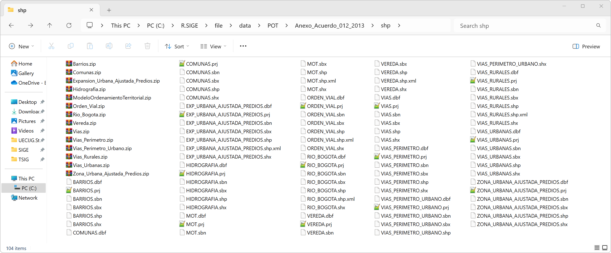
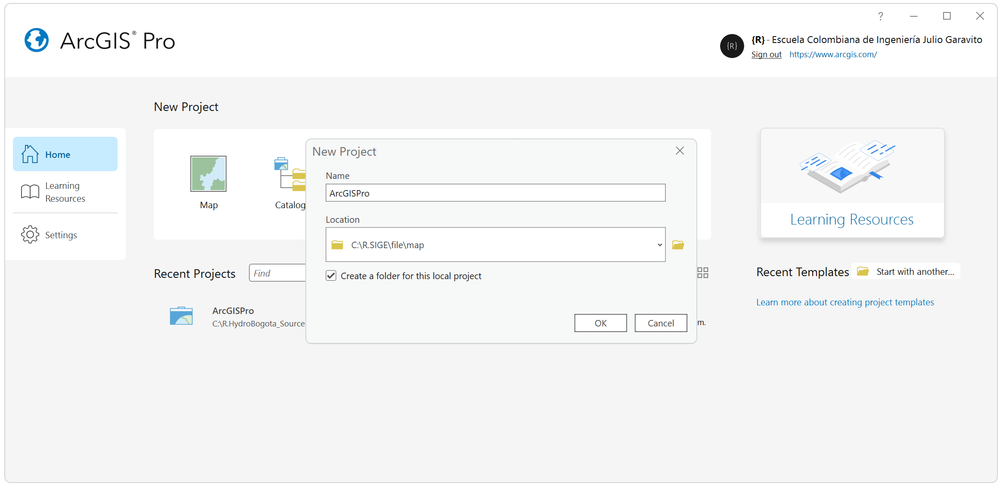
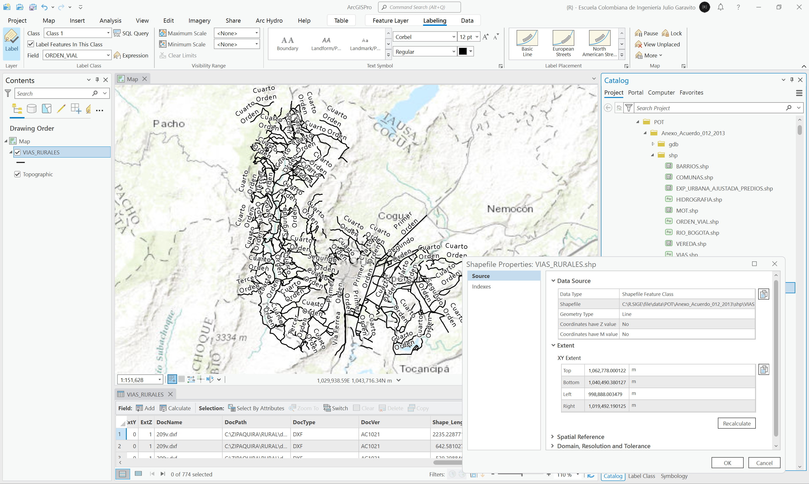

# Inventario de información geo-espacial recopilada 
Keywords: `DEM` `AgreeDEM`

En esta actividad se presenta una tabla resumen de la información geo-espacial (vectorial, ráster) y tablas anexas al POT.

 Tomado de: <a href="Public Domain, https://commons.wikimedia.org/w/index.php?curid=479365">https://commons.wikimedia.org</a>  

## Objetivos

* 

## Requerimientos

* [:open_file_folder:POT_Layer.xlsx](PoblacionDANE.xlsx): libro para registro de capas y grillas recopiladas del POT.
* [:toolbox:Herramienta](https://www.microsoft.com/es/microsoft-365/excel?market=bz): Microsoft Excel 365.
* [:toolbox:Herramienta](https://www.esri.com/en-us/arcgis/products/arcgis-pro/overview): ArcGIS Pro de ESRI
* [:toolbox:Herramienta](https://qgis.org/): QGIS
* Datos recopilados

## 1. Especificaciones para revisión

En el libro de Microsoft Excel suministrado para el desarrollo de esta actividad, se registran los siguientes atributos:

| Columna              | Alcance de evaluación                                                                                                                                                                 |
|:---------------------|:--------------------------------------------------------------------------------------------------------------------------------------------------------------------------------------|
| Etapa                | Diagnóstico, Formulación, Implementación, Evaluación y seguimiento.                                                                                                                   |
| Tipo                 | Vector, Tabla, Ráster.                                                                                                                                                                |
| Dataset              | Nombre de GDB / Nombre del grupo de capas. Para archivos que no estén contenidos dentro de una GDB indicar el nombre de la carpeta que contiene el elemento.                          |
| Nombre               | Nombre del elemento. Para archivos que no estén contenidos dentro de una GDB incluir la extensión primaria, p. ej.: .shp, .tif, .dbf, dwg.                                            |
| Descripción          | Evalúe la espacialidad de la capa y sus atributos para identificar que contiene y representa.                                                                                         |
| Alias                | Nombre corto utilizado en listas de elementos sobre mapas. En caso de que no disponga de nombre corto, incluir el Nombre sin extensión.                                               |
| Geometría            | Punto 2D, Punto 3D, Línea 2D, Línea 3D, Polígono 2D, Polígono 3D, N/A o no aplica. Grillas ráster y tablas de datos no contienen geometría.                                           |
| Registros            | Total de entidades contenidas dentro de la tabla de atributos. Para grillas incluir en una fórmula el resultado obtenido de multiplicae el número de filas por el número de columnas. |
| Ruta local           | Ubicación local de la capa en disco local.                                                                                                                                            |
| Fuente de datos      | Fuente de datos original de la capa.                                                                                                                                                  |
| CRS                  | Sistema de proyección de coordenadas                                                                                                                                                  |
| Límite norte         | Extensión espacial al norte en metros o en grados decimales. Depende del sistema de coordenadas utilizado.                                                                            |
| Límite sur           | Extensión espacial al sur en metros o en grados decimales. Depende del sistema de coordenadas utilizado.                                                                              |
| Límite este          | Extensión espacial al este en metros o en grados decimales. Depende del sistema de coordenadas utilizado.                                                                             |
| Límite oeste         | Extensión espacial al oeste en metros o en grados decimales. Depende del sistema de coordenadas utilizado.                                                                            |                                                                                                                                               |
| Área envolvente (ha) | Tamaño del área envolvente en hectáreas `A = (Norte-Sur) * (Oeste-Este) / 10000`                                                                                                      |
| Observaciones        | Observaciones relacionadas con el contenido y su visualización.                                                                                                                       |

## 2. Descarga de información

Información geo-espacial del Plan de Ordenamiento Territorial Municipio de Zipaquirá, Acuerdo 012 de 2013 disponibles.

1. Ingrese a www.colombiaot.gov.co y de clic en la opción _Los POT del País_

2. En el buscador de Colombia OT, realizar los siguientes filtros:

* Filtra por entidad territorial: Zipaquirá 
* Forma de representación: Cartografía
* Tipo: Dato

Luego, desde su navegador busque los resultados cuyo formato sea .zip y descargue estos archivos.

Listado de archivos obtenidos

| Archivo                                                                                                                                     | Formato   | Tamaño (KB) | 
|:--------------------------------------------------------------------------------------------------------------------------------------------|:----------|:------------|
| [:floppy_disk:Barrios.zip](../../file/data/POT/Anexo_Acuerdo_012_2013/shp/Barrios.zip)                                                      | Shapefile | 19          |
| [:floppy_disk:Comunas.zip](../../file/data/POT/Anexo_Acuerdo_012_2013/shp/Comunas.zip])                                                     | Shapefile | 7           |
| [:floppy_disk:Expansion_Urbana_Ajustada_Predios.zip](../../file/data/POT/Anexo_Acuerdo_012_2013/shp/Expansion_Urbana_Ajustada_Predios.zip ) | Shapefile | 10          |
| [:floppy_disk:Hidrografia.zip](../../file/data/POT/Anexo_Acuerdo_012_2013/shp/Hidrografia.zip)                                              | Shapefile | 263         |
| [:floppy_disk:ModeloOrdenamientoTerritorial.zip](../../file/data/POT/Anexo_Acuerdo_012_2013/shp/ModeloOrdenamientoTerritorial.zip)          | Shapefile | 1031        |
| [:floppy_disk:Orden_Vial.zip](../../file/data/POT/Anexo_Acuerdo_012_2013/shp/Orden_Vial.zip)                                                | Shapefile | 184         |
| [:floppy_disk:Rio_Bogota.zip](../../file/data/POT/Anexo_Acuerdo_012_2013/shp/Rio_Bogota.zip)                                                | Shapefile | 52          |
| [:floppy_disk:Vereda.zip](../../file/data/POT/Anexo_Acuerdo_012_2013/shp/Vereda.zip)                                                        | Shapefile | 535         |
| [:floppy_disk:Vias.zip](../../file/data/POT/Anexo_Acuerdo_012_2013/shp/Vias.zip)                                                            | Shapefile | 3           |
| [:floppy_disk:Vias_Perimetro.zip](../../file/data/POT/Anexo_Acuerdo_012_2013/shp/Vias_Perimetro.zip)                                        | Shapefile | 64          |
| [:floppy_disk:Vias_Perimetro_Urbano.zip](../../file/data/POT/Anexo_Acuerdo_012_2013/shp/Vias_Perimetro_Urbano.zip)                          | Shapefile | 77          |
| [:floppy_disk:Vias_Rurales.zip](../../file/data/POT/Anexo_Acuerdo_012_2013/shp/Vias_Rurales.zip)                                            | Shapefile | 184         |
| [:floppy_disk:Vias_Urbanas.zip](../../file/data/POT/Anexo_Acuerdo_012_2013/shp/Vias_Urbanas.zip)                                            | Shapefile | 73          |
| [:floppy_disk:Zona_Urbana_Ajustada_Predios.zip](../../file/data/POT/Anexo_Acuerdo_012_2013/shp/Zona_Urbana_Ajustada_Predios.zip)            | Shapefile | 29          |
| [:floppy_disk:25899.zip](../../file/data/POT/Anexo_Acuerdo_012_2013/shp/25899.zip)                                                          | mdb       | 57464       |
| [:floppy_disk:25899.gdb.zip](../../file/data/POT/Anexo_Acuerdo_012_2013/shp/25899.gdb.zip)                                                  | gdb       | 57464       |

> Renombre los archivos comprimidos con los nombres indicados en la tabla anterior. Se ha incluído en la lista la base de datos convertida a formato `.gdb`. 

3. En su repositorio de proyecto y dentro de la carpeta `\file\data\POT\Anexo_Acuerdo_012_2013\shp\`, guarde y descomprima los archivos vectoriales en formato Shapefile.

4. En su repositorio de proyecto y dentro de la carpeta `\file\data\POT\Anexo_Acuerdo_012_2013\gdb\`, guarde y descomprima la base de datos _25899.zip_ en formato Microsoft Database `.mdb`.

> Debido a que ArcGIS Pro no permite la apertura directa de archivos de bases de datos en formato `.mdb`, se ha convertido a formato `.gdb`. La conversión fue realizada desde la herramienta ArcGIS for Desktop creando una base de datos en blanco, un dataset con el CRS de una de las capas y luego importando las diferentes clases de entidad contenidas en la base `.mdb`.

## 3. Visualización y consulta de propiedades en ArcGIS Pro

Para la visualización preliminar y consulta de los datos geo-espaciales descargados y descomprimidos, siga este procedimiento:

1. En ArcGIS Pro, cree un proyecto nuevo en blanco con el nombre `ArcGISPro` y guarde dentro de la carpeta `\file\map`.

2. En el menú _View_, de clic en el botón _Catalog Pane_ que activará el panel lateral derecho de su catálogo de datos. De clic derecho en la carpeta _Folders_, seleccione la opción _Add Folder Connection_ y seleccione su directorio de proyecto.

> Para ejemplificar este curso, la carpeta de proyecto es `C:\R.SIGUE`.

3. Expanda el árbol de _Folders_, podrá observar que se encuentran dos carpetas asociadas. La carpeta `ArcGISPro` corresponde a la carpeta por defecto que se genera al crear un proyecto nuevo en ArcGIS Pro, y la carpeta _R.SIGUE_ es la carpeta general del proyecto.

4. En _R.SIGUE_, expanda el arból de la carpeta _file_ hasta el subnivel `\data\POT\`, la carpeta del Acuerdo y las subcarpetas _shp_ y _gdb_. Podrá observar que se encuentran las diferentes capas descomprimidas y la base de datos. De clic derecho en la capa _BARRIOS.shp_ y seleccione la opción _Properties_.

En las propiedades de la capa podrá observar los siguientes contenidos:

* Source \ Data Source: fuente de datos y geometría.
* Source \ Extent: extensión espacial de la capa (top, bottom, left, right) en función del CRS de la capa.
* Source \ Spatial Reference: sistema de proyección de coordenadas - CRS. 
* Source \ Domain, Resolution and Tolerance: extensión máxima del dominio de proyección, resolución y tolerancias geométricas. 
* Indexes \ Attribute Index: campos de atributos indexados.  
* Indexes \ Spatial Index:  indice o llave espacial geométrica.

A través del clic derecho sobre el nombre de la capa, también podrá obtener la vista de metadatos que contiene la información detallada de la fuente de datos y sus autores si esta ha sido editada e incluída en un archivo `.xml`. 

> Como observa, en ninguna de las propiedades anteriores podrá conocer el número de registros o entidades asociadas a cada capa.

5. Agregue la capa de Barrios, arrastrándola desde el _Catalog Pane_ al mapa, o a la tabla de contenido localizada a la izquierda y visualice las entidades contenidas. Para consultar la tabla de atributos, de clic derecho en la capa desde la tabla de contenido y seleccione la opción _Attribute Table_. En la parte inferior de la tabla podrá observar el total de registro o vectores contenidos en la capa. Seleccione en la tabla de atributos la capa y utilizando el rotulador de entidades disponible en el menú _Labeling_, rotule las entidades utilizando alguno de los atributos principales de la capa. Acceda a la simbología de la capa dando clic derecho en la tabla de contenido, remueva el relleno en polígonos y establezca los contornos de entidades en color negro.

6. Para cada uno de los archivos Shapefile y de las Clases de Entidad contenidas en la base de datos `gdb`, consulte sus propiedades y registre los datos obtenidos en el Libro de revisión _POT_Layer.xlsx_.

### 3.1. Capas y tablas utilizadas en diagnóstico

Propiedades comúnes:

* Data source: file\data\POT\Anexo_Acuerdo_012_2013\gdb\25899.gdb
* CRS: EPSG 3116 o MAGNA Origen Bogota Colombia, 2011.
* Fuente de datos: sin metadatos disponibles para verificación de fuentes originales de datos.
* Alias: igual al nombre de la capa, sin metadatos para asociación de alias.

| Dataset                                    | Nombre                            | Descripción                                                                                                                                                          | Geometría   | Registros | 
|--------------------------------------------|-----------------------------------|----------------------------------------------------------------------------------------------------------------------------------------------------------------------|-------------|-----------| 
| CARTOGRAFIA                                | ANDENES                           | Andenes zona urbana y centros poblados rurales próximos al área urbana                                                                                               | Línea 2D    | 766       | 
| CARTOGRAFIA                                | ANDENES_CPR                       | Andenes en centros poblados rurales próximos al área urbana                                                                                                          | Línea 2D    | 162       | 
| CARTOGRAFIA                                | ANDENES_PERIMETRO                 | Andenes en zona urbana central                                                                                                                                       | Línea 2D    | 604       | 
| CARTOGRAFIA                                | ANOTACION                         | Puntos de interés rural                                                                                                                                              | Punto 2D    | 1851      | 
| CARTOGRAFIA                                | ANOTACION_URBANO                  | Puntos de interés urbano                                                                                                                                             | Punto 2D    | 158       | 
| CARTOGRAFIA                                | CURVAS_NIVEL                      | Curvas de nivel, principales cada 200 metros y secundarias cada 50 metros.                                                                                           | Línea 2D    | 149       | 
| CARTOGRAFIA                                | EDIFICACION_RURAL                 | Nodos de localización de edificaciones en la zona rural                                                                                                              | Punto 2D    | 1828      | 
| CARTOGRAFIA                                | EDUCATIVO                         | Nodos de localización de centros educativos                                                                                                                          | Punto 2D    | 74        | 
| CARTOGRAFIA                                | HIDROGRAFIA                       | Red hidrográfica                                                                                                                                                     | Línea 2D    | 305       | 
| CARTOGRAFIA                                | HIDROGRAFIA_Buffer                | Rondas hídricas con aferencia de 30 metros a cada lado de las líneas de la red hidrográfica                                                                          | Polígono 2D | 305       | 
| CARTOGRAFIA                                | HIDROGRAFIA_Buffer1               | Rondas hídricas con aferencia de 30 metros a cada lado de las líneas de la red hidrográfica y para tramo de drenaje mayoritariamente dentro del límite del municipio | Polígono 2D | 264       | 
| CARTOGRAFIA                                | LIM_NBR                           | Núcleo básico rural - Límites de vías y predios                                                                                                                      | Polígono 2D | 146       | 
| CARTOGRAFIA                                | RONDAS                            | Rondas hídricas                                                                                                                                                      | Polígono 2D | 5         | 
| CARTOGRAFIA                                | VIAS_CPR                          | Vías interconectoras desce el centro urbano y hacias centros poblados rurales - CPR                                                                                  | Línea 2D    | 200       | 
| CARTOGRAFIA                                | VIAS_PERIMETRO                    | Vías perímetro urbano principal                                                                                                                                      | Línea 2D    | 604       | 
| CARTOGRAFIA                                | VIAS_RURALES                      | Vías rurales                                                                                                                                                         | Línea 2D    | 774       | 
| CARTOGRAFIA                                | VIAS_URBANAS                      | Vías urbanas                                                                                                                                                         | Línea 2D    | 784       | 
| CARTOGRAFIA                                | VIAS_URBANAS_Buffer               | Aferencia en vías urbanas a 20 metros y solo en 1 costado                                                                                                            | Polígono 2D | 784       | 
| ENTIDADES_TERRITORIALES _Y_ADMINISTRATIVAS | BARRIOS                           | Barrios zona urbana                                                                                                                                                  | Polígono 2D | 49        | 
| ENTIDADES_TERRITORIALES _Y_ADMINISTRATIVAS | Centrospobladosrurales            | Predios en centros poblados rurales                                                                                                                                  | Polígono 2D | 3615      | 
| ENTIDADES_TERRITORIALES _Y_ADMINISTRATIVAS | COMUNAS                           | Comunas urbanas                                                                                                                                                      | Polígono 2D | 4         | 
| ENTIDADES_TERRITORIALES _Y_ADMINISTRATIVAS | NBR                               | Núcleo básico rural - Predios                                                                                                                                        | Polígono 2D | 282       | 
| ENTIDADES_TERRITORIALES _Y_ADMINISTRATIVAS | NucleosBasicosRurales             | Núcleo básico rural - Límites de vías y predios                                                                                                                      | Polígono 2D | 146       | 
| ENTIDADES_TERRITORIALES _Y_ADMINISTRATIVAS | PERIMETRO                         | Perímetro urbano                                                                                                                                                     | Polígono 2D | 1         | 
| ENTIDADES_TERRITORIALES _Y_ADMINISTRATIVAS | PERIMETRO_CPR                     | Perímetro de centros poblados rurales y asentamientos humanos cercanos                                                                                               | Polígono 2D | 26        | 
| ENTIDADES_TERRITORIALES _Y_ADMINISTRATIVAS | PERIMETRO_SymDiff                 | Diferencias entre límite de perímetro urbano y predios                                                                                                               | Polígono 2D | 14        | 
| ENTIDADES_TERRITORIALES _Y_ADMINISTRATIVAS | UNIDAD_MORFOLOGICA                | Unidades morfológicas urbanas                                                                                                                                        | Polígono 2D | 37        | 
| ENTIDADES_TERRITORIALES _Y_ADMINISTRATIVAS | ZONA_URBANA                       | Límite de zona urbana                                                                                                                                                | Polígono 2D | 5         | 
| ENTIDADES_TERRITORIALES _Y_ADMINISTRATIVAS | ZONA_URBANA_EXPANSION             | Límite zona urbana ajustada a partir de predios                                                                                                                      | Polígono 2D | 2         | 
| RURAL                                      | SECTOR_RURAL                      | Límite catastral zona rural                                                                                                                                          | Polígono 2D | 1         | 
| RURAL                                      | TERRENO_PREDIO_RURAL              | Predios rurales                                                                                                                                                      | Polígono 2D | 9554      | 
| RURAL                                      | VEREDA                            | Límites veredales                                                                                                                                                    | Polígono 2D | 14        | 
| RURAL                                      | ZONA_HOMOGENEA_FISICA_RURAL       | Zonas homogéneas físicas rurales                                                                                                                                     | Polígono 2D | 58        | 
| RURAL                                      | ZONA_HOMOGENEA_GEOECONOMICA_RURAL | Zonas homogéneas geoeconómicas rurales                                                                                                                               | Polígono 2D | 80        | 
| URBANO                                     | CONSTRUCCION_ANEXA                | Construcciones anexas urbanas                                                                                                                                        | Polígono 2D | 7893      | 
| URBANO                                     | EDIFICACION                       | Edificaciones urbanas                                                                                                                                                | Polígono 2D | 33984     | 
| URBANO                                     | Edificacion_Altura                | Predios con asociación de altura en edificación por número de pisos                                                                                                  | Polígono 2D | 3165      | 
| URBANO                                     | MANZANA                           | Manzanas catastrales                                                                                                                                                 | Polígono 2D | 711       | 
| URBANO                                     | NOMENCLATURA_DOMICILIARIA         | Líneas con identificación de nomenclatura de direcciones urbanas                                                                                                     | Línea 2D    | 15144     | 
| URBANO                                     | NOMENCLATURA_VIAL                 | Nomenclatura de vías urbanas                                                                                                                                         | Línea 2D    | 593       | 
| URBANO                                     | SECTOR_URBANO                     | Límite catastral zona urbana                                                                                                                                         | Polígono 2D | 1         | 
| URBANO                                     | TERRENO_PREDIO_URBANO             | Predios urbanos                                                                                                                                                      | Polígono 2D | 16750     | 
| URBANO                                     | ZONA_GEOECONOMICA_URBANA          | Zonas homogéneas geoeconómicas urbanas                                                                                                                               | Polígono 2D | 107       | 
| URBANO                                     | ZONA_HOMOGENEA_FISICA_URBANA      | Zonas homogéneas físicas urbanas                                                                                                                                     | Polígono 2D | 107       | 
| N/A                                        | Registro1                         | Tabla registro catastral 1 con descriptores de predio                                                                                                                | N/A         | 46305     | 
| N/A                                        | Registro2                         | Tabla registro catastral 2 con descriptores de construcciones                                                                                                        | N/A         | 31599     | 

### 3.2. Capas utilizadas en formulación

* Data source: \file\data\POT\Anexo_Acuerdo_012_2013\shp\
* CRS: EPSG 3116 o MAGNA Origen Bogota Colombia, 2011.
* Fuente de datos: sin metadatos disponibles para verificación de fuentes originales de datos.
* Alias: igual al nombre de la capa, sin metadatos para asociación de alias.

Visualización de elementos recopilados

**BARRIOS.shp**: Formulación POT - Barrios zona urbana   
**COMUNAS.shp**: Formulación POT - Comunas urbanas   
**EXP_URBANA_AJUSTADA_PREDIOS.shp**: Formulación POT - Límite zona de expansión urbana a partir de predios   
**HIDROGRAFIA.shp**: Formulación POT - Red hidrográfica   
**MOT.shp**: Formulación POT - Modelo de ocupación del territorio   
**ORDEN_VIAL.shp**: Formulación POT - Orden vial rural   
**RIO_BOGOTA.shp**: Formulación POT - Tramo Río Bogotá sobre municipio   
**VEREDA.shp**: Formulación POT - Límites veredales ajustados   
**VIAS.shp**: Formulación POT - Vías principales proyectadas   
**VIAS_PERIMETRO.shp**: Formulación POT - Vías perímetro urbano principal   
**VIAS_PERIMETRO_URBANO.shp**: Formulación POT - Vías perímetro urbano y vías proyectadas. Incluye la zona urbana central, La Paz, Villa del Rosario y Barandillas   
**VIAS_RURALES.shp**: Formulación POT - Vías rurales   
**VIAS_URBANAS.shp**: Formulación POT - Vías urbanas   
**ZONA_URBANA_AJUSTADA_PREDIOS.shp**: Formulación POT - Límite zona urbana ajustada a partir de predios   

## Actividades de proyecto :triangular_ruler:

En la siguiente tabla se listan las actividades que deben ser desarrolladas y documentadas por cada grupo de proyecto en un único archivo de Adobe Acrobat .pdf. El documento debe incluir portada (indicando el caso de estudio, número de avance, nombre del módulo, fecha de presentación, nombres completos de los integrantes), numeración de páginas, tabla de contenido, lista de tablas, lista de ilustraciones, introducción, objetivo general, capítulos por cada ítem solicitado, conclusiones y referencias bibliográficas.

| Actividad     | Alcance                                                                                                                                                                                                                                                                                                                                                                                                                                             |
|:--------------|:----------------------------------------------------------------------------------------------------------------------------------------------------------------------------------------------------------------------------------------------------------------------------------------------------------------------------------------------------------------------------------------------------------------------------------------------------|
| Avance **P1** | Esta actividad no requiere del desarrollo de elementos en el avance P1 del proyecto final, los contenidos son evaluados en el quiz de conocimiento y habilidad.                                                                                                                                                                                                                                                                                     | 
| Avance **P1** | En una tabla y al final del informe de avance de esta entrega, indique el detalle de las sub-actividades realizadas por cada integrante de su grupo. Para actividades que no requieren del desarrollo de elementos de avance, indicar si realizo la lectura de la guía de clase y las lecturas indicadas al inicio en los requerimientos. Utilice las siguientes columnas: Nombre del integrante, Actividades realizadas, Tiempo dedicado en horas. |

> No es necesario presentar un documento de avance independiente, todos los avances de proyecto de este módulo se integran en un único documento.
> 
> En el informe único, incluya un numeral para esta actividad y sub-numerales para el desarrollo de las diferentes sub-actividades, siguiendo en el mismo orden de desarrollo presentado en esta actividad.

## Compatibilidad

* Esta actividad puede ser desarrollada con cualquier software SIG que disponga de herramientas para de digitalización con opciones de encajado o snapping.
* 

## Referencias

* 

## Control de versiones

| Versión    | Descripción                                                | Autor                                      | Horas |
|------------|:-----------------------------------------------------------|--------------------------------------------|:-----:|
| 2024.02.24 | Versión inicial con alcance de la actividad                | [rcfdtools](https://github.com/rcfdtools)  |   4   |
| 2024.06.27 | Investigación y documentación para caso de estudio general | [rcfdtools](https://github.com/rcfdtools)  |   8   |

_R.SIGE es de uso libre para fines académicos, conoce nuestra licencia, cláusulas, condiciones de uso y como referenciar los contenidos publicados en este repositorio, dando [clic aquí](LICENSE.md)._

_¡Encontraste útil este repositorio!, apoya su difusión marcando este repositorio con una ⭐ o síguenos dando clic en el botón Follow de [rcfdtools](https://github.com/rcfdtools) en GitHub._

| [:arrow_backward: Anterior](../xxxx) | [:house: Inicio](../../README.md) | [:beginner: Ayuda / Colabora](https://github.com/rcfdtools/R.SIGE/discussions/99999) | [Siguiente :arrow_forward:]() |
|---------------------|-------------------|---------------------------------------------------------------------------|---------------|

[^1]: 