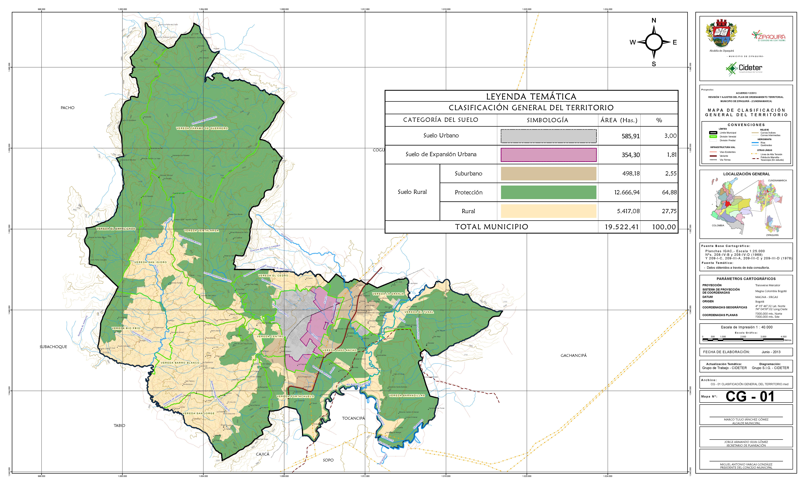

# Ordenamiento Territorial de la zona de estudio
Keywords: `soil-classification` `pot-implementation`

En esta actividad revisaremos la denominación (POT, PBOT, EOT) aplicable de ordenamiento territorial del municipio del caso de estudio en función de la población del último registro censal y evaluaremos los diferentes alcances establecidos en la Ley 388 de 1997 para los componentes general, urbano y rural, y su adopción a nivel municipal.

 Tomado de: <a href="https://www.zipaquira-cundinamarca.gov.co/planes/plan-de-ordenamiento-territorial-361636">Plan de Ordenamiento Territorial Municipio de Zipaquirá, Acuerdo 012 de 2013</a>  

## Objetivos

* Evaluar la denominación (POT, PBOT, EOT) aplicable al municipio en función de la población del último registro censal.
* Identificar los contenidos requeridos por la Ley 388 de 1997 aplicables a las diferentes denominaciones del plan de ordenamiento (POT, PBOT, EOT).
* Revisar los contenidos implementados de la Ley 33 de 1997 en los acuerdos o decretos de adopción o modificación de los planes de ordenamiento.

## Requerimientos

* Lectura - 
* Recopilación para su caso de estudio, de Acuerdos, Decretos y Resoluciones municipales de adopción del Plan de Ordenamiento Territorial, planes parciales, unidades de planeamiento zonal, unidades de actuación urbanística, asignación de tratamientos urbanísticos y demás normativa municipal.

## 1. Normatividad municipal

| Norma                                                                              | Alcance                                                                                                                                                                                                                                                                                                                                                                                                                                                                                                                                                                                                                                                                                                                                                                                                                                                                                                                                                                                                                                                                       | 
|:-----------------------------------------------------------------------------------|:------------------------------------------------------------------------------------------------------------------------------------------------------------------------------------------------------------------------------------------------------------------------------------------------------------------------------------------------------------------------------------------------------------------------------------------------------------------------------------------------------------------------------------------------------------------------------------------------------------------------------------------------------------------------------------------------------------------------------------------------------------------------------------------------------------------------------------------------------------------------------------------------------------------------------------------------------------------------------------------------------------------------------------------------------------------------------|
| Resolución CAR 1839 del 28 de Octubre de 1999                                      | Concertación suelo de expansión urbana.                                                                                                                                                                                                                                                                                                                                                                                                                                                                                                                                                                                                                                                                                                                                                                                                                                                                                                                                                                                                                                       |
| [Acuerdo Municipal 012 de 2000](../../file/data/POT/Acuerdo_012_2000_Proyecto.pdf) | Por el cual se adopta el Plan de Ordenamiento Territorial para el Municipio de Zipaquirá y se dictan otras disposiciones.                                                                                                                                                                                                                                                                                                                                                                                                                                                                                                                                                                                                                                                                                                                                                                                                                                                                                                                                                     |
| Resolución CAR 964 del 19 de Agosto de 2003                                        | Concertación suelo de expansión urbana.                                                                                                                                                                                                                                                                                                                                                                                                                                                                                                                                                                                                                                                                                                                                                                                                                                                                                                                                                                                                                                       |
| [Acuerdo Municipal 008 de 2003](../../file/data/POT/Acuerdo_008_2003_Proyecto.pdf) | Por el cual se adoptan los ajustes al plan de ordenamiento territorial para el municipio de Zipaquirá y se dictan otras disposiciones.                                                                                                                                                                                                                                                                                                                                                                                                                                                                                                                                                                                                                                                                                                                                                                                                                                                                                                                                        | 
| [Acuerdo Municipal 012 de 2013](../../file/data/POT/Acuerdo_012_2013.pdf)          | Por el cual se modifica excepcionalmente el Plan de Ordenamiento Territorial del Municipio de Zipaquirá, adoptado mediante el Acuerdo No. 012 de 2000 y ajustado mediante el Acuerdo No. 008 de 2003; y se dictan otras disposiciones.                                                                                                                                                                                                                                                                                                                                                                                                                                                                                                                                                                                                                                                                                                                                                                                                                                        | 
| [Acuerdo Municipal 023 de 2020](../../file/data/POT/Acuerdo_023_2020.pdf)          | Por medio del cual se hace un ajuste excepcional al Plan de Ordenamiento Territorial del Municipio de Zipaquirá - Cundinamarca, adoptado mediante el Acuerdo 012 de 2013 por el cual se modifica excepcionalmente el Plan de Ordenamiento Territorial del Municipio de Zipaquirá, adoptado mediante el Acuerdo No. 012 de 2000 y ajustado mediante el Acuerdo No. 008 de 2003 y se dictan otras disposiciones, incorporando al perímetro urbano del municipio de Zipaquirá un predio localizado en suelo rural suburbano para la construcción de vivienda de interés prioritario.  Predio localizado en la Vereda Paso Ancho identificado con Cedula Catastral No.: 00-00-0004-3646-000, folio de Matricula Inmobiliaria 176 -151793, predio denominado Lote 28 ubicado en Suelo Suburbano - Área Institucional, Servicios de Dotación Urbana y Servicios al Transporte, sector que concentra el suelo rural suburbano del Municipio y que por su cercanía con el perímetro urbano cuenta con disponibilidad inmediata de conexión de servicios públicos domiciliarios. |

Para la evaluación del alcance y cumplimiento de los componentes definidos en la Ley 388 de 1997, cada uno de los numerales siguientes contiene una tabla de análisis en la que se revisan y evalúan:

| Columna             | Alcance de evaluación                                                                                                            |
|:--------------------|:---------------------------------------------------------------------------------------------------------------------------------|
| Acción o alcance    | Contenidos explícitos solicitados en la Ley 388 de 1997.                                                                         |
| Art. Ley 388/97     | Artículos en los que se definen alcances específicos para cada componente.                                                       |
| POT                 | Indica si aplica a municipios con denominación de Plan de Ordenamiento Territorial.                                              |
| PBOT                | Indica si aplica a municipios con denominación de Plan Básico de Ordenamiento Territorial.                                       |
| EOT                 | Indica si aplica a municipios con denominación de Esquema de Ordenamiento Territorial.                                           |
| Alcance SIG         | Elementos a ser desarrollados o evaluados mediante tecnologías de sistemas de información geográfica.                            |
| Mapa POT municipal  | Mapa incluído en la cartografía oficial del municipio que contiene la localización o delimitación de los elementos geográficos.  |

## 2. Revisión de denominación de ordenamiento (POT, PBOT, EOT)

Población y dinámica de crecimiento urbano

| Parámetro                      | Valor o condición                                                                   |
|--------------------------------|-------------------------------------------------------------------------------------|
| Población                      | 128968 (correspondiente al último registro censal DANE del año 2018)                |
| Dinámica de crecimiento urbano | Importante (debido al desarrollo masivo de proyectos de vivienda de interés social) |

| Denominación                                    | Población                        | Aplica  | Adoptado |
|:------------------------------------------------|:---------------------------------|:-------:|:--------:|
| POT - Plan de ordenamiento territorial          | Superior a 100000 habitantes     |    ✓    |    Sí    |
| PBOT - Plan básico de ordenamiento territorial  | Entre 30000 y 100000 habitantes  |         |          |
| EOT - Esquema de ordenamiento territorial       | Inferior a 30000 habitantes      |         |          |

> Dentro del análisis se debe considerar que si el municipio tiene una población interior a 30000 habitantes y una dinámica importante de crecimiento poblacional, puede implementar un PBOT en vez de un EOT según el Art. 17 Ley 388 de 1997.

## 3. Evaluación Componente General

**Alcance de este componente**: contiene los objetivos y estrategias territoriales que complementarán diferentes acciones desde el punto de vista del manejo territorial, el desarrollo municipal y distrital. Contenido relacionado con la estructura urbano-rural e intraurbana con la correspondiente identificación de la naturaleza de las infraestructuras, redes de comunicación y servicios, así como otros elementos o equipamientos estructurantes de gran escala.

**Se evalúan**: objetivos, estrategias y contenidos estructurales de largo plazo.

| Acción o alcance                                                                                                                                                                                                                                                                                                                                                                                                                                                                                                                                                                                                                                                                                                                                                                                                                                                                                                                                                                                                                                  | Art. Ley 388/97        | POT  | PBOT | EOT  | Alcance SIG                                                                                                                                                                                                                                                                                                                                                                                                                                                                                                                                                         | Mapa POT municipal                                                                                                                                                                                                                                                                                                                                                                                                                                                                                                                                                 |
|---------------------------------------------------------------------------------------------------------------------------------------------------------------------------------------------------------------------------------------------------------------------------------------------------------------------------------------------------------------------------------------------------------------------------------------------------------------------------------------------------------------------------------------------------------------------------------------------------------------------------------------------------------------------------------------------------------------------------------------------------------------------------------------------------------------------------------------------------------------------------------------------------------------------------------------------------------------------------------------------------------------------------------------------------|------------------------|------|------|------|---------------------------------------------------------------------------------------------------------------------------------------------------------------------------------------------------------------------------------------------------------------------------------------------------------------------------------------------------------------------------------------------------------------------------------------------------------------------------------------------------------------------------------------------------------------------|--------------------------------------------------------------------------------------------------------------------------------------------------------------------------------------------------------------------------------------------------------------------------------------------------------------------------------------------------------------------------------------------------------------------------------------------------------------------------------------------------------------------------------------------------------------------|
| 1. Los objetivos y estrategias territoriales de largo y mediano plazo que complementarán, desde el punto de vista del manejo territorial, el desarrollo municipal y distrital, principalmente en los siguientes aspectos:                                                                                                                                                                                                                                                                                                                                                                                                                                                                                                                                                                                                                                                                                                                                                                                                                         | 12, 16                 | ✓    | ✓    | ✓    |                                                                                                                                                                                                                                                                                                                                                                                                                                                                                                                                                                     |                                                                                                                                                                                                                                                                                                                                                                                                                                                                                                                                                                    |
| 1.1 Identificación y localización de las acciones sobre el territorio que posibiliten organizarlo y adecuarlo para el aprovechamiento de sus ventajas comparativas y su mayor competitividad.                                                                                                                                                                                                                                                                                                                                                                                                                                                                                                                                                                                                                                                                                                                                                                                                                                                     | 12, 16                 | ✓    | ✓    | ✕    | Localización de acciones prioritarias sobre el territorio a ordenar.                                                                                                                                                                                                                                                                                                                                                                                                                                                                                                | DU-02 Zonificación de amenazas naturales y atrópicas en suelo urbano.                                                                                                                                                                                                                                                                                                                                                                                                                                                                                              |
| 1.2 Definición de las acciones territoriales estratégicas necesarias para garantizar la consecución de los objetivos de desarrollo económico y social del municipio o distrito.                                                                                                                                                                                                                                                                                                                                                                                                                                                                                                                                                                                                                                                                                                                                                                                                                                                                   | 12                     | ✓    | ✕    | ✕    |                                                                                                                                                                                                                                                                                                                                                                                                                                                                                                                                                                     |                                                                                                                                                                                                                                                                                                                                                                                                                                                                                                                                                                    |
| 1.3 Adopción de las políticas de largo plazo para la ocupación, aprovechamiento y manejo del suelo y del conjunto de los recursos naturales.                                                                                                                                                                                                                                                                                                                                                                                                                                                                                                                                                                                                                                                                                                                                                                                                                                                                                                      | 12                     | ✓    | ✕    | ✕    |                                                                                                                                                                                                                                                                                                                                                                                                                                                                                                                                                                     |                                                                                                                                                                                                                                                                                                                                                                                                                                                                                                                                                                    |
| 2. Contenido Estructural, el cual deberá establecer, en desarrollo y concreción de los aspectos señalados en el numeral 1º de este artículo, la estructura urbano-rural e intraurbana que se busca alcanzar a largo plazo, con la correspondiente identificación de la naturaleza de las infraestructuras, redes de comunicación y servicios, así como otros elementos o equipamientos estructurantes de gran escala. En particular se deberán especificar:                                                                                                                                                                                                                                                                                                                                                                                                                                                                                                                                                                                       | 8, 12, 16              | ✓    | ✓    | ✕    |                                                                                                                                                                                                                                                                                                                                                                                                                                                                                                                                                                     |                                                                                                                                                                                                                                                                                                                                                                                                                                                                                                                                                                    |
| 2.1 Los sistemas de comunicación entre el área urbana y el área rural y su articulación con los respectivos sistemas regionales.                                                                                                                                                                                                                                                                                                                                                                                                                                                                                                                                                                                                                                                                                                                                                                                                                                                                                                                  | 12, 16                 | ✓    | ✓    | ✕    | Red vial proyectada con conexión entre el área urbana y rural articulada a la red regional.                                                                                                                                                                                                                                                                                                                                                                                                                                                                         | DR-12 Sistema vial rural.  CR-03 Plan vial rural.                                                                                                                                                                                                                                                                                                                                                                                                                                                                                                            |
| 2.2 El señalamiento de las áreas de reserva y medidas para la protección del medio ambiente, conservación de los recursos naturales y defensa del paisaje, de conformidad con lo dispuesto en la Ley 99 de 1993 y el Código de Recursos Naturales, así como de las áreas de conservación y protección del patrimonio histórico, cultural y arquitectónico.  Identificar y caracterizar los ecosistemas de importancia ambiental del municipio, de común acuerdo con la autoridad ambiental de la respectiva jurisdicción, para su protección y manejo adecuados                                                                                                                                                                                                                                                                                                                                                                                                                                                                             | 8, 12, 16              | ✓    | ✓    | ✕    | Delimitación de áreas de reserva, conservación de recursos naturales, defensa del paisaje (geomorfología), protección del patrimonio urbano (tratamiento de conservación urbanística) y patromonio rural.  Identificación y caracterización de los ecosistemas de importancia ambiental del municipio.                                                                                                                                                                                                                                                        | DR-01a Categorías de protección y desarrollo restringido en suelo rural.  CG-03 Categorías de protección y desarrollo restringido en suelo rural.  CG-04 Estructura ecológica principal urbana.  CG-08 Estructura ecológica principal rural.  DR-13 Equipamientos colectivos rurales y elementos patrimoniales.  CU-02 Tratamientos en suelo urbano y de expansión urbana.  DR-04 Geomorfología.                                                                                                                               |
| 2.3 La determinación y ubicación en planos de las zonas que presenten alto riesgo para la localización de asentamientos humanos, por amenazas o riesgos naturales o por condiciones de insalubridad.  PBOT: se realiza inventario.                                                                                                                                                                                                                                                                                                                                                                                                                                                                                                                                                                                                                                                                                                                                                                                                          | 8, 12, 16              | ✓    | ✓    | ✕    | Delimitación de zonas en alto riesgo para localización de asentamientos humanos por amenazas o riesgos naturales, o por condiciones de insalubridad.                                                                                                                                                                                                                                                                                                                                                                                                                | DR-15 Asentamientos humanos.  CG-02 Asentamientos humanos.  DU-02 Zonificación de amenazas naturales y atrópicas en suelo urbano.                                                                                                                                                                                                                                                                                                                                                                                                                      |
| 2.4 La localización de actividades, infraestructuras y equipamientos básicos para garantizar adecuadas relaciones funcionales entre asentamientos y zonas urbanas y rurales.  Localizar y señalar las características de la infraestructura para disposición y tratamiento de los residuos sólidos, líquidos, tóxicos y peligrosos.  Localizar y señalar las características de la infraestructura equipamientos de servicios de interés público y social ( tales como centros docentes y hospitalarios, aeropuertos y lugares análogos).  Determinar y reservar terrenos para la expansión de las infraestructuras urbanas.  Expropiar los terrenos y las mejoras cuya adquisición se declare como de utilidad pública o interés social.  Identificar y localizar, cuando lo requieran las autoridades nacionales y previa concertación con ellas, los suelos para la infraestructura militar y policial estratégica básica para la atención de las necesidades de seguridad y de defensa nacional. (condicionado) | 8, 12, 16              | ✓    | ✓    | ✕    | Localización de actividades, infraestructuras y equipamientos básicos para garantizar adecuadas relaciones funcionales entre asentamientos y zonas urbanas y rurales.  Localización de infraestructura para la disposición y tratamiento de residuos (p. ej., zonas libres PTAR).  Localización de terrenos en reserva para expansión de infraestructuras urbanas, terrenos y mejoras declarados como de utilidad pública o interés social.  Localización de suelos para la infraestructura militar y policial estratégica básica (condicionado). | DR-13 Equipamientos colectivos rurales y elementos patrimoniales.  DU-07 Sistemas urbanos de espacio público y equipamientos colectivos.  CU-03 Áreas de actividad en suelo urbano y de expansión urbana.  CR-01 Áreas de actividad en suelo rural.  CR-02a Áreas de actividad en Centros Poblados Rurales.  CR-02b Áreas de actividad en Centros Poblados Rurales.  DR-01a Categorías de protección y desarrollo restringido en suelo rural.  DR-01b Áreas protegidas.  CG-05 Modelo de ocupación del territorio. |
| 2.5 La clasificación del territorio en suelo urbano (zona urbana consolidada  con inclusión centros poblados de corregimientos), de expansión urbana (definido en programas de ejecución, inclusión de áreas de desarrollo concertado) y rural (suburbano, protección, rural), con la correspondiente fijación del perímetro del suelo urbano, en los términos en que estas categorías quedan definidas en el Capítulo IV de la presente ley, y siguiendo los lineamientos de las regulaciones del Ministerio del Medio Ambiente en cuanto a usos del suelo, exclusivamente en los aspectos ambientales y de conformidad con los objetivos y criterios definidos por las Areas Metropolitanas en las normas obligatoriamente generales, para el caso de los municipios que las integran.  Perímetro urbano no mayor al perímetro de servicios públicos o sanitario.  En el suelo suburbano se incluyen opcionalmente los corredores urbanos interregionales.  EOT: División del territorio en suelo urbano y rural.             | 12, 16, 17, 31, 32, 34 | ✓    | ✓    | ✓    | Delimitación y clasificación del territorio: urbano, expansión urbana y rural.  Delimitación perímetro de servicios públicos o sanitario (verificar que el área urbana no exceda este perímetro).  Límites y división política rural (veredas).  Predios de propiedad del Municipio.  Modelo de ocupación del territorio - MOT.                                                                                                                                                                                                             | CG-01 Clasificación general del territorio.  DR-01a Categorías de protección y desarrollo restringido en suelo rural.  CG-03 Categorías de protección y desarrollo restringido en suelo rural.  DU-13 Perímetro y división política urbana.  DR-14 Clasificación general del territorio.  DR-16 Límites y división política rural.  CG-06 División política rural.  CG-07 División política urbana.  DR-17 Predios de propiedad del Municipio.                                                                     |

> Dentro de la cartografía oficial no se pudo encontrar un mapa con la delimitación perímetro de servicios públicos o sanitario para verificar que el área urbana no exceda este perímetro. En el Acuerdo 012 de 2003, se especifica la cobertura sobre toda el área urbana y de expansión, sin embargo, no existe un mapa de verificación.
>
> Algunos usos del suelo identificados: residencial, comercial y de servicios, dotacional, recreacional, industrial, agropecuario, forestal protector productor y minero.

## 4. Evaluación Componente Urbano

**Alcance de este componente**: Instrumento para la administración del desarrollo y la ocupación del espacio físico clasificado como suelo urbano y suelo de expansión urbana, que integra políticas de mediano y corto plazo, procedimientos e instrumentos de gestión y normas urbanísticas.

**Se evalúan**: políticas, acciones, programas y normas para encauzar y administrar el desarrollo físico urbano y de expansión urbana.

| Acción o alcance                                                                                                                                                                                                                                                                                                                                                                                                                                                                                                                                                                                                                                                                                                                                                                                                                                                                                                                                                                                                                                                                        | Art. Ley 388/97       | POT  | PBOT | EOT  | Alcance SIG                                                                                                                                                                                                                                                                                                                                                                                                   | Mapa POT municipal                                                                                                                                                                                                                                                                                                                                                                                                                                                                    |
|-----------------------------------------------------------------------------------------------------------------------------------------------------------------------------------------------------------------------------------------------------------------------------------------------------------------------------------------------------------------------------------------------------------------------------------------------------------------------------------------------------------------------------------------------------------------------------------------------------------------------------------------------------------------------------------------------------------------------------------------------------------------------------------------------------------------------------------------------------------------------------------------------------------------------------------------------------------------------------------------------------------------------------------------------------------------------------------------|-----------------------|------|------|------|---------------------------------------------------------------------------------------------------------------------------------------------------------------------------------------------------------------------------------------------------------------------------------------------------------------------------------------------------------------------------------------------------------------|---------------------------------------------------------------------------------------------------------------------------------------------------------------------------------------------------------------------------------------------------------------------------------------------------------------------------------------------------------------------------------------------------------------------------------------------------------------------------------------|
| 1. Las políticas de mediano y corto plazo sobre uso y ocupación del suelo urbano y de las áreas de expansión, en armonía con el modelo estructural de largo plazo adoptado en el componente general y con las previsiones sobre transformación y crecimiento espacial de la ciudad.                                                                                                                                                                                                                                                                                                                                                                                                                                                                                                                                                                                                                                                                                                                                                                                                     | 8, 13, 31             | ✓    | ✕    | ✕    |                                                                                                                                                                                                                                                                                                                                                                                                               |                                                                                                                                                                                                                                                                                                                                                                                                                                                                                       |
| 2. La localización y dimensionamiento de la infraestructura para el sistema vial, de transporte y la adecuada intercomunicación de todas las áreas urbanas y la proyectada para las áreas de expansión; la disponibilidad de redes primarias y secundarias de servicios públicos (energía, acueducto, alcantarillado, gas, comunicación) a corto y mediano plazo; la localización prevista para los equipamientos colectivos y espacios libres para parques y zonas verdes públicas de escala urbana o zonal (espacio público), y el señalamiento de las cesiones urbanísticas gratuitas correspondientes a dichas infraestructuras.  EOT: la estructura general del suelo urbano, en especial, el plan vial y de servicios públicos domiciliarios.                                                                                                                                                                                                                                                                                                                               | 8, 13, 16, 17, 31, 37 | ✓    | ✓    | ✓    | Plan vial.  Sistema de transporte y movilidad.  Sistema de acueducto.  Sistema de alcantarillado.  Rutas de aseo.  Red energía eléctrica.  Red gas natural.  Redes de telecomunicaciones.  Localización o delimitación de equipamientos.  Sistema de espacio público (parques y zonas verdes públicas).                                                 | DU-05 Sistema vial urbano existente.  DU-06 Sistema vial urbano proyectado en POT vigente y plan de movilidad.  CU-04 Plan vial en suelo urbano y de expansión urbana.  DU-03 Sistema urbano de acueducto.  DU-04 Sistema urbano de alcantarillado.  DU-07 Sistemas urbanos de espacio público y equipamientos colectivos.  CU-06 Plan de equipamientos comunitarios.  CU-05 Plan de espacio público en suelo urbano y de expansión urbana. |
| 3. La delimitación, en suelo urbano y de expansión urbana, de las áreas de conservación y protección de los recursos naturales, paisajísticos y de conjuntos urbanos, históricos y culturales, de conformidad con la legislación general aplicable a cada caso y las normas específicas que los complementan en la presente ley; así como de las áreas expuestas a amenazas y riesgos naturales.  EOT: la determinación de las zonas de amenazas y riesgos naturales y las medidas de protección, las zonas de conservación y protección de recursos naturales y ambientales.                                                                                                                                                                                                                                                                                                                                                                                                                                                                                                     | 8, 13, 16, 17, 35     | ✓    | ✓    | ✓    | Delimitación urbana de las áreas de conservación y protección de los recursos naturales (rondas hídricas), paisajísticos y de conjuntos urbanos, históricos y culturales (tratamieno de conservación).  Delimitación urbana de áreas expuestas a amenazas y riesgos naturales.  Delimitación de la estructura ecológica principal.  Perímetro y división política urbana (barrios, comunas). | CU-03 Áreas de actividad en suelo urbano y de expansión urbana (incluye las rondas hídricas).  DU-02 Zonificación de amenazas naturales y atrópicas en suelo urbano.  DU-10 Ocupación en áreas de ronda.  DU-01 Estructura ecológica principal urbana.  DU-13 Perímetro y división política urbana.  CU-02 Tratamientos en suelo urbano y de expansión urbana.                                                                                          |
| 4. La determinación, en suelo urbano y de expansión urbana, de las áreas objeto de los diferentes tratamientos y actuaciones urbanísticas.                                                                                                                                                                                                                                                                                                                                                                                                                                                                                                                                                                                                                                                                                                                                                                                                                                                                                                                                              | 13                    | ✓    | ✕    | ✕    | Delimitación de áreas de tratamientos y de actuación urbanística.                                                                                                                                                                                                                                                                                                                                             | CU-02 Tratamientos en suelo urbano y de expansión urbana.                                                                                                                                                                                                                                                                                                                                                                                                                             |
| 5. La estrategia de mediano plazo para el desarrollo de programas de vivienda de interés social, incluyendo los de mejoramiento integral (zonas con procesos de urbanización incompletos), la cual incluirá directrices y parámetros para la localización en suelos urbanos y de expansión urbana, de terrenos necesarios para atender la demanda de vivienda de interés social, y el señalamiento de los correspondientes instrumentos de gestión; así como los mecanismos para la reubicación de los asentamientos humanos localizados en zonas de alto riesgo para la salud e integridad de sus habitantes, incluyendo la estrategia para su transformación para evitar su nueva ocupación.                                                                                                                                                                                                                                                                                                                                                                                          | 8, 13, 16, 31         | ✓    | ✓    | ✕    | Delimitación de terrenos para vivienda de interés social y terrenos para reubicación de asentamientos localizados en zonas de alto riesgo.                                                                                                                                                                                                                                                                    | CU-08 Localización de áreas para VIS y VIP.  DR-15 Asentamientos humanos.  DU-02 Zonificación de amenazas naturales y atrópicas en suelo urbano.                                                                                                                                                                                                                                                                                                                          |
| 6. Las estrategias de crecimiento y reordenamiento de la ciudad, definiendo sus prioridades, y los criterios, directrices y parámetros para la identificación y declaración de los inmuebles y terrenos de desarrollo o construcción prioritaria.                                                                                                                                                                                                                                                                                                                                                                                                                                                                                                                                                                                                                                                                                                                                                                                                                                       | 8, 13, 52             | ✓    | ✕    | ✕    | Delimitación de inmuebles y terrenos de desarrollo o construcción prioritaria.                                                                                                                                                                                                                                                                                                                                | CU-08 Localización de áreas para VIS y VIP.                                                                                                                                                                                                                                                                                                                                                                                                                                           |
| 7. La determinación de las características de las unidades de actuación urbanística, tanto dentro del suelo urbano como dentro del suelo de expansión cuando a ello hubiere lugar, o en su defecto el señalamiento de los criterios y procedimientos para su caracterización, delimitación e incorporación posterior.                                                                                                                                                                                                                                                                                                                                                                                                                                                                                                                                                                                                                                                                                                                                                                   | 8, 13, 39             | ✓    | ✕    | ✕    | Localización de unidades de actuación urbanística (condicionado al desarrollo de planes parciales)                                                                                                                                                                                                                                                                                                            |                                                                                                                                                                                                                                                                                                                                                                                                                                                                                       |
| 8. La especificación, si es del caso, de la naturaleza, alcance y área de operación de los macroproyectos urbanos cuya promoción y ejecución se contemple a corto o mediano plazo, conjuntamente con la definición de sus directrices generales de gestión y financiamiento, así como la expedición de las autorizaciones para emprender las actividades indispensables para su concreción.  Los macroproyectos urbanos son el conjunto de acciones técnicamente definidas y evaluadas, orientadas a la ejecución de una operación urbana de gran escala, con capacidad de generar impactos en el conjunto de la estructura espacial urbana de orientar el crecimiento general de la ciudad.                                                                                                                                                                                                                                                                                                                                                                                      | 13, 114               | ✓    | ✕    | ✕    | Localización de macroproyectos urbanos.                                                                                                                                                                                                                                                                                                                                                             | CG-05 Modelo de ocupación del territorio.                                                                                                                                                                                                                                                                                                                                                                                                                                                                                      |
| 9. La adopción de directrices y parámetros para la formulación de planes parciales, incluyendo la definición de acciones urbanísticas, actuaciones, instrumentos de financiación y otros procedimientos aplicables en las áreas sujetas a urbanización u operaciones urbanas por medio de dichos planes.                                                                                                                                                                                                                                                                                                                                                                                                                                                                                                                                                                                                                                                                                                                                                                                | 13, 19                | ✓    | ✕    | ✕    | Delimitación de planes parciales.  Delimitación de uso del suelo en planes parciales.                                                                                                                                                                                                                                                                                                                   | DU-15 Usos por Planes Parciales y Especiales.  CU-07 Plan parcial La Fraguita.                                                                                                                                                                                                                                                                                                                                                                                                  |
| 10. La definición de los procedimientos e instrumentos de gestión y actuación urbanística requeridos para la administración y ejecución de las políticas y decisiones adoptadas, así como de los criterios generales para su conveniente aplicación, de acuerdo con lo que se establece en la presente ley, incluida la adopción de los instrumentos para financiar el desarrollo urbano, tales como la participación municipal o distrital en la plusvalía, la emisión de títulos de derechos adicionales de construcción y desarrollo y los demás contemplados en la Ley 9ª de 1989.                                                                                                                                                                                                                                                                                                                                                                                                                                                                                                  | 13, 16                | ✓    | ✓    | ✕    | Identificación de predios objeto de plusvalía.                                                                                                                                                                                                                                                                                                                                                                |                                                                                                                                                                                                                                                                                                                                                                                                                                                                                       |
| 11. La expedición de normas urbanísticas en los términos y según los alcances que se establecen en el artículo 15 de la presente ley.  PBOT: La expedición de normas urbanísticas generales sobre usos e intensidad de usos del suelo, actuaciones, tratamientos y procedimientos de parcelación, urbanización, construcción e incorporación al desarrollo de las diferentes zonas comprendidas dentro del perímetro urbano y el suelo de expansión. Se incluirán especificaciones de cesiones urbanísticas, aislamientos, volumetrías y alturas; la determinación de las zonas de mejoramiento integral, si las hay, y las demás que consideren convenientes las autoridades distritales o municipales.  EOT: normas urbanísticas requeridas para las actuaciones de parcelación, urbanización y construcción.  Áreas morfológicas urbanas (numeral 8 del artículo 10 del Decreto Nacional 879 de 1998): zonas que tienen características análogas en cuanto a las tipologías de edificación, así como por los usos e índices derivados de su trama urbana original. | 13, 16, 17            | ✓    | ✓    | ✓    | Polígonos usos actuales del suelo urbano.  Polígonos conflictos usos suelo urbano.  Polígonos usos proyectados del suelo urbano.  Polígonos altura en edificaciones.  Delimitación de áreas y unidades morfológicas.  Delimitación de áreas de actividad.                                                                                                                       | DU-08 Uso actual de suelo urbano.  DU-09 Conflictos por uso del suelo urbano.  DU-14 Conflictos POT vigente y expectativas ajuste.  DU-11 Altura de edificaciones.  DU-12 Unidades morfológicas homogéneas.  CU-01 Áreas morfológicas homogéneas en suelo urbano y de expansión urbana.  CU-03 Áreas de actividad en suelo urbano y de expansión urbana.                                                                                          |

> Dentro de la cartografía oficial no se pudieron encontrar mapas de: rutas de aseo, red de energía eléctrica, red de gas natural, redes de telecomunicaciones, la localización de los terrenos para reubicación de asentamientos localizados en zonas de alto riesgo y la dentificación de predios objeto de plusvalía.

## 5. Evaluación Componente Rural

**Alcance de este componente**: Instrumento para garantizar la adecuada interacción entre los asentamientos rurales y la cabecera municipal, la conveniente utilización del suelo rural y las actuaciones públicas tendientes al suministro de infraestructuras y equipamientos básicos para el servicio de los pobladores rurales.

**Se evalúan**: políticas, acciones, programas y normas para orientar y garantizar la adecuada interacción entre los asentamientos rurales y la cabecera municipal, así como la conveniente utilización del suelo.

| Acción o alcance                                                                                                                                                                                                                                                                                                                                                                                                                                                                                                | Art. Ley 388/97 | POT  | PBOT | EOT  | Alcance SIG                                                                                                                                                                                                                                                                                                                                                                                                                                                                                                                                                                                                                                                                                                                                                                                                                         | Mapa POT municipal                                                                                                                                                                                                                                                                                                                                                                                                                                                                                                                                                                                                                                                                                                                                              |
|-----------------------------------------------------------------------------------------------------------------------------------------------------------------------------------------------------------------------------------------------------------------------------------------------------------------------------------------------------------------------------------------------------------------------------------------------------------------------------------------------------------------|-----------------|------|------|------|-------------------------------------------------------------------------------------------------------------------------------------------------------------------------------------------------------------------------------------------------------------------------------------------------------------------------------------------------------------------------------------------------------------------------------------------------------------------------------------------------------------------------------------------------------------------------------------------------------------------------------------------------------------------------------------------------------------------------------------------------------------------------------------------------------------------------------------|-----------------------------------------------------------------------------------------------------------------------------------------------------------------------------------------------------------------------------------------------------------------------------------------------------------------------------------------------------------------------------------------------------------------------------------------------------------------------------------------------------------------------------------------------------------------------------------------------------------------------------------------------------------------------------------------------------------------------------------------------------------------|
| 1. Las políticas de mediano y corto plazo sobre ocupación del suelo en relación con los asentamientos humanos localizados en estas áreas.                                                                                                                                                                                                                                                                                                                                                                       | 14, 17          | ✓    | ✓    | ✓    | Localización de asentamientos humanos.                                                                                                                                                                                                                                                                                                                                                                                                                                                                                                                                                                                                                                                                                                                                                                                              | DR-15 Asentamientos humanos.  CR-01 Áreas de actividad en suelo rural.                                                                                                                                                                                                                                                                                                                                                                                                                                                                                                                                                                                                                                                                                    |
| 2. El señalamiento de las condiciones de protección, conservación y mejoramiento de las zonas de producción agropecuaria, forestal o minera.  Destinación explotación recursos naturales (opcional).  Actividades análogas (opcional).                                                                                                                                                                                                                                                              | 14, 33          | ✓    | ✓    | ✕    | Delimitación zonas protección, conservación y mejoramiento de las zonas de producción agropecuaria, forestal o minera.                                                                                                                                                                                                                                                                                                                                                                                                                                                                                                                                                                                                                                                                                                              | CR-01 Áreas de actividad en suelo rural.  CG-05 Modelo de ocupación del territorio.                                                                                                                                                                                                                                                                                                                                                                                                                                                                                                                                                                                                                                                                       |
| 3. La delimitación de las áreas de conservación y protección de los recursos naturales, paisajísticos, geográficos y ambientales, incluyendo las áreas de amenazas y riesgos, o que formen parte de los sistemas de provisión de los servicios públicos domiciliarios o de disposición final de desechos sólidos o líquidos.  EOT: la determinación de las zonas de amenazas y riesgos naturales y las medidas de protección, las zonas de conservación y protección de recursos naturales y ambientales. | 8, 14, 17, 35   | ✓    | ✓    | ✓    | Delimitación de las áreas de conservación y protección de los recursos naturales, paisajísticos (geomorfología), geográficos (o geomorfológicos) y ambientales, incluyendo las áreas de amenazas y riesgos, o que formen parte de los sistemas de provisión de los servicios públicos domiciliarios o de disposición final de desechos sólidos o líquidos.  Delimitación de la estructura ecológica principal.  Hidrografía y delimitación de cuencas.  Mapa geomorfologico.  Mapa de suelos.  Mapa de pendientes.  Mapa de zonificación agroclimática.  Mapa de uso potenciales del suelo rural.  Mapa de cobertura y uso actual del suelo rural.  Mapa de conflictos de uso del suelo rural.  Mapa de zonificación de amenazas naturales y antrópicas en suelo rural. | CR-01 Áreas de actividad en suelo rural.  DR-01a Categorías de protección y desarrollo restringido en suelo rural.  CG-03 Categorías de protección y desarrollo restringido en suelo rural.  DR-01b Áreas protegidas.  DR-02 Estructura ecológica principal rural.  DR-03 Hidrografía y delimitación de cuencas.  DR-04 Mapa geomorfologico.  DR-05 Mapa de suelos.  DR-06 Mapa de pendientes.  DR-07 Mapa de zonificación agroclimática.  DR-08 Mapa de uso potenciales del suelo rural.  DR-09 Mapa de cobertura y uso actual del suelo rural.  DR-10 Mapa de conflictos de uso del suelo rural.  DR-11 Mapa de Zonificación de amenazas naturales y antrópicas en suelo rural. |
| 4. La localización y dimensionamiento de las zonas determinadas como suburbanas, con precisión de las intensidades máximas de ocupación y usos admitidos, las cuales deberán adoptarse teniendo en cuenta su carácter de ocupación en baja densidad, de acuerdo con las posibilidades de suministro de servicios de agua potable y saneamiento, en armonía con las normas de conservación y protección de recursos naturales y medio ambiente.                                                                  | 14              | ✓    | ✓    | ✕    | Delimitación de zonas suburbanas.  Polígonos usos del suelo.                                                                                                                                                                                                                                                                                                                                                                                                                                                                                                                                                                                                                                                                                                                                                                  | CR-01 Áreas de actividad en suelo rural.                                                                                                                                                                                                                                                                                                                                                                                                                                                                                                                                                                                                                                                                                                                        |
| 5. La identificación de los centros poblados rurales y la adopción de las previsiones necesarias para orientar la ocupación de sus suelos y la adecuada dotación de infraestructura de servicios básicos y de equipamiento social.                                                                                                                                                                                                                                                                              | 8, 14           | ✓    | ✓    | ✕    | Delimitación de centros poblados rurales.  Uso actual del suelo en Centros Poblados Rurales - CPR.  Altura de edificaciones en Centros Poblados Rurales - CPR.  Localización de equipamientos sociales.  Sistema de espacio público en centros poblados y zonas suburbanas.  Polígonos usos del suelo.                                                                                                                                                                                                                                                                                                                                                                                                                                                                                                | CR-01 Áreas de actividad en suelo rural.  CR-02a Áreas de actividad en Centros Poblados Rurales.  CR-02b Áreas de actividad en Centros Poblados Rurales.  DR-13 Equipamientos colectivos rurales y elementos patrimoniales.  DR-18 Uso actual del suelo en Centros Poblados Rurales (CPR).  DR-19 Altura de edificaciones en Centros Poblados Rurales (CPR).                                                                                                                                                                                                                                                                                                                                                                      |
| 6. La determinación de los sistemas de aprovisionamiento de los servicios de agua potable y saneamiento básico de las zonas rurales a corto y mediano plazo y la localización prevista para los equipamientos de salud y educación.                                                                                                                                                                                                                                                                             | 14              | ✓    | ✓    | ✕    | Sistemas de acueductos veredales.  Sistemas de alcantarillado rural.  Localización prevista para los equipamientos de salud y educación.                                                                                                                                                                                                                                                                                                                                                                                                                                                                                                                                                                                                                                                                                | DR-13 Equipamientos colectivos rurales y elementos patrimoniales.                                                                                                                                                                                                                                                                                                                                                                                                                                                                                                                                                                                                                                                                                               |
| 7. La expedición de normas para la parcelación de predios rurales destinados a vivienda campestre, las cuales deberán tener en cuenta la legislación agraria y ambiental.                                                                                                                                                                                                                                                                                                                                       | 14, 17          | ✓    | ✓    | ✓    | Localización de predios rurales destinados a vivienda campestre.                                                                                                                                                                                                                                                                                                                                                                                                                                                                                                                                                                                                                                                                                                                                                                    | CR-01 Áreas de actividad en suelo rural.  CG-05 Modelo de ocupación del territorio.                                                                                                                                                                                                                                                                                                                                                                                                                                                                                                                                                                                                                                                                       |

> Dentro de la cartografía oficial no se pudieron encontrar mapas de: sistemas de acueductos veredales y sistemas de alcantarillado rural. 

## Actividades de proyecto :triangular_ruler:

En la siguiente tabla se listan las actividades que deben ser desarrolladas y documentadas por cada grupo de proyecto en un único archivo de Adobe Acrobat .pdf. El documento debe incluir portada (indicando el caso de estudio, número de avance, nombre del módulo, fecha de presentación, nombres completos de los integrantes), numeración de páginas, tabla de contenido, lista de tablas, lista de ilustraciones, introducción, objetivo general, capítulos por cada ítem solicitado, conclusiones y referencias bibliográficas.

| Actividad     | Alcance                                                                                                                                                                                                                                                                   |
|:--------------|:--------------------------------------------------------------------------------------------------------------------------------------------------------------------------------------------------------------------------------------------------------------------------|
| Avance **P1** | Complete la matriz normativa de su caso de estudio incluyendo todos los Acuerdos y Decretos de adopción y ajuste del Plan de Ordenamiento e instrumentos complementarios, tales como, planes parciales, decretos de asignación de tratamientos urbanísticos, entre otros. | 
| Avance **P1** | Incluya una columna para indicar los artículos específicos del acuerdo o decreto municipal.                                                                                                                                                                               | 

> No es necesario presentar un documento de avance independiente, todos los avances de proyecto de este módulo se integran en un único documento.
> 
> En el informe único, incluya un numeral para esta actividad y sub-numerales para el desarrollo de las diferentes sub-actividades, siguiendo en el mismo orden de desarrollo presentado en esta actividad.

## Referencias

* 

## Control de versiones

| Versión    | Descripción                                                | Autor                                      | Horas |
|------------|:-----------------------------------------------------------|--------------------------------------------|:-----:|
| 2024.02.24 | Versión inicial con alcance de la actividad                | [rcfdtools](https://github.com/rcfdtools)  |   4   |
| 2024.06.27 | Investigación y documentación para caso de estudio general | [rcfdtools](https://github.com/rcfdtools)  |   8   |

_R.SIGE es de uso libre para fines académicos, conoce nuestra licencia, cláusulas, condiciones de uso y como referenciar los contenidos publicados en este repositorio, dando [clic aquí](LICENSE.md)._

_¡Encontraste útil este repositorio!, apoya su difusión marcando este repositorio con una ⭐ o síguenos dando clic en el botón Follow de [rcfdtools](https://github.com/rcfdtools) en GitHub._

| [:arrow_backward: Anterior](../xxxx) | [:house: Inicio](../../README.md) | [:beginner: Ayuda / Colabora](https://github.com/rcfdtools/R.SIGE/discussions/99999) | [Siguiente :arrow_forward:]() |
|---------------------|-------------------|---------------------------------------------------------------------------|---------------|

[^1]: 