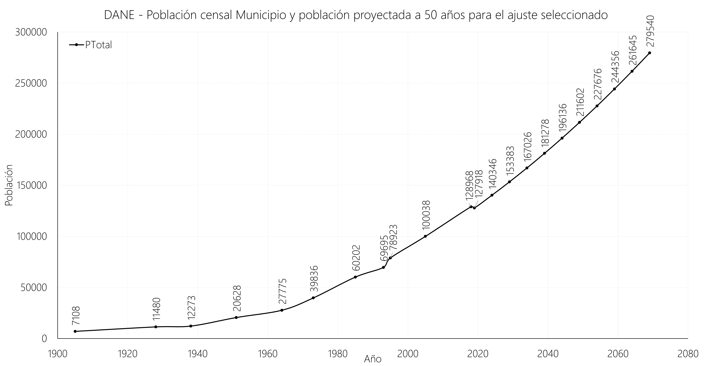
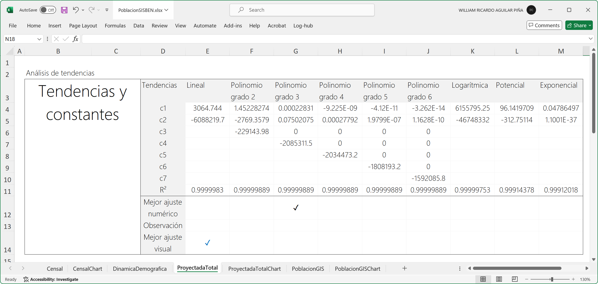

# Estudio poblacional: censos y proyecciones
Keywords: `Population` `Census` `Projection`

Corresponde a la administración municipal tener un adecuado conocimiento de la población y de sus dinámicas, ya que son el eje articulador de todos los procesos de desarrollo, teniendo como soporte físico el territorio.[^1]

 Tomado de: <a href="https://commons.wikimedia.org/wiki/File:Living_population_density.png">https://commons.wikimedia.org</a>  

## Objetivos

* Entender los elementos conceptuales y metodológicos del enfoque poblacional en el ordenamiento territorial - OT
* Investigar datos en fuentes censales y realizar proyecciones de población

## Requerimientos

* Microsoft Excel 365
* [Conocimientos básicos en estadística](https://edu.gcfglobal.org/es/estadistica-basica/)
* Lectura - [Enfoque poblacional para revisión y ajustes de Planes de Ordenamiento Territorial. Guía de aplicación. Ministerio de Ambiente, Vivienda y Desarrollo Territorial](https://colombia.unfpa.org/sites/default/files/pub-pdf/Gu%C3%ADa%20Enfoque%20Poblacional%20para%20Revisi%C3%B3n%20y%20Ajuste.pdf)
* Lectura - [Guía para análisis demográfico local - Herramientas para incluir el enfoque poblacional en los procesos de planeación del desarrollo integral](https://colombia.unfpa.org/sites/default/files/pub-pdf/Gui%CC%81a-Dina%CC%81micas-Demografi%CC%81a.pdf)
* Lectura - 
* Lectura -

## 1. Conceptos generales

### 1.1. ¿Qué es la población?

La población es entendida como **“un conjunto orgánico de sujetos que interactúan entre sí y con el territorio para su reproducción biológica y social. El concepto de población humana, se refiere a un conjunto de sujetos vivos, cuya actividad necesariamente crea y recrea permanentemente el territorio en función de sus necesidades biológicas, socioculturales y políticas y, de manera determinante, en función de la organización para la apropiación, producción y consumo de bienes materiales y no materiales”**. [^2]

Esta definición pone el acento en las relaciones entre los seres humanos y entre estos y su hábitat. La población humana tiene características propias que difieren de las características de los individuos particulares que la componen. A estas características del colectivo poblacional se les denominan características demográficas. Puesto que estas se transforman permanentemente en el tiempo hay lugar a reconocerlas como dinámica demográfica. [^3]

Para abordar adecuadamente el proceso de ordenamiento es necesario tomar en consideración la manera como la dinámica demográfica impacta los procesos sociales, económicos y ambientales del territorio, y cómo esta a su vez se ve modificada por estos procesos. A esta relación en doble sentido y en espiral se le ha denominado la
interacción entre la población y sus bases ambientales y socioeconómicas. [^4]

### 1.2. ¿Qué es la dinámica geográfica?

La población aumenta o disminuye en el tiempo. Tiene una composición por sexo, edad, etnia o condición social que también puede modificarse en el tiempo. Se localiza en un territorio y se moviliza sobre él. Este proceso de cambio permanente es lo que se denomina dinámica demográfica. [^5]

 Enfoque poblacional para revisión y ajustes de Planes de Ordenamiento Territorial. Tomado de: <a href="https://colombia.unfpa.org/sites/default/files/pub-pdf/Gui%CC%81a-Dina%CC%81micas-Demografi%CC%81a.pdf">https://colombia.unfpa.org</a>  

El crecimiento natural o vegetativo de la población resulta del balance entre los nacimientos y las defunciones que se observan en un territorio particular. La población puede también aumentar por inmigración o disminuir por emigración. El crecimiento total de la población resulta del balance entre el saldo vegetativo y el saldo migratorio. De estos factores y su constante cambio dependerá el tamaño de la población que reside en el territorio, así como su estructura por edad y sexo y su distribución espacial. [^4]

| Componente               | Alcance                                                                                                                                                                                                                                                                                                                                                                                                                                                                                                                                                                                                                                                                                                                                                                                                                                                                                                                                                                                                                                                                                                                                                                                                                                                                                                                                                                                                                                                                                                                                                                                                                                                                                                            |
|:-------------------------|:-------------------------------------------------------------------------------------------------------------------------------------------------------------------------------------------------------------------------------------------------------------------------------------------------------------------------------------------------------------------------------------------------------------------------------------------------------------------------------------------------------------------------------------------------------------------------------------------------------------------------------------------------------------------------------------------------------------------------------------------------------------------------------------------------------------------------------------------------------------------------------------------------------------------------------------------------------------------------------------------------------------------------------------------------------------------------------------------------------------------------------------------------------------------------------------------------------------------------------------------------------------------------------------------------------------------------------------------------------------------------------------------------------------------------------------------------------------------------------------------------------------------------------------------------------------------------------------------------------------------------------------------------------------------------------------------------------------------|
| Tamaño y crecimiento     | Mientras que el tamaño de población describe la magnitud de la población residente en el municipio en un momento determinado, el crecimiento informa sobre la velocidad con la que cambia el tamaño de la población y con la que cambiará a futuro.  La información sobre el tamaño poblacional es el referente obligado para que las administraciones locales puedan establecer el balance entre el número de habitantes del municipio (demanda) y la oferta disponible de bienes y servicios, de donde resultan indicadores de déficit, subutilización o suficiencia. Por otra parte, la información sobre el crecimiento vegetativo y migratorio le permite anticipar necesidades y requerimientos de la población y asegurar que los planes respondan a las necesidades futuras sin poner en riesgo su base ambiental.  _Conocer el tamaño y el crecimiento de la población ayuda a decidir sobre el suelo necesario para expansión urbana cuando sea necesario, para la determinación del número de viviendas nuevas requeridas para cubrir la demanda durante la vigencia del POT, identificar el tamaño de la red de servicios públicos (acueducto, alcantarillado, luz, teléfono, vías, comunicaciones), definir los requerimientos de bienes y servicios ambientales, el tamaño de las infraestructuras necesarias para educación y salud, la magnitud de las áreas e infraestructuras de soporte para las actividades económicas y de generación de oportunidades de empleo, la cantidad de vías y espacio público que se requiere, entre otros aspectos. La oferta de bienes y servicios institucionales y ambientales deberá ajustarse respondiendo al cambio poblacional y sus demandas._ |
| Estructura y composición | Puesto que los individuos que componen una población son diversos en sus características, es necesario considerar su estructura por edad y sexo. La estructura poblacional permite determinar demandas específicas de bienes y servicios en temas como educación, salud, oportunidades económicas, atención a grupos en situación de vulnerabilidad, protección de la familia y la niñez entre otros. Conocer la estructura de la población por edad y sexo ayuda a definir no solo las necesidades de servicios por grupos específicos etarios, entre otros, sino identificar también el potencial poblacional del municipio y las oportunidades que un determinado crecimiento y una estructura particular pueden significar para el desarrollo local.  _Con la estructura y composición se podrán dimensionar y determinar por zonas del municipio los tipos de equipamientos de educación, salud, cultura, deporte, bienestar y protección social requeridos._                                                                                                                                                                                                                                                                                                                                                                                                                                                                                                                                                                                                                                                                                                                                           |
| Distribución espacial    | El análisis de la distribución de la población en el territorio permite establecer la localización de las demandas de recursos físicos y ambientales como agua, suelo, alcantarillado, energía eléctrica, espacio público, infraestructura de transporte, infraestructura social (colegios, centros de salud) y equipamientos comunitarios y económicos (empresas, servicios financieros, servicios relacionados con la producción). Conocer donde se concentra la población permite identificar, señalar, localizar y delimitar el uso del suelo y establecer normas urbanísticas (alturas, densidades, cesiones y otros). [^6]  _Tener en consideración la distribución espacial de la población permitirá tener elementos de juicio para la definición de densidades poblacionales adecuadas al modelo de ocupación del territorio deseado. Ello plantea la búsqueda del equilibrio en las diferentes áreas del territorio de tal forma que las decisiones de ordenamiento permitan encontrar estrategias para superar los problemas o aprovechar las potencialidades que plantean la concentración o la dispersión de la población._                                                                                                                                                                                                                                                                                                                                                                                                                                                                                                                                                                     |
| Movilidad                | La movilidad hace referencia al desplazamiento de carácter temporal, estacional o intermitente de población residente y no residente en el municipio que hace uso del territorio en función de sus actividades. Es necesario precisar no solo la magnitud sino las razones de movilidad (salud, educación, trabajo, negocios) de la población a fin dimensionar adecuadamente la oferta de áreas y servicios según las necesidades.  _La información sobre movilidad de la población permite hacer una buena definición de suelo urbano, rural y de expansión y de los usos asociados. El conocimiento de la movilidad de la población dentro del municipio, y desde o hacia otros territorios vecinos, permite definir no sólo los equipamientos intramunicipales, sino también la necesidad de mejorar la conectividad entre áreas urbanas y rurales y de éstos con el nivel regional._                                                                                                                                                                                                                                                                                                                                                                                                                                                                                                                                                                                                                                                                                                                                                                                                                    |

### 1.3. ¿Qué es el enfoque poblacional?

Los cambios en el tamaño, crecimiento, estructura, localización o movilidad de la población municipal influyen sobre las condiciones socioeconómicas y ambientales en el territorio, de la misma manera que éstas afectan la dinámica demográfica. En la planeación del territorio las relaciones entre la dinámica demográfica y los demás aspectos del desarrollo (socioeconómicos y ambientales) no son evidentes a primera vista, por lo que es necesario hacer un esfuerzo para identificarlas y comprenderlas mejor. El enfoque poblacional ayuda a abordar los procesos de planeación del municipio desde una perspectiva integral al analizar sistemáticamente la dinámica poblacional e incorporarla en la toma de decisiones estratégicas y en la formulación de política pública. [^4]

> El ordenamiento no solo regula las relaciones entre la población y el territorio haciendo cumplir la función social y ecológica de la propiedad, sino que busca generar las condiciones para un desarrollo sostenible, equitativo, y sustentable.

| Dinámica    | Alcance                                                                                                                                                                                                                                                                                                                                                                                                                                                                         |
|:------------|:--------------------------------------------------------------------------------------------------------------------------------------------------------------------------------------------------------------------------------------------------------------------------------------------------------------------------------------------------------------------------------------------------------------------------------------------------------------------------------|
| Poblacional | Conjunto de interacciones entre la dinámica demográfica y otros factores de las dinámicas ambientales, sociales y económicas, de las cuales se derivan transformaciones tanto en la dinámica demográfica (tamaño, crecimiento, estructura, patrones de reproducción y mortalidad o en su movilidad y distribución territorial) como en las características del territorio (estructura ecológica, infraestructura, sistemas de movilidad y aprovisionamiento de servicios). [^7] |
| Ambiental   | Se refiere a los cambios que se producen en los ecosistemas, derivados de las interacciones entre el ambiente, la población y su organización socioeconómica, así como los efectos del ambiente sobre ellos. [^4]                                                                                                                                                                                                                                                               |
| Social      | Corresponde a las interacciones entre los individuos y comunidades con su base económica, demográfica y ambiental, las cuales determinan las formas de apropiación y uso del territorio para satisfacer sus necesidades sociales y culturales en ejercicio de sus derechos. [^8]                                                                                                                                                                                                |
| Económica   | Relación entre los individuos, su organización social, el ambiente y el territorio para la producción de bienes y servicios materiales y no materiales necesarios para el ejercicio de sus derechos y satisfacción de sus necesidades. [^8]                                                                                                                                                                                                                                     |

## 2. Histórico de censos poblacionales y proyección

A partir de los datos poblacionales recopilados, determinar la población futura del municipio (general, por vereda, por centro urbano principal y por centros poblados) con análisis de regresión y correlación a través de las tendencias: lineal, polinómica, logarítmica, potencial y exponencial. 

### 2.1. Libro de análisis y catálogo de objetos

#### 2.1.1. Libro de Microsoft Excel

Para el análisis de datos y proyección de población, utilizaremos un libro de Excel que contiene las siguientes hojas:

| Hoja                 | Alcance                                                                                                                                                              |
|:---------------------|:---------------------------------------------------------------------------------------------------------------------------------------------------------------------|
| Censal               | Recopilación de datos censales históricos en orden cronológico. En esta hoja se pueden registrar los valores segmentados por sexo y grupos etarios.                  |
| CensalChart          | Gráfico de registros de población.                                                                                                                                   |
| DinamicaDemografica  | Tabla de análisis de dinámica demográfica con cálculo de tasas básicas.                                                                                              |
| ProyectadaTotal      | Tablas de análisis de tendencias, ajustes y proyecciones de población para las tendencias: Lineal, Polínomica de grados 2 a 6, Logarítmica, Potencial y Exponencial. |
| ProyectadaTotalChart | Gráfico combinado con datos de población histórica y población proyectada para todos los análisis de tendencia empleados.                                            |
| PoblacionGIS         | Tabla combinada con datos de población histórica y población proyectada para la tendencia seleccionada y para su representación en GIS                               |
| PoblacionGISChart    | Gráfico combinado con datos de población histórica y población proyectada para la tendencia seleccionada.                                                            |

#### 2.1.2. Grupos etarios 

| Rango de edad [^4] | Descripción                     |
|:------------------:|:--------------------------------|
|      0-6 años      | Primera infancia                |
|     7-12 años      | Edad de educación primaria      |
|     13-18 años     | Adolescentes                    |
|     15-64 años     | Población económicamente activa |
|      60+ años      | Adultos mayores                 |

#### 2.1.3. Catálogo de objetos

Para el desarrollo de los diferentes análisis utilizaremos el siguiente catálogo de objetos para el Libro de Microsoft Excel y las tablas para visualización de datos en el SIG:

| Campo    | Definición                                                                         | Tipo       | Tabla en libro de Excel |
|:---------|------------------------------------------------------------------------------------|------------|-------------------------| 
| Fuente   | Fuente de información (DANE, SISBEN, Registraduría, otras)                         | Text (100) | Censal, PoblacionGIS    |
| Zona     | Zona geográfica que cubre el análisis (Municipio, urbano, rural, centros poblados) | Text (100) | Censal, PoblacionGIS    |
| Fecha    | Año de registro o de proyección                                                    | Short      | Censal, PoblacionGIS    |
| PTotal   | Total de población registrada o proyectada para la zona estudiada                  | Long       | Censal, PoblacionGIS    |
| PTMasc   | Población total masculina                                                          | Long       | Censal                  |
| PTFem    | Población total femenina                                                           | Long       | Censal                  |
| PTUrbano | Población total urbana                                                             | Long       | Censal                  |
| PTRural  | Población total rural dispersa                                                     | Long       | Censal                  |
| PTCPR    | Población total centros poblados rurales                                           | Long       | Censal                  |
| PT0_6    | Población total 0-6 años                                                           | Long       | Censal                  |
| PT7_12   | Población total 7-12 años                                                          | Long       | Censal                  |
| PT13_18  | Población total 13-18 años                                                         | Long       | Censal                  |
| PT15_64  | Población total 15-64 años                                                         | Long       | Censal                  |
| PT60Max  | Población total 60+ años                                                           | Long       | Censal                  |
| PM0_6    | Población masculina 0-6 años                                                       | Long       | Censal                  |
| PM7_12   | Población masculina 7-12 años                                                      | Long       | Censal                  |
| PM13_18  | Población masculina 13-18 años                                                     | Long       | Censal                  |
| PM15_64  | Población masculina 15-64 años                                                     | Long       | Censal                  |
| PM60Max  | Población masculina 60+ años                                                       | Long       | Censal                  |
| PF0_6    | Población femenina 0-6 años                                                        | Long       | Censal                  |
| PF7_12   | Población femenina 7-12 años                                                       | Long       | Censal                  |
| PF13_18  | Población femenina 13-18 años                                                      | Long       | Censal                  |
| PF15_64  | Población femenina 15-64 años                                                      | Long       | Censal                  |
| PF60Max  | Población femenina 60+ años                                                        | Long       | Censal                  |

### 2.2. Departamento Administrativo Nacional de Estadística - DANE

:open_file_folder:_[PoblacionDANE.xlsx](PoblacionDANE.xlsx)_

Fuentes de datos

* [Censos - DANE ](https://www.dane.gov.co/index.php/estadisticas-por-tema/demografia-y-poblacion)
* [Proyecciones de población - DANE](https://www.dane.gov.co/index.php/estadisticas-por-tema/demografia-y-poblacion/proyecciones-de-poblacion)

El Departamento Administrativo Nacional de Estadística -DANE- es la entidad responsable de la planeación, levantamiento, procesamiento, análisis y difusión de las estadísticas oficiales de Colombia. Perteneciente a la Rama Ejecutiva del Estado Colombiano, con más de 50 años de experiencia. Cumple con los más altos estándares de calidad. El DANE ofrece al país y al mundo más de 30 investigaciones de todos los sectores de la economía, industria, población, sector agropecuario y calidad de vida, entre otras. [^9]

Toda esta labor, sumada a la aplicación de modernas tecnologías de captura, procesamiento y difusión, así como la calidad humana de todos los que participan en el proceso de la organización, permiten al DANE fortalecer el conocimiento, la confianza y la cultura estadística de los colombianos, reafirmando su condición de líder como rector de las estadísticas en Colombia. 

#### 2.2.1. Tabla de datos censales

| Fuente | Zona      | Fecha | PTotal  |
|--------|-----------|-------|---------|
| DANE   | Municipio | 1905  | 7108    |
| DANE   | Municipio | 1928  | 11480   |
| DANE   | Municipio | 1938  | 12273   |
| DANE   | Municipio | 1951  | 20628   |
| DANE   | Municipio | 1964  | 27775   |
| DANE   | Municipio | 1973  | 39836   |
| DANE   | Municipio | 1985  | 60202   |
| DANE   | Municipio | 1993  | 69695   |
| DANE   | Municipio | 1995  | 78923   |
| DANE   | Municipio | 2005  | 100038  |
| DANE   | Municipio | 2018  | 128968  |

 Histórico municipal de censos DANE  

#### 2.2.2. Análisis de tendencias y población proyectada

 Tabla de análisis de tendencias  

 Tabla de proyecciones a partir de tendencias  

 Gráfico de proyecciones a partir de tendencias  

 Tabla de proyecciones a partir de tendencias para visualización en SIG  

 Gráfico de proyección a partir de tendencia seleccionada  

#### 2.2.3. Ejemplo de análisis de dinámica demográfica

 Análisis de dinámica demográfica  

### 2.3. Sistema de Identificación de Potenciales Beneficiarios de Programas Sociales - SISBEN

:open_file_folder:_[PoblacionSISBEN.xlsx](PoblacionSISBEN.xlsx)_

Fuentes de datos

* [Grupo SISBEN](https://www.sisben.gov.co/Paginas/consulta-tu-grupo.html)
* [Mapas y estadísticas SISBEN - Gobernación de Cundinamarca](https://mapasyestadisticas-cundinamarca-map.opendata.arcgis.com/pages/c04dca50c16e4c50a3e359b9d54a7e1f)
* [Mapas y estadísticas SISBEN - Gobernación de Cundinamarca - ArcGIS Insights](https://insights.arcgis.com/#/view/1343fd74a80645589406d7eba51ff079)
* [Datos abiertos Colombia, dataset: DNP - Sisbén Personas](https://datos.gov.co/)
* [Diccionario de datos SISBEN](https://anda.dnp.gov.co/index.php/catalog/135/data_dictionary)

El SISBEN es el Sistema de Identificación de Potenciales Beneficiarios de Programas Sociales, que permite clasificar a la población de acuerdo con sus condiciones de vida e ingresos. Esta clasificación se utiliza para focalizar la inversión social y garantizar que sea asignada a quienes más lo necesitan.

#### 2.3.1. Tabla de datos censales

| Fuente  | Zona      | Fecha | PTotal |
|---------|-----------|-------|--------|
| SISBEN  | Municipio | 2000  | 41271  |
| SISBEN  | Municipio | 2016  | 90300  |
| SISBEN  | Municipio | 2017  | 93328  |
| SISBEN  | Municipio | 2018  | 96476  |

 Histórico municipal de censos SISBEN  

> Tenga en cuenta que la información del SISBEN incluye periódicamente actualizaciones (por demanda) debidas a cambios en los núcleos familiares, lugares de residencia y cambio de condiciones de vida.

#### 2.3.2. Análisis de tendencias y población proyectada

 Tabla de análisis de tendencias  

 Tabla de proyecciones a partir de tendencias  

 Gráfico de proyecciones a partir de tendencias  

 Tabla de proyecciones a partir de tendencias para visualización en SIG  

 Gráfico de proyección a partir de tendencia seleccionada  

### 2.4. Registraduría Nacional del Estado Civil

:open_file_folder:_[PoblacionRNEC.xlsx](PoblacionRNEC.xlsx)_

Fuentes de datos

* [Registraduría Nacional del Estado Civil](https://registraduria.gov.co/)
* [Histórico de resultados electorales](https://observatorio.registraduria.gov.co)
* https://estadisticaselectorales.registraduria.gov.co/
* https://www.registraduria.gov.co/IMG/xlsx/

La Registraduría Nacional del Estado Civil es una entidad con autonomía administrativa, contractual y presupuestal, organizada de manera desconcentrada, que tiene a su cargo el registro de la vida civil e identificación de los colombianos y la realización de los procesos electorales y los mecanismos de participación ciudadana, con plenas garantías para los colombianos.

#### 2.4.1. Tabla de datos censales

| Fuente               | Zona      | Fecha | PTotal |
|----------------------|-----------|-------|--------|
| RNEC Censo Electoral | Municipio | 2019  | 90014  |
| RNEC Censo Electoral | Municipio | 2023  | 102858  |

 Histórico municipal de censos SISBEN  

> La Registraduría también dispone de información relacionada con los registros civiles de nacimientos y defunciones que pueden ser utilizados para análisis demográfico.

#### 2.4.2. Análisis de tendencias y población proyectada

 Tabla de proyecciones a partir de tendencias para visualización en SIG  

 Gráfico de proyección a partir de tendencia seleccionada  

### 2.5. Otras fuentes censales

Existen otras fuentes censales de información que pueden ayudar a entender las dinámicas poblacionales, tales como:

* Encuestas DANE a hogares
* Censos municipales
* Usuarios de servicios públicos domiciliarios

## Actividades de proyecto :triangular_ruler:

En la siguiente tabla se listan las actividades que deben ser desarrolladas y documentadas por cada grupo de proyecto en un único archivo de Adobe Acrobat .pdf. El documento debe incluir portada (indicando el caso de estudio, número de avance, nombre del módulo, fecha de presentación, nombres completos de los integrantes), numeración de páginas, tabla de contenido, lista de tablas, lista de ilustraciones, introducción, objetivo general, capítulos por cada ítem solicitado, conclusiones y referencias bibliográficas.

| Actividad     | Alcance                                                                                                                                                                                                                                                                                                                        |
|:--------------|:-------------------------------------------------------------------------------------------------------------------------------------------------------------------------------------------------------------------------------------------------------------------------------------------------------------------------------|
| Avance **P1** | Investigue, documente y realice proyecciones de población total, por género, por zona (total municipal, urbana, rural total, rural por vereda, centros poblados) hasta 50 años a partir de las fuentes censales indicadas en esta actividad (DANE, SISBEN, RNEC). Incluya tablas y gráficos de datos censales y de proyección. | 

> No es necesario presentar un documento de avance independiente, todos los avances de proyecto de este módulo se integran en un único documento.
> 
> En el informe único, incluya un numeral para esta actividad y sub-numerales para el desarrollo de las diferentes sub-actividades siguiendo en el mismo orden de desarrollo presentado en esta actividad.

## Referencias

* https://www.dane.gov.co/
* https://www.sisben.gov.co/
* https://www.registraduria.gov.co/
* [LINEST function](https://support.microsoft.com/en-us/office/linest-function-84d7d0d9-6e50-4101-977a-fa7abf772b6d)
* [Using Microsoft Excel's LINEST and INDEX functions to Extract Fitting Parameters](https://www.youtube.com/watch?v=kPe7oG4obfU)
* [Guía para análisis demográfico local - Herramientas para incluir el enfoque poblacional en los procesos de planeación del desarrollo integral. Universidad Externado de Colombia](https://colombia.unfpa.org/sites/default/files/pub-pdf/Gui%CC%81a-Dina%CC%81micas-Demografi%CC%81a.pdf)
* [Guía Metodológica 1 - Elementos Poblacionales Básicos para la planeación. Serie Población, Ordenamiento y Desarrollo. Ministerio de Ambiente, Vivienda y Desarrollo Territorial, Viceministerio de Vivienda y Desarrollo Territorial, Dirección de Desarrollo Territorial 1, República de Colombia. ](https://colaboracion.dnp.gov.co/CDT/Desarrollo%20Territorial/ELEMENTOS%20POBLACIONALES%20-%20MVCT.pdf)
* [Guía Metodológica 2 - Elementos Poblacionales Básicos para la planeación. Serie Población, Ordenamiento y Desarrollo. Ministerio de Ambiente, Vivienda y Desarrollo Territorial, Viceministerio de Vivienda y Desarrollo Territorial, Dirección de Desarrollo Territorial 1, República de Colombia. ](https://colaboracion.dnp.gov.co/CDT/Desarrollo%20Territorial/ELEMENTOS%20POBLACIONALES%202%20-%20MVCT.pdf)
* [Guía Metodológica 3 - Metodología para el análisis de tensiones, interacciones y balances en dinámicas y desarrollos poblacionales, ambientales, sociales y económicos. Serie Población, Ordenamiento y Desarrollo. Ministerio de Ambiente, Vivienda y Desarrollo Territorial, Viceministerio de Vivienda y Desarrollo Territorial, Dirección de Desarrollo Territorial 1, República de Colombia. ](https://colaboracion.dnp.gov.co/CDT/Desarrollo%20Territorial/ELEMENTOS%20POBLACIONALES%203%20-%20MVCT.pdf)
* [Enfoque poblacional para revisión y ajustes de Planes de Ordenamiento Territorial. Guía de aplicación. Ministerio de Ambiente, Vivienda y Desarrollo Territorial](https://colombia.unfpa.org/sites/default/files/pub-pdf/Gu%C3%ADa%20Enfoque%20Poblacional%20para%20Revisi%C3%B3n%20y%20Ajuste.pdf)
* https://es.wikipedia.org/wiki/Censos_de_Colombia

## Control de versiones

| Versión    | Descripción                                                | Autor                                      | Horas |
|------------|:-----------------------------------------------------------|--------------------------------------------|:-----:|
| 2024.02.24 | Versión inicial con alcance de la actividad                | [rcfdtools](https://github.com/rcfdtools)  |   4   |
| 2024.06.27 | Investigación y documentación para caso de estudio general | [rcfdtools](https://github.com/rcfdtools)  |   8   |

_R.SIGE es de uso libre para fines académicos, conoce nuestra licencia, cláusulas, condiciones de uso y como referenciar los contenidos publicados en este repositorio, dando [clic aquí](LICENSE.md)._

_¡Encontraste útil este repositorio!, apoya su difusión marcando este repositorio con una ⭐ o síguenos dando clic en el botón Follow de [rcfdtools](https://github.com/rcfdtools) en GitHub._

| [:arrow_backward: Anterior](../StudyCaseHistory/Readme.md) | [:house: Inicio](../../README.md) | [:beginner: Ayuda / Colabora](https://github.com/rcfdtools/R.SIGE/discussions/6) | [Siguiente :arrow_forward:]() |
|------------------------------------------------------------|-----------------------------------|----------------------------------------------------------------------------------|-------------------------------|

[^1]: https://colombia.unfpa.org/sites/default/files/pub-pdf/Gu%C3%ADa%20Enfoque%20Poblacional%20para%20Revisi%C3%B3n%20y%20Ajuste.pdf
[^2]: Rubiano, Norma; González, Alejandro y otros, Población y Ordenamiento Territorial, Universidad del Externado, UNFPA, MAVDT, 2003
[^3]: MAVDT, UNFPA y Universidad del Externado, Guía metodológica 3, Metodología para el análisis de tensiones, interacciones y balances en dinámicas y desarrollos poblacionales, ambientales, sociales y económicos, Serie población y ordenamiento, 2004.
[^4]: Enfoque poblacional para revisión y ajustes de Planes de Ordenamiento Territorial. Guía de aplicación. Ministerio de Ambiente, Vivienda y Desarrollo Territorial.
[^5]: UNFPA, Guía para Alcaldes: El enfoque poblacional en la planeación del desarrollo, pp. 19, 2008.
[^6]: Ver artículo 15 ley 388 de 1997.
[^7]: Universidad Externado de Colombia, Materiales didácticos curso sobre población y ordenamiento territorial, 2007
[^8]: MAVDT, UNFPA y Universidad del Externado, Guía metodológica 3, Metodología para el análisis de tensiones, interacciones y balances en dinámicas y desarrollos poblacionales, ambientales, sociales y económicos, Serie población y ordenamiento, pp.13-14, 2004; y UNFPA, Guía para Alcaldes: El enfoque poblacional en la planeación del desarrollo, pp. 20, 2008.
[^9]: https://www.dane.gov.co/files/acerca/PF.pdf

