# Representación geográfica de censos y proyecciones poblacionales, cálculo de densidad poblacional y espacio público por habitante
Keywords: `population-gis` `public-space`

A partir de la delimitación de límites geopolíticos internos y utilizando los datos de población proyectada, crear una representación visual dinámica de su crecimiento y la demanda de espacio público.                                                                                                                                                                                   

 Tomado de: <a href="Public Domain, https://commons.wikimedia.org/w/index.php?curid=479365">https://commons.wikimedia.org</a>  

## Objetivos

* Representar el crecimiento poblacional en el suelo urbano y rural definido en el Modelo de Ordenamiento Territorial - MOT a partir de los datos estadísticos y de proyección poblacional.

## Requerimientos

* [:mortar_board:Actividad](../Population/Readme.md): Estudio poblacional: censos y proyecciones
* [:mortar_board:Actividad](../POTLayer/Readme.md): Inventario de información geo-espacial recopilada del POT y diccionario de datos.
* [:toolbox:Herramienta](https://www.microsoft.com/es/microsoft-365/excel?market=bz): Microsoft Excel 365.
* [:toolbox:Herramienta](https://www.esri.com/en-us/arcgis/products/arcgis-pro/overview): ESRI ArcGIS Pro 3.3.1 o superior.
* [:toolbox:Herramienta](https://qgis.org/): QGIS 3.38 o superior.
* [:open_file_folder:PoblacionDANE_GIS.xlsx](PoblacionDANE_GIS.xlsx): libro para registro, distribución urbana y rural de población DANE censal y proyectada, cálculo de índices y caudales.

## 1. Obtención de polígono urbano y rural POT

1. Abra el proyecto de ArcGIS Pro, creado previamente y desde el menú _Insert_ cree un nuevo mapa _New Map_, renombre como _PopulationGIS_ y establezca el CRS 9377. Agregue al mapa la capa del Modelo de Ordenamiento Territorial - MOT disponible en la información recopilada del POT en la ruta `\R.SIGE\file\data\POT\Anexo_Acuerdo_012_2013\shp\MOT.shp` y ajuste la simbología a valores únicos representando el campo de atributos `SUELO`.  

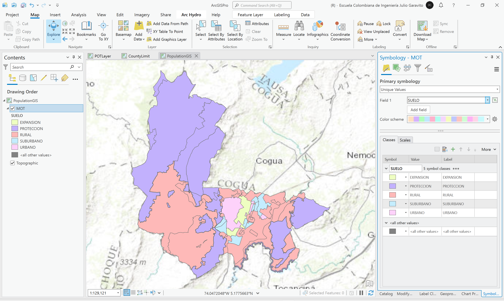

2. Utilizando la herramienta _Data Management Tools / Dissolve_, disuelva los polígonos del Modelo de Ordenamiento Territorial - MOT a partir del campo de atributos `SUELO`. Nombre la capa como `\file\shp\MOT_UrbanoRural_Dissolve.shp` y abra la tabla de atributos de la capa inicial y la capa disuelta. Podrá observar que de los 80 polígonos iniciales, hemos obtenido 5 zonas.

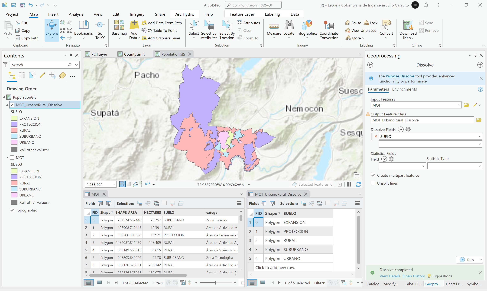

3. Para la obtención de los polígonos, urbano (urbano y expansión) y rural (rural, protección y suburbano), es necesario realizar ahora una unión de entidades o Merge.

En la tabla de atributos de la capa disuelta, seleccione los registros correspondientes a urbano y expansión. Utilice la tecla <kbd>Shift</kbd> o la tecla <kbd>Ctrl</kbd> para la selección.

En el menú superior, de clic en _Edit_, expanda el grupo de opciones _Tools_ y seleccione la herramienta _Merge_.

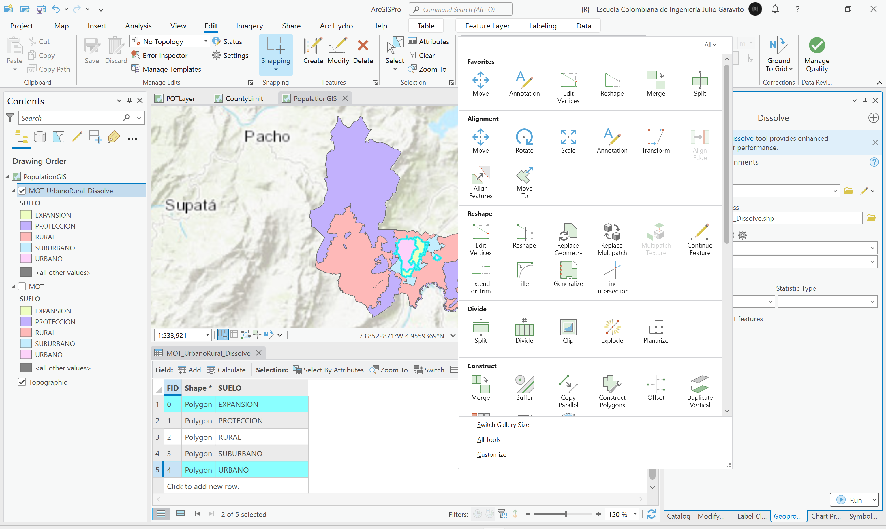

En el panel lateral derecho, de clic en el botón _Merge_ para aceptar la fusión manual de estas dos áreas. En la tabla de atributos, modifique el nombre a _Urbano_ y rotule a partir del campo `SUELO`.

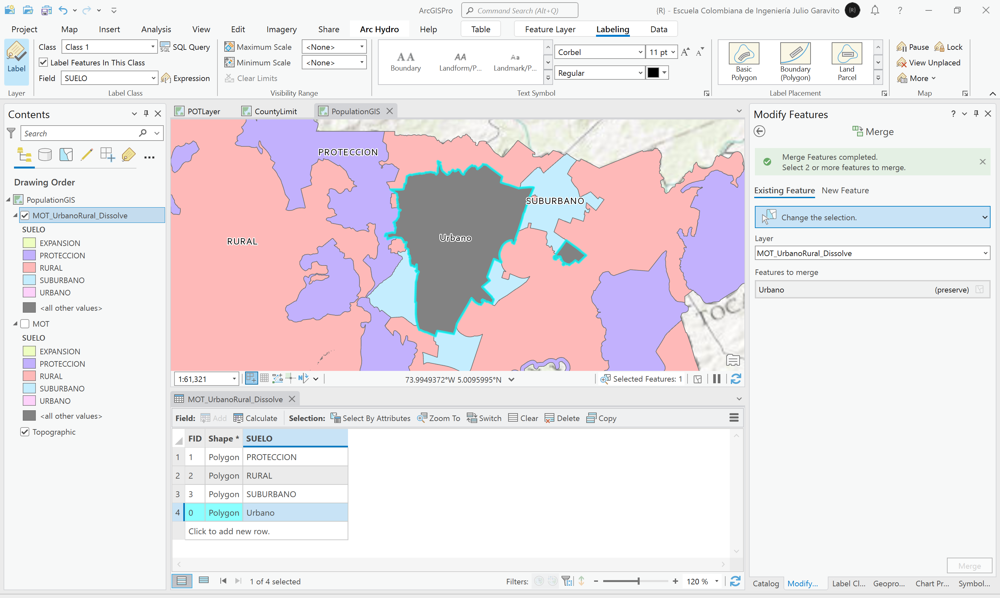

Repita el procedimiento anterior para integrar los polígonos _Rural, Protección y Suburbano_ y nombre como _Rural_. Ajuste la simpología para obtener una visualización adecuada.

> Como puede observar, el área urbana se compone de dos partes y en la tabla de atributos solo aparece un registro, este tipo de geometría se denomina _multiparte_. También podrá observar que en la zona rural existen rebordes internos correspondientes a errores de digitalización.

4. Utilizando el editor de vértices, elimine los nodos internos de la zona rural correspondientes a errores de digitalización o de construcción de la capa. Una vez eliminados, de clic en _Save_ en el menu _Edit_.

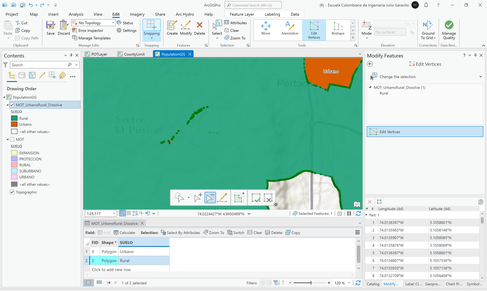

## 2. Distribución de población censal urbana y rural

A partir de la información censal analizada en la actividad [Estudio poblacional: censos y proyecciones](../Population/Readme.md), se obtuvieron solo los datos consolidados de población del municipio, pero sn distinción en urbano o rural. En la tabla de recopilación de información SISBEN, registramos en 2000 y 2018, datos distribuídos de población por zonas en urbano, rural y centros poblados rurales; a partir de los porcentajes de distribución de estos valores, realizaremos la distribución de los datos censales DANE, tal como se muestra en el libro de Excel suministrado.

En la tabla de población del libro de Microsoft Excel suministrado para el desarrollo de esta actividad, se han incluído los siguientes atributos:

| Columna | Descripción                                            |
|:--------|:-------------------------------------------------------|
| PTotal  | Población total municipal                              |
| PorcUrb | Porcentaje de población correspondiente al área urbana |
| PUrbana | Población urbana = población total por % urbano        |
| PRural  | Población rural = población total - población urbana   |

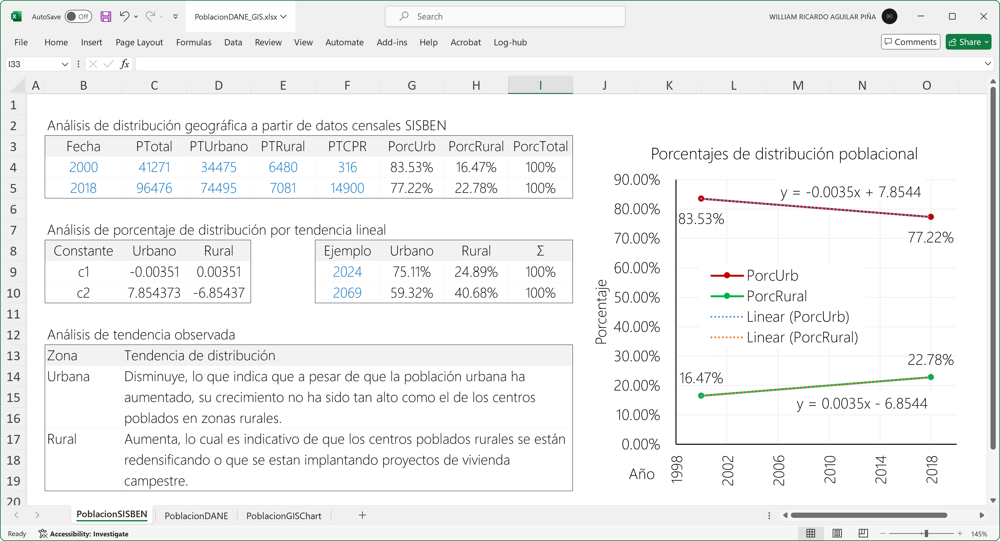

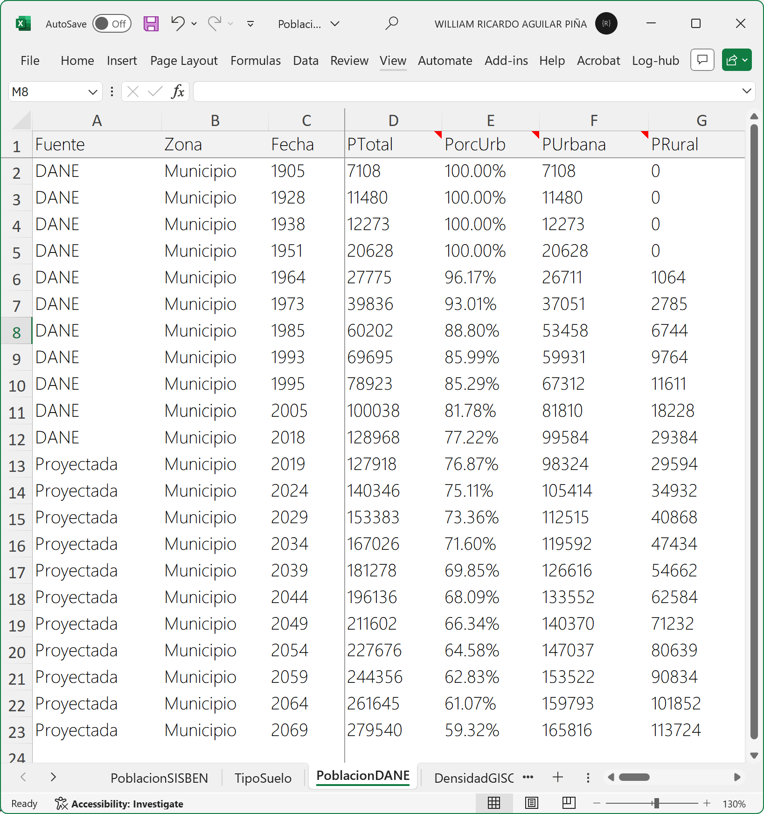

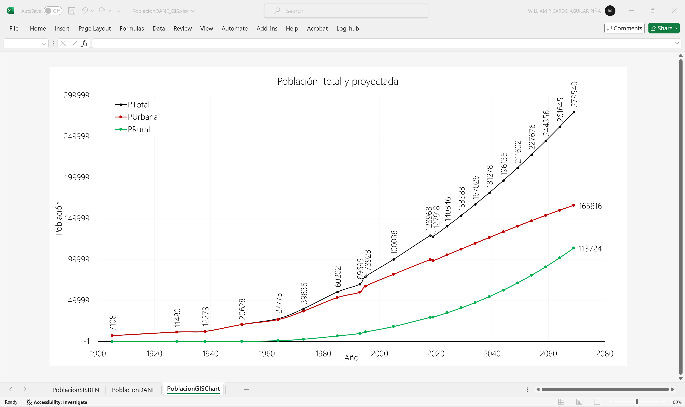

## 3. Análisis de densidad poblacional

Para el análisis de densidad poblacional, es necesario tener en cuenta la mutación del suelo rural a urbano a través del tiempo. Para este análisis, utilizaremos la población proyectada y las áreas obtenidas a partir del análisis realizado previamente a partir de las veredas DANE 2020.

En la tabla de población del libro de Microsoft Excel suministrado para el desarrollo de esta actividad, se han incluído los siguientes atributos:

| Columna   | Descripción                                                                                                                         |
|:----------|:------------------------------------------------------------------------------------------------------------------------------------|
| AreaUrbPL | Tamaño del área urbana en hectáreas a partir del total del área municipal menos el área rural.                                      |
| AreaRurPL | Tamaño del área urbana en hectáreas proyectada linealmente. Utilizando la regresión, al menos se debe dejar 1 ha para suelo urbano. |
| DensTotal | Densidad total municipal en habitantes / hectárea: población total / área total municipal.                                          |
| DensUrb   | Densidad urbana en habitantes / hectárea: población urbana / área urbana                                                            |
| DensRur   | Densidad rural en habitantes / hectárea: población rural / área rural                                                               |

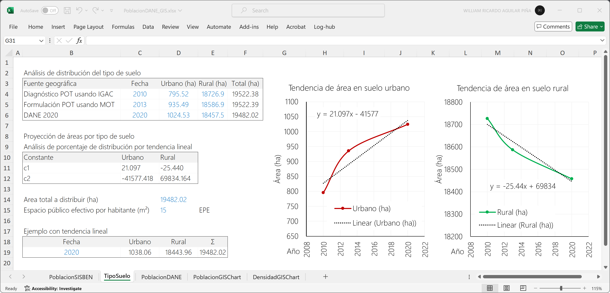

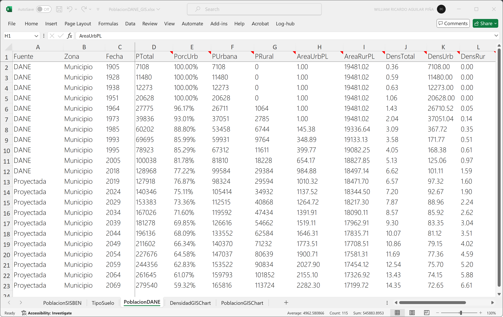

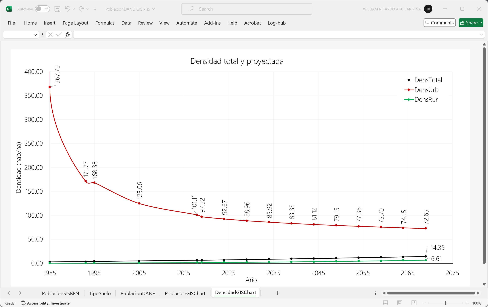

## 4. Análisis de espacio público efectivo urbano requerido - EPE

De acuerdo al [Ministerio de Vivienda de Colombia](https://minvivienda.gov.co/proyectos-de-espacio-urbano-y-territorial-sgr/espacio-publico), el índice mínimo efectivo de espacio público es de 15m² por habitante. Este indicador establece la relación entre el Espacio Público Efectivo frente a la población habitante; se define Espacio Público Efectivo como el “espacio público de carácter permanente, conformado por zonas verdes, parques, plazas y plazoletas”. [Documento CONPES 3718](https://www.minambiente.gov.co/wp-content/uploads/2021/10/Conpes-3718-de-2012.pdf), Bogotá 2012.

Este indicador muestra la suficiente o insuficiente disponibilidad de espacio público susceptible a la medición del déficit cuantitativo del espacio público de carácter permanente - Artículo 12 Decreto 1504 de 1998. El artículo 14 del mismo Decreto considera como índice mínimo de Espacio Público Efectivo de 15m².

Según la Organización Mundial de la Salud (OMS) el agrupamiento de las viviendas en zonas verdes y el fomento de vías peatonales mejoran la calidad del aire y estimulan la actividad física, al tiempo que reducen las lesiones y los efectos de la isla de calor urbana. De tal forma, dicha Organización fijó un indicador óptimo entre 10 m² y 15 m² de zonas verdes por habitante, con el fin de que estos mitiguen los impactos generados por la contaminación de las ciudades y cumplan una función de amortiguamiento. [^1]

En la tabla de población del libro de Microsoft Excel suministrado para el desarrollo de esta actividad, se han incluído los siguientes atributos:

| Columna   | Descripción                                                                           |
|:----------|:--------------------------------------------------------------------------------------|
| EPEUrbHa  | Espacio público efectivo urbano requerido en ha: población urbana * 15 / 10000 |

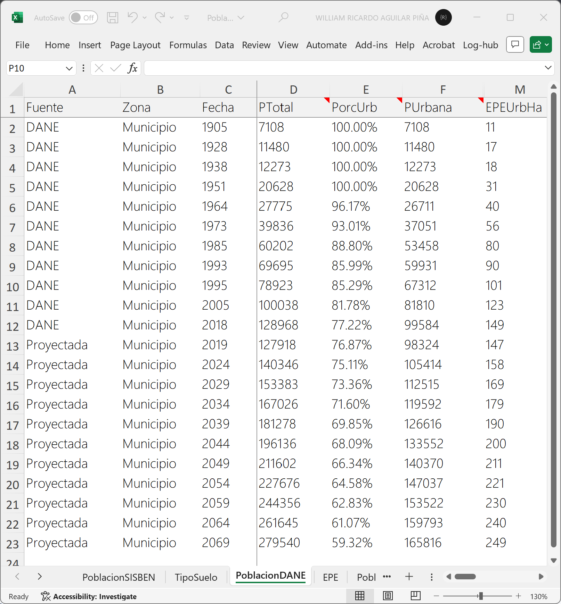

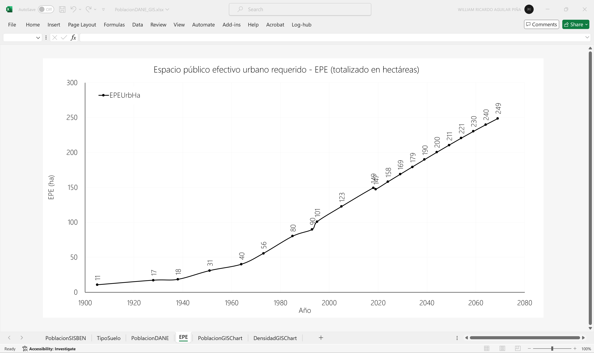

> Este indicador también puede ser estimado para centros poblados en la implementación de planes parciales.

## 5. Análisis de demanda de agua potable y retornada en aguas servidas

Para la estimación del caudal total demandado de agua potable, utilizaremos como referencia los valores de dotación neta por habitante, establecidos en el [Título B del Reglamento Técnico del Sector de Agua Potable y Sanemamiento Básico - RAS](https://www.minvivienda.gov.co/sites/default/files/documentos/titulob-030714.pdf) de Colombia. Para la estimación de los caudales domésticos retornados al sistema de alcantarillado utilizaremos los valores de referencia establecidos en el [Título D](https://www.minvivienda.gov.co/sites/default/files/documentos/titulo_d.pdf) del mismo reglamento.

En la tabla de población del libro de Microsoft Excel suministrado para el desarrollo de esta actividad, se han incluído los siguientes atributos:

| Columna   | Descripción                                                                                                                         |
|:----------|:------------------------------------------------------------------------------------------------------------------------------------|
| QAcuTotal | Caudal total municipal en lps-día demandado de sistemas de acueducto: población total * dotación neta / 86400                       |
| QAcuUrb   | Caudal urbano en lps-día demandado de sistemas de acueducto: población urbana * dotación neta / 86400                               |
| QAcuRur   | Caudal rural en lps-día demandado de sistemas de acueducto: población rural * dotación neta / 86400                                 |
| QAlcTotal | Caudal total municipal en lps-día retornado a sistemas de alcantarillado: caudal total municipal demandado * coeficiente de retorno |
| QAlcUrb   | Caudal urbano en lps-día retornado a sistemas de alcantarillado: caudal urbano demandado * coeficiente de retorno                   |
| QAlcRur   | Caudal rural en lps-día retornado a sistemas de alcantarillado: caudal rural demandado * coeficiente de retorno                     |

Parámetros generales 
 

Asignación del nivel de complejidad - Título A RAS 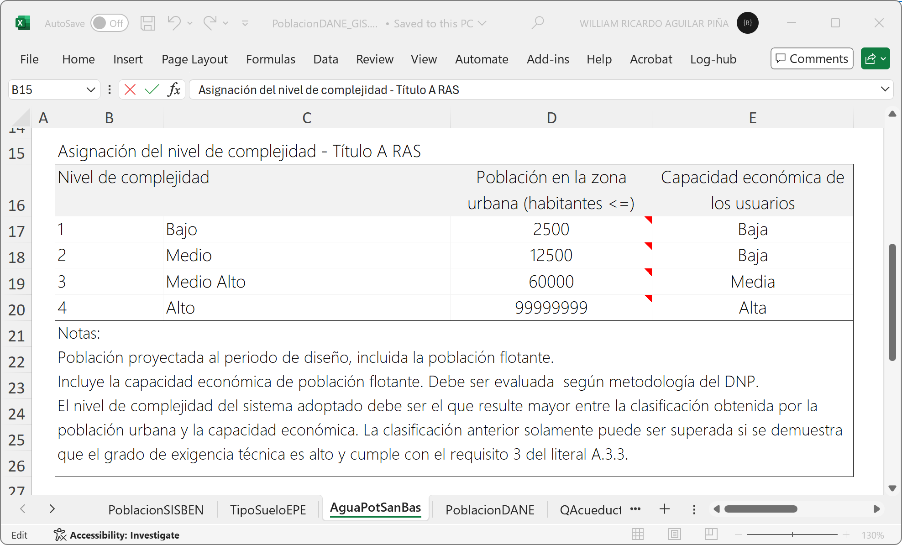
 

Dotación neta por habitante y clima - Título B RAS (L/hab/día) y coeficientes de retorno aguas residuales domésticas QD - Título D RAS 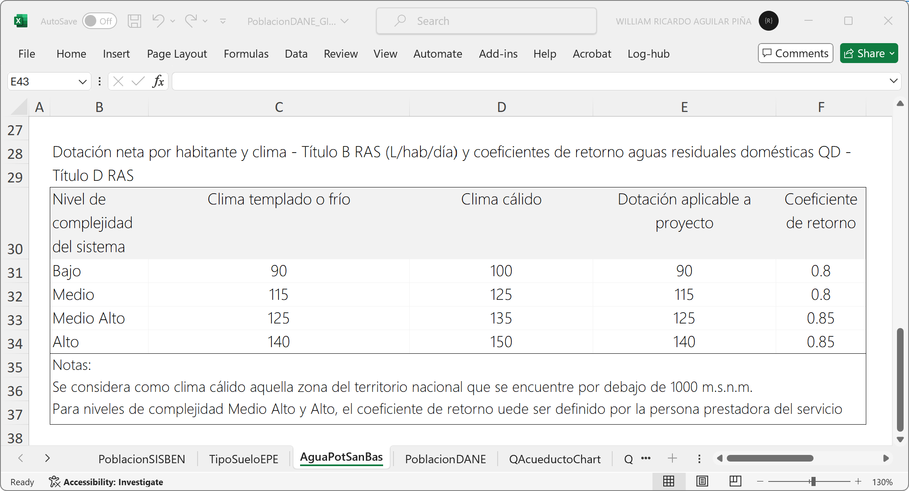
 

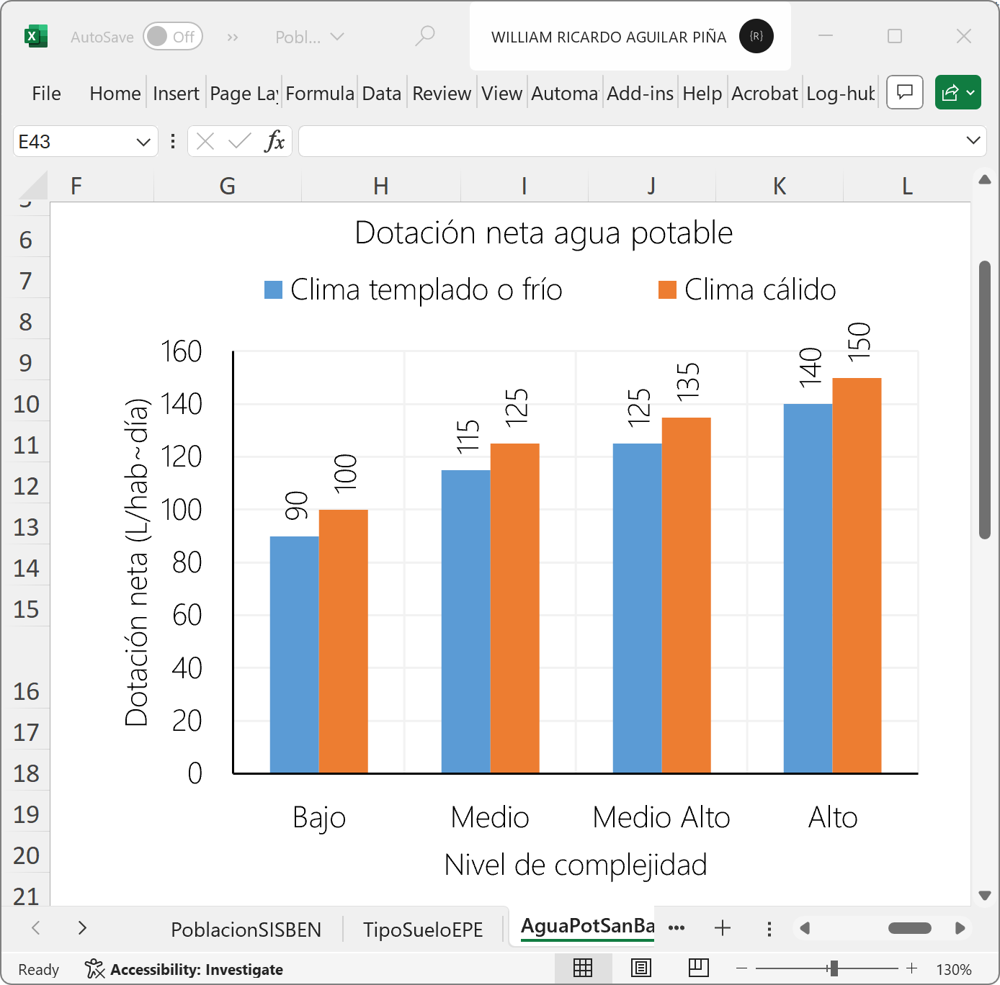
 

Caudales demandados y retornados 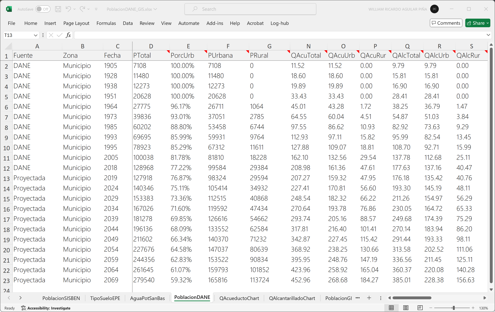
 

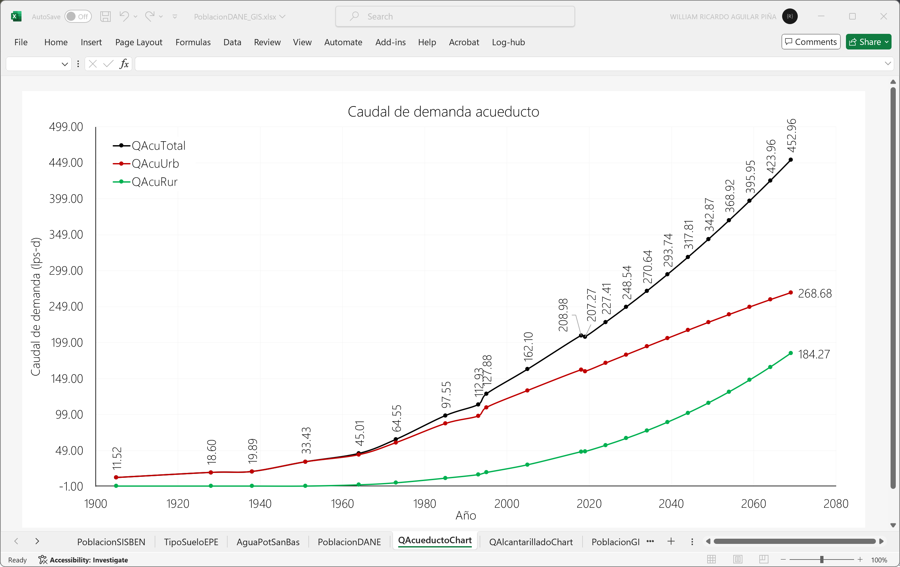

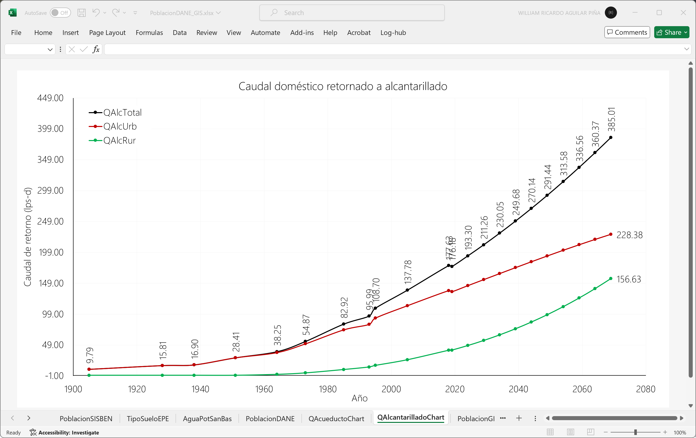

> Se considera como clima cálido aquella zona del territorio nacional que se encuentre por debajo de 1000 m.s.n.m. 

## 6. Visualización dinámica en ArcGIS Pro

1. Para la visualización en GIS, es necesario crear una copia de la tabla de población, organizando de forma apilada los resultados obtenidos. Para ello, es necesario crear una columna adicional denominada `Suelo` indicando si corresponde a Total, Urbano o Rural y ajustar la columna fecha incluyendo el día y el mes (`=CONCAT(C2,"/12/31")`).

> Los valores de densidad urbana entre los años 1905 y 1973, han sido modificados incluyendo el valor obtenido en 1985. Lo anterior debido a que a partir de la regresión, no se obtuvieron valores positivos de área urbana.

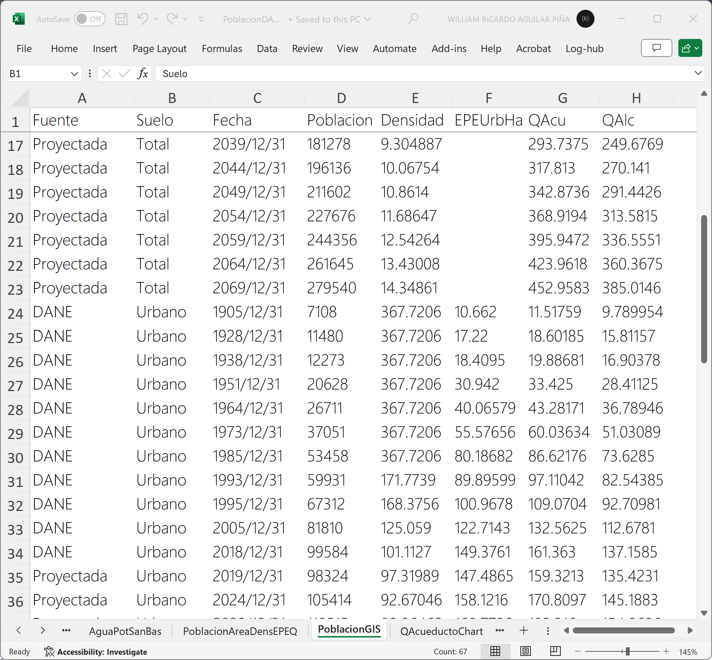

2. En el mapa de ArcGIS Pro y desde el panel de catálogo localizado a la derecha, seleccione el archivo de Excel _PoblacionDANE_GIS.xlsx_ desde la ruta mostrada, expanda su contenido y seleccione la hoja _PoblacionGIS$_.

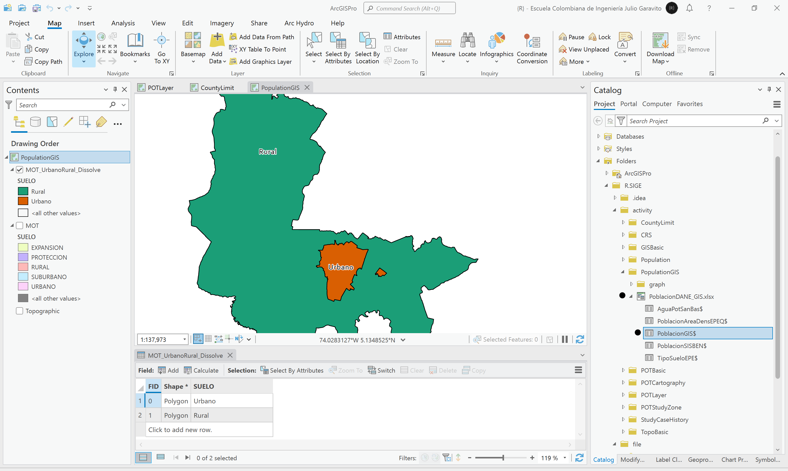

3. De clic derecho en la hoja _PoblacionGIS_ del libro de Excel y seleccione la opción _Export / Table to Table_.

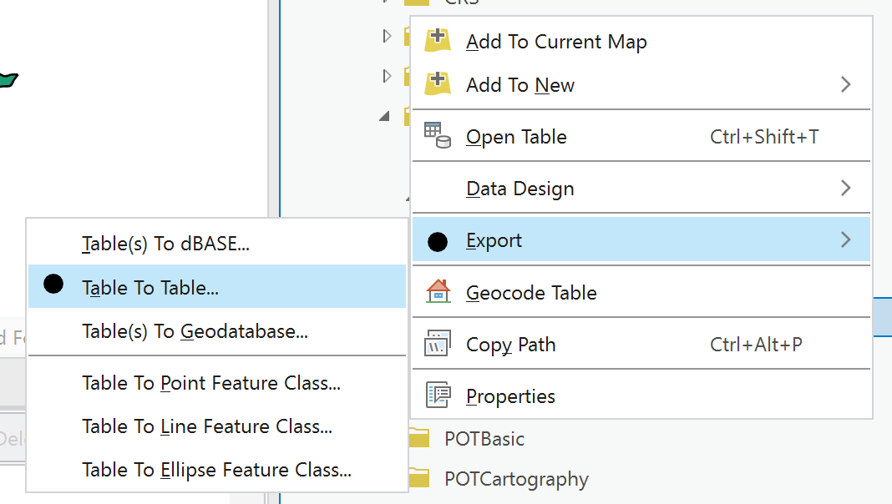

4. En _Table to Table_, en _Fields_, modifique el campo `Fecha` a formato _Date_ y defina como ruta de salida y nombre de archivo la ruta `\file\table\PopulationGIS.dbf`.

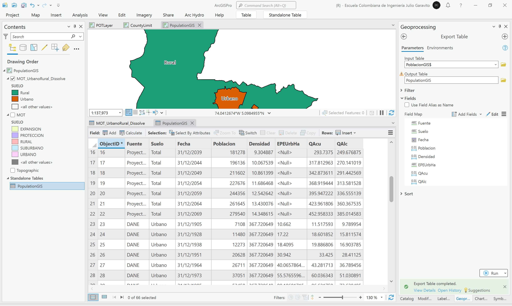

## 7. Análisis usando software libre - QGIS

Para el desarrollo de las actividades desarrolladas en esta clase, se pueden utilizar en QGIS las siguientes herramientas o geo-procesos:

| Proceso                                                                                                         | Procedimiento                                                                                                                                                                                                                                   |
|:----------------------------------------------------------------------------------------------------------------|:------------------------------------------------------------------------------------------------------------------------------------------------------------------------------------------------------------------------------------------------|
| Definición de CRS                                                                                               | En la parte inferior derecha de QGIS se encuentra la opción _EPSG_ que permite cambiar el sistema de proyección del mapa.                                                                                                                       |
| Simbología                                                                                                      | Modificable desde las propiedades de la capa en la pestaña _Symbology_.                                                                                                                                                                         |
| Rotulado                                                                                                        | Modificable desde las propiedades de la capa en la pestaña _Labels_.                                                                                                                                                                            |
| Agregar campo                                                                                                   | Modificable desde las propiedades de la capa en la pestaña _Fields_ o desde la tabla de atributos.                                                                                                                                              |
| Cálculos geométricos o de campo                                                                                 | Directamente desde la tabla de atributos mediante el botón _Open Field Calculator_ o <kbd>Ctr</kbd>+<kbd>I</kbd>. La geometría de cálculo `$area` permite obtener el valor elipsoidal y `area` el valor proyectado.                             |
| [Disolución](https://docs.qgis.org/3.34/en/docs/user_manual/processing_algs/qgis/vectorgeometry.html#dissolve)  | Se ejecuta desde el _Processing Toolbox / Vector Geometry / Dissolve_ o desde el menú _Vector / Geoprocessing Tools / Dissolve_.                                                                                                                |
| Edición geométrica para eliminación de zonas internas                                                           | Activar modo de edición en la capa o _Toggle Editing_, luego en la barra de edición seleccionar la herramienta _Vertex Tool_, oprimir y mantener la tecla <kbd>Shift</kbd> y seleccionar los nodos a eliminar, oprimir tecla <kbd>Delete</kbd>. |

Ejemplo rótulo en QGIS: `'A(ha): ' ||  round("AGha", 2) || '\n' || 'P (m): ' ||  round("PGm", 2) `

## Elementos requeridos en diccionario de datos

Agregue a la tabla resúmen generada en la actividad [Inventario de información geo-espacial recopilada del POT y diccionario de datos](../POTLayer/Readme.md), las capas generadas en esta actividad que se encuentran listadas a continuación:

| Nombre                           | Descripción                                                                                                                  | Geometría   | Registros | 
|----------------------------------|------------------------------------------------------------------------------------------------------------------------------|-------------|-----------| 
|                                  |                                                                                                                              | Polígono 2D | 14        | 
|                                  |                                                                                                                              | Polígono 2D | 14        | 
|                                  |                                                                                                                              | Polígono 2D | 14        | 

> :bulb:Para funcionarios que se encuentran ensamblando el SIG de su municipio, se recomienda incluir y documentar estas capas en el Diccionario de Datos.

## Actividades de proyecto :triangular_ruler:

En la siguiente tabla se listan las actividades que deben ser desarrolladas y documentadas por cada grupo de proyecto en un único archivo de Adobe Acrobat .pdf. El documento debe incluir portada (indicando el caso de estudio, número de avance, nombre del módulo, fecha de presentación, nombres completos de los integrantes), numeración de páginas, tabla de contenido, lista de tablas, lista de ilustraciones, introducción, objetivo general, capítulos por cada ítem solicitado, conclusiones y referencias bibliográficas.

| Actividad     | Alcance                                                                                                                                                                                                                                                                                                                                                                                                                                             |
|:--------------|:----------------------------------------------------------------------------------------------------------------------------------------------------------------------------------------------------------------------------------------------------------------------------------------------------------------------------------------------------------------------------------------------------------------------------------------------------|
| Avance **P1** | Esta actividad no requiere del desarrollo de elementos en el avance del proyecto final, los contenidos son evaluados en el quiz de conocimiento y habilidad.                                                                                                                                                                                                                                                                                        | 
| Avance **P1** | En una tabla y al final del informe de avance de esta entrega, indique el detalle de las sub-actividades realizadas por cada integrante de su grupo. Para actividades que no requieren del desarrollo de elementos de avance, indicar si realizo la lectura de la guía de clase y las lecturas indicadas al inicio en los requerimientos. Utilice las siguientes columnas: Nombre del integrante, Actividades realizadas, Tiempo dedicado en horas. | 

> No es necesario presentar un documento de avance independiente, todos los avances de proyecto de este módulo se integran en un único documento.
> 
> En el informe único, incluya un numeral para esta actividad y sub-numerales para el desarrollo de las diferentes sub-actividades, siguiendo en el mismo orden de desarrollo presentado en esta actividad.

## Referencias

* [Nature Nearby - Accessible Natural Greenspace Guidance](http://www.ukmaburbanforum.co.uk/docunents/other/nature_nearby.pdf)
* https://www.minvivienda.gov.co/sites/default/files/documentos/titulob-030714.pdf
* https://www.cra.gov.co/normas-vigentes
* https://www.minvivienda.gov.co/viceministerio-de-agua-y-saneamiento-basico/reglamento-tecnico-sector/manuales

## Control de versiones

| Versión    | Descripción                                                | Autor                                      | Horas |
|------------|:-----------------------------------------------------------|--------------------------------------------|:-----:|
| 2024.02.24 | Versión inicial con alcance de la actividad                | [rcfdtools](https://github.com/rcfdtools)  |   4   |
| 2024.06.27 | Investigación y documentación para caso de estudio general | [rcfdtools](https://github.com/rcfdtools)  |   8   |

_R.SIGE es de uso libre para fines académicos, conoce nuestra licencia, cláusulas, condiciones de uso y como referenciar los contenidos publicados en este repositorio, dando [clic aquí](LICENSE.md)._

_¡Encontraste útil este repositorio!, apoya su difusión marcando este repositorio con una ⭐ o síguenos dando clic en el botón Follow de [rcfdtools](https://github.com/rcfdtools) en GitHub._

| [:arrow_backward: Anterior](../CountyLimit/Readme.md) | [:house: Inicio](../../README.md) | [:beginner: Ayuda / Colabora](https://github.com/rcfdtools/R.SIGE/discussions/99999) | [Siguiente :arrow_forward:]() |
|-------------------------------------------------------|-----------------------------------|--------------------------------------------------------------------------------------|-------------------------------|

[^1]: Organización Mundial de la Salud. La salud en la economía verde. Los co-beneficios de la mitigación al cambio climático para la salud. Sector de la vivienda. 