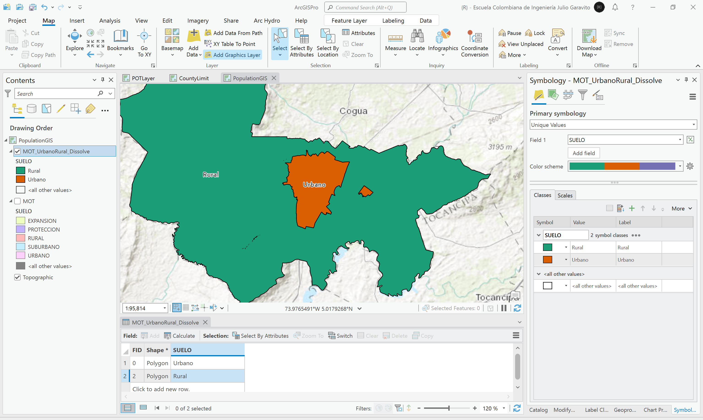

# Plantilla para actividades
Keywords: `population-gis` `public-space`

A partir de la delimitación de límites geopolíticos internos y utilizando los datos de población proyectada, crear una representación visual dinámica de su crecimiento y la demanda de espacio público.                                                                                                                                                                                   

 Tomado de: <a href="Public Domain, https://commons.wikimedia.org/w/index.php?curid=479365">https://commons.wikimedia.org</a>  

## Objetivos

* Representar el crecimiento poblacional en el suelo urbano y rural definido en el Modelo de Ordenamiento Territorial - MOT a partir de los datos estadísticos y de proyección poblacional.

## Requerimientos

* [:mortar_board:Actividad](../Population/Readme.md): Estudio poblacional: censos y proyecciones
* [:mortar_board:Actividad](../POTLayer/Readme.md): Inventario de información geo-espacial recopilada del POT y diccionario de datos.
* [:toolbox:Herramienta](https://www.microsoft.com/es/microsoft-365/excel?market=bz): Microsoft Excel 365.
* [:toolbox:Herramienta](https://www.esri.com/en-us/arcgis/products/arcgis-pro/overview): ESRI ArcGIS Pro 3.3.1 o superior.
* [:toolbox:Herramienta](https://qgis.org/): QGIS 3.38 o superior.
* [:open_file_folder:PoblacionDANE_GIS.xlsx](PoblacionDANE_GIS.xlsx): libro para registro y distribución urbana y rural de población DANE censal y proyectada.

## 1. Procedimiento general en ArcGIS Pro

### 1.1. Obtención de polígono urbano y rural

1. Abra el proyecto de ArcGIS Pro, creado previamente y desde el menú _Insert_ cree un nuevo mapa _New Map_, renombre como _PopulationGIS_ y establezca el CRS 9377. Agregue al mapa la capa del Modelo de Ordenamiento Territorial - MOT disponible en la información recopilada del POT en la ruta `\R.SIGE\file\data\POT\Anexo_Acuerdo_012_2013\shp\MOT.shp` y ajuste la simbología a valores únicos representando el campo de atributos `SUELO`.  

2. Utilizando la herramienta _Data Management Tools / Dissolve_, disuelva los polígonos del Modelo de Ordenamiento Territorial - MOT a partir del campo de atributos `SUELO`. Nombre la capa como `\file\shp\MOT_UrbanoRural_Dissolve.shp` y abra la tabla de atributos de la capa inicial y la capa disuelta. Podrá observar que de los 80 polígonos iniciales, hemos obtenido 5 zonas.

3. Para la obtención de los polígonos, urbano (urbano y expansión) y rural (rural, protección y suburbano), es necesario realizar ahora una unión de entidades o Merge.

En la tabla de atributos de la capa disuelta, seleccione los registros correspondientes a urbano y expansión. Utilice la tecla <kbd>Shift</kbd> o la tecla <kbd>Ctrl</kbd> para la selección.

En el menú superior, de clic en _Edit_, expanda el grupo de opciones _Tools_ y seleccione la herramienta _Merge_.

En el panel lateral derecho, de clic en el botón _Merge_ para aceptar la fusión manual de estas dos áreas. En la tabla de atributos, modifique el nombre a _Urbano_ y rotule a partir del campo `SUELO`.

Repita el procedimiento anterior para integrar los polígonos _Rural, Protección y Suburbano_ y nombre como _Rural_. Ajuste la simpología para obtener una visualización adecuada.

> Como puede observar, el área urbana se compone de dos partes y en la tabla de atributos solo aparece un registro, este tipo de geometría se denomina _multiparte_. También podrá observar que en la zona rural existen rebordes internos correspondientes a errores de digitalización.

4. Utilizando el editor de vértices, elimine los nodos internos de la zona rural correspondientes a errores de digitalización o de construcción de la capa. Una vez eliminados, de clic en _Save_ en el menu _Edit_.

### 1.2. Distribución de población censal urbana y rural

A partir de la información censal analizada en la actividad [Estudio poblacional: censos y proyecciones](../Population/Readme.md), se obtuvieron solo los datos consolidados de población del municipio, pero sn discriminación en urbano o rural. En la tabla de recopilación de información SISBEN, registramos en 2000 y 2018, datos distribuídos de población por zonas en urbano, rural y centros poblados rurales. A partir de los porcentajes de distribución de estos valores, realizaremos la distribución de los datos censales DANE, como se muestra en el libro de Excel suministrado.

## Elementos requeridos en diccionario de datos

Agregue a la tabla resúmen generada en la actividad [Inventario de información geo-espacial recopilada del POT y diccionario de datos](../POTLayer/Readme.md), las capas generadas en esta actividad que se encuentran listadas a continuación:

| Nombre                           | Descripción                                                                                                                  | Geometría   | Registros | 
|----------------------------------|------------------------------------------------------------------------------------------------------------------------------|-------------|-----------| 
|                                  |                                                                                                                              | Polígono 2D | 14        | 
|                                  |                                                                                                                              | Polígono 2D | 14        | 
|                                  |                                                                                                                              | Polígono 2D | 14        | 

> :bulb:Para funcionarios que se encuentran ensamblando el SIG de su municipio, se recomienda incluir y documentar estas capas en el Diccionario de Datos.

## Actividades de proyecto :triangular_ruler:

En la siguiente tabla se listan las actividades que deben ser desarrolladas y documentadas por cada grupo de proyecto en un único archivo de Adobe Acrobat .pdf. El documento debe incluir portada (indicando el caso de estudio, número de avance, nombre del módulo, fecha de presentación, nombres completos de los integrantes), numeración de páginas, tabla de contenido, lista de tablas, lista de ilustraciones, introducción, objetivo general, capítulos por cada ítem solicitado, conclusiones y referencias bibliográficas.

| Actividad     | Alcance                                                                                                                                                                                                                                                                                                                                                                                                                                             |
|:--------------|:----------------------------------------------------------------------------------------------------------------------------------------------------------------------------------------------------------------------------------------------------------------------------------------------------------------------------------------------------------------------------------------------------------------------------------------------------|
| Avance **P1** | Esta actividad no requiere del desarrollo de elementos en el avance del proyecto final, los contenidos son evaluados en el quiz de conocimiento y habilidad.                                                                                                                                                                                                                                                                                        | 
| Avance **P1** | En una tabla y al final del informe de avance de esta entrega, indique el detalle de las sub-actividades realizadas por cada integrante de su grupo. Para actividades que no requieren del desarrollo de elementos de avance, indicar si realizo la lectura de la guía de clase y las lecturas indicadas al inicio en los requerimientos. Utilice las siguientes columnas: Nombre del integrante, Actividades realizadas, Tiempo dedicado en horas. | 

> No es necesario presentar un documento de avance independiente, todos los avances de proyecto de este módulo se integran en un único documento.
> 
> En el informe único, incluya un numeral para esta actividad y sub-numerales para el desarrollo de las diferentes sub-actividades, siguiendo en el mismo orden de desarrollo presentado en esta actividad.

## Compatibilidad

* Esta actividad puede ser desarrollada con cualquier software SIG que disponga de herramientas para de digitalización con opciones de encajado o snapping.
* 

## Referencias

* 

## Control de versiones

| Versión    | Descripción                                                | Autor                                      | Horas |
|------------|:-----------------------------------------------------------|--------------------------------------------|:-----:|
| 2024.02.24 | Versión inicial con alcance de la actividad                | [rcfdtools](https://github.com/rcfdtools)  |   4   |
| 2024.06.27 | Investigación y documentación para caso de estudio general | [rcfdtools](https://github.com/rcfdtools)  |   8   |

_R.SIGE es de uso libre para fines académicos, conoce nuestra licencia, cláusulas, condiciones de uso y como referenciar los contenidos publicados en este repositorio, dando [clic aquí](LICENSE.md)._

_¡Encontraste útil este repositorio!, apoya su difusión marcando este repositorio con una ⭐ o síguenos dando clic en el botón Follow de [rcfdtools](https://github.com/rcfdtools) en GitHub._

| [:arrow_backward: Anterior](../CountyLimit/Readme.md) | [:house: Inicio](../../README.md) | [:beginner: Ayuda / Colabora](https://github.com/rcfdtools/R.SIGE/discussions/99999) | [Siguiente :arrow_forward:]() |
|-------------------------------------------------------|-----------------------------------|--------------------------------------------------------------------------------------|-------------------------------|

[^1]: 