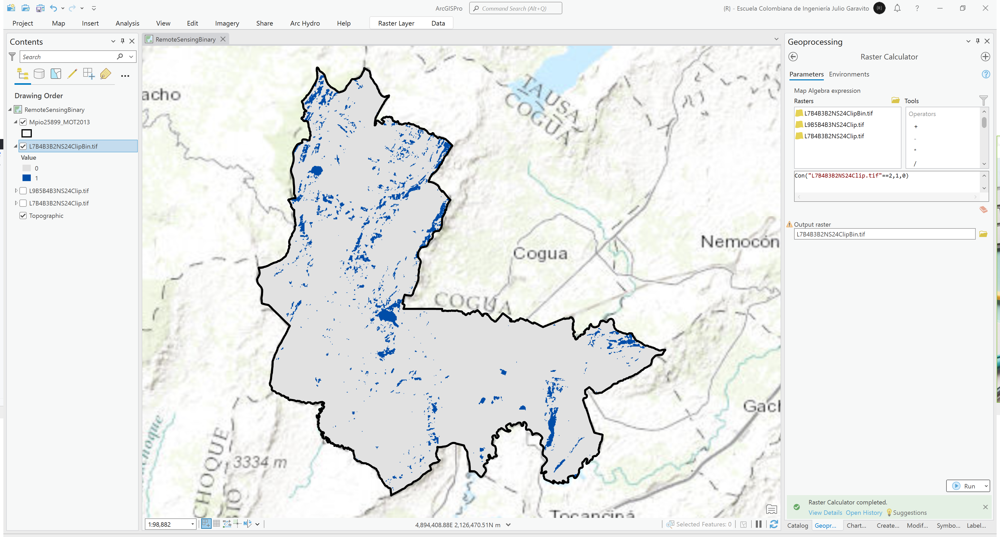
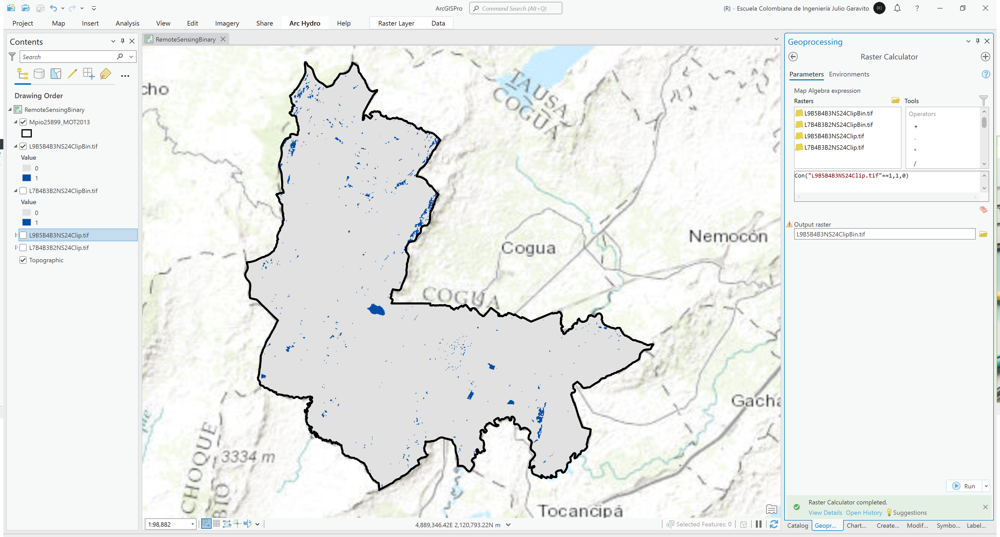
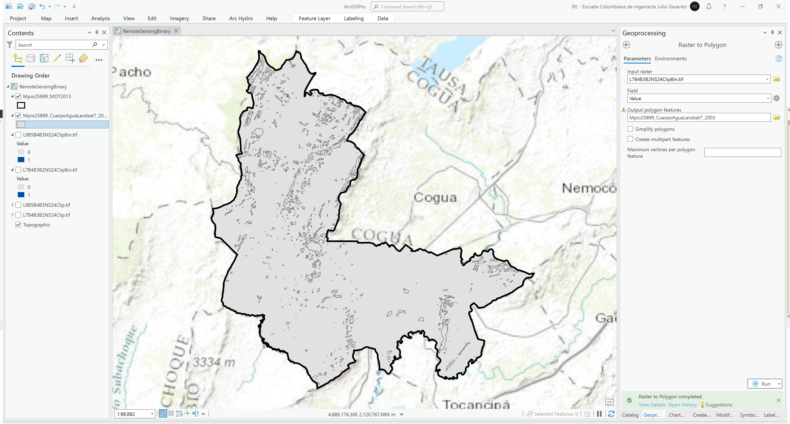
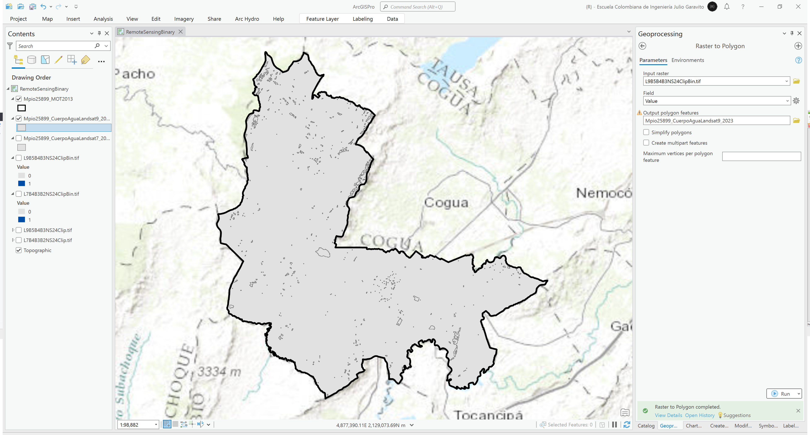
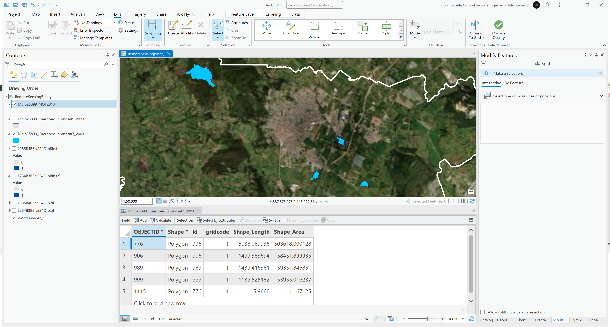
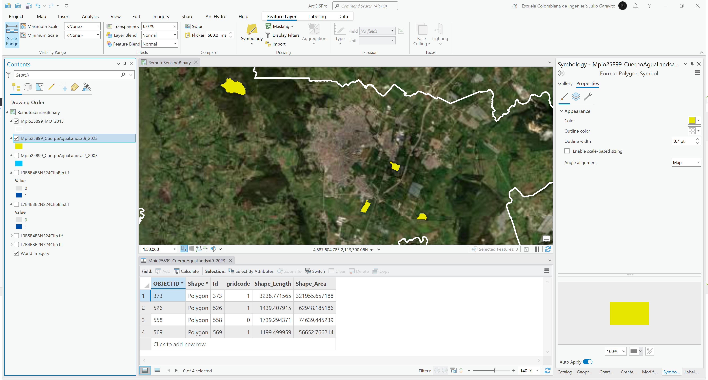
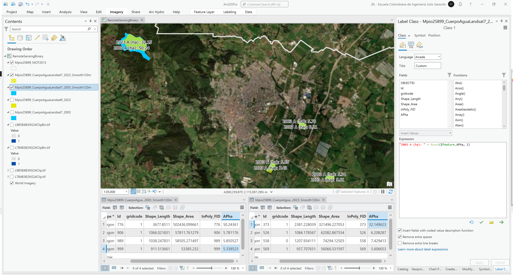

# Binarización por algebra de mapas para identificación de cuerpos de agua
Keywords: `binary` `water-body` `raster-calculator` `raster-to-polygon` `smooth-polygon`

Binarizar por algebra de mapas las grilla de clasificación no supervisada para identificar únicamente las celdas de la clase 1 o 2 correspondientes mayoritariamente a cuerpos de agua (incluídas nubes y zonas con alta humedad), convertir a polígonos y estimar el área total de los cuerpos de agua principales (incluídas plantas de tratamiento de aguas residuales - PTAR). Suavice los contornos de los cuerpos de agua obtenidos utilizando un radio de suavizado específico y aproximación polinómica.

## Objetivos

* Binarizar el mapa ISO Cluster para obtener cuerpos de agua.
* Convertir imágenes en vectores evaluando su espacialidad.

## Requerimientos

* [:mortar_board:Actividad](../TopoBasic/Readme.md): Conceptos básicos de topografía, fotogrametría y fotointerpretación.
* [:mortar_board:Actividad](../POTLayer/Readme.md): Inventario de información geo-espacial recopilada del POT y diccionario de datos.
* [:toolbox:Herramienta](https://www.esri.com/en-us/arcgis/products/arcgis-pro/overview): ESRI ArcGIS Pro 3.3.1 o superior.
* [:toolbox:Herramienta](https://qgis.org/): QGIS 3.38 o superior.

## 1. Procedimiento general en ArcGIS Pro

1. Abra el proyecto de ArcGIS Pro, creado previamente y desde el menú _Insert_ cree un nuevo mapa _New Map_, renombre como _RemoteSensingBonary_ y establezca el CRS 9377. Agregue al mapa la capa del límite municipal obtenido Modelo de Ocupación Territorial - MOT disponible en la información recopilada del POT en la ruta `\file\gdb\SIGE.gdb\SIGE\Mpio25899_MOT2013` ajuste la simbología solo a contorno y agregue los mapas de clasificación no supervisada ISO Cluster `L7B4B3B2NS24Clip.tif` y `L9B5B4B3NS24Clip.tif` generadas en la actividad anterior.  

2. Utilizando la herramienta de geo-procesamiento _Image Analyst Tools / Raster Calculator_, cree mapas binarizados utilizando las siguientes expresiones y nombres de archivo:

* `\file\grid\LE07_L2SP\L7B4B3B2NS24ClipBin.tif`: binarizar a partir de la clase 2 usando la expresión `Con("L7B4B3B2NS24Clip.tif"==2,1,0)`
* `\file\grid\LC09_L2SP\L9B5B4B3NS24ClipBin.tif`: binarizar a partir de la clase 1 usando la expresión `Con("L9B5B4B3NS24Clip.tif"==1,1,0)`

En las imágenes resultantes podrá observar que para Landsat 7 se han obtenido pixeles en zonas de montaña correspondiente principalmente a zonas con humedad alta y no a cuerpos de agua en superficie.

3. Utilizando la herramienta de geo-procesamiento _Conversion / Raster To Polygon_, convierta a polígonos los píxeles obtenidos de la binarización. Desactive la opción _Simplify polygons_ y nombre los archivos como `\file\gdb\SIGE.gdb\SIGE\Mpio25899_CuerpoAguaLandsat7_2003` y `\file\gdb\SIGE.gdb\SIGE\Mpio25899_CuerpoAguaLandsat9_2023`.

4. Utilizando el modo de edición, elimine todos los polígonos que no corresponden a cuerpos de agua en superficie y deje únicamente los correspondientes a la Laguna Pantano Redondo, lagunas de oxidación y laguna en vía a Tocancipá. Utilice como referencia de fondo la imagen satelital de ESRI.

> Para los polígonos obtenidos a partir de Landsat 7, será necesario editar y remover parte del polígono de la laguna Pantano Redondo debido ha que se han integrado a esta celdas correspondientes a humedad en atmósfera. 

5. Utilizando la herramienta de geo-procesamiento _Cartography Tools / Smooth Polygon_, suavice los polígonos de los cuerpos de agua obtenidos utilizanado un radio de aproximación de 4 veces la resolución de los píxeles originales y guarde como `\file\gdb\SIGE.gdb\SIGE\Mpio25899_CuerpoAguaLandsat7_2003_Smooth120m` y `\file\gdb\SIGE.gdb\SIGE\Mpio25899_CuerpoAguaLandsat7_2023_Smooth120m`. Podrá observar que los cuerpos de agua en la zona de llanura son similares, excepto en la planta de tratamiento localizada en la zona sur occidental que para 2023 incluye una mayor área, por otra parte, la Lagura de Pantano Redondo, presenta una superficie más precisa para 2023 debido a que se ha utilizado Landsat 9.

6. En la tabla de atributos cree un campo numérico doble con el nombre `APha` y utilizando el calculado de geometría estime el área total de los cuerpos de agua obtenidos. Rotule y compare los resultados.

## 2. Análisis usando software libre - QGIS

Para el desarrollo de las actividades desarrolladas en esta clase, se pueden utilizar en QGIS las siguientes herramientas o geo-procesos:

| Proceso                                             | Procedimiento                                                                                                |
|:----------------------------------------------------|:-------------------------------------------------------------------------------------------------------------|
| Simbología                                          | Modificable desde las propiedades de la capa en la pestaña _Symbology_.                                      |
| Rotulado                                            | Modificable desde las propiedades de la capa en la pestaña _Labels_.                                         |
| Calculadora ráster (Raster Calculator)              | Herramienta disponible en el _Processing Toolbox / GDAL / Raster miscellaneous / Raster calculator.          |
| Suavizar líneas y polígonos (Smooth)                | Herramienta disponible en el _Processing Toolbox / Vector Geometry / Smooth_.                                |
| Conversión de ráster a polígono (Raster to Polygon) | Herramienta disponible en el _Processing Toolbox / GDAL / Raster conversion / Polygonize (raster to vector). |

Ejemplo rótulo en QGIS: `'A(ha): ' ||  round("AGha", 2) || '\n' || 'P (m): ' ||  round("PGm", 2) `

[:notebook:QGIS training manual](https://docs.qgis.org/3.34/en/docs/training_manual/)  
[:notebook:Herramientas comúnmente utilizadas en QGIS](../QGIS.md)

## Elementos requeridos en diccionario de datos

Agregue a la tabla resúmen generada en la actividad [Inventario de información geo-espacial recopilada del POT y diccionario de datos](../POTLayer/Readme.md), las capas generadas en esta actividad que se encuentran listadas a continuación:

| Nombre                           | Descripción                                                                                                                  | Geometría   | Registros | 
|----------------------------------|------------------------------------------------------------------------------------------------------------------------------|-------------|-----------| 
|                                  |                                                                                                                              | Polígono 2D | 14        | 
|                                  |                                                                                                                              | Polígono 2D | 14        | 
|                                  |                                                                                                                              | Polígono 2D | 14        | 

> :bulb:Para funcionarios que se encuentran ensamblando el SIG de su municipio, se recomienda incluir y documentar estas capas en el Diccionario de Datos.

## Actividades de proyecto :triangular_ruler:

En la siguiente tabla se listan las actividades que deben ser desarrolladas y documentadas por cada grupo de proyecto en un único archivo de Adobe Acrobat .pdf. El documento debe incluir portada (indicando el caso de estudio, número de avance, nombre del módulo, fecha de presentación, nombres completos de los integrantes), numeración de páginas, tabla de contenido, lista de tablas, lista de ilustraciones, introducción, objetivo general, capítulos por cada ítem solicitado, conclusiones y referencias bibliográficas.

| Actividad     | Alcance                                                                                                                                                                                                                                                                                                                                                                                                                                             |
|:--------------|:----------------------------------------------------------------------------------------------------------------------------------------------------------------------------------------------------------------------------------------------------------------------------------------------------------------------------------------------------------------------------------------------------------------------------------------------------|
| Avance **P6** | Esta actividad no requiere del desarrollo de elementos en el avance del proyecto final, los contenidos son evaluados en el quiz de conocimiento y habilidad.                                                                                                                                                                                                                                                                                        | 
| Avance **P6** | :compass:Mapa digital impreso _P6-1: xxxx_ Incluir xxxxx. Embebido dentro del informe final como una imágen y referenciados como anexo.                                                                                                                                                                                                                                                                                                          | 
| Avance **P6** | En una tabla y al final del informe de avance de esta entrega, indique el detalle de las sub-actividades realizadas por cada integrante de su grupo. Para actividades que no requieren del desarrollo de elementos de avance, indicar si realizo la lectura de la guía de clase y las lecturas indicadas al inicio en los requerimientos. Utilice las siguientes columnas: Nombre del integrante, Actividades realizadas, Tiempo dedicado en horas. | 

> No es necesario presentar un documento de avance independiente, todos los avances de proyecto de este módulo se integran en un único documento.
> 
> En el informe único, incluya un numeral para esta actividad y sub-numerales para el desarrollo de las diferentes sub-actividades, siguiendo en el mismo orden de desarrollo presentado en esta actividad.

## Referencias

* https://pro.arcgis.com/en/pro-app/latest/tool-reference/spatial-analyst/raster-calculator.htm
* https://pro.arcgis.com/en/pro-app/latest/tool-reference/conversion/raster-to-polygon.htm
* https://pro.arcgis.com/en/pro-app/latest/tool-reference/cartography/smooth-polygon.htm

## Control de versiones

| Versión    | Descripción                                                | Autor                                      | Horas |
|------------|:-----------------------------------------------------------|--------------------------------------------|:-----:|
| 2024.04.04 | Versión inicial con alcance de la actividad                | [rcfdtools](https://github.com/rcfdtools)  |   4   |
| 2024.09.14 | Investigación y documentación para caso de estudio general | [rcfdtools](https://github.com/rcfdtools)  |   4   |

_R.SIGE es de uso libre para fines académicos, conoce nuestra licencia, cláusulas, condiciones de uso y como referenciar los contenidos publicados en este repositorio, dando [clic aquí](LICENSE.md)._

_¡Encontraste útil este repositorio!, apoya su difusión marcando este repositorio con una ⭐ o síguenos dando clic en el botón Follow de [rcfdtools](https://github.com/rcfdtools) en GitHub._

| [:arrow_backward: Anterior](../xxxx) | [:house: Inicio](../../README.md) | [:beginner: Ayuda / Colabora](https://github.com/rcfdtools/R.SIGE/discussions/99999) | [Siguiente :arrow_forward:]() |
|---------------------|-------------------|---------------------------------------------------------------------------|---------------|

[^1]: 