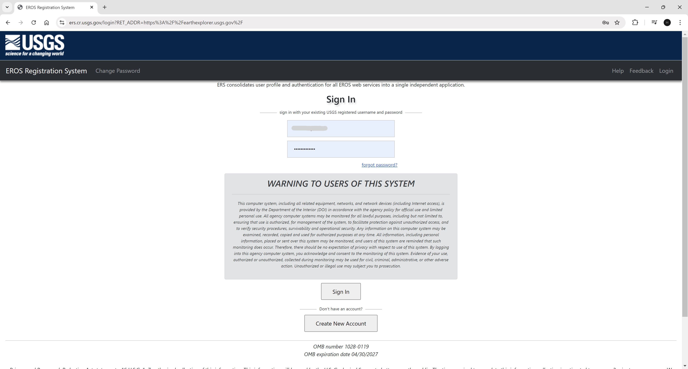

# Descarga de imágenes satelitales y composición de bandas
Keywords: `landsat` `remote-sensing` `composite-band` `clip-raster`

Utilizando una envolvente generada a partir de los polígonos del Modelo de Ocupación Territorial - MOT, descargue, componga y reproyecte al CRS 9733, imágenes y bandas satelitales de Landsat 7 y Lansat 9. Composiciones Landsat 7 B3B2B1 y Landsat 9 B4B3B2 para imágenes en falso color. Composiciones Landsat 7 B4B3B2 y Landsat 9 B5B4B3 para identificación de cuerpos de agua y vegetación. Análisis descriptivo de las diferencias encontradas entre los grupos de composiciones realizadas.

## Objetivos

* Descargar imágenes satelitales Landsat.
* Componer imágenes en falso color.
* Componer imágenes para identificar cuerpos de agua.

## Requerimientos

* [:mortar_board:Actividad](../TopoBasic/Readme.md): Conceptos básicos de topografía, fotogrametría y fotointerpretación.
* [:mortar_board:Actividad](../POTLayer/Readme.md): Inventario de información geo-espacial recopilada del POT y diccionario de datos.
* [:toolbox:Herramienta](https://www.esri.com/en-us/arcgis/products/arcgis-pro/overview): ESRI ArcGIS Pro 3.3.1 o superior.
* [:toolbox:Herramienta](https://qgis.org/): QGIS 3.38 o superior.
* [:man_technologist:Usuario](https://ers.cr.usgs.gov/): Creación de cuenta de usuario USGS.

## 1. Descarga de imágenes desde earthexplorer.usgs.gov

1. Abra el proyecto de ArcGIS Pro, creado previamente y desde el menú _Insert_ cree un nuevo mapa _New Map_, renombre como _RemoteSensing_ y establezca el CRS 9377. Agregue al mapa las capas `Mpio25899_MOT2013` y `Mpio25899_MOT2013_Envelope` disponibles en la ruta `\file\gdb\SIGE.gdb\SIGE` y represente por contornos.  

2. Exporte la clase de entidad `Mpio25899_MOT2013_Envelope` a un archivo de formas shapefile en la ruta `\file\shp\Mpio25899_MOT2013_Envelope4329.shp` asignando el CRS 4326.

3. Desde el directorio `\shp` comprima los archivos `Mpio25899_MOT2013_Envelope.shp`, `Mpio25899_MOT2013_Envelope.shx`, `Mpio25899_MOT2013_Envelope.dbf`, `Mpio25899_MOT2013_Envelope.prj` en un archivo `.zip` con el nombre `Mpio25899_MOT2013_Envelope.zip`.

4. Ingrese al portal https://earthexplorer.usgs.gov/ y en la parte superior derecha a través de la opción _Login_ ingrese con su cuenta de usuario del Servicio Geológico de los Estados Unidos de América - USGS.  

5. En las opciones de _Search Criteria_, agregue el archivo comprimido que delimita la zona de estudio, podrá observar que la ventana de búsqueda muestra el límite espacial y las esquinas de la zona de búsqueda. En la parte inferior, ingrese la fecha (mm/dd/yyyy) 01/11/2003 debido a que inicialmente descargaremos imágenes Landsat 7 de esta fecha.

6. En la pestaña _Data Sets_, busque y seleccione el conjunto de datos _Landsat 7 ETM+ C2 L2_

7. En la pestaña _Additional Criteria_ busque la ruta o path 008 y la fila o row 056.

8. Desde la pestaña de resultados, visualice la imagen `LE07_L2SP_008056_20030111_20200916_02_T1`, podrá observar que cubre un área más amplia y que en la zona de estudio se presentan pocas nubes.

9. Utilizando la opción de descarga, obtenga las bandas de reflectancia y de emisión térmica, guarde como `\grid\LE07_L2SP\LE07_L2SP_008056_20030111_20200916_02_T1.tar`.

10. Repita el procedimiento anterior y descargue imágenes Landsat 9 de la misma ruta o path 008 y fila o row 056 del 03 de febrero de 2023, guarde como `\grid\LC09_L2SP\LC09_L2SP_008056_20230203_20230311_02_T1.tar`.

## 2. Composición de imágenes en falso color

1. Del comprimido `\grid\LE07_L2SP\LE07_L2SP_008056_20030111_20200916_02_T1.tar`, extraiga en la carpeta `\grid\LE07_L2SP\` los archivos correspondientes a las bandas B1 a B6.

2. Del comprimido `\grid\LC09_L2SP\LC09_L2SP_008056_20230203_20230311_02_T1.tar`, extraiga en la carpeta `\grid\LC09_L2SP\` los archivos correspondientes a las bandas B1 a B7.

3. En ArcGIS Pro y ejecutando la herramienta de geo-procesamiento _Data Management Tools / Composite Bands_, componga las bandas satelitales Landsat 7 B3B2B1, guarde el archivo de composición como `\file\grid\LE07_L2SP\L7B3B2B1.tif`. Una vez terminado el proceso, podrá observar la imagen en falso color.

4. Repita el procedimiento anterior para Landsat 9 realizando la composición B4B3B2, guarde el archivo de composición como `\file\grid\LC09_L2SP\L9B4B3B2.tif`

5. En la tabla de contenido, seleccione la imagen `L7B3B2B1.tif` y desde el menú _Layer_ active la opción de rango dinámico _DRA_ y ajuste o _Stretch Type_ _Esri_. Repita este ajuste para la composición de Landsat 9. Podrá observar la diferencia entre el límite de la zona urbana y el desarrollo rural en 20 años.

6. Utilizando la herramienta de geo-procesamiento _Data Management Tools / Clip Raster_, recorte las imágenes hasta el límite municipal del MOT, nombre como `\file\grid\LE07_L2SP\L7B3B2B1Clip.tif` y `\file\grid\LC09_L2SP\L9B4B3B2Clip.tif`.

## 3. Identificación cuerpos de agua y vegetación

1. Ejecutando la herramienta de geo-procesamiento _Data Management Tools / Composite Bands_, componga las bandas satelitales Landsat 7 B4B3B2, guarde el archivo de composición como `\file\grid\LE07_L2SP\L7B4B3B2.tif`. Una vez terminado el proceso, podrá observar que los cuerpos de agua aparecen en negro, la vegetación en rojo y las zonas urbanizadas en color gris.

2. Repita el procedimiento anterior para Landsat 9 realizando la composición B5B4B3, guarde el archivo de composición como `\file\grid\LC09_L2SP\L9B5B4B3.tif`

3. Utilizando la herramienta de geo-procesamiento _Data Management Tools / Clip Raster_, recorte las imágenes hasta el límite municipal del MOT, nombre como `\file\grid\LE07_L2SP\L7B4B3B2Clip.tif` y `\file\grid\LC09_L2SP\L9B5B4B3Clip.tif`, ajuste la simbología por recorte porcentual y rango dinámico DRA.

## 4. Análisis usando software libre - QGIS

Para el desarrollo de las actividades desarrolladas en esta clase, se pueden utilizar en QGIS las siguientes herramientas o geo-procesos:

| Proceso                                                    | Procedimiento                                                                                            |
|:-----------------------------------------------------------|:---------------------------------------------------------------------------------------------------------|
| Composición de bandas en imágenes ráster (Composite Bands) | Herramienta disponible en el _Processing Toolbox / GRASS / Raster / r.composite.                         |
| Recorte de imágenes ráster (Clip Raster)                   | Herramienta disponible en el _Processing Toolbox / GDAL / Raster extraction / Clip raster by mask layer. |

Ejemplo rótulo en QGIS: `'A(ha): ' ||  round("AGha", 2) || '\n' || 'P (m): ' ||  round("PGm", 2) `

[:notebook:QGIS training manual](https://docs.qgis.org/3.34/en/docs/training_manual/)  
[:notebook:Herramientas comúnmente utilizadas en QGIS](../QGIS.md)

## Elementos requeridos en diccionario de datos

Agregue a la tabla resúmen generada en la actividad [Inventario de información geo-espacial recopilada del POT y diccionario de datos](../POTLayer/Readme.md), las capas generadas en esta actividad que se encuentran listadas a continuación:

| Nombre           | Descripción                                                                                            | Geometría    | Registros  | 
|------------------|--------------------------------------------------------------------------------------------------------|--------------|------------| 
| L7B3B2B1.tif     | Composición de bandas Landsat 7 B3B2B2 de imagen en falso color.                                       | (grid)       | n/a        | 
| L9B4B3B2.tif     | Composición de bandas Landsat 9 B4B3B2 de imagen en falso color.                                       | (grid)       | n/a        | 
| L7B3B2B1Clip.tif | Recorte composición de bandas Landsat 7 B3B2B2 de imagen en falso color hasta límite municipal.        | (grid)       | n/a        | 
| L9B4B3B2Clip.tif | Recorte composición de bandas Landsat 9 B4B3B2 de imagen en falso color hasta límite municipal.        | (grid)       | n/a        | 
| L7B4B3B2.tif     | Composición de bandas Landsat 7 B3B2B2 de vegetación y cuerpos de agua.                                | (grid)       | n/a        | 
| L9B5B4B3.tif     | Composición de bandas Landsat 9 B4B3B2 de vegetación y cuerpos de agua.                                | (grid)       | n/a        | 
| L7B4B3B2Clip.tif | Recorte composición de bandas Landsat 7 B3B2B2 de vegetación y cuerpos de agua hasta límite municipal. | (grid)       | n/a        | 
| L9B5B4B3Clip.tif | Recorte composición de bandas Landsat 9 B4B3B2 de vegetación y cuerpos de agua hasta límite municipal. | (grid)       | n/a        | 

> :bulb:Para funcionarios que se encuentran ensamblando el SIG de su municipio, se recomienda incluir y documentar estas capas en el Diccionario de Datos.

## Actividades de proyecto :triangular_ruler:

En la siguiente tabla se listan las actividades que deben ser desarrolladas y documentadas por cada grupo de proyecto en un único archivo de Adobe Acrobat .pdf. El documento debe incluir portada (indicando el caso de estudio, número de avance, nombre del módulo, fecha de presentación, nombres completos de los integrantes), numeración de páginas, tabla de contenido, lista de tablas, lista de ilustraciones, introducción, objetivo general, capítulos por cada ítem solicitado, conclusiones y referencias bibliográficas.

| Actividad      | Alcance                                                                                                                                                                                                                                                                                                                                                                                                                                             |
|:---------------|:----------------------------------------------------------------------------------------------------------------------------------------------------------------------------------------------------------------------------------------------------------------------------------------------------------------------------------------------------------------------------------------------------------------------------------------------------|
| Avance **P6**  | Realice los análisis de imágenes satelitales contenidos en esta actividad y realice un análisis descriptivo de las diferencias encontradas. Para su zona de estudio deberá buscar imágenes sin cobertura por nubosidad.                                                                                                                                                                                                                             | 
| Avance **P6**  | :compass:Mapa digital impreso _P6-01: Mapa de comparación de imagen en falso color Landsat 7 de 2003 vs Landsat 9 de 2023._ Incluir texto descriptivo de diferencias encontradas. Embebido dentro del informe final como una imágen y referenciados como anexo.                                                                                                                                                                                  | 
| Avance **P6**  | :compass:Mapa digital impreso _P6-02: Mapa de comparación e identificación de cuerpos de agua y vegetaciones Landsat 7 de 2003 vs Landsat 9 de 2023._ Incluir texto descriptivo de diferencias encontradas. Embebido dentro del informe final como una imágen y referenciados como anexo.                                                                                                                                                                                 | 
| Avance **P6** | En una tabla y al final del informe de avance de esta entrega, indique el detalle de las sub-actividades realizadas por cada integrante de su grupo. Para actividades que no requieren del desarrollo de elementos de avance, indicar si realizo la lectura de la guía de clase y las lecturas indicadas al inicio en los requerimientos. Utilice las siguientes columnas: Nombre del integrante, Actividades realizadas, Tiempo dedicado en horas. | 

> No es necesario presentar un documento de avance independiente, todos los avances de proyecto de este módulo se integran en un único documento.
> 
> En el informe único, incluya un numeral para esta actividad y sub-numerales para el desarrollo de las diferentes sub-actividades, siguiendo en el mismo orden de desarrollo presentado en esta actividad.

## Referencias

* https://pro.arcgis.com/en/pro-app/latest/tool-reference/data-management/composite-bands.htm
* https://pro.arcgis.com/en/pro-app/latest/tool-reference/data-management/clip.htm

## Control de versiones

| Versión    | Descripción                                                | Autor                                      | Horas  |
|------------|:-----------------------------------------------------------|--------------------------------------------|:------:|
| 2024.04.02 | Versión inicial con alcance de la actividad                | [rcfdtools](https://github.com/rcfdtools)  |   4    |
| 2024.09.13 | Investigación y documentación para caso de estudio general | [rcfdtools](https://github.com/rcfdtools)  |   6    |

_R.SIGE es de uso libre para fines académicos, conoce nuestra licencia, cláusulas, condiciones de uso y como referenciar los contenidos publicados en este repositorio, dando [clic aquí](LICENSE.md)._

_¡Encontraste útil este repositorio!, apoya su difusión marcando este repositorio con una ⭐ o síguenos dando clic en el botón Follow de [rcfdtools](https://github.com/rcfdtools) en GitHub._

| [:arrow_backward: Anterior](../Reservoir/Readme.md) | [:house: Inicio](../../README.md) | [:beginner: Ayuda / Colabora](https://github.com/rcfdtools/R.SIGE/discussions/36)  | [Siguiente :arrow_forward:]() |
|-----------------------------------------------------|-----------------------------------|------------------------------------------------------------------------------------|-------------------------------|

[^1]: 