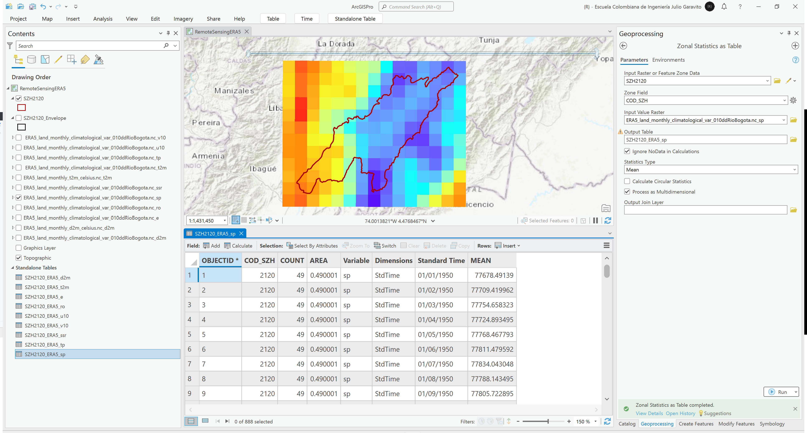
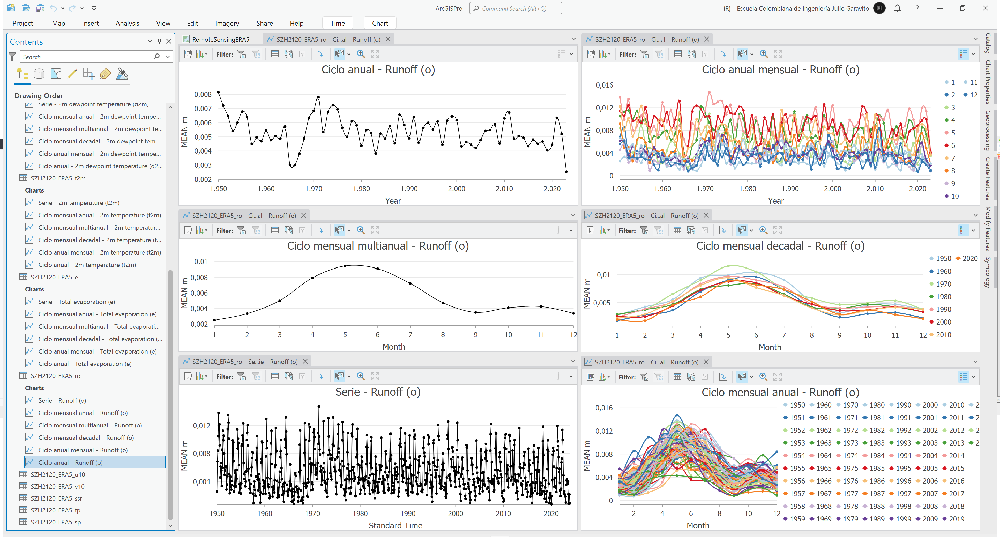
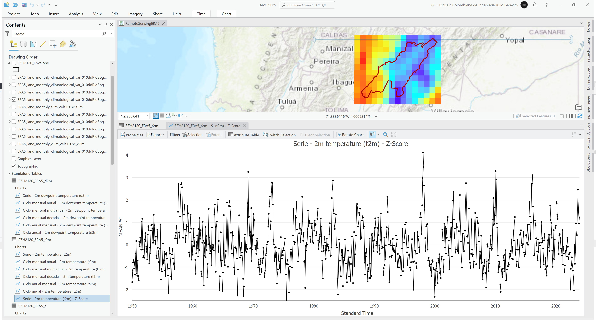
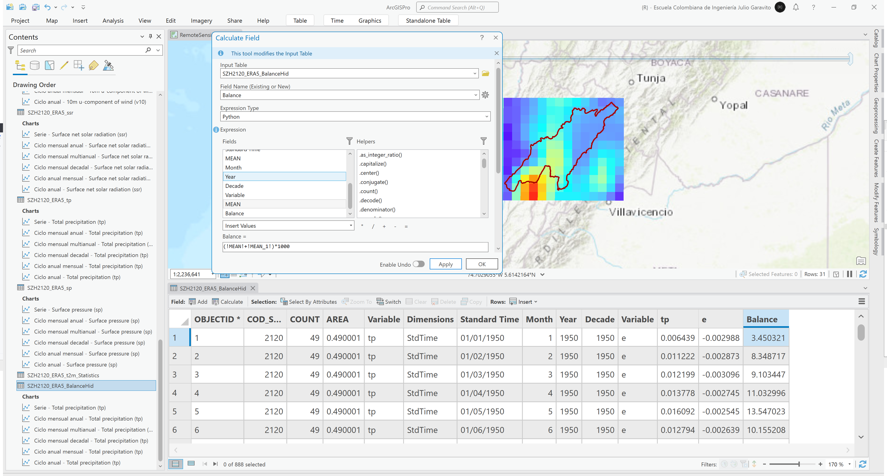
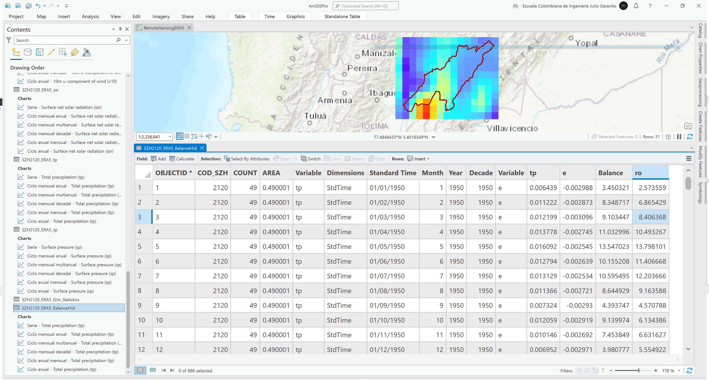

# Análisis hidro-climatológico ERA5 Land Monthly
Keywords: `remote-sensing` `era-5` `reanalysis` `anomalies`

Desde la plataforma [Copernicus](https://www.copernicus.eu/en) del [ECMWF](https://www.ecmwf.int/) y para el límite envolvente de la subzona hidrográfica de la zona de estudio: descargue las variables: d2m, t2m, e, ro, u10, v10, sp, tp, ssr para el rango de años 1950 a 2023. Cargue y visualice todas las variables en un mapa. Convierta y exporte las variables d2m y t2m correspondientes a temperatura de punto de rocio y temperatura a 2m sobre la superficie terreste, de grados Kelvin a grados centígrados. Para el límite completo de la subzona hidrográfica SZH que cubre el área de estudio y para cada variable, obtenga estadísticos zonales mes a mes y genere gráficos detallados y agregados mensuales y anuales. Utilizando los valores estadísticos mensuales de precipitación (tp) y evaporación total (e), realice el balance hidrológico mes a mes para obtener valores de escorrentía y compare con los valores obtenidos en la variable escorrentía (ro), cree una matriz de dispersión explique las diferencias. A partir de promedios y desviaciones decadales, calcule para cada variable el valor de z-score e identifique datos atípicos, grafique explique los resultados obtenidos (elegir 3 variables a analizar). A partir de los gráficos obtenidos, analice y determine si existen tendencias de crecimiento o decrecimiento en estos datos y si están asociados a fenómenos de cambio climático. 

<div align="center"></div>


## Objetivos

* Descargar datos hidro-climatológicos de re-análisis a partir de datos satelitales.
* Estudiar el clima de la cuenca principal que contiene la zona de estudio.
* Identificar datos atípicos.


## Requerimientos

* [:mortar_board:Actividad](../TopoBasic/Readme.md): Conceptos básicos de topografía, fotogrametría y fotointerpretación.
* [:mortar_board:Actividad](../POTLayer/Readme.md): Inventario de información geo-espacial recopilada del POT y diccionario de datos.
* [:notebook:Lectura](https://edu.gcfglobal.org/es/estadistica-basica/): Conocimientos básicos en estadística.
* [:toolbox:Herramienta](https://www.esri.com/en-us/arcgis/products/arcgis-pro/overview): ESRI ArcGIS Pro 3.3.1 o superior.
* [:toolbox:Herramienta](https://qgis.org/): QGIS 3.38 o superior.
* [:man_technologist:Usuario](https://cds.climate.copernicus.eu/user/login): Creación de cuenta de usuario Copernicus.


## 1. Obtención de límites geográficos

1. Abra el proyecto de ArcGIS Pro, creado previamente y desde el menú _Insert_ cree un nuevo mapa _New Map_, renombre como _RemoteSensingERA5_ y establezca el CRS 9377. Agregue al mapa la capa de la subzona hidrográfica 2120 del IDEAM disponible en la ruta `\file\gdb\SIGE.gdb\SIGE\SZH2120` y la capa de envolvente `\file\gdb\SIGE.gdb\SIGE\SZH2120_Envelope`, ajuste la simbología solo a contorno.

<div align="center"></div>

2. En la tabla de atributos de la capa `SZH2120_Envelope` cree 4 campos de atributos numéricos dobles con los nombres `Top`, `Bottom`, `Left` y `Right` y con el calculador de geometría, obtenga los límites geográficos en grados decimales, obtendrá los siguientes valores:

* Top: 5.29833311
* Bottom: 4.25977634
* Left: -74.83249665
* Right: -73.51499939

<div align="center"></div>


## 2. Descarga de datos climatológicos ERA5 Land (10km)

Desde la plataforma https://cds.climate.copernicus.eu del ECMWF y para el límite envolvente de la subcuenca del Río Bogotá (SZH 2120) correspondiente a los límites redondeados a un decimal: top 5.3dd, botom 4.2dd, left -74.9dd y right -73.5dd, descargue las siguientes variables para el rango de años 1950 a 2023

| Variable [^1]                                                                                     |       Unidades        | Descripción                                                                                                                                                                                                                                                                                                                                                                                                                                                                                                                                                                                                                                                                                                                                                                                                                                                                                                                                                                                                                                                                 |
|---------------------------------------------------------------------------------------------------|:---------------------:|-----------------------------------------------------------------------------------------------------------------------------------------------------------------------------------------------------------------------------------------------------------------------------------------------------------------------------------------------------------------------------------------------------------------------------------------------------------------------------------------------------------------------------------------------------------------------------------------------------------------------------------------------------------------------------------------------------------------------------------------------------------------------------------------------------------------------------------------------------------------------------------------------------------------------------------------------------------------------------------------------------------------------------------------------------------------------------|
| 2m dewpoint temperature (**d2m**)<br><sub>Temperatura de punto de rocío del aire a 2 metros</sub> |      (K) Kelvin       | Temperature to which the air, at 2 metres above the surface of the Earth, would have to be cooled for saturation to occur.It is a measure of the humidity of the air. Combined with temperature and pressure, it can be used to calculate the relative humidity. 2m dew point temperature is calculated by interpolating between the lowest model level and the Earth's surface, taking account of the atmospheric conditions. Temperature measured in kelvin can be converted to degrees Celsius (°C) by subtracting 273.15.                                                                                                                                                                                                                                                                                                                                                                                                                                                                                                                                               |
| 2m temperature (**t2m**)<br><sub>Temperatura atmosférica a 2 metros</sub>                         |      (K) Kelvin       | Temperature of air at 2m above the surface of land, sea or in-land waters. 2m temperature is calculated by interpolating between the lowest model level and the Earth's surface, taking account of the atmospheric conditions. Temperature measured in kelvin can be converted to degrees Celsius (°C) by subtracting 273.15.                                                                                                                                                                                                                                                                                                                                                                                                                                                                                                                                                                                                                                                                                                                                               |
| Total evaporation (**e**)<br><sub>Evaporación total</sub>                                         | m of water equivalent | Accumulated amount of water that has evaporated from the Earth's surface, including a simplified representation of transpiration (from vegetation), into vapour in the air above. This variable is accumulated from the beginning of the forecast to the end of the forecast step. The ECMWF Integrated Forecasting System convention is that downward fluxes are positive. Therefore, negative values indicate evaporation and positive values indicate condensation.                                                                                                                                                                                                                                                                                                                                                                                                                                                                                                                                                                                                      |
| Runoff (**ro**)<br><sub>Escorrentía directa</sub>                                                 |           m           | Some water from rainfall, melting snow, or deep in the soil, stays stored in the soil. Otherwise, the water drains away, either over the surface (surface runoff), or under the ground (sub-surface runoff) and the sum of these two is simply called 'runoff'. This variable is the total amount of water accumulated from the beginning of the forecast time to the end of the forecast step. The units of runoff are depth in metres. This is the depth the water would have if it were spread evenly over the grid box. Care should be taken when comparing model variables with observations, because observations are often local to a particular point rather than averaged over a grid square area. Observations are also often taken in different units, such as mm/day, rather than the accumulated metres produced here. Runoff is a measure of the availability of water in the soil, and can, for example, be used as an indicator of drought or flood. More information about how runoff is calculated is given in the IFS Physical Processes documentation.  |
| 10m u-component of wind (**u10**)<br><sub>Componente este del viento a 10 metros</sub>            |         m s-1         | Eastward component of the 10m wind. It is the horizontal speed of air moving towards the east, at a height of ten metres above the surface of the Earth, in metres per second. Care should be taken when comparing this variable with observations, because wind observations vary on small space and time scales and are affected by the local terrain, vegetation and buildings that are represented only on average in the ECMWF Integrated Forecasting System. This variable can be combined with the V component of 10m wind to give the speed and direction of the horizontal 10m wind.                                                                                                                                                                                                                                                                                                                                                                                                                                                                               |
| 10m v-component of wind (**v10**)<br><sub>Componente norte del viento a 10 metros</sub>           |         m s-1         | Northward component of the 10m wind. It is the horizontal speed of air moving towards the north, at a height of ten metres above the surface of the Earth, in metres per second. Care should be taken when comparing this variable with observations, because wind observations vary on small space and time scales and are affected by the local terrain, vegetation and buildings that are represented only on average in the ECMWF Integrated Forecasting System. This variable can be combined with the U component of 10m wind to give the speed and direction of the horizontal 10m wind.                                                                                                                                                                                                                                                                                                                                                                                                                                                                             |
| Surface net solar radiation (**ssr**)<br><sub>Radiación solar de onda corta</sub>                 |         J m-2         | Amount of solar radiation (also known as shortwave radiation) reaching the surface of the Earth (both direct and diffuse) minus the amount reflected by the Earth's surface (which is governed by the albedo).Radiation from the Sun (solar, or shortwave, radiation) is partly reflected back to space by clouds and particles in the atmosphere (aerosols) and some of it is absorbed. The rest is incident on the Earth's surface, where some of it is reflected. The difference between downward and reflected solar radiation is the surface net solar radiation. This variable is accumulated from the beginning of the forecast time to the end of the forecast step. The units are joules per square metre (J m-2). To convert to watts per square metre (W m-2), the accumulated values should be divided by the accumulation period expressed in seconds. The ECMWF convention for vertical fluxes is positive downwards.                                                                                                                                         |
| Total precipitation (**tp**)<br><sub>Precipitación total</sub>                                    |           m           | Accumulated liquid and frozen water, including rain and snow, that falls to the Earth's surface. It is the sum of large-scale precipitation (that precipitation which is generated by large-scale weather patterns, such as troughs and cold fronts) and convective precipitation (generated by convection which occurs when air at lower levels in the atmosphere is warmer and less dense than the air above, so it rises). Precipitation variables do not include fog, dew or the precipitation that evaporates in the atmosphere before it lands at the surface of the Earth. This variable is accumulated from the beginning of the forecast time to the end of the forecast step. The units of precipitation are depth in metres. It is the depth the water would have if it were spread evenly over the grid box. Care should be taken when comparing model variables with observations, because observations are often local to a particular point in space and time, rather than representing averages over a model grid box and model time step.                  |
| Surface pressure (**sp**)<br><sub>Presión atmosférica</sub>                                       |          Pa           | Pressure (force per unit area) of the atmosphere on the surface of land, sea and in-land water. It is a measure of the weight of all the air in a column vertically above the area of the Earth's surface represented at a fixed point. Surface pressure is often used in combination with temperature to calculate air density. The strong variation of pressure with altitude makes it difficult to see the low and high pressure systems over mountainous areas, so mean sea level pressure, rather than surface pressure, is normally used for this purpose. The units of this variable are Pascals (Pa). Surface pressure is often measured in hPa and sometimes is presented in the old units of millibars, mb (1 hPa = 1 mb = 100 Pa).                                                                                                                                                                                                                                                                                                                               |

1. En https://cds.climate.copernicus.eu/,  seleccione la opción _Datasets_

<div align="center"></div>

2. En la ventana de búsqueda ingrese _ERA5-Land monthly averaged data from 1950 to present_

<div align="center"></div>

3. De clic en la pestaña _Download data_ y seleccione:

* Product type: Monthly average reanalysis.
* Variable: 2m dewpoint temperature, 2m temperature, Surface net solar radiation, Runoff, Total evaporation, Runoff, Total evaporation, 10m u-component of wind, 10m v-component of wind.
* Year: 1950 to 2023.
* Month: January to December.
* Hour: 00:00.
* Sub-region extraction: North 5.3, South 4.2, West -74.9, East -73.5.
* Format: Zipped NetCDF-3 (experimental)

<div align="center"></div>
<div align="center"></div>
<div align="center"></div>

4. Para solicitar los datos, de clic en el botón _Login/Register to submit request_ o _Submit Form_ si previamente ya había ingresado con su cuenta de usuario de Copernicus.

<div align="center"></div>

Automáticamente, será redirigido a la ventana de solicitudes donde será necesario hasta que sea completada la segmentación de descarga de datos solicitada.

<div align="center"></div>

Una vez termine el proceso de extracción de datos aparecerá el botón de descarga. Descargue, guarde y descomprima el archivo _ERA5_land_monthly_climatological_var_010dd.zip_, renombrando a _ERA5_land_monthly_climatological_var_010ddRioBogota.nc_

<div align="center"></div>
<div align="center"></div>


## 3. Visualización y análisis general

1. En el mapa de ArcGIS Pro y desde el menú _Map / Add Data_, seleccione la opción _Multidimensional Raster Layer / Import Variables From Layer_, seleccione todas las variables descargadas y de clic en _OK_.  

<div align="center"></div>
<div align="center"></div>

Automáticamente, han sido agregados al mapa todas las variables seleccionadas. Al final de cada capa aparece el nombre de la variable y en la parte superior de la ventana de visualización podrá observar la barra de desplazamiento temporal debido a que cada variable contiene información de diferentes instantes de tiempo. Como observa, para el primer instante de tiempo correspondiente a enero de 1950, las temperaturas mostradas corresponden a valores entre 281.154 y 297.435 grados Kelvin.  

<div align="center"></div>

2. Para realizar conversión de unidades, en el menú _Insert_ cree un nuevo cuaderno de Jupiter para Python seleccionando la opción _New Notebook_, ingrese el siguiente script que le permitirá convertir la temperatura del aire (t2m) de grados Kelvin a grados Centígrados y agregue el archivo resultante `ERA5_land_monthly_t2m_celsius.nc_t2m` al mapa:

```
# Import system modules
import arcpy
from arcpy.ia import *

# Set the analysis environments
arcpy.env.workspace = "D:/R.SIGE/file/data/ERA5"

# Set the local variables
inRaster_File = "ERA5_land_monthly_climatological_var_010ddRioBogota.nc_t2m"
from_unit = 'Kelvin'
to_unit = 'Celsius'

# Execute UnitConversion function
out_unit_raster = UnitConversion(inRaster_File, from_unit, to_unit)

# Save the output
out_unit_raster.save("D:/R.SIGE/file/data/ERA5/ERA5_land_monthly_t2m_celsius.nc")
```

<div align="center"></div>

Repita este procedimiento y realice la conversión de la temperatura de punto de rocío (d2m) de grados Kelvin a grados centígrados, nombre como `ERA5_land_monthly_d2m_celsius.nc`.

<div align="center"></div>

3. Utilizando la herramienta de geo-procesamiento _Image Analyst Tools / Zonal Statistics as Table_, obtenga para el límite de la cuenca del Río Bogotá _SZH2120_, el promedio o `Mean` mes a mes de cada una de las variables sin incluir `t2m` y `d2m` en grados Kelvin. Nombre los archivos de estadísticos como:

<div align="center">

| Variable [^1]                                                                                     | Tabla estadísticos |
|---------------------------------------------------------------------------------------------------|:-------------------|
| 2m dewpoint temperature (**d2m**)<br><sub>Temperatura de punto de rocío del aire a 2 metros</sub> | SZH2120_ERA5_d2m   |
| 2m temperature (**t2m**)<br><sub>Temperatura atmosférica a 2 metros</sub>                         | SZH2120_ERA5_t2m   |
| Total evaporation (**e**)<br><sub>Evaporación total</sub>                                         | SZH2120_ERA5_e     |
| Runoff (**ro**)<br><sub>Escorrentía directa</sub>                                                 | SZH2120_ERA5_ro    |
| 10m u-component of wind (**u10**)<br><sub>Componente este del viento a 10 metros</sub>            | SZH2120_ERA5_u10   |
| 10m v-component of wind (**v10**)<br><sub>Componente norte del viento a 10 metros</sub>           | SZH2120_ERA5_v10   |
| Surface net solar radiation (**ssr**)<br><sub>Radiación solar de onda corta</sub>                 | SZH2120_ERA5_ssr   |
| Total precipitation (**tp**)<br><sub>Precipitación total</sub>                                    | SZH2120_ERA5_tp    |
| Surface pressure (**sp**)<br><sub>Presión atmosférica</sub>                                       | SZH2120_ERA5_sp    |

</div>

Podrá observar que para el límite de la cuenca, se ha utilizado la información de 49 píxeles y se han obtenido 888 registros correspondientes a 74 años (2023-1950+1) por 12 meses. 

Estadística zonal para 2m dewpoint temperature (**d2m**) 
<div align="center"></div>

Estadística zonal para 2m temperature (**t2m**)   
<div align="center"></div>

Estadística zonal para Total evaporation (**e**)  
<div align="center"></div>

Estadística zonal para Runoff (**ro**)  
<div align="center"></div>

Estadística zonal para 10m u-component of wind (**u10**)   
<div align="center"></div>

Estadística zonal para 10m v-component of wind (**v10**)  
<div align="center"></div>

Estadística zonal para Surface net solar radiation (**ssr**)  
<div align="center"></div>

Estadística zonal para Total precipitation (**tp**)  
<div align="center"></div>

Estadística zonal para Surface pressure (**sp**)   
<div align="center"></div>


## 4. Gráficos de agregación estadística

1. En cada tabla de resultados de resúmen estadístico, cree trés columnas de atributos numéricos enteros largos o _Long_ con los nombres `Month`, `Year`, `Decade` y con las siguientes expresiones de Python obtenga los valores requeridos a partir del campo `StdTime`:

* Month = `!StdTime!.month`
* Year = `!StdTime!.year`
* Decade = `str(!StdTime!.year)[:3]+'0'`

> En el campo Decade consideraremos, p. ej., que la década de los 50's va de 1950 a 1959.

Ejemplo para 2m dewpoint temperature (**d2m**) 
<div align="center"></div>

2. A partir de los valores obtenidos, genere gráficos detallados y agregados mensuales, anuales y decadales.

Estadística zonal para 2m dewpoint temperature (**d2m**) 
<div align="center"></div>

Estadística zonal para 2m temperature (**t2m**)   
<div align="center"></div>

Estadística zonal para Total evaporation (**e**)  
<div align="center"></div>

> Para el análisis de evaporación es recomendable excluir los valores correspondientes a la decada del 2020's debido a que únicamente disponemos de 3 años.

Estadística zonal para Runoff (**ro**)  
<div align="center"></div>

Estadística zonal para 10m u-component of wind (**u10**)   
<div align="center"></div>

Estadística zonal para 10m v-component of wind (**v10**)  
<div align="center"></div>

Estadística zonal para Surface net solar radiation (**ssr**)  
<div align="center"></div>

> Al igual que en la evaporación es recomendable excluir los valores correspondientes de radiación solar neta de la decada del 2020's debido a que únicamente disponemos de 3 años.

Estadística zonal para Total precipitation (**tp**)  
<div align="center"></div>

Estadística zonal para Surface pressure (**sp**)   
<div align="center"></div>


## 5. Identificación de valores atípicos

A partir de promedios y desviaciones decadales, calcule para al menos 3 variables, el valor de z-score e identifique datos atípicos, grafique y explique los resultados obtenidos. 

1. A partir de la tabla `SZH2120_ERA5_t2m`, cree un resúmen estadístico o _Summarize_ a partir de la columna _Decade_ y obtenga los estadísticos de promedio y desviación estándar de la variable `MEAN`. Guarde la tabla de resultados como `SZH2120_ERA5_t2m_Statistics`. Podrá observar que a tabla de resultados contiene 8 registros correspondientes a las décadas 1950 a 2020. 

<div align="center"></div>

2. En la tabla de atributos `SZH2120_ERA5_t2m`, cree un campo numérico doble con el nombre `zscore` y un campo entero corto con el nombre `zscoreeval`, luego, una los resultados obtenidos en la tabla `SZH2120_ERA5_t2m_Statistics` a la tabla principal `SZH2120_ERA5_t2m`, utilice como llave el campo `Decade`.

<div align="center"></div>

Utilizando el calculador de campo, calcule el valor

<div align="center">z-score = (x - μ) / σ</div>

Donde,

* x: corresponde al valor MEAN de la tabla de atributos
* μ: corresponde a la media decadal
* σ: corresponde a la desviación estándar decadal

<div align="center"></div>

3. Grafique la serie de valores de z-score e identifique un rango de valores o banda que permita identificar valores atípicos. Para la variable de temperatura, definiremos como atípicos aquellos valores superiores a z-score = 2.5 e inferiores a z-score = -2.0.

<div align="center"></div>

4. Utilizando la herramienta de selección por atributos, seleccione todos los valores atípicos y desde el calculador de campo, asigne al campo `zscoreeval = 1`. Podrá observar que se han identificado 31 datos atípicos de los cuales los valores altos pueden corresponder a años con fenómeno del Niño y los valores bajos a años con fenómeno de la Niña.

<div align="center"></div>

5. Repita este procedimiento para dos variables adicionales.


## 6. Balance hidrológico

Utilizando los valores estadísticos mensuales de precipitación (tp) y evaporación total (e), realice el balance hidrológico mes a mes para obtener valores de escorrentía y compare con los valores obtenidos en la variable escorrentía (ro), cree una matriz de dispersión explique las diferencias.

1. Realice una unión o _Join_ entre las tablas `SZH2120_ERA5_tp` y `SZH2120_ERA5_e` utilizando como llave el identificador de objeto espacial `OBJECTID` que se encuentra cronológicamente ordenado de 1 a n en ambas tablas.

<div align="center"></div>

2. Exporte la tabla `SZH2120_ERA5_tp` que contiene el _Join_ a una nueva tabla con el nombre `SZH2120_ERA5_BalanceHid`, podrá observar que en la tabla resultante existen columnas de atributos con los mismos nombre, internamente las columnas repetidas incluyen en su nombre el sufijo `_1` que para este caso corresponden a los campos provenientes de la tabla de evaporación.

<div align="center"></div>
<div align="center"></div>

3. En la tabla de atributos, elimine todas las columnas con atributos duplicados correspondientes a: OBJECTID_1, COD_SZH_1, COUNT_1, AREA_1, Dimensions_1, Month_1, Year_1, Decade_1. Asegúrese de no eliminar el campo `MEAN_1` que contiene los valores de evaporación mensual. Modifique los Alias de los campos `MEAN` a `tp` y `MEAN_1` a `e` y cree una columna numérica doble con el nombre `Balance`.

<div align="center"></div>

4. Utilizando el calculador de campo, realice el balance restando de la precipitación los valores de evaporación, convierta los resultados de metros a milímetros.

> Tenga en cuenta que los valores de evaporación ya incluyen el signo negativo. 

<div align="center"></div>

5. Realice una unión o _Join_ entre los registros de la tabla de balance `SZH2120_ERA5_BalanceHid` y la tabla de escorrentía `SZH2120_ERA5_ro`, utilice como llave `OBJECTID`. 

<div align="center"></div>

6. En la tabla de atributos cree un campo numérico doble con el nombre `ro` y asigne el valor `(!SZH2120_ERA5_ro.MEAN!)*1000`.

<div align="center"></div>

Remueva la unión realizada, podrá observar que disponemos del resultado del balance y los valores de escorrentía estimados por ERA5.

<div align="center"></div>

7. Cree una gráfica de serie que represente las variables `Balance` y `ro` e identifique las diferencias en sus patrones. Podrá observar que los resultados son similares en la zona central y en el extremo inferior que los valores del balance son menores.

<div align="center"></div>
<div align="center"></div>


## 7. Mapas de isolineas

1. 


## 8. Análisis usando software libre - QGIS

Para el desarrollo de las actividades desarrolladas en esta clase, se pueden utilizar en QGIS las siguientes herramientas o geo-procesos:

| Proceso            | Procedimiento                                                           |
|:-------------------|:------------------------------------------------------------------------|
| Simbología         | Modificable desde las propiedades de la capa en la pestaña _Symbology_. |
| Rotulado           | Modificable desde las propiedades de la capa en la pestaña _Labels_.    |

Ejemplo rótulo en QGIS: `'A(ha): ' ||  round("AGha", 2) || '\n' || 'P (m): ' ||  round("PGm", 2) `

[:notebook:QGIS training manual](https://docs.qgis.org/3.34/en/docs/training_manual/)  
[:notebook:Herramientas comúnmente utilizadas en QGIS](../QGIS.md)


## Elementos requeridos en diccionario de datos

Agregue a la tabla resúmen generada en la actividad [Inventario de información geo-espacial recopilada del POT y diccionario de datos](../POTLayer/Readme.md), las capas generadas en esta actividad que se encuentran listadas a continuación:

| Nombre                           | Descripción                                                                                                                  | Geometría   | Registros | 
|----------------------------------|------------------------------------------------------------------------------------------------------------------------------|-------------|-----------| 
|                                  |                                                                                                                              | Polígono 2D | 14        | 
|                                  |                                                                                                                              | Polígono 2D | 14        | 
|                                  |                                                                                                                              | Polígono 2D | 14        | 

> :bulb:Para funcionarios que se encuentran ensamblando el SIG de su municipio, se recomienda incluir y documentar estas capas en el Diccionario de Datos.


## Actividades de proyecto :triangular_ruler:

En la siguiente tabla se listan las actividades que deben ser desarrolladas y documentadas por cada grupo de proyecto en un único archivo de Adobe Acrobat .pdf. El documento debe incluir portada (indicando el caso de estudio, número de avance, nombre del módulo, fecha de presentación, nombres completos de los integrantes), numeración de páginas, tabla de contenido, lista de tablas, lista de ilustraciones, introducción, objetivo general, capítulos por cada ítem solicitado, conclusiones y referencias bibliográficas.

| Actividad     | Alcance                                                                                                                                                                                                                                                                                                                                                                                                                                             |
|:--------------|:----------------------------------------------------------------------------------------------------------------------------------------------------------------------------------------------------------------------------------------------------------------------------------------------------------------------------------------------------------------------------------------------------------------------------------------------------|
| Avance **P6** | Esta actividad no requiere del desarrollo de elementos en el avance del proyecto final, los contenidos son evaluados en el quiz de conocimiento y habilidad.                                                                                                                                                                                                                                                                                        | 
| Avance **P6** | :compass:Mapa digital impreso _P6-1: xxxx_<br>Incluir xxxxx. Embebido dentro del informe final como una imágen y referenciados como anexo.                                                                                                                                                                                                                                                                                                          | 
| Avance **P6** | En una tabla y al final del informe de avance de esta entrega, indique el detalle de las sub-actividades realizadas por cada integrante de su grupo. Para actividades que no requieren del desarrollo de elementos de avance, indicar si realizo la lectura de la guía de clase y las lecturas indicadas al inicio en los requerimientos. Utilice las siguientes columnas: Nombre del integrante, Actividades realizadas, Tiempo dedicado en horas. | 

> No es necesario presentar un documento de avance independiente, todos los avances de proyecto de este módulo se integran en un único documento.
> 
> En el informe único, incluya un numeral para esta actividad y sub-numerales para el desarrollo de las diferentes sub-actividades, siguiendo en el mismo orden de desarrollo presentado en esta actividad.


## Referencias

* https://pro.arcgis.com/en/pro-app/latest/arcpy/image-analyst/unit-conversion.htm
* https://www.noaa.gov/jetstream/atmosphere/air-pressure


## Control de versiones

| Versión    | Descripción                                                | Autor                                      | Horas |
|------------|:-----------------------------------------------------------|--------------------------------------------|:-----:|
| 2024.02.24 | Versión inicial con alcance de la actividad                | [rcfdtools](https://github.com/rcfdtools)  |   4   |
| 2024.06.27 | Investigación y documentación para caso de estudio general | [rcfdtools](https://github.com/rcfdtools)  |   8   |


_R.SIGE es de uso libre para fines académicos, conoce nuestra licencia, cláusulas, condiciones de uso y como referenciar los contenidos publicados en este repositorio, dando [clic aquí](LICENSE.md)._

_¡Encontraste útil este repositorio!, apoya su difusión marcando este repositorio con una ⭐ o síguenos dando clic en el botón Follow de [rcfdtools](https://github.com/rcfdtools) en GitHub._

| [:arrow_backward: Anterior](../xxxx) | [:house: Inicio](../../README.md) | [:beginner: Ayuda / Colabora](https://github.com/rcfdtools/R.SIGE/discussions/99999) | [Siguiente :arrow_forward:]() |
|---------------------|-------------------|---------------------------------------------------------------------------|---------------|

[^1]: https://cds.climate.copernicus.eu/cdsapp#!/dataset/reanalysis-era5-land-monthly-means?tab=overview