# Índices de vegetación: NDVI, SAVI, MSAVI, TSAVI y otros índices
Keywords: `normalized-difference-vegetation-index` `raster-calculator` `reclassify` `clip-raster` `composite-bands`

Utilizando las imágenes satelitales obtenidas en este módulo, crear con algebra de mapas o con Imagery / Indices, mapas de diferencias normalizadas de vegetación [NDVI](https://pro.arcgis.com/es/pro-app/latest/help/analysis/raster-functions/ndvi-function.htm). Recortar hasta el límite municipal obtenido con la envolvente del MOT, reclasificar las vegetaciones en 4 clases (definidas manualmente con cortes en 0.1, 0.23, 0.35 y 1 o hasta el valor máximo). A partir del número de celdas obtenidas en cada clase, calcule áreas y realice un análisis comparativo entre los datos obtenidos entre dos instantes de tiempo, explique las diferencias encontradas. Compare los mapas de vegetación obtenidos con el mapa de usos potenciales del suelo del IGAC evaluado en el módulo 4, explique si existe alguna correspondencia en sus límites internos. Cree mapas para índices complementarios. Uso y aplicabilidad de mapas de índices en estudios de ordenamiento territorial.

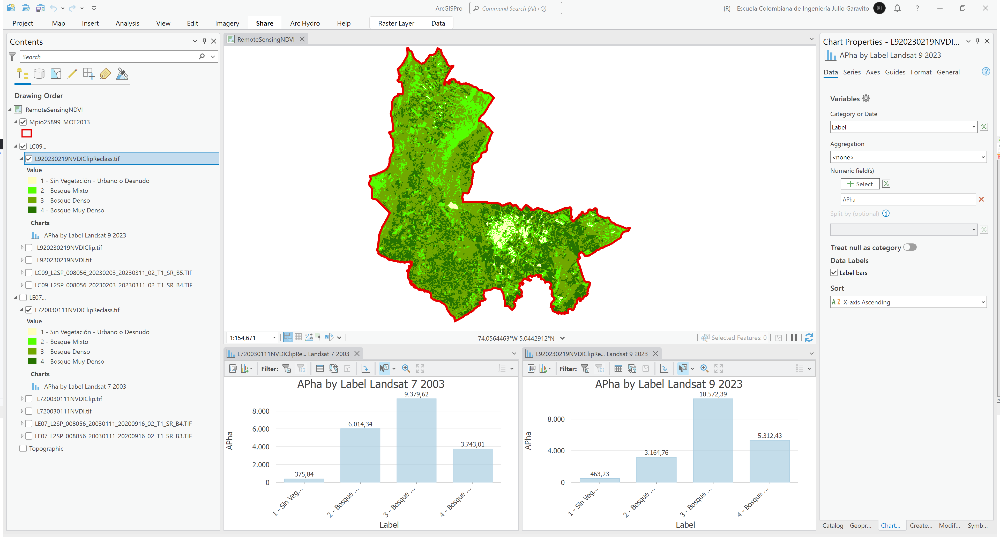

## Objetivos

* Obtener y evaluar coberturas de vegetación a partir del cálculo de índices.
* Evaluar y comparar coberturas con mapas de usos.

## Requerimientos

* [:mortar_board:Actividad](../TopoBasic/Readme.md): Conceptos básicos de topografía, fotogrametría y fotointerpretación.
* [:mortar_board:Actividad](../POTLayer/Readme.md): Inventario de información geo-espacial recopilada del POT y diccionario de datos.
* [:toolbox:Herramienta](https://www.esri.com/en-us/arcgis/products/arcgis-pro/overview): ESRI ArcGIS Pro 3.3.1 o superior.
* [:toolbox:Herramienta](https://qgis.org/): QGIS 3.38 o superior.

## 1. Cálculo manual del índice NDVI

El método Índice diferencial de vegetación normalizado (NDVI, por sus siglas en inglés) es un índice normalizado que permite generar una imagen que muestra el verdor (la biomasa relativa). Este índice aprovecha el contraste de las características de dos bandas de un dataset ráster multiespectral: las absorciones de pigmento de clorofila en la banda roja y la alta reflectividad de los materiales de las plantas en la banda NIR.[^1]

La ecuación del NDVI documentada y predeterminada es la siguiente:

`NDVI = ((NIR - Red)/(NIR + Red))`

* NIR = valores de píxel de la banda infrarroja cercana
* Rojo = valores de píxel de la banda roja

Este índice coloca los valores entre -1,0 y 1,0. [^2]

Utilizando las imágenes satelitales obtenidas en la primera actividad de este módulo realizar el siguiente procedimiento.

1. Abra el proyecto de ArcGIS Pro, creado previamente y desde el menú _Insert_ cree un nuevo mapa _New Map_, renombre como _RemoteSensingNDVI_ y establezca el CRS 9377. Agregue al mapa la capa del límite municipal obtenido Modelo de Ocupación Territorial - MOT disponible en la información recopilada del POT en la ruta `\file\gdb\SIGE.gdb\SIGE\Mpio25899_MOT2013` ajuste la simbología solo a contorno y agregue de Landsat 7 las bandas B4 y B3, para Landsat 9 agregue las bandas B5 y B4.

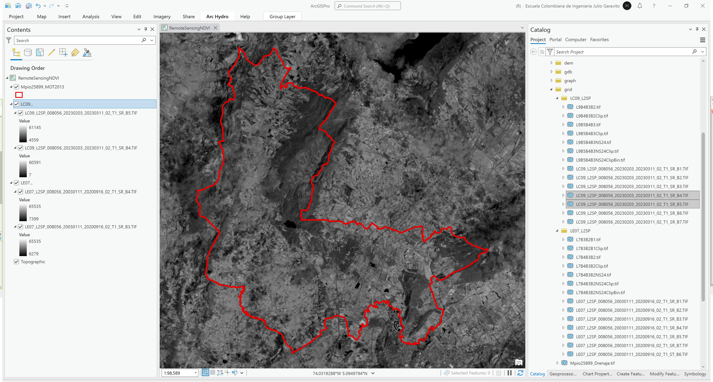

2. Utilizando la herramienta de geo-procesamiento _Image Analyst Tools / Raster Calculator_, calcule los mapas de índices para Landsat 7 y Landsat 9, utilice las siguientes expresiones y nombres de archivo:

* `\file\grid\LE07_L2SP\L720030111NDVI.tif`: expresión de algebra de mapas `(B4 - B3) / (B4 + B3)`
* `\file\grid\LC09_L2SP\L920230219NDVI.tif`: expresión de algebra de mapas `(B5 - B4) / (B5 + B4)`

> En las expresiones, reemplace B3, B4, B5 por los nombres de las imágenes y bandas correspondientes.

Para Landsat 7 podrá observar que se han obtenido valores entre -0.495 y 0.595  

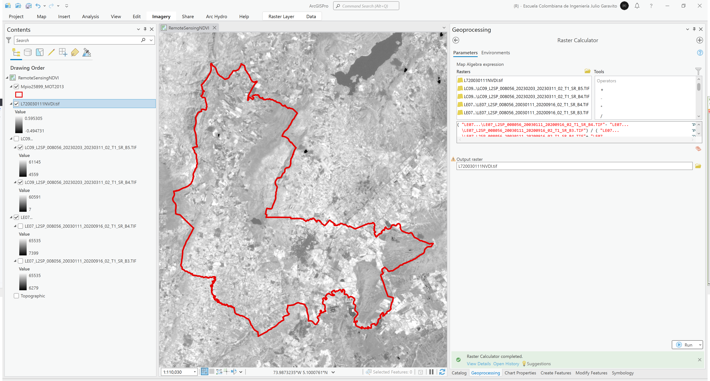

Para Landsat 9 podrá observar que se han obtenido valores entre -0.228 y 0.998

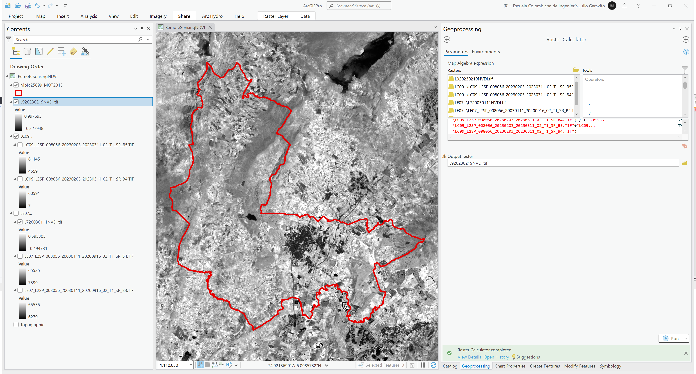

3. Utilizando la herramienta de geo-procesamiento _Data Management Tools / Clip Raster_, recorte las grilla NDVI hasta el límite municipal del MOT, nombre como `\file\grid\LE07_L2SP\L720030111NDVIClip.tif` y `\file\grid\LC09_L2SP\L920230219NDVIClip.tif`.

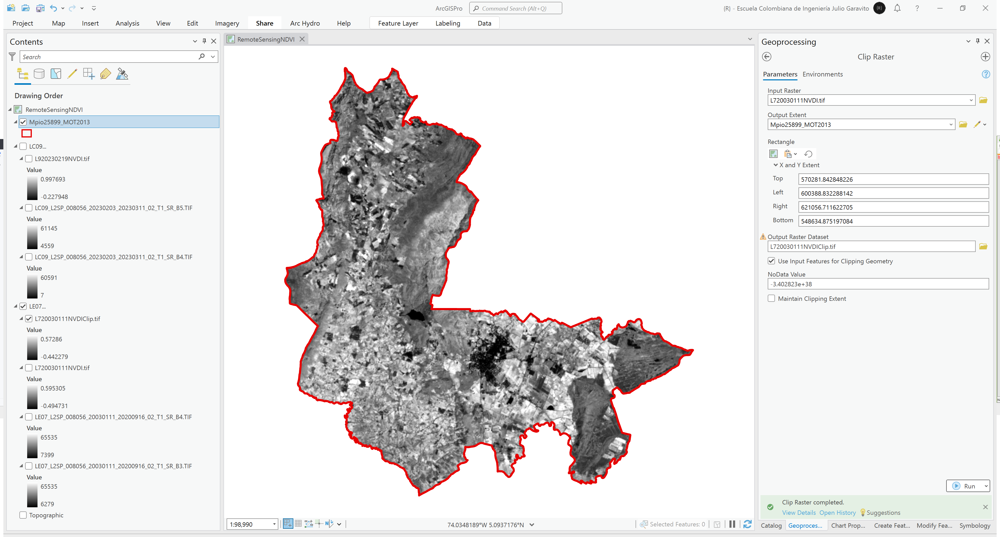

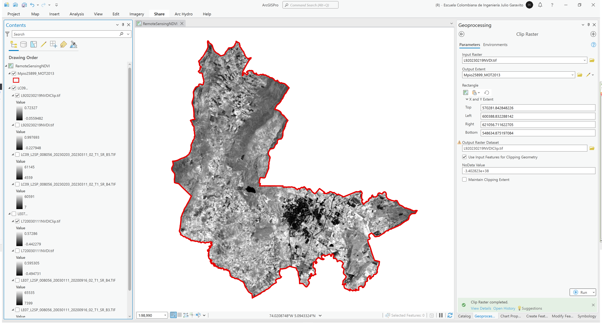

4. Utilizando la herramienta de geo-procesamiento _Spatial Analyst Tools / Reclassify_, reclasifique los mapas obtenidos en las siguientes clases, guarde como `\file\grid\LE07_L2SP\L720030111NDVIClipReclass.tif` y `\file\grid\LC09_L2SP\L920230219NDVIClipReclass.tif`, rotule y simbolice con los colores RGB indicados:

| Corte | Label                                 | RGB         |
|-------|---------------------------------------|-------------|
| 0.10  | 1 - Sin Vegetación - Urbano o Desnudo | 255,255,190 |
| 0.23  | 2 - Bosque Mixto                      | 85,255,0    |
| 0.35  | 3 - Bosque Denso                      | 112,168,0   |
| 1.00  | 4 - Bosque Muy Denso                  | 38,115,0    |

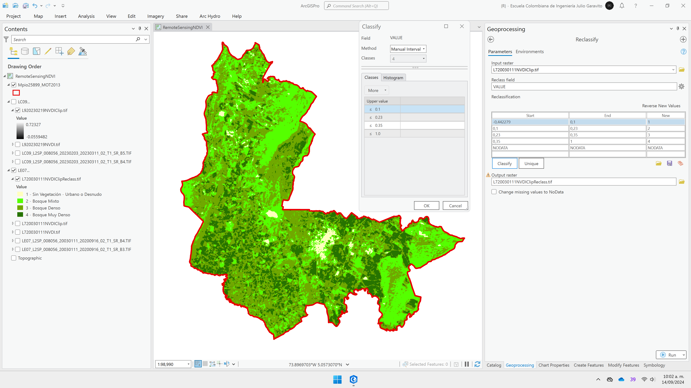

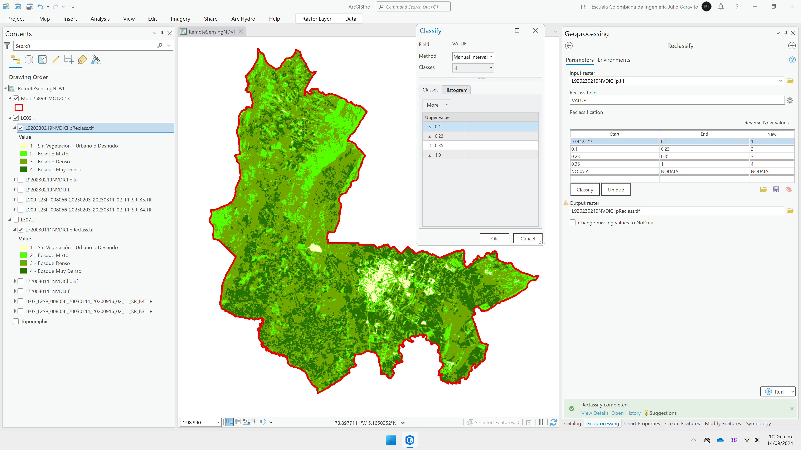

> Tenga en cuenta que los cuerpos de agua, zonas húmedas y zonas urbanas serán clasificadas en la clase 1 - Sin Vegetación - Urbano o Desnudo

5. En la tabla de atributos de las grillas de reclasificación, agregue un campo numérico doble para el cálculo del área en hectáreas a partir del número de celdas (Count * 30 * 30 /10000), nombre como `APha` y un campo de texto para el rótulo con el nombre `Label`.

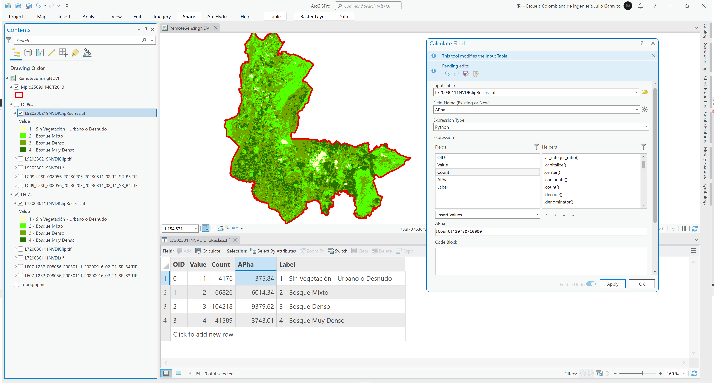

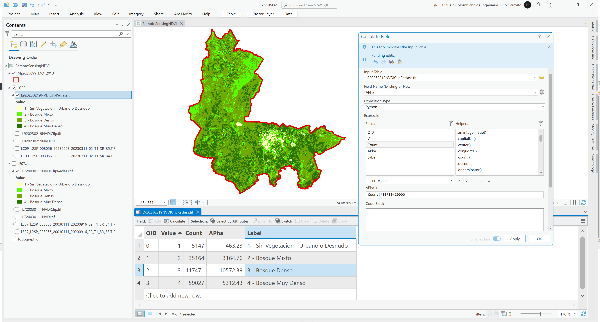

6. Desde la tabla de contenido y para cada mapa, cree gráficas de barras y evalúe la distribución de las áreas obtenidas. Podrá observar que la clase 1 correspondiente a sin vegetación, urbano o desnudo a aumentado de 375.84 hectáreas a 463.23 hectáreas y que la distribución de bosques ha cambiado en el tiempo.

## 2. Cálculo automático del índice NDVI

1. Utilizando la herramienta de geo-procesamiento _Data Management Tools / Composite Bands_, cree una composición de las bandas disponibles en Landsat 7, asegúrese de ingresar las bandas en el orden de secuencia B1 a B7. Guarde la composición como `\file\grid\LE07_L2SP\LE07_L2SP_Composite.TIF`. 

En la simbología, ajuste el orden de secuencia a `Band_3`, `Band_2` y `Band_1` y en el menú superior active las opciones de visualización de rango dinámico _DRA_. 

2. En la tabla de contenido, seleccione la composición `LE07_L2SP_Composite.TIF` y en el menú _Imagery_ seleccione la opción _Tools / Indices_, automáticamente será calculado este índice y será agregada al mapa la capa `NDVI_LE07_L2SP_Composite.TIF`. 

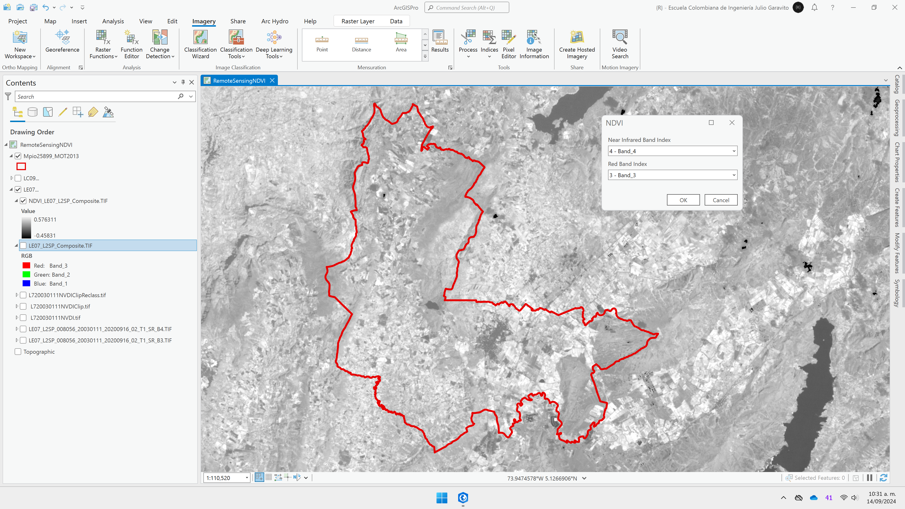

## 3. Cálculo de otros índices [^1]

Como observo en las opciones de _Imagery / Tools / Indices_, ArcGIS Pro permite el cálculo automático de los siguientes índices complementarios:

### 3.1. Vegetación y suelos

#### 3.1.1. SAVI

El método Índice de vegetación ajustado al suelo (SAVI, por sus siglas en inglés) es un índice de vegetación que intenta minimizar las influencias del brillo del suelo utilizando un factor de corrección de brillo del suelo. Esto con frecuencia se utiliza en regiones áridas en donde la cubierta de vegetación es baja y genera valores entre -1,0 y 1,0.

`SAVI = ((NIR - Rojo) / (NIR + Rojo + L)) x (1 + L)`

* NIR = valores de píxel de la banda infrarroja cercana
* Rojo = valores de píxel de la banda roja cercana
* L = cantidad de cobertura de vegetación verde

Si usa una lista delimitada por espacios, identificará las bandas NIR y roja e introducirá el valor L en el siguiente orden: NIR Roja L. Por ejemplo, 4 3 0,5.

> Referencia: Huete, A. R., 1988, "A soil-adjusted vegetation index (SAVI)," Remote Sensing of Environment, Vol. 25, 295–309.

#### 3.1.2. MSAVI

El método Índice de vegetación ajustada de suelo modificado (MSAVI2) minimiza el efecto del terreno desnudo en el SAVI.

`MSAVI2 = (1/2)*(2(NIR+1)-sqrt((2*NIR+1)2-8(NIR-Rojo)))`

* NIR = valores de píxel de la banda infrarroja cercana
* Rojo = valores de píxel de la banda roja

> Referencia: Qi, J. et al., 1994, "A modified soil vegetation adjusted index," Remote Sensing of Environment, Vol. 48, n.º 2, 119–126.

#### 3.1.3. TSAVI

El método Índice de vegetación ajustado de suelo transformado (TSAVI, por sus siglas en inglés) es un índice de vegetación que minimiza las influencias de brillo del suelo al asumir que la línea del suelo tiene una intercepción y pendiente arbitraria.

`TSAVI = (s * (NIR - s * Rojo - a)) / (a * NIR + Rojo - a * s + X * (1 + s2))`

* NIR = valores de píxel de la banda infrarroja cercana
* Rojo = valores de píxel de la banda roja
* s = la pendiente de la línea del suelo
* a = la intercepción de la línea del suelo
* X = un factor de ajuste que se establece para minimizar el ruido del suelo

> Referencia: Baret, F. y G. Guyot, 1991, "Potentials and limits of vegetation indices for LAI and APAR assessment," Remote Sensing of Environment, Vol. 35, 161–173.

#### 3.1.4. PVI

El método Índice de vegetación perpendicular (PVI, por sus siglas en inglés) es similar a un índice diferencial de vegetación; sin embargo, es sensible a las variaciones atmosféricas. Al utilizar este método para comparar imágenes, solo se debe utilizar en imágenes que se han corregido atmosféricamente.

`PVI = (NIR - a*Rojo - b) / (sqrt(1 + a2))`

* NIR = valores de píxel de la banda infrarroja cercana
* Rojo = valores de píxel de la banda roja
* a = pendiente de la línea de suelo
* b = gradiente de la línea del suelo

Este índice coloca los valores entre -1,0 y 1,0.

#### 3.1.5. VARI

El Índice de resistencia atmosféricamente visible (VARI) está diseñado para resaltar la vegetación en la parte visible del espectro, a la vez que mitiga las diferencias en la iluminación y los efectos atmosféricos. Resulta idóneo para las imágenes RGB o en color; utiliza las tres bandas de color.

`VARI = (Green - Red) / (Green + Red - Blue)`

* Verde = valores de píxel de la banda verde
* Rojo = valores de píxel de la banda roja
* Azul = valores de píxel de la banda azul

> Referencia: Gitelson, A., et al. "Vegetation and Soil Lines in Visible Spectral Space: A Concept and Technique for Remote Estimation of Vegetation Fraction." International Journal of Remote Sensing 23 (2002): 2537−2562.

### 3.2. Agua

#### 3.2.1. NDSI 

`NDSI = (Green - SWIR) / (Green + SWIR)`

* Verde = valores de píxel de la banda verde
* SWIR = valores de píxel de la banda infrarroja de onda corta

> Referencias:
>
> Wilson, E.H. y Sader, S.A., 2002, "Detection of forest harvest type using multiple dates of Landsat TM imagery." Remote Sensing of Environment, 80, pp. 385-396.
>
> Skakun, R.S., Wulder, M.A. y Franklin, S.E. (2003). "Sensitivity of the thematic mapper enhanced wetness difference index to detect mountain pine beetle red-attack damage". Remote Sensing of Environment, Vol. 86, pp. 433-443.
>
> Riggs, G., D. Hall y V. Salomonson. "A Snow Index for the Landsat Thematic Mapper and Moderate Resolution Imaging Spectrometer". Geoscience and Remote Sensing Symposium, IGARSS 94, Volumen 4: Surface and Atmospheric Remote Sensing: Technologies, Data Analysis, and Interpretation (1994), pp. 1942-1944.

#### 3.2.2. MNDWI 

El Índice de agua de diferencia normalizada modificado (MNDWI) utiliza las bandas verde y SWIR para realzar las entidades que se encuentran en mar abierto. También disminuye las entidades de área construidas que a menudo se correlacionan con el mar abierto en otros índices.

`MNDWI = (Green - SWIR) / (Green + SWIR)`

* Verde = valores de píxel de la banda verde
* SWIR = valores de píxel de la banda infrarroja de onda corta

> Referencia: Xu, H. "Modification of Normalised Difference Water Index (NDWI) to Enhance Open Water Features in Remotely Sensed Imagery". International Journal of Remote Sensing 27, No. 14 (2006): 3025-3033.

#### 3.2.3. NDMI 

El Índice de diferencia de humedad normalizado (NDMI) es sensible a los niveles de humedad de la vegetación. Se usa para monitorizar las sequías y los niveles de combustible en las áreas vulnerables a los incendios. Usa las bandas NIR y SWIR para crear una relación diseñada para mitigar la iluminación y los efectos atmosféricos.

`NDMI = (NIR - SWIR1)/(NIR + SWIR1)`

* NIR = valores de píxel de la banda infrarroja cercana
* SWIR1 = valores de píxel de la banda infrarroja de onda corta 1

> Referencias:
> 
> Wilson, E.H. y Sader, S.A., 2002, "Detection of forest harvest type using multiple dates of Landsat TM imagery." Remote Sensing of Environment, 80, pp. 385-396.
> Skakun, R.S., Wulder, M.A. y Franklin, S.E. (2003). "Sensitivity of the thematic mapper enhanced wetness difference index to detect mountain pine beetle red-attack damage". Remote Sensing of Environment, Vol. 86, pp. 433-443.

### 3.3. Geología

#### 3.3.1. Minerales arcillosos 

La relación de minerales arcillosos es una proporción entre las bandas SWIR1 y SWIR2. Esta relación aprovecha el hecho de que los minerales hídricos, como la arcilla o la alunita, absorben radiación en la parte de 2,0–2,3 micrones del espectro. Este índice atenúa los cambios de iluminación debidos al terreno, ya que se trata de una proporción.

`Ratio de minerales arcillosos = SWIR1 / SWIR2`

* SWIR1 = valores de píxel de la banda infrarroja de onda corta 1
* SWIR2 = valores de píxel de la banda infrarroja de onda corta 2

> Referencia: Dogan, H., 2009. "Mineral composite assessment of Kelkit River Basin in Turkey by means of remote sensing," Journal of Earth System Science, Vol. 118, 701-710.

#### 3.3.2. Minerales ferrosos 

La relación de minerales ferrosos resalta los minerales que contienen hierro. Usa la relación entre las bandas SWIR y NIR.

`Ratio de minerales ferrosos = SWIR / NIR`

* SWIR = valores de píxel de la banda infrarroja de onda corta
* NIR = valores de píxel de la banda infrarroja cercana

> Referencia: Segal, D. "Theoretical Basis for Differentiation of Ferric-Iron Bearing Minerals, Using Landsat MSS Data". Actas del Symposium for Remote Sensing of Environment, 2nd Thematic Conference on Remote Sensing for Exploratory Geology, Fort Worth, TX (1982): pp. 949-951.

#### 3.3.3. Óxido de hierro 

La relación de óxido de hierro es una proporción entre las longitudes de onda roja y azul. La presencia de filosilicatos con contenido limonítico y una alteración del óxido de hierro limonítico causan absorción en la banda azul y reflectancia en la banda roja. Esto hace que las áreas con una gran alteración de hierro brillen. La naturaleza de la relación permite que el índice atenúe las diferencias de iluminación causadas por las sombras del terreno.

`Ratio de óxido de hierro = rojo / azul`

* Rojo = valores de píxel de la banda roja
* Azul = valores de píxel de la banda azul

> Referencia: Segal, D. "Theoretical Basis for Differentiation of Ferric-Iron Bearing Minerals, Using Landsat MSS Data". Actas del Symposium for Remote Sensing of Environment, 2nd Thematic Conference on Remote Sensing for Exploratory Geology, Fort Worth, TX (1982): pp. 949-951.

### 3.4. Paisaje

#### 3.4.1. BAI 

El Índice de área calcinada (BAI) utiliza los valores de reflectancia de la parte roja y NIR del espectro para identificar las áreas del terreno afectadas por un incendio.

`BAI = 1/((0.1 -RED)^2 + (0.06 - NIR)^2)`

* Rojo = valores de píxel de la banda roja
* NIR = valores de píxel de la banda infrarroja cercana

> Referencia: Chuvieco, E., M. Pilar Martín y A. Palacios. "Assessment of Different Spectral Indices in the Red-Near-Infrared Spectral Domain for Burned Land Discrimination". Remote Sensing of Environment 112 (2002): 2381-2396.

#### 3.4.2. NBR 

El Índice de relación de calcinación normalizado (NBRI) utiliza las bandas NIR y SWIR para destacar las áreas calcinadas a la vez que mitiga las diferencias en la iluminación y los efectos atmosféricos. Las imágenes se deben corregir a los valores de reflectancia antes de utilizar este índice; consulte la función [Reflectancia aparente](https://pro.arcgis.com/es/pro-app/latest/help/analysis/raster-functions/apparent-reflectance-function.htm) para más información.

`NBR = (NIR - SWIR) / (NIR + SWIR)`

* NIR = valores de píxel de la banda infrarroja cercana
* SWIR = valores de píxel de la banda infrarroja de onda corta

> Referencia: Key, C. y N. Benson, N. "Landscape Assessment: Remote Sensing of Severity, the Normalized Burn Ratio; and Ground Measure of Severity, the Composite Burn Index." FIREMON: Fire Effects Monitoring and Inventory System, RMRS-GTR, Ogden, UT: Servicio forestal del USDA, Estación de investigación de las montañas Rocosas (2005).

#### 3.4.3. NDBI 

El Índice de áreas construidas de diferencia normalizada (NDBI) utiliza las bandas NIR y SWIR para resaltar las áreas construidas por el hombre. Se basa en una relación para mitigar los efectos de las diferencias de iluminación del terreno, así como los efectos atmosféricos.

`NDBI = (SWIR - NIR) / (SWIR + NIR)`

* SWIR = valores de píxel de la banda infrarroja de onda corta
* NIR = valores de píxel de la banda infrarroja cercana

> Referencia: Zha, Y., J. Gao y S. Ni. "Use of Normalized Difference Built-Up Index in Automatically Mapping Urban Areas from TM Imagery". International Journal of Remote Sensing 24, n.° 3 (2003): 583-594.

## 4. Análisis usando software libre - QGIS

Para el desarrollo de las actividades desarrolladas en esta clase, se pueden utilizar en QGIS las siguientes herramientas o geo-procesos:

| Proceso                                    | Procedimiento                                                                                                          |
|:-------------------------------------------|:-----------------------------------------------------------------------------------------------------------------------|
| Simbología                                 | Modificable desde las propiedades de la capa en la pestaña _Symbology_.                                                |
| Rotulado                                   | Modificable desde las propiedades de la capa en la pestaña _Labels_.                                                   |
| Calculadora ráster (Raster Calculator)     | Herramienta disponible en el _Processing Toolbox / GDAL / Raster miscellaneous / Raster calculator.                    |
| Recorte de imágenes ráster (Clip Raster)   | Herramienta disponible en el _Processing Toolbox / GDAL / Raster extraction / Clip raster by mask layer.               |
| Reclasificación de imágenes (Reclassify)   | Herramienta disponible en el _Processing Toolbox /Raster analysis / Reclassify by table.                               |
| Componer bandas ráster (Composite Bands)   | Herramienta disponible en el _Processing Toolbox / GDAL / Raster miscellaneous / Build virtual raster.                 |
| Cálculo de índices (NDVI, EVI)             | Utilizar el plugin [NDVI and EVI Index Calculator](https://plugins.qgis.org/plugins/ndvi_and_evi_index_calculator/).   |

Ejemplo rótulo en QGIS: `'A(ha): ' ||  round("AGha", 2) || '\n' || 'P (m): ' ||  round("PGm", 2) `

[:notebook:QGIS training manual](https://docs.qgis.org/3.34/en/docs/training_manual/)  
[:notebook:Herramientas comúnmente utilizadas en QGIS](../QGIS.md)

## Elementos requeridos en diccionario de datos

Agregue a la tabla resúmen generada en la actividad [Inventario de información geo-espacial recopilada del POT y diccionario de datos](../POTLayer/Readme.md), las capas generadas en esta actividad que se encuentran listadas a continuación:

| Nombre                        | Descripción                                                                                | Geometría   | Registros | 
|-------------------------------|--------------------------------------------------------------------------------------------|-------------|-----------| 
| L720030111NDVI.tif            | Mapa NDVI Landsat 7 2003 generado con algebra de mapas.                                    | (grid)      | n/a       | 
| L920230219NDVI.tif            | Mapa NDVI Landsat 9 2013 generado con algebra de mapas.                                    | (grid)      | n/a       | 
| L720030111NDVIClip.tif        | Mapa NDVI Landsat 7 2003 recortado hasta límite municipal.                                 | (grid)      | n/a       |
| L720030111NDVIClip.tif        | Mapa NDVI Landsat 7 2003 recortado hasta límite municipal.                                 | (grid)      | n/a       |
| L720030111NDVIClipReclass.tif | Mapa NDVI Landsat 7 2003 recortado hasta límite municipal con reclasificación en 4 clases. | (grid)      | n/a       |
| L920230219NDVIClipReclass.tif | Mapa NDVI Landsat 9 2023 recortado hasta límite municipal con reclasificación en 4 clases. | (grid)      | n/a       |
| LE07_L2SP_Composite.tif       | Composición de 7 bandas a partir de Landsat 7.                                             | (grid)      | n/a       |
| NDVI_LE07_L2SP_Composite.tif  | Mapa NDVI Landsat 7 2003 generado con herramienta de Indices.                              | (grid)      | n/a       |

> :bulb:Para funcionarios que se encuentran ensamblando el SIG de su municipio, se recomienda incluir y documentar estas capas en el Diccionario de Datos.

## Actividades de proyecto :triangular_ruler:

En la siguiente tabla se listan las actividades que deben ser desarrolladas y documentadas por cada grupo de proyecto en un único archivo de Adobe Acrobat .pdf. El documento debe incluir portada (indicando el caso de estudio, número de avance, nombre del módulo, fecha de presentación, nombres completos de los integrantes), numeración de páginas, tabla de contenido, lista de tablas, lista de ilustraciones, introducción, objetivo general, capítulos por cada ítem solicitado, conclusiones y referencias bibliográficas.

| Actividad     | Alcance                                                                                                                                                                                                                                                                                                                                                                                                                                             |
|:--------------|:----------------------------------------------------------------------------------------------------------------------------------------------------------------------------------------------------------------------------------------------------------------------------------------------------------------------------------------------------------------------------------------------------------------------------------------------------|
| Avance **P6** | Desarrolle las actividades ilustradas en esta clase y evalúe al menos 5 índices, incluído el NDVI en dos instantes de tiempo diferentes. Ilustre y explique las diferencias encontradas.                                                                                                                                                                                                                                                            | 
| Avance **P6** | Composiciones para identificar y delimitar áreas urbanas: utilizando los conceptos aprendidos en este módulo, realice una composición de bandas que permita obtener o marcar las celdas correspondientes a las zonas urbanas. Cree mapas binarizados, convierta a polígonos, realice suavizado perimetral y compare el tamaño del área urbana entre dos instantes de tiempo. Este análisis puede ser realizado a través del cálculo de índices.     | 
| Avance **P6** | Utilizando sus propias palabras, explique la utilidad de los indices investigados en los diferentes campos de la ingeniería o la arquitectura y su uso y aplicabilidad en estudios de ordenamiento territorial.                                                                                                                                                                                                                                     | 
| Avance **P6** | Compare los mapas de vegetación obtenidos con el mapa de usos potenciales del suelo del IGAC evaluado en el módulo 4, explique si existe alguna correspondencia en sus límites internos.                                                                                                                                                                                                                                                            | 
| Avance **P6** | :compass:Mapa digital impreso _P6-05: Mapa de comparación NDVI 2003 vs. 2023 con cuadro de áreas._ Incluir análisis cuantitativo y cualitativo de los valores obtenidos con tabla de comparaciones 2003 vs. 2023. Embebido dentro del informe final como una imágen y referenciados como anexo.                                                                                                                                                  | 
| Avance **P6** | :compass:Mapa digital impreso _P6-06: Mapa de comparación Índice 1 entre 2003 vs. 2023 con cuadro de áreas._ Incluir análisis cuantitativo y cualitativo de los valores obtenidos con tabla de comparaciones 2003 vs. 2023. Embebido dentro del informe final como una imágen y referenciados como anexo.                                                                                                                                        | 
| Avance **P6** | :compass:Mapa digital impreso _P6-07: Mapa de comparación Índice 2 entre 2003 vs. 2023 con cuadro de áreas._ Incluir análisis cuantitativo y cualitativo de los valores obtenidos con tabla de comparaciones 2003 vs. 2023. Embebido dentro del informe final como una imágen y referenciados como anexo.                                                                                                                                        | 
| Avance **P6** | :compass:Mapa digital impreso _P6-08: Mapa de comparación Índice 3 entre 2003 vs. 2023 con cuadro de áreas._ Incluir análisis cuantitativo y cualitativo de los valores obtenidos con tabla de comparaciones 2003 vs. 2023. Embebido dentro del informe final como una imágen y referenciados como anexo.                                                                                                                                        | 
| Avance **P6** | :compass:Mapa digital impreso _P6-09: Mapa de comparación Índice 4 entre 2003 vs. 2023 con cuadro de áreas._ Incluir análisis cuantitativo y cualitativo de los valores obtenidos con tabla de comparaciones 2003 vs. 2023. Embebido dentro del informe final como una imágen y referenciados como anexo.                                                                                                                                        | 
| Avance **P6** | :compass:Mapa digital impreso _P6-10: Mapa de comparación áreas urbanas entre 2003 vs. 2023 con cuadro de áreas._ Incluir análisis cuantitativo y cualitativo de los valores obtenidos con tabla de comparaciones 2003 vs. 2023. Embebido dentro del informe final como una imágen y referenciados como anexo.                                                                                                                                   | 
| Avance **P6** | En una tabla y al final del informe de avance de esta entrega, indique el detalle de las sub-actividades realizadas por cada integrante de su grupo. Para actividades que no requieren del desarrollo de elementos de avance, indicar si realizo la lectura de la guía de clase y las lecturas indicadas al inicio en los requerimientos. Utilice las siguientes columnas: Nombre del integrante, Actividades realizadas, Tiempo dedicado en horas. | 

> No es necesario presentar un documento de avance independiente, todos los avances de proyecto de este módulo se integran en un único documento.
> 
> En el informe único, incluya un numeral para esta actividad y sub-numerales para el desarrollo de las diferentes sub-actividades, siguiendo en el mismo orden de desarrollo presentado en esta actividad.

## Referencias

* https://pro.arcgis.com/es/pro-app/latest/help/data/imagery/indices-gallery.htm
* https://support.micasense.com/hc/en-us/articles/226531127-Creating-agricultural-indices-NDVI-NDRE-in-QGIS
* https://www.usgs.gov/landsat-missions/landsat-surface-reflectance-derived-spectral-indices
* https://eos.com/make-an-analysis/ndmi/?form=MG0AV3
* https://www.usgs.gov/landsat-missions/normalized-difference-moisture-index

## Control de versiones

| Versión    | Descripción                                                | Autor                                      | Horas |
|------------|:-----------------------------------------------------------|--------------------------------------------|:-----:|
| 2024.04.05 | Versión inicial con alcance de la actividad                | [rcfdtools](https://github.com/rcfdtools)  |   4   |
| 2024.09.14 | Investigación y documentación para caso de estudio general | [rcfdtools](https://github.com/rcfdtools)  |   4   |
| 2024.09.15 | Complementación de índices                                 | [rcfdtools](https://github.com/rcfdtools)  |   4   |

_R.SIGE es de uso libre para fines académicos, conoce nuestra licencia, cláusulas, condiciones de uso y como referenciar los contenidos publicados en este repositorio, dando [clic aquí](LICENSE.md)._

_¡Encontraste útil este repositorio!, apoya su difusión marcando este repositorio con una ⭐ o síguenos dando clic en el botón Follow de [rcfdtools](https://github.com/rcfdtools) en GitHub._

| [:arrow_backward: Anterior](../RemoteSensingBinary/Readme.md) | [:house: Inicio](../../README.md) | [:beginner: Ayuda / Colabora](https://github.com/rcfdtools/R.SIGE/discussions/39) | [Siguiente :arrow_forward:](../RemoteSensingERA5/Readme.md) |
|---------------------------------------------------------------|-----------------------------------|-----------------------------------------------------------------------------------|-------------------------------------------------------------|

[^1]: https://pro.arcgis.com/es/pro-app/latest/help/data/imagery/indices-gallery.htm
[^2]: https://pro.arcgis.com/es/pro-app/latest/help/analysis/raster-functions/ndvi-function.htm