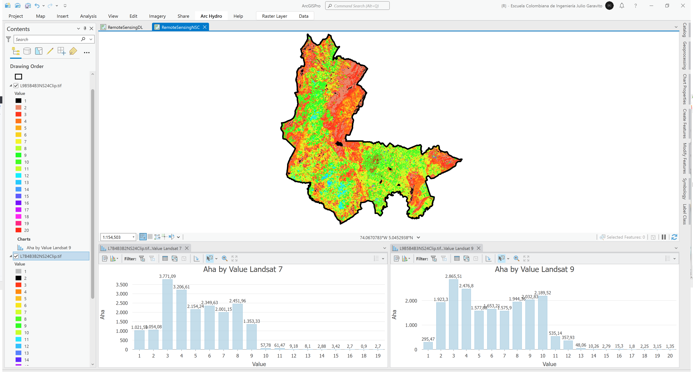

# Clasificación no supervisada ISO Cluster
Keywords: `iso-cluster-unsupervised-classification` `clip-raster`

A partir de las composiciones Landsat 7 B4B3B2 y Landsat 9 B5B4B3 recortadas hasta el límite del modelo de ocupación territorial - MOT, realizar clasificación no supervisada en 24 clases. Calcule y compare las áreas por clase en hectáreas hasta el límite municipal. Considerar que en el mapa de clasificación no supervisada a partir de datos Landsat 7, los cuerpos de agua principales han sido marcados con la clase 2 y en Landsat 9 se encuentran en la clase 1. Explique las diferencias principales encontradas y las diferencias de clasificación en la zona urbana.

## Objetivos

* Reclasificar composiciones de imágenes satelitales en 24 clases.
* Identificar clases correspondientes a cuerpos de agua y comparar las diferencias entre Landsat 7 2003 vs. Landsat 9 2023.

## Requerimientos

* [:mortar_board:Actividad](../TopoBasic/Readme.md): Conceptos básicos de topografía, fotogrametría y fotointerpretación.
* [:mortar_board:Actividad](../POTLayer/Readme.md): Inventario de información geo-espacial recopilada del POT y diccionario de datos.
* [:toolbox:Herramienta](https://www.esri.com/en-us/arcgis/products/arcgis-pro/overview): ESRI ArcGIS Pro 3.3.1 o superior.
* [:toolbox:Herramienta](https://qgis.org/): QGIS 3.38 o superior.

## 1. Procedimiento general en ArcGIS Pro

1. Abra el proyecto de ArcGIS Pro, creado previamente y desde el menú _Insert_ cree un nuevo mapa _New Map_, renombre como _RemoteSensingNSC_ y establezca el CRS 9377. Agregue al mapa la capa del límite municipal obtenido Modelo de Ocupación Territorial - MOT disponible en la información recopilada del POT en la ruta `\file\gdb\SIGE.gdb\SIGE\Mpio25899_MOT2013` ajuste la simbología solo a contorno y agregue las composiciones `L7B4B3B2.tif` y `L9B5B4B3.tif` generadas en la actividad anterior.  

2. Utilizando la herramienta de geo-procesamiento _Spatial Analyst Tools / Iso Cluster Unsupervised Classification_, cree mapas de clasificación no supervisada en 24 clases para las  composiciones Landsat 7 y Landsat 9. Utilice como parámetros de entrada  `Clases: 24`, `Minimun class size: 20` y `Sample interval: 10`. Guarde los archivos resultantes como `\file\grid\LE07_L2SP\L7B4B3B2NS24.tif` y `\file\grid\LC09_L2SP\L9B5B4B3NS24.tif`.

> Para la aplicación de la clasificación no supervisada se recomienda utilizar toda la extensión de la imagen debido a que aparecen varios embalses y cuerpos de agua principales que ayudan en la generación de las firmas espectrales. Considerar que en el mapa de clasificación no supervisada a partir de datos Landsat 7, los cuerpos de agua principales han sido marcados con la clase 2 y en Landsat 9 se encuentran en la clase 1.

3. Utilizando la herramienta de geo-procesamiento _Data Management Tools / Clip Raster_, recorte las imágenes reclasificadas hasta el límite municipal del MOT, nombre como `\file\grid\LE07_L2SP\L7B4B3B2NS24Clip.tif` y `\file\grid\LC09_L2SP\L9B5B4B3NS24Clip.tif`.

4. Abra la tabla de atributos de las tablas asociadas a las imágenes de reclasificación, agregue un campo numérico doble con el nombre `Aha` y calcule las áreas correspondientes a cada clase.

> Para el cálculo de áreas por clase en hectáreas utilizar la expresión: ([Count] * 30 * 30) / 10000.

> Convertir las imágenes ráster a polígonos en caso de que no pueda ser consultada la tabla raster, herramienta _Raster to Polygon_.

5. Cree dos gráficos de barras a partir de los códigos de valores y las áreas calculadas. Podrá observar que los cuerpos de agua identificados en Landsat 7 corresponden a 1054.08 hectáreas y en Landsat 9 a 295.47 hectáreas. Las diferencias se deben a la calidad en la captura de la información de los sensores L9. 

## 2. Análisis usando software libre - QGIS

Para el desarrollo de las actividades desarrolladas en esta clase, se pueden utilizar en QGIS las siguientes herramientas o geo-procesos:

| Proceso                                                                                   | Procedimiento                                                                                            |
|:------------------------------------------------------------------------------------------|:---------------------------------------------------------------------------------------------------------|
| Simbología                                                                                | Modificable desde las propiedades de la capa en la pestaña _Symbology_.                                  |
| Clasificación no supervisada de imágenes ráster (Iso Cluster Unsupervised Classification) | Utilizar el plugin [Unsupervised Classifier](https://plugins.qgis.org/plugins/unsupervised_classifier/). |

Ejemplo rótulo en QGIS: `'A(ha): ' ||  round("AGha", 2) || '\n' || 'P (m): ' ||  round("PGm", 2) `

[:notebook:QGIS training manual](https://docs.qgis.org/3.34/en/docs/training_manual/)  
[:notebook:Herramientas comúnmente utilizadas en QGIS](../QGIS.md)

## Elementos requeridos en diccionario de datos

Agregue a la tabla resúmen generada en la actividad [Inventario de información geo-espacial recopilada del POT y diccionario de datos](../POTLayer/Readme.md), las capas generadas en esta actividad que se encuentran listadas a continuación:

| Nombre               | Descripción                                                                                              | Geometría  | Registros | 
|----------------------|----------------------------------------------------------------------------------------------------------|------------|-----------| 
| L7B4B3B2NS24.tif     | Grilla general de clasificación no supervisada Landsat 7 en 24 clases.                                   | (grid)     | n/a       | 
| L9B5B4B3NS24.tif     | Grilla general de clasificación no supervisada Landsat 9 en 24 clases.                                   | (grid)     | n/a       | 
| L7B4B3B2NS24Clip.tif | Grilla general de clasificación no supervisada Landsat 7 en 24 clases recortada hasta el límite del MOT. | (grid)     | n/a       | 
| L9B5B4B3NS24Clip.tif | Grilla general de clasificación no supervisada Landsat 9 en 24 clases recortada hasta el límite del MOT. | (grid)     | n/a       | 

> :bulb:Para funcionarios que se encuentran ensamblando el SIG de su municipio, se recomienda incluir y documentar estas capas en el Diccionario de Datos.

## Actividades de proyecto :triangular_ruler:

En la siguiente tabla se listan las actividades que deben ser desarrolladas y documentadas por cada grupo de proyecto en un único archivo de Adobe Acrobat .pdf. El documento debe incluir portada (indicando el caso de estudio, número de avance, nombre del módulo, fecha de presentación, nombres completos de los integrantes), numeración de páginas, tabla de contenido, lista de tablas, lista de ilustraciones, introducción, objetivo general, capítulos por cada ítem solicitado, conclusiones y referencias bibliográficas.

| Actividad     | Alcance                                                                                                                                                                                                                                                                                                                                                                                                                                             |
|:--------------|:----------------------------------------------------------------------------------------------------------------------------------------------------------------------------------------------------------------------------------------------------------------------------------------------------------------------------------------------------------------------------------------------------------------------------------------------------|
| Avance **P6** | Realice los análisis de clasificación no supervisada presentados en esta actividad y presente un análisis descriptivo de las diferencias encontradas en los cuerpos de agua identificados.                                                                                                                                                                                                                                                          | 
| Avance **P6** | :compass:Mapa digital impreso _P6-03: Mapa de comparación de clasificación no supervisada 2003 vs. 2023 con tabla de resultados._ Incluir texto descriptivo de diferencias encontradas. Embebido dentro del informe final como una imágen y referenciados como anexo.                                                                                                                                                                            | 
| Avance **P6** | En una tabla y al final del informe de avance de esta entrega, indique el detalle de las sub-actividades realizadas por cada integrante de su grupo. Para actividades que no requieren del desarrollo de elementos de avance, indicar si realizo la lectura de la guía de clase y las lecturas indicadas al inicio en los requerimientos. Utilice las siguientes columnas: Nombre del integrante, Actividades realizadas, Tiempo dedicado en horas. | 

> No es necesario presentar un documento de avance independiente, todos los avances de proyecto de este módulo se integran en un único documento.
> 
> En el informe único, incluya un numeral para esta actividad y sub-numerales para el desarrollo de las diferentes sub-actividades, siguiendo en el mismo orden de desarrollo presentado en esta actividad.

## Referencias

* https://pro.arcgis.com/en/pro-app/latest/tool-reference/spatial-analyst/iso-cluster-unsupervised-classification.htm
* https://pro.arcgis.com/en/pro-app/latest/tool-reference/data-management/clip.htm

## Control de versiones

| Versión    | Descripción                                                | Autor                                      | Horas  |
|------------|:-----------------------------------------------------------|--------------------------------------------|:------:|
| 2024.04.03 | Versión inicial con alcance de la actividad                | [rcfdtools](https://github.com/rcfdtools)  |   4    |
| 2024.09.13 | Investigación y documentación para caso de estudio general | [rcfdtools](https://github.com/rcfdtools)  |   4    |

_R.SIGE es de uso libre para fines académicos, conoce nuestra licencia, cláusulas, condiciones de uso y como referenciar los contenidos publicados en este repositorio, dando [clic aquí](LICENSE.md)._

_¡Encontraste útil este repositorio!, apoya su difusión marcando este repositorio con una ⭐ o síguenos dando clic en el botón Follow de [rcfdtools](https://github.com/rcfdtools) en GitHub._

| [:arrow_backward: Anterior](../RemoteSensingDL/Readme.md) | [:house: Inicio](../../README.md) | [:beginner: Ayuda / Colabora](https://github.com/rcfdtools/R.SIGE/discussions/37) | [Siguiente :arrow_forward:](../RemoteSensingBinary/Readme.md) |
|-----------------------------------------------------------|-----------------------------------|-----------------------------------------------------------------------------------|---------------------------------------------------------------|

[^1]: 