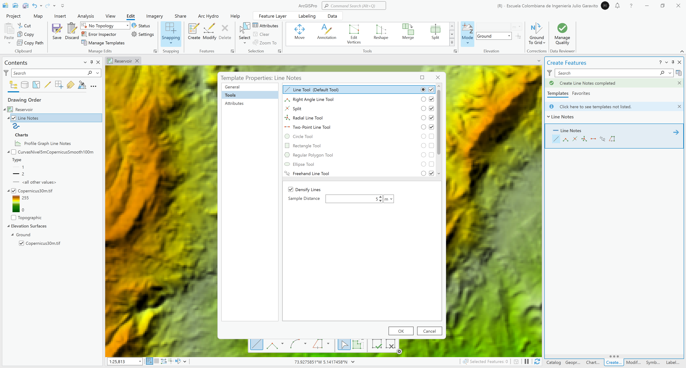
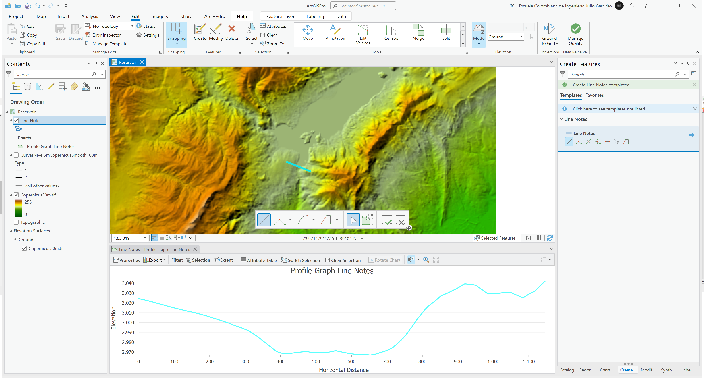
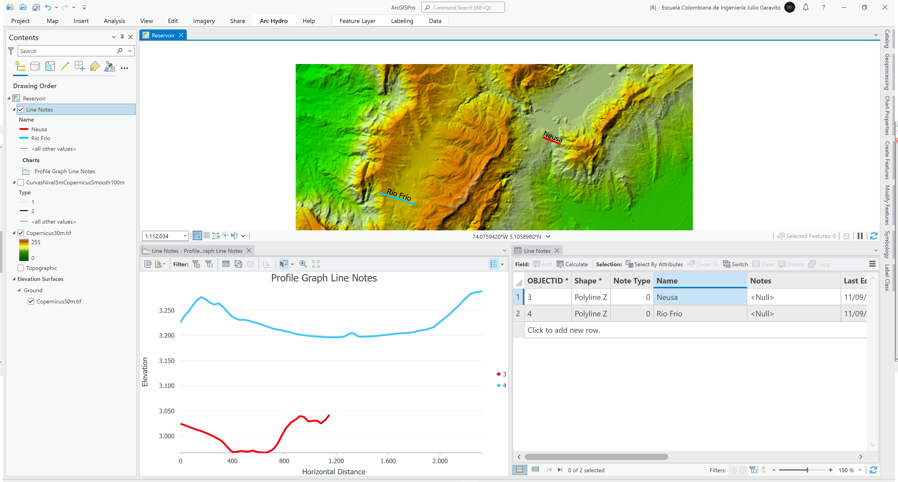
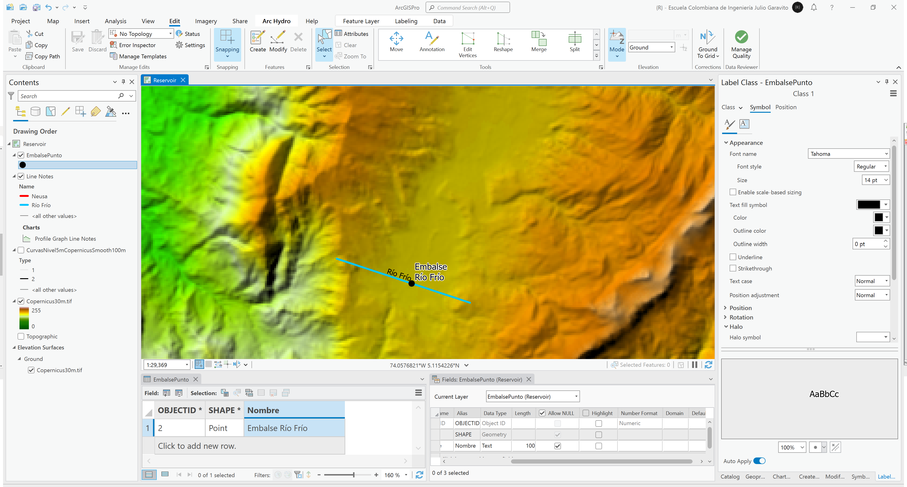
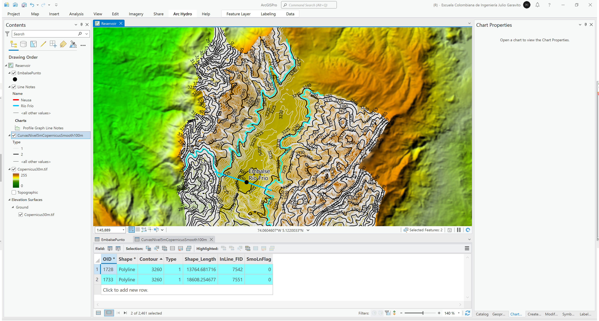
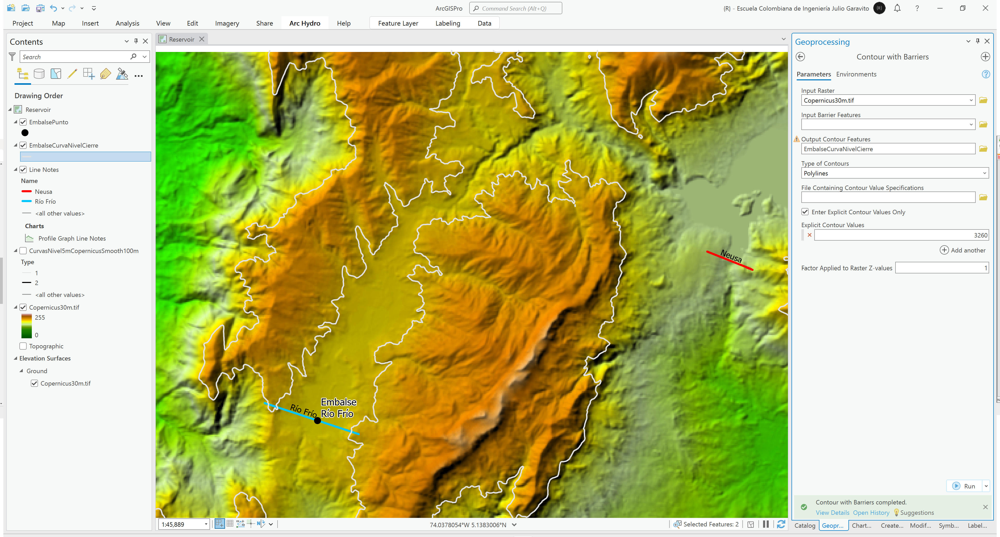
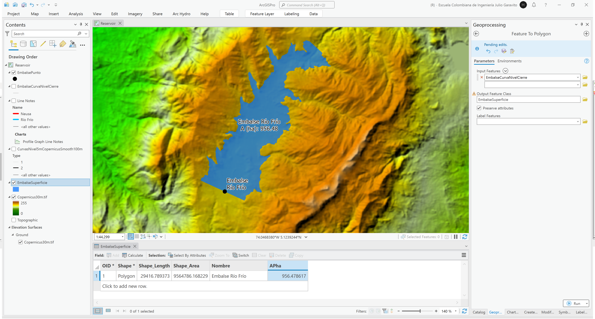

# Estudio geográfico de embalses
Keywords: `reservoir` `volume` `surface` `area`

A partir del modelo de terreno ESA Copernicus, identifique dentro de la zona de estudio, un área hidrográfica que permita crear un embalse, presente los siguientes elementos y análisis: punto de localización de pantalla de presa, linea de corona para una presa de al menos 5 metros de altura, curva de nivel de cierre y polígono de superficie o extensión máxima de lámina de agua, cálculo de curvas de elevación almacenamiento y elevación área.

## Objetivos

* Identificar zonas potenciales de embalsamiento.
* Crear y evaluar el volumen y superficie de un cuerpo de agua embalsado.

## Requerimientos

* [:mortar_board:Actividad](../TopoBasic/Readme.md): Conceptos básicos de topografía, fotogrametría y fotointerpretación.
* [:mortar_board:Actividad](../POTLayer/Readme.md): Inventario de información geo-espacial recopilada del POT y diccionario de datos.
* [:mortar_board:Actividad](../DEMSatellite/Readme.md): Modelo digital de elevación - DEM a partir de sensores remotos satelitales.
* [:toolbox:Herramienta](https://www.esri.com/en-us/arcgis/products/arcgis-pro/overview): ESRI ArcGIS Pro 3.3.1 o superior.
* [:toolbox:Herramienta](https://qgis.org/): QGIS 3.38 o superior.

## 1. Procedimiento general en ArcGIS Pro

1. Abra el proyecto de ArcGIS Pro, creado previamente y desde el menú _Insert_ cree un nuevo mapa _New Map_, renombre como _Reservoir_ y establezca el CRS 9377. Agregue al mapa el modelo digital de elevación Copernicus desde la ruta `\file\dem\Copernicus\Copernicus30m.tif` ajuste la simbología a sombreado de relieve con la paleta _Multipart Color Scheme_ y agregue las curvas de nivel generadas previamente en este módulo del curso que se encuentran en `\file\gdb\SIGE.gdb\SIGE\CurvasNivel5mCopernicusSmooth100m` simbolizando por categorías utilizando el clasificador `Type`.  

2. Para la localización de zonas embalsables, visualmente búsque una confinada por montañas que permita generar un cuerpo de agua. Tome como referencia el cuerpo de agua del Embalse Neusa localizado en la zona nor-oriental del DEM, podrá observar que alrededor de este existe un sistema montañoso y una zona de cierre. Desde el menú _Map / Add Layer / Elevation Source Layer_, defina como modelo de elevación de terreno el DEM de Copernicus, luego desde el menú _Insert / Layer Templates / Line Map Notes_, cree una capa de líneas de muestreo.

3. Desde el menú _Edit / Features / Create_, active el modo de creación de entidades y dando botón derecho en _Line Notes_ del panel derecho, acceda a las propiedades y defina en la pestaña Tools densificación de líneas cada 5 metros. En la parte superior derecha del menú _Edit / Elevation_ seleccione en modo de elevación _Surface / Ground_

4. Acérquese al Embalse Neusa y cree una línea de muestreo a lo largo de la pantalla de la presa y hasta los laterales de la zona montañosa. Luego desde la tabla de contenidos y desde la capa _Line Notes_, cree una gráfica de perfil.

> La primera línea trazada no realizará la densificación correcta de las líneas cada 5 metros, elimínela y vuelva a trazarla.

5. Ahora, para su zona de estudio, identifique una zona embalsable y trace una línea de muestreo donde podrá ubicarse la presa. Abra la tabla de atributos y asigne nombres a los ejes trazados, simbolice con dos colores diferentes y vuelva a crear la gráfica de perfil. Como puede observar, la coron del embalse del Neusa se encuentra a una elevación aproximada de 2970 m.s.n.m y la cota de fondo del embalse hipotético del Río Frío se encuentra en una cota cercana a los 3200 m.s.n.m. 

6. Dentro de la base de datos geográfica del proyecto y en el dataset SIGE, cre una capa 2D para la localización del punto central de localización de la pantalla del embalse Río Frío, nombre la capa como `EmbalsePunto`, agregue un campo para el nombre y cree el punto de localización.

7. Active y rotule las curvas de nivel e identifique una curva que permita confinar la posible lámina de agua de este cuerpo de agua, para ejemplo seleccionaremos la curva en la cota 3260 m.s.n.m.

8. Utilizando la herramienta de geo-procesamiento _3D Analyst / Contour with Barriers_ obtenga la curva de nivel 3260 m.s.n.m, nombre la capa resultante como `\file\gdb\SIGE.gdb\SIGE\EmbalseCurvaNivelCierre`. Podrá observar que en la zona norte, la curva no tiene un cierre completo y que parte de la divisoria norte también drena al Embalse Neusa por lo que será necesario crear manualmente un cierre en esta zona. 

9. Edite la curva de nivel y cree una poli-línea que delimite el cuerpo de agua a embalsar. 

> Será necesario eliminar las demás líneas de curvas de nivel con la misma cota fuera de la zona a embalsar y dejar únicamente una entidad. Utilice las herramientas de edición Slip y Merge para el ajuste de la línea perimetral.'

10. Utilizando la herramienta de geo-procesamiento `Data Management Tools / Feature to Polygon`, convierta la línea de delimitación en un polígono que representa la superficie del cuerpo de agua a embalsar, nombre como `\file\gdb\SIGE.gdb\SIGE\EmbalseSuperficie` y calcule en un campo de atributos el área planar en hectáreas.

Rótulo Arcade: `$feature.Nombre + "\nA (ha): " + Round($feature.APha, 2)`

11. Utilizando la herramienta de geo-procesamiento `Spatial Analyst Tools / Storage Capacity`, genere las curvas de elevación-almacenamiento y elevación área cada 1 metro de elevación, nombre la tabla resultante como `\file\gdb\SIGE.gdb\EmbalseStorageCapacity` y grafique. Como observa en las gráficas, el posible volúmen almacenado corresponde a 302246374.36 m³ o 302.25 hectómetros cúbicos.

## 2. Análisis usando software libre - QGIS

Para el desarrollo de las actividades desarrolladas en esta clase, se pueden utilizar en QGIS las siguientes herramientas o geo-procesos:

| Proceso                                 | Procedimiento                                                                                     |
|:----------------------------------------|:--------------------------------------------------------------------------------------------------|
| Simbología                              | Modificable desde las propiedades de la capa en la pestaña _Symbology_.                           |
| Rotulado                                | Modificable desde las propiedades de la capa en la pestaña _Labels_.                              |
| Curvas hipsométricas (Storage Capacity) | Herramienta disponible en el _Processing Toolbox / Raster tterrain analysis / Hypsometric curves. |

Ejemplo rótulo en QGIS: `'A(ha): ' ||  round("AGha", 2) || '\n' || 'P (m): ' ||  round("PGm", 2) `

[:notebook:QGIS training manual](https://docs.qgis.org/3.34/en/docs/training_manual/)  
[:notebook:Herramientas comúnmente utilizadas en QGIS](../QGIS.md)

## Elementos requeridos en diccionario de datos

Agregue a la tabla resúmen generada en la actividad [Inventario de información geo-espacial recopilada del POT y diccionario de datos](../POTLayer/Readme.md), las capas generadas en esta actividad que se encuentran listadas a continuación:

| Nombre                           | Descripción                                                                                                                  | Geometría   | Registros | 
|----------------------------------|------------------------------------------------------------------------------------------------------------------------------|-------------|-----------| 
|                                  |                                                                                                                              | Polígono 2D | 14        | 
|                                  |                                                                                                                              | Polígono 2D | 14        | 
|                                  |                                                                                                                              | Polígono 2D | 14        | 

> :bulb:Para funcionarios que se encuentran ensamblando el SIG de su municipio, se recomienda incluir y documentar estas capas en el Diccionario de Datos.

## Actividades de proyecto :triangular_ruler:

En la siguiente tabla se listan las actividades que deben ser desarrolladas y documentadas por cada grupo de proyecto en un único archivo de Adobe Acrobat .pdf. El documento debe incluir portada (indicando el caso de estudio, número de avance, nombre del módulo, fecha de presentación, nombres completos de los integrantes), numeración de páginas, tabla de contenido, lista de tablas, lista de ilustraciones, introducción, objetivo general, capítulos por cada ítem solicitado, conclusiones y referencias bibliográficas.

| Actividad     | Alcance                                                                                                                                                                                                                                                                                                                                                                                                                                             |
|:--------------|:----------------------------------------------------------------------------------------------------------------------------------------------------------------------------------------------------------------------------------------------------------------------------------------------------------------------------------------------------------------------------------------------------------------------------------------------------|
| Avance **P5** | Esta actividad no requiere del desarrollo de elementos en el avance del proyecto final, los contenidos son evaluados en el quiz de conocimiento y habilidad.                                                                                                                                                                                                                                                                                        | 
| Avance **P5** | :compass:Mapa digital impreso _P3-1: xxxx_ Incluir xxxxx. Embebido dentro del informe final como una imágen y referenciados como anexo.                                                                                                                                                                                                                                                                                                          | 
| Avance **P5** | En una tabla y al final del informe de avance de esta entrega, indique el detalle de las sub-actividades realizadas por cada integrante de su grupo. Para actividades que no requieren del desarrollo de elementos de avance, indicar si realizo la lectura de la guía de clase y las lecturas indicadas al inicio en los requerimientos. Utilice las siguientes columnas: Nombre del integrante, Actividades realizadas, Tiempo dedicado en horas. | 

> No es necesario presentar un documento de avance independiente, todos los avances de proyecto de este módulo se integran en un único documento.
> 
> En el informe único, incluya un numeral para esta actividad y sub-numerales para el desarrollo de las diferentes sub-actividades, siguiendo en el mismo orden de desarrollo presentado en esta actividad.

## Referencias

* https://docs.qgis.org/3.34/en/docs/user_manual/processing_algs/qgis/rasterterrainanalysis.html#hypsometric-curves
* https://pro.arcgis.com/en/pro-app/latest/tool-reference/spatial-analyst/storage-capacity.htm

## Control de versiones

| Versión    | Descripción                                                | Autor                                      | Horas |
|------------|:-----------------------------------------------------------|--------------------------------------------|:-----:|
| 2024.02.24 | Versión inicial con alcance de la actividad                | [rcfdtools](https://github.com/rcfdtools)  |   4   |
| 2024.06.27 | Investigación y documentación para caso de estudio general | [rcfdtools](https://github.com/rcfdtools)  |   8   |

_R.SIGE es de uso libre para fines académicos, conoce nuestra licencia, cláusulas, condiciones de uso y como referenciar los contenidos publicados en este repositorio, dando [clic aquí](LICENSE.md)._

_¡Encontraste útil este repositorio!, apoya su difusión marcando este repositorio con una ⭐ o síguenos dando clic en el botón Follow de [rcfdtools](https://github.com/rcfdtools) en GitHub._

| [:arrow_backward: Anterior](../xxxx) | [:house: Inicio](../../README.md) | [:beginner: Ayuda / Colabora](https://github.com/rcfdtools/R.SIGE/discussions/99999) | [Siguiente :arrow_forward:]() |
|---------------------|-------------------|---------------------------------------------------------------------------|---------------|

[^1]: 